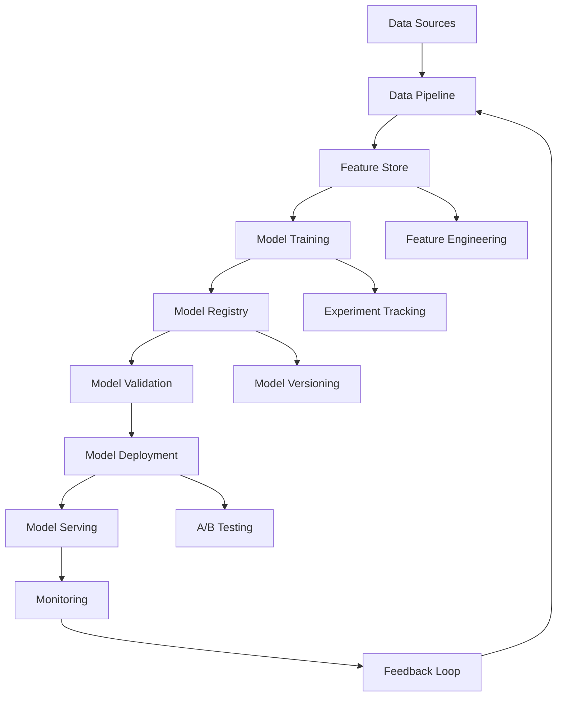

# Diretrizes de AI/ML Development - DATAMETRIA

<div align="center">

## Framework Completo para Desenvolvimento de Inteligência Artificial e Machine Learning

[](https://datametria.io)
[](https://datametria.io)
[](https://datametria.io)
[](https://github.com/datametria/standards)

[🤖 MLOps](#mlops-e-ciclo-de-vida) • [🔬 Experimentação](#experimentacao-e-desenvolvimento) •
[🚀 Deploy](#deploy-e-model-serving) • [📊 Monitoramento](#monitoramento-e-observabilidade) •
[⚖️ Responsible AI](#responsible-ai-e-etica) • [🤖 LLM](#llm-integration)

</div>

---

## 📋 Índice

1. [Visão Geral](#visao-geral)
2. [MLOps e Ciclo de Vida](#mlops-e-ciclo-de-vida)
3. [Experimentação e Desenvolvimento](#experimentacao-e-desenvolvimento)
4. [Feature Engineering](#feature-engineering)
5. [Model Training e Validation](#model-training-e-validation)
6. [Deploy e Model Serving](#deploy-e-model-serving)
7. [Monitoramento e Observabilidade](#monitoramento-e-observabilidade)
8. [Responsible AI e Ética](#responsible-ai-e-etica)
9. [LLM Integration](#llm-integration)

---

## 🎯 Visão Geral

### Princípios Fundamentais

- **🔬 Experimentação Rigorosa**: Metodologia científica aplicada ao ML
- **🚀 Deploy Confiável**: Modelos em produção com alta disponibilidade
- **📊 Data-Driven**: Decisões baseadas em métricas e experimentos
- **🔄 Iteração Contínua**: Melhoria constante dos modelos
- **⚖️ Responsible AI**: IA ética e responsável
- **🔒 Segurança**: Proteção de dados e modelos

### Stack Tecnológico

| Categoria | Tecnologias | Uso |
|-----------|-------------|-----|
| **Experimentação** | MLflow, Weights & Biases, Neptune | Tracking de experimentos |
| **Training** | PyTorch, TensorFlow, Scikit-learn | Desenvolvimento de modelos |
| **Feature Store** | Feast, Tecton, AWS Feature Store | Gestão de features |
| **Serving** | TorchServe, TensorFlow Serving, BentoML | Deploy de modelos |
| **Orquestração** | Kubeflow, MLflow, Airflow | Pipelines ML |
| **Monitoramento** | Evidently, Whylabs, Arize | Model monitoring |
| **Transformers** | Hugging Face Hub, Transformers, Datasets | Modelos pré-treinados |

---

## 🤖 MLOps e Ciclo de Vida

### Arquitetura MLOps



### Ciclo de Vida ML

```python
# Exemplo: Pipeline MLOps completo
import mlflow
import mlflow.sklearn
from sklearn.model_selection import train_test_split
from sklearn.ensemble import RandomForestClassifier
from sklearn.metrics import accuracy_score, precision_score, recall_score
import pandas as pd
from typing import Tuple, Dict, Any

class MLPipeline:
    """Pipeline completo de Machine Learning."""

    def __init__(self, experiment_name: str):
        self.experiment_name = experiment_name
        mlflow.set_experiment(experiment_name)

    def load_and_prepare_data(self, data_path: str) -> Tuple[pd.DataFrame, pd.Series]:
        """Carrega e prepara dados para treinamento."""
        df = pd.read_csv(data_path)

        # Feature engineering
        X = self.feature_engineering(df)
        y = df['target']

        return X, y

    def feature_engineering(self, df: pd.DataFrame) -> pd.DataFrame:
        """Aplica feature engineering aos dados."""
        # Exemplo de transformações
        df_processed = df.copy()

        # Encoding categóricas
        categorical_cols = df_processed.select_dtypes(include=['object']).columns
        df_processed = pd.get_dummies(df_processed, columns=categorical_cols)

        # Normalização
        numeric_cols = df_processed.select_dtypes(include=['float64', 'int64']).columns
        df_processed[numeric_cols] = (df_processed[numeric_cols] - df_processed[numeric_cols].mean()) / df_processed[numeric_cols].std()

        return df_processed

    def train_model(self, X: pd.DataFrame, y: pd.Series,
                   model_params: Dict[str, Any] = None) -> RandomForestClassifier:
        """Treina modelo com tracking de experimentos."""

        with mlflow.start_run():
            # Split dos dados
            X_train, X_test, y_train, y_test = train_test_split(
                X, y, test_size=0.2, random_state=42
            )

            # Parâmetros do modelo
            params = model_params or {
                'n_estimators': 100,
                'max_depth': 10,
                'random_state': 42
            }

            # Log dos parâmetros
            mlflow.log_params(params)

            # Treinamento
            model = RandomForestClassifier(**params)
            model.fit(X_train, y_train)

            # Predições e métricas
            y_pred = model.predict(X_test)

            accuracy = accuracy_score(y_test, y_pred)
            precision = precision_score(y_test, y_pred, average='weighted')
            recall = recall_score(y_test, y_pred, average='weighted')

            # Log das métricas
            mlflow.log_metrics({
                'accuracy': accuracy,
                'precision': precision,
                'recall': recall
            })

            # Log do modelo
            mlflow.sklearn.log_model(model, "model")

            return model

    def validate_model(self, model, X_val: pd.DataFrame, y_val: pd.Series) -> Dict[str, float]:
        """Valida modelo em dados de validação."""
        y_pred = model.predict(X_val)

        metrics = {
            'val_accuracy': accuracy_score(y_val, y_pred),
            'val_precision': precision_score(y_val, y_pred, average='weighted'),
            'val_recall': recall_score(y_val, y_pred, average='weighted')
        }

        return metrics
```

---

## 🔬 Experimentação e Desenvolvimento

### Experiment Tracking

```python
# Exemplo: Sistema de tracking de experimentos
import wandb
from dataclasses import dataclass
from typing import Dict, Any, Optional
import json
from datetime import datetime
import numpy as np

@dataclass
class ExperimentConfig:
    """Configuração de experimento."""

    model_type: str
    dataset: str
    features: list
    hyperparameters: Dict[str, Any]
    preprocessing: Dict[str, Any]
    validation_strategy: str

    def to_dict(self) -> Dict[str, Any]:
        """Converte para dicionário."""
        return {
            'model_type': self.model_type,
            'dataset': self.dataset,
            'features': self.features,
            'hyperparameters': self.hyperparameters,
            'preprocessing': self.preprocessing,
            'validation_strategy': self.validation_strategy
        }

class ExperimentTracker:
    """Sistema de tracking de experimentos."""

    def __init__(self, project_name: str, entity: str = None):
        self.project_name = project_name
        self.entity = entity
        self.current_run = None

    def start_experiment(self, config: ExperimentConfig,
                        experiment_name: str = None) -> str:
        """Inicia novo experimento."""
        run_name = experiment_name or f"exp_{datetime.now().strftime('%Y%m%d_%H%M%S')}"

        self.current_run = wandb.init(
            project=self.project_name,
            entity=self.entity,
            name=run_name,
            config=config.to_dict()
        )

        return self.current_run.id

    def log_metrics(self, metrics: Dict[str, float], step: int = None):
        """Log de métricas do experimento."""
        if self.current_run:
            wandb.log(metrics, step=step)

    def log_artifacts(self, artifact_path: str, artifact_type: str = "model"):
        """Log de artefatos (modelos, datasets, etc.)."""
        if self.current_run:
            artifact = wandb.Artifact(
                name=f"{artifact_type}_{self.current_run.id}",
                type=artifact_type
            )
            artifact.add_file(artifact_path)
            wandb.log_artifact(artifact)

    def log_model_performance(self, y_true, y_pred, model_name: str):
        """Log de performance do modelo."""
        if self.current_run:
            # Confusion matrix
            wandb.log({
                f"{model_name}_confusion_matrix": wandb.plot.confusion_matrix(
                    y_true=y_true,
                    preds=y_pred,
                    class_names=None
                )
            })

            # ROC curve (para classificação binária)
            if len(set(y_true)) == 2:
                wandb.log({
                    f"{model_name}_roc": wandb.plot.roc_curve(y_true, y_pred)
                })

    def finish_experiment(self):
        """Finaliza experimento atual."""
        if self.current_run:
            wandb.finish()
            self.current_run = None
```

### Hyperparameter Tuning

```python
# Exemplo: Otimização de hiperparâmetros
import optuna
from sklearn.model_selection import cross_val_score
from sklearn.ensemble import RandomForestClassifier
import numpy as np

class HyperparameterOptimizer:
    """Otimizador de hiperparâmetros usando Optuna."""

    def __init__(self, X_train, y_train, cv_folds: int = 5):
        self.X_train = X_train
        self.y_train = y_train
        self.cv_folds = cv_folds

    def objective_random_forest(self, trial):
        """Função objetivo para Random Forest."""
        params = {
            'n_estimators': trial.suggest_int('n_estimators', 50, 300),
            'max_depth': trial.suggest_int('max_depth', 3, 20),
            'min_samples_split': trial.suggest_int('min_samples_split', 2, 20),
            'min_samples_leaf': trial.suggest_int('min_samples_leaf', 1, 10),
            'max_features': trial.suggest_categorical('max_features', ['sqrt', 'log2', None]),
            'random_state': 42
        }

        model = RandomForestClassifier(**params)

        # Cross-validation
        scores = cross_val_score(
            model, self.X_train, self.y_train,
            cv=self.cv_folds, scoring='accuracy'
        )

        return np.mean(scores)

    def optimize(self, n_trials: int = 100) -> Dict[str, Any]:
        """Executa otimização de hiperparâmetros."""
        study = optuna.create_study(direction='maximize')
        study.optimize(self.objective_random_forest, n_trials=n_trials)

        return {
            'best_params': study.best_params,
            'best_score': study.best_value,
            'n_trials': len(study.trials)
        }
```

---

## 🔧 Feature Engineering

### Feature Store

```python
# Exemplo: Sistema de Feature Store
from dataclasses import dataclass
from typing import List, Dict, Any, Optional
import pandas as pd
from datetime import datetime, timedelta
import redis
import pickle

@dataclass
class FeatureDefinition:
    """Definição de uma feature."""

    name: str
    description: str
    data_type: str
    source_table: str
    transformation: str
    update_frequency: str
    owner: str
    tags: List[str]

    def to_dict(self) -> Dict[str, Any]:
        """Converte para dicionário."""
        return {
            'name': self.name,
            'description': self.description,
            'data_type': self.data_type,
            'source_table': self.source_table,
            'transformation': self.transformation,
            'update_frequency': self.update_frequency,
            'owner': self.owner,
            'tags': self.tags
        }

class FeatureStore:
    """Sistema de Feature Store."""

    def __init__(self, redis_host: str = 'localhost', redis_port: int = 6379):
        self.redis_client = redis.Redis(host=redis_host, port=redis_port, db=0)
        self.feature_registry = {}

    def register_feature(self, feature_def: FeatureDefinition):
        """Registra nova feature no store."""
        self.feature_registry[feature_def.name] = feature_def

        # Salvar no Redis
        self.redis_client.hset(
            'feature_registry',
            feature_def.name,
            pickle.dumps(feature_def.to_dict())
        )

    def compute_features(self, entity_ids: List[str],
                        feature_names: List[str],
                        timestamp: Optional[datetime] = None) -> pd.DataFrame:
        """Computa features para entidades específicas."""
        timestamp = timestamp or datetime.now()

        features_data = []

        for entity_id in entity_ids:
            entity_features = {'entity_id': entity_id}

            for feature_name in feature_names:
                if feature_name in self.feature_registry:
                    # Buscar feature do cache ou computar
                    feature_value = self._get_or_compute_feature(
                        entity_id, feature_name, timestamp
                    )
                    entity_features[feature_name] = feature_value

            features_data.append(entity_features)

        return pd.DataFrame(features_data)

    def _get_or_compute_feature(self, entity_id: str,
                               feature_name: str,
                               timestamp: datetime) -> Any:
        """Obtém feature do cache ou computa se necessário."""
        cache_key = f"feature:{feature_name}:{entity_id}:{timestamp.date()}"

        # Tentar obter do cache
        cached_value = self.redis_client.get(cache_key)
        if cached_value:
            return pickle.loads(cached_value)

        # Computar feature
        feature_def = self.feature_registry[feature_name]
        computed_value = self._compute_feature_value(
            entity_id, feature_def, timestamp
        )

        # Cachear resultado
        self.redis_client.setex(
            cache_key,
            timedelta(hours=24).total_seconds(),
            pickle.dumps(computed_value)
        )

        return computed_value

    def _compute_feature_value(self, entity_id: str,
                              feature_def: FeatureDefinition,
                              timestamp: datetime) -> Any:
        """Computa valor da feature."""
        # Implementação específica baseada na definição da feature
        # Este é um exemplo simplificado

        if feature_def.name == 'user_transaction_count_7d':
            # Contar transações dos últimos 7 dias
            return self._count_user_transactions(entity_id, days=7)
        elif feature_def.name == 'user_avg_transaction_amount_30d':
            # Média de valor de transações dos últimos 30 dias
            return self._avg_user_transaction_amount(entity_id, days=30)

        return None

    def create_feature_set(self, feature_names: List[str],
                          name: str, description: str) -> str:
        """Cria conjunto de features para reutilização."""
        feature_set = {
            'name': name,
            'description': description,
            'features': feature_names,
            'created_at': datetime.now().isoformat()
        }

        feature_set_id = f"feature_set:{name}"
        self.redis_client.hset(
            'feature_sets',
            feature_set_id,
            pickle.dumps(feature_set)
        )

        return feature_set_id
```

---

## 🎯 Model Training e Validation

### Cross-Validation Strategy

```python
# Exemplo: Estratégias de validação
from sklearn.model_selection import (
    TimeSeriesSplit, StratifiedKFold, GroupKFold
)
from sklearn.metrics import classification_report, accuracy_score
import numpy as np
from typing import Generator, Tuple

class ValidationStrategy:
    """Estratégias de validação para diferentes tipos de dados."""

    @staticmethod
    def time_series_validation(X: pd.DataFrame, y: pd.Series,
                              n_splits: int = 5) -> Generator[Tuple[np.ndarray, np.ndarray], None, None]:
        """Validação para dados de série temporal."""
        tscv = TimeSeriesSplit(n_splits=n_splits)

        for train_idx, val_idx in tscv.split(X):
            yield train_idx, val_idx

    @staticmethod
    def stratified_validation(X: pd.DataFrame, y: pd.Series,
                             n_splits: int = 5) -> Generator[Tuple[np.ndarray, np.ndarray], None, None]:
        """Validação estratificada para dados desbalanceados."""
        skf = StratifiedKFold(n_splits=n_splits, shuffle=True, random_state=42)

        for train_idx, val_idx in skf.split(X, y):
            yield train_idx, val_idx

    @staticmethod
    def group_validation(X: pd.DataFrame, y: pd.Series, groups: pd.Series,
                        n_splits: int = 5) -> Generator[Tuple[np.ndarray, np.ndarray], None, None]:
        """Validação por grupos (evita data leakage)."""
        gkf = GroupKFold(n_splits=n_splits)

        for train_idx, val_idx in gkf.split(X, y, groups):
            yield train_idx, val_idx

class ModelValidator:
    """Sistema de validação de modelos."""

    def __init__(self, validation_strategy: str = 'stratified'):
        self.validation_strategy = validation_strategy

    def validate_model(self, model, X: pd.DataFrame, y: pd.Series,
                      groups: pd.Series = None, n_splits: int = 5) -> Dict[str, Any]:
        """Executa validação cruzada do modelo."""

        # Escolher estratégia de validação
        if self.validation_strategy == 'time_series':
            cv_generator = ValidationStrategy.time_series_validation(X, y, n_splits)
        elif self.validation_strategy == 'group':
            cv_generator = ValidationStrategy.group_validation(X, y, groups, n_splits)
        else:
            cv_generator = ValidationStrategy.stratified_validation(X, y, n_splits)

        fold_scores = []
        fold_reports = []

        for fold, (train_idx, val_idx) in enumerate(cv_generator):
            X_train_fold, X_val_fold = X.iloc[train_idx], X.iloc[val_idx]
            y_train_fold, y_val_fold = y.iloc[train_idx], y.iloc[val_idx]

            # Treinar modelo no fold
            model.fit(X_train_fold, y_train_fold)

            # Predições
            y_pred = model.predict(X_val_fold)

            # Métricas
            fold_score = accuracy_score(y_val_fold, y_pred)
            fold_scores.append(fold_score)

            # Relatório detalhado
            report = classification_report(y_val_fold, y_pred, output_dict=True)
            fold_reports.append(report)

        return {
            'mean_score': np.mean(fold_scores),
            'std_score': np.std(fold_scores),
            'fold_scores': fold_scores,
            'detailed_reports': fold_reports
        }
```

---

## 🚀 Deploy e Model Serving

### Model Registry

```python
# Exemplo: Sistema de registro de modelos
import mlflow
from mlflow.tracking import MlflowClient
from typing import Dict, Any, Optional, List
from enum import Enum
import joblib
import json

class ModelStage(Enum):
    STAGING = "Staging"
    PRODUCTION = "Production"
    ARCHIVED = "Archived"

class ModelRegistry:
    """Sistema de registro e versionamento de modelos."""

    def __init__(self, tracking_uri: str = None):
        if tracking_uri:
            mlflow.set_tracking_uri(tracking_uri)
        self.client = MlflowClient()

    def register_model(self, model_uri: str, model_name: str,
                      description: str = None) -> str:
        """Registra novo modelo no registry."""
        model_version = mlflow.register_model(
            model_uri=model_uri,
            name=model_name,
            description=description
        )

        return model_version.version

    def promote_model(self, model_name: str, version: str,
                     stage: ModelStage, description: str = None):
        """Promove modelo para novo estágio."""
        self.client.transition_model_version_stage(
            name=model_name,
            version=version,
            stage=stage.value,
            description=description
        )

    def get_model_version(self, model_name: str,
                         stage: ModelStage = ModelStage.PRODUCTION):
        """Obtém versão do modelo em estágio específico."""
        model_version = self.client.get_latest_versions(
            model_name, stages=[stage.value]
        )

        if model_version:
            return model_version[0]
        return None

    def load_model(self, model_name: str,
                  stage: ModelStage = ModelStage.PRODUCTION):
        """Carrega modelo do registry."""
        model_version = self.get_model_version(model_name, stage)

        if model_version:
            model_uri = f"models:/{model_name}/{model_version.version}"
            return mlflow.pyfunc.load_model(model_uri)

        raise ValueError(f"No model found for {model_name} in {stage.value}")

    def compare_models(self, model_name: str,
                      version1: str, version2: str) -> Dict[str, Any]:
        """Compara duas versões de modelo."""
        mv1 = self.client.get_model_version(model_name, version1)
        mv2 = self.client.get_model_version(model_name, version2)

        # Obter métricas dos runs
        run1 = self.client.get_run(mv1.run_id)
        run2 = self.client.get_run(mv2.run_id)

        comparison = {
            'version1': {
                'version': version1,
                'metrics': run1.data.metrics,
                'params': run1.data.params
            },
            'version2': {
                'version': version2,
                'metrics': run2.data.metrics,
                'params': run2.data.params
            }
        }

        return comparison
```

### Model Serving

```python
# Exemplo: Sistema de serving de modelos
from flask import Flask, request, jsonify
import numpy as np
import pandas as pd
from typing import Dict, Any, List
import logging
from datetime import datetime

class ModelServer:
    """Servidor de modelos ML."""

    def __init__(self, model_registry: ModelRegistry):
        self.app = Flask(__name__)
        self.model_registry = model_registry
        self.loaded_models = {}
        self.setup_routes()

        # Configurar logging
        logging.basicConfig(level=logging.INFO)
        self.logger = logging.getLogger(__name__)

    def setup_routes(self):
        """Configura rotas da API."""

        @self.app.route('/predict/<model_name>', methods=['POST'])
        def predict(model_name):
            try:
                # Obter dados da requisição
                data = request.get_json()

                # Carregar modelo se necessário
                if model_name not in self.loaded_models:
                    self.load_model(model_name)

                # Fazer predição
                prediction = self.predict_batch(model_name, data['instances'])

                # Log da predição
                self.log_prediction(model_name, data, prediction)

                return jsonify({
                    'predictions': prediction,
                    'model_name': model_name,
                    'timestamp': datetime.now().isoformat()
                })

            except Exception as e:
                self.logger.error(f"Error in prediction: {str(e)}")
                return jsonify({'error': str(e)}), 500

        @self.app.route('/health', methods=['GET'])
        def health():
            return jsonify({
                'status': 'healthy',
                'loaded_models': list(self.loaded_models.keys()),
                'timestamp': datetime.now().isoformat()
            })

        @self.app.route('/models/<model_name>/reload', methods=['POST'])
        def reload_model(model_name):
            try:
                self.load_model(model_name, force_reload=True)
                return jsonify({
                    'message': f'Model {model_name} reloaded successfully'
                })
            except Exception as e:
                return jsonify({'error': str(e)}), 500

    def load_model(self, model_name: str, force_reload: bool = False):
        """Carrega modelo do registry."""
        if model_name in self.loaded_models and not force_reload:
            return

        try:
            model = self.model_registry.load_model(model_name)
            self.loaded_models[model_name] = model
            self.logger.info(f"Model {model_name} loaded successfully")

        except Exception as e:
            self.logger.error(f"Failed to load model {model_name}: {str(e)}")
            raise

    def predict_batch(self, model_name: str, instances: List[Dict[str, Any]]) -> List[Any]:
        """Faz predições em lote."""
        model = self.loaded_models[model_name]

        # Converter para DataFrame
        df = pd.DataFrame(instances)

        # Fazer predições
        predictions = model.predict(df)

        return predictions.tolist()

    def log_prediction(self, model_name: str, input_data: Dict[str, Any],
                      predictions: List[Any]):
        """Log das predições para monitoramento."""
        log_entry = {
            'timestamp': datetime.now().isoformat(),
            'model_name': model_name,
            'input_size': len(input_data['instances']),
            'predictions_count': len(predictions)
        }

        self.logger.info(f"Prediction logged: {log_entry}")

    def run(self, host: str = '0.0.0.0', port: int = 5000, debug: bool = False):
        """Inicia servidor."""
        self.app.run(host=host, port=port, debug=debug)
```

---

## 📊 Monitoramento e Observabilidade

### Model Monitoring

```python
# Exemplo: Sistema de monitoramento de modelos
import numpy as np
import pandas as pd
from scipy import stats
from typing import Dict, Any, List, Tuple
from dataclasses import dataclass
from datetime import datetime, timedelta
import warnings

@dataclass
class DriftAlert:
    """Alerta de drift detectado."""

    feature_name: str
    drift_type: str
    drift_score: float
    threshold: float
    timestamp: datetime
    severity: str

    def to_dict(self) -> Dict[str, Any]:
        return {
            'feature_name': self.feature_name,
            'drift_type': self.drift_type,
            'drift_score': self.drift_score,
            'threshold': self.threshold,
            'timestamp': self.timestamp.isoformat(),
            'severity': self.severity
        }

class ModelMonitor:
    """Sistema de monitoramento de modelos em produção."""

    def __init__(self, reference_data: pd.DataFrame):
        self.reference_data = reference_data
        self.reference_stats = self._calculate_reference_stats()
        self.drift_thresholds = {
            'ks_test': 0.05,
            'psi': 0.1,
            'js_divergence': 0.1
        }

    def _calculate_reference_stats(self) -> Dict[str, Dict[str, float]]:
        """Calcula estatísticas de referência."""
        stats = {}

        for column in self.reference_data.columns:
            if self.reference_data[column].dtype in ['int64', 'float64']:
                stats[column] = {
                    'mean': self.reference_data[column].mean(),
                    'std': self.reference_data[column].std(),
                    'min': self.reference_data[column].min(),
                    'max': self.reference_data[column].max(),
                    'percentiles': self.reference_data[column].quantile([0.25, 0.5, 0.75]).to_dict()
                }
            else:
                # Para variáveis categóricas
                value_counts = self.reference_data[column].value_counts(normalize=True)
                stats[column] = {
                    'distribution': value_counts.to_dict(),
                    'unique_values': len(value_counts)
                }

        return stats

    def detect_data_drift(self, current_data: pd.DataFrame) -> List[DriftAlert]:
        """Detecta drift nos dados."""
        alerts = []

        for column in self.reference_data.columns:
            if column not in current_data.columns:
                continue

            if self.reference_data[column].dtype in ['int64', 'float64']:
                # Drift em variáveis numéricas
                drift_alerts = self._detect_numerical_drift(
                    column,
                    self.reference_data[column],
                    current_data[column]
                )
                alerts.extend(drift_alerts)
            else:
                # Drift em variáveis categóricas
                drift_alerts = self._detect_categorical_drift(
                    column,
                    self.reference_data[column],
                    current_data[column]
                )
                alerts.extend(drift_alerts)

        return alerts

    def _detect_numerical_drift(self, column: str,
                               reference: pd.Series,
                               current: pd.Series) -> List[DriftAlert]:
        """Detecta drift em variáveis numéricas."""
        alerts = []

        # Kolmogorov-Smirnov test
        ks_stat, ks_p_value = stats.ks_2samp(reference, current)

        if ks_p_value < self.drift_thresholds['ks_test']:
            alerts.append(DriftAlert(
                feature_name=column,
                drift_type='ks_test',
                drift_score=ks_stat,
                threshold=self.drift_thresholds['ks_test'],
                timestamp=datetime.now(),
                severity='high' if ks_p_value < 0.01 else 'medium'
            ))

        # Population Stability Index (PSI)
        psi_score = self._calculate_psi(reference, current)

        if psi_score > self.drift_thresholds['psi']:
            alerts.append(DriftAlert(
                feature_name=column,
                drift_type='psi',
                drift_score=psi_score,
                threshold=self.drift_thresholds['psi'],
                timestamp=datetime.now(),
                severity='high' if psi_score > 0.25 else 'medium'
            ))

        return alerts

    def _calculate_psi(self, reference: pd.Series, current: pd.Series,
                      bins: int = 10) -> float:
        """Calcula Population Stability Index."""
        # Criar bins baseados nos dados de referência
        _, bin_edges = np.histogram(reference, bins=bins)

        # Calcular distribuições
        ref_counts, _ = np.histogram(reference, bins=bin_edges)
        cur_counts, _ = np.histogram(current, bins=bin_edges)

        # Normalizar
        ref_props = ref_counts / len(reference)
        cur_props = cur_counts / len(current)

        # Evitar divisão por zero
        ref_props = np.where(ref_props == 0, 0.0001, ref_props)
        cur_props = np.where(cur_props == 0, 0.0001, cur_props)

        # Calcular PSI
        psi = np.sum((cur_props - ref_props) * np.log(cur_props / ref_props))

        return psi

    def _detect_categorical_drift(self, column: str,
                                 reference: pd.Series,
                                 current: pd.Series) -> List[DriftAlert]:
        """Detecta drift em variáveis categóricas."""
        alerts = []

        # Distribuições de frequência
        ref_dist = reference.value_counts(normalize=True)
        cur_dist = current.value_counts(normalize=True)

        # Alinhar distribuições
        all_categories = set(ref_dist.index) | set(cur_dist.index)

        ref_aligned = pd.Series(0.0, index=all_categories)
        cur_aligned = pd.Series(0.0, index=all_categories)

        ref_aligned.update(ref_dist)
        cur_aligned.update(cur_dist)

        # Jensen-Shannon divergence
        js_div = self._jensen_shannon_divergence(ref_aligned.values, cur_aligned.values)

        if js_div > self.drift_thresholds['js_divergence']:
            alerts.append(DriftAlert(
                feature_name=column,
                drift_type='js_divergence',
                drift_score=js_div,
                threshold=self.drift_thresholds['js_divergence'],
                timestamp=datetime.now(),
                severity='high' if js_div > 0.2 else 'medium'
            ))

        return alerts

    def _jensen_shannon_divergence(self, p: np.ndarray, q: np.ndarray) -> float:
        """Calcula Jensen-Shannon divergence."""
        # Evitar log(0)
        p = np.where(p == 0, 1e-10, p)
        q = np.where(q == 0, 1e-10, q)

        m = 0.5 * (p + q)

        js_div = 0.5 * stats.entropy(p, m) + 0.5 * stats.entropy(q, m)

        return js_div

    def monitor_model_performance(self, y_true: np.ndarray,
                                 y_pred: np.ndarray,
                                 model_name: str) -> Dict[str, float]:
        """Monitora performance do modelo."""
        from sklearn.metrics import accuracy_score, precision_score, recall_score, f1_score

        metrics = {
            'accuracy': accuracy_score(y_true, y_pred),
            'precision': precision_score(y_true, y_pred, average='weighted'),
            'recall': recall_score(y_true, y_pred, average='weighted'),
            'f1_score': f1_score(y_true, y_pred, average='weighted')
        }

        # Log das métricas
        self._log_performance_metrics(model_name, metrics)

        return metrics

    def _log_performance_metrics(self, model_name: str, metrics: Dict[str, float]):
        """Log das métricas de performance."""
        log_entry = {
            'timestamp': datetime.now().isoformat(),
            'model_name': model_name,
            'metrics': metrics
        }

        # Aqui você enviaria para seu sistema de logging/monitoramento
        print(f"Performance metrics logged: {log_entry}")
```

---

## ⚖️ Responsible AI e Ética

### Bias Detection

```python
# Exemplo: Detecção de bias em modelos
import pandas as pd
import numpy as np
from typing import Dict, List, Any
from sklearn.metrics import confusion_matrix, accuracy_score

class BiasDetector:
    """Detector de bias em modelos de ML."""

    def __init__(self):
        self.fairness_metrics = {}

    def detect_demographic_parity(self, y_true: np.ndarray,
                                 y_pred: np.ndarray,
                                 sensitive_attribute: np.ndarray) -> Dict[str, float]:
        """Detecta violação de paridade demográfica."""
        results = {}

        unique_groups = np.unique(sensitive_attribute)

        for group in unique_groups:
            group_mask = sensitive_attribute == group
            group_positive_rate = np.mean(y_pred[group_mask])
            results[f'positive_rate_group_{group}'] = group_positive_rate

        # Calcular diferença máxima
        rates = list(results.values())
        max_diff = max(rates) - min(rates)
        results['demographic_parity_difference'] = max_diff

        return results

    def detect_equalized_odds(self, y_true: np.ndarray,
                             y_pred: np.ndarray,
                             sensitive_attribute: np.ndarray) -> Dict[str, float]:
        """Detecta violação de odds equalizadas."""
        results = {}

        unique_groups = np.unique(sensitive_attribute)

        for group in unique_groups:
            group_mask = sensitive_attribute == group

            # True Positive Rate
            tpr = self._calculate_tpr(y_true[group_mask], y_pred[group_mask])
            results[f'tpr_group_{group}'] = tpr

            # False Positive Rate
            fpr = self._calculate_fpr(y_true[group_mask], y_pred[group_mask])
            results[f'fpr_group_{group}'] = fpr

        # Calcular diferenças
        tpr_values = [v for k, v in results.items() if 'tpr_' in k]
        fpr_values = [v for k, v in results.items() if 'fpr_' in k]

        results['tpr_difference'] = max(tpr_values) - min(tpr_values)
        results['fpr_difference'] = max(fpr_values) - min(fpr_values)

        return results

    def _calculate_tpr(self, y_true: np.ndarray, y_pred: np.ndarray) -> float:
        """Calcula True Positive Rate."""
        tn, fp, fn, tp = confusion_matrix(y_true, y_pred).ravel()
        return tp / (tp + fn) if (tp + fn) > 0 else 0

    def _calculate_fpr(self, y_true: np.ndarray, y_pred: np.ndarray) -> float:
        """Calcula False Positive Rate."""
        tn, fp, fn, tp = confusion_matrix(y_true, y_pred).ravel()
        return fp / (fp + tn) if (fp + tn) > 0 else 0

    def generate_fairness_report(self, y_true: np.ndarray,
                                y_pred: np.ndarray,
                                sensitive_attributes: Dict[str, np.ndarray]) -> Dict[str, Any]:
        """Gera relatório completo de fairness."""
        report = {
            'timestamp': datetime.now().isoformat(),
            'overall_accuracy': accuracy_score(y_true, y_pred),
            'fairness_metrics': {}
        }

        for attr_name, attr_values in sensitive_attributes.items():
            report['fairness_metrics'][attr_name] = {
                'demographic_parity': self.detect_demographic_parity(
                    y_true, y_pred, attr_values
                ),
                'equalized_odds': self.detect_equalized_odds(
                    y_true, y_pred, attr_values
                )
            }

        return report
```

### Explainability

```python
# Exemplo: Sistema de explicabilidade
import shap
import lime
import lime.lime_tabular
from typing import Dict, Any, List
import matplotlib.pyplot as plt
import pandas as pd

class ModelExplainer:
    """Sistema de explicabilidade de modelos."""

    def __init__(self, model, training_data: pd.DataFrame):
        self.model = model
        self.training_data = training_data
        self.shap_explainer = None
        self.lime_explainer = None

    def setup_shap_explainer(self):
        """Configura explainer SHAP."""
        self.shap_explainer = shap.Explainer(self.model, self.training_data)

    def setup_lime_explainer(self):
        """Configura explainer LIME."""
        self.lime_explainer = lime.lime_tabular.LimeTabularExplainer(
            self.training_data.values,
            feature_names=self.training_data.columns,
            class_names=['0', '1'],
            mode='classification'
        )

    def explain_prediction_shap(self, instance: pd.DataFrame) -> Dict[str, Any]:
        """Explica predição usando SHAP."""
        if self.shap_explainer is None:
            self.setup_shap_explainer()

        shap_values = self.shap_explainer(instance)

        explanation = {
            'method': 'SHAP',
            'base_value': float(shap_values.base_values[0]),
            'prediction': float(self.model.predict_proba(instance)[0][1]),
            'feature_contributions': {}
        }

        for i, feature in enumerate(self.training_data.columns):
            explanation['feature_contributions'][feature] = float(shap_values.values[0][i])

        return explanation

    def explain_prediction_lime(self, instance: pd.DataFrame,
                               num_features: int = 10) -> Dict[str, Any]:
        """Explica predição usando LIME."""
        if self.lime_explainer is None:
            self.setup_lime_explainer()

        explanation = self.lime_explainer.explain_instance(
            instance.values[0],
            self.model.predict_proba,
            num_features=num_features
        )

        feature_importance = {}
        for feature, importance in explanation.as_list():
            feature_importance[feature] = importance

        return {
            'method': 'LIME',
            'prediction': float(self.model.predict_proba(instance)[0][1]),
            'feature_importance': feature_importance,
            'local_prediction': explanation.local_pred[0]
        }

    def generate_global_explanation(self) -> Dict[str, Any]:
        """Gera explicação global do modelo."""
        if self.shap_explainer is None:
            self.setup_shap_explainer()

        # Calcular SHAP values para dataset de treino (amostra)
        sample_data = self.training_data.sample(min(1000, len(self.training_data)))
        shap_values = self.shap_explainer(sample_data)

        # Feature importance global
        feature_importance = np.abs(shap_values.values).mean(0)

        global_explanation = {
            'method': 'SHAP_Global',
            'feature_importance': {}
        }

        for i, feature in enumerate(self.training_data.columns):
            global_explanation['feature_importance'][feature] = float(feature_importance[i])

        # Ordenar por importância
        sorted_features = sorted(
            global_explanation['feature_importance'].items(),
            key=lambda x: abs(x[1]),
            reverse=True
        )

        global_explanation['top_features'] = sorted_features[:10]

        return global_explanation
```

---

## 🤖 LLM Integration

### LLM Pipeline

```python
# Exemplo: Pipeline para integração com LLMs
import openai
from typing import Dict, Any, List, Optional
import json
from dataclasses import dataclass
import tiktoken

@dataclass
class LLMConfig:
    """Configuração para LLM."""

    model_name: str
    max_tokens: int
    temperature: float
    top_p: float
    frequency_penalty: float
    presence_penalty: float

class LLMPipeline:
    """Pipeline para integração com Large Language Models."""

    def __init__(self, config: LLMConfig, api_key: str):
        self.config = config
        openai.api_key = api_key
        self.tokenizer = tiktoken.encoding_for_model(config.model_name)

    def count_tokens(self, text: str) -> int:
        """Conta tokens no texto."""
        return len(self.tokenizer.encode(text))

    def generate_completion(self, prompt: str,
                          system_message: str = None) -> Dict[str, Any]:
        """Gera completion usando LLM."""
        messages = []

        if system_message:
            messages.append({"role": "system", "content": system_message})

        messages.append({"role": "user", "content": prompt})

        # Verificar limite de tokens
        total_tokens = sum(self.count_tokens(msg["content"]) for msg in messages)

        if total_tokens > self.config.max_tokens * 0.8:  # Deixar espaço para resposta
            raise ValueError(f"Input too long: {total_tokens} tokens")

        response = openai.ChatCompletion.create(
            model=self.config.model_name,
            messages=messages,
            max_tokens=self.config.max_tokens - total_tokens,
            temperature=self.config.temperature,
            top_p=self.config.top_p,
            frequency_penalty=self.config.frequency_penalty,
            presence_penalty=self.config.presence_penalty
        )

        return {
            'content': response.choices[0].message.content,
            'usage': response.usage,
            'model': response.model
        }

    def generate_embeddings(self, texts: List[str]) -> List[List[float]]:
        """Gera embeddings para textos."""
        response = openai.Embedding.create(
            model="text-embedding-ada-002",
            input=texts
        )

        return [item.embedding for item in response.data]

    def fine_tune_model(self, training_file_path: str,
                       validation_file_path: str = None) -> str:
        """Inicia fine-tuning do modelo."""

        # Upload do arquivo de treino
        training_file = openai.File.create(
            file=open(training_file_path, "rb"),
            purpose='fine-tune'
        )

        fine_tune_params = {
            'training_file': training_file.id,
            'model': self.config.model_name
        }

        if validation_file_path:
            validation_file = openai.File.create(
                file=open(validation_file_path, "rb"),
                purpose='fine-tune'
            )
            fine_tune_params['validation_file'] = validation_file.id

        fine_tune_job = openai.FineTuningJob.create(**fine_tune_params)

        return fine_tune_job.id

    def evaluate_llm_output(self, prompt: str, expected_output: str,
                           generated_output: str) -> Dict[str, float]:
        """Avalia qualidade da saída do LLM."""

        # Métricas básicas
        metrics = {
            'length_similarity': abs(len(expected_output) - len(generated_output)) / max(len(expected_output), len(generated_output)),
            'exact_match': 1.0 if expected_output.strip() == generated_output.strip() else 0.0
        }

        # BLEU score (para tarefas de geração)
        try:
            from nltk.translate.bleu_score import sentence_bleu
            reference = [expected_output.split()]
            candidate = generated_output.split()
            metrics['bleu_score'] = sentence_bleu(reference, candidate)
        except ImportError:
            metrics['bleu_score'] = None

        # Semantic similarity usando embeddings
        embeddings = self.generate_embeddings([expected_output, generated_output])
        if len(embeddings) == 2:
            similarity = np.dot(embeddings[0], embeddings[1]) / (
                np.linalg.norm(embeddings[0]) * np.linalg.norm(embeddings[1])
            )
            metrics['semantic_similarity'] = float(similarity)

        return metrics
```

### Hugging Face Integration

```python
# Exemplo: Integração com Hugging Face
from transformers import (
    AutoTokenizer, AutoModel, AutoModelForSequenceClassification,
    pipeline, Trainer, TrainingArguments
)
from datasets import Dataset, load_dataset
import torch
from typing import Dict, List, Any, Optional

class HuggingFacePipeline:
    """Pipeline para integração com Hugging Face."""

    def __init__(self, model_name: str, task: str = "text-classification"):
        self.model_name = model_name
        self.task = task
        self.tokenizer = AutoTokenizer.from_pretrained(model_name)
        self.model = None
        self.pipeline = None

    def load_model(self, num_labels: int = 2):
        """Carrega modelo do Hugging Face Hub."""
        if self.task == "text-classification":
            self.model = AutoModelForSequenceClassification.from_pretrained(
                self.model_name, num_labels=num_labels
            )
        else:
            self.model = AutoModel.from_pretrained(self.model_name)

        # Criar pipeline
        self.pipeline = pipeline(
            self.task,
            model=self.model,
            tokenizer=self.tokenizer
        )

    def predict(self, texts: List[str]) -> List[Dict[str, Any]]:
        """Faz predições usando o pipeline."""
        if self.pipeline is None:
            self.load_model()

        results = self.pipeline(texts)
        return results

    def fine_tune(self, train_texts: List[str], train_labels: List[int],
                  val_texts: List[str] = None, val_labels: List[int] = None,
                  output_dir: str = "./fine_tuned_model") -> str:
        """Fine-tuna modelo com dados customizados."""

        # Preparar datasets
        train_encodings = self.tokenizer(
            train_texts, truncation=True, padding=True, return_tensors="pt"
        )
        train_dataset = Dataset.from_dict({
            'input_ids': train_encodings['input_ids'],
            'attention_mask': train_encodings['attention_mask'],
            'labels': train_labels
        })

        val_dataset = None
        if val_texts and val_labels:
            val_encodings = self.tokenizer(
                val_texts, truncation=True, padding=True, return_tensors="pt"
            )
            val_dataset = Dataset.from_dict({
                'input_ids': val_encodings['input_ids'],
                'attention_mask': val_encodings['attention_mask'],
                'labels': val_labels
            })

        # Configurar treinamento
        training_args = TrainingArguments(
            output_dir=output_dir,
            num_train_epochs=3,
            per_device_train_batch_size=16,
            per_device_eval_batch_size=64,
            warmup_steps=500,
            weight_decay=0.01,
            logging_dir='./logs',
            evaluation_strategy="epoch" if val_dataset else "no",
            save_strategy="epoch",
            load_best_model_at_end=True if val_dataset else False
        )

        # Carregar modelo se necessário
        if self.model is None:
            self.load_model(num_labels=len(set(train_labels)))

        # Criar trainer
        trainer = Trainer(
            model=self.model,
            args=training_args,
            train_dataset=train_dataset,
            eval_dataset=val_dataset,
            tokenizer=self.tokenizer
        )

        # Treinar
        trainer.train()

        # Salvar modelo
        trainer.save_model()
        self.tokenizer.save_pretrained(output_dir)

        return output_dir

    def generate_embeddings(self, texts: List[str]) -> torch.Tensor:
        """Gera embeddings usando modelo Hugging Face."""
        if self.model is None:
            self.load_model()

        # Tokenizar
        inputs = self.tokenizer(
            texts, padding=True, truncation=True, return_tensors="pt"
        )

        # Gerar embeddings
        with torch.no_grad():
            outputs = self.model(**inputs)
            # Usar [CLS] token ou pooling
            embeddings = outputs.last_hidden_state[:, 0, :]  # [CLS] token

        return embeddings

    def push_to_hub(self, repo_name: str, commit_message: str = "Upload model"):
        """Faz upload do modelo para Hugging Face Hub."""
        if self.model is None:
            raise ValueError("Modelo não carregado")

        self.model.push_to_hub(repo_name, commit_message=commit_message)
        self.tokenizer.push_to_hub(repo_name, commit_message=commit_message)

class RAGPipeline:
    """Pipeline para Retrieval-Augmented Generation."""

    def __init__(self, llm_pipeline: LLMPipeline, vector_store):
        self.llm_pipeline = llm_pipeline
        self.vector_store = vector_store

    def retrieve_and_generate(self, query: str, top_k: int = 5) -> Dict[str, Any]:
        """Executa RAG: retrieve + generate."""

        # 1. Gerar embedding da query
        query_embedding = self.llm_pipeline.generate_embeddings([query])[0]

        # 2. Buscar documentos similares
        retrieved_docs = self.vector_store.similarity_search(
            query_embedding, top_k=top_k
        )

        # 3. Construir contexto
        context = "\n\n".join([doc['content'] for doc in retrieved_docs])

        # 4. Construir prompt
        prompt = f"""
        Contexto:
        {context}

        Pergunta: {query}

        Responda baseado apenas no contexto fornecido.
        """

        # 5. Gerar resposta
        response = self.llm_pipeline.generate_completion(prompt)

        return {
            'query': query,
            'retrieved_documents': retrieved_docs,
            'generated_response': response['content'],
            'usage': response['usage']
        }
```

---

## 📚 Referências e Recursos

### Documentação Oficial

- **[MLflow](https://mlflow.org/docs/latest/index.html)** - Plataforma MLOps
- **[Kubeflow](https://www.kubeflow.org/docs/)** - ML workflows em Kubernetes
- **[TensorFlow Extended (TFX)](https://www.tensorflow.org/tfx)** - Pipeline ML production
- **[PyTorch Lightning](https://pytorch-lightning.readthedocs.io/)** - Framework de deep learning
- **[Weights & Biases](https://docs.wandb.ai/)** - Experiment tracking

### Ferramentas de Monitoramento

- **[Evidently](https://docs.evidentlyai.com/)** - ML model monitoring
- **[Whylabs](https://whylabs.ai/docs)** - Data and ML monitoring
- **[Arize](https://docs.arize.com/)** - ML observability platform

### Responsible AI

- **[Fairlearn](https://fairlearn.org/)** - Fairness em ML
- **[AI Fairness 360](https://aif360.mybluemix.net/)** - Toolkit de fairness
- **[What-If Tool](https://pair-code.github.io/what-if-tool/)** - Análise de modelos ML

### LLM e Generative AI

- **[OpenAI API](https://platform.openai.com/docs)** - API para GPT models
- **[Hugging Face](https://huggingface.co/docs)** - Transformers e modelos
- **[LangChain](https://python.langchain.com/)** - Framework para LLM applications

---

<div align="center">

**Versão**: 1.0.0 | **Última Atualização**: 15/09/2025
**Autor**: Vander Loto - DATAMETRIA

---

**Para dúvidas sobre AI/ML Development**: vander.loto@datametria.io

</div>
