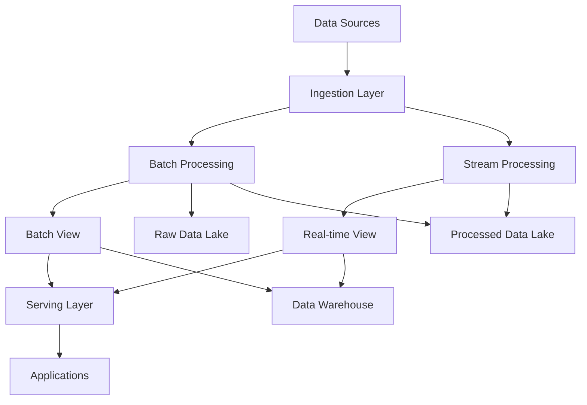

# Diretrizes de Data Architecture & Engineering - DATAMETRIA

<div align="center">

## Framework Completo para Arquitetura e Engenharia de Dados

[](https://datametria.io)
[](https://datametria.io)
[](https://datametria.io)
[](https://github.com/datametria/standards)

[🏗️ Arquitetura](#arquitetura-de-dados) • [🔄 Pipelines](#data-pipelines) •
[📊 Governança](#governanca-de-dados) • [🔒 Segurança](#seguranca-e-compliance) •
[📈 Monitoramento](#monitoramento-e-observabilidade) • [🎯 Qualidade](#qualidade-de-dados)

</div>

---

## 📋 Índice

1. [Visão Geral](#visao-geral)
2. [Arquitetura de Dados](#arquitetura-de-dados)
3. [Data Pipelines](#data-pipelines)
4. [Governança de Dados](#governanca-de-dados)
5. [Segurança e Compliance](#seguranca-e-compliance)
6. [Tecnologias e Ferramentas](#tecnologias-e-ferramentas)
7. [Monitoramento e Observabilidade](#monitoramento-e-observabilidade)
8. [Qualidade de Dados](#qualidade-de-dados)
9. [Performance e Otimização](#performance-e-otimizacao)

---

## 🎯 Visão Geral

### Princípios Fundamentais

- **📊 Data-Driven**: Decisões baseadas em dados confiáveis
- **🔄 Real-Time**: Processamento em tempo real quando necessário
- **🏗️ Escalável**: Arquitetura que cresce com o negócio
- **🔒 Seguro**: Proteção e privacidade dos dados
- **📈 Observável**: Monitoramento completo dos pipelines
- **♻️ Sustentável**: Otimização de custos e recursos

### Stack Tecnológico

| Categoria | Tecnologias | Uso |
|-----------|-------------|-----|
| **Ingestão** | Apache Kafka, AWS Kinesis, GCP Pub/Sub | Streaming de dados |
| **Processamento** | Apache Spark, Databricks, AWS Glue | ETL/ELT |
| **Armazenamento** | Data Lake (S3, GCS), Data Warehouse (Snowflake, BigQuery) | Persistência |
| **Orquestração** | Apache Airflow, AWS Step Functions, GCP Workflows | Workflows |
| **Qualidade** | Great Expectations, Deequ, Monte Carlo | Data Quality |
| **Governança** | Apache Atlas, AWS Glue Catalog, GCP Data Catalog | Metadados |

---

## 🏗️ Arquitetura de Dados

### Arquitetura Lambda



### Camadas da Arquitetura

#### Camada de Ingestão

```python
# Exemplo: Ingestão com Kafka
from kafka import KafkaProducer, KafkaConsumer
import json
from datetime import datetime

class DataIngestionService:
    """Serviço de ingestão de dados em tempo real."""

    def __init__(self, kafka_config: dict):
        self.producer = KafkaProducer(
            bootstrap_servers=kafka_config['servers'],
            value_serializer=lambda v: json.dumps(v).encode('utf-8')
        )

    def ingest_event(self, topic: str, event_data: dict):
        """Ingere evento no pipeline de dados."""
        enriched_event = {
            **event_data,
            'ingestion_timestamp': datetime.utcnow().isoformat(),
            'source': 'api',
            'version': '1.0'
        }

        self.producer.send(topic, enriched_event)
        self.producer.flush()
```

#### Camada de Processamento

```python
# Exemplo: Processamento com PySpark
from pyspark.sql import SparkSession
from pyspark.sql.functions import *
from pyspark.sql.types import *

class DataProcessor:
    """Processador de dados usando Apache Spark."""

    def __init__(self):
        self.spark = SparkSession.builder \
            .appName("DataProcessor") \
            .config("spark.sql.adaptive.enabled", "true") \
            .getOrCreate()

    def process_user_events(self, input_path: str, output_path: str):
        """Processa eventos de usuário."""
        df = self.spark.read.json(input_path)

        # Limpeza e transformação
        processed_df = df \
            .filter(col("user_id").isNotNull()) \
            .withColumn("event_date", to_date(col("timestamp"))) \
            .withColumn("event_hour", hour(col("timestamp"))) \
            .groupBy("user_id", "event_date", "event_type") \
            .agg(
                count("*").alias("event_count"),
                max("timestamp").alias("last_event_time")
            )

        # Salvar dados processados
        processed_df.write \
            .mode("overwrite") \
            .partitionBy("event_date") \
            .parquet(output_path)
```

#### Camada de Armazenamento

```
data-lake/
├── raw/                    # Dados brutos
│   ├── year=2024/
│   │   ├── month=01/
│   │   │   ├── day=15/
│   │   │   │   └── events.json
├── processed/              # Dados processados
│   ├── user_events/
│   │   ├── year=2024/
│   │   │   ├── month=01/
├── curated/               # Dados curados
│   ├── analytics/
│   │   ├── user_metrics/
└── archive/               # Dados arquivados
    ├── year=2023/
```

---

## 🔄 Data Pipelines

### Pipeline ETL/ELT

```python
# Exemplo: Pipeline com Apache Airflow
from airflow import DAG
from airflow.operators.python import PythonOperator
from airflow.providers.postgres.operators.postgres import PostgresOperator
from datetime import datetime, timedelta

default_args = {
    'owner': 'data-team',
    'depends_on_past': False,
    'start_date': datetime(2024, 1, 1),
    'email_on_failure': True,
    'email_on_retry': False,
    'retries': 2,
    'retry_delay': timedelta(minutes=5)
}

dag = DAG(
    'user_analytics_pipeline',
    default_args=default_args,
    description='Pipeline de analytics de usuários',
    schedule_interval='@daily',
    catchup=False,
    tags=['analytics', 'users']
)

def extract_user_data(**context):
    """Extrai dados de usuários da API."""
    # Implementação da extração
    pass

def transform_user_data(**context):
    """Transforma dados de usuários."""
    # Implementação da transformação
    pass

def load_to_warehouse(**context):
    """Carrega dados no data warehouse."""
    # Implementação do carregamento
    pass

# Definir tarefas
extract_task = PythonOperator(
    task_id='extract_user_data',
    python_callable=extract_user_data,
    dag=dag
)

transform_task = PythonOperator(
    task_id='transform_user_data',
    python_callable=transform_user_data,
    dag=dag
)

load_task = PythonOperator(
    task_id='load_to_warehouse',
    python_callable=load_to_warehouse,
    dag=dag
)

# Definir dependências
extract_task >> transform_task >> load_task
```

### Streaming Pipeline

```python
# Exemplo: Pipeline de streaming com Kafka Streams
from kafka import KafkaConsumer, KafkaProducer
import json
from typing import Dict, Any
from datetime import datetime

class StreamProcessor:
    """Processador de stream em tempo real."""

    def __init__(self, config: Dict[str, Any]):
        self.consumer = KafkaConsumer(
            config['input_topic'],
            bootstrap_servers=config['kafka_servers'],
            value_deserializer=lambda m: json.loads(m.decode('utf-8'))
        )

        self.producer = KafkaProducer(
            bootstrap_servers=config['kafka_servers'],
            value_serializer=lambda v: json.dumps(v).encode('utf-8')
        )

        self.output_topic = config['output_topic']

    def process_stream(self):
        """Processa stream de eventos."""
        for message in self.consumer:
            try:
                event = message.value

                # Processamento do evento
                processed_event = self.enrich_event(event)

                # Enviar para tópico de saída
                self.producer.send(self.output_topic, processed_event)

            except Exception as e:
                # Log do erro e envio para DLQ
                self.handle_error(message, e)

    def enrich_event(self, event: Dict[str, Any]) -> Dict[str, Any]:
        """Enriquece evento com dados adicionais."""
        return {
            **event,
            'processed_at': datetime.utcnow().isoformat(),
            'enriched': True
        }

    def handle_error(self, message, error):
        """Trata erros de processamento."""
        # Log do erro
        print(f"Error processing message: {error}")
        # Enviar para Dead Letter Queue
        pass
```

---

## 📊 Governança de Dados

### Data Catalog

```python
# Exemplo: Catalogação de dados
from dataclasses import dataclass
from typing import List, Optional
from enum import Enum
from datetime import datetime

class DataClassification(Enum):
    PUBLIC = "public"
    INTERNAL = "internal"
    CONFIDENTIAL = "confidential"
    RESTRICTED = "restricted"

@dataclass
class DataAsset:
    """Representa um ativo de dados no catálogo."""

    name: str
    description: str
    owner: str
    classification: DataClassification
    schema: dict
    location: str
    tags: List[str]
    created_at: datetime
    updated_at: datetime
    retention_period: Optional[int] = None

    def to_catalog_entry(self) -> dict:
        """Converte para entrada do catálogo."""
        return {
            'name': self.name,
            'description': self.description,
            'owner': self.owner,
            'classification': self.classification.value,
            'schema': self.schema,
            'location': self.location,
            'tags': self.tags,
            'metadata': {
                'created_at': self.created_at.isoformat(),
                'updated_at': self.updated_at.isoformat(),
                'retention_period_days': self.retention_period
            }
        }

class DataCatalog:
    """Catálogo de dados da organização."""

    def __init__(self, backend_config: dict):
        self.backend = self._init_backend(backend_config)

    def register_asset(self, asset: DataAsset):
        """Registra novo ativo de dados."""
        entry = asset.to_catalog_entry()
        self.backend.create_entry(entry)

    def search_assets(self, query: str, filters: dict = None) -> List[DataAsset]:
        """Busca ativos de dados."""
        results = self.backend.search(query, filters)
        return [self._parse_asset(result) for result in results]

    def _init_backend(self, config: dict):
        """Inicializa backend do catálogo."""
        # Implementação específica do backend
        pass

    def _parse_asset(self, result: dict) -> DataAsset:
        """Converte resultado em DataAsset."""
        # Implementação da conversão
        pass
```

### Lineage de Dados

```python
# Exemplo: Rastreamento de linhagem
class DataLineage:
    """Rastreamento de linhagem de dados."""

    def __init__(self):
        self.lineage_graph = {}

    def add_transformation(self, source: str, target: str,
                          transformation: str, metadata: dict = None):
        """Adiciona transformação à linhagem."""
        if target not in self.lineage_graph:
            self.lineage_graph[target] = []

        self.lineage_graph[target].append({
            'source': source,
            'transformation': transformation,
            'metadata': metadata or {},
            'timestamp': datetime.utcnow().isoformat()
        })

    def get_upstream_dependencies(self, dataset: str) -> List[str]:
        """Obtém dependências upstream de um dataset."""
        dependencies = []

        def traverse_upstream(node):
            if node in self.lineage_graph:
                for dep in self.lineage_graph[node]:
                    dependencies.append(dep['source'])
                    traverse_upstream(dep['source'])

        traverse_upstream(dataset)
        return list(set(dependencies))

    def get_downstream_dependencies(self, dataset: str) -> List[str]:
        """Obtém dependências downstream de um dataset."""
        downstream = []

        for target, sources in self.lineage_graph.items():
            for source_info in sources:
                if source_info['source'] == dataset:
                    downstream.append(target)
                    downstream.extend(self.get_downstream_dependencies(target))

        return list(set(downstream))
```

---

## 🔒 Segurança e Compliance

### Controle de Acesso

```python
# Exemplo: Sistema de controle de acesso
from enum import Enum
from typing import Set
import logging

class Permission(Enum):
    READ = "read"
    WRITE = "write"
    DELETE = "delete"
    ADMIN = "admin"

class DataAccessControl:
    """Sistema de controle de acesso a dados."""

    def __init__(self):
        self.permissions = {}
        self.data_classifications = {}

    def grant_permission(self, user: str, dataset: str,
                        permission: Permission):
        """Concede permissão a usuário."""
        if user not in self.permissions:
            self.permissions[user] = {}

        if dataset not in self.permissions[user]:
            self.permissions[user][dataset] = set()

        self.permissions[user][dataset].add(permission)

    def check_permission(self, user: str, dataset: str,
                        permission: Permission) -> bool:
        """Verifica se usuário tem permissão."""
        if user not in self.permissions:
            return False

        if dataset not in self.permissions[user]:
            return False

        return permission in self.permissions[user][dataset]

    def audit_access(self, user: str, dataset: str,
                    action: str, result: bool):
        """Registra auditoria de acesso."""
        audit_log = {
            'timestamp': datetime.utcnow().isoformat(),
            'user': user,
            'dataset': dataset,
            'action': action,
            'result': 'allowed' if result else 'denied',
            'ip_address': self._get_client_ip()
        }

        # Enviar para sistema de auditoria
        self._log_audit_event(audit_log)

    def _get_client_ip(self) -> str:
        """Obtém IP do cliente."""
        # Implementação específica
        return "127.0.0.1"

    def _log_audit_event(self, audit_log: dict):
        """Log do evento de auditoria."""
        logging.info(f"Audit: {audit_log}")
```

### Anonimização e Pseudonimização

```python
# Exemplo: Anonimização de dados
import hashlib
import secrets
from typing import Any, Dict, List

class DataAnonymizer:
    """Anonimizador de dados para compliance LGPD/GDPR."""

    def __init__(self, salt: str = None):
        self.salt = salt or secrets.token_hex(32)

    def pseudonymize_field(self, value: str, field_name: str) -> str:
        """Pseudonimiza campo usando hash."""
        combined = f"{value}{self.salt}{field_name}"
        return hashlib.sha256(combined.encode()).hexdigest()

    def anonymize_dataset(self, data: List[Dict[str, Any]],
                         pii_fields: List[str]) -> List[Dict[str, Any]]:
        """Anonimiza dataset removendo PII."""
        anonymized_data = []

        for record in data:
            anonymized_record = {}

            for field, value in record.items():
                if field in pii_fields:
                    # Pseudonimizar campos PII
                    anonymized_record[f"{field}_hash"] = \
                        self.pseudonymize_field(str(value), field)
                else:
                    anonymized_record[field] = value

            anonymized_data.append(anonymized_record)

        return anonymized_data

    def mask_sensitive_data(self, value: str, mask_char: str = "*") -> str:
        """Mascara dados sensíveis."""
        if len(value) <= 4:
            return mask_char * len(value)

        # Manter primeiros 2 e últimos 2 caracteres
        return value[:2] + mask_char * (len(value) - 4) + value[-2:]
```

---

## 🛠️ Tecnologias e Ferramentas

### Stack AWS

```python
# Exemplo: Pipeline AWS com CDK
from aws_cdk import (
    Stack,
    aws_s3 as s3,
    aws_glue as glue,
    aws_kinesis as kinesis,
    aws_lambda as _lambda,
    Duration
)
from constructs import Construct

class DataPipelineStack(Stack):
    """Stack de pipeline de dados AWS."""

    def __init__(self, scope: Construct, construct_id: str, **kwargs):
        super().__init__(scope, construct_id, **kwargs)

        # Data Lake S3
        self.data_lake = s3.Bucket(
            self, "DataLake",
            bucket_name="datametria-data-lake",
            versioned=True,
            lifecycle_rules=[
                s3.LifecycleRule(
                    id="ArchiveOldData",
                    enabled=True,
                    transitions=[
                        s3.Transition(
                            storage_class=s3.StorageClass.STANDARD_IA,
                            transition_after=Duration.days(30)
                        ),
                        s3.Transition(
                            storage_class=s3.StorageClass.GLACIER,
                            transition_after=Duration.days(90)
                        )
                    ]
                )
            ]
        )

        # Glue Database
        self.glue_database = glue.CfnDatabase(
            self, "GlueDatabase",
            catalog_id=self.account,
            database_input=glue.CfnDatabase.DatabaseInputProperty(
                name="datametria_catalog",
                description="Data catalog for analytics"
            )
        )

        # Kinesis Stream
        self.kinesis_stream = kinesis.Stream(
            self, "EventStream",
            stream_name="datametria-events",
            shard_count=2,
            retention_period=Duration.days(7)
        )
```

### Stack GCP

```python
# Exemplo: Pipeline no Google Cloud
from google.cloud import bigquery, storage, pubsub_v1
from google.cloud.functions import CloudFunction

class GCPDataPipeline:
    """Pipeline de dados no Google Cloud Platform."""

    def __init__(self, project_id: str):
        self.project_id = project_id
        self.bq_client = bigquery.Client(project=project_id)
        self.storage_client = storage.Client(project=project_id)
        self.publisher = pubsub_v1.PublisherClient()

    def create_dataset(self, dataset_id: str):
        """Cria dataset no BigQuery."""
        dataset = bigquery.Dataset(f"{self.project_id}.{dataset_id}")
        dataset.location = "US"
        dataset.description = "Analytics dataset"

        dataset = self.bq_client.create_dataset(dataset, exists_ok=True)
        return dataset

    def load_data_to_bq(self, source_uri: str, table_id: str):
        """Carrega dados do Cloud Storage para BigQuery."""
        job_config = bigquery.LoadJobConfig(
            source_format=bigquery.SourceFormat.PARQUET,
            write_disposition=bigquery.WriteDisposition.WRITE_TRUNCATE,
        )

        load_job = self.bq_client.load_table_from_uri(
            source_uri, table_id, job_config=job_config
        )

        load_job.result()  # Aguarda conclusão
        return load_job

    def create_pubsub_topic(self, topic_name: str):
        """Cria tópico Pub/Sub."""
        topic_path = self.publisher.topic_path(self.project_id, topic_name)

        try:
            topic = self.publisher.create_topic(request={"name": topic_path})
            return topic
        except Exception as e:
            print(f"Topic already exists or error: {e}")
            return None
```

---

## 📊 Monitoramento e Observabilidade

### Métricas de Pipeline

```python
# Exemplo: Monitoramento de pipeline
from prometheus_client import Counter, Histogram, Gauge
import time
from functools import wraps

# Métricas Prometheus
pipeline_runs = Counter('pipeline_runs_total', 'Total pipeline runs', ['pipeline', 'status'])
pipeline_duration = Histogram('pipeline_duration_seconds', 'Pipeline duration', ['pipeline'])
data_quality_score = Gauge('data_quality_score', 'Data quality score', ['dataset'])

class PipelineMonitor:
    """Monitor de pipeline de dados."""

    def __init__(self, pipeline_name: str):
        self.pipeline_name = pipeline_name

    def monitor_execution(self, func):
        """Decorator para monitorar execução de pipeline."""
        @wraps(func)
        def wrapper(*args, **kwargs):
            start_time = time.time()

            try:
                result = func(*args, **kwargs)
                pipeline_runs.labels(
                    pipeline=self.pipeline_name,
                    status='success'
                ).inc()
                return result

            except Exception as e:
                pipeline_runs.labels(
                    pipeline=self.pipeline_name,
                    status='failure'
                ).inc()
                raise

            finally:
                duration = time.time() - start_time
                pipeline_duration.labels(
                    pipeline=self.pipeline_name
                ).observe(duration)

        return wrapper

    def update_quality_score(self, dataset: str, score: float):
        """Atualiza score de qualidade dos dados."""
        data_quality_score.labels(dataset=dataset).set(score)
```

### Alertas e Notificações

```python
# Exemplo: Sistema de alertas
from dataclasses import dataclass
from enum import Enum
from typing import List, Callable

class AlertSeverity(Enum):
    INFO = "info"
    WARNING = "warning"
    ERROR = "error"
    CRITICAL = "critical"

@dataclass
class Alert:
    """Representa um alerta do sistema."""

    title: str
    message: str
    severity: AlertSeverity
    source: str
    timestamp: datetime
    metadata: dict = None

class AlertManager:
    """Gerenciador de alertas."""

    def __init__(self):
        self.handlers: List[Callable[[Alert], None]] = []

    def add_handler(self, handler: Callable[[Alert], None]):
        """Adiciona handler de alerta."""
        self.handlers.append(handler)

    def send_alert(self, alert: Alert):
        """Envia alerta para todos os handlers."""
        for handler in self.handlers:
            try:
                handler(alert)
            except Exception as e:
                # Log erro do handler
                print(f"Error in alert handler: {e}")

    def check_data_freshness(self, dataset: str, max_age_hours: int):
        """Verifica freshness dos dados."""
        last_update = self._get_last_update(dataset)
        age_hours = (datetime.utcnow() - last_update).total_seconds() / 3600

        if age_hours > max_age_hours:
            alert = Alert(
                title="Data Freshness Alert",
                message=f"Dataset {dataset} is {age_hours:.1f} hours old",
                severity=AlertSeverity.WARNING,
                source="data_freshness_monitor",
                timestamp=datetime.utcnow(),
                metadata={'dataset': dataset, 'age_hours': age_hours}
            )
            self.send_alert(alert)

    def _get_last_update(self, dataset: str) -> datetime:
        """Obtém timestamp da última atualização."""
        # Implementação específica
        return datetime.utcnow()
```

---

## 🎯 Qualidade de Dados

### Framework de Qualidade

```python
# Exemplo: Framework de qualidade com Great Expectations
import great_expectations as ge
from great_expectations.core import ExpectationSuite
from great_expectations.checkpoint import SimpleCheckpoint

class DataQualityFramework:
    """Framework de qualidade de dados."""

    def __init__(self, context_root_dir: str):
        self.context = ge.get_context(context_root_dir=context_root_dir)

    def create_expectation_suite(self, suite_name: str,
                                dataset_name: str) -> ExpectationSuite:
        """Cria suite de expectativas."""
        suite = self.context.create_expectation_suite(
            expectation_suite_name=suite_name,
            overwrite_existing=True
        )

        # Expectativas básicas
        suite.expect_table_row_count_to_be_between(min_value=1)
        suite.expect_column_values_to_not_be_null(column="id")
        suite.expect_column_values_to_be_unique(column="id")

        return suite

    def validate_dataset(self, dataset_name: str, suite_name: str) -> dict:
        """Valida dataset usando suite de expectativas."""
        checkpoint_config = {
            "name": f"{dataset_name}_checkpoint",
            "config_version": 1.0,
            "template_name": None,
            "module_name": "great_expectations.checkpoint",
            "class_name": "SimpleCheckpoint",
            "run_name_template": "%Y%m%d-%H%M%S-my-run-name-template",
            "expectation_suite_name": suite_name,
            "batch_request": {
                "datasource_name": "my_datasource",
                "data_connector_name": "default_inferred_data_connector_name",
                "data_asset_name": dataset_name,
            },
            "action_list": [
                {
                    "name": "store_validation_result",
                    "action": {
                        "class_name": "StoreValidationResultAction",
                    },
                },
                {
                    "name": "update_data_docs",
                    "action": {
                        "class_name": "UpdateDataDocsAction",
                    },
                },
            ],
        }

        checkpoint = SimpleCheckpoint(
            f"{dataset_name}_checkpoint",
            self.context,
            **checkpoint_config
        )

        return checkpoint.run()
```

### Métricas de Qualidade

```python
# Exemplo: Cálculo de métricas de qualidade
from typing import Dict, Any, Callable
import pandas as pd

class DataQualityMetrics:
    """Calculador de métricas de qualidade."""

    def calculate_completeness(self, df: pd.DataFrame) -> Dict[str, float]:
        """Calcula completeness por coluna."""
        total_rows = len(df)
        completeness = {}

        for column in df.columns:
            non_null_count = df[column].notna().sum()
            completeness[column] = (non_null_count / total_rows) * 100

        return completeness

    def calculate_uniqueness(self, df: pd.DataFrame,
                           key_columns: List[str]) -> float:
        """Calcula uniqueness das chaves."""
        total_rows = len(df)
        unique_rows = df[key_columns].drop_duplicates().shape[0]
        return (unique_rows / total_rows) * 100

    def calculate_validity(self, df: pd.DataFrame,
                          validation_rules: Dict[str, Callable]) -> Dict[str, float]:
        """Calcula validity baseada em regras."""
        validity = {}

        for column, rule in validation_rules.items():
            if column in df.columns:
                valid_count = df[column].apply(rule).sum()
                validity[column] = (valid_count / len(df)) * 100

        return validity

    def generate_quality_report(self, df: pd.DataFrame,
                               key_columns: List[str] = None,
                               validation_rules: Dict[str, Callable] = None) -> Dict[str, Any]:
        """Gera relatório completo de qualidade."""
        report = {
            'timestamp': datetime.utcnow().isoformat(),
            'total_rows': len(df),
            'total_columns': len(df.columns),
            'completeness': self.calculate_completeness(df),
        }

        if key_columns:
            report['uniqueness'] = self.calculate_uniqueness(df, key_columns)

        if validation_rules:
            report['validity'] = self.calculate_validity(df, validation_rules)

        # Score geral de qualidade
        avg_completeness = sum(report['completeness'].values()) / len(report['completeness'])
        report['overall_quality_score'] = avg_completeness

        return report
```

---

## ⚡ Performance e Otimização

### Otimização de Queries

```sql
-- Exemplo: Otimização de queries BigQuery
-- Particionamento por data
CREATE TABLE `project.dataset.events_partitioned`
PARTITION BY DATE(event_timestamp)
CLUSTER BY user_id, event_type
AS
SELECT
    user_id,
    event_type,
    event_timestamp,
    event_data
FROM `project.dataset.events_raw`
WHERE event_timestamp >= '2024-01-01';

-- Query otimizada com filtros de partição
SELECT
    user_id,
    COUNT(*) as event_count,
    COUNT(DISTINCT event_type) as unique_events
FROM `project.dataset.events_partitioned`
WHERE DATE(event_timestamp) BETWEEN '2024-01-01' AND '2024-01-31'
    AND event_type IN ('login', 'purchase', 'view')
GROUP BY user_id
HAVING event_count > 10;
```

### Cache e Materialização

```python
# Exemplo: Sistema de cache para dados
from functools import wraps
import redis
import pickle
from typing import Any, Optional

class DataCache:
    """Sistema de cache para dados processados."""

    def __init__(self, redis_host: str = 'localhost', redis_port: int = 6379):
        self.redis_client = redis.Redis(host=redis_host, port=redis_port, db=0)
        self.default_ttl = 3600  # 1 hora

    def cache_result(self, key_prefix: str, ttl: int = None):
        """Decorator para cache de resultados."""
        def decorator(func):
            @wraps(func)
            def wrapper(*args, **kwargs):
                # Gerar chave do cache
                cache_key = f"{key_prefix}:{hash(str(args) + str(kwargs))}"

                # Tentar obter do cache
                cached_result = self.get(cache_key)
                if cached_result is not None:
                    return cached_result

                # Executar função e cachear resultado
                result = func(*args, **kwargs)
                self.set(cache_key, result, ttl or self.default_ttl)

                return result
            return wrapper
        return decorator

    def set(self, key: str, value: Any, ttl: int = None):
        """Armazena valor no cache."""
        serialized_value = pickle.dumps(value)
        self.redis_client.setex(key, ttl or self.default_ttl, serialized_value)

    def get(self, key: str) -> Optional[Any]:
        """Obtém valor do cache."""
        serialized_value = self.redis_client.get(key)
        if serialized_value:
            return pickle.loads(serialized_value)
        return None

    def invalidate_pattern(self, pattern: str):
        """Invalida chaves que correspondem ao padrão."""
        keys = self.redis_client.keys(pattern)
        if keys:
            self.redis_client.delete(*keys)

# Uso do cache
cache = DataCache()

@cache.cache_result("user_metrics", ttl=1800)
def calculate_user_metrics(user_id: str, date_range: tuple) -> dict:
    """Calcula métricas de usuário (com cache)."""
    # Processamento pesado aqui
    return {
        'total_events': 1000,
        'unique_sessions': 50,
        'avg_session_duration': 300
    }
```

---

## 📚 Referências e Recursos

### Documentação Oficial

- **[Apache Spark](https://spark.apache.org/docs/latest/)** - Processamento distribuído
- **[Apache Kafka](https://kafka.apache.org/documentation/)** - Streaming de dados
- **[Apache Airflow](https://airflow.apache.org/docs/)** - Orquestração de workflows
- **[Great Expectations](https://docs.greatexpectations.io/)** - Qualidade de dados
- **[dbt](https://docs.getdbt.com/)** - Transformação de dados

### Ferramentas Cloud

- **[AWS Glue](https://docs.aws.amazon.com/glue/)** - ETL serverless
- **[Google Cloud Dataflow](https://cloud.google.com/dataflow/docs)** - Processamento de stream/batch
- **[Azure Data Factory](https://docs.microsoft.com/azure/data-factory/)** - Integração de dados

### Compliance e Governança

- **[LGPD](https://www.gov.br/cidadania/pt-br/acesso-a-informacao/lgpd)** - Lei Geral de Proteção de Dados
- **[GDPR](https://gdpr.eu/)** - General Data Protection Regulation
- **[Data Management Body of Knowledge (DMBOK)](https://www.dama.org/cpages/body-of-knowledge)** - Framework de gestão de dados

---

<div align="center">

**Versão**: 1.0.0 | **Última Atualização**: 15/09/2025
**Autor**: Vander Loto - DATAMETRIA

---

**Para dúvidas sobre Data Architecture & Engineering**: vander.loto@datametria.io

</div>
