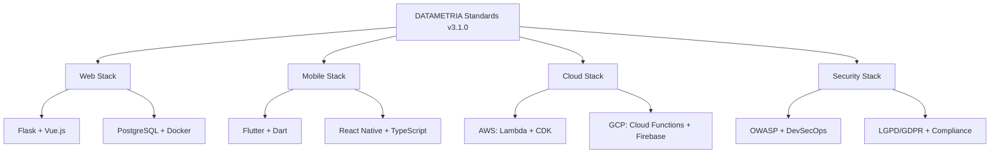
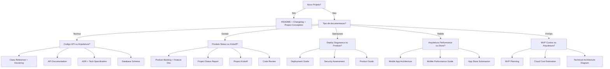
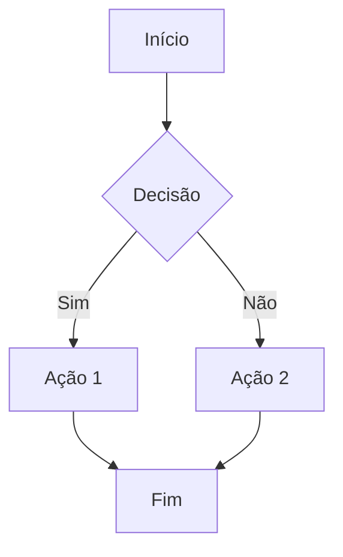
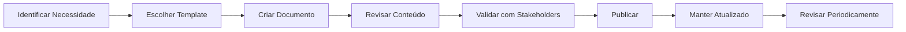
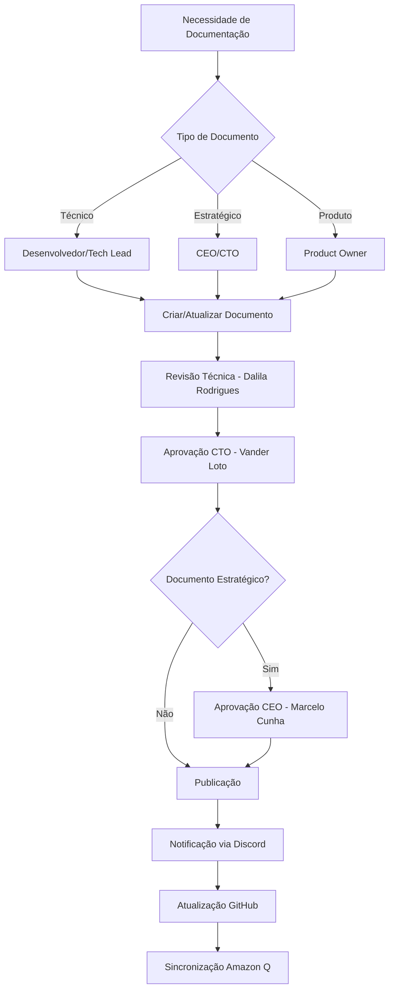
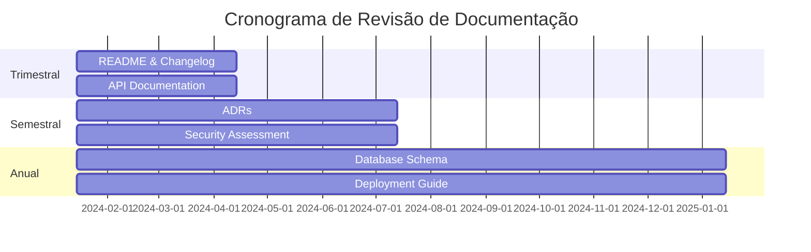
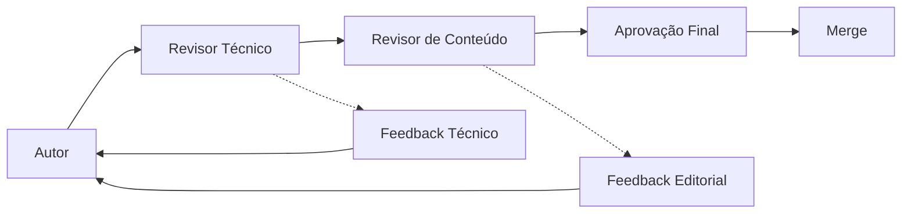
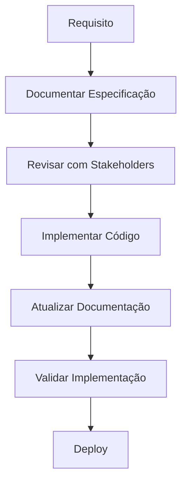

# Diretrizes de Documentação - Projetos DATAMETRIA

Este documento estabelece as diretrizes e melhores práticas de documentação para projetos da Datametria. O objetivo é promover a consistência, qualidade e padronização da documentação em todos os projetos da organização.

**Versão:** 1.4
**Última atualização:** 15/09/2025
**Autor:** Vander Loto - CTO DATAMETRIA

---

## Índice

1. [Filosofia de Documentação](#1-filosofia-de-documentacao)
2. [Templates Disponíveis](#2-templates-disponiveis)
3. [Quando Usar Cada Template](#3-quando-usar-cada-template)
4. [Estrutura de Documentação](#4-estrutura-de-documentacao)
5. [Padrões de Escrita](#5-padroes-de-escrita)
6. [Processo de Documentação](#6-processo-de-documentacao)
7. [Ferramentas e Automação](#7-ferramentas-e-automacao)
8. [Manutenção e Versionamento](#8-manutencao-e-versionamento)
9. [Qualidade e Revisão](#9-qualidade-e-revisao)
10. [Integração com Desenvolvimento](#10-integracao-com-desenvolvimento)
11. [Checklist de Documentação](#11-checklist-de-documentacao)

---

## 1. Filosofia de Documentação

### Princípios Fundamentais

- **📖 Documentação como Código**: Tratada com a mesma importância que o código-fonte
- **🎯 Orientada ao Usuário**: Focada nas necessidades de quem vai usar
- **🔄 Viva e Atualizada**: Mantida sincronizada com o desenvolvimento
- **📱 Acessível**: Fácil de encontrar, ler e entender
- **🏗️ Estruturada**: Organizada de forma lógica e consistente
- **🤖 AI-First Development**: 90% do desenvolvimento executado pelo Amazon Q com 10% de supervisão humana

### Objetivos

| Objetivo | Descrição | Benefício |
|----------|-----------|-----------|
| **Consistência** | Padronização em todos os projetos | Reduz curva de aprendizado |
| **Qualidade** | Documentação clara e completa | Facilita manutenção e evolução |
| **Eficiência** | Templates prontos para uso | Acelera processo de documentação |
| **Colaboração** | Facilita trabalho em equipe | Melhora comunicação entre times |
| **Compliance** | Atende requisitos regulatórios | Reduz riscos legais e técnicos |

### Audiência-Alvo

- **Amazon Q Developer**: IA responsável por 90% da implementação
- **Supervisores Humanos**: 10% de análise crítica e moderação
- **Desenvolvedores**: Documentação técnica e APIs (supervisão)
- **Arquitetos**: Decisões arquiteturais e design (supervisão)
- **Product Owners**: Funcionalidades e roadmap (supervisão)
- **DevOps**: Deploy e infraestrutura (supervisão)
- **Auditores**: Segurança e compliance (supervisão)
- **Usuários Finais**: Guias de uso e tutoriais

---

## 2. Templates Disponíveis

### Visão Geral do Framework v3.1.0

## Framework Enterprise Completo: 25 templates profissionais + 10 diretrizes integradas cobrindo todo o ciclo de desenvolvimento enterprise

### Estatísticas do Framework

- **📋 Templates**: 25 templates organizados em 6 categorias
- **📖 Diretrizes**: 10 diretrizes completas (100+ seções)
- **🔧 Tecnologias**: 35+ tecnologias cobertas
- **🤖 AI Integration**: Amazon Q Developer nativo
- **♿ Compliance**: WCAG 2.1 AA + LGPD/GDPR + OWASP
- **☁️ Multi-Cloud**: AWS + GCP + Firebase

### Templates por Categoria (25 templates)

#### 📄 Documentação de Projeto (4 templates)

| Template | Arquivo | Propósito | Audiência | Diretriz |
|----------|---------|-----------|-----------|----------|
| **README** | `template-readme.md` | Documentação principal do projeto | Todos | Documentação |
| **Changelog** | `template-changelog.md` | Histórico de mudanças | Todos | Documentação |
| **Release Notes** | `template-release-notes.md` | Notas de lançamento | Stakeholders | Documentação |
| **Project Conception** | `template-project-conception.md` | Concepção e visão do projeto | Equipe, Stakeholders | UX/UI Design |

#### 🏗️ Documentação Técnica (6 templates)

| Template | Arquivo | Propósito | Audiência | Diretriz |
|----------|---------|-----------|-----------|----------|
| **ADR** | `template-adr.md` | Decisões arquiteturais | Arquitetos, Devs | Web/AWS/Mobile |
| **API Documentation** | `template-api-documentation.md` | Documentação de APIs | Devs, Integradores | Web Development |
| **Class Reference** | `template-class-reference.md` | Referência de classes | Desenvolvedores | Python Automation |
| **Docstring Google Style** | `template-docstring-google-style.md` | Documentação inline | Desenvolvedores | Python Automation |
| **Database Schema** | `template-database-schema-documentation.md` | Documentação de BD | DBAs, Devs | Web Development |
| **Technical Specification** | `template-technical-specification.md` | Especificação técnica | Arquitetos | Web/AWS/GCP |

#### 📊 Gestão de Projeto (5 templates)

| Template | Arquivo | Propósito | Audiência | Diretriz |
|----------|---------|-----------|-----------|----------|
| **Product Backlog** | `template-product-backlog.md` | Gestão de produto | PO, Scrum Master | UX/UI Design |
| **Feature Documentation** | `template-feature-documentation.md` | Documentação de funcionalidades | Devs, QA | Todas |
| **Code Review** | `template-code-review.md` | Revisão de código | Desenvolvedores | Security Development |
| **Project Status Report** | `template-project-status-report.md` | Status de projeto | Gerentes | Documentação |
| **Project Kickoff** | `template-project-kickoff.md` | Início de projeto | Equipe | Documentação |

#### 🚀 Operações (3 templates)

| Template | Arquivo | Propósito | Audiência | Diretriz |
|----------|---------|-----------|-----------|----------|
| **Deployment Guide** | `template-deployment-guide.md` | Guia de deploy | DevOps, SRE | AWS/GCP Development |
| **Product Guide** | `template-product-guide.md` | Guia do produto | Usuários, Suporte | UX/UI Design |
| **Security Assessment** | `template-security-assessment.md` | Avaliação de segurança | Security, Auditores | Security Development |

#### 📱 Mobile Development (3 templates)

| Template | Arquivo | Propósito | Audiência | Diretriz |
|----------|---------|-----------|-----------|----------|
| **Mobile App Architecture** | `template-mobile-app-architecture.md` | Arquitetura de apps móveis | Mobile Devs, Arquitetos | Mobile Flutter |
| **App Store Submission** | `template-app-store-submission.md` | Submissão em app stores | Mobile Devs, PMs | Mobile Flutter |
| **Mobile Performance Guide** | `template-mobile-performance-guide.md` | Otimização de performance | Mobile Devs | Mobile Flutter |

#### 💰 FinOps e Planejamento (4 templates)

| Template | Arquivo | Propósito | Audiência | Diretriz |
|----------|---------|-----------|-----------|----------|
| **MVP Planning** | `template-mvp-planning.md` | Planejamento de MVP | PO, Arquitetos | UX/UI Design |
| **Cloud Cost Estimation** | `template-cloud-infrastructure-cost-estimation.md` | Estimativa de custos | FinOps, Arquitetos | AWS/GCP Development |
| ## Technical Architecture Diagram | `template-technical-architecture-diagram.md` | Diagramas arquiteturais | Arquitetos, Devs | Web/AWS/GCP |
| **Developer Guide** | `../DEVELOPER_GUIDE.md` | Guia completo do desenvolvedor | Desenvolvedores | Todas |

### Diretrizes DATAMETRIA v3.1.0 (10 diretrizes)

#### Stack Tecnológico Completo

| Diretriz | Tecnologias Principais | Seções | Templates Relacionados |
|----------|----------------------|--------|------------------------|
| **🌐 Web Development** | Flask + Vue.js 3 + SQLAlchemy + Docker | 14 | README, API Docs, Database Schema, Deployment |
| **🐍 Python + Automação** | Python + Poetry + Pywinauto + Testing | 9 | Class Reference, Docstring, Code Review |
| **☁️ AWS Development** | Lambda + CDK + Step Functions + FinOps | 9 | Deployment Guide, Cost Estimation, Tech Spec |
| **☁️ GCP + Firebase** | Cloud Functions + Firestore + Firebase | 9 | Deployment Guide, Cost Estimation, API Docs |
| **🎨 UX/UI Design** | Figma + Vue Material + Flutter + WCAG | 12 | Product Guide, MVP Planning, Project Conception |
| **📚 Documentação** | Markdown + Templates + Amazon Q | 11 | Todos os 25 templates |
| **📊 Logging Enterprise** | Python Logging + LGPD/GDPR + Compliance | 9 | Security Assessment, Feature Docs |
| **🔒 Security Development** | OWASP + LGPD/GDPR + DevSecOps | 10 | Security Assessment, Code Review |
| **📱 Mobile Flutter** | Flutter + Dart + Clean Architecture | 14 | Mobile Architecture, Performance, App Store |
| **🛡️ Reverse Engineering Prevention** | Obfuscation + Protection + Monitoring | 8 | Security Assessment, Technical Specification |

### Integração Enterprise

#### Cobertura Multi-Platform



#### Características dos Templates

- **📱 Responsivos**: Design adaptável com badges dinâmicos
- **🔗 Navegáveis**: Índices automáticos e links funcionais
- **📊 Visuais**: Badges, tabelas, diagramas Mermaid
- **✅ Completos**: Seções abrangentes com exemplos
- **🎯 Práticos**: Casos de uso reais e código funcional
- **🤖 AI-Ready**: Otimizados para Amazon Q Developer
- **♿ Acessíveis**: Padrões WCAG 2.1 AA
- **🔒 Seguros**: Security by design integrado
- **☁️ Multi-Cloud**: Suporte AWS + GCP + Firebase
- **📱 Cross-Platform**: Web + Mobile + Desktop

### Mapeamento Template → Diretriz

#### Templates por Diretriz Técnica

| Diretriz | Templates Principais | Templates Secundários |
|----------|---------------------|----------------------|
| **Web Development** | API Documentation, Database Schema, Deployment Guide | README, Technical Specification |
| **Python Automation** | Class Reference, Docstring Google Style | Code Review, Feature Documentation |
| **AWS Development** | Deployment Guide, Cloud Cost Estimation | Technical Specification, Security Assessment |
| **GCP + Firebase** | Deployment Guide, API Documentation | Cloud Cost Estimation, Technical Specification |
| **UX/UI Design** | Product Guide, MVP Planning, Project Conception | Product Backlog, Feature Documentation |
| **Documentação** | Todos os 25 templates | - |
| **Logging Enterprise** | Security Assessment | Feature Documentation, Code Review |
| **Security Development** | Security Assessment, Code Review | Deployment Guide, Technical Specification |
| **Mobile Flutter** | Mobile App Architecture, Mobile Performance, App Store | Technical Specification, Feature Documentation |
| **Reverse Engineering** | Security Assessment | Technical Specification, Code Review |

---

## 3. Quando Usar Cada Template

### Matriz de Decisão Enterprise



### Cenários de Uso por Categoria

#### 🚀 Início de Projeto

#### Templates Obrigatórios:

- `README.md` - Documentação principal
- `CHANGELOG.md` - Histórico de versões
- `template-project-conception.md` - Concepção e visão do projeto

#### Templates Recomendados:

- `template-project-kickoff.md` - Para projetos com equipes
- `template-mvp-planning.md` - Para produtos com MVP
- `template-product-backlog.md` - Se metodologia ágil

#### 📦 Release de Versão

#### Templates Obrigatórios:

- Atualizar `CHANGELOG.md`
- `template-release-notes.md` - Notas da versão

#### Templates Opcionais:

- `template-deployment-guide.md` - Se mudanças de deploy
- `template-product-guide.md` - Para produtos com usuários finais

#### 🔧 Desenvolvimento de API

#### Templates Obrigatórios:

- `template-api-documentation.md` - Documentação da API
- `template-docstring-google-style.md` - Documentação inline

#### Templates Recomendados:

- `template-class-reference.md` - Para classes principais
- `template-technical-specification.md` - Para APIs complexas

#### 📱 Desenvolvimento Mobile

#### Templates Obrigatórios:

- `template-mobile-app-architecture.md` - Arquitetura do app
- `template-mobile-performance-guide.md` - Otimização de performance

#### Templates para Publicação:

- `template-app-store-submission.md` - Submissão nas lojas

#### 💰 FinOps e Planejamento

#### Templates para Custos:

- `template-cloud-infrastructure-cost-estimation.md` - Estimativa de custos
- `template-mvp-planning.md` - Planejamento de MVP

#### Templates para Arquitetura:

- `template-technical-architecture-diagram.md` - Diagramas técnicos

#### 🗄️ Mudanças no Banco

#### Templates Obrigatórios:

- `template-database-schema-documentation.md` - Documentação do schema
- Atualizar `CHANGELOG.md` com migrations

#### 🔒 Auditoria de Segurança

#### Templates Obrigatórios:

- `template-security-assessment.md` - Relatório de segurança

#### Templates Relacionados:

- Atualizar `README.md` com práticas de segurança

### Critérios de Seleção Expandidos

| Critério | Template Recomendado | Categoria | Justificativa |
|----------|---------------------|-----------|---------------|
| **Projeto Novo** | README + Changelog + Project Conception | Projeto | Base essencial completa |
| **API REST** | API Documentation + Class Reference | Técnica | Facilita integração |
| **Decisão Técnica** | ADR + Technical Specification | Técnica | Registra contexto e detalhes |
| **Nova Funcionalidade** | Feature Documentation | Gestão | Especifica requisitos |
| **Deploy Complexo** | Deployment Guide | Operações | Reduz erros |
| **Produto para Usuários** | Product Guide | Operações | Facilita adoção |
| **Auditoria** | Security Assessment | Operações | Compliance |
| **Mudança de Schema** | Database Schema | Técnica | Documenta estrutura |
| **App Mobile** | Mobile App Architecture | Mobile | Estrutura do app |
| **Performance Mobile** | Mobile Performance Guide | Mobile | Otimização |
| **Publicação App** | App Store Submission | Mobile | Processo de publicação |
| **Planejamento MVP** | MVP Planning | FinOps | Estratégia de produto |
| **Estimativa Custos** | Cloud Cost Estimation | FinOps | Controle financeiro |
| **Diagramas Técnicos** | Technical Architecture Diagram | FinOps | Visualização arquitetural |
| **Gestão de Equipe** | Project Status Report + Code Review | Gestão | Acompanhamento |
| **Início de Sprint** | Project Kickoff | Gestão | Alinhamento de equipe |

---

## 4. Estrutura de Documentação

### Organização de Arquivos Enterprise

```
projeto/
├── README.md                           # Documentação principal
├── CHANGELOG.md                        # Histórico de mudanças
├── DEVELOPER_GUIDE.md                  # Guia completo do desenvolvedor
├── docs/
│   ├── project/                        # 📄 Documentação de Projeto (4 templates)
│   │   ├── project-conception.md       # Concepção inicial do projeto
│   │   ├── project-kickoff.md          # Documento de início do projeto
│   │   └── releases/
│   │       ├── v1.0.0-release-notes.md
│   │       ├── v1.1.0-release-notes.md
│   │       └── v2.0.0-release-notes.md
│   ├── technical/                      # 🏗️ Documentação Técnica (6 templates)
│   │   ├── architecture/
│   │   │   ├── ADR-001-database-choice.md
│   │   │   ├── ADR-002-api-design.md
│   │   │   ├── ADR-003-security-framework.md
│   │   │   ├── technical-specification.md
│   │   │   └── technical-architecture-diagram.md
│   │   ├── api/
│   │   │   ├── api-documentation.md
│   │   │   ├── authentication.md
│   │   │   └── endpoints/
│   │   │       ├── users.md
│   │   │       ├── projects.md
│   │   │       ├── auth.md
│   │   │       └── admin.md
│   │   ├── code/
│   │   │   ├── class-reference.md
│   │   │   ├── docstring-google-style-examples.md
│   │   │   └── modules/
│   │   │       ├── core.md
│   │   │       ├── utils.md
│   │   │       └── services.md
│   │   └── database/
│   │       ├── schema-documentation.md
│   │       ├── data-models.md
│   │       └── migrations/
│   │           ├── 001-initial-schema.sql
│   │           ├── 002-add-audit-tables.sql
│   │           ├── 003-user-permissions.sql
│   │           └── 004-performance-indexes.sql
│   ├── management/                     # 📊 Gestão de Projeto (5 templates)
│   │   ├── product/
│   │   │   ├── product-backlog.md
│   │   │   ├── feature-documentation.md
│   │   │   └── user-stories/
│   │   │       ├── epic-001-user-auth.md
│   │   │       ├── epic-002-dashboard.md
│   │   │       └── epic-003-reporting.md
│   │   ├── reviews/
│   │   │   ├── code-review-template.md
│   │   │   └── review-history/
│   │   │       ├── 2025-01-sprint-1.md
│   │   │       └── 2025-01-sprint-2.md
│   │   └── reports/
│   │       ├── project-status-report.md
│   │       └── monthly/
│   │           ├── 2025-01-status.md
│   │           └── 2025-02-status.md
│   ├── operations/                     # 🚀 Operações (3 templates)
│   │   ├── deployment/
│   │   │   ├── deployment-guide.md
│   │   │   ├── ci-cd-pipeline.md
│   │   │   └── environments/
│   │   │       ├── development.md
│   │   │       ├── staging.md
│   │   │       ├── production.md
│   │   │       └── disaster-recovery.md
│   │   ├── security/
│   │   │   ├── security-assessment.md
│   │   │   ├── penetration-testing.md
│   │   │   └── compliance/
│   │   │       ├── lgpd-compliance.md
│   │   │       ├── gdpr-compliance.md
│   │   │       ├── iso27001.md
│   │   │       └── owasp-checklist.md
│   │   └── user-guides/
│   │       ├── product-guide.md
│   │       ├── admin-guide.md
│   │       ├── troubleshooting.md
│   │       └── faq.md
│   ├── mobile/                         # 📱 Mobile Development (3 templates)
│   │   ├── architecture/
│   │   │   ├── mobile-app-architecture.md
│   │   │   ├── flutter-structure.md
│   │   │   └── state-management.md
│   │   ├── performance/
│   │   │   ├── mobile-performance-guide.md
│   │   │   ├── optimization-strategies.md
│   │   │   └── testing/
│   │   │       ├── unit-tests.md
│   │   │       ├── integration-tests.md
│   │   │       └── e2e-tests.md
│   │   └── publishing/
│   │       ├── app-store-submission.md
│   │       ├── google-play-submission.md
│   │       └── release-process/
│   │           ├── ios-release.md
│   │           └── android-release.md
│   └── finops/                         # 💰 FinOps e Planejamento (4 templates)
│       ├── planning/
│       │   ├── mvp-planning.md
│       │   ├── roadmap.md
│       │   └── milestones/
│       │       ├── q1-2025.md
│       │       └── q2-2025.md
│       ├── costs/
│       │   ├── cloud-infrastructure-cost-estimation.md
│       │   ├── aws-cost-analysis.md
│       │   ├── gcp-cost-analysis.md
│       │   └── monthly-reports/
│       │       ├── 2025-01-costs.md
│       │       └── 2025-02-costs.md
│       └── architecture/
│           ├── technical-architecture-diagram.md
│           ├── system-overview.md
│           └── diagrams/
│               ├── infrastructure.mmd
│               ├── data-flow.mmd
│               └── security-model.mmd
├── .amazonq/
│   └── rules/                          # 🤖 Regras Amazon Q Developer
│       ├── datametria_std_documentation.md     # Diretrizes principais
│       ├── datametria_std_web_dev.md           # Web Development
│       ├── datametria_std_python_automation.md # Python + Automação
│       ├── datametria_std_aws_development.md   # AWS Development
│       ├── datametria_std_gcp_firebase.md      # GCP + Firebase
│       ├── datametria_std_ux_ui.md             # UX/UI Design
│       ├── datametria_std_logging.md           # Logging Enterprise
│       ├── datametria_std_security.md          # Security Development
│       ├── datametria_std_mobile_flutter.md    # Mobile Flutter
│       ├── datametria_std_reverse_engineering_prevention.md # RE Prevention
│       └── templates/                          # 25 Templates organizados
│           ├── project/
│           │   ├── template-readme.md
│           │   ├── template-changelog.md
│           │   ├── template-release-notes.md
│           │   └── template-project-conception.md
│           ├── technical/
│           │   ├── template-adr.md
│           │   ├── template-api-documentation.md
│           │   ├── template-class-reference.md
│           │   ├── template-docstring-google-style.md
│           │   ├── template-database-schema-documentation.md
│           │   └── template-technical-specification.md
│           ├── management/
│           │   ├── template-product-backlog.md
│           │   ├── template-feature-documentation.md
│           │   ├── template-code-review.md
│           │   ├── template-project-status-report.md
│           │   └── template-project-kickoff.md
│           ├── operations/
│           │   ├── template-deployment-guide.md
│           │   ├── template-product-guide.md
│           │   └── template-security-assessment.md
│           ├── mobile/
│           │   ├── template-mobile-app-architecture.md
│           │   ├── template-app-store-submission.md
│           │   └── template-mobile-performance-guide.md
│           └── finops/
│               ├── template-mvp-planning.md
│               ├── template-cloud-infrastructure-cost-estimation.md
│               └── template-technical-architecture-diagram.md
├── src/
│   ├── core/                           # Código principal
│   │   ├── __init__.py
│   │   ├── models.py                   # Modelos de dados
│   │   ├── services.py                 # Serviços de negócio
│   │   └── utils.py                    # Utilitários
│   ├── api/                            # API REST
│   │   ├── __init__.py
│   │   ├── routes/
│   │   │   ├── auth.py
│   │   │   ├── users.py
│   │   │   └── projects.py
│   │   └── middleware/
│   │       ├── auth.py
│   │       └── logging.py
│   ├── web/                            # Interface web (Vue.js)
│   │   ├── components/
│   │   ├── views/
│   │   └── assets/
│   └── mobile/                         # App mobile (Flutter)
│       ├── lib/
│       │   ├── models/
│       │   ├── services/
│       │   ├── screens/
│       │   └── widgets/
│       └── test/
├── tests/
│   ├── unit/                           # Testes unitários
│   │   ├── test_models.py
│   │   ├── test_services.py
│   │   └── test_utils.py
│   ├── integration/                    # Testes de integração
│   │   ├── test_api.py
│   │   └── test_database.py
│   ├── e2e/                           # Testes end-to-end
│   │   ├── test_user_flow.py
│   │   └── test_admin_flow.py
│   └── documentation/                  # Testes de documentação
│       ├── test_links.py
│       ├── test_examples.py
│       └── test_compliance.py
├── infrastructure/                     # Infraestrutura como código
│   ├── aws/                           # AWS CDK/CloudFormation
│   │   ├── stacks/
│   │   └── constructs/
│   ├── gcp/                           # Google Cloud Deployment Manager
│   │   └── templates/
│   └── docker/                        # Containerização
│       ├── Dockerfile
│       ├── docker-compose.yml
│       └── docker-compose.prod.yml
└── scripts/                           # Scripts de automação
    ├── deploy.sh
    ├── backup.sh
    ├── migrate.py
    └── generate_docs.py
```

### Convenções de Nomenclatura

#### Arquivos de Documentação

- **README.md**: Sempre na raiz
- **CHANGELOG.md**: Sempre na raiz
- **docs/**: Pasta principal de documentação
- **[categoria]/**: Organização por categoria
- **kebab-case.md**: Nomes de arquivo em kebab-case

#### ADRs (Architectural Decision Records)

- **Formato**: `ADR-[NNNN]-[titulo-kebab-case].md`
- **Exemplos**:
  - `ADR-0001-use-postgresql.md`
  - `ADR-0002-implement-jwt-auth.md`

#### Release Notes

- **Formato**: `v[X.Y.Z]-release-notes.md`
- **Exemplos**:
  - `v1.0.0-release-notes.md`
  - `v1.2.1-release-notes.md`

### Estrutura Interna dos Documentos

#### Header Padrão

```markdown
# [Título do Documento]

<div align="center">

**[Categoria]** | **Versão**: [X.Y.Z] | **Última Atualização**: [DD/MM/AAAA]

[](link)
[](link)
[](link)

[🔗 Template Original](link) • [🔗 Diretrizes](link) • [🔗 Exemplos](link)

</div>

---

## 📋 Índice

- [🎯 Visão Geral](#visao-geral-do-framework-v310)
- [🛠️ Como Usar](#como-usar)
- [📝 Conteúdo Principal](#conteudo)
- [📈 Exemplos Práticos](#exemplos-de-escrita)
- [🔗 Referências](#referências)

---
```

### Seções Obrigatórias por Categoria

#### 📄 Documentação de Projeto:

- **Índice**: Navegação clara com ícones
- **Visão Geral**: Contexto e objetivos
- **Escopo**: Definição clara do projeto
- **Stakeholders**: Envolvidos e responsabilidades
- **Cronograma**: Marcos e entregas

#### 🏗️ Documentação Técnica:

- ## Arquitetura: Diagramas e decisões

- **APIs**: Endpoints e exemplos
- **Código**: Referências e padrões
- **Banco de Dados**: Schemas e migrations
- **Testes**: Estratégias e cobertura

#### 📊 Gestão de Projeto:

- **Backlog**: Funcionalidades priorizadas
- **Features**: Especificações detalhadas
- **Reviews**: Critérios e processos
- **Status**: Métricas e indicadores
- **Riscos**: Identificação e mitigação

#### 🚀 Operações:

- **Deploy**: Procedimentos e ambientes
- **Segurança**: Avaliações e compliance
- **Usuários**: Guias e tutoriais
- **Monitoramento**: Métricas e alertas
- **Troubleshooting**: Problemas comuns

#### 📱 Mobile Development:

- **Arquitetura**: Padrões e estrutura

- **Performance**: Otimizações e métricas
- **Publicação**: Processos das lojas
- **Testes**: Estratégias mobile
- **Distribuição**: CI/CD mobile

#### 💰 FinOps e Planejamento:

- **MVP**: Estratégia e roadmap
- **Custos**: Estimativas e otimização

- **Arquitetura**: Diagramas e visualizações

- **ROI**: Análise de retorno
- **Escalabilidade**: Planejamento de crescimento

### Integração com Amazon Q Developer

#### Estrutura de Regras

```
.amazonq/
└── rules/
    ├── datametria_std_documentation.md     # Diretrizes principais
    ├── datametria_std_web_dev.md           # Diretrizes Web
    ├── datametria_std_python_automation.md # Diretrizes Python
    ├── datametria_std_aws_development.md   # Diretrizes AWS
    ├── datametria_std_gcp_firebase.md      # Diretrizes GCP
    ├── datametria_std_ux_ui.md             # Diretrizes UX/UI
    ├── datametria_std_logging.md           # Diretrizes Logging
    ├── datametria_std_security.md          # Diretrizes Security
    ├── datametria_std_mobile_flutter.md    # Diretrizes Mobile
    ├── datametria_std_reverse_engineering_prevention.md # Diretrizes RE
    └── [25 templates organizados por categoria]
```

#### Funcionalidades Amazon Q

- **Carregamento Automático**: Todas as diretrizes como contexto
- **Sugestões Inteligentes**: Baseadas nos padrões DATAMETRIA
- **Templates Disponíveis**: Acesso direto aos 25 templates
- **Validação de Conformidade**: Verificação automática
- **Sincronização**: Atualização automática com `docs/`

---

## 5. Padrões de Escrita

### Tom e Estilo

#### Diretrizes Gerais

- **👥 Pessoa**: Use terceira pessoa ou imperativo
- **📝 Clareza**: Frases curtas e objetivas
- **🎯 Foco**: Uma ideia por parágrafo
- **🔗 Contexto**: Explique o "porquê", não apenas o "como"

#### Exemplos de Escrita

#### ❌ Ruim:

```markdown
Talvez você queira configurar o banco de dados. Isso pode ser meio complicado.
```

#### ✅ Bom:

```markdown
Configure o banco de dados PostgreSQL seguindo os passos abaixo para garantir
a conectividade da aplicação.
```

### Formatação e Estrutura

#### Títulos e Hierarquia

```markdown
# Título Principal (H1) - Apenas um por documento
## Seção Principal (H2) - Divisões principais
### Subseção (H3) - Subdivisões
#### Detalhes (H4) - Detalhamentos específicos
```

#### Listas e Enumerações

```markdown
# Lista não ordenada
- Item principal
  - Subitem
  - Subitem

# Lista ordenada
1. Primeiro passo
2. Segundo passo
   1. Subpasso
   2. Subpasso

# Lista de tarefas
- [x] Tarefa concluída
- [ ] Tarefa pendente
```

### Tabelas

```markdown
| Coluna 1 | Coluna 2 | Coluna 3 |
|----------|----------|----------|
| **Negrito** | `código` | [Link](url) |
| Valor 1 | Valor 2 | Valor 3 |
```

### Código e Exemplos

```markdown
# Código inline
Use o comando `git commit -m "message"` para confirmar.

# Bloco de código
```bash
# Comentário explicativo
git add .
git commit -m "feat: adiciona nova funcionalidade"
git push origin main
```

# Código com destaque de linguagem

```python
def exemplo_funcao(parametro: str) -> bool:
    """Exemplo de função documentada."""
    return len(parametro) > 0
```

## Elementos Visuais

### Badges e Indicadores

```markdown
[](link)
[](link)
[](link)
```

#### Emojis e Ícones

```markdown
# Seções principais
📋 Índice
🎯 Visão Geral
🔧 Configuração
💡 Exemplos

# Status e indicadores
✅ Concluído
❌ Falhou
⚠️ Atenção
🔄 Em progresso
📋 Pendente
```

### Diagramas Mermaid

```markdown


### Linguagem e Terminologia

#### Glossário de Termos Técnicos

- **API**: Application Programming Interface
- **CRUD**: Create, Read, Update, Delete
- **JWT**: JSON Web Token
- **REST**: Representational State Transfer
- **SPA**: Single Page Application

#### Convenções de Nomenclatura

- **Variáveis**: `snake_case` (Python) ou `camelCase` (JavaScript)
- **Constantes**: `UPPER_SNAKE_CASE`
- **Classes**: `PascalCase`
- **Arquivos**: `kebab-case.md`

---

## 6. Processo de Documentação

### Fluxo de Trabalho



### Responsabilidades AI-First

| Papel | Responsabilidades | Distribuição AI/Humano | Templates Principais | Diretrizes Relacionadas |
|-------|------------------|----------------------|---------------------|------------------------|
| **Amazon Q Developer** | Implementação, código, documentação | 90% execução | Todos os templates | Todas as diretrizes |
| **Product Owner** | Supervisão de backlog e features | 10% análise crítica | Product Backlog, Release Notes | UX/UI Design |
| **Tech Lead** | Supervisão arquitetural e decisões | 10% análise crítica | ADR, Class Reference | Web Dev, AWS, Mobile |
| **Desenvolvedor** | Supervisão de código e APIs | 10% análise crítica | Docstring, API Docs, Feature Docs | Python, Web, Mobile |
| **DevOps** | Supervisão de deploy e infraestrutura | 10% análise crítica | Deployment Guide | AWS Development |
| **Security Engineer** | Supervisão de segurança | 10% análise crítica | Security Assessment | Security Development |
| **DBA** | Supervisão de banco de dados | 10% análise crítica | Database Schema | Web Development |
| **Mobile Developer** | Supervisão de apps móveis | 10% análise crítica | Feature Docs, API Docs | Mobile Flutter |
| **UX/UI Designer** | Supervisão de interface | 10% análise crítica | Product Guide | UX/UI Design |
| **Automation Engineer** | Supervisão de automação | 10% análise crítica | Class Reference | Python Automation |

### Time DATAMETRIA

#### Liderança Executiva

| Cargo | Nome | Email | Responsabilidades |
|-------|------|-------|------------------|
| **CEO** | Marcelo Cunha | <marcelo.cunha@datametria.io> | Visão estratégica, decisões executivas, aprovação de projetos |
| **CTO** | Vander Loto | <vander.loto@datametria.io> | Arquitetura técnica, diretrizes de desenvolvimento, inovação |
| **Tech Lead** | Dalila Rodrigues | <dalila.rodrigues@datametria.io> | Liderança técnica, revisão de código, mentoria da equipe |

#### Matriz de Responsabilidades por Documentação

| Template/Documento | Responsável Principal | Aprovador | Revisor Técnico |
|-------------------|---------------------|-----------|----------------|
| **Diretrizes Técnicas** | CTO (Vander Loto) | CEO (Marcelo Cunha) | Tech Lead (Dalila Rodrigues) |
| **Templates de Projeto** | Tech Lead (Dalila Rodrigues) | CTO (Vander Loto) | Equipe de Desenvolvimento |
| **Documentação de API** | Desenvolvedor Responsável | Tech Lead (Dalila Rodrigues) | CTO (Vander Loto) |
| **ADRs** | Arquiteto/Tech Lead | CTO (Vander Loto) | CEO (Marcelo Cunha) |
| **Security Assessment** | Security Engineer | CTO (Vander Loto) | Auditoria Externa |
| **Product Documentation** | Product Owner | CTO (Vander Loto) | Tech Lead (Dalila Rodrigues) |
| **Cloud Documentation (AWS/GCP)** | Cloud Engineer/DevOps | CTO (Vander Loto) | Tech Lead (Dalila Rodrigues) |
| **Infrastructure as Code** | DevOps Engineer | CTO (Vander Loto) | Cloud Architect |
| **Cost Estimation & FinOps** | FinOps Engineer | CEO (Marcelo Cunha) | CTO (Vander Loto) |

### Canais de Comunicação DATAMETRIA

#### Emails Corporativos

| Canal | Email | Propósito | Responsável |
|-------|-------|-----------|-------------|
| **🚨 Alertas de Sistema** | <alerta@datametria.io> | Notificações de monitoramento, alertas críticos | DevOps/SRE |
| **💼 Contato Comercial** | <contato@datametria.io> | Leads, propostas comerciais, parcerias | CEO/Comercial |
| **🛠️ Suporte Técnico** | <suporte@datametria.io> | Atendimento, suporte a produtos e projetos | Tech Lead/Suporte |

#### Plataformas de Desenvolvimento

| Plataforma | URL | Descrição | Responsável |
|------------|-----|-----------|-------------|
| **📂 GitHub** | [github.com/datametria](https://github.com/datametria) | Repositórios de código, issues, projetos | CTO/Tech Lead |
| **🤗 Hugging Face** | [huggingface.co/datametria](https://huggingface.co/datametria) | Modelos de IA/ML, datasets, demos | CTO/AI Team |
| **💬 Discord** | [discord.gg/kKYGmCC3](https://discord.gg/kKYGmCC3) | Comunicação da equipe, suporte da comunidade | Tech Lead/Comunidade |

#### Fluxo de Comunicação para Documentação



### Ciclo de Vida da Documentação

#### 1. Criação (AI-First)

- **Trigger**: Nova funcionalidade, decisão ou processo
- **Executor Principal**: Amazon Q Developer (90%)
- **Supervisor Humano**: Conforme tabela acima (10%)
- **Prazo**: Junto com o desenvolvimento (acelerado por IA)

#### 2. Revisão (AI-Assisted)

- **Processo**: Amazon Q executa review inicial, humano faz análise crítica
- **Distribuição**: 90% validação automática, 10% supervisão humana
- **Critérios**: Clareza, completude, precisão, conformidade AI
- **Aprovação**: Tech Lead ou responsável da área (supervisão)

#### 3. Publicação

- **Local**: Repositório Git junto com código
- **Formato**: Markdown para versionamento
- **Acesso**: Disponível para toda equipe

#### 4. Manutenção (AI-Driven)

- **Frequência**: Contínua com Amazon Q, validação humana trimestral
- **Executor**: Amazon Q Developer (90% das atualizações)
- **Supervisor**: Responsável pela área (10% validação crítica)
- **Validação**: Revisão periódica humana (trimestral)

### Integração com Git

#### Branch Strategy

```bash
# Documentação segue mesmo fluxo do código
git checkout -b feature/user-authentication
# Desenvolver funcionalidade + documentação
git add src/ docs/
git commit -m "feat: adiciona autenticação de usuários

- Implementa JWT authentication
- Adiciona documentação da API
- Atualiza ADR sobre segurança"
```

### Commit Messages

```bash
# Padrão Conventional Commits
docs: adiciona documentação da API de usuários
docs: atualiza ADR sobre escolha do banco de dados
docs: corrige exemplos no deployment guide
```

---

## 7. Ferramentas e Automação

### Stack de Documentação

| Categoria | Ferramenta | Propósito | Integração | Diretriz |
|-----------|------------|-----------|------------|----------|
| **Escrita** | Markdown | Formato padrão | Git nativo | Documentação |
| **Diagramas** | Mermaid | Diagramas como código | GitHub/GitLab | Web Development |
| **API Docs** | Swagger/OpenAPI | Documentação de APIs | Flask-RESTX | Web Development |
| **Code Docs** | Sphinx | Documentação de código | Python docstrings | Python Automation |
| **Versionamento** | Git | Controle de versão | Repositório principal | Todas |
| **Publicação** | GitHub Pages | Site de documentação | CI/CD | AWS Development |
| **AI Assistant** | Amazon Q Developer | Contexto automático | IDE Integration | Todas |
| **Security Docs** | OWASP ZAP | Security assessment | DevSecOps | Security Development |
| **Mobile Docs** | Flutter Docs | Mobile documentation | Flutter SDK | Mobile Flutter |
| **Logging Docs** | Enterprise Logger | Compliance docs | LGPD/GDPR | Logging Enterprise |

### Automação com CI/CD

#### GitHub Actions para Documentação

```yaml
# .github/workflows/docs.yml
name: Documentation CI/CD

on:
  push:
    branches: [main]
    paths: ['docs/**', '*.md', '.amazonq/rules/**']
  pull_request:
    paths: ['docs/**', '*.md']

jobs:
  validate-docs:
    runs-on: ubuntu-latest
    steps:
      - uses: actions/checkout@v4

      - name: Setup Python
        uses: actions/setup-python@v4
        with:
          python-version: '3.11'

      - name: Install dependencies
        run: |
          pip install mkdocs mkdocs-material
          pip install markdown-link-check
          pip install cspell
          pip install -r requirements.txt

      - name: Validate Documentation
        run: |
          # Verificar links quebrados
          markdown-link-check docs/**/*.md

          # Validar formato dos templates
          python scripts/validate_templates.py

          # Verificar ortografia
          cspell "docs/**/*.md"

          # Validar compliance DATAMETRIA
          python scripts/validate_datametria_standards.py

      - name: Build documentation
        run: mkdocs build

      - name: Deploy to GitHub Pages
        if: github.ref == 'refs/heads/main'
        uses: peaceiris/actions-gh-pages@v3
        with:
          github_token: ${{ secrets.GITHUB_TOKEN }}
          publish_dir: ./site

      - name: Sync Amazon Q Rules
        if: github.ref == 'refs/heads/main'
        run: |
          python tools/cli/sync_amazonq.py
```

### Validação Automática Enterprise

```yaml
# Validação completa DATAMETRIA Standards
- name: Validate DATAMETRIA Standards
  run: |
    # Verificar links quebrados
    markdown-link-check docs/**/*.md .amazonq/rules/**/*.md

    # Validar formato dos templates
    python scripts/validate_templates.py

    # Verificar ortografia (PT-BR + EN)
    cspell "docs/**/*.md" ".amazonq/rules/**/*.md"

    # Validar compliance com diretrizes
    python scripts/validate_datametria_compliance.py

    # Verificar sincronização Amazon Q
    python scripts/validate_amazonq_sync.py

    # Validar métricas de qualidade
    python scripts/calculate_doc_metrics.py --validate

    # Security scan em documentação
    python scripts/security_scan_docs.py
```

### Ferramentas de Produtividade

### VS Code Extensions DATAMETRIA

```json
{
  "recommendations": [
    "yzhang.markdown-all-in-one",
    "bierner.markdown-mermaid",
    "davidanson.vscode-markdownlint",
    "streetsidesoftware.code-spell-checker",
    "amazonwebservices.amazon-q-vscode",
    "ms-python.python",
    "bradlc.vscode-tailwindcss",
    "vue.volar",
    "dart-code.flutter",
    "redhat.vscode-yaml",
    "ms-vscode.vscode-json"
  ],
  "settings": {
    "amazonQ.enableCodeSuggestions": true,
    "amazonQ.shareCodeWhispererContentWithAWS": false,
    "markdown.validate.enabled": true,
    "cSpell.language": "en,pt-BR",
    "cSpell.words": [
      "DATAMETRIA", "Flask", "Vue.js", "SQLAlchemy",
      "PostgreSQL", "Pywinauto", "LGPD", "GDPR"
    ]
  }
}
```

#### Scripts de Automação DATAMETRIA

```python
# scripts/create_doc.py - Enhanced DATAMETRIA version
import os
import sys
from datetime import datetime
from pathlib import Path

class DATAMETRIADocGenerator:
    """Gerador de documentação DATAMETRIA Standards."""

    def __init__(self):
        self.templates_path = Path(".amazonq/rules")
        self.docs_path = Path("docs")

    def create_document(self, template_name: str, output_path: str,
                       title: str, project_type: str = "web"):
        """Cria documento baseado em template DATAMETRIA."""
        template_path = self.templates_path / f"template-{template_name}.md"

        if not template_path.exists():
            raise FileNotFoundError(f"Template não encontrado: {template_path}")

        with open(template_path, 'r', encoding='utf-8') as f:
            content = f.read()

        # Substituir placeholders DATAMETRIA
        replacements = {
            '[Nome do Projeto]': title,
            '[DD/MM/AAAA]': datetime.now().strftime('%d/%m/%Y'),
            '[Tipo do Projeto]': project_type,
            '[Versão]': '1.0.0',
            '[Autor]': 'DATAMETRIA Team'
        }

        for placeholder, value in replacements.items():
            content = content.replace(placeholder, value)

        # Criar diretório se não existir
        output_file = Path(output_path)
        output_file.parent.mkdir(parents=True, exist_ok=True)

        with open(output_file, 'w', encoding='utf-8') as f:
            f.write(content)

        print(f"✅ Documento DATAMETRIA criado: {output_path}")

        # Sincronizar com Amazon Q se necessário
        if self._should_sync_amazonq(template_name):
            self._sync_to_amazonq(output_file)

    def _should_sync_amazonq(self, template_name: str) -> bool:
        """Verifica se deve sincronizar com Amazon Q."""
        sync_templates = ['readme', 'adr', 'api-documentation']
        return template_name in sync_templates

    def _sync_to_amazonq(self, file_path: Path):
        """Sincroniza arquivo com Amazon Q rules."""
        amazonq_path = self.templates_path / file_path.name
        if not amazonq_path.exists():
            import shutil
            shutil.copy2(file_path, amazonq_path)
            print(f"🤖 Sincronizado com Amazon Q: {amazonq_path}")

if __name__ == "__main__":
    if len(sys.argv) < 4:
        print("Uso: python create_doc.py <template> <output> <title> [project_type]")
        print("Tipos: web, mobile, python, aws, security")
        sys.exit(1)

    generator = DATAMETRIADocGenerator()
    project_type = sys.argv[4] if len(sys.argv) > 4 else "web"
    generator.create_document(sys.argv[1], sys.argv[2], sys.argv[3], project_type)
```

---

## 8. Manutenção e Versionamento

### Estratégia de Versionamento

#### Versionamento Semântico para Documentação

- **Major (X.0.0)**: Reestruturação completa
- **Minor (0.X.0)**: Novas seções ou templates
- **Patch (0.0.X)**: Correções e melhorias menores

#### Controle de Versão

```markdown
# No cabeçalho de cada documento
**Versão**: 1.2.3
**Última atualização**: 15/08/2025
**Próxima revisão**: 15/11/2025
```

### Processo de Manutenção

### Revisão Periódica



#### Critérios de Atualização

| Trigger | Ação | Responsável | Prazo |
|---------|------|-------------|-------|
| **Nova funcionalidade** | Atualizar docs relacionadas | Desenvolvedor | Junto com feature |
| **Bug fix** | Atualizar se afeta documentação | Desenvolvedor | Junto com fix |
| **Mudança de arquitetura** | Criar/atualizar ADR | Arquiteto | Antes da implementação |
| **Nova versão** | Atualizar changelog e release notes | Tech Lead | No release |
| **Mudança de processo** | Atualizar guias de processo | Process Owner | Imediatamente |

### Métricas de Qualidade

#### KPIs de Documentação DATAMETRIA

```markdown
# Métricas Enterprise coletadas mensalmente
- **Cobertura**: % de funcionalidades documentadas (Meta: 95%)
- **Atualização**: % de docs atualizados nos últimos 3 meses (Meta: 90%)
- **Uso**: Visualizações e acessos à documentação
- **Feedback**: Score de utilidade (1-5) (Meta: 4.5+)
- **Completude**: % de templates preenchidos corretamente (Meta: 100%)
- **Compliance**: % conformidade com diretrizes DATAMETRIA (Meta: 98%)
- **Amazon Q Integration**: % de contexto carregado corretamente (Meta: 100%)
- **Security Coverage**: % de documentação com security assessment (Meta: 85%)
- **Multi-Platform**: Cobertura Web/Mobile/Python/AWS (Meta: 4/4)
- **Template Usage**: Distribuição de uso dos 17 templates
```

### Dashboard de Métricas Enterprise

```python
# scripts/doc_metrics.py - DATAMETRIA Enterprise Version
from datetime import datetime
from pathlib import Path
import json
from typing import Dict, List

class DATAMETRIADocMetrics:
    """Sistema de métricas DATAMETRIA Standards."""

    def __init__(self):
        self.docs_path = Path("docs")
        self.amazonq_path = Path(".amazonq/rules")
        self.templates = self._load_templates()

    def calculate_documentation_metrics(self) -> Dict:
        """Calcula métricas completas de qualidade da documentação."""
        metrics = {
            'coverage': self._calculate_coverage(),
            'freshness': self._calculate_freshness(),
            'completeness': self._calculate_completeness(),
            'usage': self._get_usage_stats(),
            'compliance': self._calculate_datametria_compliance(),
            'amazonq_integration': self._check_amazonq_sync(),
            'security_coverage': self._calculate_security_coverage(),
            'platform_coverage': self._calculate_platform_coverage(),
            'template_distribution': self._analyze_template_usage()
        }
        return metrics

    def _calculate_datametria_compliance(self) -> float:
        """Calcula conformidade com diretrizes DATAMETRIA."""
        compliance_checks = [
            self._check_header_format(),
            self._check_badge_presence(),
            self._check_mermaid_diagrams(),
            self._check_accessibility_compliance(),
            self._check_security_mentions()
        ]
        return (sum(compliance_checks) / len(compliance_checks)) * 100

    def _check_amazonq_sync(self) -> float:
        """Verifica sincronização com Amazon Q."""
        docs_files = list(self.docs_path.glob("**/*.md"))
        amazonq_files = list(self.amazonq_path.glob("**/*.md"))

        sync_rate = len(amazonq_files) / len(docs_files) if docs_files else 0
        return min(sync_rate * 100, 100)

    def generate_enterprise_report(self) -> str:
        """Gera relatório enterprise completo."""
        metrics = self.calculate_documentation_metrics()

        report = f"""
# Relatório DATAMETRIA Standards - {datetime.now().strftime('%B %Y')}

## 📊 Métricas Enterprise

### Qualidade Geral
- **Cobertura**: {metrics['coverage']:.1f}% (Meta: 95%)
- **Atualização**: {metrics['freshness']:.1f}% (Meta: 90%)
- **Completude**: {metrics['completeness']:.1f}% (Meta: 100%)
- **Uso Médio**: {metrics['usage']} visualizações/mês

### Compliance DATAMETRIA
- **Conformidade**: {metrics['compliance']:.1f}% (Meta: 98%)
- **Amazon Q Integration**: {metrics['amazonq_integration']:.1f}% (Meta: 100%)
- **Security Coverage**: {metrics['security_coverage']:.1f}% (Meta: 85%)

### Cobertura Multi-Platform
- **Web Development**: {'✅' if metrics['platform_coverage']['web'] else '❌'}
- **Mobile Flutter**: {'✅' if metrics['platform_coverage']['mobile'] else '❌'}
- **Python Automation**: {'✅' if metrics['platform_coverage']['python'] else '❌'}
- **AWS Cloud**: {'✅' if metrics['platform_coverage']['aws'] else '❌'}

### Distribuição de Templates
{self._format_template_distribution(metrics['template_distribution'])}

## 🎯 Recomendações
{self._generate_recommendations(metrics)}
        """

        return report

    def _generate_recommendations(self, metrics: Dict) -> str:
        """Gera recomendações baseadas nas métricas."""
        recommendations = []

        if metrics['coverage'] < 95:
            recommendations.append("- Aumentar cobertura de documentação")
        if metrics['compliance'] < 98:
            recommendations.append("- Melhorar conformidade com diretrizes DATAMETRIA")
        if metrics['amazonq_integration'] < 100:
            recommendations.append("- Sincronizar todos os arquivos com Amazon Q")

        return "\n".join(recommendations) if recommendations else "- Todas as métricas estão dentro das metas! 🎉"
```

---

## 9. Qualidade e Revisão

### Critérios de Qualidade

#### Checklist de Qualidade

- [ ] **Clareza**: Linguagem simples e objetiva
- [ ] **Completude**: Todas as seções necessárias preenchidas
- [ ] **Precisão**: Informações corretas e atualizadas
- [ ] **Consistência**: Segue padrões estabelecidos
- [ ] **Utilidade**: Atende necessidades da audiência
- [ ] **Navegabilidade**: Índice e links funcionais
- [ ] **Exemplos**: Código e casos de uso práticos
- [ ] **Manutenibilidade**: Fácil de atualizar

#### Níveis de Qualidade

| Nível | Critérios | Ação |
|-------|-----------|------|
| **🔴 Crítico** | Informações incorretas ou ausentes | Correção imediata |
| **🟡 Atenção** | Formatação ou links quebrados | Correção em 1 semana |
| **🟢 Bom** | Atende todos os critérios | Manutenção regular |
| **⭐ Excelente** | Supera expectativas | Usar como referência |

### Processo de Revisão

#### Code Review para Documentação

```markdown
# Template de PR para documentação
## Tipo de Mudança
- [ ] Nova documentação
- [ ] Atualização de conteúdo
- [ ] Correção de erro
- [ ] Melhoria de formato

## Checklist do Autor
- [ ] Segue template apropriado
- [ ] Links funcionam corretamente
- [ ] Exemplos testados
- [ ] Ortografia verificada

## Checklist do Revisor
- [ ] Conteúdo preciso
- [ ] Linguagem clara
- [ ] Formatação consistente
- [ ] Atende necessidades da audiência
```

### Revisão por Pares



### Ferramentas de Qualidade

#### Linters e Validadores

```yaml
# .markdownlint.yml
default: true
MD013: false  # Line length
MD033: false  # HTML tags allowed
MD041: false  # First line in file should be top level header

rules:
  MD007:
    indent: 2
  MD013:
    line_length: 120
```

### Spell Check

```json
// cspell.json
{
  "version": "0.2",
  "language": "pt-BR,en",
  "words": [
    "DATAMETRIA",
    "Flask",
    "Vue.js",
    "SQLAlchemy",
    "PostgreSQL"
  ],
  "ignorePaths": [
    "node_modules/**",
    "*.log"
  ]
}
```

---

## 10. Integração com Desenvolvimento

### Documentation-Driven Development (DDD)

#### Fluxo DDD



#### Benefícios do DDD

- **🎯 Clareza**: Requisitos bem definidos antes da implementação
- **🤝 Alinhamento**: Stakeholders validam antes do desenvolvimento
- **📝 Rastreabilidade**: Ligação clara entre requisito e implementação
- **🔄 Feedback**: Ciclo rápido de validação

### Sincronização Código-Documentação

#### Hooks de Git

```bash
#!/bin/bash
# .git/hooks/pre-commit

# Verificar se documentação foi atualizada junto com código
if git diff --cached --name-only | grep -q "^src/"; then
    if ! git diff --cached --name-only | grep -q "^docs/\|\.md$"; then
        echo "⚠️  Código alterado sem atualização de documentação"
        echo "Considere atualizar a documentação relevante"
        exit 1
    fi
fi
```

### Automação de Docstrings

```python
# scripts/generate_docs.py
import ast
import os

def extract_docstrings(file_path):
    """Extrai docstrings de arquivo Python."""
    with open(file_path, 'r') as f:
        tree = ast.parse(f.read())

    docstrings = []
    for node in ast.walk(tree):
        if isinstance(node, (ast.FunctionDef, ast.ClassDef)):
            if ast.get_docstring(node):
                docstrings.append({
                    'name': node.name,
                    'type': type(node).__name__,
                    'docstring': ast.get_docstring(node)
                })

    return docstrings

def generate_api_docs():
    """Gera documentação de API baseada em docstrings."""
    # Implementação da geração automática
    pass
```

### Testes de Documentação

### Testes de Links

```python
# tests/test_documentation.py
import requests
import re
import os

def test_markdown_links():
    """Testa se todos os links em markdown funcionam."""
    for root, dirs, files in os.walk('do        for root, dirs, files in os.walk('docs'):
            for file in files:
                if file.endswith('.md'):
                    file_path = os.path.join(root, file)
                    with open(file_path, 'r') as f:
                        content = f.read()

                    # Extrair links
                    links = re.findall(r'\[.*?\]\((https?://.*?)\)', content)

                    for link in links:
                        response = requests.head(link, timeout=10)
                        assert response.status_code < 400, f"Link quebrado: {link}"
```

### Testes de Exemplos

```python
def test_code_examples():
    """Testa se exemplos de código funcionam."""
    # Extrair blocos de código dos documentos
    # Executar em ambiente isolado
    # Validar saída esperada
    pass
```

---

## 11. Checklist de Documentação

### Checklist por Fase do Projeto

#### 🚀 Início do Projeto

- [ ] **README.md** criado com informações básicas
- [ ] **CHANGELOG.md** inicializado
- [ ] Estrutura de pastas `docs/` criada
- [ ] Templates necessários identificados
- [ ] Responsáveis pela documentação definidos

#### 🔧 Durante o Desenvolvimento

- [ ] **Docstrings** adicionadas a funções e classes
- [ ] **ADRs** criadas para decisões importantes
- [ ] **Feature Documentation** para novas funcionalidades
- [ ] **API Documentation** atualizada
- [ ] **Database Schema** documentado se houver mudanças

#### 📦 Pré-Release

- [ ] **CHANGELOG.md** atualizado com mudanças
- [ ] **Release Notes** preparadas
- [ ] **Deployment Guide** revisado
- [ ] Documentação revisada por pares
- [ ] Links e exemplos testados

#### 🚀 Pós-Release

- [ ] Documentação publicada
- [ ] Feedback coletado
- [ ] Métricas de uso monitoradas
- [ ] Próxima revisão agendada

### Checklist por Template

#### README.md

- [ ] Título e descrição clara
- [ ] Badges de status atualizados
- [ ] Instruções de instalação
- [ ] Exemplos de uso
- [ ] Links para documentação adicional
- [ ] Informações de contato/suporte

#### ADR (Architectural Decision Record)

- [ ] Contexto bem explicado
- [ ] Alternativas consideradas documentadas
- [ ] Decisão justificada
- [ ] Consequências identificadas
- [ ] Status atualizado
- [ ] Links para documentação relacionada

#### API Documentation

- [ ] Todos os endpoints documentados
- [ ] Exemplos de request/response
- [ ] Códigos de erro explicados
- [ ] Autenticação documentada
- [ ] Rate limiting explicado
- [ ] SDKs e bibliotecas listados

#### Security Assessment

- [ ] Escopo claramente definido
- [ ] Metodologia explicada
- [ ] Vulnerabilidades categorizadas
- [ ] Plano de ação priorizado
- [ ] Compliance verificado
- [ ] Recomendações práticas

### Checklist de Qualidade Geral

#### Conteúdo

- [ ] Informações precisas e atualizadas
- [ ] Linguagem clara e objetiva
- [ ] Exemplos práticos incluídos
- [ ] Casos de uso cobertos
- [ ] Troubleshooting documentado

#### Estrutura

- [ ] Índice navegável
- [ ] Seções bem organizadas
- [ ] Headers hierárquicos corretos
- [ ] Links internos funcionais
- [ ] Referências externas válidas

#### Formato

- [ ] Markdown válido
- [ ] Formatação consistente
- [ ] Imagens otimizadas
- [ ] Diagramas legíveis
- [ ] Código com syntax highlighting

#### Manutenibilidade

- [ ] Versionamento claro
- [ ] Data de atualização
- [ ] Responsável identificado
- [ ] Processo de atualização definido
- [ ] Métricas de qualidade estabelecidas

---

## Versionamento do Documento

| Versão | Data | Alterações | Autor |
|--------|------|------------|-------|
| 1.4 | 08/01/2025 | Atualização para v3.1.0 - GCP + Firebase + Novos Templates | Vander Loto |
| 1.3 | 07/09/2025 | Atualização para v3.0.0 - Framework Enterprise Completo | Vander Loto |
| 1.2 | 06/09/2025 | Adicionadas diretrizes de Logging Enterprise | Vander Loto |
| 1.1 | 18/08/2025 | Adicionados 4 novos templates de gestão | Vander Loto |
| 1.0 | 08/08/2025 | Versão inicial | Vander Loto |

### Principais Mudanças v1.4

#### 🆕 Novas Diretrizes e Templates

- **GCP + Firebase**: Nova diretriz completa para Google Cloud Platform
- **MVP Planning**: Template estruturado para planejamento de MVPs
- **Cloud Cost Estimation**: Template para análise de custos de infraestrutura

- ## Technical Architecture Diagram: Template para diagramas de arquitetura

- **Developer Guide**: Guia completo atualizado com 25 templates

#### 🔧 Melhorias Técnicas v3.1.0

- **Multi-Cloud Support**: AWS + GCP + Firebase integrados
- **FinOps Templates**: Análise de custos e otimização financeira
- **Architecture Diagrams**: Mermaid avançado para documentação visual
- **Enterprise Workflows**: Fluxos de trabalho estruturados

### Principais Mudanças v1.3

#### 🚀 Framework Enterprise Completo

- **10 Diretrizes Integradas**: Web, Python, AWS, GCP, UX/UI, Documentação, Logging, Security, Mobile, Reverse Engineering
- **25 Templates Profissionais**: Cobertura completa do ciclo de desenvolvimento
- **Amazon Q Integration**: Contexto automático e sugestões inteligentes
- **Multi-Platform Support**: Web, Mobile, Desktop, Cloud (AWS/GCP) e Security

#### 🔧 Melhorias Técnicas

- **CI/CD Avançado**: Pipeline completo com validação enterprise
- **Métricas Avançadas**: Dashboard completo com KPIs enterprise
- **Automação Inteligente**: Scripts DATAMETRIA com sync Amazon Q
- **Compliance Automático**: Validação de conformidade com diretrizes

#### 📊 Estatísticas v3.1.0

- **Diretrizes**: 9 → 10 (+11%)
- **Seções**: 85+ → 100+ (+18%)
- **Tecnologias**: 25+ → 35+ (+40%)
- **Cobertura**: 100% do ciclo enterprise
- **Templates**: 25 templates profissionais
- **Compliance**: LGPD/GDPR/SOX/OWASP
- **Cloud Coverage**: AWS + GCP + Firebase

---

## Manutenção

- Revisão trimestral obrigatória
- Atualizações devem seguir processo de ADR
- Feedback da equipe incorporado via issues
- Métricas de uso monitoradas mensalmente

**Próxima revisão**: 08/04/2025
**Responsável**: Dalila Rodrigues (Tech Lead)
**Aprovação**: Vander Loto (CTO)

### 🔗 Links Relacionados

#### Diretrizes DATAMETRIA v3.1.0

- [🌐 Web Development](datametria_std_web_dev.md)
- [🐍 Python + Automação](datametria_std_python_automation.md)
- [☁️ AWS Development](datametria_std_aws_development.md)
- [☁️ GCP + Firebase](datametria_std_gcp_firebase.md)
- [🎨 UX/UI Design](datametria_std_ux_ui.md)
- [📊 Logging Enterprise](datametria_std_logging.md)
- [🔒 Security Development](datametria_std_security.md)
- [📱 Mobile Flutter](datametria_std_mobile_flutter.md)
- [🛡️ Reverse Engineering Prevention](datametria_std_reverse_engineering_prevention.md)

#### Todos os Templates (25 templates)

#### 📄 Documentação de Projeto (4 templates)

- [📄 README Template](template-readme.md)
- [📋 Changelog Template](template-changelog.md)
- [🚀 Release Notes Template](template-release-notes.md)
- [🎨 Project Conception Template](template-project-conception.md)

#### 🏗️ Documentação Técnica (6 templates)

- [📝 ADR Template](template-adr.md)
- [🔌 API Documentation Template](template-api-documentation.md)
- [🏗️ Class Reference Template](template-class-reference.md)
- [📝 Docstring Google Style Template](template-docstring-google-style.md)
- [🗄️ Database Schema Template](template-database-schema-documentation.md)
- [🔧 Technical Specification Template](template-technical-specification.md)

#### 📊 Gestão de Projeto (5 templates)

- [📊 Product Backlog Template](template-product-backlog.md)
- [🔧 Feature Documentation Template](template-feature-documentation.md)
- [👥 Code Review Template](template-code-review.md)
- [📊 Project Status Report Template](template-project-status-report.md)
- [🚀 Project Kickoff Template](template-project-kickoff.md)

#### 🚀 Operações (3 templates)

- [🚀 Deployment Guide Template](template-deployment-guide.md)
- [📚 Product Guide Template](template-product-guide.md)
- [🔒 Security Assessment Template](template-security-assessment.md)

#### 📱 Mobile Development (3 templates)

- [📱 Mobile App Architecture Template](template-mobile-app-architecture.md)
- [🏪 App Store Submission Template](template-app-store-submission.md)
- [⚡ Mobile Performance Guide Template](template-mobile-performance-guide.md)

#### 💰 FinOps e Planejamento (4 templates)

- [💡 MVP Planning Template](template-mvp-planning.md)
- [💰 Cloud Cost Estimation Template](template-cloud-infrastructure-cost-estimation.md)
- [🏗️ Technical Architecture Diagram Template](template-technical-architecture-diagram.md)
- [📊 Developer Guide](../DEVELOPER_GUIDE.md)

#### Ferramentas e Recursos

- [Amazon Q Developer](https://aws.amazon.com/q/)
- [DATAMETRIA Standards Repository](https://github.com/datametria/DATAMETRIA-standards)
- [Framework Completo v3.1.0](../README.md)
- [Developer Guide Completo](../DEVELOPER_GUIDE.md)
- [Release Notes v3.1.0](../RELEASE_NOTES_v3.1.0.md)
