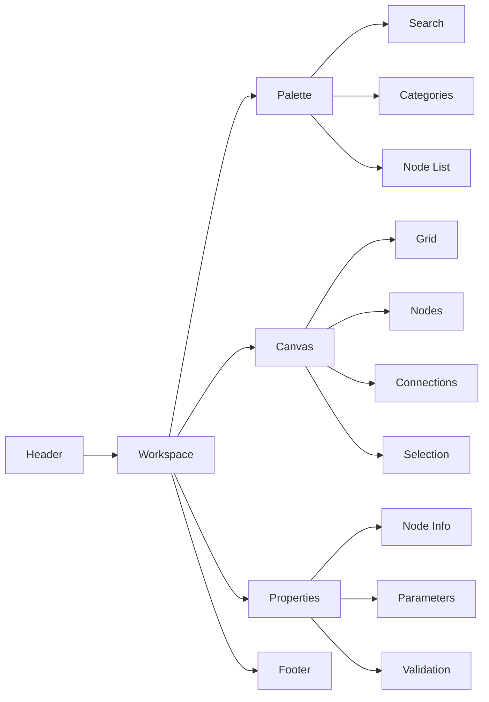

# 🎨 Flow Designer - Diretrizes DATAMETRIA

**Diretrizes para Desenvolvimento de Ferramentas de Desenho de Fluxos Visuais**

**Versão**: 1.0 | **Data**: 08/01/2025 | **Autor**: Vander Loto - CTO

[](https://github.com/datametria/DATAMETRIA-standards)
[](https://vuejs.org)
[](https://developer.mozilla.org/en-US/docs/Web/API/HTML_Drag_and_Drop_API)
[](https://github.com/datametria/DATAMETRIA-standards)

[🎨 Arquitetura](#3-arquitetura-da-interface) • [🔧 Componentes](#5-palette-de-componentes) • [⚡ Drag & Drop](#4-sistema-de-drag-and-drop) • [📊 Canvas](#6-canvas-de-desenho)

---

## 📋 Índice

1. [Visão Geral](#1-visao-geral)
2. [Conceito e Nomenclatura](#2-conceito-e-nomenclatura)
3. [Arquitetura da Interface](#3-arquitetura-da-interface)
4. [Sistema de Drag and Drop](#4-sistema-de-drag-and-drop)
5. [Palette de Componentes](#5-palette-de-componentes)
6. [Canvas de Desenho](#6-canvas-de-desenho)
7. [Painel de Propriedades](#7-painel-de-propriedades)
8. [Conectores e Fluxos](#8-conectores-e-fluxos)
9. [Implementação Técnica](#9-implementacao-tecnica)
10. [Experiência do Usuário](#10-experiencia-do-usuario)
11. [Checklist de Implementação](#11-checklist-de-implementacao)

---

## 1. Visão Geral

### 🎯 Objetivo

Estabelecer diretrizes para desenvolvimento de **Flow Designer Tools** (Ferramentas de Desenho de Fluxos) seguindo padrões DATAMETRIA, com foco em usabilidade, elegância e funcionalidade similar ao N8N.

### 🏗️ Conceito

**Flow Designer** é uma categoria de aplicações que permite criar fluxos visuais através de interface drag-and-drop, conectando elementos para formar workflows, processos ou automações.

### 📊 Stack Tecnológica Herdada

| Componente | Tecnologia | Herança DATAMETRIA |
|------------|------------|-------------------|
| **Frontend** | Vue.js 3 + Composition API | datametria_std_web_dev.md |
| **UI Framework** | Vue Material + Tailwind CSS | datametria_std_ux_ui.md |
| **Drag & Drop** | Vue.Draggable + Native API | Extensão dos padrões UX/UI |
| **Canvas** | SVG + Canvas API | Implementação customizada |
| **Estado** | Pinia Store | datametria_std_web_dev.md |

---

## 2. Conceito e Nomenclatura

### 2.1. Terminologia Padrão

| Termo | Definição | Exemplo |
|-------|-----------|---------|
| **Flow Designer** | Aplicação completa de desenho de fluxos | N8N, Zapier, Microsoft Power Automate |
| **Canvas** | Área principal de desenho do fluxo | Tela central onde elementos são posicionados |
| **Palette** | Menu lateral com elementos disponíveis | Sidebar com componentes drag-and-drop |
| **Node** | Elemento individual do fluxo | Caixa representando uma ação/processo |
| **Connector** | Linha que conecta dois nodes | Seta ou linha entre elementos |
| **Properties Panel** | Painel de configuração de elementos | Sidebar direita com parâmetros |
| **Workflow** | Fluxo completo desenhado | Conjunto de nodes conectados |

### 2.2. Padrões de Nomenclatura

```javascript
// Estrutura de nomenclatura
const flowDesignerNaming = {
  // Componentes principais
  components: {
    canvas: 'FlowCanvas',
    palette: 'NodePalette',
    properties: 'PropertiesPanel',
    node: 'FlowNode',
    connector: 'NodeConnector'
  },

  // Classes CSS
  classes: {
    canvas: 'flow-canvas',
    palette: 'node-palette',
    node: 'flow-node',
    connector: 'node-connector',
    selected: 'node-selected',
    dragging: 'node-dragging'
  },

  // Eventos
  events: {
    nodeAdd: 'node:add',
    nodeSelect: 'node:select',
    nodeConnect: 'node:connect',
    flowSave: 'flow:save'
  }
}
```

---

## 3. Arquitetura da Interface

### 3.1. Layout Principal

```vue
<template>
  <div class="flow-designer">
    <!-- Header com controles -->
    <FlowHeader
      @save="saveFlow"
      @load="loadFlow"
      @export="exportFlow"
    />

    <!-- Layout principal -->
    <div class="flow-workspace">
      <!-- Palette lateral esquerda -->
      <NodePalette
        :nodes="availableNodes"
        @node-drag-start="onNodeDragStart"
      />

      <!-- Canvas central -->
      <FlowCanvas
        ref="canvas"
        :nodes="flowNodes"
        :connections="flowConnections"
        @node-drop="onNodeDrop"
        @node-select="onNodeSelect"
        @connection-create="onConnectionCreate"
      />

      <!-- Properties panel direita -->
      <PropertiesPanel
        :selected-node="selectedNode"
        @property-change="onPropertyChange"
      />
    </div>

    <!-- Footer com status -->
    <FlowFooter :status="flowStatus" />
  </div>
</template>
```

### 3.2. Estrutura Visual



### 3.3. Responsividade

```css
/* Layout responsivo herdado do datametria_std_ux_ui.md */
.flow-designer {
  @apply h-screen flex flex-col;
}

.flow-workspace {
  @apply flex-1 flex overflow-hidden;
}

/* Mobile: Palette colapsável */
@media (max-width: 768px) {
  .node-palette {
    @apply absolute left-0 top-0 h-full z-10 transform -translate-x-full transition-transform;
  }

  .node-palette.open {
    @apply translate-x-0;
  }
}

/* Desktop: Layout fixo */
@media (min-width: 1024px) {
  .node-palette {
    @apply w-64 flex-shrink-0;
  }

  .properties-panel {
    @apply w-80 flex-shrink-0;
  }
}
```

---

## 4. Sistema de Drag and Drop

### 4.1. Implementação Base

```vue
<script setup>
import { ref, reactive } from 'vue'
import { useDragAndDrop } from '@/composables/useDragAndDrop'

// Composable para drag and drop
const {
  draggedItem,
  isDragging,
  startDrag,
  endDrag,
  handleDrop
} = useDragAndDrop()

// Estado do canvas
const canvasRef = ref(null)
const nodes = reactive(new Map())
const connections = reactive([])

// Handlers de drag and drop
function onNodeDragStart(nodeType, event) {
  startDrag({
    type: 'node',
    nodeType,
    data: getNodeTemplate(nodeType)
  }, event)
}

function onCanvasDrop(event) {
  if (!isDragging.value) return

  const canvasRect = canvasRef.value.getBoundingClientRect()
  const position = {
    x: event.clientX - canvasRect.left,
    y: event.clientY - canvasRect.top
  }

  const newNode = createNode(draggedItem.value, position)
  nodes.set(newNode.id, newNode)

  endDrag()
}
</script>
```

### 4.2. Composable de Drag and Drop

```javascript
// composables/useDragAndDrop.js
import { ref, reactive } from 'vue'

export function useDragAndDrop() {
  const draggedItem = ref(null)
  const isDragging = ref(false)
  const dragOffset = reactive({ x: 0, y: 0 })

  function startDrag(item, event) {
    draggedItem.value = item
    isDragging.value = true

    // Calcular offset para posicionamento preciso
    if (event.target) {
      const rect = event.target.getBoundingClientRect()
      dragOffset.x = event.clientX - rect.left
      dragOffset.y = event.clientY - rect.top
    }

    // Adicionar classe visual
    document.body.classList.add('dragging')
  }

  function endDrag() {
    draggedItem.value = null
    isDragging.value = false
    dragOffset.x = 0
    dragOffset.y = 0

    document.body.classList.remove('dragging')
  }

  function handleDrop(event, dropHandler) {
    event.preventDefault()

    if (isDragging.value && dropHandler) {
      dropHandler(draggedItem.value, event)
    }

    endDrag()
  }

  return {
    draggedItem,
    isDragging,
    dragOffset,
    startDrag,
    endDrag,
    handleDrop
  }
}
```

---

## 5. Palette de Componentes

### 5.1. Estrutura da Palette

```vue
<template>
  <aside class="node-palette">
    <!-- Header da palette -->
    <div class="palette-header">
      <h3 class="text-sm font-semibold text-gray-700">Componentes</h3>
      <SearchInput
        v-model="searchQuery"
        placeholder="Buscar componentes..."
        class="mt-2"
      />
    </div>

    <!-- Categorias -->
    <div class="palette-categories">
      <CategoryTabs
        v-model="activeCategory"
        :categories="nodeCategories"
      />
    </div>

    <!-- Lista de nodes -->
    <div class="palette-nodes">
      <div
        v-for="node in filteredNodes"
        :key="node.type"
        :draggable="true"
        class="palette-node"
        @dragstart="onNodeDragStart(node, $event)"
      >
        <div class="node-icon">
          <Icon :name="node.icon" />
        </div>
        <div class="node-info">
          <div class="node-title">{{ node.title }}</div>
          <div class="node-description">{{ node.description }}</div>
        </div>
      </div>
    </div>
  </aside>
</template>

<script setup>
import { computed, ref } from 'vue'

const searchQuery = ref('')
const activeCategory = ref('all')

// Definição de categorias de nodes
const nodeCategories = [
  { id: 'all', label: 'Todos', icon: 'apps' },
  { id: 'triggers', label: 'Triggers', icon: 'play_arrow' },
  { id: 'actions', label: 'Ações', icon: 'settings' },
  { id: 'conditions', label: 'Condições', icon: 'alt_route' },
  { id: 'data', label: 'Dados', icon: 'storage' },
  { id: 'integrations', label: 'Integrações', icon: 'link' }
]

// Filtros
const filteredNodes = computed(() => {
  let nodes = availableNodes

  if (activeCategory.value !== 'all') {
    nodes = nodes.filter(node => node.category === activeCategory.value)
  }

  if (searchQuery.value) {
    const query = searchQuery.value.toLowerCase()
    nodes = nodes.filter(node =>
      node.title.toLowerCase().includes(query) ||
      node.description.toLowerCase().includes(query)
    )
  }

  return nodes
})
</script>
```

---

## 6. Canvas de Desenho

### 6.1. Componente Canvas

```vue
<template>
  <div
    ref="canvasContainer"
    class="flow-canvas"
    @drop="onDrop"
    @dragover.prevent
    @click="onCanvasClick"
  >
    <!-- Grid de fundo -->
    <div class="canvas-grid"></div>

    <!-- SVG para conexões -->
    <svg class="connections-layer">
      <defs>
        <marker
          id="arrowhead"
          markerWidth="10"
          markerHeight="7"
          refX="9"
          refY="3.5"
          orient="auto"
        >
          <polygon points="0 0, 10 3.5, 0 7" fill="#6b7280" />
        </marker>
      </defs>

      <!-- Conexões existentes -->
      <path
        v-for="connection in connections"
        :key="connection.id"
        :d="getConnectionPath(connection)"
        class="connection-path"
        @click="selectConnection(connection.id)"
      />
    </svg>

    <!-- Nodes -->
    <FlowNode
      v-for="node in nodes"
      :key="node.id"
      :node="node"
      :selected="node.id === selectedNodeId"
      @select="selectNode"
      @move="moveNode"
    />
  </div>
</template>
```

---

## 7. Painel de Propriedades

### 7.1. Componente Properties Panel

```vue
<template>
  <aside class="properties-panel">
    <div v-if="!selectedNode" class="no-selection">
      <div class="text-center py-8">
        <Icon name="settings" class="text-4xl text-gray-400 mb-2" />
        <p class="text-gray-500">Selecione um elemento para configurar</p>
      </div>
    </div>

    <div v-else class="node-properties">
      <!-- Header do node -->
      <div class="properties-header">
        <div class="flex items-center">
          <div class="node-icon-small">
            <Icon :name="selectedNode.icon" />
          </div>
          <div class="ml-3">
            <h3 class="font-medium text-gray-900">{{ selectedNode.title }}</h3>
            <p class="text-sm text-gray-500">{{ selectedNode.type }}</p>
          </div>
        </div>
      </div>

      <!-- Configurações básicas -->
      <div class="properties-section">
        <h4 class="section-title">Configurações Básicas</h4>
        <FormField
          v-model="selectedNode.name"
          label="Nome do Node"
          @change="updateNodeProperty('name', $event)"
        />
      </div>
    </div>
  </aside>
</template>
```

---

## 8. Conectores e Fluxos

### 8.1. Sistema de Conexões

```javascript
// composables/useConnections.js
import { ref, computed } from 'vue'

export function useConnections() {
  const connections = ref([])
  const tempConnection = ref(null)

  function createConnection(sourceNode, sourcePort, targetNode, targetPort) {
    const connection = {
      id: generateId(),
      source: {
        nodeId: sourceNode.id,
        port: sourcePort
      },
      target: {
        nodeId: targetNode.id,
        port: targetPort
      },
      type: 'default'
    }

    connections.value.push(connection)
    return connection
  }

  function getConnectionPath(connection) {
    const sourcePos = getPortPosition(connection.source)
    const targetPos = getPortPosition(connection.target)

    // Calcular curva bezier para conexão suave
    const dx = targetPos.x - sourcePos.x
    const cp1x = sourcePos.x + Math.max(50, dx * 0.5)
    const cp1y = sourcePos.y
    const cp2x = targetPos.x - Math.max(50, dx * 0.5)
    const cp2y = targetPos.y

    return `M ${sourcePos.x} ${sourcePos.y} C ${cp1x} ${cp1y}, ${cp2x} ${cp2y}, ${targetPos.x} ${targetPos.y}`
  }

  return {
    connections,
    tempConnection,
    createConnection,
    getConnectionPath
  }
}
```

---

## 9. Implementação Técnica

### 9.1. Store Principal (Pinia)

```javascript
// stores/flow.js
import { defineStore } from 'pinia'
import { ref, computed } from 'vue'

export const useFlowStore = defineStore('flow', () => {
  // Estado
  const nodes = ref(new Map())
  const connections = ref([])
  const selectedNodeId = ref(null)

  // Getters
  const selectedNode = computed(() =>
    selectedNodeId.value ? nodes.value.get(selectedNodeId.value) : null
  )

  // Actions
  function addNode(nodeData, position) {
    const node = {
      id: generateId(),
      ...nodeData,
      position,
      config: {},
      status: 'idle'
    }

    nodes.value.set(node.id, node)
    return node
  }

  function updateNode(nodeId, updates) {
    const node = nodes.value.get(nodeId)
    if (node) {
      Object.assign(node, updates)
    }
  }

  return {
    nodes,
    connections,
    selectedNodeId,
    selectedNode,
    addNode,
    updateNode
  }
})
```

---

## 10. Experiência do Usuário

### 10.1. Feedback Visual

```css
/* Animações e transições */
.flow-node {
  @apply transition-all duration-200 ease-in-out;
}

.flow-node:hover {
  @apply transform scale-105 shadow-lg;
}

.flow-node.dragging {
  @apply transform scale-110 shadow-xl z-50;
}

/* Estados de validação */
.node-invalid {
  @apply border-red-500 bg-red-50;
}
```

### 10.2. Atalhos de Teclado

| Ação | Atalho | Descrição |
|------|--------|-----------|
| **Selecionar Node** | `Tab` | Navegar entre nodes |
| **Mover Node** | `Arrow Keys` | Mover node selecionado |
| **Deletar** | `Delete` | Remover selecionado |
| **Duplicar** | `Ctrl + D` | Duplicar node |
| **Salvar** | `Ctrl + S` | Salvar fluxo |

---

## 11. Checklist de Implementação

### 11.1. Funcionalidades Básicas

#### Canvas e Navegação

- [ ] Canvas com grid de fundo
- [ ] Zoom in/out com mouse wheel
- [ ] Pan com drag do canvas
- [ ] Fit to screen automático

#### Drag and Drop

- [ ] Arrastar componentes da palette
- [ ] Soltar no canvas com posicionamento preciso
- [ ] Feedback visual durante drag
- [ ] Collision detection

#### Nodes

- [ ] Renderização de nodes com ícones
- [ ] Seleção de nodes
- [ ] Movimentação de nodes selecionados
- [ ] Estados visuais (idle, running, success, error)

#### Conexões

- [ ] Criar conexões entre ports
- [ ] Renderização de curvas bezier
- [ ] Seleção e remoção de conexões
- [ ] Validação de tipos de conexão

### 11.2. Interface do Usuário

#### Palette de Componentes

- [ ] Categorização de componentes
- [ ] Busca e filtros
- [ ] Tooltips informativos
- [ ] Drag preview

#### Painel de Propriedades

- [ ] Campos dinâmicos baseados no tipo
- [ ] Validação em tempo real
- [ ] Auto-save de configurações

#### Controles Gerais

- [ ] Toolbar com ações principais
- [ ] Atalhos de teclado
- [ ] Context menus
- [ ] Status bar informativo

---

## 📊 Métricas e KPIs

### Métricas de Performance

| Métrica | Objetivo | Medição |
|---------|----------|---------|
| **Tempo de Carregamento** | < 2s | Lighthouse |
| **Responsividade Drag & Drop** | < 16ms | Performance API |
| **Memory Usage** | < 100MB | DevTools |
| **Bundle Size** | < 500KB | Webpack Analyzer |

---

## 🔒 Segurança

### Validação de Entrada

```javascript
// Validação de configurações de nodes
function validateNodeConfig(nodeType, config) {
  const schema = getNodeSchema(nodeType)
  const sanitized = sanitizeConfig(config)
  const validation = validateSchema(sanitized, schema)

  if (!validation.valid) {
    throw new ValidationError(validation.errors)
  }

  return sanitized
}
```

---

## ♿ Acessibilidade

### ARIA Labels

```vue
<template>
  <div
    class="flow-node"
    :aria-label="`Node ${node.title}: ${node.description}`"
    :aria-selected="selected"
    role="button"
    tabindex="0"
  >
    <!-- Conteúdo do node -->
  </div>
</template>
```

---

## 🧪 Testes

### Estrutura de Testes

```
tests/
├── unit/
│   ├── components/
│   │   ├── FlowCanvas.spec.js
│   │   ├── NodePalette.spec.js
│   │   └── PropertiesPanel.spec.js
│   └── composables/
│       └── useDragAndDrop.spec.js
├── integration/
│   ├── drag-drop.spec.js
│   └── node-connections.spec.js
└── e2e/
    ├── create-flow.spec.js
    └── edit-flow.spec.js
```

---

## 📚 Documentação

### Guias do Usuário

- **Getting Started** - Primeiros passos
- **Components Guide** - Guia de componentes
- **Advanced Features** - Funcionalidades avançadas
- **Troubleshooting** - Solução de problemas

---

## 🔄 Versionamento

### Histórico de Versões

| Versão | Data | Principais Mudanças |
|--------|------|-------------------|
| **1.0.0** | 08/01/2025 | Versão inicial com funcionalidades core |

### Roadmap

#### v1.1.0 - Q2 2025

- [ ] Colaboração em tempo real
- [ ] Templates de fluxos
- [ ] Marketplace de componentes

---

## 🤝 Contribuição

### Como Contribuir

1. **Fork** o repositório
2. **Crie** uma branch: `git checkout -b feature/nova-funcionalidade`
3. **Implemente** seguindo estas diretrizes
4. **Teste** completamente
5. **Submeta** um Pull Request

---

## 📞 Suporte

### Canais de Suporte

- **📧 Email**: <suporte@datametria.io>
- **💬 Discord**: [discord.gg/datametria](https://discord.gg/datametria)
- **🐛 Issues**: [GitHub Issues](https://github.com/datametria/flow-designer/issues)

---

## 🔗 Referências

### Diretrizes DATAMETRIA Relacionadas

- **[🌐 Web Development](datametria_std_web_dev.md)** - Stack base Vue.js
- **[🎨 UX/UI Design](datametria_std_ux_ui.md)** - Padrões de interface
- **[🔒 Security Development](datametria_std_security.md)** - Segurança
- **[📚 Documentation](datametria_std_documentation.md)** - Documentação

### Referências Externas

- **[N8N](https://n8n.io/)** - Inspiração de UX/UI
- **[Vue.js Draggable](https://github.com/SortableJS/Vue.Draggable)** - Biblioteca drag-drop
- **[Rete.js](https://rete.js.org/)** - Framework para node editors
- **[React Flow](https://reactflow.dev/)** - Referência de implementação

---

**Desenvolvido com ❤️ pela equipe DATAMETRIA**

*Para dúvidas ou sugestões sobre este documento, entre em contato com a equipe de arquitetura.*
