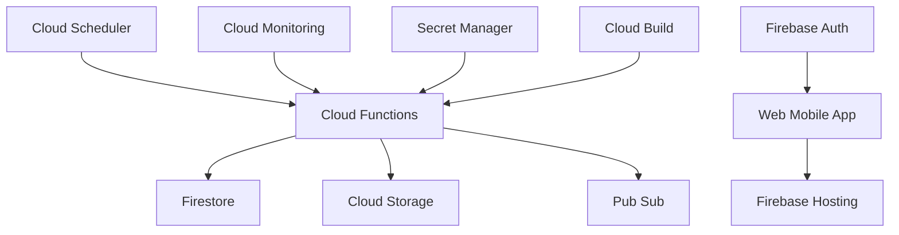

# Diretrizes de Desenvolvimento GCP + Firebase - DATAMETRIA

<div align="center">

**Versão**: 1.0 | **Última Atualização**: 08/01/2025

[](https://cloud.google.com)
[](https://firebase.google.com)
[](https://python.org)

[🔗 Google Cloud](https://cloud.google.com/) • [🔗 Firebase](https://firebase.google.com/) • [🔗 Cloud Functions](https://cloud.google.com/functions)

</div>

---

## 📋 Índice

1. [Visão Geral](#1-visao-geral)
2. [Google Cloud Functions](#2-google-cloud-functions)
3. [Firebase Services](#3-firebase-services)
4. [Cloud Infrastructure](#4-cloud-infrastructure)
5. [Segurança e IAM](#5-seguranca-e-iam)
6. [Monitoramento e Observabilidade](#6-monitoramento-e-observabilidade)
7. [FinOps e Otimização](#7-finops-e-otimizacao)
8. [CI/CD para GCP](#8-cicd-para-gcp)
9. [Checklist GCP](#9-checklist-gcp)

---

## 1. Visão Geral

### 🎯 Objetivo

Estabelecer diretrizes para desenvolvimento de soluções Google Cloud Platform usando Python, com foco em Cloud Functions, Firebase, e melhores práticas de cloud computing.

### 🏗️ Arquitetura de Referência



### 📊 Princípios GCP

| Princípio | Descrição | Implementação |
|-----------|-----------|---------------|
| **⚡ Serverless First** | Priorizar serviços serverless | Cloud Functions, Firebase |
| **🔄 Event-Driven** | Arquitetura orientada a eventos | Pub/Sub, Cloud Tasks |
| **🔒 Security by Design** | Segurança desde o início | IAM, Secret Manager |
| **💰 Cost Optimization** | Otimização contínua de custos | Right-sizing, monitoring |
| **📈 Observability** | Monitoramento completo | Cloud Monitoring, Logging |

---

## 2. Google Cloud Functions

### 2.1. Estrutura de Cloud Function

#### Function Handler Otimizado

```python
# main.py
import functions_framework
import logging
from typing import Dict, Any
from pydantic import BaseModel, ValidationError
from google.cloud import firestore
from google.cloud import secretmanager

# Configurar logging
logging.basicConfig(level=logging.INFO)
logger = logging.getLogger(__name__)

# Inicializar clientes (reutilização)
db = firestore.Client()
secret_client = secretmanager.SecretManagerServiceClient()

class FunctionRequest(BaseModel):
    """Modelo de request para Cloud Function."""
    action: str
    parameters: Dict[str, Any] = {}

class FunctionResponse(BaseModel):
    """Modelo de response para Cloud Function."""
    success: bool
    message: str
    data: Dict[str, Any] = {}

@functions_framework.http
def main(request):
    """Handler principal da Cloud Function."""
    try:
        # Validar entrada
        request_json = request.get_json(silent=True)
        if not request_json:
            raise ValueError("Request JSON inválido")

        func_request = FunctionRequest(**request_json)

        # Processar ação
        result = process_action(func_request.action, func_request.parameters)

        # Retornar resposta
        response = FunctionResponse(
            success=True,
            message="Processado com sucesso",
            data=result
        )

        return response.dict()

    except ValidationError as e:
        logger.error(f"Erro de validação: {e}")
        return FunctionResponse(
            success=False,
            message=f"Dados inválidos: {e}"
        ).dict(), 400

    except Exception as e:
        logger.error(f"Erro não tratado: {e}")
        return FunctionResponse(
            success=False,
            message="Erro interno do servidor"
        ).dict(), 500

def process_action(action: str, parameters: Dict[str, Any]) -> Dict[str, Any]:
    """Processa ação específica."""
    actions = {
        "process_data": process_business_data,
        "send_notification": send_notification,
        "generate_report": generate_report
    }

    if action not in actions:
        raise ValueError(f"Ação não suportada: {action}")

    return actions[action](parameters)
```

### 2.2. Pub/Sub Triggered Function

### Event-Driven Processing

```python
# pubsub_handler.py
import functions_framework
import base64
import json
from google.cloud import firestore

@functions_framework.cloud_event
def process_pubsub_message(cloud_event):
    """Processa mensagem do Pub/Sub."""
    try:
        # Decodificar mensagem
        message_data = base64.b64decode(cloud_event.data["message"]["data"])
        message_json = json.loads(message_data.decode('utf-8'))

        logger.info(f"Processando mensagem: {message_json}")

        # Processar dados
        result = process_message_data(message_json)

        # Salvar no Firestore
        db.collection('processed_messages').add({
            'original_message': message_json,
            'result': result,
            'processed_at': firestore.SERVER_TIMESTAMP
        })

        logger.info("Mensagem processada com sucesso")

    except Exception as e:
        logger.error(f"Erro ao processar mensagem: {e}")
        raise

def process_message_data(data: Dict[str, Any]) -> Dict[str, Any]:
    """Processa dados da mensagem."""
    # Implementar lógica de negócio
    return {"status": "processed", "data": data}
```

### 2.3. Requirements e Configuração

### requirements.txt

```txt
functions-framework==3.4.0
google-cloud-firestore==2.13.1
google-cloud-secret-manager==2.16.4
google-cloud-storage==2.10.0
google-cloud-pubsub==2.18.4
pydantic==2.5.0
```

#### Deployment Configuration

```yaml
# cloudbuild.yaml
steps:
  - name: 'gcr.io/cloud-builders/gcloud'
    args:
      - functions
      - deploy
      - process-data-function
      - --source=.
      - --entry-point=main
      - --runtime=python310
      - --trigger=http
      - --memory=512MB
      - --timeout=300s
      - --set-env-vars=PROJECT_ID=${PROJECT_ID}
      - --service-account=function-sa@${PROJECT_ID}.iam.gserviceaccount.com
```

---

## 3. Firebase Services

### 3.1. Firestore Database

#### Data Modeling

```python
# firestore_service.py
from google.cloud import firestore
from typing import Dict, List, Optional, Any
from datetime import datetime

class FirestoreService:
    """Serviço para operações Firestore."""

    def __init__(self):
        self.db = firestore.Client()

    def create_document(
        self,
        collection: str,
        data: Dict[str, Any],
        doc_id: Optional[str] = None
    ) -> str:
        """Cria documento no Firestore."""
        try:
            # Adicionar timestamps
            data['created_at'] = firestore.SERVER_TIMESTAMP
            data['updated_at'] = firestore.SERVER_TIMESTAMP

            if doc_id:
                doc_ref = self.db.collection(collection).document(doc_id)
                doc_ref.set(data)
                return doc_id
            else:
                doc_ref = self.db.collection(collection).add(data)
                return doc_ref[1].id

        except Exception as e:
            logger.error(f"Erro ao criar documento: {e}")
            raise

    def get_document(self, collection: str, doc_id: str) -> Optional[Dict[str, Any]]:
        """Obtém documento do Firestore."""
        try:
            doc_ref = self.db.collection(collection).document(doc_id)
            doc = doc_ref.get()

            if doc.exists:
                return doc.to_dict()
            return None

        except Exception as e:
            logger.error(f"Erro ao obter documento: {e}")
            raise

    def query_documents(
        self,
        collection: str,
        filters: List[tuple] = None,
        order_by: str = None,
        limit: int = None
    ) -> List[Dict[str, Any]]:
        """Query documentos com filtros."""
        try:
            query = self.db.collection(collection)

            # Aplicar filtros
            if filters:
                for field, operator, value in filters:
                    query = query.where(field, operator, value)

            # Aplicar ordenação
            if order_by:
                query = query.order_by(order_by)

            # Aplicar limite
            if limit:
                query = query.limit(limit)

            docs = query.stream()
            return [doc.to_dict() for doc in docs]

        except Exception as e:
            logger.error(f"Erro na query: {e}")
            raise
```

### 3.2. Firebase Authentication

#### Auth Integration

```python
# firebase_auth.py
from firebase_admin import auth, credentials, initialize_app
from typing import Dict, Optional

class FirebaseAuthService:
    """Serviço de autenticação Firebase."""

    def __init__(self, credentials_path: str):
        cred = credentials.Certificate(credentials_path)
        initialize_app(cred)

    def verify_token(self, id_token: str) -> Optional[Dict[str, Any]]:
        """Verifica token de autenticação."""
        try:
            decoded_token = auth.verify_id_token(id_token)
            return decoded_token
        except Exception as e:
            logger.error(f"Erro ao verificar token: {e}")
            return None

    def create_custom_token(self, uid: str, claims: Dict[str, Any] = None) -> str:
        """Cria token customizado."""
        try:
            return auth.create_custom_token(uid, claims)
        except Exception as e:
            logger.error(f"Erro ao criar token: {e}")
            raise

    def get_user(self, uid: str) -> Optional[auth.UserRecord]:
        """Obtém usuário por UID."""
        try:
            return auth.get_user(uid)
        except Exception as e:
            logger.error(f"Erro ao obter usuário: {e}")
            return Nonentegration

```python
# firebase_auth.py
from firebase_admin import auth, credentials, initialize_app
from typing import Dict, Optional

class FirebaseAuthService:
    """Serviço de autenticação Firebase."""

    def __init__(self, credentials_path: str):
        cred = credentials.Certificate(credentials_path)
        initialize_app(cred)

    def verify_token(self, id_token: str) -> Optional[Dict[str, Any]]:
        """Verifica token de autenticação."""
        try:
            decoded_token = auth.verify_id_token(id_token)
            return decoded_token
        except Exception as e:
            logger.error(f"Erro ao verificar token: {e}")
            return None

    def create_custom_token(self, uid: str, claims: Dict[str, Any] = None) -> str:
        """Cria token customizado."""
        try:
            return auth.create_custom_token(uid, claims)
        except Exception as e:
            logger.error(f"Erro ao criar token: {e}")
            raise

    def get_user(self, uid: str) -> Optional[auth.UserRecord]:
        """Obtém usuário por UID."""
        try:
            return auth.get_user(uid)
        except Exception as e:
            logger.error(f"Erro ao obter usuário: {e}")
            return None
```

### 3.3. Firebase Hosting

### Deployment Configuration

```json
// firebase.json
{
  "hosting": {
    "public": "dist",
    "ignore": [
      "firebase.json",
      "**/.*",
      "**/node_modules/**"
    ],
    "rewrites": [
      {
        "source": "/api/**",
        "function": "api"
      },
      {
        "source": "**",
        "destination": "/index.html"
      }
    ],
    "headers": [
      {
        "source": "**/*.@(js|css)",
        "headers": [
          {
            "key": "Cache-Control",
            "value": "max-age=31536000"
          }
        ]
      }
    ]
  },
  "functions": {
    "source": "functions",
    "runtime": "python310"
  }
}
```

---

## 4. Cloud Infrastructure

### 4.1. Infrastructure as Code

#### Terraform Configuration

```hcl
# main.tf
terraform {
  required_providers {
    google = {
      source  = "hashicorp/google"
      version = "~> 4.0"
    }
  }
}

provider "google" {
  project = var.project_id
  region  = var.region
}

# Cloud Function
resource "google_cloudfunctions_function" "main_function" {
  name        = "process-data-function"
  description = "Main processing function"
  runtime     = "python310"

  available_memory_mb   = 512
  source_archive_bucket = google_storage_bucket.function_bucket.name
  source_archive_object = google_storage_bucket_object.function_zip.name
  trigger {
    http_trigger {
      url = null
    }
  }

  entry_point = "main"

  environment_variables = {
    PROJECT_ID = var.project_id
  }

  service_account_email = google_service_account.function_sa.email
}

# Service Account
resource "google_service_account" "function_sa" {
  account_id   = "function-sa"
  display_name = "Cloud Function Service Account"
}

# IAM Bindings
resource "google_project_iam_member" "function_firestore" {
  project = var.project_id
  role    = "roles/datastore.user"
  member  = "serviceAccount:${google_service_account.function_sa.email}"
}

# Pub/Sub Topic
resource "google_pubsub_topic" "main_topic" {
  name = "process-data-topic"
}

# Firestore Database
resource "google_firestore_database" "database" {
  project     = var.project_id
  name        = "(default)"
  location_id = var.region
  type        = "FIRESTORE_NATIVE"
}
```

### 4.2. Cloud Storage

### Storage Service

```python
# storage_service.py
from google.cloud import storage
from typing import Optional, BinaryIO
import os

class CloudStorageService:
    """Serviço para Cloud Storage."""

    def __init__(self, bucket_name: str):
        self.client = storage.Client()
        self.bucket = self.client.bucket(bucket_name)

    def upload_file(
        self,
        file_path: str,
        destination_blob_name: str,
        content_type: Optional[str] = None
    ) -> str:
        """Upload arquivo para Cloud Storage."""
        try:
            blob = self.bucket.blob(destination_blob_name)

            if content_type:
                blob.content_type = content_type

            blob.upload_from_filename(file_path)

            logger.info(f"Arquivo {file_path} enviado para {destination_blob_name}")
            return f"gs://{self.bucket.name}/{destination_blob_name}"

        except Exception as e:
            logger.error(f"Erro no upload: {e}")
            raise

    def download_file(self, blob_name: str, destination_path: str) -> None:
        """Download arquivo do Cloud Storage."""
        try:
            blob = self.bucket.blob(blob_name)
            blob.download_to_filename(destination_path)

            logger.info(f"Arquivo {blob_name} baixado para {destination_path}")

        except Exception as e:
            logger.error(f"Erro no download: {e}")
            raise

    def generate_signed_url(
        self,
        blob_name: str,
        expiration_minutes: int = 60
    ) -> str:
        """Gera URL assinada para acesso temporário."""
        try:
            blob = self.bucket.blob(blob_name)

            url = blob.generate_signed_url(
                expiration=datetime.timedelta(minutes=expiration_minutes),
                method='GET'
            )

            return url

        except Exception as e:
            logger.error(f"Erro ao gerar URL: {e}")
            raise
```

---

## 5. Segurança e IAM

### 5.1. Identity and Access Management

#### IAM Best Practices

```python
# iam_service.py
from google.cloud import resourcemanager
from google.oauth2 import service_account
from typing import List, Dict

class IAMService:
    """Serviço para gerenciamento IAM."""

    def __init__(self, project_id: str):
        self.project_id = project_id
        self.client = resourcemanager.Client()

    def create_service_account(
        self,
        account_id: str,
        display_name: str,
        roles: List[str] = None
    ) -> Dict[str, Any]:
        """Cria service account com roles."""
        try:
            # Criar service account
            service_account = {
                'account_id': account_id,
                'service_account': {
                    'display_name': display_name
                }
            }

            # Aplicar roles se especificados
            if roles:
                for role in roles:
                    self._bind_role_to_service_account(account_id, role)

            logger.info(f"Service account {account_id} criado")
            return service_account

        except Exception as e:
            logger.error(f"Erro ao criar service account: {e}")
            raise

    def _bind_role_to_service_account(self, account_id: str, role: str):
        """Vincula role ao service account."""
        # Implementação da vinculação de role
        pass
```

### 5.2. Secret Manager

### Secrets Management

```python
# secrets_service.py
from google.cloud import secretmanager
from typing import Dict, Any

class SecretsService:
    """Serviço para Secret Manager."""

    def __init__(self, project_id: str):
        self.project_id = project_id
        self.client = secretmanager.SecretManagerServiceClient()

    def create_secret(self, secret_id: str, secret_value: str) -> str:
        """Cria secret no Secret Manager."""
        try:
            parent = f"projects/{self.project_id}"

            # Criar secret
            secret = self.client.create_secret(
                request={
                    "parent": parent,
                    "secret_id": secret_id,
                    "secret": {"replication": {"automatic": {}}},
                }
            )

            # Adicionar versão
            self.client.add_secret_version(
                request={
                    "parent": secret.name,
                    "payload": {"data": secret_value.encode("UTF-8")},
                }
            )

            logger.info(f"Secret {secret_id} criado")
            return secret.name

        except Exception as e:
            logger.error(f"Erro ao criar secret: {e}")
            raise

    def get_secret(self, secret_id: str, version: str = "latest") -> str:
        """Obtém valor do secret."""
        try:
            name = f"projects/{self.project_id}/secrets/{secret_id}/versions/{version}"

            response = self.client.access_secret_version(request={"name": name})
            return response.payload.data.decode("UTF-8")

        except Exception as e:
            logger.error(f"Erro ao obter secret: {e}")
            raise
```

---

## 6. Monitoramento e Observabilidade

### 6.1. Cloud Monitoring

#### Structured Logging

```python
# monitoring_service.py
import logging
from google.cloud import monitoring_v3
from google.cloud import logging as cloud_logging
from typing import Dict, Any

class MonitoringService:
    """Serviço de monitoramento e logging."""

    def __init__(self, project_id: str):
        self.project_id = project_id

        # Configurar Cloud Logging
        client = cloud_logging.Client()
        client.setup_logging()

        # Configurar Cloud Monitoring
        self.monitoring_client = monitoring_v3.MetricServiceClient()

        self.logger = logging.getLogger(__name__)

    def log_structured(self, level: str, message: str, **kwargs):
        """Log estruturado para Cloud Logging."""
        log_entry = {
            "message": message,
            "severity": level,
            "project_id": self.project_id,
            **kwargs
        }

        if level == "ERROR":
            self.logger.error(log_entry)
        elif level == "WARNING":
            self.logger.warning(log_entry)
        else:
            self.logger.info(log_entry)

    def create_custom_metric(
        self,
        metric_name: str,
        value: float,
        labels: Dict[str, str] = None
    ):
        """Cria métrica customizada."""
        try:
            project_name = f"projects/{self.project_id}"

            series = monitoring_v3.TimeSeries()
            series.metric.type = f"custom.googleapis.com/{metric_name}"

            if labels:
                for key, val in labels.items():
                    series.metric.labels[key] = val

            series.resource.type = "global"

            now = time.time()
            seconds = int(now)
            nanos = int((now - seconds) * 10 ** 9)
            interval = monitoring_v3.TimeInterval(
                {"end_time": {"seconds": seconds, "nanos": nanos}}
            )

            point = monitoring_v3.Point(
                {"interval": interval, "value": {"double_value": value}}
            )
            series.points = [point]

            self.monitoring_client.create_time_series(
                name=project_name, time_series=[series]
            )

        except Exception as e:
            self.logger.error(f"Erro ao criar métrica: {e}")
```

### 6.2. Error Reporting

### Error Handling

```python
# error_service.py
from google.cloud import error_reporting
import traceback

class ErrorService:
    """Serviço para Error Reporting."""

    def __init__(self):
        self.client = error_reporting.Client()

    def report_exception(self, exception: Exception, user: str = None):
        """Reporta exceção para Error Reporting."""
        try:
            self.client.report_exception(
                http_context=error_reporting.HTTPContext(
                    method='POST',
                    url='https://example.com/api',
                    user_agent='Cloud Function',
                    remote_ip='127.0.0.1'
                ),
                user=user
            )
        except Exception as e:
            logger.error(f"Erro ao reportar exceção: {e}")
```

---

## 7. FinOps e Otimização

### 7.1. Cost Monitoring

#### Billing API Integration

```python
# billing_service.py
from google.cloud import billing
from typing import Dict, List
from datetime import datetime, timedelta

class BillingService:
    """Serviço para monitoramento de custos."""

    def __init__(self, project_id: str):
        self.project_id = project_id
        self.client = billing.CloudBillingClient()

    def get_project_costs(self, days: int = 30) -> Dict[str, Any]:
        """Obtém custos do projeto."""
        try:
            # Implementar consulta de custos
            end_date = datetime.now()
            start_date = end_date - timedelta(days=days)

            # Query billing data
            costs = {
                "total_cost": 0.0,
                "services": {},
                "period": {
                    "start": start_date.isoformat(),
                    "end": end_date.isoformat()
                }
            }

            return costs

        except Exception as e:
            logger.error(f"Erro ao obter custos: {e}")
            raise

    def create_budget_alert(self, budget_amount: float, threshold: float = 0.8):
        """Cria alerta de orçamento."""
        try:
            # Implementar criação de budget alert
            logger.info(f"Budget alert criado: ${budget_amount}")

        except Exception as e:
            logger.error(f"Erro ao criar budget alert: {e}")
            raise
```

---

## 8. CI/CD para GCP

### 8.1. Cloud Build

#### Build Configuration

```yaml
# cloudbuild.yaml
steps:
  # Install dependencies
  - name: 'python:3.10'
    entrypoint: 'pip'
    args: ['install', '-r', 'requirements.txt', '--user']

  # Run tests
  - name: 'python:3.10'
    entrypoint: 'python'
    args: ['-m', 'pytest', 'tests/', '-v']
    env:
      - 'PYTHONPATH=/workspace'

  # Security scan
  - name: 'python:3.10'
    entrypoint: 'pip'
    args: ['install', 'bandit', '--user']

  - name: 'python:3.10'
    entrypoint: 'python'
    args: ['-m', 'bandit', '-r', 'src/']

  # Deploy Cloud Function
  - name: 'gcr.io/cloud-builders/gcloud'
    args:
      - functions
      - deploy
      - ${_FUNCTION_NAME}
      - --source=.
      - --entry-point=main
      - --runtime=python310
      - --trigger=http
      - --memory=${_MEMORY}
      - --timeout=${_TIMEOUT}
      - --set-env-vars=PROJECT_ID=${PROJECT_ID}
      - --service-account=${_SERVICE_ACCOUNT}

  # Deploy to Firebase Hosting
  - name: 'gcr.io/$PROJECT_ID/firebase'
    args: ['deploy', '--only', 'hosting']

substitutions:
  _FUNCTION_NAME: 'process-data-function'
  _MEMORY: '512MB'
  _TIMEOUT: '300s'
  _SERVICE_ACCOUNT: 'function-sa@${PROJECT_ID}.iam.gserviceaccount.com'

options:
  logging: CLOUD_LOGGING_ONLY
```

### 8.2. GitHub Actions Integration

### GCP Deployment Pipeline

```yaml
# .github/workflows/gcp-deploy.yml
name: GCP Deployment

on:
  push:
    branches: [main]
    paths: ['src/**', 'functions/**']

env:
  PROJECT_ID: ${{ secrets.GCP_PROJECT_ID }}
  REGION: us-central1

jobs:
  test:
    runs-on: ubuntu-latest
    steps:
      - uses: actions/checkout@v4

      - name: Setup Python
        uses: actions/setup-python@v4
        with:
          python-version: '3.10'

      - name: Install dependencies
        run: |
          pip install -r requirements.txt
          pip install pytest bandit

      - name: Run tests
        run: pytest tests/ -v

      - name: Security scan
        run: bandit -r src/

  deploy:
    needs: test
    runs-on: ubuntu-latest
    steps:
      - uses: actions/checkout@v4

      - name: Setup Cloud SDK
        uses: google-github-actions/setup-gcloud@v1
        with:
          project_id: ${{ env.PROJECT_ID }}
          service_account_key: ${{ secrets.GCP_SA_KEY }}
          export_default_credentials: true

      - name: Deploy Cloud Function
        run: |
          gcloud functions deploy process-data-function \
            --source=. \
            --entry-point=main \
            --runtime=python310 \
            --trigger=http \
            --memory=512MB \
            --timeout=300s \
            --region=${{ env.REGION }}

      - name: Deploy Firebase
        run: |
          npm install -g firebase-tools
          firebase deploy --token ${{ secrets.FIREBASE_TOKEN }}
```

---

## 9. Checklist GCP

### 9.1. Desenvolvimento

#### Cloud Functions

- [ ] Handler separado da lógica de negócio
- [ ] Validação de entrada com Pydantic
- [ ] Logging estruturado implementado
- [ ] Tratamento de erros robusto
- [ ] Timeout e memória otimizados
- [ ] Service account específico configurado
- [ ] Testes unitários > 85% cobertura

#### Firebase Services

- [ ] Firestore rules configuradas
- [ ] Authentication implementado
- [ ] Hosting configurado com rewrites
- [ ] Security rules testadas
- [ ] Indexes otimizados
- [ ] Backup strategy definida

### 9.2. Segurança

#### IAM e Permissions

- [ ] Princípio do menor privilégio aplicado
- [ ] Service accounts específicos por função
- [ ] Roles customizados quando necessário
- [ ] Audit logs habilitados
- [ ] MFA habilitado para usuários

#### Data Protection

- [ ] Encryption at rest habilitado
- [ ] Secret Manager para credenciais
- [ ] VPC quando necessário
- [ ] Firewall rules configuradas
- [ ] Data loss prevention configurado

### 9.3. Monitoramento

#### Cloud Operations

- [ ] Structured logging implementado
- [ ] Custom metrics definidas
- [ ] Alerting policies configuradas
- [ ] Dashboards criados
- [ ] Error reporting configurado

#### Observability

- [ ] Cloud Trace habilitado
- [ ] Performance monitoring ativo
- [ ] SLI/SLO definidos
- [ ] Incident response plan
- [ ] Cost monitoring implementado

### 9.4. FinOps

#### Cost Optimization

- [ ] Right-sizing de recursos
- [ ] Committed use discounts avaliados
- [ ] Preemptible instances quando apropriado
- [ ] Storage lifecycle policies
- [ ] Budget alerts configurados

#### Resource Management

- [ ] Labels de cost allocation aplicadas
- [ ] Resource cleanup automatizado
- [ ] Unused resources identificados
- [ ] Cost reports automatizados
- [ ] Quota monitoring implementado

---

## Versionamento do Documento

| Versão | Data | Alterações | Autor |
|--------|------|------------|-------|
| 1.0 | 08/01/2025 | Versão inicial - Diretrizes GCP + Firebase | Vander Loto |

---

## Manutenção

- **Revisão trimestral**: Atualização de serviços e práticas GCP
- **Feedback contínuo**: Melhorias baseadas no uso prático
- **Sincronização**: Alinhamento com Google Cloud best practices

**Próxima revisão**: 08/04/2025
**Responsável**: Cloud Architect
**Aprovação**: CTO
