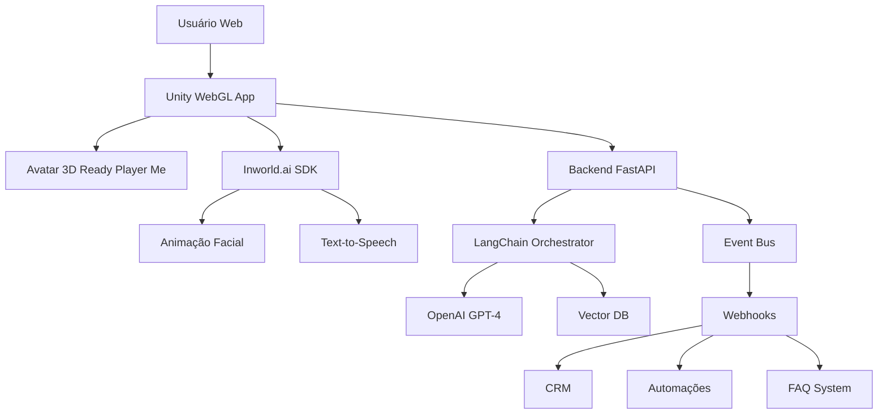
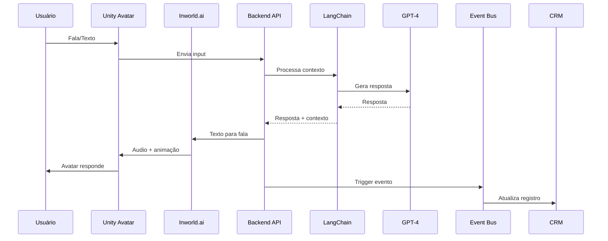

# 🤖 DATAMETRIA Standards - Interactive Avatars Development

**Versão:** 1.0.0 | **Última Atualização:** 07/11/2025 | **Autor:** Vander Loto - CTO DATAMETRIA

<div align="center">


## Diretrizes para Desenvolvimento de Avatares Interativos 3D com IA

[](https://readyplayer.me/)
[](https://inworld.ai/)
[](https://langchain.com/)
[](https://unity.com/)
[](https://github.com/datametria/DATAMETRIA-standards)

[🎯 Visão Geral](#-visão-geral) • [🏗️ Arquitetura](#️-arquitetura) • [👤 Avatar 3D](#-avatar-3d) • [🎭 Animação](#-animação-e-voz) • [🧠 Cognição IA](#-cognição-e-ia) • [🚀 Deploy](#-integração-e-deploy) • [🔗 Automações](#-automações-e-webhooks) • [✅ Checklist](#-checklist)

</div>

---

## 🎯 Visão Geral

### Filosofia Interactive Avatars

Desenvolvimento de **avatares interativos 3D** com inteligência artificial para criar experiências imersivas de atendimento, onboarding, FAQ e automações empresariais.

### Componentes Principais

| Componente | Tecnologia | Propósito |
|------------|------------|-----------|
| **Avatar 3D** | Ready Player Me | Geração de avatares realistas (.glb) |
| **Engine 3D** | Unity 2023.2+ | Renderização e interação |
| **Animação/Voz** | Inworld.ai SDK | Lipsync + emoções + TTS |
| **Cognição** | LangChain + GPT-4 | Processamento de linguagem |
| **Deploy** | Unity WebGL | Build para web embedável |
| **Backend** | FastAPI + Redis | API de integração |
| **Automações** | Event Bus + Webhooks | Integrações empresariais |

### Casos de Uso

| Caso de Uso | Descrição | Complexidade | ROI Esperado |
|-------------|-----------|--------------|--------------|
| **Atendimento Virtual** | Avatar responde dúvidas em tempo real | Média | 60% redução custos |
| **Onboarding** | Guia interativo para novos usuários | Média | 70% redução tempo |
| **FAQ Inteligente** | Respostas contextualizadas | Baixa | 80% redução tickets |
| **Vendas/Demos** | Apresentação de produtos | Alta | 40% aumento conversão |
| **Treinamento** | Tutoriais interativos | Alta | 50% retenção conhecimento |
| **Suporte Técnico** | Troubleshooting guiado | Muito Alta | 65% resolução 1º nível |

---

## 🏗️ Arquitetura

### Diagrama de Componentes



### Fluxo de Interação



### Stack Tecnológico

#### Core Technologies

- **Ready Player Me** (latest): Avatar 3D generation (.glb export)
- **Unity** 2023.2+: 3D engine e WebGL build
- **Inworld.ai SDK** (latest): Animação facial, lipsync, TTS, emoções
- **LangChain** 0.1+: Orquestração de IA
- **OpenAI GPT-4**: Cognição e processamento de linguagem

#### Backend & Infrastructure

- **FastAPI** 0.104+: API REST
- **Pydantic** 2.5+: Validação de dados
- **Redis** 5.0+: Context manager e cache
- **Event Bus**: Sistema de eventos
- **Webhooks**: Integrações externas

---

## 👤 Avatar 3D

### Ready Player Me Integration

#### Geração de Avatar (Unity C#)

```csharp
using ReadyPlayerMe.Core;
using UnityEngine;

public class AvatarLoader : MonoBehaviour
{
    private const string AVATAR_URL = "https://models.readyplayer.me/";

    public async void LoadAvatar(string avatarId)
    {
        var loader = new AvatarObjectLoader();
        loader.OnCompleted += OnAvatarLoaded;
        loader.OnFailed += OnAvatarLoadFailed;

        await loader.LoadAvatar($"{AVATAR_URL}{avatarId}.glb");
    }

    private void OnAvatarLoaded(object sender, CompletionEventArgs args)
    {
        var avatar = args.Avatar;
        avatar.transform.position = Vector3.zero;
        SetupAnimations(avatar);
        IntegrateInworld(avatar);
    }
}
```

### Otimização de Performance

- **LOD System**: Níveis de detalhe para performance
- **Object Pooling**: Reutilização de objetos
- **Occlusion Culling**: Renderização otimizada
- **Target**: 60fps em desktop, 30fps em mobile

---

## 🎭 Animação e Voz

### Inworld.ai SDK Integration

#### Setup (Unity C#)

```csharp
using Inworld;
using UnityEngine;

public class InworldController : MonoBehaviour
{
    [SerializeField] private InworldCharacter character;
    [SerializeField] private AudioSource audioSource;

    private async void InitializeInworld()
    {
        var client = InworldClient.Instance;

        character.OnTextReceived += OnTextReceived;
        character.OnAudioReceived += OnAudioReceived;
        character.OnEmotionChanged += OnEmotionChanged;

        await client.Initialize();
    }

    private void OnAudioReceived(AudioClip clip)
    {
        audioSource.clip = clip;
        audioSource.Play();
    }
}
```

### Recursos Inworld.ai

- **Lipsync Automático**: Sincronização labial em tempo real
- **Emoções**: Happy, Sad, Angry, Surprised, Neutral
- **TTS Natural**: Vozes realistas em múltiplos idiomas
- **Gestos**: Animações corporais contextuais

---

## 🧠 Cognição e IA

### LangChain Orchestrator (Python)

```python
from langchain.chat_models import ChatOpenAI
from langchain.memory import ConversationBufferMemory
from langchain.chains import ConversationalRetrievalChain
from langchain.vectorstores import Chroma
from langchain.embeddings import OpenAIEmbeddings

class AvatarOrchestrator:
    def __init__(self):
        self.llm = ChatOpenAI(
            model="gpt-4-turbo-preview",
            temperature=0.7
        )

        self.memory = ConversationBufferMemory(
            memory_key="chat_history",
            return_messages=True
        )

        self.vectorstore = Chroma(
            embedding_function=OpenAIEmbeddings()
        )

        self.chain = ConversationalRetrievalChain.from_llm(
            llm=self.llm,
            retriever=self.vectorstore.as_retriever(),
            memory=self.memory
        )

    async def process_input(
        self,
        user_input: str,
        context: dict
    ) -> dict:
        """Processa input do usuário e retorna resposta."""
        response = await self.chain.ainvoke({
            "question": user_input,
            "context": context
        })

        return {
            "text": response["answer"],
            "emotion": self._detect_emotion(response["answer"]),
            "actions": self._extract_actions(response)
        }
```

### FastAPI Backend

```python
from fastapi import FastAPI, WebSocket
from pydantic import BaseModel

app = FastAPI(title="Avatar AI Backend")

class ChatRequest(BaseModel):
    session_id: str
    message: str
    context: dict = {}

class ChatResponse(BaseModel):
    text: str
    emotion: str
    audio_url: str = None
    actions: list = []

@app.post("/api/v1/chat", response_model=ChatResponse)
async def chat(request: ChatRequest):
    """Endpoint principal de chat."""
    orchestrator = AvatarOrchestrator()

    response = await orchestrator.process_input(
        request.message,
        request.context
    )

    audio_url = await generate_audio(response["text"])
    await trigger_webhooks(request.session_id, response)

    return ChatResponse(
        text=response["text"],
        emotion=response["emotion"],
        audio_url=audio_url,
        actions=response["actions"]
    )
```

---

## 🚀 Integração e Deploy

### Unity WebGL Build

#### Build Settings

```csharp
// Editor/BuildScript.cs
using UnityEditor;

public class BuildScript
{
    [MenuItem("Build/WebGL Production")]
    public static void BuildWebGL()
    {
        BuildPlayerOptions options = new BuildPlayerOptions
        {
            scenes = new[] { "Assets/Scenes/Main.unity" },
            locationPathName = "Builds/WebGL",
            target = BuildTarget.WebGL,
            options = BuildOptions.None
        };

        PlayerSettings.WebGL.compressionFormat = WebGLCompressionFormat.Brotli;
        PlayerSettings.WebGL.memorySize = 512;

        BuildPipeline.BuildPlayer(options);
    }
}
```

### Embed em Website

```html
<!DOCTYPE html>
<html>
<head>
    <title>Interactive Avatar</title>
    <style>
        body { margin: 0; overflow: hidden; }
        #unity-container { width: 100%; height: 100vh; }
    </style>
</head>
<body>
    <div id="unity-container">
        <canvas id="unity-canvas"></canvas>
    </div>

    <script src="Build/UnityLoader.js"></script>
    <script>
        var unityInstance = UnityLoader.instantiate(
            "unity-canvas",
            "Build/avatar.json"
        );

        function sendMessageToAvatar(message) {
            unityInstance.SendMessage(
                "AvatarController",
                "ReceiveMessage",
                message
            );
        }
    </script>
</body>
</html>
```

---

## 🔗 Automações e Webhooks

### Event Bus (Python)

```python
from typing import Callable, Dict, List
from dataclasses import dataclass
from datetime import datetime

@dataclass
class Event:
    type: str
    session_id: str
    data: dict
    timestamp: datetime = datetime.utcnow()

class EventBus:
    def __init__(self):
        self._subscribers: Dict[str, List[Callable]] = {}

    def subscribe(self, event_type: str, handler: Callable):
        """Registra handler para tipo de evento."""
        if event_type not in self._subscribers:
            self._subscribers[event_type] = []
        self._subscribers[event_type].append(handler)

    async def publish(self, event: Event):
        """Publica evento para todos os subscribers."""
        if event.type in self._subscribers:
            for handler in self._subscribers[event.type]:
                await handler(event)
```

### Integrações

#### CRM Integration

```python
class CRMIntegration:
    async def log_interaction(self, contact: CRMContact):
        """Registra interação no CRM."""
        webhook = WEBHOOKS["crm_update"]
        await webhook.trigger("interaction_logged", contact.dict())
```

#### FAQ System

```python
class FAQIntegration:
    async def log_question(self, question: str, answer: str):
        """Registra pergunta no sistema de FAQ."""
        webhook = WEBHOOKS["faq_interaction"]
        await webhook.trigger("question_asked", {
            "question": question,
            "answer": answer
        })
```

#### Onboarding Automation

```python
class OnboardingIntegration:
    async def track_progress(self, user_id: str, step: str):
        """Rastreia progresso do onboarding."""
        webhook = WEBHOOKS["onboarding_complete"]
        await webhook.trigger("progress_updated", {
            "user_id": user_id,
            "step": step
        })
```

---

## ✅ Checklist

### Setup Inicial (6 itens)

- [ ] Criar conta Ready Player Me
- [ ] Configurar Inworld.ai SDK
- [ ] Setup OpenAI API
- [ ] Configurar Unity 2023.2+
- [ ] Setup FastAPI backend
- [ ] Configurar Redis

### Avatar 3D (5 itens)

- [ ] Integrar Ready Player Me SDK
- [ ] Implementar loader de avatares
- [ ] Configurar customização
- [ ] Otimizar performance (LOD)
- [ ] Testar em diferentes dispositivos

### Animação e Voz (5 itens)

- [ ] Integrar Inworld.ai SDK
- [ ] Configurar lipsync automático
- [ ] Implementar animações de emoção
- [ ] Testar qualidade de áudio
- [ ] Ajustar sincronização

### Cognição IA (5 itens)

- [ ] Implementar LangChain orchestrator
- [ ] Configurar vector database
- [ ] Implementar context manager
- [ ] Treinar modelo customizado
- [ ] Testar respostas

### Backend API (5 itens)

- [ ] Criar endpoints FastAPI
- [ ] Implementar WebSocket
- [ ] Configurar CORS
- [ ] Implementar autenticação
- [ ] Documentar API (OpenAPI)

### Deploy (5 itens)

- [ ] Build Unity WebGL
- [ ] Otimizar bundle size
- [ ] Configurar CDN
- [ ] Criar template HTML
- [ ] Testar embed

### Automações (7 itens)

- [ ] Implementar event bus
- [ ] Configurar webhooks
- [ ] Integrar CRM
- [ ] Integrar FAQ
- [ ] Integrar onboarding
- [ ] Testar fluxos completos
- [ ] Monitorar integrações

**Total**: 40+ itens

---

## 📈 Métricas de Performance

### Targets

| Métrica | Target | Observação |
|---------|--------|------------|
| **Response Time** | < 2s | Tempo de resposta do avatar |
| **Lipsync Accuracy** | > 95% | Sincronização labial |
| **Emotion Detection** | > 90% | Detecção de emoções |
| **Bundle Size** | < 50MB | Build Unity WebGL |
| **Load Time** | < 5s | Carregamento inicial |
| **FPS** | 60fps | Performance de renderização |

---

## 🌐 Compatibilidade

### Browsers

- ✅ Chrome 90+
- ✅ Firefox 88+
- ✅ Safari 14+
- ✅ Edge 90+

### Requirements

- **WebGL 2.0**: Suporte obrigatório
- **WebSocket**: Para comunicação real-time
- **Microphone**: Para input de voz (opcional)

---

<div align="center">

## 🎯 DATAMETRIA Interactive Avatars Standard v1.0.0

**Desenvolvido com ❤️ pela equipe DATAMETRIA**

[](https://github.com/datametria/DATAMETRIA-standards)

**CTO**: Vander Loto | **Email**: vander.loto@datametria.io

</div>
