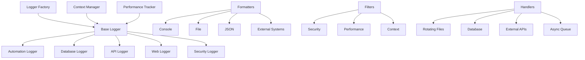

# Diretrizes de Logging Enterprise - DATAMETRIA

<div align="center">

## Sistema de Logging Universal para Aplicações Enterprise

[](https://python.org)
[](https://docs.python.org/3/library/logging.html)
[](https://github.com)

[🔗 Templates](template-readme.md) • [🔗 Exemplos](#exemplos-praticos) • [🔗 Python Guidelines](datametria_std_python_automation.md)

</div>

---

## 📋 Índice

- [Visão Geral](#visao-geral)
- [Framework de Logging Universal](#framework-de-logging-universal)
- [Loggers Especializados](#loggers-especializados)
- [Configuração e Profiles](#configuracao-e-profiles)
- [Segurança e Compliance](#seguranca-e-compliance)
- [Performance e Monitoramento](#performance-e-monitoramento)
- [Implementação e Uso](#implementacao-e-uso)
- [Exemplos Práticos](#exemplos-praticos)
- [Checklist de Logging](#checklist-de-logging)

---

## 🎯 Visão Geral

### Objetivo

Este documento estabelece as diretrizes para implementação de um sistema de logging enterprise-grade que cubra todos os domínios de aplicação: automação UI, APIs, banco de dados, aplicações web, segurança e auditoria. O objetivo é garantir observabilidade completa, rastreabilidade e compliance em todas as operações.

### Princípios Fundamentais

| Princípio | Descrição | Benefício |
|-----------|-----------|-----------|
| 🔍 **Observabilidade Total** | Logs estruturados em todos os domínios | Visibilidade completa do sistema |
| 🔒 **Security by Design** | Sanitização automática de dados sensíveis | Compliance e proteção de dados |
| ⚡ **Performance First** | Logging assíncrono e otimizado | Impacto mínimo na performance |
| 📊 **Contexto Rico** | Correlation IDs e contexto automático | Rastreabilidade end-to-end |
| 🎯 **Especialização** | Loggers otimizados por domínio | Informações relevantes por área |

### Arquitetura do Framework



---

## 🏗️ Framework de Logging Universal

### Estrutura do Framework

```
logging_framework/
├── __init__.py                 # Exports principais
├── core/
│   ├── __init__.py
│   ├── base_logger.py          # Logger base universal
│   ├── logger_factory.py       # Factory para criação
│   ├── context_manager.py      # Gerenciamento de contexto
│   └── performance_tracker.py  # Tracking de performance
├── specialized/
│   ├── __init__.py
│   ├── automation_logger.py    # Automação UI
│   ├── database_logger.py      # Operações de BD
│   ├── api_logger.py          # APIs e HTTP
│   ├── web_logger.py          # Aplicações web
│   └── security_logger.py     # Segurança e auditoria
├── formatters/
│   ├── __init__.py
│   ├── structured_formatters.py # JSON, XML, etc.
│   ├── console_formatters.py   # Console colorido
│   └── custom_formatters.py    # Formatadores específicos
├── handlers/
│   ├── __init__.py
│   ├── file_handlers.py        # Arquivos rotativos
│   ├── database_handlers.py    # Persistência em BD
│   ├── external_handlers.py    # APIs externas
│   └── async_handlers.py       # Handlers assíncronos
├── filters/
│   ├── __init__.py
│   ├── security_filters.py     # Sanitização
│   ├── performance_filters.py  # Filtros de performance
│   └── context_filters.py      # Enriquecimento de contexto
├── middleware/
│   ├── __init__.py
│   ├── correlation_middleware.py # Correlation IDs
│   ├── metrics_middleware.py   # Coleta de métricas
│   └── audit_middleware.py     # Trilha de auditoria
├── config/
│   ├── __init__.py
│   ├── settings.py            # Configurações
│   └── profiles.py            # Profiles por ambiente
└── utils/
    ├── __init__.py
    ├── decorators.py          # Decoradores úteis
    ├── helpers.py             # Funções auxiliares
    └── monitoring.py          # Monitoramento
```

### Logger Base Universal

```python
# logging_framework/core/base_logger.py
"""Sistema de logging universal para aplicações enterprise."""

import logging
import threading
import time
import uuid
from abc import ABC, abstractmethod
from contextlib import contextmanager
from datetime import datetime
from enum import Enum
from typing import Any, Dict, List, Optional, Union, Callable
import asyncio

class LogLevel(Enum):
    """Níveis de log universais."""
    TRACE = 5       # Rastreamento muito detalhado
    DEBUG = 10      # Debug padrão
    INFO = 20       # Informações gerais
    SUCCESS = 22    # Operações bem-sucedidas
    WARNING = 30    # Avisos
    ERROR = 40      # Erros
    CRITICAL = 50   # Erros críticos
    AUDIT = 60      # Logs de auditoria
    SECURITY = 70   # Eventos de segurança

class LogCategory(Enum):
    """Categorias de log por domínio."""
    AUTOMATION = "automation"
    DATABASE = "database"
    API = "api"
    WEB = "web"
    SECURITY = "security"
    BUSINESS = "business"
    SYSTEM = "system"
    PERFORMANCE = "performance"
    AUDIT = "audit"

class BaseLogger(ABC):
    """Logger base universal para todos os domínios."""

    def __init__(
        self,
        name: str,
        category: LogCategory,
        level: Union[LogLevel, int, str] = LogLevel.INFO,
        enable_correlation: bool = True,
        enable_metrics: bool = True,
        enable_performance_tracking: bool = True,
        custom_context: Optional[Dict[str, Any]] = None
    ):
        self.name = name
        self.category = category
        self.enable_correlation = enable_correlation
        self.enable_metrics = enable_metrics
        self.enable_performance_tracking = enable_performance_tracking

        # Configurar logger interno
        self.logger = logging.getLogger(f"{category.value}.{name}")
        self.logger.setLevel(self._convert_level(level))

        # Contexto thread-local
        self._context = threading.local()
        self._custom_context = custom_context or {}

        # Configurar infraestrutura
        self._setup_middlewares()
        self._setup_logging_infrastructure()
        self._register_custom_levels()

        self.info(f"{category.value.title()}Logger '{name}' inicializado")

    @abstractmethod
    def _setup_logging_infrastructure(self):
        """Configura handlers e formatters específicos do domínio."""
        pass

    @contextmanager
    def context(self, **context_data):
        """Context manager para adicionar contexto temporário."""
        old_context = getattr(self._context, 'current_context', {})
        self._context.current_context = {**old_context, **context_data}

        try:
            yield
        finally:
            self._context.current_context = old_context

    @contextmanager
    def operation(self, operation_name: str, **operation_data):
        """Context manager para operações com tracking automático."""
        operation_id = str(uuid.uuid4())
        start_time = time.time()

        context_data = {
            'operation_id': operation_id,
            'operation_name': operation_name,
            **operation_data
        }

        with self.context(**context_data):
            self.info(f"Iniciando operação: {operation_name}", extra={
                'event_type': 'operation_start',
                'operation_id': operation_id
            })

            try:
                yield operation_id

                duration = time.time() - start_time
                self.success(f"Operação concluída: {operation_name}", extra={
                    'event_type': 'operation_success',
                    'operation_id': operation_id,
                    'duration': duration
                })

            except Exception as e:
                duration = time.time() - start_time
                self.error(f"Operação falhou: {operation_name}", extra={
                    'event_type': 'operation_error',
                    'operation_id': operation_id,
                    'duration': duration,
                    'error': str(e),
                    'error_type': type(e).__name__
                })
                raise
```

## Factory de Loggers

```python
# logging_framework/core/logger_factory.py
"""Factory para criação de loggers especializados."""

from typing import Type, Dict, Any, Optional, Union
from .base_logger import BaseLogger, LogCategory, LogLevel

class LoggerFactory:
    """Factory para criação de loggers especializados."""

    _logger_classes: Dict[LogCategory, Type[BaseLogger]] = {}
    _instances: Dict[str, BaseLogger] = {}

    @classmethod
    def register_logger_class(cls, category: LogCategory, logger_class: Type[BaseLogger]):
        """Registra uma classe de logger para uma categoria."""
        cls._logger_classes[category] = logger_class

    @classmethod
    def get_logger(
        cls,
        name: str,
        category: LogCategory,
        level: Union[LogLevel, int, str] = LogLevel.INFO,
        **kwargs
    ) -> BaseLogger:
        """Obtém ou cria um logger especializado."""
        logger_key = f"{category.value}_{name}"

        if logger_key not in cls._instances:
            logger_class = cls._logger_classes.get(category)

            if not logger_class:
                logger_class = cls._import_logger_class(category)
                cls._logger_classes[category] = logger_class

            cls._instances[logger_key] = logger_class(
                name=name,
                category=category,
                level=level,
                **kwargs
            )

        return cls._instances[logger_key]

    @classmethod
    def _import_logger_class(cls, category: LogCategory) -> Type[BaseLogger]:
        """Importa dinamicamente a classe de logger."""
        module_map = {
            LogCategory.AUTOMATION: "..specialized.automation_logger",
            LogCategory.DATABASE: "..specialized.database_logger",
            LogCategory.API: "..specialized.api_logger",
            LogCategory.WEB: "..specialized.web_logger",
            LogCategory.SECURITY: "..specialized.security_logger"
        }

        module_name = module_map.get(category)
        if not module_name:
            raise ValueError(f"Logger class not found for category: {category}")

        # Importação dinâmica seria implementada aqui
        # Por simplicidade, retornamos BaseLogger
        return BaseLogger

# Funções de conveniência
def get_automation_logger(name: str, **kwargs):
    """Obtém logger de automação."""
    return LoggerFactory.get_logger(name, LogCategory.AUTOMATION, **kwargs)

def get_database_logger(name: str, **kwargs):
    """Obtém logger de banco de dados."""
    return LoggerFactory.get_logger(name, LogCategory.DATABASE, **kwargs)

def get_api_logger(name: str, **kwargs):
    """Obtém logger de API."""
    return LoggerFactory.get_logger(name, LogCategory.API, **kwargs)

def get_web_logger(name: str, **kwargs):
    """Obtém logger web."""
    return LoggerFactory.get_logger(name, LogCategory.WEB, **kwargs)

def get_security_logger(name: str, **kwargs):
    """Obtém logger de segurança."""
    return LoggerFactory.get_logger(name, LogCategory.SECURITY, **kwargs)port Type, Dict, Any, Optional, Union
from .base_logger import BaseLogger, LogCategory, LogLevel

class LoggerFactory:
    """Factory para criação de loggers especializados."""

    _logger_classes: Dict[LogCategory, Type[BaseLogger]] = {}
    _instances: Dict[str, BaseLogger] = {}

    @classmethod
    def register_logger_class(cls, category: LogCategory, logger_class: Type[BaseLogger]):
        """Registra uma classe de logger para uma categoria."""
        cls._logger_classes[category] = logger_class

    @classmethod
    def get_logger(
        cls,
        name: str,
        category: LogCategory,
        level: Union[LogLevel, int, str] = LogLevel.INFO,
        **kwargs
    ) -> BaseLogger:
        """Obtém ou cria um logger especializado."""
        logger_key = f"{category.value}_{name}"

        if logger_key not in cls._instances:
            logger_class = cls._logger_classes.get(category)

            if not logger_class:
                logger_class = cls._import_logger_class(category)
                cls._logger_classes[category] = logger_class

            cls._instances[logger_key] = logger_class(
                name=name,
                category=category,
                level=level,
                **kwargs
            )

        return cls._instances[logger_key]

# Funções de conveniência
def get_automation_logger(name: str, **kwargs):
    """Obtém logger de automação."""
    return LoggerFactory.get_logger(name, LogCategory.AUTOMATION, **kwargs)

def get_database_logger(name: str, **kwargs):
    """Obtém logger de banco de dados."""
    return LoggerFactory.get_logger(name, LogCategory.DATABASE, **kwargs)

def get_api_logger(name: str, **kwargs):
    """Obtém logger de API."""
    return LoggerFactory.get_logger(name, LogCategory.API, **kwargs)

def get_web_logger(name: str, **kwargs):
    """Obtém logger web."""
    return LoggerFactory.get_logger(name, LogCategory.WEB, **kwargs)

def get_security_logger(name: str, **kwargs):
    """Obtém logger de segurança."""
    return LoggerFactory.get_logger(name, LogCategory.SECURITY, **kwargs)
```

---

## 🎯 Loggers Especializados

### Automation Logger

```python
# logging_framework/specialized/automation_logger.py
"""Logger especializado para automação com pywinauto."""

import time
from typing import Any, Dict, Optional
from contextlib import contextmanager

from ..core.base_logger import BaseLogger, LogCategory, LogLevel

class AutomationLogger(BaseLogger):
    """Logger especializado para automação com pywinauto."""

    def __init__(self, name: str, **kwargs):
        self.enable_screenshots = kwargs.pop('enable_screenshots', True)
        self.enable_ui_context = kwargs.pop('enable_ui_context', True)
        super().__init__(name, LogCategory.AUTOMATION, **kwargs)

    def _setup_logging_infrastructure(self):
        """Configura handlers específicos para automação."""
        # Implementar handlers específicos
        pass

    @contextmanager
    def ui_context(
        self,
        window_title: str = None,
        action: str = None,
        element: str = None,
        **extra_context
    ):
        """Context manager para capturar contexto de UI."""
        context_data = {
            'window_title': window_title,
            'action': action,
            'element': element,
            'timestamp': datetime.now().isoformat(),
            **extra_context
        }

        with self.context(**context_data):
            if self.enable_detailed_logging:
                self.trace(f"Iniciando contexto UI: {context_data}")
            yield

    def pywinauto_operation(
        self,
        operation: str,
        element_info: Dict[str, Any],
        success: bool = True,
        duration: float = None,
        error: Exception = None
    ):
        """Loga operações específicas do pywinauto."""
        level = LogLevel.SUCCESS if success else LogLevel.ERROR

        msg_parts = [f"PyWinAuto.{operation}"]

        if element_info:
            element_desc = ", ".join([f"{k}={v}" for k, v in element_info.items() if v])
            msg_parts.append(f"Element({element_desc})")

        if duration:
            msg_parts.append(f"Duration: {duration:.3f}s")

        if not success and error:
            msg_parts.append(f"Error: {str(error)}")

        msg = " | ".join(msg_parts)

        self._log(level.value, msg, extra={
            'event_type': 'pywinauto_operation',
            'operation': operation,
            'element_info': element_info,
            'success': success,
            'duration': duration,
            'error': str(error) if error else None
        })

        # Capturar screenshot em caso de erro
        if not success and self.enable_screenshots:
            self._capture_error_screenshot(operation, element_info)
```

## Database Logger

```python
# logging_framework/specialized/database_logger.py
"""Logger especializado para operações de banco de dados."""

import time
from typing import Any, Dict, List, Optional
from contextlib import contextmanager

from ..core.base_logger import BaseLogger, LogCategory, LogLevel

class DatabaseLogger(BaseLogger):
    """Logger especializado para operações de banco de dados."""

    def __init__(self, name: str, **kwargs):
        self.slow_query_threshold = kwargs.pop('slow_query_threshold', 1.0)
        super().__init__(name, LogCategory.DATABASE, **kwargs)

    def log_query(
        self,
        query: str,
        query_type: str,
        duration: float,
        rows_affected: int = None,
        table: str = None,
        database: str = None,
        parameters: List[Any] = None,
        success: bool = True,
        error: Exception = None
    ):
        """Loga uma query de banco de dados."""
        sanitized_query = self._sanitize_query(query, parameters)

        log_data = {
            'event_type': 'database_query',
            'query_type': query_type,
            'query': sanitized_query,
            'duration': duration,
            'rows_affected': rows_affected,
            'table': table,
            'database': database,
            'success': success,
            'is_slow_query': duration > self.slow_query_threshold
        }

        if error:
            log_data['error'] = str(error)
            log_data['error_type'] = type(error).__name__

        # Escolher nível de log baseado no resultado
        if not success:
            level = LogLevel.ERROR
            message = f"Query falhou: {query_type} em {table or 'N/A'}"
        elif duration > self.slow_query_threshold:
            level = LogLevel.WARNING
            message = f"Query lenta: {query_type} em {table or 'N/A'} ({duration:.3f}s)"
        else:
            level = LogLevel.SUCCESS
            message = f"Query executada: {query_type} em {table or 'N/A'} ({duration:.3f}s)"

        self._log(level.value, message, extra=log_data)
```

## API Logger

```python
# logging_framework/specialized/api_logger.py
"""Logger especializado para operações de API."""

import json
from typing import Any, Dict, Optional
from contextlib import contextmanager

from ..core.base_logger import BaseLogger, LogCategory, LogLevel

class APILogger(BaseLogger):
    """Logger especializado para operações de API."""

    def __init__(self, name: str, **kwargs):
        self.slow_request_threshold = kwargs.pop('slow_request_threshold', 2.0)
        self.log_request_body = kwargs.pop('log_request_body', False)
        self.log_response_body = kwargs.pop('log_response_body', False)
        self.max_body_size = kwargs.pop('max_body_size', 1000)
        super().__init__(name, LogCategory.API, **kwargs)

    def log_request(
        self,
        method: str,
        url: str,
        status_code: int = None,
        duration: float = None,
        request_size: int = None,
        response_size: int = None,
        user_agent: str = None,
        ip_address: str = None,
        user_id: str = None,
        endpoint: str = None,
        request_body: Any = None,
        response_body: Any = None,
        headers: Dict[str, str] = None,
        query_params: Dict[str, Any] = None,
        error: Exception = None
    ):
        """Loga uma requisição de API."""
        success = status_code and 200 <= status_code < 400

        log_data = {
            'event_type': 'api_request',
            'http_method': method,
            'url': url,
            'endpoint': endpoint,
            'status_code': status_code,
            'duration': duration,
            'request_size': request_size,
            'response_size': response_size,
            'user_agent': user_agent,
            'ip_address': ip_address,
            'user_id': user_id,
            'success': success,
            'is_slow_request': duration and duration > self.slow_request_threshold
        }

        # Adicionar corpo da requisição se habilitado
        if self.log_request_body and request_body:
            log_data['request_body'] = self._sanitize_body(request_body)

        # Adicionar corpo da resposta se habilitado
        if self.log_response_body and response_body:
            log_data['response_body'] = self._sanitize_body(response_body)

        # Adicionar headers sanitizados
        if headers:
            log_data['headers'] = self._sanitize_headers(headers)

        if query_params:
            log_data['query_params'] = query_params

        if error:
            log_data['error'] = str(error)
            log_data['error_type'] = type(error).__name__

        # Determinar nível de log
        if not success or error:
            level = LogLevel.ERROR
        elif duration and duration > self.slow_request_threshold:
            level = LogLevel.WARNING
        else:
            level = LogLevel.SUCCESS

        message = f"{method} {url} - {status_code or 'N/A'}"
        if duration:
            message += f" ({duration:.3f}s)"

        self._log(level.value, message, extra=log_data)
```

## Security Logger

```python
# logging_framework/specialized/security_logger.py
"""Logger especializado para segurança e auditoria."""

from typing import Any, Dict, List, Optional
from contextlib import contextmanager

from ..core.base_logger import BaseLogger, LogCategory, LogLevel

class SecurityLogger(BaseLogger):
    """Logger especializado para eventos de segurança."""

    def __init__(self, name: str, **kwargs):
        self.enable_audit_trail = kwargs.pop('enable_audit_trail', True)
        super().__init__(name, LogCategory.SECURITY, **kwargs)

    def log_authentication(
        self,
        user_id: str,
        action: str,
        success: bool,
        ip_address: str = None,
        user_agent: str = None,
        failure_reason: str = None,
        additional_data: Dict[str, Any] = None
    ):
        """Loga eventos de autenticação."""
        log_data = {
            'event_type': 'authentication',
            'user_id': user_id,
            'action': action,
            'success': success,
            'ip_address': ip_address,
            'user_agent': user_agent,
            'failure_reason': failure_reason
        }

        if additional_data:
            log_data.update(additional_data)

        level = LogLevel.SECURITY if success else LogLevel.ERROR
        message = f"Auth {action}: {user_id} - {'Success' if success else 'Failed'}"

        self._log(level.value, message, extra=log_data)

    def log_authorization(
        self,
        user_id: str,
        resource: str,
        action: str,
        granted: bool,
        permissions: List[str] = None,
        denial_reason: str = None
    ):
        """Loga eventos de autorização."""
        log_data = {
            'event_type': 'authorization',
            'user_id': user_id,
            'resource': resource,
            'action': action,
            'granted': granted,
            'permissions': permissions,
            'denial_reason': denial_reason
        }

        level = LogLevel.SECURITY if granted else LogLevel.WARNING
        message = f"Auth {action} on {resource}: {user_id} - {'Granted' if granted else 'Denied'}"

        self._log(level.value, message, extra=log_data)

    def log_security_event(
        self,
        event_type: str,
        severity: str,
        description: str,
        user_id: str = None,
        ip_address: str = None,
        affected_resources: List[str] = None,
        mitigation_actions: List[str] = None
    ):
        """Loga eventos de segurança gerais."""
        log_data = {
            'event_type': 'security_event',
            'security_event_type': event_type,
            'severity': severity,
            'description': description,
            'user_id': user_id,
            'ip_address': ip_address,
            'affected_resources': affected_resources,
            'mitigation_actions': mitigation_actions
        }

        level_map = {
            'low': LogLevel.INFO,
            'medium': LogLevel.WARNING,
            'high': LogLevel.ERROR,
            'critical': LogLevel.CRITICAL
        }

        level = level_map.get(severity.lower(), LogLevel.WARNING)
        message = f"Security Event [{severity.upper()}]: {event_type} - {description}"

        self._log(level.value, message, extra=log_data)
```

---

## ⚙️ Configuração e Profiles

### Sistema de Configuração

```python
# logging_framework/config/settings.py
"""Configurações do framework de logging."""

from dataclasses import dataclass, field
from typing import Dict, List, Optional, Any
from pathlib import Path
from enum import Enum

from ..core.base_logger import LogLevel

class Environment(Enum):
    """Ambientes de execução."""
    DEVELOPMENT = "development"
    TESTING = "testing"
    STAGING = "staging"
    PRODUCTION = "production"

@dataclass
class LoggingSettings:
    """Configurações do sistema de logging."""

    # Configurações gerais
    environment: Environment = Environment.DEVELOPMENT
    default_level: LogLevel = LogLevel.INFO
    log_dir: Path = field(default_factory=lambda: Path("logs"))

    # Configurações de arquivo
    enable_file_logging: bool = True
    max_file_size: int = 10 * 1024 * 1024  # 10MB
    backup_count: int = 5

    # Configurações de console
    enable_console_logging: bool = True
    console_level: LogLevel = LogLevel.INFO
    enable_colored_console: bool = True

    # Configurações de performance
    enable_performance_tracking: bool = True
    slow_operation_threshold: float = 1.0
    enable_async_logging: bool = False

    # Configurações de segurança
    enable_sanitization: bool = True
    sanitize_patterns: List[str] = field(default_factory=lambda: [
        r'password["\s]*[:=]["\s]*([^"\s,}]+)',
        r'token["\s]*[:=]["\s]*([^"\s,}]+)',
        r'key["\s]*[:=]["\s]*([^"\s,}]+)',
        r'cpf["\s]*[:=]["\s]*(\d{11})',
        r'cnpj["\s]*[:=]["\s]*(\d{14})',
    ])

    # Configurações de correlação
    enable_correlation_ids: bool = True
    correlation_header_name: str = "X-Correlation-ID"

    # Configurações de métricas
    enable_metrics_collection: bool = True
    metrics_export_interval: int = 60  # segundos
```

## Profiles de Ambiente

```python
class LoggingProfiles:
    """Profiles pré-definidos de logging."""

    DEVELOPMENT = LoggingProfile(
        name="development",
        description="Profile para desenvolvimento local",
        settings=LoggingSettings(
            environment=Environment.DEVELOPMENT,
            default_level=LogLevel.DEBUG,
            enable_console_logging=True,
            enable_colored_console=True,
            enable_file_logging=True,
            enable_performance_tracking=True,
            enable_sanitization=False,  # Mais verboso em dev
            enable_async_logging=False
        )
    )

    PRODUCTION = LoggingProfile(
        name="production",
        description="Profile para ambiente de produção",
        settings=LoggingSettings(
            environment=Environment.PRODUCTION,
            default_level=LogLevel.INFO,
            enable_console_logging=False,
            enable_file_logging=True,
            enable_performance_tracking=True,
            enable_sanitization=True,
            enable_async_logging=True,
            slow_operation_threshold=0.5
        )
    )
```

---

## 🔒 Segurança e Compliance

### Sanitização de Dados

```python
# logging_framework/filters/security_filters.py
"""Filtros para sanitização e segurança de logs."""

import logging
import re
import hashlib
from typing import Dict, List, Pattern

class SanitizationFilter(logging.Filter):
    """Filtro para sanitizar dados sensíveis dos logs."""

    def __init__(self, custom_patterns: List[str] = None):
        super().__init__()

        # Padrões padrão para dados sensíveis
        self.default_patterns = [
            (re.compile(r'password["\s]*[:=]["\s]*([^"\s,}]+)', re.IGNORECASE), 'password=***'),
            (re.compile(r'token["\s]*[:=]["\s]*([^"\s,}]+)', re.IGNORECASE), 'token=***'),
            (re.compile(r'key["\s]*[:=]["\s]*([^"\s,}]+)', re.IGNORECASE), 'key=***'),
            (re.compile(r'cpf["\s]*[:=]["\s]*(\d{11})', re.IGNORECASE), 'cpf=***'),
            (re.compile(r'cnpj["\s]*[:=]["\s]*(\d{14})', re.IGNORECASE), 'cnpj=***'),
            (re.compile(r'email["\s]*[:=]["\s]*([^"\s,}]+@[^"\s,}]+)', re.IGNORECASE), 'email=***@***.***'),
        ]

        # Adicionar padrões customizados
        if custom_patterns:
            for pattern in custom_patterns:
                self.default_patterns.append(
                    (re.compile(pattern, re.IGNORECASE), '***SANITIZED***')
                )

    def filter(self, record: logging.LogRecord) -> bool:
        """Sanitiza a mensagem do log."""
        # Sanitizar mensagem principal
        if hasattr(record, 'msg') and isinstance(record.msg, str):
            for pattern, replacement in self.default_patterns:
                record.msg = pattern.sub(replacement, record.msg)

        return True
```

## Compliance LGPD/GDPR

```python
class ComplianceFilter(logging.Filter):
    """Filtro para compliance com regulamentações."""

    def __init__(self, compliance_level: str = "LGPD"):
        super().__init__()
        self.compliance_level = compliance_level

        # Configurações por nível de compliance
        self.compliance_configs = {
            "LGPD": {
                "mask_personal_data": True,
                "retention_days": 365,
                "audit_access": True
            },
            "GDPR": {
                "mask_personal_data": True,
                "retention_days": 1095,  # 3 anos
                "audit_access": True,
                "right_to_be_forgotten": True
            },
            "SOX": {
                "financial_data_protection": True,
                "audit_trail": True,
                "retention_days": 2555  # 7 anos
            }
        }

    def filter(self, record: logging.LogRecord) -> bool:
        """Aplica filtros de compliance."""
        config = self.compliance_configs.get(self.compliance_level, {})

        # Adicionar metadados de compliance
        record.compliance_level = self.compliance_level
        record.retention_required = config.get("retention_days", 365)

        # Marcar logs que contêm dados pessoais
        if self._contains_personal_data(record):
            record.contains_pii = True
            record.requires_audit = config.get("audit_access", False)

        return True
```

---

## ⚡ Performance e Monitoramento

### Tracking de Performance

```python
# logging_framework/core/performance_tracker.py
"""Sistema de tracking de performance."""

import time
import threading
from typing import Dict, Any, Optional
from contextlib import contextmanager

class PerformanceTracker:
    """Tracker de performance para operações."""

    def __init__(self, slow_threshold: float = 1.0):
        self.slow_threshold = slow_threshold
        self._metrics = threading.local()

    @contextmanager
    def track_operation(self, operation_name: str, **metadata):
        """Context manager para tracking de operações."""
        start_time = time.time()
        start_memory = self._get_memory_usage()

        try:
            yield
        finally:
            duration = time.time() - start_time
            end_memory = self._get_memory_usage()
            memory_delta = end_memory - start_memory

            self._record_metrics(
                operation_name=operation_name,
                duration=duration,
                memory_delta=memory_delta,
                is_slow=duration > self.slow_threshold,
                **metadata
            )

    def _record_metrics(self, **metrics):
        """Registra métricas de performance."""
        if not hasattr(self._metrics, 'operations'):
            self._metrics.operations = []

        self._metrics.operations.append({
            'timestamp': time.time(),
            **metrics
        })
```

## Logging Assíncrono

```python
# logging_framework/handlers/async_handlers.py
"""Handlers assíncronos para alta performance."""

import asyncio
import logging
import queue
import threading
from typing import Any, Dict

class AsyncHandler(logging.Handler):
    """Handler assíncrono para logging de alta performance."""

    def __init__(self, target_handler: logging.Handler, queue_size: int = 1000):
        super().__init__()
        self.target_handler = target_handler
        self.queue = queue.Queue(maxsize=queue_size)
        self.worker_thread = threading.Thread(target=self._worker, daemon=True)
        self.worker_thread.start()

    def emit(self, record: logging.LogRecord):
        """Adiciona record à queue assíncrona."""
        try:
            self.queue.put_nowait(record)
        except queue.Full:
            # Log perdido em caso de queue cheia
            pass

    def _worker(self):
        """Worker thread para processar logs."""
        while True:
            try:
                record = self.queue.get(timeout=1)
                self.target_handler.emit(record)
                self.queue.task_done()
            except queue.Empty:
                continue
            except Exception:
                # Ignorar erros no worker
                pass
```

---

## 💻 Implementação e Uso

### Configuração Básica

```python
# main.py
"""Exemplo de configuração e uso do framework de logging."""

from logging_framework import (
    get_automation_logger,
    get_database_logger,
    get_api_logger,
    get_security_logger,
    LoggingProfiles
)

# Configurar profile de ambiente
profile = LoggingProfiles.DEVELOPMENT
profile.apply()

# Obter loggers especializados
automation_logger = get_automation_logger("ui_automation")
db_logger = get_database_logger("main_db")
api_logger = get_api_logger("rest_api")
security_logger = get_security_logger("auth_system")
```

## Uso em Automação

```python
# Exemplo de uso em automação UI
with automation_logger.ui_context(window_title="Calculator", action="click"):
    automation_logger.pywinauto_operation(
        operation="click",
        element_info={"class_name": "Button", "title": "1"},
        success=True,
        duration=0.1
    )
```

## Uso em APIs

```python
# Exemplo de uso em APIs
with api_logger.request_context(method="POST", url="/api/users", user_id="123"):
    api_logger.log_request(
        method="POST",
        url="/api/users",
        status_code=201,
        duration=0.5,
        user_id="123"
    )
```

## Uso em Banco de Dados

```python
# Exemplo de uso em banco de dados
with db_logger.query_context(query_type="SELECT", table="users"):
    db_logger.log_query(
        query="SELECT * FROM users WHERE active = ?",
        query_type="SELECT",
        duration=0.05,
        rows_affected=150,
        table="users",
        success=True
    )
```

---

## 📊 Exemplos Práticos

### Exemplo Completo: Sistema de Automação

```python
"""Exemplo completo de sistema de automação com logging."""

import time
from logging_framework import get_automation_logger, LogLevel

class AutomationSystem:
    """Sistema de automação com logging integrado."""

    def __init__(self):
        self.logger = get_automation_logger(
            "rpa_system",
            level=LogLevel.DEBUG,
            enable_screenshots=True
        )

    def execute_workflow(self, workflow_name: str):
        """Executa um workflow de automação."""
        with self.logger.operation("execute_workflow", workflow=workflow_name):
            try:
                self._open_application()
                self._perform_data_entry()
                self._generate_report()

                self.logger.success(f"Workflow '{workflow_name}' executado com sucesso")

            except Exception as e:
                self.logger.error(f"Falha na execução do workflow '{workflow_name}'",
                                extra={'error': str(e)})
                raise

    def _open_application(self):
        """Abre aplicação alvo."""
        with self.logger.ui_context(action="open_application"):
            # Simular abertura de aplicação
            time.sleep(1)

            self.logger.pywinauto_operation(
                operation="connect",
                element_info={"title": "Application Window"},
                success=True,
                duration=1.0
            )

    def _perform_data_entry(self):
        """Realiza entrada de dados."""
        with self.logger.ui_context(action="data_entry"):
            # Simular entrada de dados
            for i in range(5):
                self.logger.pywinauto_operation(
                    operation="type_text",
                    element_info={"control_type": "Edit", "index": i},
                    success=True,
                    duration=0.1
                )

    def _generate_report(self):
        """Gera relatório."""
        with self.logger.ui_context(action="generate_report"):
            # Simular geração de relatório
            time.sleep(2)

            self.logger.info("Relatório gerado com sucesso", extra={
                'report_type': 'monthly',
                'records_processed': 1500
            })

# Uso do sistema
if __name__ == "__main__":
    system = AutomationSystem()
    system.execute_workflow("monthly_report")
```

## Exemplo: API com Logging Completo

```python
"""Exemplo de API Flask com logging integrado."""

from flask import Flask, request, jsonify
from logging_framework import get_api_logger, get_security_logger

app = Flask(__name__)
api_logger = get_api_logger("user_api")
security_logger = get_security_logger("api_security")

@app.before_request
def log_request_start():
    """Loga início da requisição."""
    request.start_time = time.time()

@app.after_request
def log_request_end(response):
    """Loga fim da requisição."""
    duration = time.time() - request.start_time

    api_logger.log_request(
        method=request.method,
        url=request.url,
        status_code=response.status_code,
        duration=duration,
        ip_address=request.remote_addr,
        user_agent=request.headers.get('User-Agent'),
        endpoint=request.endpoint
    )

    return response

@app.route('/api/users', methods=['POST'])
def create_user():
    """Cria novo usuário."""
    with api_logger.request_context(
        method="POST",
        endpoint="/api/users",
        user_id=request.json.get('user_id')
    ):
        try:
            # Lógica de criação de usuário
            user_data = request.json

            # Log de segurança para criação de usuário
            security_logger.log_data_access(
                user_id="system",
                data_type="user_creation",
                action="create",
                success=True
            )

            api_logger.success("Usuário criado com sucesso", extra={
                'user_id': user_data.get('id'),
                'email': user_data.get('email')
            })

            return jsonify({"status": "success", "user_id": user_data.get('id')})

        except Exception as e:
            api_logger.error("Falha na criação de usuário", extra={
                'error': str(e),
                'request_data': request.json
            })

            return jsonify({"status": "error", "message": str(e)}), 500
```

---

## ✅ Checklist de Logging

### Implementação Básica

- [ ] **Framework** instalado e configurado
- [ ] **Loggers especializados** criados por domínio
- [ ] **Níveis de log** definidos apropriadamente
- [ ] **Formatters** configurados (JSON para produção)
- [ ] **Handlers** configurados (arquivo + console)

### Segurança e Compliance

- [ ] **Sanitização** de dados sensíveis habilitada
- [ ] **Filtros de segurança** aplicados
- [ ] **Compliance LGPD/GDPR** configurado
- [ ] **Auditoria** de acessos implementada
- [ ] **Retenção de logs** definida

### Performance

- [ ] **Logging assíncrono** em produção
- [ ] **Thresholds** de performance configurados
- [ ] **Métricas** de operações coletadas
- [ ] **Rotação de arquivos** configurada
- [ ] **Monitoramento** de performance ativo

### Contexto e Rastreabilidade

- [ ] **Correlation IDs** implementados
- [ ] **Context managers** utilizados
- [ ] **Operações** com tracking automático
- [ ] **Metadados** relevantes capturados
- [ ] **Estrutura** de logs consistente

### Monitoramento e Alertas

- [ ] **Dashboards** de logs configurados
- [ ] **Alertas** para erros críticos
- [ ] **Métricas** de qualidade monitoradas
- [ ] **SLOs** de logging definidos
- [ ] **Troubleshooting** facilitado

---

<div align="center">

**Mantido por**: Equipe de Desenvolvimento DATAMETRIA
**Versão**: 1.0
**Última Atualização**: 05/09/2025
**Próxima Revisão**: 05/12/2025

---

**Para dúvidas sobre logging**: [vander.loto@datametria.io](mailto:vander.loto@datametria.io)

</div>
