# 📱 Mobile Flutter - Diretrizes DATAMETRIA

**Framework de Desenvolvimento Mobile Híbrido**

**Versão**: 2.0 | **Data**: 15/09/2025 | **Autor**: Equipe DATAMETRIA

[](https://flutter.dev)
[](https://dart.dev)
[](https://m3.material.io)
[](https://github.com/datametria/DATAMETRIA-standards)

[🔗 Templates](template-readme.md) • [🔗 Exemplos](#exemplos) • [🔗 Security Guidelines](datametria_std_security.md)

---

## 📋 Índice

- [Visão Geral](#visao-geral)
- [Configuração de Ambiente](#configuracao-de-ambiente)
- [Arquitetura e Design Patterns](#arquitetura-e-design-patterns)
- [Estrutura de Projeto](#estrutura-de-projeto)
- [Desenvolvimento e Boas Práticas](#desenvolvimento-e-boas-praticas)
- [State Management](#state-management)
- [Networking e APIs](#networking)
- [Persistência de Dados](#persistencia)
- [UI/UX e Design System](#uiux)
- [Testes e Qualidade](#testes)
- [Performance e Otimização](#performance)
- [Segurança Mobile](#seguranca)
- [CI/CD e DevOps](#cicd)
- [Checklist de Desenvolvimento](#checklist-de-desenvolvimento)

---

## 🎯 Visão Geral

### Objetivo

Este documento estabelece as diretrizes técnicas para desenvolvimento de aplicações mobile híbridas usando Flutter na DATAMETRIA. O objetivo é garantir código de alta qualidade, performance otimizada, experiência de usuário consistente e manutenibilidade em longo prazo.

### Princípios Fundamentais

| Princípio | Descrição | Benefício |
|-----------|-----------|-----------|
| 📱 **Mobile First** | Desenvolvimento pensado para mobile desde o início | UX otimizada para dispositivos móveis |
| 🔄 **Code Reusability** | Máximo reaproveitamento de código entre plataformas | Redução de tempo de desenvolvimento |
| ⚡ **Performance** | Aplicações fluidas e responsivas | Melhor experiência do usuário |
| 🎨 **Design Consistency** | Interface consistente seguindo Material Design | Familiaridade e usabilidade |
| 🔒 **Security First** | Segurança integrada desde o desenvolvimento | Proteção de dados e compliance |

### Stack Tecnológico Avançado

```mermaid
graph TD
    A[Flutter 3.24] --> B[Dart 3.5]
    A --> C[Material Design 3]
    A --> D[Cupertino Design]

    E[State Management] --> F[Riverpod OptimizedConsumer]
    E --> G[BLoC Pattern]

    H[Architecture] --> I[Clean Architecture]
    H --> J[MVVM]
    H --> K[Repository Pattern]

    L[Performance] --> M[PerformanceMonitor]
    L --> N[IntelligentCacheManager]
    L --> O[LazyImageLoader]

    P[Responsiveness] --> Q[AdaptiveLayout]
    P --> R[OrientationHandler]
    P --> S[SafeAreaHandler]

    T[Navigation] --> U[ContextualTransitions]
    T --> V[EloButtonType]
    T --> W[GoRouter]

    X[Optimizations] --> Y[VisibilityDetector]
    X --> Z[CachedNetworkImage]
    X --> AA[AnimationController]
```



### Métricas de Qualidade

| Métrica | Target | Ferramenta |
|---------|--------|------------|
| **Cobertura de Testes** | > 80% | flutter test --coverage |
| **Performance Score** | > 90 | Flutter DevTools |
| **Bundle Size** | < 50MB | flutter build --analyze-size |
| **Startup Time** | < 3s | Performance Profiling |
| **Memory Usage** | < 200MB | Memory Profiler |

---

## 📱 Arquitetura de Performance

### PerformanceMonitor

#### Sistema de Métricas em Tempo Real

```dart
// lib/core/performance/performance_monitor.dart
import 'dart:developer' as developer;
import 'package:flutter/foundation.dart';
import 'package:flutter/scheduler.dart';

class PerformanceMonitor {
  static final PerformanceMonitor _instance = PerformanceMonitor._internal();
  factory PerformanceMonitor() => _instance;
  PerformanceMonitor._internal();

  final Map<String, DateTime> _startTimes = {};
  final Map<String, Duration> _metrics = {};

  void startPageTransition(String pageName) {
    _startTimes['page_transition_$pageName'] = DateTime.now();
  }

  void endPageTransition(String pageName) {
    final startTime = _startTimes['page_transition_$pageName'];
    if (startTime != null) {
      final duration = DateTime.now().difference(startTime);
      _metrics['page_transition_$pageName'] = duration;

      if (kDebugMode) {
        developer.log(
          'Page Transition: $pageName took ${duration.inMilliseconds}ms',
          name: 'PerformanceMonitor'
        );
      }

      if (duration.inMilliseconds > 300) {
        _reportSlowTransition(pageName, duration);
      }
    }
  }

  void startImageLoad(String imageUrl) {
    _startTimes['image_load_${imageUrl.hashCode}'] = DateTime.now();
  }

  void endImageLoad(String imageUrl) {
    final key = 'image_load_${imageUrl.hashCode}';
    final startTime = _startTimes[key];
    if (startTime != null) {
      final duration = DateTime.now().difference(startTime);
      _metrics[key] = duration;
    }
  }

  void _reportSlowTransition(String pageName, Duration duration) {
    developer.log(
      'SLOW TRANSITION: $pageName took ${duration.inMilliseconds}ms',
      name: 'PerformanceMonitor',
      level: 900
    );
  }
}
```

### IntelligentCacheManager

#### Cache LRU com 100MB + TTL Configurável

```dart
// lib/core/performance/intelligent_cache_manager.dart
import 'dart:convert';
import 'package:hive/hive.dart';

class CacheItem {
  final dynamic data;
  final DateTime createdAt;
  final Duration ttl;
  final int size;

  CacheItem({
    required this.data,
    required this.createdAt,
    required this.ttl,
    required this.size,
  });

  bool get isExpired => DateTime.now().difference(createdAt) > ttl;
}

class IntelligentCacheManager {
  static const int maxCacheSizeBytes = 100 * 1024 * 1024; // 100MB

  final Map<String, CacheItem> _memoryCache = {};
  int _currentCacheSize = 0;

  Future<void> put(String key, dynamic data, {Duration ttl = const Duration(hours: 24)}) async {
    final dataStr = jsonEncode(data);
    final size = utf8.encode(dataStr).length;

    if (_currentCacheSize + size > maxCacheSizeBytes) {
      await _evictLRU(size);
    }

    final item = CacheItem(
      data: data,
      createdAt: DateTime.now(),
      ttl: ttl,
      size: size,
    );

    _memoryCache[key] = item;
    _currentCacheSize += size;
  }

  T? get<T>(String key) {
    final item = _memoryCache[key];

    if (item == null || item.isExpired) {
      if (item != null) {
        _remove(key);
      }
      return null;
    }

    return item.data as T?;
  }

  Future<void> _evictLRU(int requiredSpace) async {
    final sortedEntries = _memoryCache.entries.toList()
      ..sort((a, b) => a.value.createdAt.compareTo(b.value.createdAt));

    int freedSpace = 0;
    final keysToRemove = <String>[];

    for (final entry in sortedEntries) {
      keysToRemove.add(entry.key);
      freedSpace += entry.value.size;

      if (freedSpace >= requiredSpace) break;
    }

    for (final key in keysToRemove) {
      _remove(key);
    }
  }

  void _remove(String key) {
    final item = _memoryCache.remove(key);
    if (item != null) {
      _currentCacheSize -= item.size;
    }
  }
}
```

### LazyImageLoader

#### Carregamento Baseado em Visibilidade + Pré-loading Inteligente

```dart
// lib/core/performance/lazy_image_loader.dart
import 'package:flutter/material.dart';
import 'package:cached_network_image/cached_network_image.dart';
import 'package:visibility_detector/visibility_detector.dart';

class LazyImageLoader extends StatefulWidget {
  final String imageUrl;
  final double? width;
  final double? height;
  final BoxFit fit;
  final Widget? placeholder;
  final double visibilityThreshold;

  const LazyImageLoader({
    Key? key,
    required this.imageUrl,
    this.width,
    this.height,
    this.fit = BoxFit.cover,
    this.placeholder,
    this.visibilityThreshold = 0.1,
  }) : super(key: key);

  @override
  State<LazyImageLoader> createState() => _LazyImageLoaderState();
}

class _LazyImageLoaderState extends State<LazyImageLoader> {
  bool _shouldLoad = false;

  @override
  Widget build(BuildContext context) {
    return VisibilityDetector(
      key: Key('lazy_image_${widget.imageUrl}'),
      onVisibilityChanged: _onVisibilityChanged,
      child: _buildImage(),
    );
  }

  void _onVisibilityChanged(VisibilityInfo info) {
    final isVisible = info.visibleFraction >= widget.visibilityThreshold;

    if (isVisible && !_shouldLoad) {
      setState(() {
        _shouldLoad = true;
      });

      PerformanceMonitor().startImageLoad(widget.imageUrl);
    }
  }

  Widget _buildImage() {
    if (!_shouldLoad) {
      return _buildPlaceholder();
    }

    return CachedNetworkImage(
      imageUrl: widget.imageUrl,
      width: widget.width,
      height: widget.height,
      fit: widget.fit,
      placeholder: (context, url) => _buildPlaceholder(),
      errorWidget: (context, url, error) => _buildErrorWidget(),
      memCacheWidth: widget.width?.toInt(),
      memCacheHeight: widget.height?.toInt(),
      fadeInDuration: const Duration(milliseconds: 300),
      imageBuilder: (context, imageProvider) {
        PerformanceMonitor().endImageLoad(widget.imageUrl);
        return Image(
          image: imageProvider,
          width: widget.width,
          height: widget.height,
          fit: widget.fit,
        );
      },
    );
  }

  Widget _buildPlaceholder() {
    return widget.placeholder ??
        Container(
          width: widget.width,
          height: widget.height,
          color: Colors.grey[300],
          child: const Center(
            child: CircularProgressIndicator(),
          ),
        );
  }

  Widget _buildErrorWidget() {
    return Container(
      width: widget.width,
      height: widget.height,
      color: Colors.grey[300],
      child: const Icon(
        Icons.error_outline,
        color: Colors.red,
      ),
    );
  }
}
```

---

## 🎨 Design System Avançado

### AdaptiveLayout

#### Sistema de Layout Responsivo

```dart
// lib/core/ui/adaptive_layout.dart
import 'package:flutter/material.dart';

class AdaptiveLayout extends StatelessWidget {
  final Widget mobile;
  final Widget? tablet;
  final Widget? desktop;
  final double tabletBreakpoint;
  final double desktopBreakpoint;

  const AdaptiveLayout({
    Key? key,
    required this.mobile,
    this.tablet,
    this.desktop,
    this.tabletBreakpoint = 768,
    this.desktopBreakpoint = 1024,
  }) : super(key: key);

  @override
  Widget build(BuildContext context) {
    return LayoutBuilder(
      builder: (context, constraints) {
        if (constraints.maxWidth >= desktopBreakpoint) {
          return desktop ?? tablet ?? mobile;
        } else if (constraints.maxWidth >= tabletBreakpoint) {
          return tablet ?? mobile;
        } else {
          return mobile;
        }
      },
    );
  }
}
```

### OrientationHandler

#### Gerenciamento de Orientação

```dart
// lib/core/ui/orientation_handler.dart
import 'package:flutter/material.dart';
import 'package:flutter/services.dart';

class OrientationHandler extends StatefulWidget {
  final Widget child;
  final List<DeviceOrientation> allowedOrientations;

  const OrientationHandler({
    Key? key,
    required this.child,
    this.allowedOrientations = const [
      DeviceOrientation.portraitUp,
      DeviceOrientation.landscapeLeft,
      DeviceOrientation.landscapeRight,
    ],
  }) : super(key: key);

  @override
  State<OrientationHandler> createState() => _OrientationHandlerState();
}

class _OrientationHandlerState extends State<OrientationHandler> {
  @override
  void initState() {
    super.initState();
    SystemChrome.setPreferredOrientations(widget.allowedOrientations);
  }

  @override
  Widget build(BuildContext context) {
    return OrientationBuilder(
      builder: (context, orientation) {
        return widget.child;
      },
    );
  }

  @override
  void dispose() {
    SystemChrome.setPreferredOrientations(DeviceOrientation.values);
    super.dispose();
  }
}
```

---

## 📊 Métricas e KPIs

### Métricas de Performance

| Métrica | Objetivo | Ferramenta |
|---------|----------|------------|
| **Tempo de Carregamento** | < 3s | Flutter DevTools |
| **FPS** | 60 FPS | Performance Overlay |
| **Memory Usage** | < 200MB | Memory Profiler |
| **Bundle Size** | < 50MB | flutter build --analyze-size |
| **Cobertura de Testes** | > 80% | flutter test --coverage |

---

## 🔒 Segurança

### Boas Práticas

- **Nunca** armazene dados sensíveis em SharedPreferences
- Use **flutter_secure_storage** para credenciais
- Implemente **certificate pinning** para APIs
- Valide todas as entradas do usuário
- Use **obfuscação** em builds de produção

---

## ♿ Acessibilidade

### Considerações

- **Semantics** widgets para leitores de tela
- **Contrast ratio** mínimo de 4.5:1
- **Touch targets** mínimo de 44x44 pixels
- **Focus management** para navegação por teclado
- **Text scaling** suporte até 200%

---

## 🧪 Testes

### Estrutura de Testes

```
test/
├── unit/
│   ├── models/
│   ├── services/
│   └── utils/
├── widget/
│   ├── screens/
│   └── components/
└── integration/
    └── app_test.dart
```

---

## 🔄 Versionamento

### Histórico de Versões

| Versão | Data | Principais Mudanças |
|--------|------|--------------------|
| **2.0** | 15/09/2025 | Flutter 3.24, Material Design 3, Performance otimizada |
| **1.5** | 01/08/2025 | Riverpod, Clean Architecture |
| **1.0** | 15/06/2025 | Versão inicial |

---

## 🤝 Contribuição

### Como Contribuir

1. **Fork** o repositório
2. **Crie** uma branch: `git checkout -b feature/nova-funcionalidade`
3. **Implemente** seguindo estas diretrizes
4. **Teste** completamente
5. **Submeta** um Pull Request

---

## 📞 Suporte

### Canais de Suporte

- **📧 Email**: <suporte@datametria.io>
- **💬 Discord**: [discord.gg/datametria](https://discord.gg/datametria)
- **🐛 Issues**: [GitHub Issues](https://github.com/datametria/flutter-mobile/issues)

---

## 🔗 Referências

### Documentação Oficial

- **[Flutter](https://flutter.dev/docs)** - Documentação Flutter
- **[Dart](https://dart.dev/guides)** - Linguagem Dart
- **[Material Design 3](https://m3.material.io/)** - Design System
- **[Riverpod](https://riverpod.dev/)** - State Management

### Diretrizes DATAMETRIA Relacionadas

- **[UX/UI Design](datametria_std_ux_ui.md)** - Padrões de interface
- **[Security Development](datametria_std_security.md)** - Segurança
- **[Documentation](datametria_std_documentation.md)** - Documentação

---

**Desenvolvido com ❤️ pela equipe DATAMETRIA**

*Para dúvidas ou sugestões sobre este documento, entre em contato com a equipe de arquitetura.*ight?.toInt(),
      fadeInDuration: const Duration(milliseconds: 200),
      imageBuilder: (context, imageProvider) {
        WidgetsBinding.instance.addPostFrameCallback((_) {
          PerformanceMonitor().endImageLoad(widget.imageUrl);
        });

        return Image(
          image: imageProvider,
          width: widget.width,
          height: widget.height,
          fit: widget.fit,
        );
      },
    );
  }

  Widget _buildPlaceholder() {
    return widget.placeholder ?? Container(
      width: widget.width,
      height: widget.height,
      decoration: BoxDecoration(
        color: Colors.grey[200],
        borderRadius: BorderRadius.circular(8),
      ),
      child: const Center(
        child: CircularProgressIndicator(strokeWidth: 2),
      ),
    );
  }

  Widget _buildErrorWidget() {
    return Container(
      width: widget.width,
      height: widget.height,
      decoration: BoxDecoration(
        color: Colors.grey[300],
        borderRadius: BorderRadius.circular(8),
      ),
      child: const Icon(Icons.error_outline, color: Colors.grey),
    );
  }
}

```

---

## 📐 Responsividade Avançada

### AdaptiveLayout

#### Sistema 2-6 Colunas Baseado em Breakpoints

```dart
// lib/core/responsive/adaptive_layout.dart
import 'package:flutter/material.dart';

enum ScreenSize { mobile, tablet, desktop, large }

class AdaptiveLayout extends StatelessWidget {
  final Widget Function(BuildContext context, ScreenSize screenSize) builder;

  const AdaptiveLayout({Key? key, required this.builder}) : super(key: key);

  @override
  Widget build(BuildContext context) {
    return LayoutBuilder(
      builder: (context, constraints) {
        final screenSize = _getScreenSize(constraints.maxWidth);
        return builder(context, screenSize);
      },
    );
  }

  ScreenSize _getScreenSize(double width) {
    if (width < 600) return ScreenSize.mobile;
    if (width < 1024) return ScreenSize.tablet;
    if (width < 1440) return ScreenSize.desktop;
    return ScreenSize.large;
  }
}
```

### OrientationHandler

#### Layouts Específicos Portrait/Landscape

```dart
// lib/core/responsive/orientation_handler.dart
import 'package:flutter/material.dart';
import 'package:flutter/services.dart';

class OrientationHandler extends StatefulWidget {
  final Widget Function(BuildContext context, Orientation orientation) builder;
  final List<DeviceOrientation>? preferredOrientations;

  const OrientationHandler({
    Key? key,
    required this.builder,
    this.preferredOrientations,
  }) : super(key: key);

  @override
  State<OrientationHandler> createState() => _OrientationHandlerState();
}

class _OrientationHandlerState extends State<OrientationHandler> {
  @override
  void initState() {
    super.initState();
    if (widget.preferredOrientations != null) {
      SystemChrome.setPreferredOrientations(widget.preferredOrientations!);
    }
  }

  @override
  Widget build(BuildContext context) {
    return OrientationBuilder(
      builder: (context, orientation) => widget.builder(context, orientation),
    );
  }
}
```

### SafeAreaHandler

#### Tratamento Automático de Notches/Safe Areas

```dart
// lib/core/responsive/safe_area_handler.dart
import 'package:flutter/material.dart';

class SafeAreaHandler extends StatelessWidget {
  final Widget child;
  final bool top;
  final bool bottom;

  const SafeAreaHandler({
    Key? key,
    required this.child,
    this.top = true,
    this.bottom = true,
  }) : super(key: key);

  @override
  Widget build(BuildContext context) {
    final mediaQuery = MediaQuery.of(context);
    final padding = mediaQuery.padding;

    final hasTopNotch = padding.top > 24;
    final hasBottomNotch = padding.bottom > 0;

    return SafeArea(
      top: top && hasTopNotch,
      bottom: bottom && hasBottomNotch,
      child: child,
    );
  }
}
```

---

## 🔄 Estado e Navegação Avançada

### OptimizedConsumer

#### Riverpod com shouldRebuild

```dart
// lib/core/state/optimized_consumer.dart
import 'package:flutter/material.dart';
import 'package:flutter_riverpod/flutter_riverpod.dart';

class OptimizedConsumer<T> extends ConsumerWidget {
  final Widget Function(BuildContext context, T value, WidgetRef ref) builder;
  final ProviderBase<T> provider;
  final bool Function(T previous, T current)? shouldRebuild;

  const OptimizedConsumer({
    Key? key,
    required this.provider,
    required this.builder,
    this.shouldRebuild,
  }) : super(key: key);

  @override
  Widget build(BuildContext context, WidgetRef ref) {
    final value = ref.watch(provider);

    return _OptimizedBuilder<T>(
      value: value,
      shouldRebuild: shouldRebuild,
      builder: (context, value) => builder(context, value, ref),
    );
  }
}

class _OptimizedBuilder<T> extends StatefulWidget {
  final T value;
  final bool Function(T previous, T current)? shouldRebuild;
  final Widget Function(BuildContext context, T value) builder;

  const _OptimizedBuilder({
    required this.value,
    required this.builder,
    this.shouldRebuild,
  });

  @override
  State<_OptimizedBuilder<T>> createState() => _OptimizedBuilderState<T>();
}

class _OptimizedBuilderState<T> extends State<_OptimizedBuilder<T>> {
  late T _previousValue;
  late Widget _cachedWidget;

  @override
  void initState() {
    super.initState();
    _previousValue = widget.value;
    _cachedWidget = widget.builder(context, widget.value);
  }

  @override
  void didUpdateWidget(_OptimizedBuilder<T> oldWidget) {
    super.didUpdateWidget(oldWidget);

    final shouldRebuild = widget.shouldRebuild?.call(_previousValue, widget.value) ??
                         _previousValue != widget.value;

    if (shouldRebuild) {
      _previousValue = widget.value;
      _cachedWidget = widget.builder(context, widget.value);
    }
  }

  @override
  Widget build(BuildContext context) => _cachedWidget;
}
```

### EloButtonType

#### Sistema Tipado para Componentes

```dart
// lib/core/design_system/elo_button_type.dart
enum EloButtonType {
  primary,
  secondary,
  tertiary,
  outline,
  ghost,
  danger,
  success,
  warning,
}

enum EloButtonSize { small, medium, large }

class EloButtonConfig {
  final EloButtonType type;
  final EloButtonSize size;
  final bool isFullWidth;

  const EloButtonConfig({
    required this.type,
    required this.size,
    this.isFullWidth = false,
  });

  Color get backgroundColor {
    switch (type) {
      case EloButtonType.primary:
        return const Color(0xFF2563EB);
      case EloButtonType.secondary:
        return const Color(0xFF6B7280);
      case EloButtonType.tertiary:
        return const Color(0xFFF3F4F6);
      case EloButtonType.outline:
        return Colors.transparent;
      case EloButtonType.ghost:
        return Colors.transparent;
      case EloButtonType.danger:
        return const Color(0xFFEF4444);
      case EloButtonType.success:
        return const Color(0xFF10B981);
      case EloButtonType.warning:
        return const Color(0xFFF59E0B);
    }
  }
}
```

---

## ⚡ Estrutura de Projeto Otimizada

```
lib/
├── core/
│   ├── design_system/          # Sistema de cores/typography
│   │   ├── colors.dart
│   │   ├── typography.dart
│   │   └── elo_button_type.dart
│   ├── performance/           # Monitoring e otimizações
│   │   ├── performance_monitor.dart
│   │   ├── intelligent_cache_manager.dart
│   │   └── lazy_image_loader.dart
│   ├── accessibility/         # VoiceOver e escalabilidade
│   │   ├── semantic_labels.dart
│   │   └── accessibility_scale.dart
│   ├── responsive/           # Layouts adaptativos
│   │   ├── adaptive_layout.dart
│   │   ├── orientation_handler.dart
│   │   └── safe_area_handler.dart
│   └── interactions/         # Micro-interações
│       ├── haptic_feedback.dart
│       └── contextual_transitions.dart
├── features/
└── shared/
```

## 🔧 Configuração de Ambiente

### Instalação e Setup

#### Requisitos de Sistema

```bash
# Verificar versões mínimas
flutter doctor -v

# Versões requeridas:
# Flutter: 3.24.0+
# Dart: 3.5.0+
# Android Studio: 2023.1+
# Xcode: 15.0+ (macOS)
```

## Configuração FVM (Flutter Version Management)

```bash
# Instalar FVM
dart pub global activate fvm

# Configurar versão do Flutter para o projeto
fvm install 3.24.0
fvm use 3.24.0

# Criar .fvmrc no projeto
echo "3.24.0" > .fvmrc
```

## pubspec.yaml Base

```yaml
name: datametria_app
description: Aplicação mobile DATAMETRIA
publish_to: 'none'
version: 1.0.0+1

environment:
  sdk: '>=3.5.0 <4.0.0'
  flutter: ">=3.24.0"

dependencies:
  flutter:
    sdk: flutter

  # State Management
  flutter_riverpod: ^2.4.9
  riverpod_annotation: ^2.3.3

  # Architecture
  get_it: ^7.6.4
  injectable: ^2.3.2

  # Networking
  dio: ^5.4.0
  retrofit: ^4.0.3
  pretty_dio_logger: ^1.3.1

  # Local Storage
  hive: ^2.2.3
  hive_flutter: ^1.1.0
  flutter_secure_storage: ^9.0.0

  # UI/UX
  go_router: ^12.1.3
  flutter_svg: ^2.0.9
  cached_network_image: ^3.3.0
  shimmer: ^3.0.0
  visibility_detector: ^0.4.0+2

  # Utils
  intl: ^0.19.0
  equatable: ^2.0.5
  freezed_annotation: ^2.4.1
  json_annotation: ^4.8.1

dev_dependencies:
  flutter_test:
    sdk: flutter

  # Code Generation
  build_runner: ^2.4.7
  freezed: ^2.4.6
  json_serializable: ^6.7.1
  riverpod_generator: ^2.3.9
  injectable_generator: ^2.4.1
  retrofit_generator: ^8.0.6
  hive_generator: ^2.0.1

  # Analysis & Linting
  flutter_lints: ^3.0.1
  very_good_analysis: ^5.1.0

  # Testing
  mocktail: ^1.0.2
  integration_test:
    sdk: flutter

flutter:
  uses-material-design: true

  assets:
    - assets/images/
    - assets/icons/
    - assets/fonts/

  fonts:
    - family: Roboto
      fonts:
        - asset: assets/fonts/Roboto-Regular.ttf
        - asset: assets/fonts/Roboto-Bold.ttf
          weight: 700
```

### Configuração de Análise

#### analysis_options.yaml

```yaml
include: package:very_good_analysis/analysis_options.yaml

analyzer:
  exclude:
    - "**/*.g.dart"
    - "**/*.freezed.dart"
    - "**/*.gr.dart"

  errors:
    invalid_annotation_target: ignore
    todo: ignore

  language:
    strict-casts: true
    strict-inference: true
    strict-raw-types: true

linter:
  rules:
    # Dart Style
    - always_declare_return_types
    - always_put_control_body_on_new_line
    - always_specify_types
    - annotate_overrides
    - avoid_bool_literals_in_conditional_expressions
    - avoid_catches_without_on_clauses
    - avoid_catching_errors
    - avoid_double_and_int_checks
    - avoid_dynamic_calls
    - avoid_empty_else
    - avoid_equals_and_hash_code_on_mutable_classes
    - avoid_escaping_inner_quotes
    - avoid_field_initializers_in_const_classes
    - avoid_function_literals_in_foreach_calls
    - avoid_implementing_value_types
    - avoid_init_to_null
    - avoid_js_rounded_ints
    - avoid_null_checks_in_equality_operators
    - avoid_positional_boolean_parameters
    - avoid_print
    - avoid_private_typedef_functions
    - avoid_redundant_argument_values
    - avoid_relative_lib_imports
    - avoid_renaming_method_parameters
    - avoid_return_types_on_setters
    - avoid_returning_null_for_void
    - avoid_setters_without_getters
    - avoid_shadowing_type_parameters
    - avoid_single_cascade_in_expression_statements
    - avoid_slow_async_io
    - avoid_type_to_string
    - avoid_types_as_parameter_names
    - avoid_unnecessary_containers
    - avoid_unused_constructor_parameters
    - avoid_void_async
    - avoid_web_libraries_in_flutter
    - await_only_futures
    - camel_case_extensions
    - camel_case_types
    - cancel_subscriptions
    - cascade_invocations
    - cast_nullable_to_non_nullable
    - close_sinks
    - comment_references
    - constant_identifier_names
    - control_flow_in_finally
    - curly_braces_in_flow_control_structures
    - depend_on_referenced_packages
    - deprecated_consistency
    - directives_ordering
    - empty_catches
    - empty_constructor_bodies
    - empty_statements
    - eol_at_end_of_file
    - exhaustive_cases
    - file_names
    - flutter_style_todos
    - hash_and_equals
    - implementation_imports
    - iterable_contains_unrelated_type
    - join_return_with_assignment
    - leading_newlines_in_multiline_strings
    - library_names
    - library_prefixes
    - lines_longer_than_80_chars
    - list_remove_unrelated_type
    - literal_only_boolean_expressions
    - missing_whitespace_between_adjacent_strings
    - no_adjacent_strings_in_list
    - no_default_cases
    - no_duplicate_case_values
    - no_logic_in_create_state
    - no_runtimeType_toString
    - non_constant_identifier_names
    - noop_primitive_operations
    - null_check_on_nullable_type_parameter
    - null_closures
    - omit_local_variable_types
    - one_member_abstracts
    - only_throw_errors
    - overridden_fields
    - package_api_docs
    - package_names
    - package_prefixed_library_names
    - parameter_assignments
    - prefer_adjacent_string_concatenation
    - prefer_asserts_in_initializer_lists
    - prefer_asserts_with_message
    - prefer_collection_literals
    - prefer_conditional_assignment
    - prefer_const_constructors
    - prefer_const_constructors_in_immutables
    - prefer_const_declarations
    - prefer_const_literals_to_create_immutables
    - prefer_constructors_over_static_methods
    - prefer_contains
    - prefer_equal_for_default_values
    - prefer_expression_function_bodies
    - prefer_final_fields
    - prefer_final_in_for_each
    - prefer_final_locals
    - prefer_final_parameters
    - prefer_for_elements_to_map_fromIterable
    - prefer_function_declarations_over_variables
    - prefer_generic_function_type_aliases
    - prefer_if_elements_to_conditional_expressions
    - prefer_if_null_operators
    - prefer_initializing_formals
    - prefer_inlined_adds
    - prefer_int_literals
```
