# Diretrizes de Desenvolvimento Mobile - React Native - DATAMETRIA

<div align="center">

## Framework de Desenvolvimento Mobile Cross-Platform

[](https://reactnative.dev)
[](https://typescriptlang.org)
[](https://expo.dev)
[](https://github.com/datametria/standards)
[](https://aws.amazon.com/q/)

[🔗 Templates](template-readme.md) • [🔗 Exemplos](#exemplos) • [🔗 Security Guidelines](datametria_std_security.md)

</div>

---

## 📋 Índice

- [Visão Geral](#visao-geral)
- [Configuração de Ambiente](#configuracao-de-ambiente)
- [Arquitetura e Design Patterns](#arquitetura-e-design-patterns)
- [Estrutura de Projeto](#estrutura-de-projeto)
- [Desenvolvimento e Boas Práticas](#desenvolvimento-e-boas-praticas)
- [State Management](#state-management)
- [Networking e APIs](#networking)
- [Persistência de Dados](#persistencia)
- [UI/UX e Design System](#uiux)
- [Performance e Otimização](#performance)
- [Navegação](#navegacao)
- [Testes e Qualidade](#testes)
- [Segurança Mobile](#seguranca)
- [CI/CD e DevOps](#cicd)
- [Checklist de Desenvolvimento](#checklist-de-desenvolvimento)

---

## 🎯 Visão Geral

### Objetivo

Este documento estabelece as diretrizes técnicas para desenvolvimento de aplicações mobile cross-platform usando React Native na DATAMETRIA. O objetivo é garantir código de alta qualidade, performance otimizada, experiência de usuário consistente e manutenibilidade em longo prazo.

### Princípios Fundamentais

| Princípio | Descrição | Benefício |
|-----------|-----------|-----------|
| 📱 **Cross-Platform First** | Desenvolvimento único para iOS e Android | Redução de custos e tempo |
| ⚡ **Performance Native** | Performance próxima ao nativo | Experiência fluida do usuário |
| 🎨 **Design Consistency** | Interface consistente entre plataformas | Familiaridade e usabilidade |
| 🔒 **Security First** | Segurança integrada desde o desenvolvimento | Proteção de dados e compliance |
| 🔄 **Code Reusability** | Máximo reaproveitamento de código | Eficiência de desenvolvimento |

### Stack Tecnológico Avançado

```mermaid
graph TD
    A[React Native 0.74] --> B[TypeScript 5.0]
    A --> C[Expo 51]
    A --> D[React 18]

    E[State Management] --> F[Zustand Immer]
    E --> G[React Query TanStack]
    E --> H[Context API]

    I[Architecture] --> J[Clean Architecture]
    I --> K[MVVM Pattern]
    I --> L[Repository Pattern]

    M[Performance] --> N[React Native Performance]
    M --> O[Flipper Integration]
    M --> P[Hermes Engine]

    Q[Navigation] --> R[React Navigation 6]
    Q --> S[Deep Linking]
    Q --> T[Tab Navigation]

    U[UI UX] --> V[React Native Elements]
    U --> W[Styled Components]
    U --> X[React Native Reanimated]

    Y[Testing] --> Z[Jest Testing Library]
    Y --> AA[Detox E2E]
    Y --> BB[Storybook]
```



### Métricas de Qualidade

| Métrica | Target | Ferramenta |
|---------|--------|------------|
| **Cobertura de Testes** | > 80% | Jest --coverage |
| **Performance Score** | > 90 | Flipper Performance |
| **Bundle Size** | < 30MB | Metro Bundle Analyzer |
| **Startup Time** | < 2s | Performance Monitor |
| **Memory Usage** | < 150MB | Flipper Memory |
| **Crash Rate** | < 0.1% | Crashlytics |

---

## 📱 Arquitetura de Performance

### PerformanceMonitor

#### Sistema de Métricas em Tempo Real

```typescript
// src/core/performance/PerformanceMonitor.ts
import { InteractionManager, Platform } from 'react-native';
import { performance } from 'perf_hooks';

interface PerformanceMetric {
  name: string;
  startTime: number;
  endTime?: number;
  duration?: number;
  metadata?: Record<string, any>;
}

class PerformanceMonitor {
  private static instance: PerformanceMonitor;
  private metrics: Map<string, PerformanceMetric> = new Map();
  private listeners: Array<(metric: PerformanceMetric) => void> = [];

  static getInstance(): PerformanceMonitor {
    if (!PerformanceMonitor.instance) {
      PerformanceMonitor.instance = new PerformanceMonitor();
    }
    return PerformanceMonitor.instance;
  }

  startMeasure(name: string, metadata?: Record<string, any>): void {
    const startTime = performance.now();
    this.metrics.set(name, {
      name,
      startTime,
      metadata,
    });

    if (__DEV__) {
      console.log(`🚀 Performance: Started measuring ${name}`);
    }
  }

  endMeasure(name: string): PerformanceMetric | null {
    const metric = this.metrics.get(name);
    if (!metric) {
      console.warn(`⚠️ Performance: No measurement found for ${name}`);
      return null;
    }

    const endTime = performance.now();
    const duration = endTime - metric.startTime;

    const completedMetric: PerformanceMetric = {
      ...metric,
      endTime,
      duration,
    };

    this.metrics.set(name, completedMetric);
    this.notifyListeners(completedMetric);

    if (__DEV__) {
      console.log(`✅ Performance: ${name} took ${duration.toFixed(2)}ms`);

      // Alert for slow operations
      if (duration > 500) {
        console.warn(`🐌 Performance: Slow operation detected - ${name}: ${duration.toFixed(2)}ms`);
      }
    }

    return completedMetric;
  }

  // Screen transition monitoring
  measureScreenTransition(screenName: string): {
    start: () => void;
    end: () => void;
  } {
    return {
      start: () => this.startMeasure(`screen_transition_${screenName}`),
      end: () => {
        InteractionManager.runAfterInteractions(() => {
          this.endMeasure(`screen_transition_${screenName}`);
        });
      },
    };
  }

  // API call monitoring
  measureApiCall(endpoint: string, method: string): {
    start: () => void;
    end: (status?: number) => void;
  } {
    const measureName = `api_${method}_${endpoint}`;

    return {
      start: () => this.startMeasure(measureName, { endpoint, method }),
      end: (status?: number) => {
        const metric = this.endMeasure(measureName);
        if (metric && status) {
          metric.metadata = { ...metric.metadata, status };
        }
      },
    };
  }

  private notifyListeners(metric: PerformanceMetric): void {
    this.listeners.forEach(listener => listener(metric));
  }

  addListener(listener: (metric: PerformanceMetric) => void): () => void {
    this.listeners.push(listener);
    return () => {
      const index = this.listeners.indexOf(listener);
      if (index > -1) {
        this.listeners.splice(index, 1);
      }
    };
  }

  getMetrics(): PerformanceMetric[] {
    return Array.from(this.metrics.values()).filter(m => m.duration !== undefined);
  }

  clearMetrics(): void {
    this.metrics.clear();
  }
}

export default PerformanceMonitor.getInstance();
```

### IntelligentCacheManager

#### Cache com TTL e Estratégias de Invalidação

```typescript
// src/core/cache/IntelligentCacheManager.ts
import AsyncStorage from '@react-native-async-storage/async-storage';

interface CacheItem<T> {
  data: T;
  timestamp: number;
  ttl: number;
  key: string;
}

interface CacheConfig {
  defaultTTL: number;
  maxSize: number;
  enablePersistence: boolean;
}

class IntelligentCacheManager {
  private cache: Map<string, CacheItem<any>> = new Map();
  private config: CacheConfig;
  private readonly STORAGE_PREFIX = '@datametria_cache_';

  constructor(config: Partial<CacheConfig> = {}) {
    this.config = {
      defaultTTL: 5 * 60 * 1000, // 5 minutes
      maxSize: 100,
      enablePersistence: true,
      ...config,
    };

    this.loadFromStorage();
  }

  async set<T>(
    key: string,
    data: T,
    ttl: number = this.config.defaultTTL
  ): Promise<void> {
    const item: CacheItem<T> = {
      data,
      timestamp: Date.now(),
      ttl,
      key,
    };

    // Check cache size and evict if necessary
    if (this.cache.size >= this.config.maxSize) {
      this.evictOldest();
    }

    this.cache.set(key, item);

    if (this.config.enablePersistence) {
      await this.persistItem(key, item);
    }
  }

  async get<T>(key: string): Promise<T | null> {
    const item = this.cache.get(key) as CacheItem<T> | undefined;

    if (!item) {
      // Try to load from storage
      if (this.config.enablePersistence) {
        const persistedItem = await this.loadItem<T>(key);
        if (persistedItem && !this.isExpired(persistedItem)) {
          this.cache.set(key, persistedItem);
          return persistedItem.data;
        }
      }
      return null;
    }

    if (this.isExpired(item)) {
      this.delete(key);
      return null;
    }

    return item.data;
  }

  async delete(key: string): Promise<void> {
    this.cache.delete(key);

    if (this.config.enablePersistence) {
      await AsyncStorage.removeItem(this.STORAGE_PREFIX + key);
    }
  }

  async clear(): Promise<void> {
    this.cache.clear();

    if (this.config.enablePersistence) {
      const keys = await AsyncStorage.getAllKeys();
      const cacheKeys = keys.filter(k => k.startsWith(this.STORAGE_PREFIX));
      await AsyncStorage.multiRemove(cacheKeys);
    }
  }

  // Cache invalidation strategies
  invalidateByPattern(pattern: RegExp): void {
    const keysToDelete: string[] = [];

    for (const [key] of this.cache) {
      if (pattern.test(key)) {
        keysToDelete.push(key);
      }
    }

    keysToDelete.forEach(key => this.delete(key));
  }

  invalidateByTag(tag: string): void {
    this.invalidateByPattern(new RegExp(`.*${tag}.*`));
  }

  private isExpired(item: CacheItem<any>): boolean {
    return Date.now() - item.timestamp > item.ttl;
  }

  private evictOldest(): void {
    let oldestKey: string | null = null;
    let oldestTimestamp = Date.now();

    for (const [key, item] of this.cache) {
      if (item.timestamp < oldestTimestamp) {
        oldestTimestamp = item.timestamp;
        oldestKey = key;
      }
    }

    if (oldestKey) {
      this.delete(oldestKey);
    }
  }

  private async persistItem<T>(key: string, item: CacheItem<T>): Promise<void> {
    try {
      await AsyncStorage.setItem(
        this.STORAGE_PREFIX + key,
        JSON.stringify(item)
      );
    } catch (error) {
      console.warn('Failed to persist cache item:', error);
    }
  }

  private async loadItem<T>(key: string): Promise<CacheItem<T> | null> {
    try {
      const data = await AsyncStorage.getItem(this.STORAGE_PREFIX + key);
      return data ? JSON.parse(data) : null;
    } catch (error) {
      console.warn('Failed to load cache item:', error);
      return null;
    }
  }

  private async loadFromStorage(): Promise<void> {
    if (!this.config.enablePersistence) return;

    try {
      const keys = await AsyncStorage.getAllKeys();
      const cacheKeys = keys.filter(k => k.startsWith(this.STORAGE_PREFIX));

      const items = await AsyncStorage.multiGet(cacheKeys);

      for (const [storageKey, value] of items) {
        if (value) {
          const key = storageKey.replace(this.STORAGE_PREFIX, '');
          const item = JSON.parse(value);

          if (!this.isExpired(item)) {
            this.cache.set(key, item);
          }
        }
      }
    } catch (error) {
      console.warn('Failed to load cache from storage:', error);
    }
  }
}

export default new IntelligentCacheManager();
```

---

## 📐 Responsividade Avançada

### ResponsiveLayout

#### Sistema Adaptativo Baseado em Dimensões

```typescript
// src/core/responsive/ResponsiveLayout.tsx
import React, { createContext, useContext, useEffect, useState } from 'react';
import { Dimensions, ScaledSize } from 'react-native';

interface ScreenDimensions {
  width: number;
  height: number;
  scale: number;
  fontScale: number;
}

interface ResponsiveContextType {
  screen: ScreenDimensions;
  isTablet: boolean;
  isLandscape: boolean;
  breakpoint: 'xs' | 'sm' | 'md' | 'lg' | 'xl';
}

const ResponsiveContext = createContext<ResponsiveContextType | null>(null);

const BREAKPOINTS = {
  xs: 0,
  sm: 576,
  md: 768,
  lg: 992,
  xl: 1200,
};

function getBreakpoint(width: number): 'xs' | 'sm' | 'md' | 'lg' | 'xl' {
  if (width >= BREAKPOINTS.xl) return 'xl';
  if (width >= BREAKPOINTS.lg) return 'lg';
  if (width >= BREAKPOINTS.md) return 'md';
  if (width >= BREAKPOINTS.sm) return 'sm';
  return 'xs';
}

export const ResponsiveProvider: React.FC<{ children: React.ReactNode }> = ({
  children,
}) => {
  const [dimensions, setDimensions] = useState(() => {
    const { width, height, scale, fontScale } = Dimensions.get('screen');
    return { width, height, scale, fontScale };
  });

  useEffect(() => {
    const subscription = Dimensions.addEventListener('change', ({ screen }) => {
      setDimensions(screen);
    });

    return () => subscription?.remove();
  }, []);

  const contextValue: ResponsiveContextType = {
    screen: dimensions,
    isTablet: dimensions.width >= BREAKPOINTS.md,
    isLandscape: dimensions.width > dimensions.height,
    breakpoint: getBreakpoint(dimensions.width),
  };

  return (
    <ResponsiveContext.Provider value={contextValue}>
      {children}
    </ResponsiveContext.Provider>
  );
};

export const useResponsive = (): ResponsiveContextType => {
  const context = useContext(ResponsiveContext);
  if (!context) {
    throw new Error('useResponsive must be used within ResponsiveProvider');
  }
  return context;
};
```

---

## 🔄 State Management Avançado

### Zustand Store com Immer

#### Store Otimizado com Immer para Imutabilidade

```typescript
// src/store/useAppStore.ts
import { create } from 'zustand';
import { immer } from 'zustand/middleware/immer';
import { persist, createJSONStorage } from 'zustand/middleware';
import AsyncStorage from '@react-native-async-storage/async-storage';

interface User {
  id: string;
  name: string;
  email: string;
  avatar?: string;
}

interface AppState {
  // User state
  user: User | null;
  isAuthenticated: boolean;

  // UI state
  theme: 'light' | 'dark' | 'system';
  language: string;

  // App state
  isLoading: boolean;
  error: string | null;

  // Actions
  setUser: (user: User) => void;
  logout: () => void;
  setTheme: (theme: 'light' | 'dark' | 'system') => void;
  setLanguage: (language: string) => void;
  setLoading: (loading: boolean) => void;
  setError: (error: string | null) => void;
  clearError: () => void;
}

export const useAppStore = create<AppState>()(
  persist(
    immer((set, get) => ({
      // Initial state
      user: null,
      isAuthenticated: false,
      theme: 'system',
      language: 'pt-BR',
      isLoading: false,
      error: null,

      // Actions
      setUser: (user) =>
        set((state) => {
          state.user = user;
          state.isAuthenticated = true;
          state.error = null;
        }),

      logout: () =>
        set((state) => {
          state.user = null;
          state.isAuthenticated = false;
        }),

      setTheme: (theme) =>
        set((state) => {
          state.theme = theme;
        }),

      setLanguage: (language) =>
        set((state) => {
          state.language = language;
        }),

      setLoading: (loading) =>
        set((state) => {
          state.isLoading = loading;
        }),

      setError: (error) =>
        set((state) => {
          state.error = error;
          state.isLoading = false;
        }),

      clearError: () =>
        set((state) => {
          state.error = null;
        }),
    })),
    {
      name: 'datametria-app-store',
      storage: createJSONStorage(() => AsyncStorage),
      partialize: (state) => ({
        user: state.user,
        isAuthenticated: state.isAuthenticated,
        theme: state.theme,
        language: state.language,
      }),
    }
  )
);

// Selectors for optimized re-renders
export const useUser = () => useAppStore((state) => state.user);
export const useIsAuthenticated = () => useAppStore((state) => state.isAuthenticated);
export const useTheme = () => useAppStore((state) => state.theme);
export const useLanguage = () => useAppStore((state) => state.language);
export const useLoading = () => useAppStore((state) => state.isLoading);
export const useError = () => useAppStore((state) => state.error);

// Actions
export const useAppActions = () => useAppStore((state) => ({
  setUser: state.setUser,
  logout: state.logout,
  setTheme: state.setTheme,
  setLanguage: state.setLanguage,
  setLoading: state.setLoading,
  setError: state.setError,
  clearError: state.clearError,
}));
```

---

## ⚡ Estrutura de Projeto Otimizada

```
src/
├── components/
│   ├── common/              # Componentes reutilizáveis
│   │   ├── Button/
│   │   ├── Input/
│   │   ├── Card/
│   │   └── LoadingSpinner/
│   ├── forms/              # Componentes de formulário
│   └── layout/             # Componentes de layout
├── core/
│   ├── performance/        # Monitoring e otimizações
│   │   ├── PerformanceMonitor.ts
│   │   └── index.ts
│   ├── cache/             # Sistema de cache
│   │   ├── IntelligentCacheManager.ts
│   │   └── index.ts
│   ├── responsive/        # Sistema responsivo
│   │   ├── ResponsiveLayout.tsx
│   │   ├── SafeAreaManager.tsx
│   │   └── index.ts
│   ├── theme/            # Sistema de temas
│   │   ├── colors.ts
│   │   ├── typography.ts
│   │   ├── spacing.ts
│   │   └── index.ts
│   └── utils/            # Utilitários
├── hooks/
│   ├── api/              # Hooks de API
│   ├── common/           # Hooks comuns
│   └── navigation/       # Hooks de navegação
├── screens/
│   ├── Auth/
│   ├── Home/
│   ├── Profile/
│   └── Settings/
├── services/
│   ├── api/              # Serviços de API
│   ├── storage/          # Serviços de armazenamento
│   └── notifications/    # Serviços de notificação
├── store/
│   ├── useAppStore.ts    # Store principal
│   └── slices/           # Slices específicos
├── types/
│   ├── api.ts            # Tipos de API
│   ├── navigation.ts     # Tipos de navegação
│   └── common.ts         # Tipos comuns
└── App.tsx
```

---

## 🔧 Configuração de Ambiente

### package.json Base

```json
{
  "name": "datametria-mobile-app",
  "version": "1.0.0",
  "main": "expo/AppEntry.js",
  "scripts": {
    "start": "expo start",
    "android": "expo start --android",
    "ios": "expo start --ios",
    "web": "expo start --web",
    "build:android": "eas build --platform android",
    "build:ios": "eas build --platform ios",
    "test": "jest",
    "test:watch": "jest --watch",
    "test:coverage": "jest --coverage",
    "lint": "eslint . --ext .js,.jsx,.ts,.tsx",
    "lint:fix": "eslint . --ext .js,.jsx,.ts,.tsx --fix",
    "type-check": "tsc --noEmit"
  },
  "dependencies": {
    "expo": "~51.0.0",
    "react": "18.2.0",
    "react-native": "0.74.0",
    "@react-navigation/native": "^6.1.0",
    "@react-navigation/stack": "^6.3.0",
    "@react-navigation/bottom-tabs": "^6.5.0",
    "@tanstack/react-query": "^5.0.0",
    "zustand": "^4.4.0",
    "immer": "^10.0.0",
    "@react-native-async-storage/async-storage": "^1.21.0",
    "react-native-safe-area-context": "^4.8.0",
    "react-native-screens": "^3.29.0",
    "react-native-reanimated": "^3.6.0",
    "react-native-gesture-handler": "^2.14.0",
    "react-native-elements": "^3.4.3",
    "styled-components": "^6.1.0",
    "axios": "^1.6.0",
    "react-hook-form": "^7.48.0",
    "yup": "^1.4.0"
  },
  "devDependencies": {
    "@babel/core": "^7.23.0",
    "@types/react": "~18.2.0",
    "@types/react-native": "~0.72.0",
    "@typescript-eslint/eslint-plugin": "^6.0.0",
    "@typescript-eslint/parser": "^6.0.0",
    "eslint": "^8.0.0",
    "eslint-config-expo": "^7.0.0",
    "jest": "^29.7.0",
    "@testing-library/react-native": "^12.4.0",
    "@testing-library/jest-native": "^5.4.0",
    "detox": "^20.13.0",
    "typescript": "^5.0.0"
  }
}
```

---

## ✅ Checklist de Desenvolvimento

### Performance

- [ ] Implementar React.memo em componentes que recebem props complexas
- [ ] Usar useMemo para cálculos custosos
- [ ] Usar useCallback para funções passadas como props
- [ ] Otimizar FlatList com getItemLayout quando possível
- [ ] Implementar lazy loading para imagens
- [ ] Configurar Hermes engine para Android
- [ ] Usar Flipper para profiling de performance
- [ ] Implementar code splitting quando necessário

### State Management

- [ ] Usar Zustand com Immer para estado global
- [ ] Implementar React Query para estado de servidor
- [ ] Criar selectors otimizados para evitar re-renders
- [ ] Persistir estado crítico com AsyncStorage
- [ ] Implementar cache inteligente com TTL

### UI/UX

- [ ] Implementar design system consistente
- [ ] Usar SafeAreaProvider em toda a aplicação
- [ ] Implementar tema dark/light
- [ ] Garantir acessibilidade (accessibility labels)
- [ ] Implementar feedback haptic quando apropriado
- [ ] Otimizar para diferentes tamanhos de tela

### Qualidade

- [ ] Cobertura de testes > 80%
- [ ] Implementar testes E2E com Detox
- [ ] Configurar ESLint e Prettier
- [ ] Usar TypeScript strict mode
- [ ] Implementar CI/CD com EAS Build
- [ ] Configurar crash reporting

### Segurança

- [ ] Implementar autenticação segura
- [ ] Usar Keychain/Keystore para dados sensíveis
- [ ] Validar todas as entradas do usuário
- [ ] Implementar certificate pinning
- [ ] Ofuscar código em produção
- [ ] Implementar detecção de root/jailbreak

---

## Versionamento do Documento

| Versão | Data | Alterações | Autor |
|--------|------|------------|-------|
| 1.0 | 15/09/2025 | Versão inicial - Diretrizes React Native completas | Vander Loto |

---

## Manutenção

- **Revisão trimestral**: Atualização de dependências e padrões
- **Feedback contínuo**: Melhorias baseadas em métricas de performance
- **Sincronização**: Alinhamento com outras diretrizes DATAMETRIA

**Próxima revisão**: 15/12/2025
**Responsável**: Mobile Lead
**Aprovação**: CTO
