# Diretrizes de Prevenção de Engenharia Reversa - DATAMETRIA

<div align="center">

## Framework de Proteção contra Engenharia Reversa

[](https://owasp.org)
[](https://python.org)
[](https://javascript.info)
[](https://flutter.dev)

[🔗 Security Guidelines](datametria_std_security.md) • [🔗 Mobile Guidelines](datametria_std_mobile_flutter.md) • [🔗 Web Guidelines](datametria_std_web_dev.md)

</div>

---

## 📋 Índice

- [Visão Geral](#visao-geral)
- [Técnicas de Ofuscação](#tecnicas-de-ofuscacao)
- [Proteção por Plataforma](#protecao-por-plataforma)
- [Proteção de APIs e Backend](#protecao-de-apis-e-backend)
- [Técnicas Avançadas](#tecnicas-avancadas)
- [Monitoramento e Detecção](#monitoramento-e-deteccao)
- [Implementação Prática](#implementacao-pratica)
- [Checklist de Proteção](#checklist-de-protecao)

---

## 🎯 Visão Geral

### Conceitos Fundamentais

A engenharia reversa é o processo de descobrir os princípios de funcionamento de um software através da análise de sua estrutura, função e operação. Embora seja impossível prevenir completamente, podemos dificultar significativamente o processo através de múltiplas camadas de proteção.

### Estratégias de Defesa em Camadas

```mermaid
flowchart TD
    A[Código Fonte] --> B[Ofuscação]
    B --> C[Compilação Build]
    C --> D[Empacotamento]
    D --> E[Distribuição]

    F[Runtime Protection] --> G[Anti-Debug]
    F --> H[Anti-Tamper]
    F --> I[Environment Check]

    J[Network Protection] --> K[Certificate Pinning]
    J --> L[API Obfuscation]
    J --> M[Traffic Encryption]
```



### Níveis de Proteção

| Nível | Descrição | Esforço para Quebrar | Custo |
|-------|-----------|---------------------|-------|
| **Básico** | Ofuscação simples, minificação | Baixo (horas) | Baixo |
| **Intermediário** | Ofuscação avançada, anti-debug | Médio (dias/semanas) | Médio |
| **Avançado** | Proteção nativa, virtualização | Alto (meses) | Alto |
| **Enterprise** | Hardware security, white-box crypto | Muito Alto (anos) | Muito Alto |

---

## 🔧 Técnicas de Ofuscação

### Ofuscação de Código Python

#### Ofuscação Básica

```python
# ❌ Original - Facilmente reversível
def calculate_license_key(user_id, product_id):
    secret_key = "my_secret_key_2024"
    combined = f"{user_id}_{product_id}_{secret_key}"
    return hashlib.sha256(combined.encode()).hexdigest()[:16]

# ✅ Versão ofuscada
import base64
import zlib

def _0x1a2b3c(a, b):
    _s = base64.b64decode("bXlfc2VjcmV0X2tleV8yMDI0").decode()
    _c = f"{a}_{b}_{_s}"
    return __import__('hashlib').sha256(_c.encode()).hexdigest()[:16]

# ✅ Versão ainda mais ofuscada com compressão
exec(zlib.decompress(base64.b64decode(
    'eJxLy8kvyclXyM9LLUktSizJzM+Lz8nPS1WwUsrIzEvLTFGyUoKB+JzU4hKF4pKizLxSBSsFq+KSzPy8YoW0/CKF5IzEvHSFtMScSoXk/Fyl1NTcZKXUYqXkxLzUYqXi/KLU4hIlKwVbBSsAXYQpKA=='
)))
```

### Sistema de Ofuscação Avançado

```python
# security/string_obfuscation.py
import base64
import os
from cryptography.fernet import Fernet
import hashlib
import platform

class StringObfuscator:
    """Ofuscador de strings para runtime."""

    def __init__(self):
        self._key = self._generate_environment_key()
        self._cipher = Fernet(self._key)

    def _generate_environment_key(self) -> bytes:
        """Gera chave baseada no ambiente de execução."""
        system_info = f"{platform.system()}{platform.machine()}{platform.python_version()}"
        app_salt = "DATAMETRIA_2024_SALT"
        combined = f"{system_info}_{app_salt}"
        hash_object = hashlib.sha256(combined.encode())
        return base64.urlsafe_b64encode(hash_object.digest())

    def encrypt_string(self, plaintext: str) -> str:
        """Criptografa string para armazenamento."""
        encrypted = self._cipher.encrypt(plaintext.encode())
        return base64.urlsafe_b64encode(encrypted).decode()

    def decrypt_string(self, encrypted: str) -> str:
        """Descriptografa string em runtime."""
        try:
            encrypted_bytes = base64.urlsafe_b64decode(encrypted.encode())
            decrypted = self._cipher.decrypt(encrypted_bytes)
            return decrypted.decode()
        except Exception:
            return "INVALID_STRING"

class SecureConstants:
    """Constantes seguras da aplicação."""

    _obfuscator = StringObfuscator()

    # Strings criptografadas (geradas em build time)
    _API_KEY = "gAAAAABhZ..."
    _DATABASE_URL = "gAAAAABhZ..."
    _SECRET_KEY = "gAAAAABhZ..."

    @classmethod
    def get_api_key(cls) -> str:
        return cls._obfuscator.decrypt_string(cls._API_KEY)

    @classmethod
    def get_database_url(cls) -> str:
        return cls._obfuscator.decrypt_string(cls._DATABASE_URL)

    @classmethod
    def get_secret_key(cls) -> str:
        return cls._obfuscator.decrypt_string(cls._SECRET_KEY)
```

### Ofuscação JavaScript

### Configuração Webpack Obfuscator

```javascript
// webpack.config.js
const JavaScriptObfuscator = require('webpack-obfuscator');

module.exports = {
  plugins: [
    new JavaScriptObfuscator({
      rotateStringArray: true,
      stringArray: true,
      stringArrayThreshold: 0.8,
      stringArrayEncoding: ['base64'],

      // Control flow flattening
      controlFlowFlattening: true,
      controlFlowFlatteningThreshold: 0.75,

      // Dead code injection
      deadCodeInjection: true,
      deadCodeInjectionThreshold: 0.4,

      // Debug protection
      debugProtection: true,
      debugProtectionInterval: true,

      // Disable console
      disableConsoleOutput: true,

      // Domain lock
      domainLock: ['datametria.io', 'app.datametria.io'],

      // Self defending
      selfDefending: true,

      // Transform object keys
      transformObjectKeys: true,

      // Numbers to expressions
      numbersToExpressions: true,

      compact: true,
    }, ['excluded-file.js'])
  ]
};
```

#### Runtime Protection JavaScript

```javascript
// security/runtime-protection.js
(function() {
    'use strict';

    // Anti-debug protection
    let devtools = { open: false, orientation: null };
    const threshold = 160;

    setInterval(function() {
        if (window.outerHeight - window.innerHeight > threshold ||
            window.outerWidth - window.innerWidth > threshold) {
            if (!devtools.open) {
                devtools.open = true;
                console.clear();
                document.body.innerHTML = '<h1>Debug tools detected!</h1>';
            }
        } else {
            devtools.open = false;
        }
    }, 500);

    // Disable debugging shortcuts
    document.addEventListener('keydown', function(e) {
        if (e.key === 'F12' ||
            (e.ctrlKey && e.shiftKey && e.key === 'I') ||
            (e.ctrlKey && e.key === 'u')) {
            e.preventDefault();
            return false;
        }
    });

    // Domain verification
    if (!['datametria.io', 'app.datametria.io'].includes(window.location.hostname)) {
        window.location.href = 'https://datametria.io';
    }

    // Console warning
    console.log('%cSTOP!', 'color: red; font-size: 50px; font-weight: bold;');
    console.log('%cThis is a browser feature intended for developers.', 'color: red; font-size: 16px;');

})();
```

---

## 📱 Proteção por Plataforma

### Flutter/Dart - Proteção Mobile

#### Ofuscação Flutter

```yaml
# pubspec.yaml
dependencies:
  flutter:
    sdk: flutter

dev_dependencies:
  flutter_obfuscate: ^0.2.0

# Build com ofuscação
# flutter build apk --obfuscate --split-debug-info=build/debug-info
# flutter build ios --obfuscate --split-debug-info=build/debug-info
```

#### Native Code Protection (Android)

```kotlin
// android/app/src/main/kotlin/MainActivity.kt
import io.flutter.embedding.android.FlutterActivity
import io.flutter.embedding.engine.FlutterEngine
import io.flutter.plugin.common.MethodChannel

class MainActivity: FlutterActivity() {
    private val CHANNEL = "com.datametria.app/security"

    override fun configureFlutterEngine(flutterEngine: FlutterEngine) {
        super.configureFlutterEngine(flutterEngine)

        MethodChannel(flutterEngine.dartExecutor.binaryMessenger, CHANNEL)
            .setMethodCallHandler { call, result ->
                when (call.method) {
                    "getSecureKey" -> {
                        val key = getObfuscatedKey()
                        result.success(key)
                    }
                    "validateIntegrity" -> {
                        val isValid = checkAppIntegrity()
                        result.success(isValid)
                    }
                    "detectDebugger" -> {
                        val debuggerDetected = isDebuggerConnected()
                        result.success(debuggerDetected)
                    }
                    else -> result.notImplemented()
                }
            }
    }

    private fun getObfuscatedKey(): String {
        // Chave ofuscada usando XOR com informações do dispositivo
        val deviceInfo = android.os.Build.MODEL + android.os.Build.MANUFACTURER
        val obfuscatedKey = "DATAMETRIA_KEY_2024"
        return xorEncrypt(obfuscatedKey, deviceInfo)
    }

    private fun checkAppIntegrity(): Boolean {
        // Verificar assinatura do APK
        val packageInfo = packageManager.getPackageInfo(packageName, PackageManager.GET_SIGNATURES)
        val signature = packageInfo.signatures[0].toCharsString()
        val expectedSignature = "EXPECTED_SIGNATURE_HASH"
        return signature == expectedSignature
    }

    private fun isDebuggerConnected(): Boolean {
        return android.os.Debug.isDebuggerConnected()
    }

    private fun xorEncrypt(data: String, key: String): String {
        val result = StringBuilder()
        for (i in data.indices) {
            result.append((data[i].code xor key[i % key.length].code).toChar())
        }
        return android.util.Base64.encodeToString(result.toString().toByteArray(), android.util.Base64.DEFAULT)
    }
}
```

### Native Security Library (C++)

```cpp
// android/app/src/main/cpp/security.cpp
#include <jni.h>
#include <string>
#include <android/log.h>

bool isDebuggerAttached() {
    char buf[1024];
    FILE* fp = fopen("/proc/self/status", "r");
    if (fp == nullptr) return false;

    while (fgets(buf, sizeof(buf), fp)) {
        if (strncmp(buf, "TracerPid:", 10) == 0) {
            int pid = atoi(buf + 10);
            fclose(fp);
            return pid != 0;
        }
    }
    fclose(fp);
    return false;
}

std::string decryptString(const char* encrypted, size_t len, char key) {
    std::string result;
    for (size_t i = 0; i < len; i++) {
        result += encrypted[i] ^ key;
    }
    return result;
}

extern "C" JNIEXPORT jstring JNICALL
Java_com_datametria_app_MainActivity_getObfuscatedKey(JNIEnv* env, jobject thiz) {
    if (isDebuggerAttached()) {
        return env->NewStringUTF("INVALID");
    }

    const char encrypted[] = {0x1a, 0x2b, 0x3c, 0x4d, 0x5e, 0x6f};
    std::string key = decryptString(encrypted, sizeof(encrypted), 0x42);

    return env->NewStringUTF(key.c_str());
}

extern "C" JNIEXPORT jboolean JNICALL
Java_com_datametria_app_MainActivity_checkAppIntegrity(JNIEnv* env, jobject thiz) {
    if (isDebuggerAttached()) return false;
    return true;
}
```

---

## 🔐 Proteção de APIs e Backend

### API Obfuscation

#### Dynamic API Endpoints

```python
# api/security/endpoint_obfuscation.py
import hashlib
import time
from datetime import datetime
from typing import Dict, Optional

class DynamicEndpointManager:
    """Gerencia endpoints dinâmicos para dificultar análise."""

    def __init__(self, secret_key: str):
        self.secret_key = secret_key
        self.endpoint_cache: Dict[str, str] = {}
        self.cache_duration = 300  # 5 minutos

    def generate_dynamic_endpoint(self, base_endpoint: str) -> str:
        """Gera endpoint dinâmico baseado no tempo."""
        current_time = int(time.time() // self.cache_duration)
        hash_input = f"{base_endpoint}_{current_time}_{self.secret_key}"
        endpoint_hash = hashlib.sha256(hash_input.encode()).hexdigest()[:16]
        dynamic_endpoint = f"/api/v1/{endpoint_hash}"
        self.endpoint_cache[dynamic_endpoint] = base_endpoint
        return dynamic_endpoint

    def resolve_endpoint(self, dynamic_endpoint: str) -> Optional[str]:
        """Resolve endpoint dinâmico para o real."""
        return self.endpoint_cache.get(dynamic_endpoint)

    def is_valid_endpoint(self, dynamic_endpoint: str) -> bool:
        """Verifica se endpoint dinâmico é válido."""
        if dynamic_endpoint not in self.endpoint_cache:
            return False

        base_endpoint = self.endpoint_cache[dynamic_endpoint]
        current_time = int(time.time() // self.cache_duration)

        for time_window in [current_time, current_time - 1]:
            hash_input = f"{base_endpoint}_{time_window}_{self.secret_key}"
            expected_hash = hashlib.sha256(hash_input.encode()).hexdigest()[:16]
            expected_endpoint = f"/api/v1/{expected_hash}"

            if expected_endpoint == dynamic_endpoint:
                return True

        return False

class ObfuscatedApiClient:
    """Cliente API com endpoints ofuscados."""

    def __init__(self, base_url: str, secret_key: str):
        self.base_url = base_url
        self.endpoint_manager = DynamicEndpointManager(secret_key)

    async def make_request(self, endpoint: str, data: dict):
        """Faz requisição com endpoint dinâmico."""
        dynamic_endpoint = self.endpoint_manager.generate_dynamic_endpoint(endpoint)
        url = f"{self.base_url}{dynamic_endpoint}"
        headers = self._generate_obfuscated_headers()

        async with aiohttp.ClientSession() as session:
            async with session.post(url, json=data, headers=headers) as response:
                return await response.json()

    def _generate_obfuscated_headers(self) -> dict:
        """Gera headers ofuscados."""
        timestamp = str(int(time.time()))
        signature = hashlib.sha256(f"{timestamp}_{self.secret_key}".encode()).hexdigest()

        return {
            'X-Timestamp': timestamp,
            'X-Signature': signature,
            'User-Agent': 'DatametriaApp/1.0',
            'Content-Type': 'application/json'
        }
```

### End-to-End Encryption

```python
# api/security/e2e_encryption.py
from cryptography.hazmat.primitives.asymmetric import rsa, padding
from cryptography.hazmat.primitives import hashes, serialization
from cryptography.hazmat.primitives.ciphers import Cipher, algorithms, modes
import base64
import json
import secrets

class E2EEncryption:
    """Criptografia end-to-end para APIs."""

    def __init__(self):
        self.private_key = rsa.generate_private_key(
            public_exponent=65537,
            key_size=2048
        )
        self.public_key = self.private_key.public_key()

    def encrypt_request(self, data: dict, public_key_pem: str) -> str:
        """Criptografa dados da requisição."""
        public_key = serialization.load_pem_public_key(public_key_pem.encode())

        # Gerar chave AES aleatória
        aes_key = secrets.token_bytes(32)
        iv = secrets.token_bytes(16)

        # Criptografar dados com AES
        cipher = Cipher(algorithms.AES(aes_key), modes.CBC(iv))
        encryptor = cipher.encryptor()

        data_json = json.dumps(data).encode()
        padding_length = 16 - (len(data_json) % 16)
        padded_data = data_json + bytes([padding_length] * padding_length)

        encrypted_data = encryptor.update(padded_data) + encryptor.finalize()

        # Criptografar chave AES com RSA
        encrypted_aes_key = public_key.encrypt(
            aes_key,
            padding.OAEP(
                mgf=padding.MGF1(algorithm=hashes.SHA256()),
                algorithm=hashes.SHA256(),
                label=None
            )
        )

        payload = {
            'encrypted_key': base64.b64encode(encrypted_aes_key).decode(),
            'iv': base64.b64encode(iv).decode(),
            'data': base64.b64encode(encrypted_data).decode()
        }

        return base64.b64encode(json.dumps(payload).encode()).decode()
```

---

## 🛡️ Técnicas Avançadas

### Code Virtualization

```python
# security/vm_protection.py
import random
from typing import List, Dict, Any

class VirtualMachine:
    """VM simples para executar código protegido."""

    def __init__(self):
        self.memory: List[int] = [0] * 1000
        self.registers: List[int] = [0] * 16
        self.stack: List[int] = []
        self.pc = 0

        self.opcodes = {
            0x01: self._load,
            0x02: self._store,
            0x03: self._add,
            0x04: self._sub,
            0x05: self._mul,
            0x06: self._xor,
            0xFF: self._halt
        }

    def execute(self, bytecode: bytes) -> Any:
        """Executa bytecode protegido."""
        decrypted_code = self._decrypt_bytecode(bytecode)

        if not self._verify_integrity(decrypted_code):
            raise Exception("Code integrity check failed")

        instructions = self._parse_instructions(decrypted_code)
        return self._run(instructions)

    def _decrypt_bytecode(self, bytecode: bytes) -> bytes:
        """Descriptografa bytecode usando XOR."""
        key = 0x42
        return bytes(b ^ key for b in bytecode)

    def _verify_integrity(self, code: bytes) -> bool:
        """Verifica integridade do código."""
        expected_checksum = sum(code) & 0xFFFF
        return expected_checksum == 0x1234

    def _load(self, operands: List[int]) -> None:
        """LOAD reg, value"""
        if len(operands) >= 2:
            self.registers[operands[0]] = operands[1]

    def _add(self, operands: List[int]) -> None:
        """ADD reg1, reg2, reg3"""
        if len(operands) >= 3:
            self.registers[operands[0]] = (
                self.registers[operands[1]] + self.registers[operands[2]]
            ) & 0xFFFFFFFF
```

### White-Box Cryptography

```python
# security/whitebox_crypto.py
import numpy as np
from typing import List

class WhiteBoxAES:
    """Implementação White-Box AES simplificada."""

    def __init__(self, key: bytes):
        self.key = key
        self.lookup_tables = self._generate_lookup_tables()

    def _generate_lookup_tables(self) -> List[np.ndarray]:
        """Gera tabelas de lookup ofuscadas."""
        tables = []

        for round_key in self._expand_key():
            table = np.zeros((256,), dtype=np.uint8)

            for i in range(256):
                sbox_value = self._sbox(i)
                table[i] = sbox_value ^ round_key[i % len(round_key)]

            # Adicionar ruído para ofuscar
            noise = np.random.randint(0, 256, 256, dtype=np.uint8)
            table = table ^ noise

            tables.append(table)

        return tables

    def encrypt_block(self, plaintext: bytes) -> bytes:
        """Criptografa bloco usando tabelas white-box."""
        state = list(plaintext)

        for round_num, table in enumerate(self.lookup_tables):
            for i in range(len(state)):
                state[i] = table[state[i]]

            state = self._apply_linear_transform(state, round_num)

        return bytes(state)
```

---

## 📊 Monitoramento e Detecção

### Runtime Application Self-Protection (RASP)

```python
# security/rasp_protection.py
import psutil
import threading
import time
from typing import Set, Callable

class RASPProtection:
    """Runtime Application Self-Protection."""

    def __init__(self):
        self.is_monitoring = False
        self.threat_callbacks: Set[Callable] = set()
        self.baseline_memory = None

        self.suspicious_processes = {
            'ollydbg.exe', 'x64dbg.exe', 'ida.exe', 'ida64.exe',
            'windbg.exe', 'cheatengine.exe', 'processhacker.exe',
            'wireshark.exe', 'fiddler.exe', 'burpsuite.exe'
        }

    def start_monitoring(self):
        """Inicia monitoramento RASP."""
        if self.is_monitoring:
            return

        self.is_monitoring = True
        self._establish_baseline()

        threading.Thread(target=self._monitor_processes, daemon=True).start()
        threading.Thread(target=self._monitor_memory, daemon=True).start()
        threading.Thread(target=self._monitor_debuggers, daemon=True).start()

    def _establish_baseline(self):
        """Estabelece baseline do sistema."""
        current_process = psutil.Process()
        self.baseline_memory = current_process.memory_info().rss

    def _monitor_processes(self):
        """Monitora processos suspeitos."""
        while self.is_monitoring:
            try:
                current_processes = {p.name().lower() for p in psutil.process_iter(['name'])}
                suspicious_found = current_processes.intersection(self.suspicious_processes)

                if suspicious_found:
                    self._trigger_threat_detection(
                        'suspicious_process',
                        {'processes': list(suspicious_found)}
                    )

                time.sleep(5)
            except Exception:
                pass

    def _monitor_debuggers(self):
        """Monitora anexação de debuggers."""
        while self.is_monitoring:
            try:
                # Verificar timing de execução (anti-debug)
                start_time = time.time()
                time.sleep(0.001)
                elapsed = time.time() - start_time

                if elapsed > 0.1:  # Pode ser debugger
                    self._trigger_threat_detection(
                        'timing_anomaly',
                        {'expected': 0.001, 'actual': elapsed}
                    )

                time.sleep(1)
            except Exception:
                pass

    def _trigger_threat_detection(self, threat_type: str, details: dict):
        """Dispara detecção de ameaça."""
        threat_data = {
            'type': threat_type,
            'timestamp': time.time(),
            'details': details
        }

        for callback in self.threat_callbacks:
            try:
                callback(threat_type, threat_data)
            except Exception:
                pass
```

---

## 🚀 Implementação Prática

### Integração com Build Pipeline

```yaml
# .github/workflows/secure-build.yml
name: Secure Build Pipeline

on:
  push:
    branches: [main]

jobs:
  secure-build:
    runs-on: ubuntu-latest

    steps:
    - uses: actions/checkout@v4

    - name: Setup Python
      uses: actions/setup-python@v4
      with:
        python-version: '3.10'

    - name: Install obfuscation tools
      run: |
        pip install pyarmor
        pip install pyinstaller
        npm install -g javascript-obfuscator

    - name: Obfuscate Python code
      run: |
        pyarmor obfuscate --recursive src/

    - name: Obfuscate JavaScript
      run: |
        javascript-obfuscator frontend/src --output frontend/dist

    - name: Build secure package
      run: |
        pyinstaller --onefile --add-data "obfuscated/*:." main.py

    - name: Sign binaries
      run: |
        # Code signing process
        echo "Signing binaries..."
```

### Configuração de Desenvolvimento

```python
# scripts/setup_protection.py
"""Script para configurar proteções de desenvolvimento."""

import os
import subprocess
import sys

def setup_python_protection():
    """Configura proteção Python."""
    print("🔒 Configurando proteção Python...")

    # Instalar ferramentas
    subprocess.run([sys.executable, "-m", "pip", "install", "pyarmor"])

    # Configurar ofuscação
    os.makedirs("protected", exist_ok=True)

    print("✅ Proteção Python configurada")

def setup_js_protection():
    """Configura proteção JavaScript."""
    print("🔒 Configurando proteção JavaScript...")

    # Instalar webpack-obfuscator
    subprocess.run(["npm", "install", "--save-dev", "webpack-obfuscator"])

    print("✅ Proteção JavaScript configurada")

def setup_mobile_protection():
    """Configura proteção mobile."""
    print("📱 Configurando proteção mobile...")

    # Configurar ofuscação Flutter
    subprocess.run(["flutter", "pub", "add", "dev:flutter_obfuscate"])

    print("✅ Proteção mobile configurada")

if __name__ == "__main__":
    setup_python_protection()
    setup_js_protection()
    setup_mobile_protection()
    print("🎉 Todas as proteções configuradas!")
```

---

## ✅ Checklist de Proteção

### Desenvolvimento

#### Python

- [ ] **Ofuscação de código** implementada com PyArmor
- [ ] **Strings criptografadas** em runtime
- [ ] **Constantes ofuscadas** usando environment keys
- [ ] **Bytecode protection** com compilação customizada
- [ ] **Anti-debug** checks implementados

#### JavaScript/Web

- [ ] **Webpack obfuscator** configurado
- [ ] **Runtime protection** contra DevTools
- [ ] **Domain locking** implementado
- [ ] **Console protection** ativo
- [ ] **Source map** removido em produção

#### Mobile (Flutter)

- [ ] **Flutter obfuscation** habilitado no build
- [ ] **Native code protection** (C++) implementado
- [ ] **Certificate pinning** configurado
- [ ] **Root/Jailbreak detection** ativo
- [ ] **App integrity** verification implementada

### APIs e Backend

#### Endpoint Protection

- [ ] **Dynamic endpoints** implementados
- [ ] **Request/Response encryption** ativo
- [ ] **API key obfuscation** implementado
- [ ] **Rate limiting** configurado
- [ ] **Certificate pinning** no cliente

#### Data Protection

- [ ] **Database encryption** at rest
- [ ] **Sensitive data** masking em logs
- [ ] **API response** filtering implementado
- [ ] **Backup encryption** configurado

### Técnicas Avançadas

#### Code Virtualization

- [ ] **Virtual Machine** para código crítico
- [ ] **Bytecode encryption** implementado
- [ ] **Integrity checks** em runtime
- [ ] **Anti-tamper** mechanisms ativos

#### White-Box Cryptography

- [ ] **Lookup tables** ofuscadas
- [ ] **Key embedding** seguro
- [ ] **Algorithm obfuscation** implementado

### Monitoramento

#### RASP Protection

- [ ] **Process monitoring** ativo
- [ ] **Debugger detection** implementado
- [ ] **Memory anomaly** detection configurado
- [ ] **Threat response** automatizado

#### Logging e Alertas

- [ ] **Security events** logging implementado
- [ ] **Threat detection** alerts configurados
- [ ] **Incident response** plan definido
- [ ] **Forensic logging** habilitado

### Build e Deploy

#### Secure Build

- [ ] **Obfuscation pipeline** automatizado
- [ ] **Code signing** implementado
- [ ] **Binary protection** aplicado
- [ ] **Integrity verification** no deploy

#### Distribution

- [ ] **Secure distribution** channels
- [ ] **Update mechanism** protegido
- [ ] **License verification** implementado
- [ ] **Anti-piracy** measures ativas

---

<div align="center">

**Mantido por**: Equipe de Segurança DATAMETRIA
**Versão**: 1.0
**Última Atualização**: 05/09/2025
**Próxima Revisão**: 05/12/2025

---

**Para dúvidas sobre proteção**: [security@datametria.io](mailto:security@datametria.io)

</div>
