# Diretrizes de Segurança para Desenvolvimento - DATAMETRIA

<div align="center">

## Security-First Development Framework

[](https://owasp.org)
[](https://python.org)
[](https://flutter.dev)
[](https://aws.amazon.com)

[🔗 Templates](template-security-assessment.md) • [🔗 Exemplos](#exemplos) • [🔗 Python Guidelines](datametria_std_python_automation.md)

</div>

---

## 📋 Índice

- [Visão Geral](#visao-geral)
- [Segurança em Python](#seguranca-em-python)
- [Segurança Web (Frontend/Backend)](#seguranca-web-frontendbackend)
- [Segurança Mobile (Flutter)](#seguranca-mobile-flutter)
- [Segurança de Banco de Dados](#seguranca-de-banco-de-dados)
- [Segurança de APIs](#seguranca-de-apis)
- [Segurança em Cloud](#seguranca-em-cloud)
- [DevSecOps e CI/CD](#devsecops-e-cicd)
- [Compliance e Auditoria](#compliance-e-auditoria)
- [Checklist de Segurança](#checklist-de-seguranca)

---

## 🎯 Visão Geral

### Objetivo

Este documento estabelece as diretrizes de segurança para desenvolvimento de software na DATAMETRIA, cobrindo todas as tecnologias e plataformas utilizadas. O objetivo é garantir que todas as aplicações sejam desenvolvidas com security-by-design, seguindo as melhores práticas de segurança da indústria.

### Princípios de Segurança

| Princípio | Descrição | Implementação |
|-----------|-----------|---------------|
| 🔒 **Security by Design** | Segurança desde o início do desenvolvimento | Threat modeling, secure coding |
| 🛡️ **Defense in Depth** | Múltiplas camadas de proteção | WAF, encryption, access controls |
| 🔑 **Zero Trust** | Nunca confie, sempre verifique | Autenticação contínua, autorização granular |
| 📊 **Least Privilege** | Acesso mínimo necessário | RBAC, temporary credentials |
| 🔍 **Continuous Monitoring** | Monitoramento contínuo de segurança | SIEM, alertas, logs de auditoria |

### Classificação de Riscos

```mermaid
flowchart TD
    A[Análise de Risco] --> B[Crítico]
    A --> C[Alto]
    A --> D[Médio]
    A --> E[Baixo]

    B --> F[Correção Imediata]
    C --> G[Correção em 24h]
    D --> H[Correção em 7 dias]
    E --> I[Correção em 30 dias]

    F --> J[Deploy Bloqueado]
    G --> K[Aprovação CTO]
    H --> L[Aprovação Tech Lead]
    I --> M[Aprovação Squad]
```



### Framework de Segurança DATAMETRIA


---

## 🐍 Segurança em Python

### Secure Coding Practices

#### Validação de Entrada

```python
# ❌ Vulnerável a injection
def execute_query(user_input):
    query = f"SELECT * FROM users WHERE name = '{user_input}'"
    return db.execute(query)

# ✅ Seguro com prepared statements
def execute_query(user_input):
    query = "SELECT * FROM users WHERE name = %s"
    return db.execute(query, (user_input,))

# ✅ Validação robusta de entrada
from pydantic import BaseModel, validator
import re

class UserInput(BaseModel):
    username: str
    email: str

    @validator('username')
    def validate_username(cls, v):
        if not re.match(r'^[a-zA-Z0-9_]{3,20}$', v):
            raise ValueError('Username inválido')
        return v

    @validator('email')
    def validate_email(cls, v):
        email_regex = r'^[a-zA-Z0-9._%+-]+@[a-zA-Z0-9.-]+\.[a-zA-Z]{2,}$'
        if not re.match(email_regex, v):
            raise ValueError('Email inválido')
        return v
```

### Gerenciamento de Secrets

```python
# config/security.py
"""Gerenciamento seguro de secrets e configurações."""

import os
from cryptography.fernet import Fernet
from typing import Optional
import boto3
from botocore.exceptions import ClientError

class SecretManager:
    """Gerenciador seguro de secrets."""

    def __init__(self):
        self.encryption_key = os.environ.get('ENCRYPTION_KEY')
        if not self.encryption_key:
            raise ValueError("ENCRYPTION_KEY não configurada")

        self.fernet = Fernet(self.encryption_key.encode())
        self.aws_session = boto3.Session()
        self.secrets_client = self.aws_session.client('secretsmanager')

    def get_secret(self, secret_name: str) -> Optional[str]:
        """Obtém secret do AWS Secrets Manager."""
        try:
            response = self.secrets_client.get_secret_value(SecretId=secret_name)
            return response['SecretString']
        except ClientError as e:
            if e.response['Error']['Code'] == 'ResourceNotFoundException':
                return None
            raise

    def encrypt_local_secret(self, secret: str) -> str:
        """Criptografa secret para armazenamento local."""
        return self.fernet.encrypt(secret.encode()).decode()

    def decrypt_local_secret(self, encrypted_secret: str) -> str:
        """Descriptografa secret local."""
        return self.fernet.decrypt(encrypted_secret.encode()).decode()
```

### Autenticação e Autorização

```python
# auth/jwt_handler.py
"""Manipulação segura de JWT tokens."""

import jwt
from datetime import datetime, timedelta
from typing import Dict, Any, Optional
import secrets

class JWTHandler:
    """Manipulador seguro de JWT tokens."""

    def __init__(self, secret_key: str, algorithm: str = 'HS256'):
        self.secret_key = secret_key
        self.algorithm = algorithm
        self.access_token_expire = timedelta(minutes=15)
        self.refresh_token_expire = timedelta(days=7)

    def create_access_token(self, data: Dict[str, Any]) -> str:
        """Cria token de acesso JWT."""
        to_encode = data.copy()
        expire = datetime.utcnow() + self.access_token_expire
        to_encode.update({"exp": expire, "type": "access", "jti": secrets.token_hex(16)})
        return jwt.encode(to_encode, self.secret_key, algorithm=self.algorithm)

    def create_refresh_token(self, data: Dict[str, Any]) -> str:
        """Cria token de refresh JWT."""
        to_encode = data.copy()
        expire = datetime.utcnow() + self.refresh_token_expire
        to_encode.update({"exp": expire, "type": "refresh", "jti": secrets.token_hex(16)})
        return jwt.encode(to_encode, self.secret_key, algorithm=self.algorithm)

    def verify_token(self, token: str, token_type: str = "access") -> Optional[Dict[str, Any]]:
        """Verifica e decodifica token JWT."""
        try:
            payload = jwt.decode(token, self.secret_key, algorithms=[self.algorithm])
            if payload.get("type") != token_type:
                return None
            return payload
        except jwt.ExpiredSignatureError:
            return None
        except jwt.InvalidTokenError:
            return None
```

---

## 🌐 Segurança Web (Frontend/Backend)

### Security Headers

```python
# security/headers.py
"""Security headers middleware."""

SECURITY_HEADERS = {
    'X-Content-Type-Options': 'nosniff',
    'X-Frame-Options': 'DENY',
    'X-XSS-Protection': '1; mode=block',
    'Strict-Transport-Security': 'max-age=31536000; includeSubDomains',
    'Referrer-Policy': 'strict-origin-when-cross-origin',
    'Permissions-Policy': 'geolocation=(), microphone=(), camera=()'
}

def add_security_headers(response):
    """Adiciona headers de segurança à resposta."""
    for header, value in SECURITY_HEADERS.items():
        response.headers[header] = value
    return response
```

### Content Security Policy

```python
# security/csp.py
"""Content Security Policy configuration."""

CSP_POLICY = {
    'default-src': ["'self'"],
    'script-src': ["'self'", "'unsafe-inline'", "https://cdn.datametria.io"],
    'style-src': ["'self'", "'unsafe-inline'", "https://fonts.googleapis.com"],
    'img-src': ["'self'", "data:", "https:"],
    'font-src': ["'self'", "https://fonts.gstatic.com"],
    'connect-src': ["'self'", "https://api.datametria.io"],
    'frame-ancestors': ["'none'"],
    'base-uri': ["'self'"],
    'form-action': ["'self'"]
}

def generate_csp_header() -> str:
    """Gera header CSP."""
    policies = []
    for directive, sources in CSP_POLICY.items():
        policy = f"{directive} {' '.join(sources)}"
        policies.append(policy)
    return "; ".join(policies)
```

---

## 📱 Segurança Mobile (Flutter)

### Certificate Pinning

```dart
// lib/security/certificate_pinning.dart
import 'dart:io';
import 'package:dio/dio.dart';
import 'package:dio_certificate_pinning/dio_certificate_pinning.dart';

class SecureHttpClient {
  static Dio createSecureClient() {
    final dio = Dio();

    // Certificate pinning
    dio.interceptors.add(
      CertificatePinningInterceptor(
        allowedSHAFingerprints: [
          'SHA256:AAAAAAAAAAAAAAAAAAAAAAAAAAAAAAAAAAAAAAAAAAA=', // Production cert
          'SHA256:BBBBBBBBBBBBBBBBBBBBBBBBBBBBBBBBBBBBBBBBBBB=', // Backup cert
        ],
      ),
    );

    return dio;
  }
}
```

### Secure Storage

```dart
// lib/security/secure_storage.dart
import 'package:flutter_secure_storage/flutter_secure_storage.dart';
import 'package:crypto/crypto.dart';
import 'dart:convert';

class SecureStorageService {
  static const _storage = FlutterSecureStorage(
    aOptions: AndroidOptions(
      encryptedSharedPreferences: true,
    ),
    iOptions: IOSOptions(
      accessibility: IOSAccessibility.first_unlock_this_device,
    ),
  );

  static Future<void> storeSecurely(String key, String value) async {
    final encryptedValue = _encrypt(value);
    await _storage.write(key: key, value: encryptedValue);
  }

  static Future<String?> getSecurely(String key) async {
    final encryptedValue = await _storage.read(key: key);
    if (encryptedValue == null) return null;
    return _decrypt(encryptedValue);
  }

  static String _encrypt(String value) {
    final bytes = utf8.encode(value);
    final digest = sha256.convert(bytes);
    return base64.encode(digest.bytes);
  }

  static String _decrypt(String encryptedValue) {
    // Implementar descriptografia real
    return encryptedValue;
  }
}
```

---

## 🗄️ Segurança de Banco de Dados

### Configuração Segura PostgreSQL

```python
# database/secure_connection.py
"""Conexão segura com banco de dados."""

import psycopg2
from psycopg2 import pool
from contextlib import contextmanager
import ssl
import os

class SecureDatabasePool:
    """Pool de conexões seguras com PostgreSQL."""

    def __init__(self):
        self.connection_pool = psycopg2.pool.ThreadedConnectionPool(
            minconn=1,
            maxconn=20,
            host=os.getenv('DB_HOST'),
            database=os.getenv('DB_NAME'),
            user=os.getenv('DB_USER'),
            password=os.getenv('DB_PASSWORD'),
            port=os.getenv('DB_PORT', 5432),
            sslmode='require',
            sslcert=os.getenv('DB_SSL_CERT'),
            sslkey=os.getenv('DB_SSL_KEY'),
            sslrootcert=os.getenv('DB_SSL_ROOT_CERT'),
            connect_timeout=10,
            application_name='datametria-app'
        )

    @contextmanager
    def get_connection(self):
        """Context manager para conexões seguras."""
        conn = None
        try:
            conn = self.connection_pool.getconn()
            yield conn
        except Exception as e:
            if conn:
                conn.rollback()
            raise
        finally:
            if conn:
                self.connection_pool.putconn(conn)
```

---

## 🔌 Segurança de APIs

### Rate Limiting

```python
# api/rate_limiting.py
"""Sistema de rate limiting para APIs."""

import time
from typing import Dict
from collections import defaultdict, deque
import redis

class RateLimiter:
    """Rate limiter com sliding window."""

    def __init__(self, redis_client: redis.Redis = None):
        self.redis_client = redis_client
        self.local_cache: Dict[str, deque] = defaultdict(deque)

    def is_allowed(self, key: str, limit: int, window: int) -> bool:
        """Verifica se requisição é permitida."""
        current_time = time.time()

        if self.redis_client:
            return self._redis_rate_limit(key, limit, window, current_time)
        else:
            return self._local_rate_limit(key, limit, window, current_time)

    def _redis_rate_limit(self, key: str, limit: int, window: int, current_time: float) -> bool:
        """Rate limiting usando Redis."""
        pipe = self.redis_client.pipeline()
        pipe.zremrangebyscore(key, 0, current_time - window)
        pipe.zcard(key)
        pipe.zadd(key, {str(current_time): current_time})
        pipe.expire(key, window)
        results = pipe.execute()

        return results[1] < limit

    def _local_rate_limit(self, key: str, limit: int, window: int, current_time: float) -> bool:
        """Rate limiting local (para desenvolvimento)."""
        requests = self.local_cache[key]

        # Remove requisições antigas
        while requests and requests[0] < current_time - window:
            requests.popleft()

        if len(requests) >= limit:
            return False

        requests.append(current_time)
        return True
```

---

## ☁️ Segurança em Cloud

### AWS Security Configuration

```python
# cloud/aws_security.py
"""Configurações de segurança AWS."""

import boto3
from botocore.exceptions import ClientError

class AWSSecurityManager:
    """Gerenciador de segurança AWS."""

    def __init__(self):
        self.iam = boto3.client('iam')
        self.kms = boto3.client('kms')
        self.secrets = boto3.client('secretsmanager')

    def create_least_privilege_policy(self, service_name: str, resources: list) -> dict:
        """Cria política de menor privilégio."""
        policy = {
            "Version": "2012-10-17",
            "Statement": [
                {
                    "Effect": "Allow",
                    "Action": [
                        f"{service_name}:Get*",
                        f"{service_name}:List*",
                        f"{service_name}:Describe*"
                    ],
                    "Resource": resources
                }
            ]
        }
        return policy

    def encrypt_with_kms(self, data: str, key_id: str) -> str:
        """Criptografa dados com KMS."""
        try:
            response = self.kms.encrypt(
                KeyId=key_id,
                Plaintext=data.encode()
            )
            return response['CiphertextBlob']
        except ClientError as e:
            raise Exception(f"Erro ao criptografar: {e}")
```

---

## 🔄 DevSecOps e CI/CD

### Security Pipeline

```yaml
# .github/workflows/security.yml
name: Security Pipeline

on:
  push:
    branches: [main, develop]
  pull_request:
    branches: [main]

jobs:
  security-scan:
    runs-on: ubuntu-latest

    steps:
    - uses: actions/checkout@v4

    - name: Setup Python
      uses: actions/setup-python@v4
      with:
        python-version: '3.10'

    - name: Install security tools
      run: |
        pip install bandit safety semgrep

    - name: Run Bandit (SAST)
      run: |
        bandit -r . -f json -o bandit-report.json

    - name: Run Safety (Dependencies)
      run: |
        safety check --json --output safety-report.json

    - name: Run Semgrep
      run: |
        semgrep --config=auto --json --output=semgrep-report.json .

    - name: Upload security reports
      uses: actions/upload-artifact@v3
      with:
        name: security-reports
        path: '*-report.json'
```

---

## 📋 Compliance e Auditoria

### LGPD/GDPR Compliance

```python
# compliance/data_protection.py
"""Utilitários para compliance LGPD/GDPR."""

import hashlib
from typing import Dict, Any, Optional
from datetime import datetime

class DataProtectionManager:
    """Gerenciador de proteção de dados."""

    def __init__(self):
        self.audit_log = []

    def anonymize_pii(self, data: Dict[str, Any]) -> Dict[str, Any]:
        """Anonimiza dados pessoais."""
        pii_fields = ['email', 'cpf', 'phone', 'address']
        anonymized = data.copy()

        for field in pii_fields:
            if field in anonymized:
                anonymized[field] = self._hash_field(anonymized[field])

        self._log_action('anonymize', data.get('user_id'))
        return anonymized

    def _hash_field(self, value: str) -> str:
        """Hash irreversível de campo."""
        return hashlib.sha256(f"DATAMETRIA_SALT_{value}".encode()).hexdigest()[:16]

    def _log_action(self, action: str, user_id: Optional[str]):
        """Log de auditoria."""
        self.audit_log.append({
            'timestamp': datetime.utcnow().isoformat(),
            'action': action,
            'user_id': user_id
        })
```

---

## ✅ Checklist de Segurança

### Desenvolvimento

#### Python/Backend

- [ ] **Validação de entrada** implementada com Pydantic
- [ ] **SQL injection** prevenido com prepared statements
- [ ] **Secrets** gerenciados com AWS Secrets Manager
- [ ] **Passwords** hasheados com bcrypt (rounds ≥ 12)
- [ ] **JWT tokens** com expiração adequada
- [ ] **Rate limiting** implementado
- [ ] **HTTPS** obrigatório em produção

#### Frontend/Web

- [ ] **CSP** configurado adequadamente
- [ ] **Security headers** implementados
- [ ] **XSS** prevenido com sanitização
- [ ] **CSRF** tokens implementados
- [ ] **Sensitive data** não exposta no client-side
- [ ] **Dependencies** atualizadas e sem vulnerabilidades

#### Mobile (Flutter)

- [ ] **Certificate pinning** implementado
- [ ] **Secure storage** para dados sensíveis
- [ ] **Root/Jailbreak detection** implementado
- [ ] **Code obfuscation** aplicado
- [ ] **API keys** não hardcoded
- [ ] **Deep linking** validado

### Infraestrutura

#### Cloud Security

- [ ] **IAM policies** seguem princípio do menor privilégio
- [ ] **Encryption at rest** habilitado
- [ ] **Encryption in transit** (TLS 1.3)
- [ ] **VPC** configurado com subnets privadas
- [ ] **Security groups** restritivos
- [ ] **CloudTrail** habilitado para auditoria
- [ ] **GuardDuty** ativo para detecção de ameaças

#### Database Security

- [ ] **Connection encryption** (SSL/TLS)
- [ ] **Database firewall** configurado
- [ ] **Backup encryption** habilitado
- [ ] **Access logging** ativo
- [ ] **Least privilege** para usuários DB
- [ ] **Regular security updates** aplicados

### DevSecOps

#### CI/CD Pipeline

- [ ] **SAST** (Bandit, Semgrep) integrado
- [ ] **Dependency scanning** (Safety) ativo
- [ ] **Container scanning** implementado
- [ ] **Secrets scanning** configurado
- [ ] **Security gates** impedem deploy vulnerável
- [ ] **Automated security testing** implementado

#### Monitoring & Response

- [ ] **Security monitoring** (SIEM) ativo
- [ ] **Incident response plan** definido
- [ ] **Security alerts** configurados
- [ ] **Log aggregation** implementado
- [ ] **Threat intelligence** integrado
- [ ] **Regular security assessments** agendados

### Compliance

#### LGPD/GDPR

- [ ] **Data mapping** completo
- [ ] **Consent management** implementado
- [ ] **Right to erasure** funcional
- [ ] **Data portability** implementado
- [ ] **Privacy by design** aplicado
- [ ] **DPO** designado e treinado

#### Auditoria

- [ ] **Audit logs** completos e imutáveis
- [ ] **Access reviews** regulares
- [ ] **Compliance reports** automatizados
- [ ] **Security documentation** atualizada
- [ ] **Training records** mantidos
- [ ] **Incident documentation** completa

---

## 📊 Métricas de Segurança

### KPIs de Segurança

| Métrica | Objetivo | Frequência | Responsável |
|---------|----------|------------|-------------|
| **Vulnerabilidades Críticas** | 0 em produção | Diária | Security Team |
| **Time to Fix** | < 24h (críticas) | Por incidente | Dev Teams |
| **Security Test Coverage** | > 80% | Por release | QA Team |
| **Failed Login Attempts** | < 1% do total | Semanal | Security Team |
| **Security Training** | 100% equipe | Anual | HR + Security |
| **Compliance Score** | > 95% | Mensal | Compliance Team |

---

## 📚 Referências e Recursos

### Documentação Oficial

- [OWASP Top 10](https://owasp.org/www-project-top-ten/)
- [NIST Cybersecurity Framework](https://www.nist.gov/cyberframework)
- [AWS Security Best Practices](https://aws.amazon.com/security/security-resources/)
- [Python Security Guidelines](https://python.org/dev/security/)
- [Flutter Security](https://flutter.dev/docs/deployment/security)

### Ferramentas de Segurança

| Categoria | Ferramenta | Uso | Documentação |
|-----------|------------|-----|-------------|
| **SAST** | Bandit | Python static analysis | [bandit.readthedocs.io](https://bandit.readthedocs.io) |
| **SAST** | Semgrep | Multi-language SAST | [semgrep.dev](https://semgrep.dev) |
| **Dependency** | Safety | Python dependencies | [pyup.io/safety](https://pyup.io/safety/) |
| **Container** | Trivy | Container scanning | [aquasecurity.github.io/trivy](https://aquasecurity.github.io/trivy/) |
| **Secrets** | GitLeaks | Secrets detection | [github.com/zricethezav/gitleaks](https://github.com/zricethezav/gitleaks) |
| **DAST** | OWASP ZAP | Dynamic testing | [zaproxy.org](https://www.zaproxy.org/) |

---

<div align="center">

**Mantido por**: Equipe de Segurança DATAMETRIA
**Versão**: 2.1.0
**Última Atualização**: 29/09/2025
**Próxima Revisão**: Dezembro 2025

---

### 🔒 SECURITY-FIRST DEVELOPMENT - PROTEÇÃO COMPLETA EM TODAS AS CAMADAS! 🛡️

*Para questões de segurança críticas: [security@datametria.io](mailto:security@datametria.io) | Emergências: +55 (11) 99999-9999*

</div>
