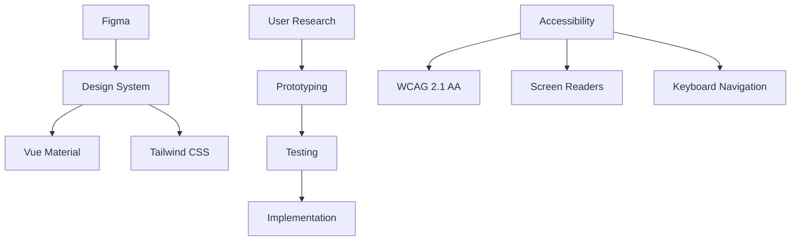
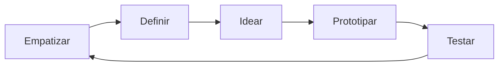
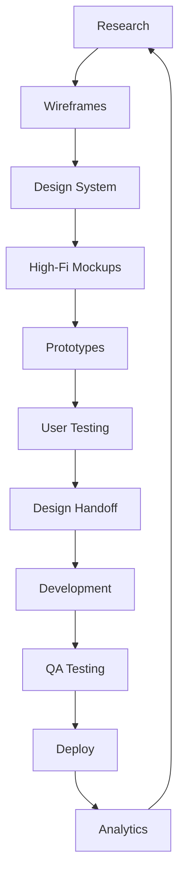

# 🎨 UX/UI Design - Diretrizes DATAMETRIA

**Diretrizes para Design de Interfaces e Experiência do Usuário**

**Versão**: 2.0 | **Data**: 15/09/2025 | **Autor**: Equipe DATAMETRIA

[](https://github.com/datametria/design-system)
[](https://figma.com)
[](https://www.w3.org/WAI/WCAG22/quickref/)
[](https://github.com/datametria/DATAMETRIA-standards)

[🎨 Design System](https://github.com/datametria/design-system) • [📱 Components](#4-componentes-ui) • [🔍 Usability](#5-experiencia-do-usuario)

---

## 📋 Índice

1. [Visão Geral](#1-visao-geral)
2. [Princípios de Design](#2-principios-de-design)
3. [Design System](#3-design-system)
4. [Componentes UI](#4-componentes-ui)
5. [Experiência do Usuário](#5-experiencia-do-usuario)
6. [Responsividade](#7-responsividade)
7. [Acessibilidade Empresarial](#8-acessibilidade-empresarial)
8. [Prototipagem](#10-prototipagem)
9. [Testes de Usabilidade](#11-testes-de-usabilidade)
10. [Ferramentas e Workflow](#12-ferramentas-e-workflow)
11. [Checklist UX/UI](#13-checklist-uxui)

---

## 1. Visão Geral

### 🎯 Objetivo

Estabelecer diretrizes consistentes para criação de interfaces intuitivas, acessíveis e eficientes que proporcionem excelente experiência do usuário em todos os produtos DATAMETRIA.

### 🏗️ Princípios Fundamentais

| Princípio | Descrição | Benefício |
|-----------|-----------|-----------|
| **👤 User-Centered** | Foco nas necessidades do usuário | Maior satisfação e adoção |
| **🎨 Consistência** | Padrões visuais e comportamentais | Reduz curva de aprendizado |
| **♿ Acessibilidade WCAG 2.2 AA** | Inclusivo com novos critérios 2.2 | Compliance total e inclusão |
| **📱 Responsivo** | Adaptável a diferentes dispositivos | Experiência universal |
| **⚡ Performance** | Interfaces rápidas e eficientes | Melhor usabilidade |

### 🛠️ Stack de Design



---

## 2. Princípios de Design

### 2.1. Hierarquia Visual

#### Estrutura de Informação

```css
/* Hierarquia tipográfica */
.heading-1 { font-size: 2.5rem; font-weight: 700; line-height: 1.2; }
.heading-2 { font-size: 2rem; font-weight: 600; line-height: 1.3; }
.heading-3 { font-size: 1.5rem; font-weight: 600; line-height: 1.4; }
.body-large { font-size: 1.125rem; font-weight: 400; line-height: 1.6; }
.body-regular { font-size: 1rem; font-weight: 400; line-height: 1.6; }
.body-small { font-size: 0.875rem; font-weight: 400; line-height: 1.5; }
.caption { font-size: 0.75rem; font-weight: 400; line-height: 1.4; }
```

#### Grid System

```css
/* Sistema de grid responsivo */
.container {
  max-width: 1200px;
  margin: 0 auto;
  padding: 0 1rem;
}

.grid {
  display: grid;
  grid-template-columns: repeat(12, 1fr);
  gap: 1.5rem;
}

.col-span-6 { grid-column: span 6; }
.col-span-4 { grid-column: span 4; }
.col-span-3 { grid-column: span 3; }
```

### 2.2. Design System Híbrido

#### Paletas Semânticas Contextuais

```css
:root {
  /* Azul DATAMETRIA - Cores Primárias */
  --primary-50: #eff6ff;
  --primary-100: #dbeafe;
  --primary-500: #3b82f6;
  --primary-600: #2563eb;
  --primary-700: #1d4ed8;
  --primary-900: #1e3a8a;

  /* Gradientes Corporativos */
  --gradient-primary: linear-gradient(135deg, #3b82f6 0%, #1d4ed8 100%);
  --gradient-secondary: linear-gradient(135deg, #6366f1 0%, #8b5cf6 100%);
  --gradient-accent: linear-gradient(135deg, #06b6d4 0%, #0891b2 100%);

  /* Paleta Adaptável Cliente/DATAMETRIA */
  --brand-primary: var(--primary-600); /* Adaptável por contexto */
  --brand-secondary: #6366f1;
  --brand-accent: #06b6d4;

  /* Cinzas Semânticos */
  --gray-50: #f9fafb;
  --gray-100: #f3f4f6;
  --gray-200: #e5e7eb;
  --gray-500: #6b7280;
  --gray-700: #374151;
  --gray-900: #111827;

  /* Estados Semânticos */
  --success: #10b981;
  --warning: #f59e0b;
  --error: #ef4444;
  --info: #06b6d4;

  /* Bordas Temáticas para Cards */
  --border-success: #10b981;
  --border-warning: #f59e0b;
  --border-info: #06b6d4;
  --border-feature: #8b5cf6;
}
```

#### Typography Responsiva

```css
/* Escalas automáticas baseadas em device */
:root {
  --scale-mobile: 1.0;
  --scale-tablet: 1.1;
  --scale-desktop: 1.2;
}

@media (min-width: 768px) {
  :root { --current-scale: var(--scale-tablet); }
}

@media (min-width: 1024px) {
  :root { --current-scale: var(--scale-desktop); }
}

.heading-1 {
  font-size: calc(2.5rem * var(--current-scale, 1.0));
  font-weight: 700;
  line-height: 1.2;
}
.heading-2 {
  font-size: calc(2rem * var(--current-scale, 1.0));
  font-weight: 600;
  line-height: 1.3;
}
```

### 2.3. Espaçamento

#### Sistema de Espaçamento

```css
:root {
  --space-1: 0.25rem;  /* 4px */
  --space-2: 0.5rem;   /* 8px */
  --space-3: 0.75rem;  /* 12px */
  --space-4: 1rem;     /* 16px */
  --space-6: 1.5rem;   /* 24px */
  --space-8: 2rem;     /* 32px */
  --space-12: 3rem;    /* 48px */
  --space-16: 4rem;    /* 64px */
}
```

---

## 3. Design System

### 3.1. Tokens de Design

#### Arquivo de Tokens

```json
{
  "color": {
    "primary": {
      "50": "#eff6ff",
      "500": "#3b82f6",
      "900": "#1e3a8a"
    },
    "semantic": {
      "success": "#10b981",
      "warning": "#f59e0b",
      "error": "#ef4444"
    }
  },
  "typography": {
    "fontFamily": {
      "sans": ["Inter", "system-ui", "sans-serif"],
      "mono": ["JetBrains Mono", "monospace"]
    },
    "fontSize": {
      "xs": "0.75rem",
      "sm": "0.875rem",
      "base": "1rem",
      "lg": "1.125rem",
      "xl": "1.25rem",
      "2xl": "1.5rem"
    }
  },
  "spacing": {
    "1": "0.25rem",
    "2": "0.5rem",
    "4": "1rem",
    "8": "2rem"
  }
}
```

### 3.2. Componentes Base

#### Botões Contextuais Avançados

```vue
<template>
  <button
    :class="buttonClasses"
    :disabled="disabled || loading"
    @click="handleClick"
    @touchstart="handleTouchStart"
    @touchend="handleTouchEnd"
  >
    <!-- Loading State -->
    <div v-if="loading" class="flex items-center">
      <div class="animate-spin rounded-full h-4 w-4 border-2 border-white border-t-transparent mr-2"></div>
      <span>{{ loadingText || 'Carregando...' }}</span>
    </div>

    <!-- Normal State -->
    <template v-else>
      <Icon v-if="icon" :name="icon" class="mr-2" />
      <slot />
    </template>
  </button>
</template>

<script setup>
import { computed, ref } from 'vue'

const props = defineProps({
  variant: {
    type: String,
    default: 'primary',
    validator: (value) => ['primary', 'secondary', 'tertiary', 'outline', 'ghost'].includes(value)
  },
  size: {
    type: String,
    default: 'md',
    validator: (value) => ['sm', 'md', 'lg'].includes(value)
  },
  disabled: Boolean,
  loading: Boolean,
  loadingText: String,
  icon: String,
  hapticFeedback: { type: Boolean, default: true }
})

const emit = defineEmits(['click'])
const isPressed = ref(false)

const buttonClasses = computed(() => {
  const base = `
    inline-flex items-center justify-center font-medium rounded-lg
    min-w-[24px] min-h-[24px]
    transition-all duration-200 ease-in-out
    focus:outline-none focus:ring-2 focus:ring-offset-2 focus:z-[999]
    transform active:scale-95
    ${isPressed.value ? 'scale-95' : 'scale-100'}
  `

  const variants = {
    primary: `
      bg-gradient-to-r from-primary-600 to-primary-700 text-white
      hover:from-primary-700 hover:to-primary-800
      focus:ring-primary-500 shadow-lg hover:shadow-xl
    `,
    secondary: `
      bg-gray-200 text-gray-900 hover:bg-gray-300
      focus:ring-gray-500 shadow-md hover:shadow-lg
    `,
    tertiary: `
      bg-gradient-to-r from-gray-100 to-gray-200 text-gray-700
      hover:from-gray-200 hover:to-gray-300
      focus:ring-gray-400 shadow-sm hover:shadow-md
    `,
    outline: `
      border-2 border-primary-300 bg-white text-primary-700
      hover:bg-primary-50 hover:border-primary-400
      focus:ring-primary-500 shadow-sm hover:shadow-md
    `,
    ghost: `
      text-gray-700 hover:bg-gray-100
      focus:ring-gray-500 hover:shadow-sm
    `
  }

  const sizes = {
    sm: 'px-3 py-1.5 text-sm h-8',
    md: 'px-4 py-2 text-base h-10',
    lg: 'px-6 py-3 text-lg h-12'
  }

  const disabled = (props.disabled || props.loading) ? 'opacity-50 cursor-not-allowed transform-none' : ''

  return `${base} ${variants[props.variant]} ${sizes[props.size]} ${disabled}`.replace(/\s+/g, ' ').trim()
})

// Haptic Feedback para dispositivos móveis
const triggerHapticFeedback = () => {
  if (props.hapticFeedback && 'vibrate' in navigator) {
    navigator.vibrate(10) // Vibração sutil de 10ms
  }
}

const handleClick = (event) => {
  if (!props.disabled && !props.loading) {
    triggerHapticFeedback()
    emit('click', event)
  }
}

const handleTouchStart = () => {
  isPressed.value = true
}

const handleTouchEnd = () => {
  isPressed.value = false
}
</script>
```

#### Cards com Bordas Temáticas

```vue
<template>
  <div
    :class="cardClasses"
    @mouseenter="handleHover(true)"
    @mouseleave="handleHover(false)"
  >
    <!-- Header do Card -->
    <div v-if="title || $slots.header" class="card-header">
      <slot name="header">
        <h3 class="text-lg font-semibold text-gray-900">{{ title }}</h3>
        <p v-if="subtitle" class="text-sm text-gray-600 mt-1">{{ subtitle }}</p>
      </slot>
    </div>

    <!-- Conteúdo Principal -->
    <div class="card-content">
      <slot />
    </div>

    <!-- Footer do Card -->
    <div v-if="$slots.footer" class="card-footer">
      <slot name="footer" />
    </div>
  </div>
</template>

<script setup>
import { computed, ref } from 'vue'

const props = defineProps({
  variant: {
    type: String,
    default: 'default',
    validator: (value) => ['default', 'success', 'warning', 'info', 'feature'].includes(value)
  },
  title: String,
  subtitle: String,
  elevated: { type: Boolean, default: false },
  interactive: { type: Boolean, default: false }
})

const isHovered = ref(false)

const cardClasses = computed(() => {
  const base = `
    bg-white rounded-lg border-l-4 shadow-sm
    transition-all duration-300 ease-in-out
    ${props.interactive ? 'cursor-pointer hover:shadow-lg' : ''}
    ${isHovered.value && props.interactive ? 'transform scale-105' : ''}
  `

  const variants = {
    default: 'border-l-gray-300',
    success: 'border-l-green-500',
    warning: 'border-l-yellow-500',
    info: 'border-l-blue-500',
    feature: 'border-l-purple-500'
  }

  const elevation = props.elevated ? 'shadow-lg' : 'shadow-sm'

  return `${base} ${variants[props.variant]} ${elevation}`.replace(/\s+/g, ' ').trim()
})

const handleHover = (hovered) => {
  if (props.interactive) {
    isHovered.value = hovered
  }
}
</script>

<style scoped>
.card-header {
  @apply p-6 pb-4;
}

.card-content {
  @apply px-6 pb-6;
}

.card-footer {
  @apply px-6 pb-6 pt-0 border-t border-gray-100 mt-4 pt-4;
}
</style>
```

---

## 4. Componentes UI

### 4.1. Formulários

#### Input Field Avançado

```vue
<template>
  <div class="form-field">
    <label v-if="label" :for="fieldId" class="form-label">
      {{ label }}
      <span v-if="required" class="text-red-500 ml-1">*</span>
    </label>

    <div class="relative">
      <input
        :id="fieldId"
        v-model="inputValue"
        :type="type"
        :placeholder="placeholder"
        :disabled="disabled"
        :class="inputClasses"
        @focus="handleFocus"
        @blur="handleBlur"
        @input="handleInput"
      />

      <!-- Ícone de Status -->
      <div v-if="showStatusIcon" class="absolute inset-y-0 right-0 flex items-center pr-3">
        <Icon :name="statusIcon" :class="statusIconClasses" />
      </div>
    </div>

    <!-- Mensagem de Erro/Ajuda -->
    <div v-if="errorMessage || helpText" class="mt-2">
      <p v-if="errorMessage" class="text-sm text-red-600">{{ errorMessage }}</p>
      <p v-else-if="helpText" class="text-sm text-gray-500">{{ helpText }}</p>
    </div>
  </div>
</template>

<script setup>
import { computed, ref, watch } from 'vue'
import { generateId } from '@/utils/helpers'

const props = defineProps({
  modelValue: [String, Number],
  label: String,
  type: { type: String, default: 'text' },
  placeholder: String,
  required: Boolean,
  disabled: Boolean,
  errorMessage: String,
  helpText: String,
  validation: Function
})

const emit = defineEmits(['update:modelValue', 'focus', 'blur'])

const fieldId = generateId('field')
const isFocused = ref(false)
const isValid = ref(true)

const inputValue = computed({
  get: () => props.modelValue,
  set: (value) => emit('update:modelValue', value)
})

const inputClasses = computed(() => {
  const base = `
    block w-full px-3 py-2 border rounded-md shadow-sm
    placeholder-gray-400 focus:outline-none focus:ring-2 focus:ring-offset-2
    transition-colors duration-200
  `

  const state = props.errorMessage
    ? 'border-red-300 focus:border-red-500 focus:ring-red-500'
    : 'border-gray-300 focus:border-blue-500 focus:ring-blue-500'

  const disabled = props.disabled ? 'bg-gray-50 cursor-not-allowed' : 'bg-white'

  return `${base} ${state} ${disabled}`.replace(/\s+/g, ' ').trim()
})

const showStatusIcon = computed(() => {
  return props.errorMessage || (isValid.value && inputValue.value)
})

const statusIcon = computed(() => {
  return props.errorMessage ? 'exclamation-circle' : 'check-circle'
})

const statusIconClasses = computed(() => {
  return props.errorMessage ? 'text-red-500' : 'text-green-500'
})

const handleFocus = (event) => {
  isFocused.value = true
  emit('focus', event)
}

const handleBlur = (event) => {
  isFocused.value = false
  emit('blur', event)
  validateInput()
}

const handleInput = (event) => {
  emit('update:modelValue', event.target.value)
}

const validateInput = () => {
  if (props.validation && inputValue.value) {
    isValid.value = props.validation(inputValue.value)
  }
}

watch(() => props.modelValue, validateInput)
</script>

<style scoped>
.form-label {
  @apply block text-sm font-medium text-gray-700 mb-1;
}

.form-field {
  @apply mb-4;
}
</style>
```

---

## 5. Experiência do Usuário

### 5.1. Padrões de Interação

#### Estados de Loading

```vue
<template>
  <div class="loading-container">
    <!-- Skeleton Loading -->
    <div v-if="type === 'skeleton'" class="space-y-4">
      <div class="animate-pulse">
        <div class="h-4 bg-gray-200 rounded w-3/4 mb-2"></div>
        <div class="h-4 bg-gray-200 rounded w-1/2 mb-2"></div>
        <div class="h-4 bg-gray-200 rounded w-5/6"></div>
      </div>
    </div>

    <!-- Spinner Loading -->
    <div v-else-if="type === 'spinner'" class="flex items-center justify-center py-8">
      <div class="animate-spin rounded-full h-8 w-8 border-2 border-blue-500 border-t-transparent"></div>
      <span v-if="message" class="ml-3 text-gray-600">{{ message }}</span>
    </div>

    <!-- Progress Bar -->
    <div v-else-if="type === 'progress'" class="w-full">
      <div class="flex justify-between text-sm text-gray-600 mb-1">
        <span>{{ message }}</span>
        <span>{{ Math.round(progress) }}%</span>
      </div>
      <div class="w-full bg-gray-200 rounded-full h-2">
        <div
          class="bg-blue-500 h-2 rounded-full transition-all duration-300"
          :style="{ width: `${progress}%` }"
        ></div>
      </div>
    </div>
  </div>
</template>

<script setup>
defineProps({
  type: {
    type: String,
    default: 'spinner',
    validator: (value) => ['skeleton', 'spinner', 'progress'].includes(value)
  },
  message: String,
  progress: {
    type: Number,
    default: 0,
    validator: (value) => value >= 0 && value <= 100
  }
})
</script>
```

---

## 6. Responsividade

### 6.1. Breakpoints

```css
:root {
  --breakpoint-sm: 640px;
  --breakpoint-md: 768px;
  --breakpoint-lg: 1024px;
  --breakpoint-xl: 1280px;
  --breakpoint-2xl: 1536px;
}

/* Mobile First Approach */
.responsive-grid {
  display: grid;
  grid-template-columns: 1fr;
  gap: 1rem;
}

@media (min-width: 768px) {
  .responsive-grid {
    grid-template-columns: repeat(2, 1fr);
    gap: 1.5rem;
  }
}

@media (min-width: 1024px) {
  .responsive-grid {
    grid-template-columns: repeat(3, 1fr);
    gap: 2rem;
  }
}
```

---

## 7. Acessibilidade Empresarial WCAG 2.2

### 7.1. WCAG 2.2 AA Compliance

#### Novos Critérios WCAG 2.2

**2.4.11 Focus Not Obscured (Minimum) - AA**
```css
/* Garantir que elementos focados nunca sejam completamente obscurecidos */
.modal-overlay {
  z-index: 998; /* Abaixo do focus */
}

.focus-visible {
  z-index: 999; /* Sempre visível */
}

.tooltip, .dropdown {
  z-index: 997; /* Não obscurecer focus */
}
```

**2.5.8 Target Size (Minimum) - AA**
```css
/* Tamanho mínimo 24x24px para todos os targets */
.btn-small {
  min-width: 24px;
  min-height: 24px;
  padding: 2px 8px;
}

.icon-button {
  min-width: 24px;
  min-height: 24px;
  display: inline-flex;
  align-items: center;
  justify-content: center;
}
```

**3.2.6 Consistent Help - A**
```vue
<template>
  <div class="consistent-help">
    <!-- Help sempre na mesma posição relativa -->
    <div class="help-container">
      <button 
        class="help-button"
        aria-label="Ajuda para esta seção"
        @click="showHelp"
      >
        <Icon name="help" />
      </button>
    </div>
  </div>
</template>

<style>
.help-container {
  position: relative;
}

.help-button {
  position: absolute;
  top: 0;
  right: 0;
  min-width: 24px;
  min-height: 24px;
}
</style>
```

**3.3.7 Redundant Entry - A**
```javascript
// Evitar re-entrada de dados já fornecidos
export function useRedundantEntry() {
  const formData = ref({})
  const previousData = ref({})

  const autoFillFromPrevious = (fieldName) => {
    if (previousData.value[fieldName] && !formData.value[fieldName]) {
      formData.value[fieldName] = previousData.value[fieldName]
    }
  }

  return {
    formData,
    autoFillFromPrevious
  }
}
```

**3.3.8 Accessible Authentication (Minimum) - AA**
```vue
<template>
  <div class="accessible-auth">
    <!-- Não exigir função cognitiva para autenticação -->    
    <div class="auth-options">
      <!-- Opção 1: Reconhecimento de objeto -->      
      <button @click="usePasswordManager">
        <Icon name="key" />
        Usar gerenciador de senhas
      </button>
      
      <!-- Opção 2: Cópia/cola permitida -->
      <input 
        type="password"
        :readonly="false"
        placeholder="Cole sua senha aqui"
      />
      
      <!-- Opção 3: Autenticação biométrica -->
      <button @click="useBiometric" v-if="biometricAvailable">
        <Icon name="fingerprint" />
        Usar biometria
      </button>
    </div>
  </div>
</template>
```

#### Contrast Ratios

```css
/* Garantir contraste mínimo 4.5:1 para texto normal */
.text-primary { color: #1f2937; } /* Contraste 12.6:1 com branco */
.text-secondary { color: #4b5563; } /* Contraste 7.0:1 com branco */
.text-muted { color: #6b7280; } /* Contraste 4.5:1 com branco */

/* Contraste 3:1 para texto grande (18px+ ou 14px+ bold) */
.text-large-muted { color: #9ca3af; } /* Contraste 3.2:1 com branco */
```

#### Focus Management

```css
/* WCAG 2.2 - Focus Not Obscured (Minimum) - AA */
.focus-visible {
  outline: 2px solid #3b82f6;
  outline-offset: 2px;
  border-radius: 4px;
  z-index: 999; /* Garantir que focus nunca seja obscurecido */
  position: relative;
}

/* WCAG 2.2 - Focus Not Obscured (Enhanced) */
.focus-enhanced {
  outline: 3px solid #3b82f6;
  outline-offset: 3px;
  box-shadow: 0 0 0 5px rgba(59, 130, 246, 0.3);
  z-index: 1000;
}

/* WCAG 2.2 - Target Size (Minimum) - AA */
.interactive-element {
  min-width: 24px;
  min-height: 24px;
  /* Para elementos críticos, usar 44px */
}

.critical-target {
  min-width: 44px;
  min-height: 44px;
}

/* Skip links para leitores de tela */
.skip-link {
  position: absolute;
  top: -40px;
  left: 6px;
  background: #000;
  color: #fff;
  padding: 8px;
  text-decoration: none;
  border-radius: 4px;
  z-index: 1001; /* Acima de qualquer elemento */
}

.skip-link:focus {
  top: 6px;
}
```

#### ARIA Labels

```vue
<template>
  <!-- Botão com ARIA -->
  <button
    :aria-label="ariaLabel"
    :aria-describedby="helpTextId"
    :aria-pressed="isPressed"
    role="button"
  >
    <Icon name="settings" aria-hidden="true" />
    {{ buttonText }}
  </button>

  <!-- Texto de ajuda -->
  <div :id="helpTextId" class="sr-only">
    {{ helpText }}
  </div>
</template>
```

---

## 8. Métricas e KPIs

### Métricas de UX

| Métrica | Objetivo | Ferramenta |
|---------|----------|------------|
| **Task Success Rate** | > 95% | User Testing |
| **Time on Task** | < 30s | Analytics |
| **Error Rate** | < 5% | Error Tracking |
| **SUS Score** | > 80 | Survey |
| **Accessibility Score** | 100% | axe-core |

---

## 9. Segurança

### Boas Práticas

- **Sanitização** de inputs do usuário
- **Validação** client-side e server-side
- **HTTPS** obrigatório em produção
- **CSP** (Content Security Policy)
- **Rate limiting** em formulários

---

## 10. Versionamento

### Histórico de Versões

| Versão | Data | Principais Mudanças |
|--------|------|--------------------|
| **2.0** | 15/09/2025 | Design System híbrido, componentes avançados |
| **1.5** | 01/08/2025 | WCAG 2.1 AA, acessibilidade empresarial |
| **1.0** | 15/06/2025 | Versão inicial |

---

## 11. Contribuição

### Como Contribuir

1. **Fork** o repositório
2. **Crie** uma branch: `git checkout -b feature/novo-componente`
3. **Implemente** seguindo estas diretrizes
4. **Teste** acessibilidade e responsividade
5. **Submeta** um Pull Request

---

## 12. Suporte

### Canais de Suporte

- **📧 Email**: <design@datametria.io>
- **💬 Discord**: [discord.gg/datametria](https://discord.gg/datametria)
- **🎨 Figma**: [Design System DATAMETRIA](https://figma.com/datametria)

---

## 13. Referências

### Documentação Oficial

- **[WCAG 2.1](https://www.w3.org/WAI/WCAG21/quickref/)** - Diretrizes de acessibilidade
- **[Material Design 3](https://m3.material.io/)** - Sistema de design Google
- **[Vue.js](https://vuejs.org/)** - Framework frontend
- **[Tailwind CSS](https://tailwindcss.com/)** - Framework CSS

### Diretrizes DATAMETRIA Relacionadas

- **[Web Development](datametria_std_web_dev.md)** - Desenvolvimento web
- **[Mobile Flutter](datametria_std_mobile_flutter.md)** - Mobile híbrido
- **[Security Development](datametria_std_security.md)** - Segurança
- **[Documentation](datametria_std_documentation.md)** - Documentação

---

**Desenvolvido com ❤️ pela equipe DATAMETRIA**

*Para dúvidas ou sugestões sobre este documento, entre em contato com a equipe de design.*v :class="cardClasses">
    <!-- Header com gradiente opcional -->
    <div v-if="$slots.header || title" :class="headerClasses">
      <slot name="header">
        <h3 class="text-lg font-semibold text-gray-900">{{ title }}</h3>
      </slot>
    </div>

    <!-- Conteúdo -->
    <div class="p-6">
      <slot />
    </div>

    <!-- Footer -->
    <div v-if="$slots.footer" class="px-6 py-4 bg-gray-50 border-t border-gray-200 rounded-b-lg">
      <slot name="footer" />
    </div>
  </div>
</template>

<script setup>
import { computed } from 'vue'

const props = defineProps({
  variant: {
    type: String,
    default: 'default',
    validator: (value) => ['default', 'success', 'warning', 'info', 'feature'].includes(value)
  },
  title: String,
  gradient: Boolean
})

const cardClasses = computed(() => {
  const base = 'bg-white rounded-lg shadow-md hover:shadow-lg transition-shadow duration-200'

  const borders = {
    default: 'border border-gray-200',
    success: 'border-l-4 border-l-success border-t border-r border-b border-gray-200',
    warning: 'border-l-4 border-l-warning border-t border-r border-b border-gray-200',
    info: 'border-l-4 border-l-info border-t border-r border-b border-gray-200',
    feature: 'border-l-4 border-l-feature border-t border-r border-b border-gray-200'
  }

  return `${base} ${borders[props.variant]}`
})

const headerClasses = computed(() => {
  if (props.gradient) {
    return 'px-6 py-4 bg-gradient-to-r from-primary-500 to-primary-600 text-white rounded-t-lg'
  }
  return 'px-6 py-4 border-b border-gray-200'
})
</script>

```

---

## 4. Componentes UI

### 4.1. Navegação

#### Header Component

```vue
<template>
  <header class="bg-white shadow-sm border-b border-gray-200">
    <div class="container mx-auto px-4">
      <div class="flex items-center justify-between h-16">
        <!-- Logo -->
        <div class="flex items-center">
          
        </div>

        <!-- Navigation -->
        <nav class="hidden md:flex space-x-8">
          <a
            v-for="item in navigation"
            :key="item.name"
            :href="item.href"
            :class="[
              'text-sm font-medium transition-colors',
              item.current
                ? 'text-primary-600'
                : 'text-gray-700 hover:text-primary-600'
            ]"
          >
            {{ item.name }}
          </a>
        </nav>

        <!-- User Menu -->
        <div class="flex items-center space-x-4">
          <Button variant="outline" size="sm">
            Configurações
          </Button>
          <UserDropdown />
        </div>
      </div>
    </div>
  </header>
</template>
```

### 4.2. Formulários

#### Form Layout

```vue
<template>
  <form @submit.prevent="onSubmit" class="space-y-6">
    <div class="grid grid-cols-1 md:grid-cols-2 gap-6">
      <FormField
        v-model="form.firstName"
        label="Nome"
        required
        :error="errors.firstName"
      />

      <FormField
        v-model="form.lastName"
        label="Sobrenome"
        required
        :error="errors.lastName"
      />
    </div>

    <FormField
      v-model="form.email"
      label="Email"
      type="email"
      required
      :error="errors.email"
      hint="Será usado para login no sistema"
    />

    <div class="flex justify-end space-x-3">
      <Button variant="outline" type="button" @click="onCancel">
        Cancelar
      </Button>
      <Button type="submit" :loading="loading">
        Salvar
      </Button>
    </div>
  </form>
</template>
```

---

## 5. Experiência do Usuário

### 5.1. Fluxos de Usuário

#### Estados de Loading

```vue
<template>
  <div class="loading-states">
    <!-- Skeleton Loading -->
    <div v-if="loading" class="animate-pulse">
      <div class="h-4 bg-gray-200 rounded w-3/4 mb-2"></div>
      <div class="h-4 bg-gray-200 rounded w-1/2 mb-2"></div>
      <div class="h-4 bg-gray-200 rounded w-5/6"></div>
    </div>

    <!-- Spinner Loading -->
    <div v-if="processing" class="flex items-center justify-center p-4">
      <div class="animate-spin rounded-full h-8 w-8 border-b-2 border-primary-600"></div>
      <span class="ml-2 text-sm text-gray-600">Processando...</span>
    </div>
  </div>
</template>
```

### 5.2. Micro-interações Profissionais

#### Shimmer Loading States

```vue
<template>
  <div class="shimmer-container">
    <!-- Shimmer para Cards -->
    <div v-if="loading" class="animate-pulse space-y-4">
      <div class="bg-gradient-to-r from-gray-200 via-gray-300 to-gray-200 bg-[length:200%_100%] animate-shimmer h-4 rounded w-3/4"></div>
      <div class="bg-gradient-to-r from-gray-200 via-gray-300 to-gray-200 bg-[length:200%_100%] animate-shimmer h-4 rounded w-1/2"></div>
      <div class="bg-gradient-to-r from-gray-200 via-gray-300 to-gray-200 bg-[length:200%_100%] animate-shimmer h-4 rounded w-5/6"></div>
    </div>

    <!-- Conteúdo real -->
    <div v-else>
      <slot />
    </div>
  </div>
</template>

<style>
@keyframes shimmer {
  0% { background-position: -200% 0; }
  100% { background-position: 200% 0; }
}

.animate-shimmer {
  animation: shimmer 2s infinite;
}
</style>
```

#### Tap Scale + Ripple Effects

```css
/* Micro-interações premium */
.interactive-element {
  @apply relative overflow-hidden;
  @apply transition-all duration-200 ease-in-out;
  @apply hover:scale-105 hover:shadow-lg;
  @apply active:scale-95;
}

/* Efeito Ripple */
.ripple-effect {
  position: relative;
  overflow: hidden;
}

.ripple-effect::before {
  content: '';
  position: absolute;
  top: 50%;
  left: 50%;
  width: 0;
  height: 0;
  border-radius: 50%;
  background: rgba(255, 255, 255, 0.5);
  transform: translate(-50%, -50%);
  transition: width 0.6s, height 0.6s;
}

.ripple-effect:active::before {
  width: 300px;
  height: 300px;
}

/* Haptic Feedback Visual */
.haptic-feedback {
  @apply transform transition-transform duration-75;
}

.haptic-feedback:active {
  @apply scale-95;
}
```

#### Headers Adaptativos

```vue
<template>
  <header :class="headerClasses">
    <!-- Gradiente de fundo -->
    <div class="absolute inset-0 bg-gradient-to-r from-primary-600 to-primary-700 opacity-90"></div>

    <!-- Conteúdo -->
    <div class="relative z-10 container mx-auto px-4">
      <div class="flex items-center justify-between h-16">
        <!-- Logo Adaptativo -->
        <div class="flex items-center space-x-4">
          
          <div v-if="showBrandText" class="text-white font-semibold text-lg">
            {{ brandText }}
          </div>
        </div>

        <!-- Navegação Responsiva -->
        <nav class="hidden md:flex space-x-8">
          <a
            v-for="item in navigation"
            :key="item.name"
            :href="item.href"
            :class="[
              'text-sm font-medium transition-all duration-200',
              'hover:text-white hover:scale-105',
              item.current
                ? 'text-white border-b-2 border-white'
                : 'text-gray-200 hover:text-white'
            ]"
          >
            {{ item.name }}
          </a>
        </nav>

        <!-- Menu Mobile -->
        <button
          @click="toggleMobileMenu"
          class="md:hidden text-white hover:text-gray-200 transition-colors"
        >
          <Icon name="menu" class="h-6 w-6" />
        </button>
      </div>
    </div>
  </header>
</template>

<script setup>
import { computed, ref } from 'vue'

const props = defineProps({
  logoSrc: { type: String, default: '/logo-white.svg' },
  logoAlt: { type: String, default: 'DATAMETRIA' },
  brandText: String,
  showBrandText: { type: Boolean, default: true },
  navigation: Array,
  gradient: { type: Boolean, default: true }
})

const mobileMenuOpen = ref(false)

const headerClasses = computed(() => {
  const base = 'relative bg-white shadow-sm'
  const gradientClass = props.gradient ? 'bg-gradient-to-r from-primary-600 to-primary-700' : 'bg-primary-600'
  return `${base} ${gradientClass}`
})

const toggleMobileMenu = () => {
  mobileMenuOpen.value = !mobileMenuOpen.value
}
</script>
```

---

## 7. Responsividade

### 7.1. Breakpoints

#### Sistema de Breakpoints

```css
:root {
  --breakpoint-sm: 640px;   /* Mobile landscape */
  --breakpoint-md: 768px;   /* Tablet */
  --breakpoint-lg: 1024px;  /* Desktop */
  --breakpoint-xl: 1280px;  /* Large desktop */
  --breakpoint-2xl: 1536px; /* Extra large */
}
```

### 7.2. Layout Responsivo

#### Grid Responsivo

```vue
<template>
  <div class="responsive-grid">
    <!-- Mobile: 1 coluna, Tablet: 2 colunas, Desktop: 3 colunas -->
    <div class="grid grid-cols-1 md:grid-cols-2 lg:grid-cols-3 gap-6">
      <Card v-for="item in items" :key="item.id">
        <!-- Conteúdo do card -->
      </Card>
    </div>
  </div>
</template>
```

---

## 8. Acessibilidade Empresarial

### 8.1. VoiceOver Semântico

#### Labels Contextuais por Domínio

```vue
<template>
  <div>
    <!-- Botões com contexto semântico -->
    <button
      :aria-label="getSemanticLabel('save', context)"
      :aria-describedby="`${id}-description`"
    >
      Salvar
    </button>

    <!-- Descrição contextual oculta -->
    <div :id="`${id}-description`" class="sr-only">
      {{ getSemanticDescription('save', context) }}
    </div>

    <!-- Formulários com contexto -->
    <input
      :aria-label="getSemanticLabel('email', 'user-registration')"
      :aria-describedby="`${id}-email-help`"
      type="email"
    />

    <div :id="`${id}-email-help`" class="sr-only">
      {{ getSemanticDescription('email', 'user-registration') }}
    </div>
  </div>
</template>

<script setup>
const props = defineProps({
  context: String, // 'financial', 'user-management', 'reporting', etc.
  id: String
})

// Mapeamento semântico por domínio de negócio
const semanticLabels = {
  financial: {
    save: 'Salvar dados financeiros',
    delete: 'Excluir registro financeiro',
    email: 'Email para notificações financeiras'
  },
  'user-management': {
    save: 'Salvar dados do usuário',
    delete: 'Remover usuário do sistema',
    email: 'Email de acesso do usuário'
  },
  reporting: {
    save: 'Salvar configuração do relatório',
    delete: 'Excluir relatório',
    email: 'Email para envio do relatório'
  }
}

const semanticDescriptions = {
  financial: {
    save: 'Esta ação salvará permanentemente os dados financeiros no sistema',
    email: 'Insira o email que receberá notificações sobre movimentações financeiras'
  },
  'user-management': {
    save: 'Esta ação criará ou atualizará o perfil do usuário',
    email: 'Email que será usado para login e comunicações do sistema'
  }
}

const getSemanticLabel = (action, context) => {
  return semanticLabels[context]?.[action] || `${action} - ${context}`
}

const getSemanticDescription = (action, context) => {
  return semanticDescriptions[context]?.[action] || ''
}
</script>
```

### 8.2. Contraste Automático

#### Validação WCAG 2.1 AA em Tempo Real

```javascript
// Utilitário para validação de contraste
class ContrastValidator {
  // Calcula luminância relativa
  static getRelativeLuminance(rgb) {
    const [r, g, b] = rgb.map(c => {
      c = c / 255
      return c <= 0.03928 ? c / 12.92 : Math.pow((c + 0.055) / 1.055, 2.4)
    })
    return 0.2126 * r + 0.7152 * g + 0.0722 * b
  }

  // Calcula ratio de contraste
  static getContrastRatio(color1, color2) {
    const l1 = this.getRelativeLuminance(color1)
    const l2 = this.getRelativeLuminance(color2)
    const lighter = Math.max(l1, l2)
    const darker = Math.min(l1, l2)
    return (lighter + 0.05) / (darker + 0.05)
  }

  // Valida WCAG AA (4.5:1 para texto normal, 3:1 para texto grande)
  static validateWCAG_AA(foreground, background, isLargeText = false) {
    const ratio = this.getContrastRatio(foreground, background)
    const minRatio = isLargeText ? 3 : 4.5
    return {
      ratio,
      passes: ratio >= minRatio,
      level: ratio >= 7 ? 'AAA' : ratio >= minRatio ? 'AA' : 'Fail'
    }
  }

  // Auto-ajuste de cor para garantir contraste
  static autoAdjustContrast(foreground, background, targetRatio = 4.5) {
    let adjusted = [...foreground]
    let currentRatio = this.getContrastRatio(adjusted, background)

    if (currentRatio >= targetRatio) return adjusted

    // Escurece ou clareia automaticamente
    const step = currentRatio < targetRatio ? -10 : 10

    while (currentRatio < targetRatio && adjusted.every(c => c >= 0 && c <= 255)) {
      adjusted = adjusted.map(c => Math.max(0, Math.min(255, c + step)))
      currentRatio = this.getContrastRatio(adjusted, background)
    }

    return adjusted
  }
}

// Composable Vue para contraste automático
export function useContrastValidation() {
  const validateContrast = (foregroundColor, backgroundColor, isLargeText = false) => {
    return ContrastValidator.validateWCAG_AA(foregroundColor, backgroundColor, isLargeText)
  }

  const autoAdjustContrast = (foregroundColor, backgroundColor) => {
    return ContrastValidator.autoAdjustContrast(foregroundColor, backgroundColor)
  }

  return {
    validateContrast,
    autoAdjustContrast
  }
}
```

### 8.3. Escalabilidade Controlada

#### Clamp 0.8-2.0 para Manter Layout

```css
/* Sistema de escalabilidade controlada */
:root {
  --min-scale: 0.8;
  --max-scale: 2.0;
  --user-scale: 1.0; /* Controlado por preferência do usuário */
}

/* Função clamp para todos os tamanhos */
.scalable-text {
  font-size: clamp(
    calc(1rem * var(--min-scale)),
    calc(1rem * var(--user-scale)),
    calc(1rem * var(--max-scale))
  );
}

.scalable-heading-1 {
  font-size: clamp(
    calc(2.5rem * var(--min-scale)),
    calc(2.5rem * var(--user-scale)),
    calc(2.5rem * var(--max-scale))
  );
}

/* Espaçamentos proporcionais */
.scalable-padding {
  padding: clamp(
    calc(1rem * var(--min-scale)),
    calc(1rem * var(--user-scale)),
    calc(1rem * var(--max-scale))
  );
}

/* Componentes que mantenham proporção */
.scalable-button {
  min-height: clamp(
    calc(2.5rem * var(--min-scale)),
    calc(2.5rem * var(--user-scale)),
    calc(2.5rem * var(--max-scale))
  );
  padding: clamp(
    calc(0.5rem * var(--min-scale)),
    calc(0.5rem * var(--user-scale)),
    calc(0.5rem * var(--max-scale))
  ) clamp(
    calc(1rem * var(--min-scale)),
    calc(1rem * var(--user-scale)),
    calc(1rem * var(--max-scale))
  );
}
```

```javascript
// Controle de escala por JavaScript
export function useAccessibilityScale() {
  const currentScale = ref(1.0)

  const setScale = (scale) => {
    const clampedScale = Math.max(0.8, Math.min(2.0, scale))
    currentScale.value = clampedScale
    document.documentElement.style.setProperty('--user-scale', clampedScale)

    // Salva preferência do usuário
    localStorage.setItem('accessibility-scale', clampedScale.toString())
  }

  const increaseScale = () => {
    setScale(currentScale.value + 0.1)
  }

  const decreaseScale = () => {
    setScale(currentScale.value - 0.1)
  }

  const resetScale = () => {
    setScale(1.0)
  }

  // Carrega preferência salva
  onMounted(() => {
    const savedScale = localStorage.getItem('accessibility-scale')
    if (savedScale) {
      setScale(parseFloat(savedScale))
    }
  })

  return {
    currentScale: readonly(currentScale),
    setScale,
    increaseScale,
    decreaseScale,
    resetScale
  }
}
```

## 9. Acessibilidade

### 9.1. WCAG 2.1 Guidelines

#### Contraste de Cores

```css
/* Garantir contraste mínimo 4.5:1 para texto normal */
.text-primary { color: #1d4ed8; } /* Contraste: 7.2:1 */
.text-secondary { color: #374151; } /* Contraste: 9.8:1 */
.text-muted { color: #6b7280; } /* Contraste: 4.6:1 */
```

#### Navegação por Teclado

```vue
<template>
  <div class="keyboard-navigation">
    <!-- Skip links -->
    <a
      href="#main-content"
      class="sr-only focus:not-sr-only focus:absolute focus:top-4 focus:left-4 bg-primary-600 text-white px-4 py-2 rounded-lg z-50"
    >
      Pular para conteúdo principal
    </a>

    <!-- Indicadores de foco visíveis -->
    <button class="focus:ring-2 focus:ring-primary-500 focus:ring-offset-2">
      Botão acessível
    </button>
  </div>
</template>
```

### 9.2. ARIA Labels e Roles

#### Componentes Acessíveis

```vue
<template>
  <div class="accessible-components">
    <!-- Botão com estado -->
    <button
      :aria-pressed="isActive"
      :aria-label="isActive ? 'Desativar filtro' : 'Ativar filtro'"
      @click="toggle"
    >
      <Icon :name="isActive ? 'filter-active' : 'filter'" />
    </button>

    <!-- Lista com navegação -->
    <ul role="list" aria-label="Lista de produtos">
      <li
        v-for="(item, index) in items"
        :key="item.id"
        role="listitem"
        :aria-posinset="index + 1"
        :aria-setsize="items.length"
      >
        {{ item.name }}
      </li>
    </ul>
  </div>
</template>
```

---

## 10. Prototipagem

### 10.1. Processo de Design

#### Design Thinking Flow



#### Fidelidade de Protótipos

```
Baixa Fidelidade (Wireframes)
├── Estrutura e layout
├── Fluxo de navegação
└── Hierarquia de informação

Média Fidelidade (Mockups)
├── Cores e tipografia
├── Componentes definidos
└── Conteúdo real

Alta Fidelidade (Protótipos)
├── Interações completas
├── Micro-animações
└── Estados de erro/sucesso
```

---

## 11. Testes de Usabilidade

### 11.1. Metodologias de Teste

#### Tipos de Teste

```
Testes Qualitativos
├── Entrevistas com usuários
├── Observação de uso
├── Think-aloud protocol
└── Card sorting

Testes Quantitativos
├── A/B Testing
├── Métricas de uso
├── Heatmaps
└── Analytics
```

#### Métricas de Usabilidade

```javascript
// Métricas de UX
const uxMetrics = {
  // Eficiência
  taskCompletionTime: 'Tempo para completar tarefa',
  clicksToComplete: 'Número de cliques necessários',

  // Eficácia
  taskSuccessRate: 'Taxa de sucesso da tarefa',
  errorRate: 'Taxa de erros',

  // Satisfação
  nps: 'Net Promoter Score',
  sus: 'System Usability Scale'
}
```

---

## 12. Ferramentas e Workflow

### 12.1. Stack de Ferramentas

#### Design Tools

```
Design & Prototipagem
├── Figma (Design principal)
├── FigJam (Brainstorming)
├── Principle (Micro-interações)
└── Lottie (Animações)

Desenvolvimento
├── Storybook (Component library)
├── Chromatic (Visual testing)
├── Vue DevTools (Debug)
└── Tailwind CSS (Styling)

Testes & Analytics
├── Hotjar (Heatmaps)
├── Google Analytics (Métricas)
├── Maze (Testes usabilidade)
└── UserTesting (Feedback)
```

### 12.2. Workflow de Design

#### Design to Code Process



---

## 13. Checklist UX/UI

### 13.1. Design System

#### Tokens e Componentes

- [ ] Paleta de cores definida e documentada
- [ ] Sistema tipográfico implementado
- [ ] Espaçamentos padronizados
- [ ] Componentes base criados
- [ ] Estados de componentes definidos
- [ ] Variações responsivas implementadas
- [ ] Tokens de design sincronizados
- [ ] Documentação no Storybook

### 13.2. Usabilidade

#### Interface

- [ ] Hierarquia visual clara
- [ ] Navegação intuitiva
- [ ] Feedback visual adequado
- [ ] Estados de loading implementados
- [ ] Mensagens de erro claras
- [ ] Confirmações para ações críticas
- [ ] Breadcrumbs quando necessário
- [ ] Search functionality otimizada

#### Formulários

- [ ] Labels claros e descritivos
- [ ] Validação em tempo real
- [ ] Mensagens de erro específicas
- [ ] Campos obrigatórios indicados
- [ ] Auto-complete implementado
- [ ] Formatação automática
- [ ] Salvamento automático
- [ ] Prevenção de perda de dados

### 13.3. Responsividade

#### Layout

- [ ] Design mobile-first
- [ ] Breakpoints definidos
- [ ] Grid system implementado
- [ ] Imagens responsivas
- [ ] Tipografia escalável
- [ ] Touch targets adequados (44px mín.)
- [ ] Orientação landscape suportada
- [ ] Testes em dispositivos reais

### 13.4. Acessibilidade

#### WCAG 2.1 AA

- [ ] Contraste mínimo 4.5:1
- [ ] Navegação por teclado
- [ ] Screen reader compatibility
- [ ] ARIA labels implementados
- [ ] Focus indicators visíveis
- [ ] Skip links disponíveis
- [ ] Texto alternativo em imagens
- [ ] Estrutura semântica HTML

#### Testes

- [ ] Teste com screen reader
- [ ] Navegação apenas por teclado
- [ ] Teste de contraste
- [ ] Validação HTML semântico
- [ ] Teste com usuários com deficiência
- [ ] Auditoria automatizada (axe)

### 13.5. Performance

#### Otimização

- [ ] Imagens otimizadas e lazy loading
- [ ] Fontes web otimizadas
- [ ] CSS crítico inline
- [ ] JavaScript code splitting
- [ ] Compressão gzip/brotli
- [ ] CDN para assets estáticos
- [ ] Service worker implementado
- [ ] Métricas Core Web Vitals

#### Métricas

- [ ] LCP < 2.5s
- [ ] FID < 100ms
- [ ] CLS < 0.1
- [ ] TTI < 3.8s
- [ ] Speed Index < 3.4s

### 13.6. Testes

#### Funcionalidade

- [ ] Testes unitários de componentes
- [ ] Testes de integração
- [ ] Testes E2E críticos
- [ ] Testes de regressão visual
- [ ] Cross-browser testing
- [ ] Testes de performance
- [ ] Testes de acessibilidade
- [ ] Testes de usabilidade

#### Qualidade

- [ ] Code review obrigatório
- [ ] Linting automatizado
- [ ] Type checking (TypeScript)
- [ ] Bundle size monitoring
- [ ] Lighthouse audits
- [ ] A11y audits automatizados

---

## Versionamento do Documento

| Versão | Data | Alterações | Autor |
|--------|------|------------|-------|
| 1.0 | 08/08/2025 | Versão inicial - Diretrizes UX/UI completas | Vander Loto |
| 1.1 | 11/09/2025 | Adicionados componentes avançados, dashboard modular, navegação reordenável, templates e persistência | Vander Loto |
| 2.0 | 15/09/2025 | Design System Hibrido, Paletas Semanticas Contextuais, Typography Responsiva, Botoes Contextuais Avancados, Cards Tematicas, Micro-interacoes Profissionais, Headers Adaptativos, Acessibilidade Empresarial com VoiceOver Semantico, Contraste Automatico WCAG, Escalabilidade Controlada | Vander Loto |

---

## Manutenção

- **Revisão trimestral**: Atualização de componentes e padrões
- **Feedback contínuo**: Melhorias baseadas em testes de usabilidade
- **Sincronização**: Alinhamento com outras diretrizes DATAMETRIA

**Próxima revisão**: 15/12/2025
**Responsável**: UX/UI Lead
**Aprovação**: CTO
