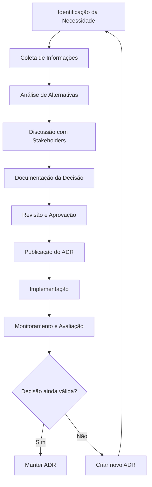

# ADR Template - Architectural Decision Record

<div align="center">

## Padrão para Documentação de Decisões Arquiteturais

[](https://github.com/datametria/standards)
[](https://github.com/datametria/standards/releases)
[](https://github.com/datametria/standards)

[📋 Sobre ADRs](#-sobre-adrs) • [📁 Estrutura](#-estrutura-de-organização) • [📝 Template](#-template-adr) • [📚 Exemplos](#-exemplos-de-adrs)

</div>

---

## 📋 Sobre ADRs

### O que são ADRs

**Architectural Decision Records (ADRs)** são documentos que capturam decisões arquiteturais importantes junto com seu contexto e consequências. Eles servem como um registro histórico das decisões tomadas durante o desenvolvimento do projeto.

### Por que usar ADRs

- **📚 Histórico**: Mantém registro das decisões e suas motivações
- **🤝 Comunicação**: Facilita o entendimento entre membros da equipe
- **🔍 Transparência**: Torna o processo de decisão visível
- **📖 Onboarding**: Ajuda novos membros a entender o contexto
- **🔄 Evolução**: Permite revisitar e evoluir decisões

---

## 📁 Estrutura de Organização

### Localização dos ADRs

```
docs/
└── ADRs/
    ├── README.md                    # Índice de todos os ADRs
    ├── template.md                  # Este template
    ├── 0001-use-adr.md             # ADR sobre usar ADRs
    ├── 0002-database-choice.md     # Escolha do banco de dados
    ├── 0003-api-architecture.md    # Arquitetura da API
    └── 0004-frontend-framework.md  # Framework frontend
```

### Convenção de Nomenclatura

**Formato**: `NNNN-titulo-kebab-case.md`

- **NNNN**: Número sequencial com 4 dígitos (0001, 0002, etc.)
- **titulo-kebab-case**: Título descritivo em kebab-case
- **Exemplos**:
  - `0001-use-architectural-decision-records.md`
  - `0002-choose-postgresql-database.md`
  - `0003-implement-microservices-architecture.md`

---

## 📝 Template ADR

### Estrutura Básica

```markdown
# ADR-NNNN: [Título da Decisão]

<div align="center">

**Data**: [DD/MM/AAAA] | **Status**: [Status] | **Decisor(es)**: [Nome(s)]

</div>

## 📊 Metadados

| Campo | Valor |
|-------|-------|
| **ID** | ADR-NNNN |
| **Título** | [Título da Decisão] |
| **Data** | [DD/MM/AAAA] |
| **Status** | [Proposto/Aceito/Rejeitado/Depreciado/Substituído] |
| **Decisor(es)** | [Nome(s) dos responsáveis pela decisão] |
| **Consultor(es)** | [Nome(s) dos consultados] |
| **Informado(s)** | [Nome(s) dos informados] |

## 🎯 Status

### [PROPOSTO | ACEITO | REJEITADO | DEPRECIADO | SUBSTITUÍDO]

### Histórico de Status
- **[DD/MM/AAAA]**: Proposto por [Nome]
- **[DD/MM/AAAA]**: Aceito por [Nome]
- **[DD/MM/AAAA]**: [Outras mudanças de status]

## 🔍 Contexto

### Problema
[Descrição clara do problema ou oportunidade que motivou esta decisão]

### Forças em Jogo
[Fatores que influenciam a decisão, incluindo:]
- **Técnicas**: [Limitações técnicas, performance, escalabilidade]
- **Negócio**: [Requisitos de negócio, prazos, orçamento]
- **Organizacionais**: [Estrutura da equipe, conhecimento, recursos]
- **Regulatórias**: [Compliance, segurança, privacidade]

### Restrições
[Limitações que devem ser consideradas:]
- [Restrição 1]
- [Restrição 2]
- [Restrição 3]

## 🎯 Decisão

### Opção Escolhida
[Descrição clara e detalhada da opção escolhida]

### Justificativa
[Por que esta opção foi escolhida em detrimento das outras]

### Implementação
[Como a decisão será implementada:]
- **Fase 1**: [Descrição]
- **Fase 2**: [Descrição]
- **Fase 3**: [Descrição]

## ⚖️ Alternativas Consideradas

### Opção A: [Nome da Opção]
**Descrição**: [Descrição da alternativa]

**Prós**:
- ✅ [Vantagem 1]
- ✅ [Vantagem 2]

**Contras**:
- ❌ [Desvantagem 1]
- ❌ [Desvantagem 2]

**Razão para Rejeição**: [Por que não foi escolhida]

### Opção B: [Nome da Opção]
**Descrição**: [Descrição da alternativa]

**Prós**:
- ✅ [Vantagem 1]
- ✅ [Vantagem 2]

**Contras**:
- ❌ [Desvantagem 1]
- ❌ [Desvantagem 2]

**Razão para Rejeição**: [Por que não foi escolhida]

## 📈 Consequências

### Impactos Positivos
- ✅ **[Benefício 1]**: [Descrição do impacto positivo]
- ✅ **[Benefício 2]**: [Descrição do impacto positivo]
- ✅ **[Benefício 3]**: [Descrição do impacto positivo]

### Impactos Negativos
- ⚠️ **[Risco 1]**: [Descrição do impacto negativo]
- ⚠️ **[Risco 2]**: [Descrição do impacto negativo]
- ⚠️ **[Risco 3]**: [Descrição do impacto negativo]

### Riscos e Mitigações
| Risco | Probabilidade | Impacto | Mitigação |
|-------|---------------|---------|-----------|
| [Risco 1] | [Alta/Média/Baixa] | [Alto/Médio/Baixo] | [Estratégia de mitigação] |
| [Risco 2] | [Alta/Média/Baixa] | [Alto/Médio/Baixo] | [Estratégia de mitigação] |

## 🔗 Relacionamentos

### ADRs Relacionados
- **Substitui**: [ADR-XXXX - Título]
- **Substituído por**: [ADR-YYYY - Título]
- **Relacionado a**: [ADR-ZZZZ - Título]
- **Depende de**: [ADR-WWWW - Título]

### Templates Relacionados
- **[Technical Specification](template-technical-specification.md)**: Especificações técnicas detalhadas
- **[Technical Architecture Diagram](template-technical-architecture-diagram.md)**: Diagramas de arquitetura
- **[API Documentation](template-api-documentation.md)**: Documentação de APIs
- **[Security Assessment](template-security-assessment.md)**: Avaliações de segurança
- **[README](template-readme.md)**: Documentação principal do projeto

### Diretrizes Aplicáveis
- **[Documentação](datametria_std_documentation.md)**: Padrões de documentação
- **[Web Development](datametria_std_web_dev.md)**: Decisões de arquitetura web
- **[AWS Development](datametria_std_aws_development.md)**: Decisões de cloud
- **[Security Development](datametria_std_security.md)**: Decisões de segurança
- **[Microservices Architecture](datametria_std_microservices_architecture.md)**: Decisões arquiteturais

### Documentação Relacionada
- [Link para documentação técnica]
- [Link para especificações]
- [Link para protótipos]

## 📊 Métricas de Sucesso

### KPIs Definidos
| Métrica | Valor Atual | Meta | Prazo |
|---------|-------------|------|-------|
| [Métrica 1] | [Valor] | [Meta] | [Prazo] |
| [Métrica 2] | [Valor] | [Meta] | [Prazo] |

### Critérios de Avaliação
- **Sucesso**: [Critérios que indicam sucesso]
- **Falha**: [Critérios que indicam necessidade de revisão]
- **Revisão**: [Quando e como a decisão será revisada]

## 🔄 Plano de Revisão

### Cronograma
- **Revisão Inicial**: [Data] - [Responsável]
- **Revisão Intermediária**: [Data] - [Responsável]
- **Revisão Final**: [Data] - [Responsável]

### Gatilhos para Revisão
- [Condição que pode levar à revisão da decisão]
- [Mudança no contexto que requer reavaliação]
- [Feedback negativo ou problemas identificados]

## 📝 Notas Adicionais

### Lições Aprendidas
[Insights obtidos durante o processo de decisão]

### Referências
- [Link 1]: [Descrição]
- [Link 2]: [Descrição]
- [Artigo/Paper]: [Referência acadêmica]

---

**Criado por**: [Nome]
**Revisado por**: [Nome]
**Aprovado por**: [Nome]
**Data de Criação**: [DD/MM/AAAA]
**Última Atualização**: [DD/MM/AAAA]
```

---

## 📋 Template Simplificado

Para decisões menores ou quando o template completo for muito extenso:

```markdown
# ADR-NNNN: [Título da Decisão]

**Data**: [DD/MM/AAAA] | **Status**: [Status] | **Decisor**: [Nome]

## Contexto
[Problema ou oportunidade que motivou a decisão]

## Decisão
[Descrição clara da opção escolhida]

## Consequências
### Positivas
- ✅ [Benefício 1]
- ✅ [Benefício 2]

### Negativas
- ⚠️ [Risco 1]
- ⚠️ [Risco 2]

## Alternativas Consideradas
- **[Opção A]**: [Razão para rejeição]
- **[Opção B]**: [Razão para rejeição]

---
**Criado por**: [Nome] | **Data**: [DD/MM/AAAA]
```

---

## 📚 Exemplos de ADRs

### Exemplo 1: Escolha de Banco de Dados

```markdown
# ADR-0002: Escolha do PostgreSQL como Banco de Dados Principal

**Data**: 15/01/2024 | **Status**: ACEITO | **Decisor**: Tech Lead

## Contexto
Precisamos escolher um banco de dados para nossa nova aplicação que terá:
- Alto volume de transações (>10k/min)
- Necessidade de ACID compliance
- Consultas complexas com JOINs
- Equipe com experiência em SQL

## Decisão
Escolhemos PostgreSQL como banco de dados principal.

## Consequências
### Positivas
- ✅ Excelente performance para consultas complexas
- ✅ ACID compliance nativo
- ✅ Comunidade ativa e documentação extensa
- ✅ Equipe já tem experiência

### Negativas
- ⚠️ Maior complexidade de setup comparado ao SQLite
- ⚠️ Necessidade de DBA para otimizações avançadas

## Alternativas Consideradas
- **MongoDB**: Rejeitado por não atender requisitos ACID
- **MySQL**: Rejeitado por limitações em consultas complexas
- **SQLite**: Rejeitado por limitações de concorrência
```

### Exemplo 2: Arquitetura de Microserviços

```markdown
# ADR-0003: Adoção de Arquitetura de Microserviços

**Data**: 22/01/2024 | **Status**: ACEITO | **Decisor**: Arquiteto de Software

## Contexto
Nossa aplicação monolítica está enfrentando problemas de escalabilidade e deploy. Precisamos de uma arquitetura que permita:
- Deploy independente de componentes
- Escalabilidade horizontal
- Isolamento de falhas
- Times autônomos

## Decisão
Adotaremos arquitetura de microserviços com API Gateway e service mesh.

## Consequências
### Positivas
- ✅ Deploy independente de serviços
- ✅ Escalabilidade granular
- ✅ Isolamento de falhas
- ✅ Tecnologias específicas por serviço

### Negativas
- ⚠️ Complexidade de rede e comunicação
- ⚠️ Necessidade de monitoramento distribuído
- ⚠️ Overhead de infraestrutura

## Alternativas Consideradas
- **Monolito Modular**: Rejeitado por limitações de deploy
- **SOA**: Rejeitado por overhead de ESB
```

---

## 📈 Fluxo de Criação de ADR

### Processo de Criação



### Responsabilidades

| Papel | Responsabilidade |
|-------|------------------|
| **Arquiteto** | Identifica necessidade, documenta ADR |
| **Tech Lead** | Revisa e aprova ADRs técnicos |
| **Product Owner** | Aprova ADRs com impacto no produto |
| **Equipe** | Participa da discussão, implementa decisão |
| **CTO** | Aprova ADRs estratégicos |

---

## 📊 Boas Práticas

### Durante a Criação

- **🎯 Seja Específico**: Evite linguagem vaga ou ambigua
- **📈 Use Dados**: Baseie decisões em métricas e evidências
- **🔍 Considere Alternativas**: Documente pelo menos 2-3 opções
- **⏰ Seja Oportuno**: Documente decisões enquanto o contexto está fresco
- **👥 Envolva Stakeholders**: Inclua pessoas relevantes na discussão

### Durante a Manutenção

- **🔄 Revise Regularmente**: Avalie se decisões ainda são válidas
- **📝 Atualize Status**: Mantenha status atualizado
- **🔗 Mantenha Links**: Verifique se referências ainda funcionam
- **📅 Archive Quando Necessário**: Mova ADRs obsoletos para arquivo

### Evite

- **❌ Decisões Triviais**: Não documente decisões óbvias ou temporárias
- **❌ Linguagem Técnica Excessiva**: Mantenha acessível para todos
- **❌ Falta de Contexto**: Sempre explique o "porquê"
- **❌ ADRs Muito Longos**: Seja conciso mas completo

---

<div align="center">

**Desenvolvido por**: Equipe DATAMETRIA Architecture
**Última Atualização**: 15/09/2025
**Versão**: 1.0.0

---

## Template ADR completo! Decisões arquiteturais documentadas! 🏢

</div>exto
Sistema monolítico atual apresenta:
- Dificuldade de escalabilidade independente
- Deploy de todo sistema para pequenas mudanças
- Equipes bloqueadas por dependências
- Crescimento da base de código tornando manutenção complexa

## Decisão

Migrar gradualmente para arquitetura de microserviços usando:

- Docker para containerização
- Kubernetes para orquestração
- API Gateway para roteamento
- Event-driven communication

## Consequências

### Positivas

- ✅ Escalabilidade independente por serviço
- ✅ Deploy independente por equipe
- ✅ Tecnologias diferentes por contexto
- ✅ Isolamento de falhas

### Negativas

- ⚠️ Complexidade operacional aumentada
- ⚠️ Necessidade de monitoramento distribuído
- ⚠️ Latência de rede entre serviços
- ⚠️ Eventual consistência de dados

```
---

## 🔄 Processo de Criação de ADRs

### Quando Criar um ADR?

Crie um ADR quando:

- **Decisão Arquitetural Significativa**: Impacta a estrutura do sistema
- **Múltiplas Alternativas**: Existem várias opções viáveis
- **Impacto de Longo Prazo**: Decisão difícil de reverter
- **Controvérsia**: Equipe tem opiniões divergentes
- **Precedente**: Estabelece padrão para decisões futuras

### Fluxo de Aprovação

```mermaid
graph TD
```

    A[Identificar Necessidade] --> B[Criar ADR Draft]
    B --> C[Discussão com Equipe]
    C --> D[Revisar e Refinar]
    D --> E[Aprovação Formal]
    E --> F[Implementação]
    F --> G[Monitoramento]
    G --> H[Revisão Periódica]

### Responsabilidades

| Papel | Responsabilidade |
|-------|------------------|
| **Autor** | Escrever e manter o ADR |
| **Revisor** | Revisar conteúdo e estrutura |
| **Decisor** | Aprovar ou rejeitar a decisão |
| **Implementador** | Executar a decisão aprovada |
| **Monitor** | Acompanhar resultados e métricas |

---

## 📊 Governança de ADRs

### Estados dos ADRs

```mermaid
stateDiagram-v2
```

    [*] --> Proposto
    Proposto --> Aceito: Aprovado
    Proposto --> Rejeitado: Negado
    Aceito --> Depreciado: Obsoleto
    Aceito --> Substituído: Nova decisão
    Depreciado --> [*]
    Substituído --> [*]
    Rejeitado --> [*]

```
### Critérios de Qualidade

Um ADR de qualidade deve:

- **Claro**: Linguagem simples e objetiva
- **Completo**: Todas as seções preenchidas adequadamente
- **Contextualizado**: Problema bem definido
- **Justificado**: Razões claras para a decisão
- **Rastreável**: Links para documentação relacionada
- **Mensurável**: Métricas de sucesso definidas

### Revisão e Manutenção

- **Revisão Trimestral**: Verificar se ADRs ainda são relevantes
- **Atualização de Status**: Manter status atualizados
- **Lições Aprendidas**: Documentar insights obtidos
- **Métricas**: Acompanhar KPIs definidos

---

## 🛠️ Ferramentas e Automação

### Ferramentas Recomendadas

- **adr-tools**: CLI para gerenciar ADRs
- **Markdown**: Formato padrão para escrita
- **Git**: Controle de versão dos ADRs
- **GitHub/GitLab**: Review process
- **Confluence/Notion**: Visualização e busca

### Scripts de Automação

```bash
#!/bin/bash
# create-adr.sh

ADR_DIR="docs/ADRs"
NEXT_NUM=$(ls $ADR_DIR | grep -E '^[0-9]{4}-' | wc -l | awk '{printf "%04d", $1+1}')
TITLE_SLUG=$(echo "$1" | tr '[:upper:]' '[:lower:]' | sed 's/ /-/g')
FILENAME="$ADR_DIR/$NEXT_NUM-$TITLE_SLUG.md"

cp "$ADR_DIR/template.md" "$FILENAME"
sed -i "s/ADR-NNNN/ADR-$NEXT_NUM/g" "$FILENAME"
sed -i "s/\[Título da Decisão\]/$1/g" "$FILENAME"
sed -i "s/\[DD\/MM\/AAAA\]/$(date +%d/%m/%Y)/g" "$FILENAME"

echo "ADR criado: $FILENAME"
```

---

<div align="center">

**Mantido por**: Equipe de Arquitetura
**Versão do Template**: 1.0.0
**Última Atualização**: 08/08/2025

---

**Para dúvidas sobre ADRs, contate**: [email-arquitetura]

</div>

---

## 📝 Markdown Linting

### Configuração Markdownlint

Para evitar erros MD047 (files should end with a single newline character):

1. **Sempre terminar arquivos .md com uma linha em branco**
2. **Configurar editor para inserir newline final automaticamente**
3. **Usar pre-commit hooks para validação automática**

#### VS Code Settings

```json
{
  "files.insertFinalNewline": true,
  "files.trimFinalNewlines": true
}
```
