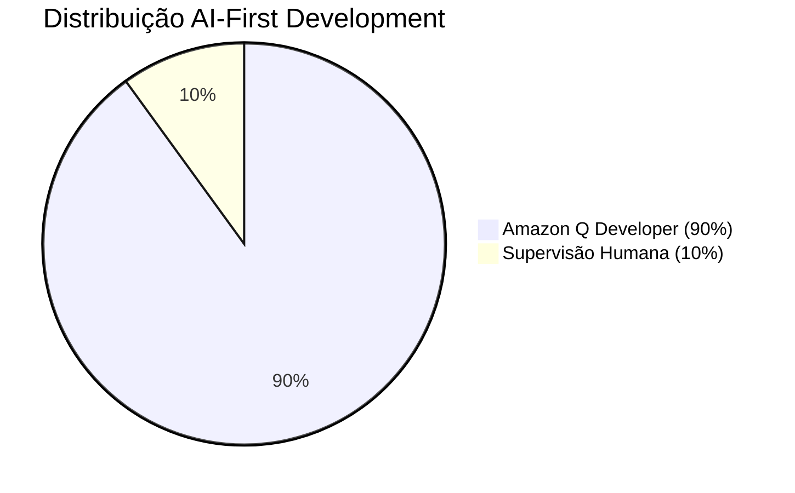

# Template: Estimativa de Tempo AI-First

<div align="center">

**Planejamento** | **Versão**: 1.0 | **Última Atualização**: 15/09/2025

[](https://github.com/datametria/DATAMETRIA-standards)
[](https://aws.amazon.com/q/)
[](https://aws.amazon.com/q/)

[🔗 Template Original](template-ai-first-time-estimation.md) • [🔗 Diretrizes](datametria_std_documentation.md) • [🔗 Exemplos](#-exemplos-práticos)

</div>

---

## 📋 Índice

- [🎯 Visão Geral](#-visão-geral)
- [🤖 Modelo AI-First](#-modelo-ai-first)
- [📊 Fórmulas de Estimativa](#-fórmulas-de-estimativa)
- [📈 Tabelas de Referência](#-tabelas-de-referência)
- [💡 Exemplos Práticos](#-exemplos-práticos)
- [📋 Template de Estimativa](#-template-de-estimativa)

---

## 🎯 Visão Geral

Este template fornece metodologia padronizada para estimativas de tempo em projetos que seguem o modelo **AI-First Development** da DATAMETRIA, onde 90% do desenvolvimento é executado pelo Amazon Q Developer com 10% de supervisão humana.

### Princípios da Estimativa AI-First

- **🤖 90% Execução IA**: Amazon Q Developer realiza implementação
- **👥 10% Supervisão Humana**: Análise crítica e moderação
- **⚡ Aceleração Exponencial**: Redução de 80-95% no tempo
- **📊 Métricas Baseadas em Dados**: Estimativas fundamentadas
- **🔄 Melhoria Contínua**: Refinamento baseado em resultados

---

## 🤖 Modelo AI-First

### Distribuição de Responsabilidades



### Atividades por Categoria

| Categoria | Amazon Q (90%) | Supervisão Humana (10%) | Redução Tempo |
|-----------|----------------|-------------------------|---------------|
| **Desenvolvimento** | Implementação completa | Análise crítica | 90% |
| **Testes** | Geração automática | Validação cenários | 85% |
| ## Documentação | Criação automática | Revisão conteúdo | 95% |
| **Refatoração** | Otimização contínua | Aprovação mudanças | 80% |
| **Deploy** | Automação completa | Monitoramento | 70% |
| **Debugging** | Identificação automática | Validação correções | 75% |

---

## 📊 Fórmulas de Estimativa

### Fórmula Principal AI-First

```
Tempo_AI_First = (Tempo_Tradicional × 0.1) + Tempo_Supervisão_Humana

Onde:
- Tempo_Tradicional: Estimativa método tradicional
- 0.1: Fator de aceleração Amazon Q (90% redução)
- Tempo_Supervisão_Humana: 10% do tempo para análise crítica
```

### Fórmulas por Tipo de Atividade

#### Desenvolvimento de Código

```
Tempo_Código = Tempo_Base × 0.1 × Fator_Complexidade

Fatores de Complexidade:
- Simples (CRUD): 0.8
- Médio (Lógica de negócio): 1.0
- Complexo (Algoritmos): 1.2
- Crítico (Segurança): 1.5
```

#### Testes

```
Tempo_Testes = (Tempo_Código × 0.15) × 0.1

Onde 0.15 = 15% do tempo de código para testes
```

#### Documentação

```
Tempo_Docs = Tempo_Código × 0.05

Onde 0.05 = 5% do tempo de código para documentação
```

### Fatores de Ajuste

| Fator | Multiplicador | Descrição |
|-------|---------------|-----------|
| **Equipe Experiente** | 0.8 | Supervisão mais eficiente |
| **Equipe Nova** | 1.2 | Curva de aprendizado |
| **Projeto Crítico** | 1.3 | Maior supervisão necessária |
| **Tecnologia Nova** | 1.4 | Amazon Q pode ter limitações |
| **Integração Complexa** | 1.2 | Supervisão adicional |

---

## 📈 Tabelas de Referência

### Estimativas por Tipo de Projeto

| Tipo de Projeto | Tradicional | AI-First | Redução | Supervisão |
|-----------------|-------------|----------|---------|------------|
| **API REST Simples** | 80h | 8h | 90% | 8h |
| **Dashboard Web** | 160h | 16h | 90% | 16h |
| **App Mobile Básico** | 480h | 48h | 90% | 48h |
| **Microserviço** | 120h | 12h | 90% | 12h |
| ## Sistema CRUD | 200h | 20h | 90% | 20h |
| **E-commerce Básico** | 800h | 80h | 90% | 80h |
| ## Sistema de Auth | 40h | 4h | 90% | 4h |

### Estimativas por Funcionalidade

| Funcionalidade | Tradicional | AI-First | Supervisão | Total |
|----------------|-------------|----------|------------|-------|
| **Login/Logout** | 8h | 0.8h | 0.8h | 1.6h |
| **CRUD Usuários** | 16h | 1.6h | 1.6h | 3.2h |
| **Dashboard** | 24h | 2.4h | 2.4h | 4.8h |
| **Relatórios** | 32h | 3.2h | 3.2h | 6.4h |
| **Upload Arquivos** | 12h | 1.2h | 1.2h | 2.4h |
| **Notificações** | 20h | 2h | 2h | 4h |
| **API REST** | 40h | 4h | 4h | 8h |

### Estimativas por Tecnologia

| Stack Tecnológico | Fator AI | Supervisão | Observações |
|-------------------|----------|------------|-------------|
| **Flask + Vue.js** | 0.1 | 10% | Totalmente suportado |
| **Python + FastAPI** | 0.1 | 10% | Excelente suporte |
| **React + Node.js** | 0.12 | 12% | Bom suporte |
| **Flutter** | 0.15 | 15% | Suporte crescente |
| **Django** | 0.1 | 10% | Totalmente suportado |
| **AWS Lambda** | 0.08 | 8% | Suporte nativo |
| **Docker** | 0.1 | 10% | Automação completa |

---

## 💡 Exemplos Práticos

### Exemplo 1: Sistema de E-commerce

**Escopo**: Loja online com carrinho, pagamento e admin

#### Estimativa Tradicional

- Frontend (React): 200h
- Backend (Node.js): 150h
- Database Design: 20h
- Testes: 80h
- Deploy: 30h
- Documentação: 40h
- **Total**: 520h

#### Estimativa AI-First

- Amazon Q (90%): 52h
- Supervisão Humana (10%): 52h
- **Total**: 104h
- **Redução**: 80%

### Exemplo 2: API de Microserviços

**Escopo**: 5 microserviços com autenticação JWT

#### Estimativa Tradicional

- Desenvolvimento: 120h
- Testes: 40h
- Documentação: 20h
- CI/CD: 15h
- **Total**: 195h

#### Estimativa AI-First

- Amazon Q (90%): 19.5h
- Supervisão Humana (10%): 19.5h
- **Total**: 39h
- **Redução**: 80%

### Exemplo 3: App Mobile Flutter

**Escopo**: App com login, lista, detalhes e sincronização

#### Estimativa Tradicional

- UI/UX: 80h
- Desenvolvimento: 200h
- Testes: 60h
- Deploy: 20h
- **Total**: 360h

#### Estimativa AI-First

- Amazon Q (85%): 54h (fator 0.15 para Flutter)
- Supervisão Humana (15%): 54h
- **Total**: 108h
- **Redução**: 70%

---

## 📋 Template de Estimativa

### Informações do Projeto

```markdown
## Estimativa AI-First - [Nome do Projeto]

**Data**: [DD/MM/AAAA]
**Responsável**: [Nome]
**Tipo**: [Web/Mobile/API/Sistema]
**Complexidade**: [Simples/Médio/Complexo/Crítico]

### Escopo do Projeto
- [ ] Funcionalidade 1
- [ ] Funcionalidade 2
- [ ] Funcionalidade 3

### Stack Tecnológico
- **Frontend**: [Tecnologia]
- **Backend**: [Tecnologia]
- **Database**: [Tecnologia]
- **Deploy**: [Plataforma]
```

### Cálculo de Estimativa

```markdown
### Estimativa Tradicional

| Atividade | Horas | Observações |
|-----------|-------|-------------|
| Análise | [X]h | |
| Desenvolvimento | [X]h | |
| Testes | [X]h | |
| Documentação | [X]h | |
| Deploy | [X]h | |
| **Total Tradicional** | **[X]h** | |

### Estimativa AI-First

| Componente | Cálculo | Horas |
|------------|---------|-------|
| Amazon Q (90%) | [Total] × 0.1 | [X]h |
| Supervisão Humana (10%) | [Total] × 0.1 | [X]h |
| **Total AI-First** | | **[X]h** |

### Fatores de Ajuste

- [ ] Equipe experiente (-20%)
- [ ] Equipe nova (+20%)
- [ ] Projeto crítico (+30%)
- [ ] Tecnologia nova (+40%)
- [ ] Integração complexa (+20%)

**Fator final**: [X]
**Estimativa ajustada**: [X]h
```

### Cronograma AI-First

```markdown
### Cronograma Proposto

| Fase | Duração | Responsável | Entregáveis |
|------|---------|-------------|-------------|
| **Setup & Análise** | [X] dias | Humano | Requisitos, arquitetura |
| **Desenvolvimento Core** | [X] dias | Amazon Q + Supervisão | Funcionalidades principais |
| **Testes & Validação** | [X] dias | Amazon Q + Supervisão | Testes automatizados |
| **Deploy & Documentação** | [X] dias | Amazon Q + Supervisão | Sistema em produção |
| **Revisão Final** | [X] dias | Humano | Validação completa |

**Total**: [X] dias úteis
```

### Riscos e Mitigações

```markdown
### Análise de Riscos

| Risco | Probabilidade | Impacto | Mitigação |
|-------|---------------|---------|-----------|
| Amazon Q limitações | Baixa | Médio | Supervisão humana ativa |
| Complexidade subestimada | Média | Alto | Buffer de 20% |
| Integração complexa | Média | Médio | Prototipagem prévia |
| Mudança de requisitos | Alta | Alto | Metodologia ágil |

### Premissas

- [ ] Amazon Q Developer disponível 24/7
- [ ] Supervisão humana disponível conforme cronograma
- [ ] Requisitos estáveis durante desenvolvimento
- [ ] Infraestrutura preparada
- [ ] Acesso às ferramentas necessárias
```

### Métricas de Acompanhamento

```markdown
### KPIs do Projeto

| Métrica | Meta | Atual | Status |
|---------|------|-------|--------|
| Tempo Total | [X]h | [X]h | ✅/⚠️/❌ |
| Qualidade Código | >90% | [X]% | ✅/⚠️/❌ |
| Cobertura Testes | >80% | [X]% | ✅/⚠️/❌ |
| Bugs Produção | <5 | [X] | ✅/⚠️/❌ |

### Comparação Final

| Aspecto | Tradicional | AI-First | Melhoria |
|---------|-------------|----------|----------|
| **Tempo Total** | [X]h | [X]h | [X]% |
| **Custo** | R$ [X] | R$ [X] | [X]% |
| **Qualidade** | [X]% | [X]% | [X]% |
| **Produtividade** | [X] | [X] | [X]x |
```

---

## 📈 Calculadora AI-First

### Ferramenta de Cálculo Rápido

```javascript
// Calculadora de Estimativa AI-First
function calcularEstimativaAIFirst(tempoTradicional, complexidade = 1.0, fatoresAjuste = 1.0) {
  const FATOR_AI = 0.1; // 90% redução
  const SUPERVISAO = 0.1; // 10% supervisão

  const tempoAI = tempoTradicional * FATOR_AI * complexidade * fatoresAjuste;
  const tempoSupervisao = tempoTradicional * SUPERVISAO * fatoresAjuste;
  const tempoTotal = tempoAI + tempoSupervisao;
  const reducao = ((tempoTradicional - tempoTotal) / tempoTradicional) * 100;

  return {
    tradicional: tempoTradicional,
    amazonQ: tempoAI,
    supervisao: tempoSupervisao,
    total: tempoTotal,
    reducao: reducao.toFixed(1)
  };
}

// Exemplo de uso
const estimativa = calcularEstimativaAIFirst(160, 1.0, 1.0);
console.log(`Tradicional: ${estimativa.tradicional}h`);
console.log(`AI-First: ${estimativa.total}h`);
console.log(`Redução: ${estimativa.reducao}%`);
```

### Tabela de Conversão Rápida

| Tradicional | AI-First | Redução |
|-------------|----------|----------|
| 8h | 1.6h | 80% |
| 16h | 3.2h | 80% |
| 40h | 8h | 80% |
| 80h | 16h | 80% |
| 160h | 32h | 80% |
| 320h | 64h | 80% |
| 640h | 128h | 80% |

---

## ✅ Checklist de Validação

### Antes da Estimativa

- [ ] Requisitos claramente definidos
- [ ] Stack tecnológico escolhido
- [ ] Complexidade avaliada
- [ ] Fatores de risco identificados
- [ ] Equipe definida e disponível

### Durante o Projeto

- [ ] Amazon Q Developer configurado
- [ ] Supervisão humana ativa
- [ ] Métricas sendo coletadas
- [ ] Cronograma sendo seguido
- [ ] Qualidade sendo monitorada

### Após o Projeto

- [ ] Tempo real vs estimado documentado
- [ ] Lições aprendidas registradas
- [ ] Base de conhecimento atualizada
- [ ] Fatores de ajuste refinados
- [ ] Próximas estimativas melhoradas

---

<div align="center">

**Desenvolvido por**: Equipe DATAMETRIA Planning
**Última Atualização**: 15/09/2025
**Versão**: 1.0.0

---

## Estimativas AI-First precisas! Planejamento acelerado! ⚡

</div>rica | Meta | Atual | Status |
|---------|------|-------|--------|
| **Redução de Tempo** | 80% | - | 🔄 |
| **Qualidade (Bugs)** | <5 | - | 🔄 |
| **Cobertura Testes** | >90% | - | 🔄 |
| **Satisfação Cliente** | >4.5/5 | - | 🔄 |
| **Conformidade Padrões** | 100% | - | 🔄 |

### Acompanhamento Semanal

#### Semana 1

- Amazon Q: [X]h executadas
- Supervisão: [X]h utilizadas
- Progresso: [X]% concluído
- Bloqueios: [Descrição]

#### Semana 2

- Amazon Q: [X]h executadas
- Supervisão: [X]h utilizadas
- Progresso: [X]% concluído
- Bloqueios: [Descrição]

```
---

## 🔗 Referências

### Links Úteis

- [DATAMETRIA Standards](../README.md)
- [Diretrizes de Documentação](datametria_std_documentation.md)
- [Amazon Q Developer](https://aws.amazon.com/q/)
- [Templates de Projeto](template-project-kickoff.md)

### Templates Relacionados

- [Project Kickoff](template-project-kickoff.md)
- [Technical Specification](template-technical-specification.md)
- [MVP Planning](template-mvp-planning.md)
- [Project Status Report](template-project-status-report.md)

---

#### Desenvolvido pela equipe DATAMETRIA
**Última atualização**: 15/09/2025
**Versão**: 1.0
