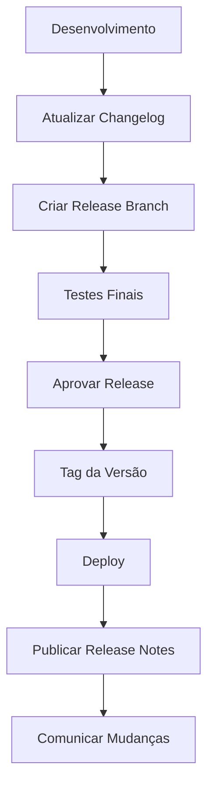

# Changelog - [Nome do Projeto]

<div align="center">

## Histórico de Mudanças do Projeto

[](https://keepachangelog.com/)
[](https://semver.org/)
[](https://github.com/datametria/standards)

[📋 Unreleased](#unreleased) • [🚀 Releases](#xyz---aaaa-mm-dd) • [📖 Guia](#guia-de-versionamento) • [🔗 Referências](#links-de-referência)

</div>

---

Todas as mudanças notáveis neste projeto serão documentadas neste arquivo. O formato é baseado em [Keep a Changelog](https://keepachangelog.com/en/1.0.0/), e este projeto adere ao [Semantic Versioning](https://semver.org/spec/v2.0.0.html).

## [Unreleased]

### Adicionado

- [Funcionalidades em desenvolvimento]

### Alterado

- [Mudanças em funcionalidades existentes]

### Corrigido

- [Correções de bugs]

### Removido

- [Funcionalidades removidas]

### Descontinuado

- [Funcionalidades marcadas para remoção]

### Segurança

- [Correções de vulnerabilidades]

---

## [X.Y.Z] - AAAA-MM-DD

### 🎯 Resumo da Release

**Tipo**: [Major/Minor/Patch] Release
**Tema**: [Tema principal da release]
**Impacto**: [Alto/Médio/Baixo]
**Breaking Changes**: [Sim/Não]

### Adicionado

#### 🚀 Novas Funcionalidades

- **[Nome da Funcionalidade]**: [Descrição detalhada] ([#issue](link))
  - [Detalhe específico 1]
  - [Detalhe específico 2]
- **[Nome da Funcionalidade]**: [Descrição] ([#issue](link))

#### 🔧 Melhorias Técnicas

- **[Categoria]**: [Descrição da melhoria] ([#issue](link))
- **[Categoria]**: [Descrição da melhoria] ([#issue](link))

#### 📚 Documentação

- **[Tipo de Doc]**: [Descrição] ([#issue](link))
- **[Tipo de Doc]**: [Descrição] ([#issue](link))

#### 🧪 Testes

- **[Tipo de Teste]**: [Descrição] ([#issue](link))
- **Cobertura**: Aumentada de [X]% para [Y]%

### Alterado

#### 🔄 Funcionalidades Modificadas

- **[Nome da Funcionalidade]**: [Descrição da mudança] ([#issue](link))
  - **Antes**: [Comportamento anterior]
  - **Agora**: [Novo comportamento]
  - **Migração**: [Instruções se necessário]

#### ⚡ Melhorias de Performance

- **[Componente]**: [Descrição da melhoria] - [X]% mais rápido ([#issue](link))
- **[Componente]**: [Descrição da melhoria] ([#issue](link))

#### 🎨 Interface do Usuário

- **[Componente UI]**: [Descrição da mudança] ([#issue](link))
- **[Componente UI]**: [Descrição da mudança] ([#issue](link))

#### 🔧 Dependências

- **[Nome da Dependência]**: Atualizada de v[X.Y.Z] para v[A.B.C] ([#issue](link))
- **[Nome da Dependência]**: Atualizada de v[X.Y.Z] para v[A.B.C] ([#issue](link))

### Corrigido

#### 🐛 Bugs Críticos

- **[Descrição do Bug]**: [Descrição da correção] ([#issue](link))
  - **Impacto**: [Descrição do impacto]
  - **Ambiente**: [Produção/Homologação/Desenvolvimento]

#### 🐛 Bugs Menores

- **[Descrição do Bug]**: [Descrição da correção] ([#issue](link))
- **[Descrição do Bug]**: [Descrição da correção] ([#issue](link))

#### 🎨 Correções de UX/UI

- **[Problema de UX]**: [Descrição da correção] ([#issue](link))
- **[Problema de UI]**: [Descrição da correção] ([#issue](link))

### Removido

#### 🗑️ Funcionalidades Descontinuadas

- **[Nome da Funcionalidade]**: [Motivo da remoção] ([#issue](link))
  - **Alternativa**: [Funcionalidade substituta, se houver]
  - **Migração**: [Instruções de migração]

#### 🗑️ APIs Descontinuadas

- **[Endpoint/Método]**: [Motivo da remoção] ([#issue](link))
  - **Substituído por**: [Nova API, se houver]
  - **Data de Descontinuação**: [Data]

### Descontinuado

#### ⚠️ Funcionalidades Marcadas para Remoção

- **[Nome da Funcionalidade]**: Será removida na versão [X.Y.Z] ([#issue](link))
  - **Motivo**: [Justificativa]
  - **Alternativa**: [Funcionalidade substituta]
  - **Prazo**: [Data limite]

### Segurança

#### 🔒 Vulnerabilidades Corrigidas

- **[CVE-ID ou Descrição]**: [Descrição da correção] - Severidade: [Crítica/Alta/Média/Baixa] ([#issue](link))
  - **CVSS Score**: [Score se aplicável]
  - **Impacto**: [Descrição do impacto]
  - **Créditos**: [Pessoa/organização que reportou]

#### 🔒 Melhorias de Segurança

- **[Área de Segurança]**: [Descrição da melhoria] ([#issue](link))
- **[Área de Segurança]**: [Descrição da melhoria] ([#issue](link))

### 📊 Métricas da Release

- **Commits**: [X] commits
- **Pull Requests**: [X] PRs merged
- **Issues Fechadas**: [X] issues
- **Contribuidores**: [X] pessoas
- **Linhas de Código**: +[X]/-[Y] linhas
- **Tempo de Desenvolvimento**: [X] semanas
- **Cobertura de Testes**: [X]% (+/-[Y]%)

### 🔗 Links Importantes

- [Release Notes Completas](link-para-release-notes)
- [Guia de Migração](link-para-guia-migracao)
- [Documentação Atualizada](link-para-docs)
- [Issues da Release](link-para-milestone)

---

## [X.Y.Z-1] - AAAA-MM-DD

### 🎯 Resumo da Release

**Tipo**: [Major/Minor/Patch] Release
**Tema**: [Tema principal da release]

### Adicionado

- **[Funcionalidade]**: [Descrição] ([#issue](link))

### Alterado

- **[Funcionalidade]**: [Descrição da mudança] ([#issue](link))

### Corrigido

- **[Bug]**: [Descrição da correção] ([#issue](link))

### Removido

- **[Funcionalidade]**: [Motivo da remoção] ([#issue](link))

### Segurança

- **[Vulnerabilidade]**: [Descrição da correção] ([#issue](link))

---

## Guia de Versionamento

### Semantic Versioning (SemVer)

Este projeto segue o padrão [Semantic Versioning](https://semver.org/):

- **MAJOR** (X.0.0): Mudanças incompatíveis na API
- **MINOR** (0.X.0): Funcionalidades adicionadas de forma compatível
- **PATCH** (0.0.X): Correções de bugs compatíveis

### Tipos de Release

#### Major Release (X.0.0)

- Breaking changes na API
- Remoção de funcionalidades descontinuadas
- Mudanças arquiteturais significativas
- Requer migração manual

#### Minor Release (0.X.0)

- Novas funcionalidades compatíveis
- Melhorias significativas
- Novas APIs
- Funcionalidades marcadas como descontinuadas

#### Patch Release (0.0.X)

- Correções de bugs
- Melhorias de performance
- Correções de segurança
- Atualizações de documentação

### Pre-release Versions

- **Alpha** (X.Y.Z-alpha.N): Versão inicial, instável
- **Beta** (X.Y.Z-beta.N): Funcionalidades completas, em teste
- **RC** (X.Y.Z-rc.N): Release candidate, quase estável

---

## Categorias de Mudanças

### 🎯 Adicionado

Para novas funcionalidades:

- Novas APIs ou endpoints
- Novas funcionalidades de usuário
- Novos componentes ou módulos
- Novas integrações
- Nova documentação

### 🔄 Alterado

Para mudanças em funcionalidades existentes:

- Modificações em APIs existentes (compatíveis)
- Melhorias em funcionalidades existentes
- Mudanças na interface do usuário
- Atualizações de dependências
- Refatorações internas

### 🐛 Corrigido

Para correções de bugs:

- Correções de funcionalidades quebradas
- Correções de problemas de performance
- Correções de problemas de UI/UX
- Correções de problemas de compatibilidade

### 🗑️ Removido

Para funcionalidades removidas:

- APIs ou endpoints removidos
- Funcionalidades descontinuadas
- Dependências removidas
- Arquivos ou módulos removidos

### ⚠️ Descontinuado

Para funcionalidades que serão removidas:

- Funcionalidades marcadas para remoção futura
- APIs que serão descontinuadas
- Avisos de breaking changes futuros

### 🔒 Segurança

Para correções relacionadas à segurança:

- Correções de vulnerabilidades
- Melhorias de segurança
- Atualizações de dependências por segurança

---

## Processo de Manutenção

### Responsabilidades

- **Maintainer**: Responsável por manter o changelog atualizado
- **Developers**: Devem incluir entradas no changelog em seus PRs
- **Release Manager**: Revisa e finaliza o changelog antes da release

### Workflow

1. **Durante Desenvolvimento**: Adicionar entradas na seção [Unreleased]
2. **Antes da Release**: Mover entradas para nova versão com data
3. **Após Release**: Criar nova seção [Unreleased] vazia
4. **Review**: Validar formato e completude das informações

### Padrões de Escrita

- Use linguagem clara e objetiva
- Inclua links para issues/PRs quando possível
- Agrupe mudanças relacionadas
- Destaque breaking changes
- Inclua instruções de migração quando necessário

### Template de Entrada

```markdown
- **[Componente/Funcionalidade]**: [Descrição clara da mudança] ([#issue](link))
  - [Detalhe adicional se necessário]
  - **Breaking Change**: [Sim/Não]
  - **Migração**: [Instruções se necessário]
```

---

## Links de Referência

- [Keep a Changelog](https://keepachangelog.com/en/1.0.0/)
- [Semantic Versioning](https://semver.org/spec/v2.0.0.html)
- [Conventional Commits](https://www.conventionalcommits.org/)
- [GitHub Releases](https://docs.github.com/en/repositories/releasing-projects-on-github)

---

---

## 📈 Fluxo de Release

### Processo de Release



### Cronograma de Releases

| Tipo | Frequência | Exemplo | Descrição |
|------|------------|---------|-------------|
| **Patch** | Conforme necessário | 1.0.1 | Correções urgentes |
| **Minor** | Quinzenal/Mensal | 1.1.0 | Novas funcionalidades |
| **Major** | Trimestral/Semestral | 2.0.0 | Breaking changes |

---

## 📊 Exemplo Prático

### Release 1.2.0 - Sistema de Autenticação

```markdown
## [1.2.0] - 2025-01-15

### 🎯 Resumo da Release

**Tipo**: Minor Release
**Tema**: Sistema de Autenticação Avançado
**Impacto**: Médio
**Breaking Changes**: Não

### Adicionado

#### 🚀 Novas Funcionalidades

- **Autenticação 2FA**: Implementado sistema de autenticação de dois fatores ([#123](https://github.com/projeto/issues/123))
  - Suporte a Google Authenticator
  - Suporte a SMS
  - Backup codes para recuperação
- **Login Social**: Adicionado login com Google e GitHub ([#124](https://github.com/projeto/issues/124))

#### 🔧 Melhorias Técnicas

- **API**: Novos endpoints para gerenciamento de sessões ([#125](https://github.com/projeto/issues/125))
- **Database**: Índices otimizados para consultas de usuários ([#126](https://github.com/projeto/issues/126))

### Alterado

#### 🔄 Funcionalidades Modificadas

- **Login Form**: Interface redesenhada para melhor UX ([#127](https://github.com/projeto/issues/127))
  - **Antes**: Formulário simples com email/senha
  - **Agora**: Formulário com opções de 2FA e login social
  - **Migração**: Automática, sem ação necessária

#### ⚡ Melhorias de Performance

- **Autenticação**: Tempo de login reduzido em 40% ([#128](https://github.com/projeto/issues/128))
- **Cache**: Implementado cache de sessões Redis ([#129](https://github.com/projeto/issues/129))

### Corrigido

#### 🐛 Bugs Críticos

- **Session Timeout**: Corrigido problema de logout automático ([#130](https://github.com/projeto/issues/130))
  - **Impacto**: Usuários eram deslogados prematuramente
  - **Ambiente**: Produção

#### 🐛 Bugs Menores

- **Password Reset**: Corrigido link de reset em emails ([#131](https://github.com/projeto/issues/131))
- **Validation**: Melhorada validação de email ([#132](https://github.com/projeto/issues/132))

### Segurança

#### 🔒 Vulnerabilidades Corrigidas

- **CVE-2024-1234**: Corrigida vulnerabilidade de injeção SQL - Severidade: Alta ([#133](https://github.com/projeto/issues/133))
  - **CVSS Score**: 7.5
  - **Impacto**: Acesso não autorizado a dados de usuários
  - **Créditos**: João Silva (Security Researcher)

### 📊 Métricas da Release

- **Commits**: 45 commits
- **Pull Requests**: 12 PRs merged
- **Issues Fechadas**: 15 issues
- **Contribuidores**: 5 pessoas
- **Linhas de Código**: +2,340/-890 linhas
- **Tempo de Desenvolvimento**: 3 semanas
- **Cobertura de Testes**: 87% (+5%)
```

---

## ✅ Checklist de Release

### Antes da Release

- [ ] Changelog atualizado com todas as mudanças
- [ ] Versão atualizada em package.json/setup.py
- [ ] Testes passando em todos os ambientes
- [ ] Documentação atualizada
- [ ] Breaking changes documentados
- [ ] Guia de migração criado (se necessário)

### Durante a Release

- [ ] Tag criada no Git
- [ ] Release notes publicadas
- [ ] Deploy realizado
- [ ] Monitoramento ativo
- [ ] Rollback plan preparado

### Após a Release

- [ ] Métricas coletadas
- [ ] Feedback dos usuários monitorado
- [ ] Issues pós-release documentadas
- [ ] Lições aprendidas registradas
- [ ] Próxima release planejada

---

<div align="center">

**Desenvolvido por**: Equipe DATAMETRIA
**Última Atualização**: 15/09/2025
**Versão**: 1.0.0
**Formato**: Keep a Changelog v1.0.0
**Versionamento**: Semantic Versioning v2.0.0

---

## Changelog estruturado! Histórico organizado! 📋

</div>
