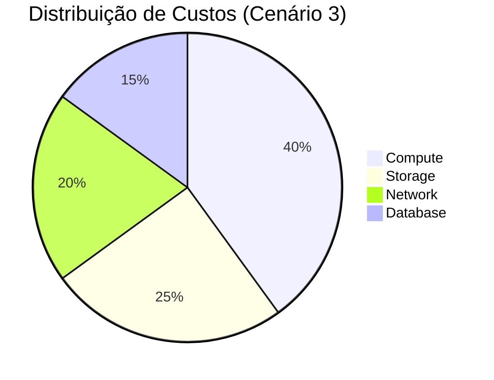
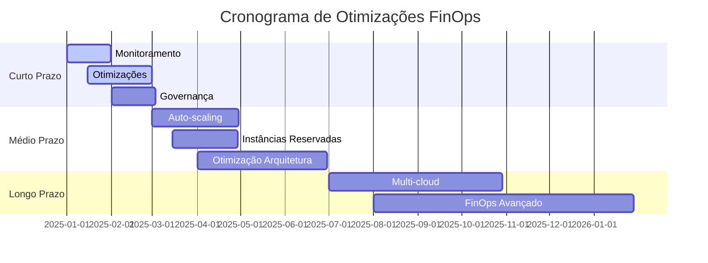
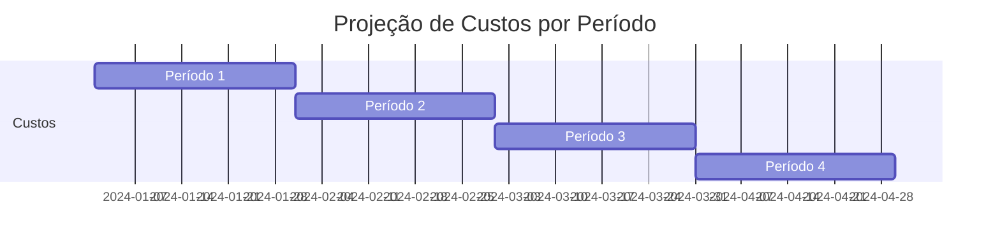

# Template de Estimativa de Custos de Infraestrutura Cloud

## Cloud Infrastructure Cost Estimation Template

[💰 Custos](#-informações-do-projeto) • [📊 Cenários](#-premissas-e-cenários-de-uso) •
[📈 Análise](#-análise-de-custos-por-usuário) • [🎯 Otimizações](#-otimizações-de-custo-recomendadas) •
[📋 Recomendações](#-conclusões-e-recomendações)

---

## 📋 Índice

- [📝 Informações do Projeto](#-informações-do-projeto)
- [🎯 Premissas e Cenários](#-premissas-e-cenários-de-uso)
- [💰 Detalhamento de Custos](#-detalhamento-de-custos-por-serviço)
- [📊 Resumo Consolidado](#-resumo-de-custos-mensais)
- [📈 Análise Financeira](#-análise-de-custos-por-usuário)
- [🎯 Otimizações de Custo](#-otimizações-de-custo-recomendadas)
- [📅 Projeção Temporal](#-projeção-de-custos-temporal)
- [📋 Conclusões e Recomendações](#-conclusões-e-recomendações)

---

## 📝 Informações do Projeto

### Dados Básicos

| Campo | Valor |
|-------|-------|
| **Nome do Projeto** | [Nome do Projeto] |
| **Plataforma Cloud** | [AWS/GCP/Azure/Multi-Cloud] |
| **Período de Análise** | [X semanas/meses] |
| **Moeda** | [USD/BRL/EUR] |
| **Data da Estimativa** | [DD/MM/AAAA] |
| **Responsável** | [Nome] |
| **Aprovador** | [Nome] |

### Contexto do Projeto

#### Descrição do projeto

[Descreva brevemente o projeto e sua arquitetura]

#### Objetivos da estimativa

[Explique o propósito desta análise de custos]

#### Premissas de negócio

- [Premissa 1 sobre o modelo de negócio]
- [Premissa 2 sobre crescimento esperado]
- [Premissa 3 sobre padrões de uso]

---

## 🎯 Premissas e Cenários de Uso

### Cenários Analisados

| Cenário | Usuários/Carga | Descrição | Período |
|---------|----------------|-----------|---------|
| **Cenário 1** | [X] usuários | [Descrição do cenário inicial] | [Período] |
| **Cenário 2** | [Y] usuários | [Descrição do crescimento] | [Período] |
| **Cenário 3** | [Z] usuários | [Descrição da escala média] | [Período] |
| **Cenário 4** | [W] usuários | [Descrição da escala alta] | [Período] |

### Premissas de Uso

| Métrica | Valor | Justificativa |
|---------|-------|---------------|
| **[Métrica 1]** | [Valor] | [Justificativa técnica] |
| **[Métrica 2]** | [Valor] | [Justificativa de negócio] |
| **[Métrica 3]** | [Valor] | [Justificativa de uso] |
| **[Métrica 4]** | [Valor] | [Justificativa de performance] |

### Padrões de Tráfego

| Horário | Carga (%) | Descrição |
|---------|-----------|----------|
| **00h-06h** | 20% | Baixa atividade noturna |
| **06h-12h** | 30% | Início das atividades |
| **12h-18h** | 80% | Pico de uso diário |
| **18h-24h** | 100% | Horário de maior demanda |
| **24h-00h** | 40% | Redução gradual |

---

## 💰 Detalhamento de Custos por Serviço

### Serviço 1: [Nome do Serviço]

**Descrição:** [Breve descrição do serviço e seu uso no projeto]

| Cenário | Configuração | Uso Estimado | Custo Mensal |
|---------|-------------|-------------|--------------|
| **Cenário 1** | [Configuração básica] | [Uso baixo] | **$[X.XX]** |
| **Cenário 2** | [Configuração média] | [Uso médio] | **$[X.XX]** |
| **Cenário 3** | [Configuração alta] | [Uso alto] | **$[X.XX]** |
| **Cenário 4** | [Configuração premium] | [Uso intensivo] | **$[X.XX]** |

*Preços: [Detalhamento da precificação do serviço]*

### Serviço 2: [Nome do Serviço]

**Descrição:** [Breve descrição do serviço e seu uso no projeto]

| Cenário | [Métrica 1] | [Métrica 2] | Custo Mensal |
|---------|-------------|-------------|--------------|
| **Cenário 1** | [Valor] | [Valor] | **$[X.XX]** |
| **Cenário 2** | [Valor] | [Valor] | **$[X.XX]** |
| **Cenário 3** | [Valor] | [Valor] | **$[X.XX]** |
| **Cenário 4** | [Valor] | [Valor] | **$[X.XX]** |

*Preços: [Detalhamento da precificação do serviço]*

### Serviço 3: [Nome do Serviço]

**Descrição:** [Breve descrição do serviço e seu uso no projeto]

| Cenário | [Métrica 1] | [Métrica 2] | Custo Mensal |
|---------|-------------|-------------|--------------|
| **Cenário 1** | [Valor] | [Valor] | **$[X.XX]** |
| **Cenário 2** | [Valor] | [Valor] | **$[X.XX]** |
| **Cenário 3** | [Valor] | [Valor] | **$[X.XX]** |
| **Cenário 4** | [Valor] | [Valor] | **$[X.XX]** |

*Preços: [Detalhamento da precificação do serviço]*

### Serviços Gratuitos

| Serviço | Limite Gratuito | Status |
|---------|-----------------|--------|
| **[Serviço Gratuito 1]** | [Limite] | **Gratuito** |
| **[Serviço Gratuito 2]** | [Limite] | **Gratuito** |
| **[Serviço Gratuito 3]** | [Limite] | **Gratuito** |

---

## 📊 Resumo de Custos Mensais

### Tabela Consolidada

| Serviço | Cenário 1 | Cenário 2 | Cenário 3 | Cenário 4 |
|---------|-----------|-----------|-----------|-----------|
| **[Serviço 1]** | $[X.XX] | $[X.XX] | $[X.XX] | $[X.XX] |
| **[Serviço 2]** | $[X.XX] | $[X.XX] | $[X.XX] | $[X.XX] |
| **[Serviço 3]** | $[X.XX] | $[X.XX] | $[X.XX] | $[X.XX] |
| **[Serviço 4]** | $[X.XX] | $[X.XX] | $[X.XX] | $[X.XX] |
| **[Serviços Gratuitos]** | $0.00 | $0.00 | $0.00 | $0.00 |
| **TOTAL MENSAL** | **$[XX.XX]** | **$[XX.XX]** | **$[XX.XX]** | **$[XX.XX]** |

### Evolução de Custos por Cenário

| Cenário | Custo Mensal (USD) | Crescimento | Observações |
|----------|-------------------|-------------|---------------|
| **Cenário 1** | $10 | Base | Configuração mínima |
| **Cenário 2** | $50 | +400% | Crescimento inicial |
| **Cenário 3** | $150 | +200% | Escala média |
| **Cenário 4** | $400 | +167% | Escala alta |

### Distribuição de Custos por Categoria

---

## 📈 Análise de Custos por Usuário

### Custo por Usuário/Transação

| Cenário | Usuários/Carga | Custo Total | Custo por Unidade |
|---------|----------------|-------------|-------------------|
| **Cenário 1** | [X] | $[XX.XX] | **$[X.XXX]** |
| **Cenário 2** | [Y] | $[XX.XX] | **$[X.XXX]** |
| **Cenário 3** | [Z] | $[XX.XX] | **$[X.XXX]** |
| **Cenário 4** | [W] | $[XX.XX] | **$[X.XXX]** |

### Análise de Rentabilidade

#### Modelo de Receita:

- **Preço por [unidade]**: $[X.XX]
- **Taxa de conversão**: [X]%
- **Receita por usuário (ARPU)**: $[X.XX]

#### Análise de Break-Even:

| Cenário | Receita Estimada | Custo Infraestrutura | Margem Líquida | Break-Even |
|---------|------------------|---------------------|----------------|------------|
| **Cenário 1** | $[XXX.XX] | $[XX.XX] | **[XX]%** | [X] usuários |
| **Cenário 2** | $[XXX.XX] | $[XX.XX] | **[XX]%** | [X] usuários |
| **Cenário 3** | $[XXX.XX] | $[XX.XX] | **[XX]%** | [X] usuários |
| **Cenário 4** | $[XXX.XX] | $[XX.XX] | **[XX]%** | [X] usuários |

### Análise de Margem por Cenário

| Cenário | Margem (%) | Tendência | Status |
|----------|------------|-----------|--------|
| **Cenário 1** | 85% | → | Margem alta |
| **Cenário 2** | 87% | ↑ | Melhoria |
| **Cenário 3** | 88% | ↑ | Otimização |
| **Cenário 4** | 89% | ↑ | Economia de escala |

---

## 🎯 Otimizações de Custo Recomendadas

### Otimizações Imediatas

| Otimização | Economia Estimada | Complexidade | Implementação |
|------------|-------------------|--------------|---------------|
| **[Otimização 1]** | [X]% | Baixa | [Descrição da implementação] |
| **[Otimização 2]** | [X]% | Média | [Descrição da implementação] |
| **[Otimização 3]** | [X]% | Alta | [Descrição da implementação] |

### Otimizações de Médio Prazo

| Otimização | Economia Estimada | ROI | Prazo |
|------------|-------------------|-----|-------|
| **[Otimização 1]** | $[XX]/mês | [X] meses | [X] semanas |
| **[Otimização 2]** | $[XX]/mês | [X] meses | [X] semanas |
| **[Otimização 3]** | $[XX]/mês | [X] meses | [X] semanas |

### Estratégias de Longo Prazo

| Estratégia | Impacto | Investimento | Timeline |
|------------|---------|--------------|----------|
| **[Estratégia 1]** | [Descrição do impacto] | $[XXX] | [X] meses |
| **[Estratégia 2]** | [Descrição do impacto] | $[XXX] | [X] meses |
| **[Estratégia 3]** | [Descrição do impacto] | $[XXX] | [X] meses |

### Alertas de Custo Recomendados

| Métrica | Limite de Alerta | Ação Recomendada |
|---------|------------------|------------------|
| **Custo Mensal Total** | $[XXX] | [Ação específica] |
| **[Métrica Específica]** | [Limite] | [Ação específica] |
| **[Métrica de Performance]** | [Limite] | [Ação específica] |

---

## 📅 Projeção de Custos Temporal

### Cronograma de Custos

| Período | Cenário Esperado | Custo Estimado | Custo Acumulado |
|---------|------------------|----------------|-----------------|
| **[Período 1]** | [Cenário] | $[XX.XX] | $[XX.XX] |
| **[Período 2]** | [Cenário] | $[XX.XX] | $[XX.XX] |
| **[Período 3]** | [Cenário] | $[XX.XX] | $[XX.XX] |
| **[Período 4]** | [Cenário] | $[XX.XX] | $[XX.XX] |
| **TOTAL** | - | - | **$[XXX.XX]** |

### Projeção de Crescimento Temporal

| Período | Custo Mensal (USD) | Crescimento | Usuários Estimados |
|---------|-------------------|-------------|---------------------|
| **Mês 1** | $50 | Base | [X] usuários |
| **Mês 2** | $75 | +50% | [Y] usuários |
| **Mês 3** | $100 | +33% | [Z] usuários |
| **Mês 4** | $150 | +50% | [W] usuários |
| **Mês 5** | $200 | +33% | [V] usuários |
| **Mês 6** | $250 | +25% | [U] usuários |

### Fatores de Risco

| Risco | Probabilidade | Impacto | Mitigação |
|-------|---------------|---------|-------------|
| **Crescimento acelerado** | Média | Alto | Monitoramento contínuo e alertas |
| **Mudança de preços** | Baixa | Médio | Contratos de longo prazo |
| **Uso ineficiente** | Alta | Médio | Otimizações automatizadas |
| **Picos de tráfego** | Média | Alto | Auto-scaling configurado |

---

## 📋 Conclusões e Recomendações

### Resumo Executivo

#### Principais Descobertas

- **Custo inicial**: $[XX.XX]/mês para [X] usuários
- **Escalabilidade**: Custo cresce [X]% por cenário
- **Break-even**: [X] usuários para viabilidade
- **Margem projetada**: [XX]% no cenário alvo

#### Viabilidade Financeira

| Métrica | Valor | Status |
|---------|-------|--------|
| **ROI Projetado** | [X]% | ✅ Viável |
| **Payback Period** | [X] meses | ✅ Aceitável |
| **Margem Líquida** | [XX]% | ✅ Saudável |
| **Custo por Usuário** | $[X.XX] | ✅ Competitivo |

### Recomendações Estratégicas

#### Curto Prazo (1-3 meses)

1. **Implementar monitoramento de custos**
   - Configurar alertas em $[XXX]/mês
   - Dashboard de acompanhamento diário
   - Relatórios semanais automatizados

2. **Otimizações imediatas**
   - [Otimização específica 1]
   - [Otimização específica 2]
   - Economia estimada: $[XX]/mês

3. **Estabelecer governança FinOps**
   - Definir responsabilidades
   - Processo de aprovação para novos recursos
   - Review mensal de custos

#### Médio Prazo (3-6 meses)

1. **Implementar auto-scaling inteligente**
   - Economia estimada: [XX]%
   - Melhoria na eficiência operacional

2. **Migrar para instâncias reservadas**
   - Economia de até [XX]% em compute
   - Compromisso de [X] anos

3. **Otimizar arquitetura**
   - Implementar cache distribuído
   - Otimizar queries de banco
   - Comprimir dados de armazenamento

#### Longo Prazo (6+ meses)

1. **Avaliar multi-cloud**
   - Diversificação de risco
   - Otimização de custos por workload

2. **Implementar FinOps avançado**
   - Machine learning para predição
   - Otimização automatizada
   - Chargeback por departamento

### Plano de Ação

#### Cronograma de Implementação

#### Responsabilidades

| Atividade | Responsável | Prazo | Status |
|-----------|-------------|-------|--------|
| **Monitoramento** | [Nome/Equipe] | [Data] | 🔄 Planejado |
| **Otimizações** | [Nome/Equipe] | [Data] | 🔄 Planejado |
| **Governança** | [Nome/Equipe] | [Data] | 🔄 Planejado |
| **Auto-scaling** | [Nome/Equipe] | [Data] | 🔄 Planejado |

### Métricas de Sucesso

| KPI | Meta | Método de Medição |
|-----|------|---------------------|
| **Redução de Custos** | [XX]% | Comparação mensal |
| **Eficiência Operacional** | [XX]% | Métricas de utilização |
| **Tempo de Resposta** | <[X]ms | Monitoramento APM |
| **Disponibilidade** | >[XX]% | Uptime monitoring |

### Próximos Passos

1. **Aprovação do orçamento**: [Data]
2. **Início da implementação**: [Data]
3. **Primeira revisão**: [Data]
4. **Avaliação de resultados**: [Data]

---

## 📄 Anexos

### Anexo A: Detalhamento Técnico

[Link para documentação técnica detalhada]

### Anexo B: Planilha de Cálculos

[Link para planilha com cálculos detalhados]

### Anexo C: Comparação de Provedores

[Link para análise comparativa de provedores cloud]

### Anexo D: Referências de Preços

[Links para páginas oficiais de preços dos provedores]

---

**Desenvolvido por**: Equipe DATAMETRIA FinOps
**Última Atualização**: 15/09/2025
**Versão**: 1.0.0

---

## Estimativa de custos cloud completa! FinOps implementado! 💰

 Orçamento Recomendado

| Categoria | Valor | Percentual | Justificativa |
|-----------|-------|------------|---------------|
| **Custos Operacionais** | $[XXX.XX] | [XX]% | [Justificativa] |
| **Buffer de Segurança** | $[XX.XX] | [XX]% | [Justificativa] |
| **Desenvolvimento/Testes** | $[XX.XX] | [XX]% | [Justificativa] |
| **Contingência** | $[XX.XX] | [XX]% | [Justificativa] |
| **ORÇAMENTO TOTAL** | **$[XXX.XX]** | 100% | Orçamento conservador |

### Projeção de Crescimento

---

## 🔍 Análise de Sensibilidade

### Variação de Parâmetros

| Parâmetro | Variação | Impacto no Custo | Cenário Crítico |
|-----------|----------|------------------|-----------------|
| **[Parâmetro 1]** | ±[X]% | ±$[XX.XX] | [Descrição] |
| **[Parâmetro 2]** | ±[X]% | ±$[XX.XX] | [Descrição] |
| **[Parâmetro 3]** | ±[X]% | ±$[XX.XX] | [Descrição] |

### Cenários de Risco

#### Cenário Otimista

- **Premissas**: [Lista de premissas otimistas]
- **Custo Estimado**: $[XX.XX]/mês
- **Probabilidade**: [XX]%

#### Cenário Pessimista

- **Premissas**: [Lista de premissas pessimistas]
- **Custo Estimado**: $[XX.XX]/mês
- **Probabilidade**: [XX]%

#### Cenário Realista

- **Premissas**: [Lista de premissas realistas]
- **Custo Estimado**: $[XX.XX]/mês
- **Probabilidade**: [XX]%

---

## 📋 Conclusões e Recomendações

### ✅ Pontos Positivos

- **[Ponto Positivo 1]**: [Descrição e impacto]
- **[Ponto Positivo 2]**: [Descrição e impacto]
- **[Ponto Positivo 3]**: [Descrição e impacto]

### ⚠️ Pontos de Atenção

- **[Ponto de Atenção 1]**: [Descrição e risco]
- **[Ponto de Atenção 2]**: [Descrição e risco]
- **[Ponto de Atenção 3]**: [Descrição e risco]

### 🎯 Recomendações Estratégicas

#### Curto Prazo (1-3 meses)

1. **[Recomendação 1]**: [Descrição e justificativa]
2. **[Recomendação 2]**: [Descrição e justificativa]
3. **[Recomendação 3]**: [Descrição e justificativa]

#### Médio Prazo (3-12 meses)

1. **[Recomendação 1]**: [Descrição e justificativa]
2. **[Recomendação 2]**: [Descrição e justificativa]
3. **[Recomendação 3]**: [Descrição e justificativa]

#### Longo Prazo (12+ meses)

1. **[Recomendação 1]**: [Descrição e justificativa]
2. **[Recomendação 2]**: [Descrição e justificativa]
3. **[Recomendação 3]**: [Descrição e justificativa]

### 💡 Próximos Passos

- [ ] **Implementar otimizações imediatas**
- [ ] **Configurar alertas de custo**
- [ ] **Revisar estimativas mensalmente**
- [ ] **Monitorar métricas de uso**
- [ ] **Avaliar alternativas de arquitetura**

---

## 📚 Anexos

### Documentos de Referência

- [Link para calculadora de custos da plataforma]
- [Link para documentação de preços]
- [Link para benchmarks de mercado]
- [Link para análise de concorrentes]

### Templates Relacionados

- [Template de MVP Planning](template-mvp-planning.md)
- [Template de Technical Specification](template-technical-specification.md)
- [Template de Deployment Guide](template-deployment-guide.md)
- [Template de Project Status Report](template-project-status-report.md)

### Ferramentas Utilizadas

- **[Ferramenta 1]**: [Descrição e uso]
- **[Ferramenta 2]**: [Descrição e uso]
- **[Ferramenta 3]**: [Descrição e uso]

---

**Preparado por**: Marcelo Cunha, CEO DATAMETRIA - 13/09/2025
**Revisado por**: Vander Loto, CTO DATAMETRIA - 13/09/2025
**Aprovado por**: Marcelo Cunha, CEO DATAMETRIA - 13/09/2025

---

## DATAMETRIA Standards - Cloud Infrastructure Cost Estimation Template v1.0

