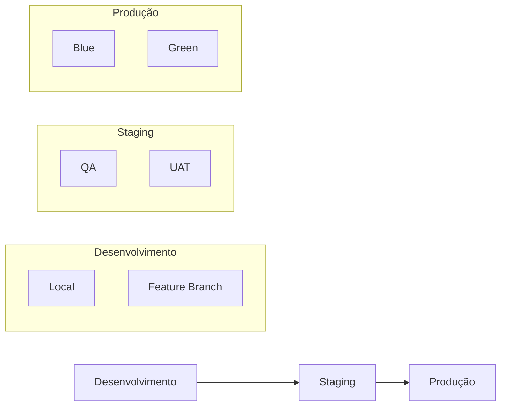
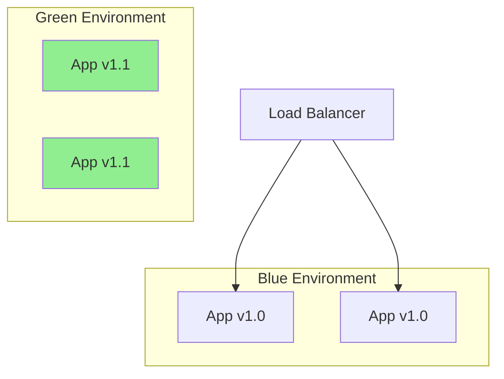

# Guia de Deployment - [Nome do Projeto]

<div align="center">

**Versão**: [X.Y.Z] | **Última Atualização**: [DD/MM/AAAA]

[](https://github.com/datametria/standards)
[](https://github.com/datametria/standards)
[](https://github.com/datametria/standards)
[](https://github.com/datametria/standards)

[🎯 Visão Geral](#-visão-geral) • [📝 Pré-requisitos](#-pré-requisitos) • [🌍 Ambientes](#-ambientes) • [🚀 Deploy](#-deploy-local)

</div>

---

## 📋 Índice

- [🎯 Visão Geral](#-visão-geral)
- [📝 Pré-requisitos](#-pré-requisitos)
- [🌍 Ambientes](#-ambientes)
- [🚀 Estratégias de Deploy](#-estratégias-de-deploy)
- [⚙️ Configuração](#️-configuração)
- [💻 Deploy Local](#-deploy-local)
- [📋 Deploy em Staging](#-deploy-em-staging)
- [🏭 Deploy em Produção](#-deploy-em-produção)
- [☁️ Deploy em Nuvem](#️-deploy-em-nuvem)
- [📊 Monitoramento](#-monitoramento)
- [💾 Backup e Recuperação](#-backup-e-recuperação)
- [🔧 Troubleshooting](#-troubleshooting)
- [✅ Checklist](#-checklist)

---

## 🎯 Visão Geral

### Filosofia de Deployment

Este guia segue as melhores práticas de deployment moderno, priorizando:

- **🔄 Automação**: Processos automatizados para reduzir erros humanos
- **🔒 Segurança**: Práticas de segurança em todas as etapas
- **📊 Observabilidade**: Monitoramento e logging abrangentes
- **⚡ Performance**: Otimização para alta disponibilidade
- **🔧 Consistência**: Ambientes padronizados e reproduzíveis

### Estratégias Suportadas

| Estratégia | Descrição | Uso Recomendado |
|------------|-----------|-----------------|
| **Blue-Green** | Dois ambientes idênticos, troca instantânea | Produção crítica |
| **Rolling** | Atualização gradual de instâncias | Aplicações stateless |
| **Canary** | Deploy gradual com monitoramento | Funcionalidades experimentais |
| **Recreate** | Para e recria todas as instâncias | Desenvolvimento/Staging |

---

## 📋 Pré-requisitos

### Requisitos do Sistema

#### Mínimos

- **CPU**: [X] cores
- **RAM**: [X] GB
- **Disco**: [X] GB disponível
- **Rede**: Conexão estável com internet

#### Recomendados

- **CPU**: [X] cores
- **RAM**: [X] GB
- **Disco**: [X] GB SSD
- **Rede**: [X] Mbps

### Software Necessário

#### Essenciais

- **[Runtime]**: [Versão] ou superior
- **[Database]**: [Versão] ou superior
- **[Web Server]**: [Versão] ou superior

#### Opcionais

- **Docker**: [Versão] - Para containerização
- **Kubernetes**: [Versão] - Para orquestração
- **[Monitoring Tool]**: Para observabilidade

### Verificação de Pré-requisitos

```bash
#!/bin/bash
# check-prerequisites.sh

echo "🔍 Verificando pré-requisitos..."

# Verificar runtime
if command -v [runtime] &> /dev/null; then
    echo "✅ [Runtime]: $(runtime --version)"
else
    echo "❌ [Runtime] não encontrado"
    exit 1
fi

# Verificar banco de dados
if command -v [database] &> /dev/null; then
    echo "✅ [Database]: $(database --version)"
else
    echo "❌ [Database] não encontrado"
    exit 1
fi

# Verificar recursos do sistema
echo "💾 RAM disponível: $(free -h | awk '/^Mem:/ {print $7}')"
echo "💿 Espaço em disco: $(df -h / | awk 'NR==2 {print $4}')"

echo "✅ Verificação concluída!"
```

---

## 🌍 Ambientes

### Estrutura de Ambientes



### Configuração por Ambiente

| Ambiente | URL | Banco | Recursos | Propósito |
|----------|-----|-------|----------|-----------|
| **Local** | localhost:[porta] | SQLite/Local | Mínimo | Desenvolvimento |
| **Staging** | staging.[dominio] | [DB] Staging | Médio | Testes |
| **Produção** | [dominio] | [DB] Produção | Alto | Usuários finais |

### Variáveis por Ambiente

```bash
# .env.local
ENVIRONMENT=local
DEBUG=true
LOG_LEVEL=DEBUG
DATABASE_URL=sqlite:///local.db

# .env.staging
ENVIRONMENT=staging
DEBUG=false
LOG_LEVEL=INFO
DATABASE_URL=[staging-db-url]

# .env.production
ENVIRONMENT=production
DEBUG=false
LOG_LEVEL=WARNING
DATABASE_URL=[production-db-url]
```

---

## 🚀 Estratégias de Deploy

### Blue-Green Deployment



**Vantagens**:

- Zero downtime
- Rollback instantâneo
- Testes em ambiente idêntico

**Script de Exemplo**:

```bash
#!/bin/bash
# blue-green-deploy.sh

CURRENT_ENV=$(curl -s http://lb.example.com/health | jq -r '.environment')
NEW_ENV=$([ "$CURRENT_ENV" = "blue" ] && echo "green" || echo "blue")

echo "🔄 Deploying to $NEW_ENV environment..."

# Deploy para ambiente inativo
docker-compose -f docker-compose.$NEW_ENV.yml up -d

# Aguardar health check
while ! curl -f http://$NEW_ENV.example.com/health; do
    echo "⏳ Aguardando $NEW_ENV ficar saudável..."
    sleep 10
done

# Trocar tráfego
echo "🔀 Switching traffic to $NEW_ENV..."
./switch-traffic.sh $NEW_ENV

echo "✅ Deploy concluído!"
```

## Rolling Deployment

```bash
#!/bin/bash
# rolling-deploy.sh

INSTANCES=(instance1 instance2 instance3)
NEW_VERSION=$1

for instance in "${INSTANCES[@]}"; do
    echo "🔄 Updating $instance..."

    # Remover do load balancer
    ./remove-from-lb.sh $instance

    # Atualizar instância
    ssh $instance "docker pull app:$NEW_VERSION && docker-compose up -d"

    # Aguardar health check
    while ! curl -f http://$instance/health; do
        sleep 5
    done

    # Adicionar de volta ao load balancer
    ./add-to-lb.sh $instance

    echo "✅ $instance updated"
done
```

## Canary Deployment

```yaml
# canary-deployment.yml
apiVersion: argoproj.io/v1alpha1
kind: Rollout
metadata:
  name: [app-name]
spec:
  replicas: 10
  strategy:
    canary:
      steps:
      - setWeight: 10
      - pause: {duration: 5m}
      - setWeight: 50
      - pause: {duration: 10m}
      - setWeight: 100
  selector:
    matchLabels:
      app: [app-name]
  template:
    metadata:
      labels:
        app: [app-name]
    spec:
      containers:
      - name: [app-name]
        image: [image]:[tag]
```

---

## ⚙️ Configuração

### Estrutura de Configuração

```
config/
├── environments/
│   ├── local.yml
│   ├── staging.yml
│   └── production.yml
├── secrets/
│   ├── local.env
│   ├── staging.env
│   └── production.env
└── templates/
    ├── nginx.conf.j2
    └── docker-compose.yml.j2
```

### Gerenciamento de Secrets

#### Usando HashiCorp Vault

```bash
# Armazenar secrets
vault kv put secret/[app]/[env] \
    database_password="[password]" \
    api_key="[key]"

# Recuperar secrets
vault kv get -field=database_password secret/[app]/[env]
```

## Usando Kubernetes Secrets

```yaml
apiVersion: v1
kind: Secret
metadata:
  name: [app-secrets]
type: Opaque
data:
  database-password: [base64-encoded-password]
  api-key: [base64-encoded-key]
```

### Template de Configuração

```yaml
# config/environments/template.yml
app:
  name: [app-name]
  version: ${APP_VERSION}
  environment: ${ENVIRONMENT}

database:
  url: ${DATABASE_URL}
  pool_size: ${DB_POOL_SIZE:-10}
  timeout: ${DB_TIMEOUT:-30}

cache:
  type: ${CACHE_TYPE:-redis}
  url: ${CACHE_URL}
  ttl: ${CACHE_TTL:-3600}

monitoring:
  enabled: ${MONITORING_ENABLED:-true}
  endpoint: ${MONITORING_ENDPOINT}

security:
  jwt_secret: ${JWT_SECRET}
  cors_origins: ${CORS_ORIGINS}
```

---

## 💻 Deploy Local

### Setup Rápido

```bash
#!/bin/bash
# quick-setup.sh

echo "🚀 Configurando ambiente local..."

# Clonar repositório
git clone [repository-url]
cd [project-name]

# Configurar ambiente
cp .env.example .env.local
source .env.local

# Instalar dependências
[package-manager] install

# Configurar banco de dados
[database-setup-command]

# Executar migrações
[migration-command]

# Iniciar aplicação
[start-command]

echo "✅ Aplicação rodando em http://localhost:[port]"
```

## Docker Compose Local

```yaml
# docker-compose.local.yml
version: '3.8'

services:
  app:
    build: .
    ports:
      - "[port]:[port]"
    environment:
      - ENVIRONMENT=local
      - DEBUG=true
    volumes:
      - .:/app
      - /app/node_modules
    depends_on:
      - database
      - cache

  database:
    image: [database-image]
    environment:
      - [DB_ENV_VARS]
    volumes:
      - db_data:/var/lib/[database]
    ports:
      - "[db-port]:[db-port]"

  cache:
    image: redis:alpine
    ports:
      - "6379:6379"

volumes:
  db_data:
```

### Comandos Úteis

```bash
# Iniciar todos os serviços
docker-compose -f docker-compose.local.yml up -d

# Ver logs
docker-compose -f docker-compose.local.yml logs -f

# Parar serviços
docker-compose -f docker-compose.local.yml down

# Rebuild da aplicação
docker-compose -f docker-compose.local.yml up --build
```

---

## 📋 Deploy em Staging

### Pipeline de Staging

```yaml
# .github/workflows/staging.yml
name: Deploy to Staging

on:
  push:
    branches: [develop]

jobs:
  deploy:
    runs-on: ubuntu-latest
    steps:
      - uses: actions/checkout@v3

      - name: Setup Environment
        run: |
          echo "ENVIRONMENT=staging" >> $GITHUB_ENV
          echo "IMAGE_TAG=staging-${{ github.sha }}" >> $GITHUB_ENV

      - name: Build and Push
        run: |
          docker build -t ${{ secrets.REGISTRY }}/app:${{ env.IMAGE_TAG }} .
          docker push ${{ secrets.REGISTRY }}/app:${{ env.IMAGE_TAG }}

      - name: Deploy to Staging
        run: |
          ./scripts/deploy-staging.sh ${{ env.IMAGE_TAG }}
```

### Script de Deploy Staging

```bash
#!/bin/bash
# scripts/deploy-staging.sh

IMAGE_TAG=$1
STAGING_HOST="staging.exemplo.com"

echo "🚀 Deploying to staging..."

# SSH para servidor de staging
ssh deploy@$STAGING_HOST << EOF
  # Parar serviços atuais
  docker-compose -f /opt/app/docker-compose.staging.yml down

  # Atualizar imagem
  docker pull registry.exemplo.com/app:$IMAGE_TAG

  # Atualizar variáveis de ambiente
  export IMAGE_TAG=$IMAGE_TAG

  # Iniciar novos serviços
  docker-compose -f /opt/app/docker-compose.staging.yml up -d

  # Aguardar health check
  timeout 300 bash -c 'until curl -f http://localhost:8080/health; do sleep 5; done'
EOF

echo "✅ Deploy em staging concluído!"
```

---

## 🏭 Deploy em Produção

### Pipeline de Produção

```yaml
# .github/workflows/production.yml
name: Deploy to Production

on:
  release:
    types: [published]

jobs:
  deploy:
    runs-on: ubuntu-latest
    environment: production
    steps:
      - uses: actions/checkout@v3

      - name: Setup Environment
        run: |
          echo "ENVIRONMENT=production" >> $GITHUB_ENV
          echo "IMAGE_TAG=${{ github.event.release.tag_name }}" >> $GITHUB_ENV

      - name: Security Scan
        run: |
          # Scan de segurança da imagem
          trivy image --exit-code 1 --severity HIGH,CRITICAL app:${{ env.IMAGE_TAG }}

      - name: Blue-Green Deploy
        run: |
          ./scripts/blue-green-deploy.sh ${{ env.IMAGE_TAG }}
```

### Checklist Pré-Deploy Produção

- [ ] **Testes**: Todos os testes passando
- [ ] **Security Scan**: Sem vulnerabilidades críticas
- [ ] **Performance**: Testes de carga executados
- [ ] **Backup**: Backup do banco realizado
- [ ] **Rollback Plan**: Plano de rollback definido
- [ ] **Monitoring**: Alertas configurados
- [ ] **Team Notification**: Equipe notificada

---

## ☁️ Deploy em Nuvem

### AWS ECS

```json
{
  "family": "[app-name]",
  "networkMode": "awsvpc",
  "requiresCompatibilities": ["FARGATE"],
  "cpu": "256",
  "memory": "512",
  "executionRoleArn": "arn:aws:iam::[account]:role/ecsTaskExecutionRole",
  "containerDefinitions": [
    {
      "name": "[app-name]",
      "image": "[account].dkr.ecr.[region].amazonaws.com/[app-name]:latest",
      "portMappings": [
        {
          "containerPort": 8080,
          "protocol": "tcp"
        }
      ],
      "environment": [
        {
          "name": "ENVIRONMENT",
          "value": "production"
        }
      ],
      "secrets": [
        {
          "name": "DATABASE_URL",
          "valueFrom": "arn:aws:secretsmanager:[region]:[account]:secret:[secret-name]"
        }
      ],
      "logConfiguration": {
        "logDriver": "awslogs",
        "options": {
          "awslogs-group": "/ecs/[app-name]",
          "awslogs-region": "[region]",
          "awslogs-stream-prefix": "ecs"
        }
      }
    }
  ]
}
```

### Google Cloud Run

```yaml
apiVersion: serving.knative.dev/v1
kind: Service
metadata:
  name: [app-name]
  annotations:
    run.googleapis.com/ingress: all
spec:
  template:
    metadata:
      annotations:
        autoscaling.knative.dev/maxScale: "10"
        run.googleapis.com/cpu-throttling: "false"
    spec:
      containerConcurrency: 100
      containers:
      - image: gcr.io/[project-id]/[app-name]:latest
        ports:
        - containerPort: 8080
        env:
        - name: ENVIRONMENT
          value: "production"
        resources:
          limits:
            cpu: "1"
            memory: "512Mi"
```

### Kubernetes

```yaml
apiVersion: apps/v1
kind: Deployment
metadata:
  name: [app-name]
spec:
  replicas: 3
  selector:
    matchLabels:
      app: [app-name]
  template:
    metadata:
      labels:
        app: [app-name]
    spec:
      containers:
      - name: [app-name]
        image: [registry]/[app-name]:latest
        ports:
        - containerPort: 8080
        env:
        - name: ENVIRONMENT
          value: "production"
        livenessProbe:
          httpGet:
            path: /health
            port: 8080
          initialDelaySeconds: 30
          periodSeconds: 10
        readinessProbe:
          httpGet:
            path: /ready
            port: 8080
          initialDelaySeconds: 5
          periodSeconds: 5
---
apiVersion: v1
kind: Service
metadata:
  name: [app-name]-service
spec:
  selector:
    app: [app-name]
  ports:
  - port: 80
    targetPort: 8080
  type: LoadBalancer
```

---

## 📊 Monitoramento

### Health Checks

```python
# health.py
from flask import Flask, jsonify
import psutil
import time

app = Flask(__name__)
start_time = time.time()

@app.route('/health')
def health():
    """Health check endpoint"""
    return jsonify({
        'status': 'healthy',
        'timestamp': time.time(),
        'uptime': time.time() - start_time,
        'version': os.getenv('APP_VERSION', 'unknown')
    })

@app.route('/ready')
def ready():
    """Readiness check endpoint"""
    # Verificar dependências críticas
    try:
        # Verificar banco de dados
        db.execute('SELECT 1')

        # Verificar cache
        cache.ping()

        return jsonify({'status': 'ready'})
    except Exception as e:
        return jsonify({
            'status': 'not ready',
            'error': str(e)
        }), 503

@app.route('/metrics')
def metrics():
    """Métricas da aplicação"""
    return jsonify({
        'cpu_percent': psutil.cpu_percent(),
        'memory_percent': psutil.virtual_memory().percent,
        'disk_usage': psutil.disk_usage('/').percent,
        'active_connections': get_active_connections()
    })
```

### Prometheus Metrics

```python
# metrics.py
from prometheus_client import Counter, Histogram, Gauge, generate_latest

# Métricas customizadas
REQUEST_COUNT = Counter('app_requests_total', 'Total requests', ['method', 'endpoint'])
REQUEST_DURATION = Histogram('app_request_duration_seconds', 'Request duration')
ACTIVE_USERS = Gauge('app_active_users', 'Active users')

@app.route('/metrics')
def metrics():
    return generate_latest()

# Middleware para coletar métricas
@app.before_request
def before_request():
    request.start_time = time.time()

@app.after_request
def after_request(response):
    REQUEST_COUNT.labels(
        method=request.method,
        endpoint=request.endpoint
    ).inc()

    REQUEST_DURATION.observe(time.time() - request.start_time)

    return response
```

### Alertas

```yaml
# alerts.yml
groups:
- name: [app-name]
  rules:
  - alert: HighErrorRate
    expr: rate(app_requests_total{status=~"5.."}[5m]) > 0.1
    for: 5m
    labels:
      severity: critical
    annotations:
      summary: "High error rate detected"
      description: "Error rate is {{ $value }} errors per second"

  - alert: HighResponseTime
    expr: histogram_quantile(0.95, rate(app_request_duration_seconds_bucket[5m])) > 1
    for: 5m
    labels:
      severity: warning
    annotations:
      summary: "High response time detected"
      description: "95th percentile response time is {{ $value }} seconds"

  - alert: ServiceDown
    expr: up{job="[app-name]"} == 0
    for: 1m
    labels:
      severity: critical
    annotations:
      summary: "Service is down"
      description: "[app-name] service is not responding"
```

---

## 💾 Backup e Recuperação

### Estratégia de Backup

```bash
#!/bin/bash
# backup.sh

DATE=$(date +%Y%m%d_%H%M%S)
BACKUP_DIR="/backups"
APP_NAME="[app-name]"

echo "💾 Iniciando backup..."

# Backup do banco de dados
pg_dump -h $DB_HOST -U $DB_USER $DB_NAME | gzip > $BACKUP_DIR/db_$DATE.sql.gz

# Backup de arquivos estáticos
tar -czf $BACKUP_DIR/files_$DATE.tar.gz /opt/app/uploads

# Backup de configurações
cp -r /opt/app/config $BACKUP_DIR/config_$DATE

# Upload para S3
aws s3 cp $BACKUP_DIR/ s3://backups-$APP_NAME/ --recursive

# Limpeza (manter apenas últimos 7 dias)
find $BACKUP_DIR -name "*" -mtime +7 -delete

echo "✅ Backup concluído!"
```

### Procedimento de Recovery

```bash
#!/bin/bash
# recovery.sh

BACKUP_DATE=$1
APP_NAME="[app-name]"

if [ -z "$BACKUP_DATE" ]; then
    echo "Uso: $0 <YYYYMMDD_HHMMSS>"
    exit 1
fi

echo "🔄 Iniciando recovery para $BACKUP_DATE..."

# Parar aplicação
docker-compose down

# Restaurar banco de dados
zcat /backups/db_$BACKUP_DATE.sql.gz | psql -h $DB_HOST -U $DB_USER $DB_NAME

# Restaurar arquivos
tar -xzf /backups/files_$BACKUP_DATE.tar.gz -C /

# Restaurar configurações
cp -r /backups/config_$BACKUP_DATE/* /opt/app/config/

# Reiniciar aplicação
docker-compose up -d

echo "✅ Recovery concluído!"
```

---

## 🔧 Troubleshooting

### Problemas Comuns

#### Aplicação não inicia

```bash
# Verificar logs
docker-compose logs -f app

# Verificar recursos
docker stats

# Verificar configurações
docker-compose config
```

#### Banco de dados inacessível

```bash
# Testar conexão
psql -h $DB_HOST -U $DB_USER -d $DB_NAME -c "SELECT 1;"

# Verificar status do container
docker-compose ps database

# Verificar logs do banco
docker-compose logs database
```

#### Performance degradada

```bash
# Verificar métricas
curl http://localhost:8080/metrics

# Verificar recursos do sistema
top
iotop
netstat -tulpn

# Verificar logs de erro
tail -f /var/log/app/error.log
```

### Scripts de Diagnóstico

```bash
#!/bin/bash
# diagnose.sh

echo "🔍 Executando diagnóstico..."

# Verificar serviços
echo "=== Serviços ==="
docker-compose ps

# Verificar recursos
echo "=== Recursos ==="
free -h
df -h

# Verificar rede
echo "=== Rede ==="
netstat -tulpn | grep :8080

# Verificar logs recentes
echo "=== Logs Recentes ==="
docker-compose logs --tail=50 app

# Testar endpoints
echo "=== Health Checks ==="
curl -f http://localhost:8080/health || echo "Health check failed"
curl -f http://localhost:8080/ready || echo "Ready check failed"

echo "✅ Diagnóstico concluído!"
```

---

## ✅ Checklist

### Pré-Deploy

#### Desenvolvimento

- [ ] Código revisado e aprovado
- [ ] Testes unitários passando (>85% cobertura)
- [ ] Testes de integração passando
- [ ] Linting e formatação aplicados
- [ ] Documentação atualizada

#### Infraestrutura

- [ ] Recursos adequados provisionados
- [ ] Secrets configurados
- [ ] Backup realizado
- [ ] Monitoramento configurado
- [ ] Alertas testados

#### Segurança

- [ ] Scan de vulnerabilidades executado
- [ ] Certificates SSL válidos
- [ ] Firewall configurado
- [ ] Logs de auditoria habilitados

### Pós-Deploy

#### Verificação

- [ ] Health checks passando
- [ ] Métricas normais
- [ ] Logs sem erros críticos
- [ ] Performance dentro do esperado
- [ ] Funcionalidades principais testadas

#### Comunicação

- [ ] Equipe notificada
- [ ] Stakeholders informados
- [ ] Documentação de release publicada
- [ ] Changelog atualizado

### Rollback (se necessário)

- [ ] Plano de rollback definido
- [ ] Backup da versão anterior disponível
- [ ] Procedimento de rollback testado
- [ ] Equipe treinada no processo
- [ ] Tempo de rollback documentado

---

<div align="center">

**Desenvolvido por**: Equipe DATAMETRIA DevOps
**Última Atualização**: 15/09/2025
**Versão**: 1.0.0

---

## Guia de deployment completo! Deploy automatizado! 🚀

</div>
      - "6379:6379"

volumes:
  db_data:

```
## Scripts de Desenvolvimento

```bash
# scripts/dev.sh
#!/bin/bash

case $1 in
  start)
    docker-compose -f docker-compose.local.yml up -d
    ;;
  stop)
    docker-compose -f docker-compose.local.yml down
    ;;
  logs)
    docker-compose -f docker-compose.local.yml logs -f
    ;;
  reset)
    docker-compose -f docker-compose.local.yml down -v
    docker-compose -f docker-compose.local.yml up -d
    ;;
  *)
    echo "Usage: $0 {start|stop|logs|reset}"
    ;;
esac
```

---

## 🧪 Deploy em Staging

### Configuração de Staging

```bash
#!/bin/bash
# deploy-staging.sh

set -e

echo "🚀 Deploying to staging..."

# Variáveis
STAGING_HOST="staging.[domain]"
APP_NAME="[app-name]"
VERSION=$(git rev-parse --short HEAD)

# Build da aplicação
echo "🔨 Building application..."
docker build -t $APP_NAME:$VERSION .

# Push para registry
echo "📤 Pushing to registry..."
docker tag $APP_NAME:$VERSION registry.[domain]/$APP_NAME:$VERSION
docker push registry.[domain]/$APP_NAME:$VERSION

# Deploy no staging
echo "🚀 Deploying to staging..."
ssh deploy@$STAGING_HOST << EOF
    cd /opt/$APP_NAME
    docker pull registry.[domain]/$APP_NAME:$VERSION
    docker-compose down
    export APP_VERSION=$VERSION
    docker-compose up -d

    # Aguardar health check
    timeout 300 bash -c 'until curl -f http://localhost/health; do sleep 5; done'
EOF

echo "✅ Staging deployment completed!"
echo "🌐 Available at: https://$STAGING_HOST"
```

## Testes Automatizados

```bash
#!/bin/bash
# run-staging-tests.sh

STAGING_URL="https://staging.[domain]"

echo "🧪 Running staging tests..."

# Testes de saúde
curl -f $STAGING_URL/health || exit 1

# Testes de API
npm run test:api -- --baseURL=$STAGING_URL

# Testes E2E
npm run test:e2e -- --baseURL=$STAGING_URL

# Testes de performance
npm run test:performance -- --baseURL=$STAGING_URL

echo "✅ All staging tests passed!"
```

---

## 🏭 Deploy em Produção

### Processo de Deploy

```mermaid
graph TD
```

    A[Merge to Main] --> B[CI/CD Pipeline]
    B --> C[Build & Test]
    C --> D[Security Scan]
    D --> E[Deploy to Staging]
    E --> F[Automated Tests]
    F --> G[Manual Approval]
    G --> H[Deploy to Production]
    H --> I[Health Check]
    I --> J[Monitoring]

### Script de Deploy Produção

```bash
#!/bin/bash
# deploy-production.sh

set -e

# Configurações
PRODUCTION_HOSTS=("prod1.[domain]" "prod2.[domain]")
APP_NAME="[app-name]"
VERSION=$1
ROLLBACK_VERSION=$2

if [ -z "$VERSION" ]; then
    echo "❌ Version required: ./deploy-production.sh v1.2.3"
    exit 1
fi

echo "🚀 Starting production deployment..."
echo "📦 Version: $VERSION"
echo "🔄 Rollback version: $ROLLBACK_VERSION"

# Verificações pré-deploy
echo "🔍 Pre-deployment checks..."
./scripts/pre-deploy-checks.sh || exit 1

# Backup do banco de dados
echo "💾 Creating database backup..."
./scripts/backup-database.sh

# Deploy blue-green
echo "🔄 Blue-Green deployment..."
for host in "${PRODUCTION_HOSTS[@]}"; do
    echo "🚀 Deploying to $host..."

    ssh deploy@$host << EOF
        cd /opt/$APP_NAME

        # Determinar ambiente ativo
        CURRENT=\$(docker-compose ps | grep "Up" | head -1 | awk '{print \$1}' | grep -o "blue\|green")
        NEW=\$([ "\$CURRENT" = "blue" ] && echo "green" || echo "blue")

        echo "Current: \$CURRENT, New: \$NEW"

        # Deploy para ambiente inativo
        export APP_VERSION=$VERSION
        docker-compose -f docker-compose.\$NEW.yml up -d

        # Health check
        timeout 300 bash -c 'until curl -f http://localhost:808\${NEW#green}0/health; do sleep 5; done'

        # Switch traffic
        ./switch-traffic.sh \$NEW

        # Aguardar estabilização
        sleep 30

        # Parar ambiente antigo
        docker-compose -f docker-compose.\$CURRENT.yml down
EOF
done

# Verificações pós-deploy
echo "✅ Post-deployment checks..."
./scripts/post-deploy-checks.sh

echo "🎉 Production deployment completed successfully!"
```

## Rollback Automático

```bash
#!/bin/bash
# rollback.sh

VERSION=$1
REASON=$2

if [ -z "$VERSION" ]; then
    echo "❌ Rollback version required"
    exit 1
fi

echo "🔄 Rolling back to version $VERSION"
echo "📝 Reason: $REASON"

# Executar rollback
./deploy-production.sh $VERSION

# Notificar equipe
curl -X POST $SLACK_WEBHOOK \
    -H 'Content-type: application/json' \
    --data "{\"text\":\"🔄 Production rollback to $VERSION completed. Reason: $REASON\"}"

echo "✅ Rollback completed!"
```

---

## ☁️ Deploy em Nuvem

### AWS ECS com Fargate

```json
{
  "family": "[app-name]",
  "networkMode": "awsvpc",
  "requiresCompatibilities": ["FARGATE"],
  "cpu": "512",
  "memory": "1024",
  "executionRoleArn": "arn:aws:iam::[account]:role/ecsTaskExecutionRole",
  "taskRoleArn": "arn:aws:iam::[account]:role/ecsTaskRole",
  "containerDefinitions": [
    {
      "name": "[app-name]",
      "image": "[account].dkr.ecr.[region].amazonaws.com/[app-name]:[tag]",
      "portMappings": [
        {
          "containerPort": [port],
          "protocol": "tcp"
        }
      ],
      "environment": [
        {
          "name": "ENVIRONMENT",
          "value": "production"
        }
      ],
      "secrets": [
        {
          "name": "DATABASE_PASSWORD",
          "valueFrom": "arn:aws:secretsmanager:[region]:[account]:secret:[secret-name]"
        }
      ],
      "logConfiguration": {
        "logDriver": "awslogs",
        "options": {
          "awslogs-group": "/ecs/[app-name]",
          "awslogs-region": "[region]",
          "awslogs-stream-prefix": "ecs"
        }
      },
      "healthCheck": {
        "command": ["CMD-SHELL", "curl -f http://localhost:[port]/health || exit 1"],
        "interval": 30,
        "timeout": 5,
        "retries": 3,
        "startPeriod": 60
      }
    }
  ]
}
```

### Kubernetes Deployment

```yaml
apiVersion: apps/v1
kind: Deployment
metadata:
  name: [app-name]
  labels:
    app: [app-name]
spec:
  replicas: 3
  selector:
    matchLabels:
      app: [app-name]
  template:
    metadata:
      labels:
        app: [app-name]
    spec:
      containers:
      - name: [app-name]
        image: [registry]/[app-name]:[tag]
        ports:
        - containerPort: [port]
        env:
        - name: ENVIRONMENT
          value: "production"
        envFrom:
        - secretRef:
            name: [app-secrets]
        livenessProbe:
          httpGet:
            path: /health
            port: [port]
          initialDelaySeconds: 30
          periodSeconds: 10
        readinessProbe:
          httpGet:
            path: /ready
            port: [port]
          initialDelaySeconds: 5
          periodSeconds: 5
        resources:
          requests:
            memory: "256Mi"
            cpu: "250m"
          limits:
            memory: "512Mi"
            cpu: "500m"
---
apiVersion: v1
kind: Service
metadata:
  name: [app-name]-service
spec:
  selector:
    app: [app-name]
  ports:
  - protocol: TCP
    port: 80
    targetPort: [port]
  type: LoadBalancer
```

### Terraform Infrastructure

```hcl
# main.tf
provider "aws" {
  region = var.aws_region
}

resource "aws_ecs_cluster" "main" {
  name = "[app-name]-cluster"

  setting {
    name  = "containerInsights"
    value = "enabled"
  }
}

resource "aws_ecs_service" "main" {
  name            = "[app-name]-service"
  cluster         = aws_ecs_cluster.main.id
  task_definition = aws_ecs_task_definition.main.arn
  desired_count   = var.app_count
  launch_type     = "FARGATE"

  network_configuration {
    security_groups  = [aws_security_group.ecs_tasks.id]
    subnets          = aws_subnet.private.*.id
    assign_public_ip = false
  }

  load_balancer {
    target_group_arn = aws_lb_target_group.main.arn
    container_name   = "[app-name]"
    container_port   = var.app_port
  }

  depends_on = [aws_lb_listener.main]
}

resource "aws_ecs_task_definition" "main" {
  family                   = "[app-name]"
  execution_role_arn       = aws_iam_role.ecs_task_execution_role.arn
  task_role_arn           = aws_iam_role.ecs_task_role.arn
  network_mode            = "awsvpc"
  requires_compatibilities = ["FARGATE"]
  cpu                     = var.fargate_cpu
  memory                  = var.fargate_memory

  container_definitions = jsonencode([
    {
      name  = "[app-name]"
      image = "${var.app_image}:${var.app_version}"

      portMappings = [
        {
          containerPort = var.app_port
          hostPort      = var.app_port
        }
      ]

      environment = [
        {
          name  = "ENVIRONMENT"
          value = var.environment
        }
      ]

      secrets = [
        {
          name      = "DATABASE_PASSWORD"
          valueFrom = aws_secretsmanager_secret.db_password.arn
        }
      ]

      logConfiguration = {
        logDriver = "awslogs"
        options = {
          "awslogs-group"         = "/ecs/[app-name]"
          "awslogs-region"        = var.aws_region
          "awslogs-stream-prefix" = "ecs"
        }
      }
    }
  ])
}
```

---

## 📊 Monitoramento

### Health Checks

```bash
#!/bin/bash
# health-check.sh

ENDPOINTS=(
    "https://[domain]/health"
    "https://[domain]/ready"
    "https://[domain]/metrics"
)

for endpoint in "${ENDPOINTS[@]}"; do
    echo "🔍 Checking $endpoint..."

    response=$(curl -s -o /dev/null -w "%{http_code}" "$endpoint")

    if [ "$response" -eq 200 ]; then
        echo "✅ $endpoint is healthy"
    else
        echo "❌ $endpoint returned $response"
        exit 1
    fi
done

echo "✅ All health checks passed!"
```

## Métricas e Alertas

```yaml
# prometheus-rules.yml
groups:
- name: [app-name]
  rules:
  - alert: HighErrorRate
    expr: rate(http_requests_total{status=~"5.."}[5m]) > 0.1
    for: 5m
    labels:
      severity: critical
    annotations:
      summary: "High error rate detected"
      description: "Error rate is {{ $value }} errors per second"

  - alert: HighResponseTime
    expr: histogram_quantile(0.95, rate(http_request_duration_seconds_bucket[5m])) > 1
    for: 5m
    labels:
      severity: warning
    annotations:
      summary: "High response time detected"
      description: "95th percentile response time is {{ $value }}s"

  - alert: LowAvailability
    expr: up == 0
    for: 1m
    labels:
      severity: critical
    annotations:
      summary: "Service is down"
      description: "{{ $labels.instance }} has been down for more than 1 minute"
```

## Dashboard Grafana

```json
{
  "dashboard": {
    "title": "[App Name] - Production Dashboard",
    "panels": [
      {
        "title": "Request Rate",
        "type": "graph",
        "targets": [
          {
            "expr": "rate(http_requests_total[5m])",
            "legendFormat": "{{ method }} {{ status }}"
          }
        ]
      },
      {
        "title": "Response Time",
        "type": "graph",
        "targets": [
          {
            "expr": "histogram_quantile(0.95, rate(http_request_duration_seconds_bucket[5m]))",
            "legendFormat": "95th percentile"
          }
        ]
      },
      {
        "title": "Error Rate",
        "type": "singlestat",
        "targets": [
          {
            "expr": "rate(http_requests_total{status=~\"5..\"}[5m])",
            "legendFormat": "Error Rate"
          }
        ]
      }
    ]
  }
}
```

---

## 💾 Backup e Recuperação

### Estratégia de Backup

```mermaid
graph TD
```

    A[Aplicação] --> B[Backup Diário]
    A --> C[Backup Semanal]
    A --> D[Backup Mensal]

    B --> E[Retenção: 7 dias]
    C --> F[Retenção: 4 semanas]
    D --> G[Retenção: 12 meses]

    E --> H[Storage Local]
    F --> I[Storage Remoto]
    G --> J[Archive Storage]

### Script de Backup

```bash
#!/bin/bash
# backup.sh

set -e

# Configurações
BACKUP_DIR="/backups/[app-name]"
DATE=$(date +%Y%m%d_%H%M%S)
RETENTION_DAYS=30

# Criar diretório de backup
mkdir -p $BACKUP_DIR

echo "💾 Starting backup process..."

# Backup do banco de dados
echo "📊 Backing up database..."
pg_dump $DATABASE_URL | gzip > $BACKUP_DIR/database_$DATE.sql.gz

# Backup de arquivos de configuração
echo "⚙️ Backing up configuration..."
tar -czf $BACKUP_DIR/config_$DATE.tar.gz /opt/[app-name]/config/

# Backup de uploads/assets
echo "📁 Backing up user data..."
tar -czf $BACKUP_DIR/data_$DATE.tar.gz /opt/[app-name]/data/

# Upload para S3 (opcional)
if [ "$BACKUP_TO_S3" = "true" ]; then
    echo "☁️ Uploading to S3..."
    aws s3 sync $BACKUP_DIR s3://[backup-bucket]/[app-name]/
fi

# Limpeza de backups antigos
echo "🧹 Cleaning old backups..."
find $BACKUP_DIR -name "*.gz" -mtime +$RETENTION_DAYS -delete

echo "✅ Backup completed successfully!"

# Notificação
curl -X POST $SLACK_WEBHOOK \
    -H 'Content-type: application/json' \
    --data "{\"text\":\"✅ Backup completed for [app-name] - $DATE\"}"
```

## Processo de Recuperação

```bash
#!/bin/bash
# restore.sh

BACKUP_DATE=$1

if [ -z "$BACKUP_DATE" ]; then
    echo "❌ Backup date required: ./restore.sh 20240101_120000"
    exit 1
fi

echo "🔄 Starting restore process for $BACKUP_DATE..."

# Parar aplicação
echo "⏹️ Stopping application..."
docker-compose down

# Restaurar banco de dados
echo "📊 Restoring database..."
gunzip -c /backups/[app-name]/database_$BACKUP_DATE.sql.gz | psql $DATABASE_URL

# Restaurar configurações
echo "⚙️ Restoring configuration..."
tar -xzf /backups/[app-name]/config_$BACKUP_DATE.tar.gz -C /

# Restaurar dados
echo "📁 Restoring user data..."
tar -xzf /backups/[app-name]/data_$BACKUP_DATE.tar.gz -C /

# Reiniciar aplicação
echo "🚀 Starting application..."
docker-compose up -d

# Verificar saúde
echo "🔍 Health check..."
timeout 300 bash -c 'until curl -f http://localhost/health; do sleep 5; done'

echo "✅ Restore completed successfully!"
```

---

## 🔧 Troubleshooting

### Problemas Comuns

#### 1. Falha no Health Check

**Sintomas**:

- Load balancer remove instâncias
- Aplicação não responde
- Timeouts frequentes

**Diagnóstico**:

```bash
# Verificar logs da aplicação
docker logs [container-name] --tail 100

# Testar endpoint diretamente
curl -v http://localhost:[port]/health

# Verificar recursos do sistema
htop
df -h
```

**Soluções**:

```bash
# Aumentar timeout do health check
# No docker-compose.yml:
healthcheck:
  test: ["CMD", "curl", "-f", "http://localhost/health"]
  interval: 30s
  timeout: 10s
  retries: 5
  start_period: 40s

# Verificar configuração de memória
docker stats

# Reiniciar serviços
docker-compose restart
```

## 2. Problemas de Conectividade com Banco

**Sintomas**:

- Erros de conexão
- Timeouts de database
- Pool de conexões esgotado

**Diagnóstico**:

```bash
# Testar conectividade
telnet [db-host] [db-port]

# Verificar pool de conexões
psql $DATABASE_URL -c "SELECT * FROM pg_stat_activity;"

# Verificar logs do banco
docker logs [db-container] --tail 50
```

**Soluções**:

```bash
# Ajustar pool de conexões
export DB_POOL_SIZE=20
export DB_POOL_TIMEOUT=30

# Verificar configuração de rede
docker network ls
docker network inspect [network-name]
```

## 3. Alto Uso de Memória

**Sintomas**:

- OOM (Out of Memory) kills
- Performance degradada
- Swap excessivo

**Diagnóstico**:

```bash
# Verificar uso de memória
free -h
ps aux --sort=-%mem | head -10

# Verificar memory leaks
valgrind --tool=memcheck [app-binary]

# Monitorar em tempo real
watch -n 1 'free -h && echo && ps aux --sort=-%mem | head -5'
```

**Soluções**:

```bash
# Ajustar limites de memória
docker run --memory=512m [image]

# Configurar swap
sudo fallocate -l 2G /swapfile
sudo chmod 600 /swapfile
sudo mkswap /swapfile
sudo swapon /swapfile

# Otimizar aplicação
export NODE_OPTIONS="--max-old-space-size=512"
```

## Comandos de Debug

```bash
#!/bin/bash
# debug-toolkit.sh

case $1 in
  logs)
    echo "📋 Application logs:"
    docker-compose logs -f --tail=100
    ;;

  health)
    echo "🔍 Health check:"
    curl -s http://localhost/health | jq .
    ;;

  metrics)
    echo "📊 System metrics:"
    echo "CPU: $(top -bn1 | grep "Cpu(s)" | awk '{print $2}' | cut -d'%' -f1)"
    echo "Memory: $(free | grep Mem | awk '{printf("%.2f%%", $3/$2 * 100.0)}')"
    echo "Disk: $(df -h / | awk 'NR==2{printf "%s", $5}')"
    ;;

  network)
    echo "🌐 Network status:"
    netstat -tlnp | grep :80
    ;;

  processes)
    echo "⚙️ Running processes:"
    ps aux --sort=-%cpu | head -10
    ;;

  *)
    echo "Usage: $0 {logs|health|metrics|network|processes}"
    ;;
esac
```

---

## ✅ Checklist

### Pré-Deploy

#### Código e Testes

- [ ] Todos os testes unitários passando
- [ ] Testes de integração executados
- [ ] Code review aprovado
- [ ] Análise de segurança concluída
- [ ] Performance testada

#### Infraestrutura

- [ ] Recursos suficientes disponíveis
- [ ] Backup do estado atual realizado
- [ ] Plano de rollback definido
- [ ] Monitoramento configurado
- [ ] Alertas testados

#### Configuração

- [ ] Variáveis de ambiente validadas
- [ ] Secrets atualizados
- [ ] Certificados SSL válidos
- [ ] DNS configurado
- [ ] Load balancer configurado

### Durante o Deploy

#### Execução

- [ ] Build executado com sucesso
- [ ] Imagens enviadas para registry
- [ ] Deploy iniciado sem erros
- [ ] Health checks passando
- [ ] Logs sem erros críticos

#### Verificação

- [ ] Aplicação respondendo
- [ ] Banco de dados acessível
- [ ] APIs funcionando
- [ ] Frontend carregando
- [ ] Integração com serviços externos OK

### Pós-Deploy

#### Validação

- [ ] Testes de fumaça executados
- [ ] Performance dentro do esperado
- [ ] Métricas normais
- [ ] Alertas não disparados
- [ ] Usuários conseguem acessar

#### Documentação

- [ ] Changelog atualizado
- [ ] Release notes publicadas
- [ ] Documentação atualizada
- [ ] Equipe notificada
- [ ] Stakeholders informados

#### Monitoramento

- [ ] Dashboards atualizados
- [ ] Alertas configurados
- [ ] Logs sendo coletados
- [ ] Métricas sendo registradas
- [ ] Backup agendado

---

<div align="center">

**Mantido por**: [Nome da Equipe]
**Última Atualização**: [DD/MM/AAAA]
**Versão do Guia**: [X.Y.Z]

---

**Para suporte com deployment, contate**: [email-devops]

</div>
