# Template - Guia do Desenvolvedor

<div align="center">

## [Nome do Projeto] - Guia do Desenvolvedor

[](https://datametria.io)
[](https://aws.amazon.com/q/)
[](#)
[](#)

[🚀 Início Rápido](#inicio-rapido) • [🛠️ Setup](#setup-do-ambiente) • [📖 Arquitetura](#arquitetura) •
[🔧 Desenvolvimento](#desenvolvimento) • [📋 Padrões](#como-implementar-funcionalidade-seguindo-padroes-datametria)

</div>

---

## 📋 Índice

- [Visão Geral](#visao-geral)
- [Pré-requisitos](#pre-requisitos)
- [Setup do Ambiente](#setup-do-ambiente)
- [Arquitetura](#arquitetura)
- [Início Rápido](#inicio-rapido)
- [Desenvolvimento](#desenvolvimento)
- [Cenários de Documentação](#cenarios-de-documentacao)
- [Padrões de Código](#padroes-de-codigo)
- [Testes](#executar-testes-de-setup)
- [Deploy](#deploy)
- [Troubleshooting](#ou)
- [Contribuição](#contribuicao)
- [FAQ](#faq)

---

## 🎯 Visão Geral

### Sobre o Projeto

[Descreva brevemente o projeto, seu propósito e principais funcionalidades]

### Stack Tecnológica

| Categoria | Tecnologia | Versão | Propósito |
|-----------|------------|--------|-----------|
| **Backend** | [Framework] | [X.Y.Z] | [Descrição] |
| **Frontend** | [Framework] | [X.Y.Z] | [Descrição] |
| **Banco de Dados** | [Database] | [X.Y.Z] | [Descrição] |
| **Cloud** | [Provider] | - | [Descrição] |
| **Monitoramento** | [Tool] | [X.Y.Z] | [Descrição] |

### Diretrizes DATAMETRIA Aplicadas

- **[📖 Diretriz Principal]**: [Link para diretriz]
- **[🔒 Security]**: [datametria_std_security.md](datametria_std_security.md)
- **[📊 Logging]**: [datametria_std_logging.md](datametria_std_logging.md)
- **[📚 Documentação]**: [datametria_std_documentation.md](datametria_std_documentation.md)

---

## ✅ Pré-requisitos

### Conhecimentos Necessários

- [ ] **[Linguagem Principal]**: Nível [iniciante/intermediário/avançado]
- [ ] **[Framework]**: Conhecimento básico
- [ ] **Git**: Comandos básicos e workflow
- [ ] **[Tecnologia Específica]**: [Descrição do nível necessário]

### Ferramentas Obrigatórias

```bash
# Versões mínimas requeridas
[Linguagem] >= [X.Y.Z]
[Framework] >= [X.Y.Z]
[Database] >= [X.Y.Z]
Git >= 2.30
```

## Ferramentas Recomendadas

- **IDE**: [VS Code/IntelliJ/etc] com extensões:
  - [Extensão 1]
  - [Extensão 2]
  - Amazon Q Developer
- **Terminal**: [Terminal recomendado]
- **Containers**: Docker + Docker Compose

---

## 🛠️ Setup do Ambiente

### 1. Clone do Repositório

```bash
# Clone o projeto
git clone [URL_DO_REPOSITORIO]
cd [nome-do-projeto]

# Configure git hooks (se aplicável)
chmod +x .githooks/*
git config core.hooksPath .githooks
```

## 2. Configuração de Ambiente

```bash
# Copie arquivo de configuração
cp .env.example .env

# Configure variáveis necessárias
nano .env
```

## Variáveis de Ambiente Essenciais

```bash
# .env
# Database
DATABASE_URL=[url_do_banco]
DATABASE_NAME=[nome_do_banco]

# API Keys
API_KEY=[sua_api_key]
SECRET_KEY=[sua_secret_key]

# Ambiente
ENVIRONMENT=[development/staging/production]
DEBUG=[true/false]

# [Adicione outras variáveis específicas]
```

## 3. Instalação de Dependências

### [Linguagem/Framework Específico]

```bash
# Exemplo para Python
python -m venv venv
source venv/bin/activate  # Linux/Mac
# ou
venv\Scripts\activate     # Windows

pip install -r requirements.txt

# Exemplo para Node.js
npm install
# ou
yarn install

# Exemplo para Flutter
flutter pub get
```

## 4. Configuração do Banco de Dados

```bash
# Criar banco de dados
[comando_criar_banco]

# Executar migrations
[comando_migrations]

# Seed inicial (se aplicável)
[comando_seed]
```

## 5. Verificação da Instalação

```bash
# Executar testes de setup
[comando_teste_setup]

# Verificar se aplicação inicia
[comando_iniciar_app]

# Acessar: http://localhost:[PORTA]
```

---

## 🏗️ Arquitetura

### Visão Geral da Arquitetura

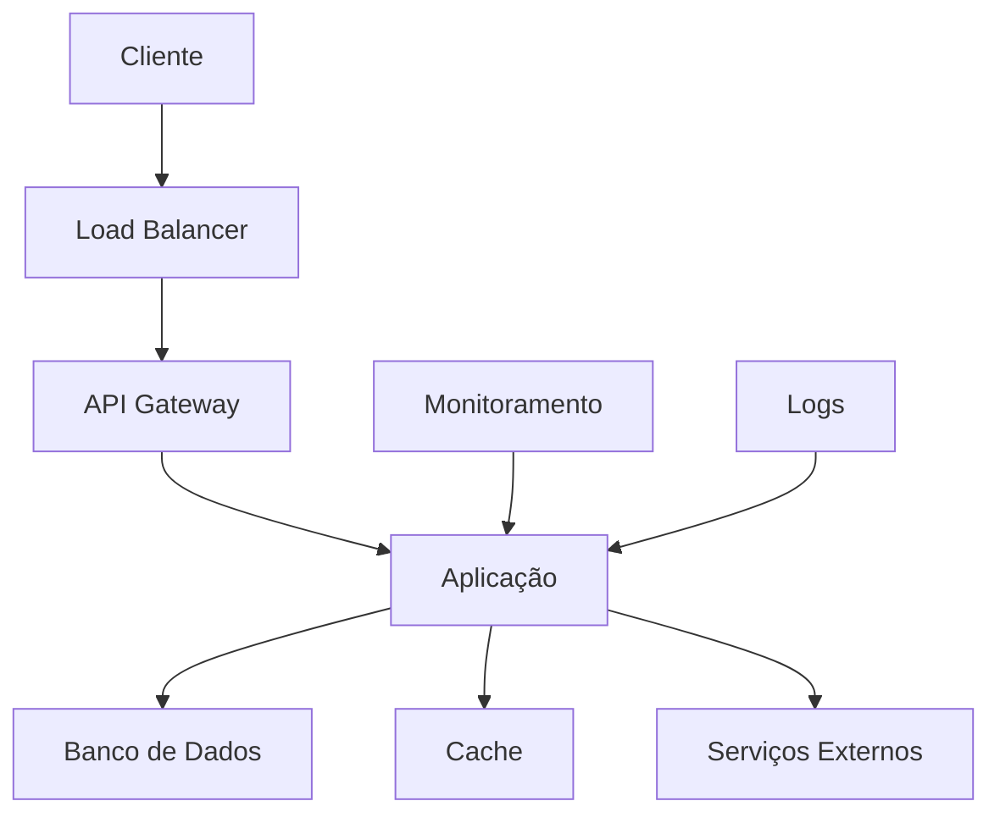

### Estrutura de Pastas

```
projeto/
├── [pasta_principal]/
│   ├── [modulo1]/
│   │   ├── [arquivo1]
│   │   └── [arquivo2]
│   ├── [modulo2]/
│   └── [modulo3]/
├── tests/
│   ├── unit/
│   ├── integration/
│   └── e2e/
├── docs/
├── scripts/
└── [arquivos_config]
```

### Componentes Principais

#### [Componente 1]

- **Responsabilidade**: [Descrição]
- **Localização**: `[caminho]`
- **Dependências**: [Lista]

#### [Componente 2]

- **Responsabilidade**: [Descrição]
- **Localização**: `[caminho]`
- **Dependências**: [Lista]

### Fluxo de Dados

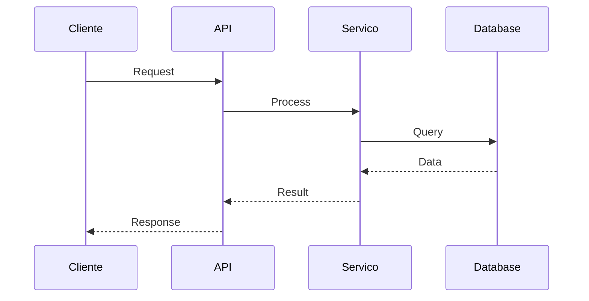

---

## 🚀 Início Rápido

### Primeira Execução

```bash
# 1. Setup completo (uma vez)
make setup
# ou
./scripts/setup.sh

# 2. Iniciar aplicação
make run
# ou
[comando_iniciar]

# 3. Acessar aplicação
open http://localhost:[PORTA]
```

## Comandos Essenciais

```bash
# Desenvolvimento
make dev          # Modo desenvolvimento
make test         # Executar testes
make lint         # Verificar código
make format       # Formatar código

# Banco de dados
make db-migrate   # Executar migrations
make db-seed      # Popular dados
make db-reset     # Resetar banco

# Deploy
make build        # Build da aplicação
make deploy-dev   # Deploy desenvolvimento
make deploy-prod  # Deploy produção
```

## Primeiro Desenvolvimento

1. **Crie uma branch**:

   ```bash
   git checkout -b feature/minha-feature
   ```

1. **Implemente sua funcionalidade**:
   - Siga [padrões de código](#padroes-de-codigo)
   - Adicione testes
   - Documente mudanças

2. **Teste localmente**:

   ```bash
   make test
   make lint
   ```

1. **Commit e push**:

   ```bash
   git add .
   git commit -m "feat: adiciona nova funcionalidade"
   git push origin feature/minha-feature
   ```

---

## 🔧 Desenvolvimento

### Workflow de Desenvolvimento

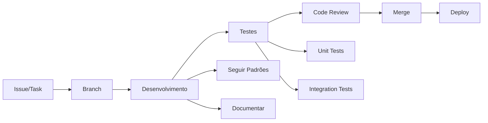

### Estrutura de Branch

```bash
# Padrão de nomenclatura
feature/[nome-da-feature]    # Novas funcionalidades
bugfix/[nome-do-bug]         # Correções
hotfix/[nome-do-hotfix]      # Correções urgentes
release/[versao]             # Preparação de release
```

## Desenvolvimento Local

### Hot Reload / Live Reload

```bash
# Modo desenvolvimento com reload automático
[comando_dev_mode]

# Logs em tempo real
[comando_logs]
```

## Debug

```bash
# Modo debug
[comando_debug]

# Breakpoints
# [Instruções específicas da linguagem]
```

## Integração com Amazon Q

```bash
# Estrutura Amazon Q no projeto
.amazonq/
└── rules/
    ├── datametria_std_[stack].md
    └── template-*.md

# Perguntas úteis para Amazon Q por cenário:

# Desenvolvimento:
# "Como implementar [funcionalidade] seguindo padrões DATAMETRIA?"
# "Gere testes para esta função"
# "Como otimizar esta query?"

# Documentação:
# "Documente esta API seguindo template DATAMETRIA"
# "Gere README para projeto [stack]"
# "Crie release notes para versão [X.Y.Z]"
# "Atualize CHANGELOG com estas mudanças"

# Arquitetura:
# "Crie ADR para decisão sobre [tecnologia]"
# "Documente arquitetura deste componente"
# "Gere technical specification para [sistema]"
```

---

## 📚 Cenários de Documentação

### Fluxo Sequencial de Documentos

Este guia apresenta os cenários mais comuns de desenvolvimento e a sequência de documentos que devem ser criados em cada situação, seguindo os padrões DATAMETRIA.

### Cenário 0: 💡 Concepção de Projeto (Pré-Desenvolvimento)

#### Sequência de Documentação

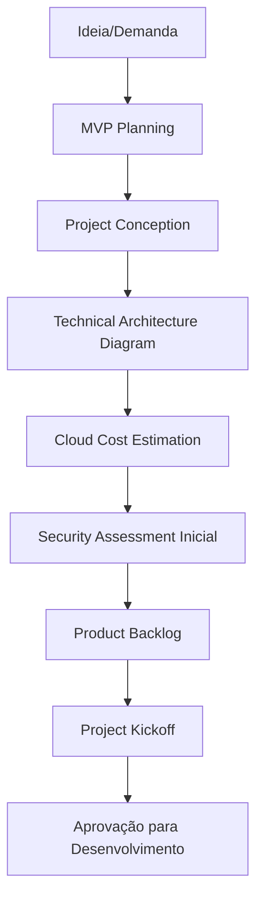

#### Passo-a-Passo Detalhado

#### Fase 1: Ideação e Validação (Semana 1)

1. **MVP Planning** (`template-mvp-planning.md`)

   ```bash
   # Planejamento inicial do MVP
   cp .amazonq/rules/template-mvp-planning.md ./docs/MVP_PLANNING.md

   # Definir:
   # - Problema a ser resolvido
   # - Hipóteses de negócio
   # - Métricas de sucesso
   # - Escopo mínimo viável
   # - Personas e casos de uso
   ```

1. **Project Conception** (`template-project-conception.md`)

   ```bash
   # Documento de concepção detalhado
   cp .amazonq/rules/template-project-conception.md ./docs/PROJECT_CONCEPTION.md

   # Documentar:
   # - Visão e missão do produto
   # - Objetivos SMART
   # - Stakeholders e responsabilidades
   # - Análise de mercado
   # - Proposta de valor
   # - Roadmap inicial
   ```

#### Fase 2: Arquitetura e Planejamento Técnico (Semana 2)

1. ## Technical Architecture Diagram (`template-technical-architecture-diagram.md`)

   ```bash
   # Diagramas de arquitetura inicial
   cp .amazonq/rules/template-technical-architecture-diagram.md ./docs/ARCHITECTURE_OVERVIEW.md

   # Criar:
   # - Diagrama de alto nível
   # - Componentes principais
   # - Fluxo de dados
   # - Integrações necessárias
   # - Tecnologias candidatas
   ```

1. **Cloud Cost Estimation** (`template-cloud-infrastructure-cost-estimation.md`)

   ```bash
   # Estimativa de custos de infraestrutura
   cp .amazonq/rules/template-cloud-infrastructure-cost-estimation.md ./docs/COST_ESTIMATION.md

   # Calcular:
   # - Custos de desenvolvimento
   # - Custos de infraestrutura (dev/staging/prod)
   # - Projeção de crescimento
   # - ROI esperado
   # - Comparação de provedores cloud
   ```

#### Fase 3: Segurança e Compliance (Semana 3)

1. **Security Assessment Inicial** (`template-security-assessment.md`)

   ```bash
   # Avaliação inicial de segurança
   cp .amazonq/rules/template-security-assessment.md ./docs/SECURITY_ASSESSMENT_INITIAL.md

   # Avaliar:
   # - Requisitos de compliance (LGPD/GDPR)
   # - Threat modeling inicial
   # - Controles de segurança necessários
   # - Classificação de dados
   # - Políticas de acesso
   ```

#### Fase 4: Produto e Gestão (Semana 4)

1. **Product Backlog** (`template-product-backlog.md`)

   ```bash
   # Backlog inicial do produto
   cp .amazonq/rules/template-product-backlog.md ./docs/PRODUCT_BACKLOG.md

   # Criar:
   # - Épicos principais
   # - User stories prioritizadas
   # - Critérios de aceitação
   # - Estimativas iniciais
   # - Roadmap de releases
   ```

1. **Project Kickoff** (`template-project-kickoff.md`)

   ```bash
   # Documento de kickoff oficial
   cp .amazonq/rules/template-project-kickoff.md ./docs/PROJECT_KICKOFF.md

   # Finalizar:
   # - Equipe definida
   # - Cronograma detalhado
   # - Orçamento aprovado
   # - Riscos identificados
   # - Critérios de sucesso
   # - Próximos passos
   ```

#### Deliverables da Fase de Concepção

| Documento | Responsável | Prazo | Aprovação Necessária |
|-----------|-------------|-------|---------------------|
| **MVP Planning** | Product Owner | Semana 1 | Stakeholders |
| **Project Conception** | Product Owner + Tech Lead | Semana 1 | C-Level |
| **Architecture Diagram** | Arquiteto de Software | Semana 2 | Tech Lead |
| **Cost Estimation** | FinOps/DevOps | Semana 2 | CFO |
| **Security Assessment** | Security Engineer | Semana 3 | CISO |
| **Product Backlog** | Product Owner | Semana 4 | Stakeholders |
| **Project Kickoff** | Project Manager | Semana 4 | Todos |

#### Gates de Aprovação

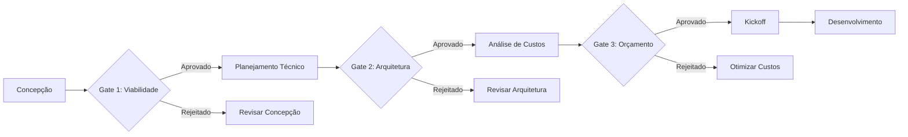

#### Critérios de Sucesso da Concepção

- [ ] **Problema claramente definido** e validado com stakeholders
- [ ] **MVP scope** bem delimitado e factível
- [ ] ## Arquitetura técnica aprovada pela equipe de engenharia
- [ ] **Estimativa de custos** dentro do orçamento disponível
- [ ] **Riscos de segurança** identificados e mitigados
- [ ] **Product backlog** priorizado e estimado
- [ ] **Equipe alocada** e cronograma definido
- [ ] **Aprovações necessárias** obtidas de todos os stakeholders

#### Amazon Q para Concepção

```bash
# Perguntas úteis para Amazon Q na fase de concepção:

# MVP e Produto:
# "Ajude-me a definir MVP para [tipo de produto]"
# "Quais métricas de sucesso para [domínio de negócio]?"
# "Crie user stories para [funcionalidade]"

# Arquitetura:
# "Sugira arquitetura para [tipo de sistema] com [requisitos]"
# "Compare tecnologias para [caso de uso específico]"
# "Quais padrões arquiteturais para [problema]?"

# Custos:
# "Estime custos AWS para [arquitetura proposta]"
# "Compare custos AWS vs GCP para [workload]"
# "Otimize custos para [cenário de uso]"

# Segurança:
# "Identifique riscos de segurança para [tipo de aplicação]"
# "Quais controles LGPD para [tipo de dados]?"
# "Crie threat model para [sistema]"
```

## Cenário 1: 🚀 Novo Projeto do Zero

### Sequência de Documentação

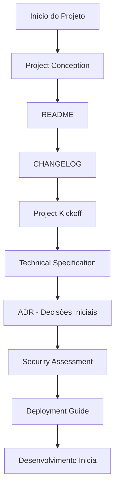

#### Passo-a-Passo Detalhado

#### Semana 1: Concepção e Planejamento

1. **Project Conception** (`template-project-conception.md`)

   ```bash
   # Criar documento de concepção
   cp .amazonq/rules/template-project-conception.md ./docs/PROJECT_CONCEPTION.md

   # Definir:
   # - Visão do produto
   # - Objetivos de negócio
   # - Stakeholders
   # - Escopo inicial
   ```

1. **README Principal** (`template-readme.md`)

   ```bash
   # Documentação principal do projeto
   cp .amazonq/rules/template-readme.md ./README.md

   # Incluir:
   # - Descrição do projeto
   # - Stack tecnológica
   # - Instruções de setup
   # - Links para documentação
   ```

1. **Changelog** (`template-changelog.md`)

   ```bash
   # Histórico de versões
   cp .amazonq/rules/template-changelog.md ./CHANGELOG.md

   # Inicializar com:
   # - Versão 0.1.0 (Initial setup)
   # - Estrutura para futuras releases
   ```

#### Semana 2: Planejamento Técnico

1. **Project Kickoff** (`template-project-kickoff.md`)

   ```bash
   # Documento de início oficial
   cp .amazonq/rules/template-project-kickoff.md ./docs/PROJECT_KICKOFF.md

   # Definir:
   # - Equipe e responsabilidades
   # - Cronograma inicial
   # - Riscos identificados
   # - Critérios de sucesso
   ```

1. **Technical Specification** (`template-technical-specification.md`)

   ```bash
   # Especificação técnica detalhada
   cp .amazonq/rules/template-technical-specification.md ./docs/TECHNICAL_SPEC.md

   # Documentar:
   # - Arquitetura do sistema
   # - Tecnologias escolhidas
   # - Integrações necessárias
   # - Requisitos não funcionais
   ```

1. **ADR - Decisões Arquiteturais** (`template-adr.md`)

   ```bash
   # Primeira decisão arquitetural
   cp .amazonq/rules/template-adr.md ./docs/architecture/ADR-001-tech-stack.md

   # Documentar decisões sobre:
   # - Escolha do framework
   # - Banco de dados
   # - Arquitetura de deploy
   # - Padrões de código
   ```

#### Semana 3: Segurança e Deploy

1. **Security Assessment** (`template-security-assessment.md`)

   ```bash
   # Avaliação inicial de segurança
   cp .amazonq/rules/template-security-assessment.md ./docs/SECURITY_ASSESSMENT.md

   # Avaliar:
   # - Threat modeling inicial
   # - Requisitos de compliance
   # - Controles de segurança
   # - Plano de testes de segurança
   ```

1. **Deployment Guide** (`template-deployment-guide.md`)

   ```bash
   # Guia de deployment
   cp .amazonq/rules/template-deployment-guide.md ./docs/DEPLOYMENT_GUIDE.md

   # Configurar:
   # - Ambientes (dev, staging, prod)
   # - Pipeline CI/CD
   # - Monitoramento
   # - Procedimentos de rollback
   ```

### Cenário 2: 🔧 Nova Funcionalidade

#### Sequência de Documentação

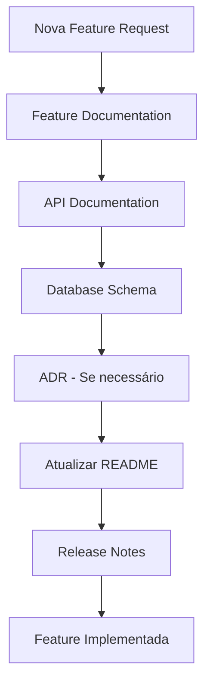

#### Passo-a-Passo Detalhado

1. **Feature Documentation** (`template-feature-documentation.md`)

   ```bash
   # Especificação da funcionalidade
   cp .amazonq/rules/template-feature-documentation.md ./docs/features/[nome-feature].md

   # Definir:
   # - Casos de uso
   # - Critérios de aceitação
   # - Mockups/wireframes
   # - Testes planejados
   ```

1. **API Documentation** (`template-api-documentation.md`) - Se aplicável

   ```bash
   # Documentação de novos endpoints
   cp .amazonq/rules/template-api-documentation.md ./docs/api/[feature]-api.md

   # Documentar:
   # - Novos endpoints
   # - Request/Response examples
   # - Códigos de erro
   # - Rate limiting
   ```

1. **Database Schema** (`template-database-schema-documentation.md`) - Se aplicável

   ```bash
   # Mudanças no banco de dados
   cp .amazonq/rules/template-database-schema-documentation.md ./docs/database/schema-v[X.Y].md

   # Documentar:
   # - Novas tabelas/campos
   # - Migrations necessárias
   # - Índices e constraints
   # - Impacto em performance
   ```

1. **ADR** (`template-adr.md`) - Se decisão arquitetural

   ```bash
   # Nova decisão arquitetural
   cp .amazonq/rules/template-adr.md ./docs/architecture/ADR-[NNN]-[decisao].md

   # Documentar se houver:
   # - Mudança de arquitetura
   # - Nova tecnologia
   # - Padrão de design
   ```

1. **Atualizar README**

   ```bash
   # Atualizar documentação principal
   # - Novas funcionalidades
   # - Mudanças na instalação
   # - Novos comandos
   ```

1. **Release Notes** (`template-release-notes.md`)

   ```bash
   # Preparar notas de release
   cp .amazonq/rules/template-release-notes.md ./docs/releases/v[X.Y.Z]-release-notes.md

   # Incluir:
   # - Novas funcionalidades
   # - Melhorias
   # - Bug fixes
   # - Breaking changes
   ```

### Cenário 3: 🐛 Correção de Bug

#### Sequência de Documentação

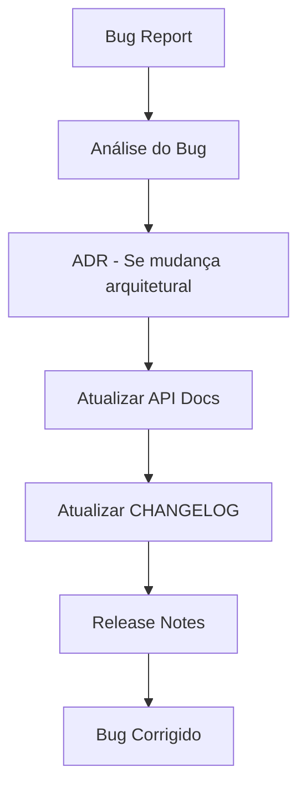

#### Passo-a-Passo Detalhado

1. **Análise e Documentação do Bug**

   ```bash
   # Documentar no issue/ticket:
   # - Root cause analysis
   # - Impacto do bug
   # - Solução proposta
   # - Testes para prevenir regressão
   ```

1. **ADR** - Se mudança significativa

   ```bash
   # Se a correção envolver mudança arquitetural
   cp .amazonq/rules/template-adr.md ./docs/architecture/ADR-[NNN]-bugfix-[nome].md
   ```

1. **Atualizar Documentação Existente**

   ```bash
   # Atualizar conforme necessário:
   # - API Documentation (se endpoints mudaram)
   # - README (se comandos/setup mudaram)
   # - Deployment Guide (se processo mudou)
   ```

1. **CHANGELOG**

   ```bash
   # Adicionar entrada no CHANGELOG.md
   # Seção "Fixed":
   # - Descrição do bug corrigido
   # - Referência ao issue
   ```

1. **Release Notes** - Para releases

   ```bash
   # Se faz parte de uma release
   # Incluir na seção "Bug Fixes"
   ```

### Cenário 4: 🚀 Deploy e Release

#### Sequência de Documentação

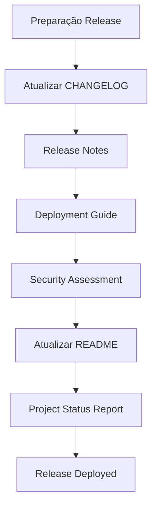

#### Passo-a-Passo Detalhado

1. **CHANGELOG** - Finalizar versão

   ```bash
   # Consolidar todas as mudanças da versão
   # Mover de "Unreleased" para versão específica
   # Adicionar data de release
   ```

1. **Release Notes** (`template-release-notes.md`)

   ```bash
   # Criar notas de release detalhadas
   cp .amazonq/rules/template-release-notes.md ./docs/releases/v[X.Y.Z]-release-notes.md

   # Incluir:
   # - Highlights da versão
   # - Breaking changes
   # - Migration guide
   # - Known issues
   ```

1. **Deployment Guide** - Atualizar se necessário

   ```bash
   # Verificar se há mudanças no processo de deploy
   # Atualizar configuraç   # Atualizar configurações de ambiente
   # Documentar novos requisitos de infraestrutura
   ```

1. **Security Assessment** - Para releases maiores

   ```bash
   # Atualizar avaliação de segurança
   # Verificar novos riscos introduzidos
   # Validar controles de segurança
   ```

1. **README** - Atualizar versão e features

   ```bash
   # Atualizar badges de versão
   # Adicionar novas funcionalidades
   # Atualizar instruções se necessário
   ```

1. **Project Status Report** (`template-project-status-report.md`)

   ```bash
   # Relatório de status pós-release
   cp .amazonq/rules/template-project-status-report.md ./docs/reports/status-[YYYY-MM].md

   # Incluir:
   # - Métricas da release
   # - Feedback dos usuários
   # - Próximos passos
   ```

### Cenário 5: 📱 Projeto Mobile

#### Sequência de Documentação Específica

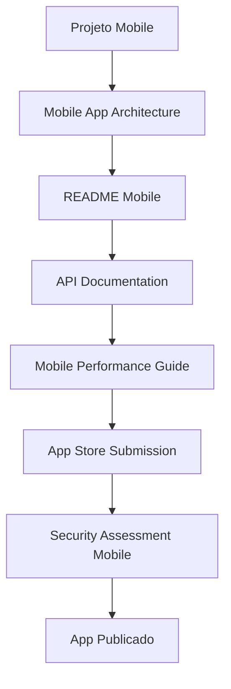

#### Templates Específicos Mobile

1. **Mobile App Architecture** (`template-mobile-app-architecture.md`)

   ```bash
   # Arquitetura específica mobile
   cp .amazonq/rules/template-mobile-app-architecture.md ./docs/MOBILE_ARCHITECTURE.md
   ```

1. **Mobile Performance Guide** (`template-mobile-performance-guide.md`)

   ```bash
   # Guia de performance mobile
   cp .amazonq/rules/template-mobile-performance-guide.md ./docs/PERFORMANCE_GUIDE.md
   ```

1. **App Store Submission** (`template-app-store-submission.md`)

   ```bash
   # Processo de submissão nas lojas
   cp .amazonq/rules/template-app-store-submission.md ./docs/APP_STORE_GUIDE.md
   ```

### Matriz de Decisão de Templates

| Cenário | Templates Obrigatórios | Templates Opcionais | Ordem de Criação |
|---------|----------------------|-------------------|------------------|
| **Concepção** | MVP Planning, Project Conception, Cost Estimation | Technical Architecture, Security Assessment | 1→2→3→4→5→6→7 |
| **Novo Projeto** | README, CHANGELOG, Project Conception | Project Kickoff, Technical Spec | 1→2→3→4→5 |
| **Nova Feature** | Feature Documentation | API Docs, Database Schema, ADR | 1→2→3→4 |
| **Bug Fix** | CHANGELOG (update) | ADR (se arquitetural) | 1→2→3 |
| **Release** | Release Notes, CHANGELOG | Project Status Report | 1→2→3 |
| **Mobile App** | Mobile Architecture, Performance Guide | App Store Submission | 1→2→3 |
| **API Changes** | API Documentation | Database Schema, ADR | 1→2→3 |
| **Security Issue** | Security Assessment | ADR, Deployment Guide | 1→2→3 |

### Automação com Amazon Q

```bash
# Perguntas úteis para Amazon Q em cada cenário:

# Concepção:
# "Ajude-me a definir MVP para [tipo de produto]"
# "Crie project conception para [domínio de negócio]"
# "Estime custos para arquitetura [descrição]"

# Novo Projeto:
# "Gere um README para projeto [stack] seguindo padrões DATAMETRIA"
# "Crie project conception para [tipo de projeto]"

# Nova Feature:
# "Documente esta feature seguindo template DATAMETRIA"
# "Gere API documentation para estes endpoints"

# Bug Fix:
# "Atualize CHANGELOG com esta correção"
# "Documente root cause analysis deste bug"

# Release:
# "Gere release notes para versão [X.Y.Z]"
# "Crie project status report para este mês"
```

---

## 📋 Padrões de Código

### Convenções de Nomenclatura

#### JavaScript/TypeScript

```javascript
// Variáveis: camelCase
const userName = 'john';
const isActive = true;

// Funções: camelCase + verbo
function getUserData() { }
function validateInput() { }

// Classes: PascalCase
class UserService { }
class PaymentProcessor { }

// Arquivos: kebab-case
// user-service.js, payment-form.tsx

// Constantes: UPPER_SNAKE_CASE
const API_BASE_URL = 'https://api.example.com';
const MAX_RETRY_COUNT = 3;
```

#### Python

```python
# Variáveis: snake_case
user_name = 'john'
is_active = True

# Funções: snake_case + verbo
def get_user_data():
    pass

def validate_input():
    pass

# Classes: PascalCase
class UserService:
    pass

class PaymentProcessor:
    pass

# Arquivos: snake_case
# user_service.py, payment_form.py

# Constantes: UPPER_SNAKE_CASE
API_BASE_URL = 'https://api.example.com'
MAX_RETRY_COUNT = 3
```

### Estrutura de Arquivos

#### Projeto Web (Vue.js + FastAPI)

```
project-name/
├── frontend/                 # Vue.js 3 + TypeScript
│   ├── src/
│   │   ├── components/      # Componentes reutilizáveis
│   │   ├── views/          # Páginas/Views
│   │   ├── stores/         # Pinia stores
│   │   ├── services/       # Serviços de API
│   │   ├── types/          # Definições TypeScript
│   │   └── utils/          # Utilitários
│   ├── public/
│   └── package.json
├── backend/                 # FastAPI + Python
│   ├── app/
│   │   ├── api/            # Endpoints da API
│   │   ├── core/           # Configurações centrais
│   │   ├── models/         # Modelos SQLAlchemy
│   │   ├── schemas/        # Schemas Pydantic
│   │   ├── services/       # Lógica de negócio
│   │   └── utils/          # Utilitários
│   ├── tests/
│   └── requirements.txt
├── docs/                    # Documentação
├── .github/workflows/       # CI/CD
└── docker-compose.yml
```

#### Projeto Mobile (Flutter)

```
app-name/
├── lib/
│   ├── core/               # Configurações centrais
│   ├── data/               # Camada de dados
│   │   ├── datasources/    # APIs, local storage
│   │   ├── models/         # Modelos de dados
│   │   └── repositories/   # Implementação de repositórios
│   ├── domain/             # Regras de negócio
│   │   ├── entities/       # Entidades
│   │   ├── repositories/   # Contratos de repositórios
│   │   └── usecases/       # Casos de uso
│   ├── presentation/       # UI
│   │   ├── pages/          # Páginas
│   │   ├── widgets/        # Widgets reutilizáveis
│   │   └── providers/      # Estado (Riverpod)
│   └── main.dart
├── test/
├── android/
├── ios/
└── pubspec.yaml
```

## Padrões de Commit

```bash
# Conventional Commits
feat: adiciona nova funcionalidade
fix: corrige bug específico
docs: atualiza documentação
style: formatação de código
refactor: refatoração sem mudança de funcionalidade
test: adiciona ou corrige testes
chore: tarefas de manutenção
```

## Code Review Checklist

- [ ] **Funcionalidade**: Código faz o que deveria fazer?
- [ ] **Testes**: Cobertura adequada de testes?
- [ ] **Performance**: Não introduz problemas de performance?
- [ ] **Segurança**: Segue diretrizes de segurança?
- [ ] ## Documentação: Código está documentado?
- [ ] ## Padrões: Segue padrões do projeto?

### Linting e Formatação

#### JavaScript/TypeScript (ESLint + Prettier)

```json
// .eslintrc.json
{
  "extends": [
    "@datametria/eslint-config",
    "prettier"
  ],
  "rules": {
    "no-console": "warn",
    "prefer-const": "error"
  }
}
```

```bash
# Executar linting
npm run lint

# Corrigir automaticamente
npm run lint:fix

# Formatação com Prettier
npm run format
```

#### Python (Black + Flake8)

```ini
# setup.cfg
[flake8]
max-line-length = 88
extend-ignore = E203, W503

[tool:pytest]
testpaths = tests
```

```bash
# Formatação com Black
black .

# Linting com Flake8
flake8 .

# Ordenar imports
isort .
```

---

## 🧪 Testes

### Estratégia de Testes

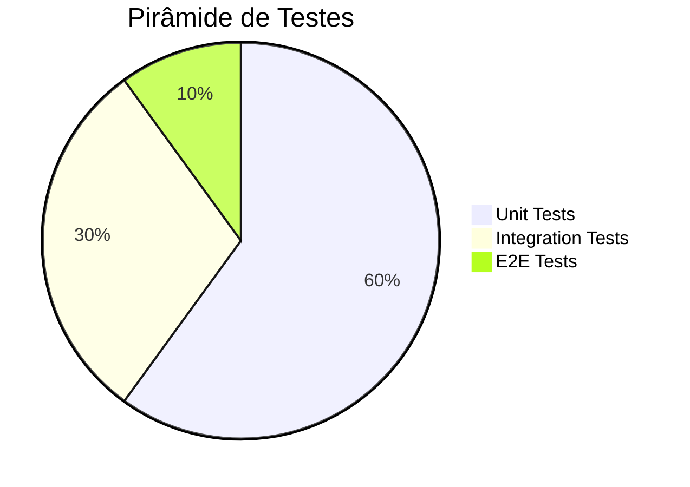

### Tipos de Teste

#### Unit Tests

#### JavaScript/TypeScript (Jest)

```bash
# Executar testes unitários
npm test

# Com cobertura
npm run test:coverage

# Watch mode
npm run test:watch
```

```javascript
// Exemplo de teste unitário
import { describe, it, expect } from '@jest/globals';
import { UserService } from '../services/UserService';

describe('UserService', () => {
  it('should create user successfully', async () => {
    const userService = new UserService();
    const userData = { name: 'John', email: 'john@example.com' };

    const result = await userService.createUser(userData);

    expect(result).toBeDefined();
    expect(result.name).toBe('John');
  });
});
```

#### Python (Pytest)

```bash
# Executar testes unitários
pytest

# Com cobertura
pytest --cov=app

# Relatório HTML
pytest --cov=app --cov-report=html
```

```python
# Exemplo de teste unitário
import pytest
from app.services.user_service import UserService

class TestUserService:
    def test_create_user_success(self):
        user_service = UserService()
        user_data = {'name': 'John', 'email': 'john@example.com'}

        result = user_service.create_user(user_data)

        assert result is not None
        assert result.name == 'John'
```

## Integration Tests

#### JavaScript/TypeScript

```bash
# Executar testes de integração
npm run test:integration

# Com banco de teste
npm run test:integration:db
```

```javascript
// Exemplo de teste de integração
import request from 'supertest';
import { app } from '../app';

describe('User API Integration', () => {
  it('should create and retrieve user', async () => {
    const userData = { name: 'John', email: 'john@example.com' };

    // Criar usuário
    const createResponse = await request(app)
      .post('/api/users')
      .send(userData)
      .expect(201);

    const userId = createResponse.body.id;

    // Recuperar usuário
    const getResponse = await request(app)
      .get(`/api/users/${userId}`)
      .expect(200);

    expect(getResponse.body.name).toBe('John');
  });
});
```

#### Python

```bash
# Executar testes de integração
pytest tests/integration/

# Com banco de teste
pytest tests/integration/ --db-test
```

```python
# Exemplo de teste de integração
import pytest
from fastapi.testclient import TestClient
from app.main import app

client = TestClient(app)

class TestUserAPIIntegration:
    def test_create_and_retrieve_user(self):
        user_data = {'name': 'John', 'email': 'john@example.com'}

        # Criar usuário
        create_response = client.post('/api/users', json=user_data)
        assert create_response.status_code == 201

        user_id = create_response.json()['id']

        # Recuperar usuário
        get_response = client.get(f'/api/users/{user_id}')
        assert get_response.status_code == 200
        assert get_response.json()['name'] == 'John'
```

## E2E Tests

#### Cypress (Web)

```bash
# Executar testes E2E
npx cypress run

# Interface gráfica
npx cypress open

# Headless
npx cypress run --headless
```

```javascript
// cypress/e2e/user-flow.cy.js
describe('User Registration Flow', () => {
  it('should register new user successfully', () => {
    cy.visit('/register');

    cy.get('[data-cy=name-input]').type('John Doe');
    cy.get('[data-cy=email-input]').type('john@example.com');
    cy.get('[data-cy=password-input]').type('password123');

    cy.get('[data-cy=submit-button]').click();

    cy.url().should('include', '/dashboard');
    cy.get('[data-cy=welcome-message]').should('contain', 'Welcome, John');
  });
});
```

#### Playwright (Web)

```bash
# Executar testes E2E
npx playwright test

# Com interface gráfica
npx playwright test --ui

# Gerar relatório
npx playwright show-report
```

```javascript
// tests/e2e/user-registration.spec.js
import { test, expect } from '@playwright/test';

test('user registration flow', async ({ page }) => {
  await page.goto('/register');

  await page.fill('[data-testid=name]', 'John Doe');
  await page.fill('[data-testid=email]', 'john@example.com');
  await page.fill('[data-testid=password]', 'password123');

  await page.click('[data-testid=submit]');

  await expect(page).toHaveURL(/.*dashboard/);
  await expect(page.locator('[data-testid=welcome]')).toContain('Welcome, John');
});
```

## Cobertura de Testes

#### JavaScript/TypeScript

```bash
# Gerar relatório de cobertura
npm run test:coverage

# Relatório HTML
npm run test:coverage:html

# Verificar cobertura mínima
npm run test:coverage:check
```

```json
// package.json - Configuração Jest
{
  "jest": {
    "coverageThreshold": {
      "global": {
        "branches": 80,
        "functions": 80,
        "lines": 80,
        "statements": 80
      }
    }
  }
}
```

#### Python

```bash
# Gerar relatório de cobertura
pytest --cov=app --cov-report=html

# Relatório no terminal
pytest --cov=app --cov-report=term-missing

# Meta de cobertura: 80%
pytest --cov=app --cov-fail-under=80
```

```ini
# setup.cfg
[coverage:run]
source = app
omit =
    */tests/*
    */venv/*
    */migrations/*

[coverage:report]
exclude_lines =
    pragma: no cover
    def __repr__
    raise AssertionError
    raise NotImplementedError
```

## Mocks e Fixtures

#### JavaScript/TypeScript

```bash
# Localização de mocks
tests/__mocks__/
tests/fixtures/

# Exemplo de mock
# tests/__mocks__/userService.js
export const mockUserService = {
  createUser: jest.fn(),
  getUserById: jest.fn(),
  updateUser: jest.fn()
};
```

```javascript
// tests/fixtures/users.js
export const mockUsers = {
  validUser: {
    id: 1,
    name: 'John Doe',
    email: 'john@example.com'
  },
  invalidUser: {
    name: '',
    email: 'invalid-email'
  }
};
```

#### Python

```bash
# Localização de mocks
tests/mocks/
tests/fixtures/

# Exemplo com pytest fixtures
```

```python
# tests/fixtures/users.py
import pytest
from app.models.user import User

@pytest.fixture
def valid_user_data():
    return {
        'name': 'John Doe',
        'email': 'john@example.com'
    }

@pytest.fixture
def mock_user_service(mocker):
    return mocker.patch('app.services.user_service.UserService')
```

---

## 🚀 Deploy

### Ambientes

| Ambiente | URL | Branch | Deploy |
|----------|-----|--------|--------|
| **Development** | [URL_DEV] | `develop` | Automático |
| **Staging** | [URL_STAGING] | `main` | Automático |
| **Production** | [URL_PROD] | `release/*` | Manual |

### Pipeline CI/CD

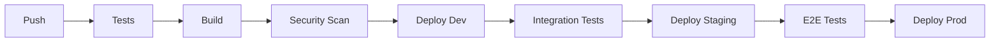

### Deploy Manual

```bash
# Build da aplicação
[comando_build]

# Deploy para staging
[comando_deploy_staging]

# Deploy para produção
[comando_deploy_prod]

# Rollback (se necessário)
[comando_rollback]
```

## Monitoramento Pós-Deploy

```bash
# Verificar saúde da aplicação
[comando_health_check]

# Logs em tempo real
[comando_logs_prod]

# Métricas
[comando_metrics]
```

---

## 🔧 Troubleshooting

### Problemas Comuns

#### Erro de Dependências

**Sintomas**: [Descrição do erro]

**Solução**:

```bash
[comandos_solucao]
```

#### Erro de Banco de Dados

**Sintomas**: [Descrição do erro]

**Solução**:

```bash
[comandos_solucao]
```

#### Erro de Configuração

**Sintomas**: [Descrição do erro]

**Solução**:

```bash
[comandos_solucao]
```

### Logs e Debug

```bash
# Localização dos logs
[caminho_logs]

# Visualizar logs
[comando_ver_logs]

# Debug mode
[comando_debug_mode]

# Profiling
[comando_profiling]
```

## Performance

```bash
# Monitorar performance
[comando_performance]

# Identificar gargalos
[comando_bottlenecks]

# Otimizações comuns
[lista_otimizacoes]
```

---

## 🤝 Contribuição

### Como Contribuir

1. **Fork** o repositório
2. **Crie** uma branch para sua feature
3. **Implemente** seguindo os padrões
4. **Teste** sua implementação
5. **Documente** as mudanças
6. **Abra** um Pull Request

### Pull Request Template

```markdown
## Descrição
[Descrição das mudanças]

## Tipo de Mudança
- [ ] Bug fix
- [ ] Nova feature
- [ ] Breaking change
- [ ] Documentação

## Checklist
- [ ] Testes passando
- [ ] Código revisado
- [ ] Documentação atualizada
- [ ] Changelog atualizado
```

### Code Review Process

1. **Automated Checks**: CI/CD pipeline
2. **Peer Review**: Pelo menos 1 aprovação
3. **Security Review**: Para mudanças sensíveis
4. **Architecture Review**: Para mudanças estruturais

---

## ❓ FAQ

### Desenvolvimento

#### Q: Como adicionar uma nova dependência?

A: [Instruções específicas]

#### Q: Como criar uma nova migration?

A: [Instruções específicas]

#### Q: Como configurar ambiente de desenvolvimento?

A: Siga a seção [Setup do Ambiente](#setup-do-ambiente)

### Deploy

#### Q: Como fazer rollback?

A: [Instruções de rollback]

#### Q: Como verificar se deploy foi bem-sucedido?

A: [Instruções de verificação]

### Troubleshooting

#### Q: Aplicação não inicia localmente

A: Verifique [lista de verificações]

#### Q: Testes falhando

A: [Passos para debug de testes]

---

## 📞 Suporte

### Contatos

- **Tech Lead**: [Nome] - [email]
- **DevOps**: [Nome] - [email]
- **Product Owner**: [Nome] - [email]

### Canais de Comunicação

- **Slack**: #[canal-do-projeto]
- **Email**: [email-da-equipe]
- **Issues**: [Link para issues do GitHub]

### Documentação Adicional

- **[📖 Documentação da API]**: [Link]
- **[🏗️ Arquitetura Detalhada]**: [Link]
- **[🔒 Guia de Segurança]**: [Link]
- **[📊 Monitoramento]**: [Link]

---

<div align="center">

#### Mantido pela equipe [Nome da Equipe]

**Última atualização**: [DD/MM/AAAA] | **Versão**: [X.Y.Z]

---

**Dúvidas?** Entre em contato via [canal preferencial]

</div>
