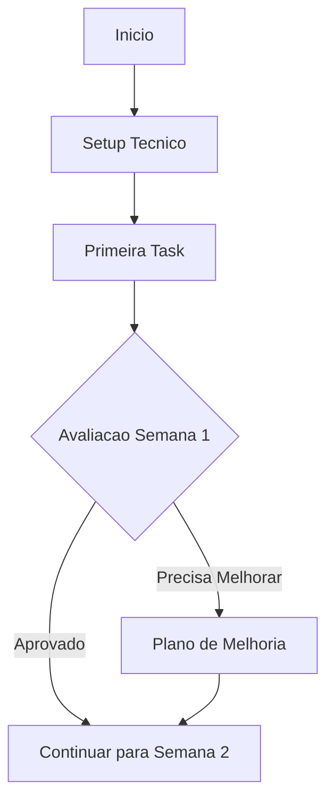
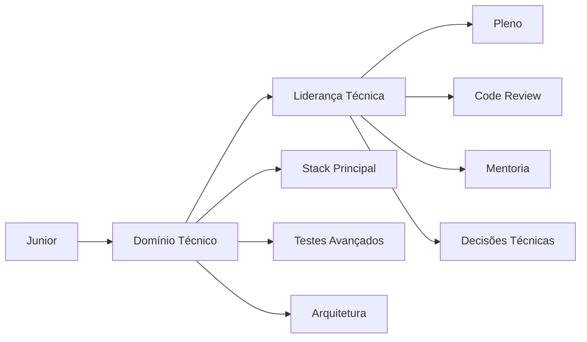
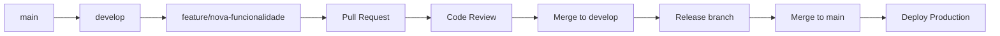

# Template de Onboarding de Desenvolvedor

<div align="center">

## Guia Completo de Integração para Novos Desenvolvedores

[](https://datametria.io)
[](https://github.com/datametria/standards)
[](https://datametria.io)
[](https://aws.amazon.com/q/)

[🎯 Objetivos](#-objetivos) • [📋 Checklist](#-checklist-de-onboarding) • [🛠️ Setup](#️-setup-do-ambiente) •
[📚 Recursos](#-recursos-de-aprendizado)

</div>

---

## 📋 Informações do Template

| Campo | Descrição |
|-------|-----------|
| **Nome do Projeto** | [Nome do projeto/produto] |
| **Novo Desenvolvedor** | [Nome do desenvolvedor] |
| **Mentor Designado** | [Nome do mentor] |
| **Data de Início** | [DD/MM/AAAA] |
| **Posição/Cargo** | [Desenvolvedor Junior/Pleno/Senior] |
| **Stack Principal** | [Web/Mobile/Backend/Frontend/Full-Stack] |
| **Duração Estimada** | [1-4 semanas] |

---

## 🎯 Objetivos

### Objetivos do Onboarding

- [ ] **Integração Cultural**: Compreender valores e cultura da equipe
- [ ] **Setup Técnico**: Configurar ambiente de desenvolvimento completo
- [ ] **Conhecimento do Produto**: Entender arquitetura e funcionalidades
- [ ] **Processos de Trabalho**: Dominar workflows e metodologias
- [ ] **Primeira Contribuição**: Realizar primeira entrega com sucesso
- [ ] **Autonomia**: Desenvolver independência para tarefas rotineiras

### Marcos de Progresso

| Semana | Marco | Critério de Sucesso |
|--------|-------|-------------------|
| **Semana 1** | Setup e Integração | Ambiente funcionando + Acesso a sistemas |
| **Semana 2** | Conhecimento Base | Compreensão da arquitetura + Primeira task |
| **Semana 3** | Desenvolvimento | Feature completa desenvolvida |
| **Semana 4** | Autonomia | Trabalho independente + Code review |

---

## 📋 Checklist de Onboarding

### 🏢 Dia 1: Boas-vindas e Integração

#### Apresentações e Cultura

- [ ] **Reunião de boas-vindas** com o time
- [ ] **Apresentação da empresa** e valores
- [ ] **Tour virtual/presencial** das instalações
- [ ] **Apresentação do mentor** e buddy system
- [ ] **Visão geral do produto** e roadmap
- [ ] **Estrutura organizacional** e stakeholders

#### Documentação Inicial

- [ ] **Manual do funcionário** lido e compreendido
- [ ] **Políticas de segurança** revisadas
- [ ] **Código de conduta** aceito
- [ ] **LGPD/GDPR training** concluído
- [ ] **Contatos importantes** salvos

### 🔧 Dias 2-3: Setup Técnico

#### Acessos e Contas

- [ ] **Email corporativo** configurado
- [ ] **GitHub/GitLab** acesso concedido
- [ ] **Slack/Discord** canais adicionados
- [ ] **Jira/Linear** acesso configurado
- [ ] **AWS/GCP Console** permissões definidas
- [ ] **VPN corporativa** configurada
- [ ] **Banco de dados** acessos de desenvolvimento

#### Ambiente de Desenvolvimento

- [ ] **IDE/Editor** instalado e configurado
- [ ] **Git** configurado com chaves SSH
- [ ] **Docker** instalado e funcionando
- [ ] **Node.js/Python** versões corretas
- [ ] **Dependências do projeto** instaladas
- [ ] **Banco local** configurado
- [ ] **Testes** executando com sucesso

#### Ferramentas de Produtividade

- [ ] **Postman/Insomnia** para APIs
- [ ] **DBeaver/pgAdmin** para banco
- [ ] **Figma** para design (se aplicável)
- [ ] **Notion/Confluence** para documentação
- [ ] **Calendário** sincronizado
- [ ] **Extensões do VS Code** instaladas

### 📚 Semana 1: Conhecimento Base

#### Arquitetura e Tecnologias

- [ ] **Diagrama de arquitetura** estudado
- [ ] **Stack tecnológico** compreendido
- [ ] **Padrões de código** revisados
- [ ] **Convenções de nomenclatura** aprendidas
- [ ] **Estrutura de pastas** familiarizada
- [ ] **APIs principais** documentadas

#### Processos de Desenvolvimento

- [ ] **Git workflow** (branching strategy)
- [ ] **Code review** processo
- [ ] **CI/CD pipeline** compreendido
- [ ] **Testing strategy** estudada
- [ ] **Deploy process** observado
- [ ] **Monitoring** e logs acessados

#### Primeira Task

- [ ] **Bug fix simples** ou **documentação**
- [ ] **Pull request** criado
- [ ] **Code review** recebido
- [ ] **Feedback** incorporado
- [ ] **Merge** realizado com sucesso

### 🚀 Semana 2: Desenvolvimento Ativo

#### Feature Development

- [ ] **User story** atribuída
- [ ] **Análise técnica** realizada
- [ ] **Estimativa** fornecida
- [ ] **Desenvolvimento** iniciado
- [ ] **Testes unitários** escritos
- [ ] **Documentação** atualizada

#### Colaboração

- [ ] **Daily standups** participação ativa
- [ ] **Planning meetings** contribuição
- [ ] **Retrospectivas** feedback fornecido
- [ ] **Pair programming** sessões realizadas
- [ ] **Knowledge sharing** participação

### 🎯 Semana 3-4: Autonomia

#### Trabalho Independente

- [ ] **Features complexas** desenvolvidas
- [ ] **Decisões técnicas** tomadas independentemente
- [ ] **Code reviews** realizados para outros
- [ ] **Mentoria** de novos membros (se aplicável)
- [ ] **Melhorias** propostas e implementadas

---

## 🛠️ Setup do Ambiente

### Pré-requisitos do Sistema

#### Sistema Operacional

```bash
# Windows (recomendado WSL2)
wsl --install -d Ubuntu-20.04

# macOS (Homebrew)
/bin/bash -c "$(curl -fsSL https://raw.githubusercontent.com/Homebrew/install/HEAD/install.sh)"

# Linux (Ubuntu/Debian)
sudo apt update && sudo apt upgrade -y
```

### Ferramentas Essenciais

```bash
# Git
git --version  # Verificar se já está instalado
git config --global user.name "Seu Nome"
git config --global user.email "seu.email@datametria.io"

# Node.js (via nvm)
curl -o- https://raw.githubusercontent.com/nvm-sh/nvm/v0.39.0/install.sh | bash
nvm install 18
nvm use 18

# Python (via pyenv)
curl https://pyenv.run | bash
pyenv install 3.11.0
pyenv global 3.11.0

# Docker
# Seguir instruções oficiais: https://docs.docker.com/get-docker/
docker --version
docker-compose --version
```

### Configuração do Projeto

#### Clone e Setup Inicial

```bash
# Clonar repositório
git clone https://github.com/datametria/[PROJETO].git
cd [PROJETO]

# Instalar dependências
npm install  # ou yarn install
pip install -r requirements.txt

# Configurar ambiente
cp .env.example .env
# Editar .env com configurações locais

# Setup do banco de dados
docker-compose up -d postgres
npm run db:migrate  # ou python manage.py migrate

# Executar testes
npm test  # ou pytest
```

### Verificação do Setup

```bash
# Verificar se aplicação inicia
npm run dev  # ou python app.py
# Acessar http://localhost:3000

# Verificar se testes passam
npm test -- --coverage
# Cobertura deve ser > 80%

# Verificar linting
npm run lint
# Não deve haver erros
```

### Configuração do IDE

#### VS Code Extensions

```json
{
  "recommendations": [
    "ms-python.python",
    "ms-vscode.vscode-typescript-next",
    "bradlc.vscode-tailwindcss",
    "esbenp.prettier-vscode",
    "ms-vscode.vscode-eslint",
    "amazonwebservices.amazon-q-vscode",
    "ms-vscode-remote.remote-containers",
    "ms-vscode.vscode-json",
    "redhat.vscode-yaml"
  ]
}
```

#### Configurações do Workspace

```json
{
  "editor.formatOnSave": true,
  "editor.codeActionsOnSave": {
    "source.fixAll.eslint": true
  },
  "python.defaultInterpreterPath": "./venv/bin/python",
  "python.linting.enabled": true,
  "python.linting.pylintEnabled": true,
  "amazonQ.enableCodeSuggestions": true
}
```

---

## 📚 Recursos de Aprendizado

### Documentação Técnica

#### Arquitetura do Sistema

- **[Diagrama de Arquitetura](link-para-diagrama)** - Visão geral do sistema
- **[ADRs (Architectural Decision Records)](link-para-adrs)** - Decisões arquiteturais
- **[API Documentation](link-para-api-docs)** - Documentação das APIs
- **[Database Schema](link-para-db-schema)** - Estrutura do banco de dados

#### Padrões e Convenções

- **[Coding Standards](link-para-standards)** - Padrões de código
- **[Git Workflow](link-para-git-workflow)** - Fluxo de trabalho Git
- **[Testing Guidelines](link-para-testing)** - Diretrizes de teste
- **[Security Guidelines](link-para-security)** - Práticas de segurança

### Treinamentos Obrigatórios

#### Segurança e Compliance

- [ ] **LGPD/GDPR Training** (2 horas)
- [ ] **Security Awareness** (1 hora)
- [ ] **Code Security** (1 hora)
- [ ] **Data Handling** (30 min)

#### Tecnologias Específicas

- [ ] **[Stack] Fundamentals** (4 horas)
- [ ] **Testing Best Practices** (2 horas)
- [ ] **CI/CD Pipeline** (1 hora)
- [ ] **Monitoring & Logging** (1 hora)

### Recursos de Aprendizado

#### Cursos Recomendados

| Tecnologia | Curso | Duração | Prioridade |
|------------|-------|---------|------------|
| **React/Vue.js** | [Link do curso] | 8 horas | 🔴 Alta |
| **Python/Flask** | [Link do curso] | 6 horas | 🔴 Alta |
| **Docker** | [Link do curso] | 4 horas | 🟠 Média |
| **AWS/GCP** | [Link do curso] | 8 horas | 🟡 Baixa |

#### Livros Técnicos

- **"Clean Code"** - Robert Martin
- **"The Pragmatic Programmer"** - Hunt & Thomas
- **"System Design Interview"** - Alex Xu
- **"Designing Data-Intensive Applications"** - Martin Kleppmann

#### Comunidades e Fóruns

- **Stack Overflow** - Dúvidas técnicas
- **GitHub Discussions** - Discussões do projeto
- **Discord/Slack** - Comunicação da equipe
- **Reddit** - Comunidades específicas da tecnologia

---

## 🤝 Mentoria e Suporte

### Sistema de Buddy

#### Responsabilidades do Mentor

- [ ] **Check-ins diários** na primeira semana
- [ ] **Check-ins semanais** nas semanas seguintes
- [ ] **Revisão de código** prioritária
- [ ] **Esclarecimento de dúvidas** técnicas e processuais
- [ ] **Feedback construtivo** sobre progresso
- [ ] **Introdução à equipe** e stakeholders

#### Responsabilidades do Novo Desenvolvedor

- [ ] **Participação ativa** nas sessões de mentoria
- [ ] **Perguntas frequentes** - não ter medo de perguntar
- [ ] **Feedback sobre o processo** de onboarding
- [ ] **Documentação de aprendizados** e dificuldades
- [ ] **Proatividade** na busca por conhecimento

### Canais de Suporte

| Canal | Uso | Tempo de Resposta |
|-------|-----|------------------|
| **Slack #onboarding** | Dúvidas gerais | 2 horas |
| **Mentor direto** | Questões específicas | 1 hora |
| **Tech Lead** | Decisões técnicas | 4 horas |
| **HR** | Questões administrativas | 1 dia |
| **IT Support** | Problemas técnicos | 2 horas |

---

## 📊 Avaliação e Feedback

### Marcos de Avaliação

#### Semana 1: Integração



**Critérios de Avaliação:**

- [ ] Ambiente de desenvolvimento funcionando
- [ ] Primeira contribuição realizada
- [ ] Compreensão básica do produto
- [ ] Integração com a equipe

#### Semana 2: Desenvolvimento

**Critérios de Avaliação:**

- [ ] Feature simples desenvolvida
- [ ] Testes unitários escritos
- [ ] Code review process compreendido
- [ ] Participação ativa em reuniões

#### Semana 3-4: Autonomia

**Critérios de Avaliação:**

- [ ] Trabalho independente demonstrado
- [ ] Qualidade de código consistente
- [ ] Contribuições para melhorias do processo
- [ ] Mentoria de outros (se aplicável)

### Formulário de Feedback

#### Autoavaliação do Desenvolvedor

| Aspecto | Nota (1-5) | Comentários |
|---------|------------|-------------|
| **Conhecimento Técnico** | [ ] | |
| **Qualidade do Código** | [ ] | |
| **Colaboração** | [ ] | |
| **Proatividade** | [ ] | |
| **Comunicação** | [ ] | |

#### Avaliação do Mentor

| Aspecto | Nota (1-5) | Comentários |
|---------|------------|-------------|
| **Progresso Técnico** | [ ] | |
| **Adaptação Cultural** | [ ] | |
| **Autonomia** | [ ] | |
| **Potencial de Crescimento** | [ ] | |

---

## 🎯 Planos de Desenvolvimento

### Trilha de Carreira

#### Desenvolvedor Junior → Pleno



**Competências Necessárias:**

- [ ] **Domínio completo** da stack principal
- [ ] **Arquitetura** de soluções médias
- [ ] **Mentoria** de desenvolvedores junior
- [ ] **Code review** eficiente
- [ ] **Estimativas** precisas

#### Desenvolvedor Pleno → Senior

**Competências Necessárias:**

- [ ] **Liderança técnica** de projetos
- [ ] **Arquitetura** de sistemas complexos
- [ ] **Influência** em decisões de produto
- [ ] **Mentoria** de múltiplos desenvolvedores
- [ ] **Visão estratégica** de tecnologia

### Plano de Desenvolvimento Individual (PDI)

#### Objetivos de 30 dias

- [ ] [Objetivo específico 1]
- [ ] [Objetivo específico 2]
- [ ] [Objetivo específico 3]

#### Objetivos de 90 dias

- [ ] [Objetivo específico 1]
- [ ] [Objetivo específico 2]
- [ ] [Objetivo específico 3]

#### Objetivos de 1 ano

- [ ] [Objetivo específico 1]
- [ ] [Objetivo específico 2]
- [ ] [Objetivo específico 3]

---

## 📝 Documentação e Processos

### Templates Essenciais

#### Para Desenvolvimento

- **[Template README](template-readme.md)** - Documentação de projetos
- **[Template ADR](template-adr.md)** - Decisões arquiteturais
- **[Template API Docs](template-api-documentation.md)** - Documentação de APIs
- **[Template Feature Docs](template-feature-documentation.md)** - Especificação de features

#### Para Gestão

- **[Template Code Review](template-code-review.md)** - Processo de revisão
- **[Template Release Notes](template-release-notes.md)** - Notas de versão
- **[Template Project Status](template-project-status-report.md)** - Status de projetos

### Processos Importantes

#### Git Workflow



#### Definition of Done

- [ ] **Código** desenvolvido e testado
- [ ] **Testes unitários** com cobertura > 80%
- [ ] **Code review** aprovado
- [ ] **Documentação** atualizada
- [ ] **CI/CD** passando
- [ ] **Deploy** em staging testado
- [ ] **Acceptance criteria** atendidos

---

## 🚀 Próximos Passos

### Após Conclusão do Onboarding

#### Integração Completa

- [ ] **Feedback final** coletado
- [ ] **Certificado de conclusão** emitido
- [ ] **Plano de desenvolvimento** definido
- [ ] **Objetivos trimestrais** estabelecidos
- [ ] **Mentor permanente** designado (se necessário)

#### Contribuição Contínua

- [ ] **Melhoria do processo** de onboarding
- [ ] **Mentoria** de futuros novos desenvolvedores
- [ ] **Documentação** de lições aprendidas
- [ ] **Participação** em iniciativas de melhoria

### Recursos Contínuos

#### Desenvolvimento Profissional

- **Cursos internos** e externos
- **Conferências** e eventos da área
- **Certificações** relevantes
- **Projetos side** para experimentação
- **Contribuições open source**

#### Networking Interno

- **Grupos de interesse** técnico
- **Comunidades de prática**
- **Eventos internos** e tech talks
- **Programa de mentoria** reversa

---

## 📞 Contatos Importantes

### Equipe de Onboarding

| Função | Nome | Email | Slack |
|--------|------|-------|-------|
| **Mentor Técnico** | [Nome] | [email] | @[username] |
| **Buddy** | [Nome] | [email] | @[username] |
| **Tech Lead** | [Nome] | [email] | @[username] |
| **Product Owner** | [Nome] | [email] | @[username] |
| **HR Business Partner** | [Nome] | [email] | @[username] |

### Suporte Técnico

| Área | Contato | Horário |
|------|---------|---------|
| **IT Support** | it-support@datametria.io | 8h-18h |
| **DevOps** | devops@datametria.io | 9h-17h |
| **Security** | security@datametria.io | 24/7 |

---

<div align="center">

#### Bem-vindo(a) à equipe DATAMETRIA! 🎉

**Última atualização**: [DD/MM/AAAA] | **Versão**: 2.0.0

---

**Dúvidas?** Entre em contato com seu mentor ou no canal #onboarding

</div>
