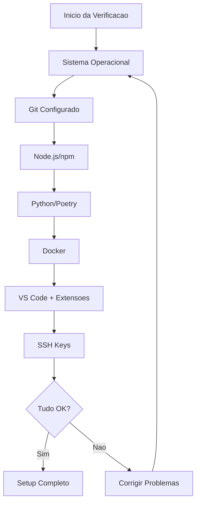

# Template de Setup de Ambiente

<div align="center">

## Guia Completo para Configuração de Ambiente de Desenvolvimento

[](https://datametria.io)
[](https://github.com/datametria/standards)
[](https://datametria.io)
[](https://aws.amazon.com/q/)

[💻 Sistema](#-configuração-do-sistema) • [🛠️ Ferramentas](#️-ferramentas-essenciais) •
[🔧 IDEs](#-configuração-de-ides) • [🐳 Docker](#-docker-e-containers)

</div>

---

## 📋 Informações do Ambiente

| Campo | Descrição |
|-------|-----------|
| **Desenvolvedor** | [Nome do desenvolvedor] |
| **Sistema Operacional** | [Windows 11 / macOS / Ubuntu] |
| **Stack Principal** | [Web/Mobile/Backend/Full-Stack] |
| **Projetos** | [Lista de projetos que trabalhará] |
| **Data de Setup** | [DD/MM/AAAA] |
| **Responsável pelo Setup** | [Nome do mentor/tech lead] |

---

## 💻 Configuração do Sistema

### Windows 11 Setup

#### WSL2 (Windows Subsystem for Linux)

```powershell
# Executar como Administrador no PowerShell
wsl --install -d Ubuntu-22.04

# Após reinicialização, configurar usuário Ubuntu
# Atualizar sistema
sudo apt update && sudo apt upgrade -y

# Instalar ferramentas básicas
sudo apt install -y curl wget git build-essential
```

#### Windows Terminal

```powershell
# Instalar via Microsoft Store ou winget
winget install Microsoft.WindowsTerminal

# Configurar perfil padrão para WSL
# Abrir Windows Terminal > Settings > Startup > Default profile: Ubuntu
```

#### Package Manager (Chocolatey)

```powershell
# Instalar Chocolatey
Set-ExecutionPolicy Bypass -Scope Process -Force
[System.Net.ServicePointManager]::SecurityProtocol = [System.Net.ServicePointManager]::SecurityProtocol -bor 3072
iex ((New-Object System.Net.WebClient).DownloadString('https://community.chocolatey.org/install.ps1'))

# Instalar ferramentas essenciais
choco install -y git nodejs python docker-desktop vscode
```

### macOS Setup

#### Homebrew

```bash
# Instalar Homebrew
/bin/bash -c "$(curl -fsSL https://raw.githubusercontent.com/Homebrew/install/HEAD/install.sh)"

# Adicionar ao PATH
echo 'eval "$(/opt/homebrew/bin/brew shellenv)"' >> ~/.zprofile
eval "$(/opt/homebrew/bin/brew shellenv)"

# Instalar ferramentas essenciais
brew install git node python docker
brew install --cask visual-studio-code docker
```

#### Xcode Command Line Tools

```bash
xcode-select --install
```

### Ubuntu/Linux Setup

#### Atualização do Sistema

```bash
sudo apt update && sudo apt upgrade -y

# Instalar ferramentas essenciais
sudo apt install -y curl wget git build-essential software-properties-common apt-transport-https ca-certificates gnupg lsb-release
```

#### Snap Packages

```bash
# Instalar VS Code
sudo snap install code --classic

# Instalar Node.js
sudo snap install node --classic
```

---

## 🛠️ Ferramentas Essenciais

### Git Configuration

#### Configuração Global

```bash
# Configurar identidade
git config --global user.name "Seu Nome"
git config --global user.email "seu.email@datametria.io"

# Configurar editor padrão
git config --global core.editor "code --wait"

# Configurar merge tool
git config --global merge.tool vscode
git config --global mergetool.vscode.cmd 'code --wait $MERGED'

# Configurar aliases úteis
git config --global alias.st status
git config --global alias.co checkout
git config --global alias.br branch
git config --global alias.ci commit
git config --global alias.unstage 'reset HEAD --'
git config --global alias.last 'log -1 HEAD'
git config --global alias.visual '!gitk'
```

#### SSH Keys

```bash
# Gerar chave SSH
ssh-keygen -t ed25519 -C "seu.email@datametria.io"

# Adicionar ao ssh-agent
eval "$(ssh-agent -s)"
ssh-add ~/.ssh/id_ed25519

# Copiar chave pública
cat ~/.ssh/id_ed25519.pub
# Adicionar no GitHub/GitLab: Settings > SSH Keys
```

### Node.js e npm

#### Instalação via nvm (Recomendado)

```bash
# Instalar nvm
curl -o- https://raw.githubusercontent.com/nvm-sh/nvm/v0.39.0/install.sh | bash

# Recarregar terminal ou executar:
source ~/.bashrc

# Instalar Node.js LTS
nvm install --lts
nvm use --lts
nvm alias default node

# Verificar instalação
node --version  # v18.x.x
npm --version   # 9.x.x
```

#### Configuração npm

```bash
# Configurar registry (se necessário)
npm config set registry https://registry.npmjs.org/

# Configurar cache
npm config set cache ~/.npm-cache

# Instalar ferramentas globais
npm install -g @vue/cli @angular/cli create-react-app typescript ts-node nodemon
```

### Python Development

#### pyenv (Gerenciador de Versões)

```bash
# Instalar pyenv (Linux/macOS)
curl https://pyenv.run | bash

# Adicionar ao shell profile
echo 'export PYENV_ROOT="$HOME/.pyenv"' >> ~/.bashrc
echo 'command -v pyenv >/dev/null || export PATH="$PYENV_ROOT/bin:$PATH"' >> ~/.bashrc
echo 'eval "$(pyenv init -)"' >> ~/.bashrc

# Recarregar terminal
source ~/.bashrc

# Instalar Python
pyenv install 3.11.0
pyenv global 3.11.0

# Verificar instalação
python --version  # Python 3.11.0
pip --version
```

#### Poetry (Gerenciador de Dependências)

```bash
# Instalar Poetry
curl -sSL https://install.python-poetry.org | python3 -

# Adicionar ao PATH
echo 'export PATH="$HOME/.local/bin:$PATH"' >> ~/.bashrc
source ~/.bashrc

# Configurar Poetry
poetry config virtualenvs.in-project true
poetry config virtualenvs.prefer-active-python true

# Verificar instalação
poetry --version
```

#### Ferramentas Python

```bash
# Instalar ferramentas globais
pip install --user pipx
pipx install black flake8 mypy pytest pre-commit

# Verificar instalações
black --version
flake8 --version
mypy --version
pytest --version
```

---

## 🐳 Docker e Containers

### Docker Installation

#### Windows (Docker Desktop)

```powershell
# Via Chocolatey
choco install docker-desktop

# Ou baixar do site oficial
# https://docs.docker.com/desktop/windows/install/
```

#### macOS (Docker Desktop)

```bash
# Via Homebrew
brew install --cask docker

# Ou baixar do site oficial
# https://docs.docker.com/desktop/mac/install/
```

#### Linux (Docker Engine)

```bash
# Ubuntu/Debian
curl -fsSL https://get.docker.com -o get-docker.sh
sudo sh get-docker.sh

# Adicionar usuário ao grupo docker
sudo usermod -aG docker $USER

# Instalar Docker Compose
sudo curl -L "https://github.com/docker/compose/releases/latest/download/docker-compose-$(uname -s)-$(uname -m)" -o /usr/local/bin/docker-compose
sudo chmod +x /usr/local/bin/docker-compose
```

### Docker Configuration

#### Verificação da Instalação

```bash
# Verificar Docker
docker --version
docker run hello-world

# Verificar Docker Compose
docker-compose --version

# Verificar recursos
docker system info
```

#### Configurações Úteis

```bash
# Limpar recursos não utilizados
docker system prune -a

# Ver uso de espaço
docker system df

# Configurar limite de logs
# Criar/editar ~/.docker/daemon.json
{
  "log-driver": "json-file",
  "log-opts": {
    "max-size": "10m",
    "max-file": "3"
  }
}
```

---

## 🔧 Configuração de IDEs

### Visual Studio Code

#### Instalação

```bash
# Windows (Chocolatey)
choco install vscode

# macOS (Homebrew)
brew install --cask visual-studio-code

# Linux (Snap)
sudo snap install code --classic
```

#### Extensões Essenciais

```json
{
  "recommendations": [
    // Essenciais
    "ms-vscode.vscode-typescript-next",
    "ms-python.python",
    "ms-vscode.vscode-json",
    "redhat.vscode-yaml",

    // Git
    "eamodio.gitlens",
    "mhutchie.git-graph",

    // Formatação
    "esbenp.prettier-vscode",
    "ms-python.black-formatter",

    // Linting
    "ms-python.flake8",
    "dbaeumer.vscode-eslint",

    // Docker
    "ms-azuretools.vscode-docker",

    // Remote Development
    "ms-vscode-remote.remote-containers",
    "ms-vscode-remote.remote-wsl",

    // AI Assistant
    "amazonwebservices.amazon-q-vscode",

    // Frameworks específicos
    "vue.volar",
    "ms-vscode.vscode-flutter",
    "bradlc.vscode-tailwindcss"
  ]
}
```

#### Configurações do Workspace

```json
{
  // Editor
  "editor.formatOnSave": true,
  "editor.codeActionsOnSave": {
    "source.fixAll.eslint": true,
    "source.organizeImports": true
  },
  "editor.rulers": [80, 120],
  "editor.tabSize": 2,
  "editor.insertSpaces": true,

  // Python
  "python.defaultInterpreterPath": "./venv/bin/python",
  "python.linting.enabled": true,
  "python.linting.pylintEnabled": false,
  "python.linting.flake8Enabled": true,
  "python.formatting.provider": "black",

  // JavaScript/TypeScript
  "typescript.preferences.importModuleSpecifier": "relative",
  "javascript.preferences.importModuleSpecifier": "relative",

  // Files
  "files.exclude": {
    "**/.git": true,
    "**/.DS_Store": true,
    "**/node_modules": true,
    "**/__pycache__": true,
    "**/.pytest_cache": true
  },

  // Terminal
  "terminal.integrated.defaultProfile.windows": "Ubuntu (WSL)",
  "terminal.integrated.fontSize": 14,
  "terminal.integrated.fontFamily": "'Cascadia Code', 'Fira Code', monospace",

  // Amazon Q
  "amazonQ.enableCodeSuggestions": true,
  "amazonQ.shareCodeWhispererContentWithAWS": false
}
```

---

## 📊 Verificação do Setup

### Checklist de Verificação



#### Script de Verificação

```bash
#!/bin/bash
# verify-setup.sh

echo "=== Verificação do Setup de Desenvolvimento ==="
echo

# Função para verificar comando
check_command() {
    if command -v $1 &> /dev/null; then
        echo "✓ $1 instalado: $(command -v $1)"
        if [ "$2" ]; then
            echo "  Versão: $($1 $2 2>/dev/null || echo 'N/A')"
        fi
    else
        echo "✗ $1 NÃO encontrado"
    fi
    echo
}

# Verificar ferramentas essenciais
check_command "git" "--version"
check_command "node" "--version"
check_command "npm" "--version"
check_command "python" "--version"
check_command "pip" "--version"
check_command "poetry" "--version"
check_command "docker" "--version"
check_command "docker-compose" "--version"
check_command "code" "--version"

# Verificar configurações Git
echo "=== Configurações Git ==="
echo "Nome: $(git config --global user.name || echo 'Não configurado')"
echo "Email: $(git config --global user.email || echo 'Não configurado')"
echo

# Verificar SSH
echo "=== Chaves SSH ==="
if [ -f ~/.ssh/id_ed25519.pub ]; then
    echo "✓ Chave SSH encontrada"
else
    echo "✗ Chave SSH não encontrada"
fi
echo

# Verificar Docker
echo "=== Docker ==="
if docker ps &> /dev/null; then
    echo "✓ Docker funcionando"
else
    echo "✗ Docker não está rodando"
fi
echo

echo "=== Verificação Concluída ==="
```

### Comandos de Teste

#### Teste Node.js

```bash
# Criar projeto teste
mkdir test-nodejs && cd test-nodejs
npm init -y
npm install express

# Criar app simples
echo 'const express = require("express");
const app = express();
app.get("/", (req, res) => res.send("Hello World!"));
app.listen(3000, () => console.log("Server running on port 3000"));' > app.js

# Testar
node app.js
# Acessar http://localhost:3000
```

#### Teste Python

```bash
# Criar projeto teste
mkdir test-python && cd test-python
poetry init --no-interaction
poetry add flask

# Criar app simples
echo 'from flask import Flask
app = Flask(__name__)
@app.route("/")
def hello():
    return "Hello World!"
if __name__ == "__main__":
    app.run(debug=True)' > app.py

# Testar
poetry run python app.py
# Acessar http://localhost:5000
```

#### Teste Docker

```bash
# Criar Dockerfile simples
echo 'FROM nginx:alpine
COPY index.html /usr/share/nginx/html/
EXPOSE 80' > Dockerfile

echo '<h1>Hello Docker!</h1>' > index.html

# Build e run
docker build -t test-app .
docker run -p 8080:80 test-app
# Acessar http://localhost:8080
```

---

## 🛠️ Troubleshooting

### Problemas Comuns

#### Windows WSL2

**Problema**: WSL2 não inicia

```powershell
# Verificar se WSL2 está habilitado
dism.exe /online /enable-feature /featurename:Microsoft-Windows-Subsystem-Linux /all /norestart
dism.exe /online /enable-feature /featurename:VirtualMachinePlatform /all /norestart

# Definir WSL2 como padrão
wsl --set-default-version 2
```

**Problema**: Erro de permissão no Docker

```bash
# Adicionar usuário ao grupo docker
sudo usermod -aG docker $USER
# Fazer logout e login novamente
```

#### macOS

**Problema**: Homebrew não encontrado

```bash
# Adicionar ao PATH
echo 'eval "$(/opt/homebrew/bin/brew shellenv)"' >> ~/.zprofile
source ~/.zprofile
```

**Problema**: Xcode Command Line Tools

```bash
# Reinstalar se necessário
sudo xcode-select --reset
xcode-select --install
```

#### Linux

**Problema**: Snap não instalado

```bash
# Ubuntu/Debian
sudo apt install snapd

# CentOS/RHEL
sudo yum install snapd
sudo systemctl enable --now snapd.socket
```

**Problema**: Node.js versão antiga

```bash
# Remover versão do sistema
sudo apt remove nodejs npm

# Usar nvm
curl -o- https://raw.githubusercontent.com/nvm-sh/nvm/v0.39.0/install.sh | bash
source ~/.bashrc
nvm install --lts
```

### Performance e Otimização

#### VS Code Performance

```json
{
  // Desabilitar extensões desnecessárias
  "extensions.autoUpdate": false,
  "extensions.autoCheckUpdates": false,

  // Otimizar busca
  "search.exclude": {
    "**/node_modules": true,
    "**/bower_components": true,
    "**/.git": true,
    "**/.DS_Store": true,
    "**/tmp": true
  },

  // Otimizar watcher
  "files.watcherExclude": {
    "**/.git/objects/**": true,
    "**/.git/subtree-cache/**": true,
    "**/node_modules/**": true,
    "**/tmp/**": true
  }
}
```

#### Docker Performance

```bash
# Limpar regularmente
docker system prune -f
docker volume prune -f
docker image prune -a -f

# Configurar limites de memória (Docker Desktop)
# Settings > Resources > Advanced
# Memory: 4GB (mínimo)
# CPUs: 2 (mínimo)
```

---

## 📚 Recursos Adicionais

### Documentação Oficial

| Ferramenta | Link | Descrição |
|------------|------|-----------|
| **Git** | [git-scm.com](https://git-scm.com/doc) | Documentação oficial do Git |
| **Node.js** | [nodejs.org](https://nodejs.org/docs/) | Documentação oficial do Node.js |
| **Python** | [python.org](https://docs.python.org/) | Documentação oficial do Python |
| **Docker** | [docs.docker.com](https://docs.docker.com/) | Documentação oficial do Docker |
| **VS Code** | [code.visualstudio.com](https://code.visualstudio.com/docs) | Documentação oficial do VS Code |

### Cursos e Tutoriais

- **[Git Tutorial](https://learngitbranching.js.org/)** - Tutorial interativo de Git
- **[Node.js Tutorial](https://nodejs.dev/learn)** - Guia oficial do Node.js
- **[Python Tutorial](https://docs.python.org/tutorial/)** - Tutorial oficial do Python
- **[Docker Tutorial](https://docker-curriculum.com/)** - Tutorial completo de Docker

### Comunidades

- **Stack Overflow** - Dúvidas técnicas
- **GitHub Discussions** - Discussões sobre projetos
- **Reddit** - Comunidades específicas (r/programming, r/webdev, etc.)
- **Discord/Slack** - Comunidades de desenvolvedores

---

<div align="center">

#### Ambiente de desenvolvimento configurado com sucesso! 🎉

**Última atualização**: [DD/MM/AAAA] | **Versão**: 2.0.0

---

**Dúvidas?** Entre em contato com o mentor ou consulte a documentação oficial

</div>
