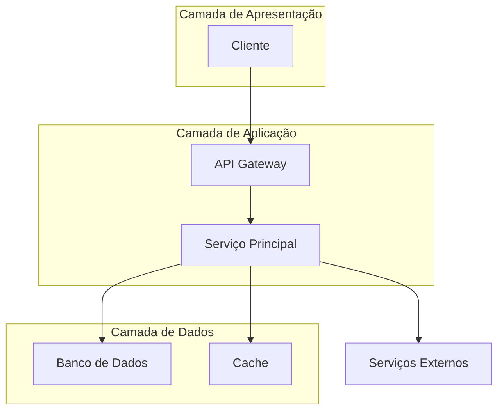
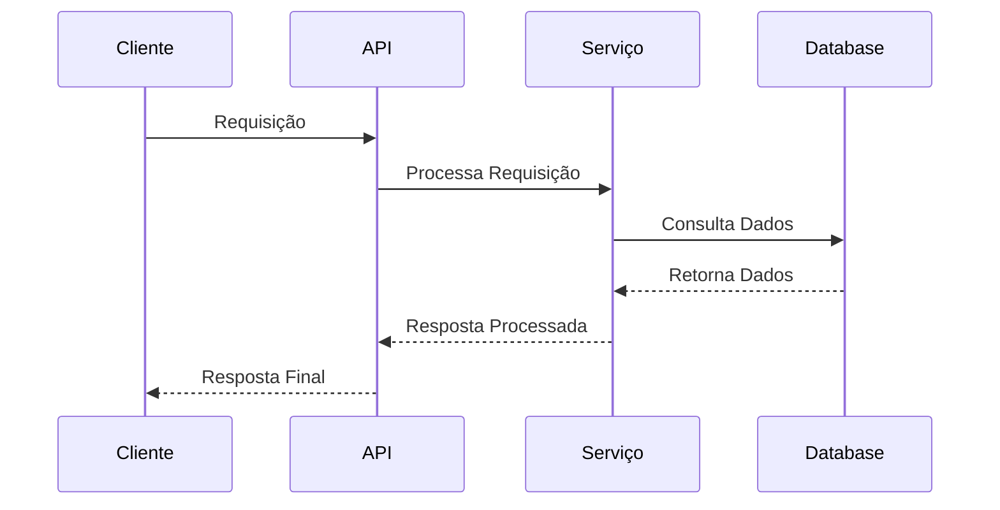
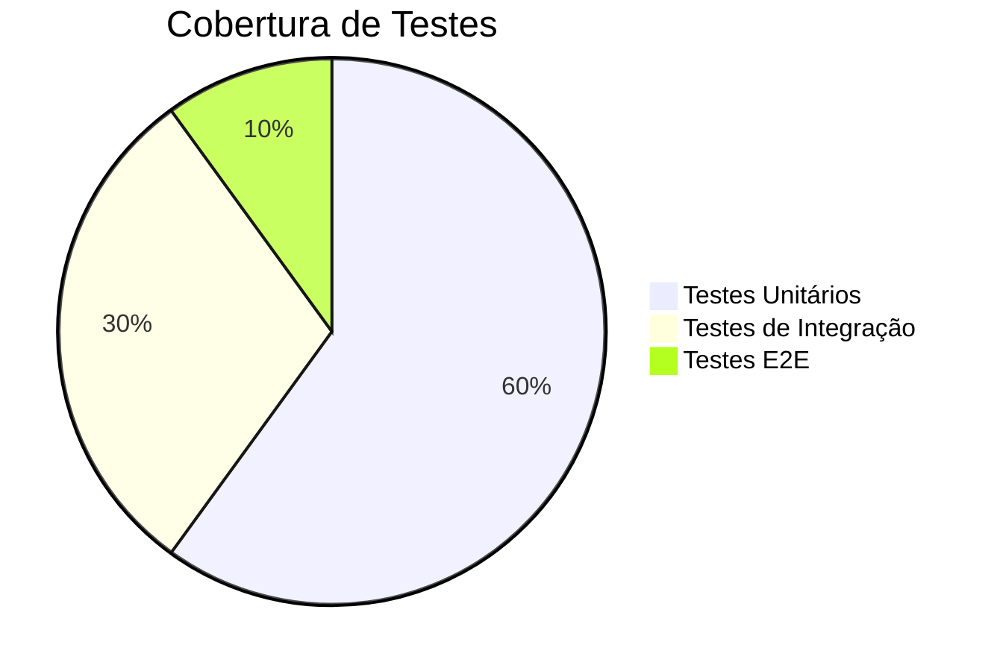

# Documentação de Funcionalidade - [Nome da Funcionalidade]

<div align="center">

**Versão**: [X.Y.Z] | **Status**: [Em Desenvolvimento/Ativo/Descontinuado] | **Última Atualização**: [DD/MM/AAAA]

[](link-status)
[](link-versao)
[](link-cobertura)
[](https://github.com/datametria/standards)
[](https://aws.amazon.com/q/)

[🎯 Visão Geral](#-visão-geral) • [🔧 Especificações](#-especificações-técnicas) • [🏗️ Arquitetura](#️-arquitetura) • [🔌 API](#-apiinterface) • [📖 Casos de Uso](#-casos-de-uso)

</div>

---

## 📋 Índice

- [Visão Geral](#-visão-geral)
- [Cards de Implementação](#-cards-de-implementação)
- [Especificações Técnicas](#-especificações-técnicas)
- [Arquitetura](#️-arquitetura)
- [API/Interface](#-apiinterface)
- [Casos de Uso](#-casos-de-uso)
- [Configuração](#️-configuração)
- [Exemplos de Implementação](#-exemplos-de-implementação)
- [Testes](#-testes)
- [Troubleshooting](#-troubleshooting)
- [Limitações](#️-limitações)
- [Roadmap](#️-roadmap)
- [Referências](#-referências)

---

## 🎯 Visão Geral

### Propósito

[Descrição clara e concisa do que a funcionalidade faz e por que existe]

### Objetivos

- **Objetivo Principal**: [Objetivo primário da funcionalidade]
- **Objetivos Secundários**:
  - [Objetivo secundário 1]
  - [Objetivo secundário 2]
  - [Objetivo secundário 3]

### Benefícios

| Benefício | Descrição | Impacto |
|-----------|-----------|---------|
| **[Benefício 1]** | [Descrição detalhada] | [Alto/Médio/Baixo] |
| **[Benefício 2]** | [Descrição detalhada] | [Alto/Médio/Baixo] |
| **[Benefício 3]** | [Descrição detalhada] | [Alto/Médio/Baixo] |

### Contexto de Negócio

[Explicação do contexto de negócio, problema que resolve e valor entregue]

---

## 📦 Cards de Implementação

> **Nota**: Esta seção contém os cards estruturados para importação no Firestore usando o script `Import-BacklogToFirestore.ps1`.

### 🎯 Features da Funcionalidade

---CARD-START---
id: FEAT-XXX
title: [Título da Feature Principal]
status: Todo
priority: High
story_points: 8
assignee: [Nome do Desenvolvedor]
project_id: [nome-do-projeto]
epic: [Nome da Funcionalidade]
milestone_id: [milestone-id]
sprint: [Sprint DD/MM a DD/MM]
start_date: YYYY-MM-DD
due_date: YYYY-MM-DD
detailed_description: |
  Implementação da funcionalidade principal [Nome da Funcionalidade].
  
  **Contexto:**
  - [Contexto relevante]
  - [Problema que resolve]
  
  **Requisitos:**
  - [Requisito funcional 1]
  - [Requisito funcional 2]
  - [Requisito funcional 3]
  
  **Tecnologias:**
  - Backend: [Tecnologia]
  - Frontend: [Tecnologia]
  - Database: [Tecnologia]
acceptance_criteria: |
  - [ ] API endpoint implementado e testado
  - [ ] Interface de usuário funcional
  - [ ] Validações de entrada implementadas
  - [ ] Testes unitários com coverage > 80%
  - [ ] Testes de integração passando
  - [ ] Documentação atualizada
  - [ ] Code review aprovado
technical_notes: |
  - Seguir Clean Architecture
  - Implementar Repository Pattern
  - Usar Dependency Injection
  - Adicionar logs estruturados
  - Configurar monitoramento
---CARD-END---

---CARD-START---
id: FEAT-XXX-01
title: [Subtarefa 1 - Backend API]
status: Todo
priority: High
story_points: 5
assignee: [Nome do Desenvolvedor Backend]
project_id: [nome-do-projeto]
epic: [Nome da Funcionalidade]
sprint: [Sprint DD/MM a DD/MM]
start_date: YYYY-MM-DD
due_date: YYYY-MM-DD
detailed_description: |
  Implementar endpoints da API para [funcionalidade].
  
  **Endpoints:**
  - POST /api/v1/[recurso] - Criar
  - GET /api/v1/[recurso] - Listar
  - GET /api/v1/[recurso]/{id} - Buscar
  - PUT /api/v1/[recurso]/{id} - Atualizar
  - DELETE /api/v1/[recurso]/{id} - Deletar
acceptance_criteria: |
  - [ ] Todos os endpoints implementados
  - [ ] Validação com Pydantic/Zod
  - [ ] Autenticação JWT configurada
  - [ ] Rate limiting aplicado
  - [ ] OpenAPI documentation gerada
  - [ ] Testes unitários > 80% coverage
technical_notes: |
  - Framework: FastAPI/Flask
  - Validação: Pydantic models
  - Auth: JWT com refresh tokens
  - Database: Repository pattern
---CARD-END---

---CARD-START---
id: FEAT-XXX-02
title: [Subtarefa 2 - Frontend UI]
status: Todo
priority: High
story_points: 5
assignee: [Nome do Desenvolvedor Frontend]
project_id: [nome-do-projeto]
epic: [Nome da Funcionalidade]
sprint: [Sprint DD/MM a DD/MM]
start_date: YYYY-MM-DD
due_date: YYYY-MM-DD
detailed_description: |
  Implementar interface de usuário para [funcionalidade].
  
  **Componentes:**
  - [Componente1].vue - Formulário principal
  - [Componente2].vue - Lista de itens
  - [Componente3].vue - Detalhes
  
  **Estado:**
  - Usar Pinia/Zustand para state management
  - Implementar loading states
  - Tratamento de erros
acceptance_criteria: |
  - [ ] Componentes Vue.js/React implementados
  - [ ] Integração com API funcionando
  - [ ] Loading states implementados
  - [ ] Error handling completo
  - [ ] Responsivo (mobile + desktop)
  - [ ] Acessibilidade WCAG 2.1 AA
  - [ ] Testes de componente
technical_notes: |
  - Framework: Vue.js 3 / React
  - State: Pinia / Zustand
  - UI: Vuetify / Material-UI
  - Acessibilidade: ARIA labels, keyboard navigation
---CARD-END---

---CARD-START---
id: FEAT-XXX-03
title: [Subtarefa 3 - Database Schema]
status: Todo
priority: High
story_points: 3
assignee: [Nome do DBA/Backend Dev]
project_id: [nome-do-projeto]
epic: [Nome da Funcionalidade]
sprint: [Sprint DD/MM a DD/MM]
start_date: YYYY-MM-DD
due_date: YYYY-MM-DD
detailed_description: |
  Criar schema de banco de dados para [funcionalidade].
  
  **Tabelas:**
  - [tabela1] - Entidade principal
  - [tabela2] - Relacionamento
  - [tabela3] - Auditoria
  
  **Índices:**
  - Índices em foreign keys
  - Índices em campos de busca
  - Índices compostos para queries frequentes
acceptance_criteria: |
  - [ ] Migration criada e testada
  - [ ] Índices otimizados
  - [ ] Constraints definidas
  - [ ] Documentação do schema
  - [ ] Rollback migration testada
technical_notes: |
  - Database: PostgreSQL / Firestore
  - ORM: SQLAlchemy / Prisma
  - Migrations: Alembic / Prisma Migrate
  - Validar performance com EXPLAIN ANALYZE
---CARD-END---

### 🧪 Testes da Funcionalidade

---CARD-START---
id: TEST-XXX
title: [Testes Automatizados - [Funcionalidade]]
status: Todo
priority: Medium
story_points: 5
assignee: [Nome do QA/Desenvolvedor]
project_id: [nome-do-projeto]
epic: [Nome da Funcionalidade]
sprint: [Sprint DD/MM a DD/MM]
start_date: YYYY-MM-DD
due_date: YYYY-MM-DD
detailed_description: |
  Implementar suite completa de testes para [funcionalidade].
  
  **Tipos de Teste:**
  - Testes unitários (backend + frontend)
  - Testes de integração (API + Database)
  - Testes E2E (fluxo completo)
  
  **Cobertura:**
  - Meta: > 80% coverage
  - Branches: > 75%
acceptance_criteria: |
  - [ ] Testes unitários implementados
  - [ ] Testes de integração implementados
  - [ ] Testes E2E implementados
  - [ ] Coverage > 80%
  - [ ] Todos os testes passando
  - [ ] CI/CD configurado
technical_notes: |
  - Unit: pytest / Jest
  - Integration: pytest + testcontainers
  - E2E: Cypress / Playwright
  - Coverage: pytest-cov / Jest coverage
---CARD-END---

### 📚 Documentação da Funcionalidade

---CARD-START---
id: DOC-XXX
title: [Documentação Completa - [Funcionalidade]]
status: Todo
priority: Low
story_points: 3
assignee: [Nome do Tech Writer/Desenvolvedor]
project_id: [nome-do-projeto]
epic: [Nome da Funcionalidade]
sprint: [Sprint DD/MM a DD/MM]
start_date: YYYY-MM-DD
due_date: YYYY-MM-DD
detailed_description: |
  Criar documentação completa da funcionalidade.
  
  **Documentos:**
  - README atualizado
  - API documentation (OpenAPI)
  - User guide
  - Technical specification
  - ADR (se decisões arquiteturais)
acceptance_criteria: |
  - [ ] README atualizado
  - [ ] API docs gerada (Swagger/Redoc)
  - [ ] User guide criado
  - [ ] Exemplos de código adicionados
  - [ ] Diagramas atualizados (Mermaid)
  - [ ] Changelog atualizado
technical_notes: |
  - Formato: Markdown
  - Diagramas: Mermaid
  - API Docs: OpenAPI 3.0
  - Seguir template-feature-documentation.md
---CARD-END---

### 🚀 Deploy e Monitoramento

---CARD-START---
id: OPS-XXX
title: [Deploy e Monitoramento - [Funcionalidade]]
status: Todo
priority: Medium
story_points: 3
assignee: [Nome do DevOps]
project_id: [nome-do-projeto]
epic: [Nome da Funcionalidade]
sprint: [Sprint DD/MM a DD/MM]
start_date: YYYY-MM-DD
due_date: YYYY-MM-DD
detailed_description: |
  Configurar deploy e monitoramento da funcionalidade.
  
  **Infraestrutura:**
  - CI/CD pipeline
  - Staging environment
  - Production deployment
  
  **Monitoramento:**
  - Logs estruturados
  - Métricas de performance
  - Alertas configurados
acceptance_criteria: |
  - [ ] CI/CD pipeline configurado
  - [ ] Deploy staging funcionando
  - [ ] Deploy production aprovado
  - [ ] Logs estruturados implementados
  - [ ] Métricas coletadas
  - [ ] Alertas configurados
  - [ ] Rollback testado
technical_notes: |
  - CI/CD: GitHub Actions / GitLab CI
  - Cloud: AWS / GCP / Firebase
  - Logs: CloudWatch / Stackdriver
  - Metrics: Prometheus / Cloud Monitoring
  - Alerts: PagerDuty / Slack
---CARD-END---

### 📊 Importação dos Cards

#### Comando de Importação

```powershell
# Importar cards desta feature para o Firestore
.\scripts\Import-BacklogToFirestore.ps1 `
  -BacklogFile "docs\features\[nome-da-feature].md"
```

#### Validação (Dry Run)

```powershell
# Validar cards antes de importar
.\scripts\Import-BacklogToFirestore.ps1 `
  -BacklogFile "docs\features\[nome-da-feature].md" `
  -DryRun
```

#### Verificação

1. Acessar: https://datametria-project-mgmt.web.app/dashboard
2. Filtrar por epic: "[Nome da Funcionalidade]"
3. Verificar todos os cards criados
4. Confirmar story points e assignees

---

## 🔧 Especificações Técnicas

### Requisitos Funcionais

| ID | Requisito | Prioridade | Status |
|----|-----------|------------|--------|
| **RF-001** | [Descrição do requisito funcional] | [Alta/Média/Baixa] | [✅/🔄/📋] |
| **RF-002** | [Descrição do requisito funcional] | [Alta/Média/Baixa] | [✅/🔄/📋] |
| **RF-003** | [Descrição do requisito funcional] | [Alta/Média/Baixa] | [✅/🔄/📋] |

### Requisitos Não Funcionais

| ID | Categoria | Requisito | Métrica | Status |
|----|-----------|-----------|---------|--------|
| **RNF-001** | Performance | [Descrição] | [Métrica específica] | [✅/🔄/📋] |
| **RNF-002** | Segurança | [Descrição] | [Métrica específica] | [✅/🔄/📋] |
| **RNF-003** | Usabilidade | [Descrição] | [Métrica específica] | [✅/🔄/📋] |
| **RNF-004** | Escalabilidade | [Descrição] | [Métrica específica] | [✅/🔄/📋] |

### Dependências

#### Dependências Internas

- **[Módulo/Serviço 1]**: [Versão] - [Descrição da dependência]
- **[Módulo/Serviço 2]**: [Versão] - [Descrição da dependência]

#### Dependências Externas

- **[Biblioteca/Serviço 1]**: [Versão] - [Descrição da dependência]
- **[Biblioteca/Serviço 2]**: [Versão] - [Descrição da dependência]

### Tecnologias Utilizadas

| Categoria | Tecnologia | Versão | Propósito |
|-----------|------------|--------|-----------|
| **Backend** | [Tecnologia] | [Versão] | [Propósito específico] |
| **Frontend** | [Tecnologia] | [Versão] | [Propósito específico] |
| **Banco de Dados** | [Tecnologia] | [Versão] | [Propósito específico] |
| **Cache** | [Tecnologia] | [Versão] | [Propósito específico] |

---

## 🏗️ Arquitetura

### Visão Geral da Arquitetura



### Componentes Principais

#### [Nome do Componente 1]

- **Responsabilidade**: [Descrição da responsabilidade]
- **Tecnologia**: [Tecnologia utilizada]
- **Localização**: [Caminho/módulo no código]
- **Interfaces**: [APIs/interfaces expostas]

#### [Nome do Componente 2]

- **Responsabilidade**: [Descrição da responsabilidade]
- **Tecnologia**: [Tecnologia utilizada]
- **Localização**: [Caminho/módulo no código]
- **Interfaces**: [APIs/interfaces expostas]

### Fluxo de Dados



### Modelo de Dados

#### Entidades Principais

```sql
-- Exemplo de estrutura de dados
CREATE TABLE [nome_tabela] (
    id SERIAL PRIMARY KEY,
    [campo1] VARCHAR(255) NOT NULL,
    [campo2] INTEGER DEFAULT 0,
    [campo3] TIMESTAMP DEFAULT CURRENT_TIMESTAMP,
    [campo4] BOOLEAN DEFAULT FALSE
);
```

#### Relacionamentos

- **[Entidade A]** → **[Entidade B]**: [Tipo de relacionamento] ([1:1/1:N/N:N])
- **[Entidade B]** → **[Entidade C]**: [Tipo de relacionamento] ([1:1/1:N/N:N])

---

## 🔌 API/Interface

### Endpoints Principais

#### [Nome do Endpoint 1]

```http
[MÉTODO] /api/[recurso]
Content-Type: application/json
Authorization: Bearer [token]
```

**Parâmetros**:
| Parâmetro | Tipo | Obrigatório | Descrição | Exemplo |
|-----------|------|-------------|-----------|---------|
| `[param1]` | `string` | Sim | [Descrição] | `"valor"` |
| `[param2]` | `integer` | Não | [Descrição] | `123` |

**Exemplo de Requisição**:

```json
{
  "[campo1]": "[valor1]",
  "[campo2]": "[valor2]",
  "[campo3]": {
    "[subcampo]": "[valor]"
  }
}
```

**Exemplo de Resposta** (`200 OK`):

```json
{
  "success": true,
  "data": {
    "id": 123,
    "[campo1]": "[valor1]",
    "[campo2]": "[valor2]"
  },
  "meta": {
    "timestamp": "2024-01-01T12:00:00Z",
    "version": "1.0.0"
  }
}
```

**Códigos de Resposta**:
| Código | Descrição |
|--------|-----------|
| `200` | Sucesso |
| `400` | Requisição inválida |
| `401` | Não autorizado |
| `404` | Recurso não encontrado |
| `500` | Erro interno |

### Interface de Usuário

#### Componentes Principais

##### [Nome do Componente UI]

- **Localização**: [Caminho do componente]
- **Props/Parâmetros**:

  ```typescript
  interface [NomeInterface] {
    [prop1]: string;
    [prop2]: number;
    [prop3]?: boolean;
  }
  ```

- **Eventos**:
  - `on[Evento1]`: [Descrição do evento]
  - `on[Evento2]`: [Descrição do evento]

#### Estados da Interface

| Estado | Descrição | Trigger |
|--------|-----------|---------|
| **Loading** | [Descrição] | [Condição que ativa] |
| **Success** | [Descrição] | [Condição que ativa] |
| **Error** | [Descrição] | [Condição que ativa] |
| **Empty** | [Descrição] | [Condição que ativa] |

---

## 📖 Casos de Uso

### Caso de Uso 1: [Nome do Caso]

**Ator**: [Tipo de usuário]
**Objetivo**: [Objetivo do caso de uso]
**Pré-condições**: [Condições necessárias]

#### Fluxo Principal

1. [Passo 1]
2. [Passo 2]
3. [Passo 3]
4. [Resultado esperado]

#### Fluxos Alternativos

- **[Cenário alternativo 1]**: [Descrição e passos]
- **[Cenário alternativo 2]**: [Descrição e passos]

#### Fluxos de Exceção

- **[Exceção 1]**: [Descrição e tratamento]
- **[Exceção 2]**: [Descrição e tratamento]

### Caso de Uso 2: [Nome do Caso]

**Ator**: [Tipo de usuário]
**Objetivo**: [Objetivo do caso de uso]

[Repetir estrutura similar]

---

## ⚙️ Configuração

### Variáveis de Ambiente

```bash
# Configurações da funcionalidade
[FEATURE]_ENABLED=[true/false]
[FEATURE]_CONFIG_PARAM1=[valor]
[FEATURE]_CONFIG_PARAM2=[valor]

# Configurações de integração
[FEATURE]_API_URL=[url]
[FEATURE]_API_KEY=[chave]
[FEATURE]_TIMEOUT=[segundos]

# Configurações de performance
[FEATURE]_CACHE_TTL=[segundos]
[FEATURE]_MAX_CONNECTIONS=[número]
```

### Arquivo de Configuração

```yaml
# config/[feature].yml
[feature]:
  enabled: true
  settings:
    [param1]: [valor1]
    [param2]: [valor2]

  integrations:
    [service1]:
      url: [url]
      timeout: [segundos]

  performance:
    cache_ttl: [segundos]
    max_requests: [número]
```

### Configuração de Banco de Dados

```sql
-- Migrations necessárias
-- Migration: [timestamp]_create_[feature]_tables.sql

CREATE TABLE [tabela] (
    -- estrutura da tabela
);

-- Índices recomendados
CREATE INDEX idx_[tabela]_[campo] ON [tabela]([campo]);
```

---

## 💻 Exemplos de Implementação

### Exemplo 1: Implementação Básica

#### Backend (Python/Flask)

```python
from flask import Blueprint, request, jsonify
from [projeto].models import [Modelo]
from [projeto].services import [Servico]

[feature]_bp = Blueprint('[feature]', __name__)

@[feature]_bp.route('/api/[recurso]', methods=['POST'])
def create_recurso():
    """Cria um novo recurso."""
    try:
        data = request.get_json()

        # Validação
        if not data or '[campo_obrigatorio]' not in data:
            return jsonify({
                'success': False,
                'error': 'Dados inválidos'
            }), 400

        # Processamento
        servico = [Servico]()
        resultado = servico.criar_recurso(data)

        return jsonify({
            'success': True,
            'data': resultado
        }), 201

    except Exception as e:
        return jsonify({
            'success': False,
            'error': str(e)
        }), 500
```

#### Frontend (Vue.js)

```vue
<template>
  <div class="[feature]-component">
    <h2>{{ titulo }}</h2>

    <form @submit.prevent="submitForm">
      <div class="form-group">
        <label for="[campo1]">[Label Campo 1]:</label>
        <input
          id="[campo1]"
          v-model="form.[campo1]"
          type="text"
          required
        />
      </div>

      <div class="form-group">
        <label for="[campo2]">[Label Campo 2]:</label>
        <input
          id="[campo2]"
          v-model="form.[campo2]"
          type="number"
        />
      </div>

      <button type="submit" :disabled="loading">
        {{ loading ? 'Processando...' : 'Enviar' }}
      </button>
    </form>

    <div v-if="resultado" class="resultado">
      <h3>Resultado:</h3>
      <pre>{{ resultado }}</pre>
    </div>
  </div>
</template>

<script>
import { ref, reactive } from 'vue'
import { [feature]Service } from '@/services/[feature]Service'

export default {
  name: '[Feature]Component',
  setup() {
    const loading = ref(false)
    const resultado = ref(null)
    const form = reactive({
      [campo1]: '',
      [campo2]: 0
    })

    const submitForm = async () => {
      loading.value = true
      try {
        const response = await [feature]Service.criar(form)
        resultado.value = response.data
      } catch (error) {
        console.error('Erro:', error)
        // Tratar erro
      } finally {
        loading.value = false
      }
    }

    return {
      form,
      loading,
      resultado,
      submitForm,
      titulo: '[Título da Funcionalidade]'
    }
  }
}
</script>
```

### Exemplo 2: Integração com Serviços Externos

```python
import requests
from typing import Dict, Any, Optional
from dataclasses import dataclass

@dataclass
class [Feature]Config:
    api_url: str
    api_key: str
    timeout: int = 30

class [Feature]Service:
    """Serviço para integração com [nome do serviço externo]."""

    def __init__(self, config: [Feature]Config):
        self.config = config
        self.session = requests.Session()
        self.session.headers.update({
            'Authorization': f'Bearer {config.api_key}',
            'Content-Type': 'application/json'
        })

    def processar_dados(self, dados: Dict[str, Any]) -> Optional[Dict[str, Any]]:
        """Processa dados através do serviço externo."""
        try:
            response = self.session.post(
                f'{self.config.api_url}/[endpoint]',
                json=dados,
                timeout=self.config.timeout
            )
            response.raise_for_status()
            return response.json()

        except requests.exceptions.RequestException as e:
            print(f'Erro na integração: {e}')
            return None
```

---

## 🧪 Testes

### Estratégia de Testes



### Testes Unitários

```python
import pytest
from unittest.mock import Mock, patch
from [projeto].services import [Feature]Service

class Test[Feature]Service:
    """Testes unitários para [Feature]Service."""

    def setup_method(self):
        """Setup para cada teste."""
        self.service = [Feature]Service()

    def test_criar_recurso_sucesso(self):
        """Testa criação bem-sucedida de recurso."""
        # Arrange
        dados = {
            '[campo1]': 'valor_teste',
            '[campo2]': 123
        }

        # Act
        resultado = self.service.criar_recurso(dados)

        # Assert
        assert resultado is not None
        assert resultado['[campo1]'] == 'valor_teste'
        assert resultado['id'] is not None

    def test_criar_recurso_dados_invalidos(self):
        """Testa criação com dados inválidos."""
        # Arrange
        dados = {}

        # Act & Assert
        with pytest.raises(ValueError):
            self.service.criar_recurso(dados)

    @patch('[projeto].services.[external_service]')
    def test_integracao_servico_externo(self, mock_service):
        """Testa integração com serviço externo."""
        # Arrange
        mock_service.return_value.processar.return_value = {'status': 'success'}
        dados = {'teste': 'valor'}

        # Act
        resultado = self.service.processar_com_servico_externo(dados)

        # Assert
        assert resultado['status'] == 'success'
        mock_service.return_value.processar.assert_called_once_with(dados)
```

### Testes de Integração

```python
import pytest
from flask import Flask
from [projeto] import create_app
from [projeto].database import db

@pytest.fixture
def app():
    """Fixture da aplicação para testes."""
    app = create_app('testing')
    with app.app_context():
        db.create_all()
        yield app
        db.drop_all()

@pytest.fixture
def client(app):
    """Cliente de teste."""
    return app.test_client()

class Test[Feature]API:
    """Testes de integração da API."""

    def test_criar_recurso_endpoint(self, client):
        """Testa endpoint de criação."""
        # Arrange
        dados = {
            '[campo1]': 'valor_teste',
            '[campo2]': 123
        }

        # Act
        response = client.post('/api/[recurso]', json=dados)

        # Assert
        assert response.status_code == 201
        data = response.get_json()
        assert data['success'] is True
        assert data['data']['[campo1]'] == 'valor_teste'

    def test_listar_recursos_endpoint(self, client):
        """Testa endpoint de listagem."""
        # Act
        response = client.get('/api/[recurso]')

        # Assert
        assert response.status_code == 200
        data = response.get_json()
        assert 'data' in data
        assert isinstance(data['data'], list)
```

### Testes E2E

```javascript
// cypress/integration/[feature].spec.js
describe('[Feature] E2E Tests', () => {
  beforeEach(() => {
    cy.visit('/[feature]')
  })

  it('deve criar um novo recurso com sucesso', () => {
    // Arrange
    const dados = {
      [campo1]: 'Valor de Teste',
      [campo2]: 123
    }

    // Act
    cy.get('[data-cy="[campo1]-input"]').type(dados.[campo1])
    cy.get('[data-cy="[campo2]-input"]').type(dados.[campo2].toString())
    cy.get('[data-cy="submit-button"]').click()

    // Assert
    cy.get('[data-cy="success-message"]').should('be.visible')
    cy.get('[data-cy="resultado"]').should('contain', dados.[campo1])
  })

  it('deve exibir erro para dados inválidos', () => {
    // Act
    cy.get('[data-cy="submit-button"]').click()

    // Assert
    cy.get('[data-cy="error-message"]').should('be.visible')
    cy.get('[data-cy="error-message"]').should('contain', 'Dados inválidos')
  })
})
```

---

## 🔧 Troubleshooting

### Problemas Comuns

#### Erro: "[Descrição do erro comum 1]"

**Sintomas**:

- [Sintoma 1]
- [Sintoma 2]

**Possíveis Causas**:

- [Causa 1]
- [Causa 2]

**Soluções**:

1. [Solução 1 com comandos/código]
2. [Solução 2 com comandos/código]

#### Erro: "[Descrição do erro comum 2]"

**Sintomas**:

- [Sintoma 1]
- [Sintoma 2]

**Soluções**:

```bash
# Comandos para resolver o problema
[comando1]
[comando2]
```

### Logs e Monitoramento

#### Configuração de Logs

```python
import logging
from [projeto].config import Config

# Configurar logger específico para a funcionalidade
logger = logging.getLogger('[feature]')
logger.setLevel(Config.LOG_LEVEL)

# Exemplo de uso nos métodos
def processar_dados(self, dados):
    logger.info(f'Iniciando processamento: {dados}')
    try:
        resultado = self._processar(dados)
        logger.info(f'Processamento concluído: {resultado}')
        return resultado
    except Exception as e:
        logger.error(f'Erro no processamento: {e}', exc_info=True)
        raise
```

#### Métricas de Monitoramento

| Métrica | Descrição | Threshold | Ação |
|---------|-----------|-----------|------|
| **Response Time** | Tempo de resposta da API | > 2s | Investigar performance |
| **Error Rate** | Taxa de erro | > 5% | Verificar logs |
| **Throughput** | Requisições por minuto | < 100 RPM | Verificar capacidade |
| **Memory Usage** | Uso de memória | > 80% | Otimizar código |

---

## ⚠️ Limitações

### Limitações Técnicas

- **[Limitação 1]**: [Descrição e impacto]
- **[Limitação 2]**: [Descrição e impacto]
- **[Limitação 3]**: [Descrição e impacto]

### Limitações de Negócio

- **[Limitação 1]**: [Descrição e contexto]
- **[Limitação 2]**: [Descrição e contexto]

### Workarounds

| Limitação | Workaround | Impacto |
|-----------|------------|---------|
| **[Limitação]** | [Solução temporária] | [Impacto da solução] |

---

## 🗺️ Roadmap

### Versão Atual ([X.Y.Z])

- ✅ [Funcionalidade implementada 1]
- ✅ [Funcionalidade implementada 2]
- ✅ [Funcionalidade implementada 3]

### Próxima Versão ([X.Y+1.Z])

- 🔄 [Funcionalidade em desenvolvimento 1]
- 🔄 [Funcionalidade em desenvolvimento 2]
- 📋 [Funcionalidade planejada 1]

### Versões Futuras

#### v[X+1.0.0] - [Nome da Release]

- 📋 [Grande funcionalidade 1]
- 📋 [Grande funcionalidade 2]
- 📋 [Refatoração importante]

#### Backlog

- 💡 [Ideia/Sugestão 1]
- 💡 [Ideia/Sugestão 2]
- 💡 [Melhoria de performance]

---

## 📚 Referências

### Documentação Técnica

- **[Tecnologia 1]**: [Link para documentação]
- **[Tecnologia 2]**: [Link para documentação]
- **[Padrão/Framework]**: [Link para documentação]

### Artigos e Recursos

- **[Título do Artigo 1]**: [Link] - [Breve descrição]
- **[Título do Artigo 2]**: [Link] - [Breve descrição]

### Repositórios Relacionados

- **[Nome do Repo 1]**: [Link] - [Descrição]
- **[Nome do Repo 2]**: [Link] - [Descrição]

### Ferramentas Utilizadas

| Ferramenta | Versão | Propósito | Link |
|------------|--------|-----------|------|
| **[Ferramenta 1]** | [Versão] | [Propósito] | [Link] |
| **[Ferramenta 2]** | [Versão] | [Propósito] | [Link] |

---

<div align="center">

#### Documentação mantida pela equipe [Nome da Equipe]

**Última atualização**: [DD/MM/AAAA] | **Versão do documento**: 2.0.0

---

**Dúvidas?** Entre em contato via [canal de comunicação] ou abra uma issue

</div>
