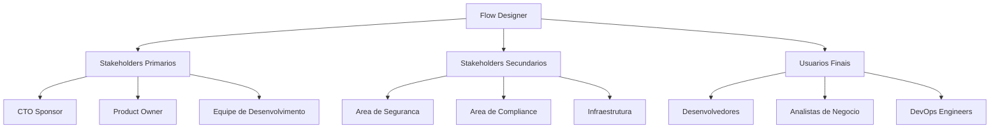
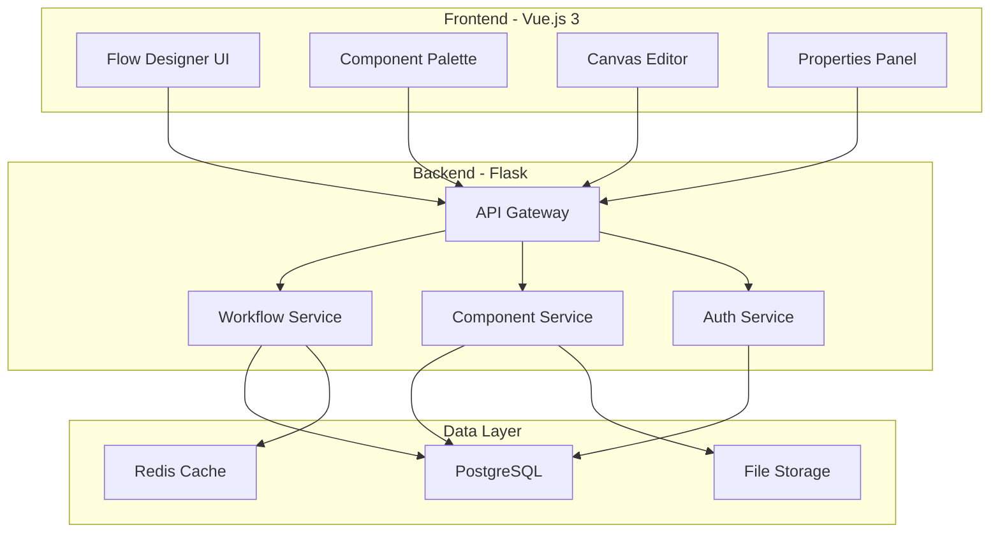
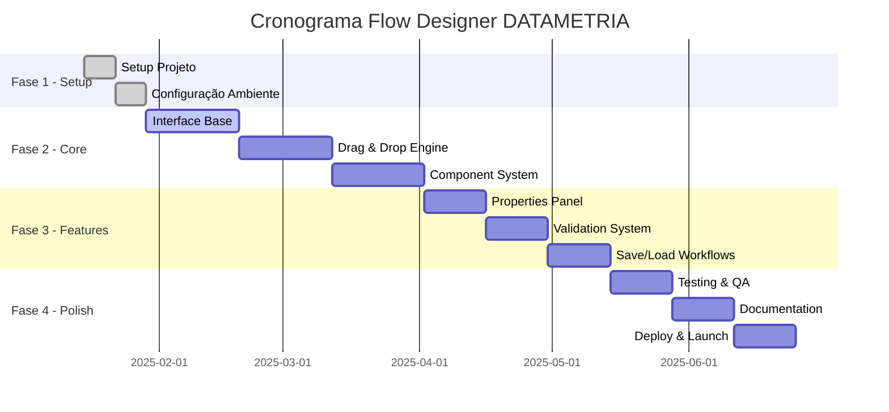
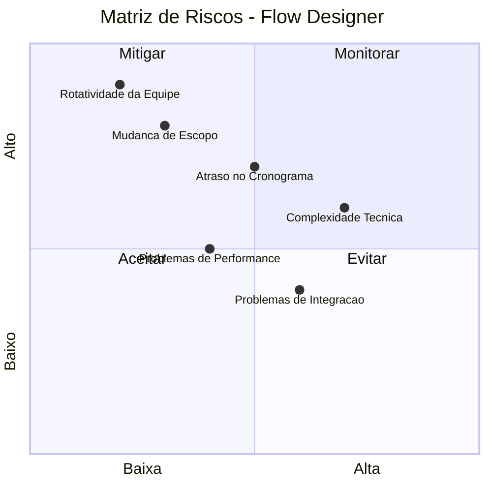
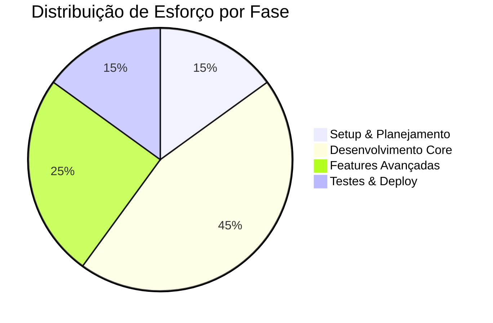

# Documento de Concepção - Flow Designer DATAMETRIA

## Documento de Concepção e Planejamento Inicial

[🎯 Visão](#-visão-do-projeto) • [📋 Escopo](#-escopo-e-objetivos) • [🏗️ Arquitetura](#️-arquitetura-proposta) •
[📅 Cronograma](#-cronograma-e-marcos) • [👥 Equipe](#-equipe-e-recursos)

---

## 📋 Informações Básicas

| Campo | Valor |
|-------|-------|
| **Nome do Projeto** | Flow Designer DATAMETRIA |
| **Código do Projeto** | PROJ-2025-001 |
| **Sponsor** | Marcelo Cunha, CEO DATAMETRIA |
| **Product Owner** | Vander Loto |
| **Tech Lead** | Equipe de Desenvolvimento DATAMETRIA |
| **Data de Concepção** | 13/09/2025 |
| **Prazo Estimado** | 30/06/2025 |
| **Orçamento Estimado** | R$ 137.240,00 |
| **Prioridade** | Alta |

---

## 🎯 Visão do Projeto

### Problema a Resolver

#### Contexto

Atualmente, a criação de workflows e automações requer conhecimento técnico avançado, limitando a capacidade de usuários não-técnicos de criar e gerenciar processos automatizados. Ferramentas existentes como N8N são complexas ou não atendem às necessidades específicas de compliance e segurança empresarial.

#### Dor Identificada

- **Barreira Técnica**: 85% dos usuários não conseguem criar automações sem suporte técnico
- **Tempo de Desenvolvimento**: 3-5 dias para criar workflows simples
- **Manutenção Complexa**: Dificuldade para modificar fluxos existentes
- **Falta de Padronização**: Cada equipe usa ferramentas diferentes

#### Impacto Atual

- **Custo**: R$ 50.000/mês em horas de desenvolvimento manual
- **Eficiência**: 60% do tempo gasto em tarefas repetitivas
- **Qualidade**: 30% de erros em processos manuais
- **Escalabilidade**: Impossibilidade de escalar automações

### Solução Proposta

#### Visão Geral

Desenvolver uma plataforma visual de criação de workflows (Flow Designer) que permita a usuários técnicos e não-técnicos criar, editar e gerenciar automações através de interface drag-and-drop intuitiva, seguindo padrões DATAMETRIA de qualidade e segurança.

#### Valor Agregado

- **Democratização**: Usuários não-técnicos podem criar automações
- **Produtividade**: Redução de 80% no tempo de criação de workflows
- **Qualidade**: Padronização e validação automática de fluxos
- **Manutenibilidade**: Interface visual facilita modificações
- **Compliance**: Auditoria e controle de versões integrados

#### Diferencial Competitivo

- **DATAMETRIA Standards**: Compliance nativo com diretrizes empresariais
- **Multi-Stack**: Suporte a Vue.js, Flask, AWS, Python
- **Security by Design**: Segurança integrada desde a concepção
- **Enterprise Ready**: Auditoria, versionamento, permissões

### Justificativa do Projeto

#### ROI Esperado

- **Investimento**: R$ 137.240
- **Retorno Anual**: R$ 600.000
- **Payback**: 3 meses
- **ROI %**: 437%

#### Benefícios Quantitativos

- **Redução de Tempo**: 80% menos tempo para criar workflows (de 5 dias para 1 dia)
- **Redução de Erros**: 70% menos erros em processos automatizados
- **Aumento de Produtividade**: 150% mais automações criadas por mês
- **Economia de Custos**: R$ 40.000/mês em desenvolvimento manual

#### Benefícios Qualitativos

- Melhoria na experiência do usuário interno
- Padronização de processos organizacionais
- Redução de dependência técnica
- Maior agilidade na implementação de mudanças

---

## 📋 Escopo e Objetivos

### Objetivos SMART

| Objetivo | Específico | Mensurável | Atingível | Relevante | Temporal |
|----------|------------|------------|-----------|-----------|----------|
| **Plataforma Funcional** | Desenvolver Flow Designer com drag-drop | 100% das funcionalidades core | Equipe experiente + 6 meses | Reduz 80% tempo desenvolvimento | 30/06/2025 |
| **Adoção Interna** | Implementar em 3 projetos piloto | 15 usuários ativos mensais | Treinamento + suporte | Valida proposta de valor | 31/07/2025 |
| **Performance** | Interface responsiva e rápida | <2s tempo resposta, 99.5% uptime | Stack Vue.js + otimizações | Experiência profissional | 30/06/2025 |

### Escopo do Projeto

#### ✅ Dentro do Escopo

#### Funcionalidades Core

- [ ] Interface drag-and-drop para criação de workflows
- [ ] Palette de componentes categorizados (Triggers, Actions, Conditions, Data, Integrations)
- [ ] Canvas de desenho com zoom, pan e grid
- [ ] Sistema de conexões visuais entre componentes
- [ ] Painel de propriedades dinâmico para configuração
- [ ] Validação em tempo real de configurações
- [ ] Save/Load de workflows em formato JSON
- [ ] Export para diferentes formatos (JSON, YAML)

#### Componentes Iniciais

- [ ] HTTP Trigger (webhook, API calls)
- [ ] Database Query (PostgreSQL, MySQL, SQLite)
- [ ] Email Action (envio de emails)
- [ ] Conditional Logic (if/else, switch)
- [ ] Data Transformation (map, filter, transform)
- [ ] File Operations (read, write, upload)
- [ ] Timer/Schedule (cron jobs)
- [ ] Notification (Slack, Teams, SMS)

#### Funcionalidades de Suporte

- [ ] Sistema de autenticação e autorização
- [ ] Versionamento de workflows
- [ ] Histórico de alterações
- [ ] Comentários e anotações
- [ ] Busca e filtros na palette
- [ ] Atalhos de teclado
- [ ] Tutorial interativo
- [ ] Documentação integrada

#### ❌ Fora do Escopo

- Execução de workflows em produção (apenas design)
- Integração com sistemas externos específicos
- Marketplace de componentes
- Colaboração em tempo real
- Mobile app nativo
- Integrações com ferramentas de terceiros não listadas

#### 🔄 Escopo Futuro (Roadmap)

- **Fase 2**: Engine de execução de workflows
- **Fase 3**: Marketplace de componentes customizados
- **Fase 4**: Colaboração em tempo real
- **Fase 5**: Mobile app para monitoramento

### Critérios de Sucesso

| Critério | Métrica | Meta | Método de Medição |
|----------|---------|------|-------------------|
| **Usabilidade** | SUS Score | > 80 pontos | Pesquisa com usuários |
| **Performance** | Tempo de resposta | < 2 segundos | Monitoramento automático |
| **Adoção** | Usuários ativos | 15 usuários/mês | Analytics integrado |
| **Qualidade** | Bug rate | < 5 bugs/release | Sistema de tracking |
| **Satisfação** | NPS | > 50 | Pesquisa trimestral |

---

## 👥 Stakeholders e Usuários

### Mapa de Stakeholders

### Personas dos Usuários

#### Persona 1: Ana - Desenvolvedora Full-Stack

- **Perfil**: Desenvolvedora com 5 anos de experiência
- **Objetivos**: Criar automações rapidamente sem código repetitivo
- **Dores**: Tempo gasto em tarefas manuais, dificuldade para documentar processos
- **Comportamento**: Usa ferramentas visuais, prefere interfaces intuitivas
- **Necessidades**: Interface rápida, componentes reutilizáveis, export de código

#### Persona 2: Carlos - Analista de Negócio

- **Perfil**: Analista com conhecimento técnico básico
- **Objetivos**: Criar workflows simples sem depender de desenvolvedores
- **Dores**: Dependência técnica, demora para implementar mudanças
- **Comportamento**: Prefere interfaces visuais, evita código
- **Necessidades**: Interface intuitiva, validação automática, templates prontos

#### Persona 3: Maria - DevOps Engineer

- **Perfil**: Especialista em infraestrutura e automação
- **Objetivos**: Criar pipelines de CI/CD e automações de infraestrutura
- **Dores**: Ferramentas fragmentadas, falta de padronização
- **Comportamento**: Valoriza eficiência e padronização
- **Necessidades**: Integração com ferramentas existentes, versionamento, auditoria

---

## 🏗️ Arquitetura Proposta

### Stack Tecnológico DATAMETRIA

**Tipo de Projeto**: Web Application (SPA)

#### Frontend

- **Framework**: Vue.js 3 (Composition API)
- **UI Library**: Vue Material + Tailwind CSS
- **Estado**: Pinia Store
- **Build**: Vite
- **Drag & Drop**: Vue.Draggable + Native HTML5 API

#### Backend

- **Framework**: Flask + Flask-RESTX
- **Database**: PostgreSQL (workflows) + Redis (cache)
- **ORM**: SQLAlchemy Core
- **Authentication**: JWT + Flask-JWT-Extended

#### Infraestrutura

- **Cloud**: AWS (ECS + RDS + ElastiCache)
- **Container**: Docker + Docker Compose
- **CI/CD**: GitHub Actions
- **Monitoramento**: CloudWatch + Sentry

### Diagrama de Arquitetura

### Componentes da Arquitetura

#### Frontend Components

- **Flow Designer UI**: Interface principal com drag-and-drop
- **Component Palette**: Biblioteca de componentes disponíveis
- **Canvas Editor**: Área de desenho dos workflows
- **Properties Panel**: Configuração de propriedades dos componentes

#### Backend Services

- **API Gateway**: Ponto de entrada único para todas as requisições
- **Workflow Service**: Gerenciamento de workflows (CRUD, validação)
- **Component Service**: Gerenciamento de componentes e templates
- **Auth Service**: Autenticação e autorização

#### Data Layer

- **PostgreSQL**: Armazenamento principal (workflows, usuários, configurações)
- **Redis Cache**: Cache de sessões e dados temporários
- **File Storage**: Armazenamento de assets e exports

---

## 📅 Cronograma e Marcos

### Fases do Projeto

### Marcos Principais

| Marco | Data | Entregável | Critério de Aceitação |
|-------|------|------------|----------------------|
| **M1 - Setup** | 29/01/2025 | Ambiente configurado | Projeto rodando localmente |
| **M2 - MVP** | 02/04/2025 | Interface básica funcional | Drag-drop + componentes básicos |
| **M3 - Beta** | 14/05/2025 | Versão completa para testes | Todas funcionalidades core |
| **M4 - Launch** | 25/06/2025 | Versão final em produção | Deploy + documentação completa |

### Dependências Críticas

- **Aprovação de Orçamento**: Até 20/01/2025
- **Definição de Requisitos**: Até 25/01/2025
- **Setup de Infraestrutura**: Até 05/02/2025
- **Aprovação de Design**: Até 15/02/2025

---

## 👥 Equipe e Recursos

### Estrutura da Equipe

| Papel | Responsável | Dedicação | Período |
|-------|-------------|-----------|----------|
| **Product Owner** | Vander Loto | 20% | Jan-Jun 2025 |
| **Tech Lead** | [A definir] | 100% | Jan-Jun 2025 |
| **Frontend Developer** | [A definir] | 100% | Jan-Jun 2025 |
| **Backend Developer** | [A definir] | 100% | Fev-Jun 2025 |
| **UX/UI Designer** | [A definir] | 50% | Jan-Mar 2025 |
| **QA Engineer** | [A definir] | 50% | Abr-Jun 2025 |

### Matriz RACI

| Atividade | PO | Tech Lead | Frontend | Backend | Designer | QA |
|-----------|----|-----------|---------|---------|---------|----|
| **Definição de Requisitos** | A | R | C | C | C | I |
| **Arquitetura Técnica** | A | R | C | C | I | I |
| **Design de Interface** | A | C | C | I | R | I |
| **Desenvolvimento Frontend** | I | A | R | C | C | C |
| **Desenvolvimento Backend** | I | A | C | R | I | C |
| **Testes e QA** | A | C | C | C | I | R |

**Legenda**: R=Responsável, A=Aprovador, C=Consultado, I=Informado

### Recursos Necessários

#### Recursos Humanos

- **6 profissionais** por 6 meses
- **Custo total**: R$ 120.000 (salários + encargos)
- **Consultoria especializada**: R$ 15.000 (UX/UI)

#### Recursos Tecnológicos

- **Infraestrutura AWS**: R$ 1.200/mês x 6 meses = R$ 7.200
- **Ferramentas de desenvolvimento**: R$ 2.400
- **Licenças e subscriptions**: R$ 1.800

#### Recursos de Apoio

- **Treinamento da equipe**: R$ 5.000
- **Documentação e marketing**: R$ 3.000
- **Contingência (10%)**: R$ 12.240

**Total Geral**: R$ 137.240

---

## 💰 Análise Financeira

### Investimento Detalhado

| Categoria | Item | Valor (R$) | Justificativa |
|-----------|------|------------|---------------|
| **Pessoal** | Salários + Encargos | 120.000 | 6 pessoas x 6 meses |
| **Consultoria** | UX/UI Specialist | 15.000 | Design profissional |
| **Infraestrutura** | AWS + Ferramentas | 11.400 | Ambiente completo |
| **Treinamento** | Capacitação | 5.000 | Upskilling da equipe |
| **Marketing** | Documentação | 3.000 | Material de apoio |
| **Contingência** | Reserva técnica | 12.240 | 10% do total |
| **TOTAL** | | **137.240** | |

### Projeção de Retorno

#### Economia Anual Esperada

- **Redução de desenvolvimento manual**: R$ 480.000/ano
- **Redução de erros e retrabalho**: R$ 120.000/ano
- **Total de economia**: R$ 600.000/ano

#### Análise de ROI

- **Investimento inicial**: R$ 137.240
- **Retorno anual**: R$ 600.000
- **Payback period**: 2.7 meses
- **ROI (3 anos)**: 1.307%
- **NPV (3 anos, 10% desconto)**: R$ 1.354.000

### Análise de Riscos Financeiros

| Risco | Probabilidade | Impacto | Mitigação |
|-------|---------------|---------|-----------|
| **Atraso no cronograma** | Média | R$ 20.000 | Buffer de 15% no cronograma |
| **Mudança de escopo** | Baixa | R$ 30.000 | Controle rigoroso de mudanças |
| **Problemas técnicos** | Baixa | R$ 15.000 | Prototipagem e validação prévia |
| **Rotatividade da equipe** | Baixa | R$ 25.000 | Contratos bem estruturados |

---

## 🎯 Análise de Mercado

### Benchmarking Competitivo

| Ferramenta | Pontos Fortes | Pontos Fracos | Preço |
|------------|---------------|---------------|-------|
| **N8N** | Open source, flexível | Complexo, sem suporte enterprise | Gratuito |
| **Zapier** | Fácil de usar, muitas integrações | Limitado, caro para uso intensivo | $20-599/mês |
| **Microsoft Power Automate** | Integração Office, enterprise | Limitado fora do ecossistema MS | $15-40/usuário |
| **Integromat/Make** | Visual, poderoso | Curva de aprendizado, preço | $9-299/mês |

### Posicionamento DATAMETRIA

#### Vantagens Competitivas

- **Compliance nativo**: LGPD/GDPR by design
- **Stack unificado**: Integração com padrões DATAMETRIA
- **Customização**: Adaptável às necessidades específicas
- **Suporte local**: Equipe brasileira, fuso horário
- **Segurança**: Security by design, auditoria completa

#### Proposta de Valor Única

> "A única plataforma de workflow design que combina simplicidade visual com compliance empresarial nativo, seguindo os mais altos padrões de segurança e qualidade do mercado brasileiro."

---

## 🔍 Análise de Riscos

### Matriz de Riscos

### Riscos Identificados

| Risco | Probabilidade | Impacto | Estratégia | Responsável |
|-------|---------------|---------|------------|-------------|
| **Complexidade técnica do drag-drop** | Alta | Médio | Prototipagem prévia, bibliotecas testadas | Tech Lead |
| **Mudança de requisitos** | Baixa | Alto | Controle de mudanças rigoroso | Product Owner |
| **Atraso no cronograma** | Média | Alto | Buffer de 15%, marcos intermediários | Tech Lead |
| **Problemas de performance** | Média | Médio | Testes de carga, otimização contínua | Backend Dev |
| **Rotatividade da equipe** | Baixa | Alto | Contratos, documentação detalhada | RH |
| **Integração com sistemas** | Alta | Baixo | APIs bem definidas, testes automatizados | Backend Dev |

### Planos de Contingência

#### Risco: Atraso no Cronograma

**Trigger**: Atraso > 2 semanas em qualquer marco

**Ações**:

1. Revisão de escopo com Product Owner
2. Realocação de recursos de outras áreas
3. Extensão de prazo com aprovação do sponsor
4. Redução de funcionalidades não-críticas

#### Risco: Problemas Técnicos Críticos

**Trigger**: Bloqueio técnico > 3 dias

**Ações**:

1. Consultoria externa especializada
2. Mudança de abordagem técnica
3. Uso de bibliotecas alternativas
4. Escalação para CTO

---

## 📊 Métricas de Sucesso

### KPIs do Projeto

| Categoria | Métrica | Meta | Método de Medição |
|-----------|---------|------|-------------------|
| **Qualidade** | Bug density | < 5 bugs/KLOC | Tracking de bugs |
| **Performance** | Load time | < 2s | Monitoramento automático |
| **Usabilidade** | SUS Score | > 80 | Pesquisa com usuários |
| **Adoção** | Usuários ativos | 15/mês | Analytics |
| **Produtividade** | Workflows criados | 50/mês | Métricas de uso |

### Métricas de Negócio

| Métrica | Baseline | Meta 6 meses | Meta 1 ano |
|---------|----------|--------------|------------|
| **Tempo médio criação workflow** | 5 dias | 1 dia | 4 horas |
| **Taxa de erro em processos** | 30% | 15% | 5% |
| **Satisfação do usuário** | N/A | NPS > 50 | NPS > 70 |
| **ROI acumulado** | 0% | 200% | 400% |

### Dashboard de Acompanhamento

---

## 🚀 Próximos Passos

### Ações Imediatas (Próximas 2 semanas)

- [ ] **Aprovação do documento** pelo sponsor (Marcelo Cunha)
- [ ] **Aprovação de orçamento** pela diretoria
- [ ] **Definição da equipe** e contratações necessárias
- [ ] **Setup do ambiente** de desenvolvimento
- [ ] **Criação do repositório** e estrutura inicial

### Fase de Preparação (Semanas 3-4)

- [ ] **Refinamento de requisitos** com stakeholders
- [ ] **Criação de wireframes** e protótipos
- [ ] **Definição da arquitetura** detalhada
- [ ] **Setup de infraestrutura** AWS
- [ ] **Configuração de CI/CD** pipeline

### Início do Desenvolvimento (Semana 5)

- [ ] **Kickoff oficial** do projeto
- [ ] **Sprint planning** da primeira sprint
- [ ] **Início do desenvolvimento** da interface base
- [ ] **Setup de monitoramento** e métricas

### Critérios para Prosseguir

- ✅ **Orçamento aprovado** pela diretoria
- ✅ **Equipe completa** contratada e onboarded
- ✅ **Ambiente técnico** configurado e testado
- ✅ **Requisitos detalhados** validados com usuários
- ✅ **Arquitetura técnica** aprovada pelo CTO

---

## 📚 Anexos

### Referências Técnicas

- **[Vue.js 3 Documentation](https://vuejs.org/)** - Framework frontend
- **[Flask Documentation](https://flask.palletsprojects.com/)** - Framework backend
- **[Vue.Draggable](https://github.com/SortableJS/Vue.Draggable)** - Biblioteca drag-and-drop
- **[Mermaid.js](https://mermaid-js.github.io/)** - Diagramas e visualizações

### Templates Relacionados

- **[Template README](template-readme.md)** - Documentação do projeto
- **[Template ADR](template-adr.md)** - Decisões arquiteturais
- **[Template API Documentation](template-api-documentation.md)** - Documentação de APIs
- **[Template Technical Specification](template-technical-specification.md)** - Especificação técnica

### Estudos de Caso

- **Zapier**: Como construir uma plataforma de automação escalável
- **N8N**: Arquitetura de workflow engine open source
- **Microsoft Power Automate**: UX patterns para workflow designers

---

#### Documento de Concepção - Flow Designer DATAMETRIA

**Versão**: 1.0.0 | **Data**: 13/09/2025 | **Autor**: Vander Loto

---

**Aprovações Necessárias**: CEO (Marcelo Cunha) • CTO (Vander Loto) • Diretoria Financeira

