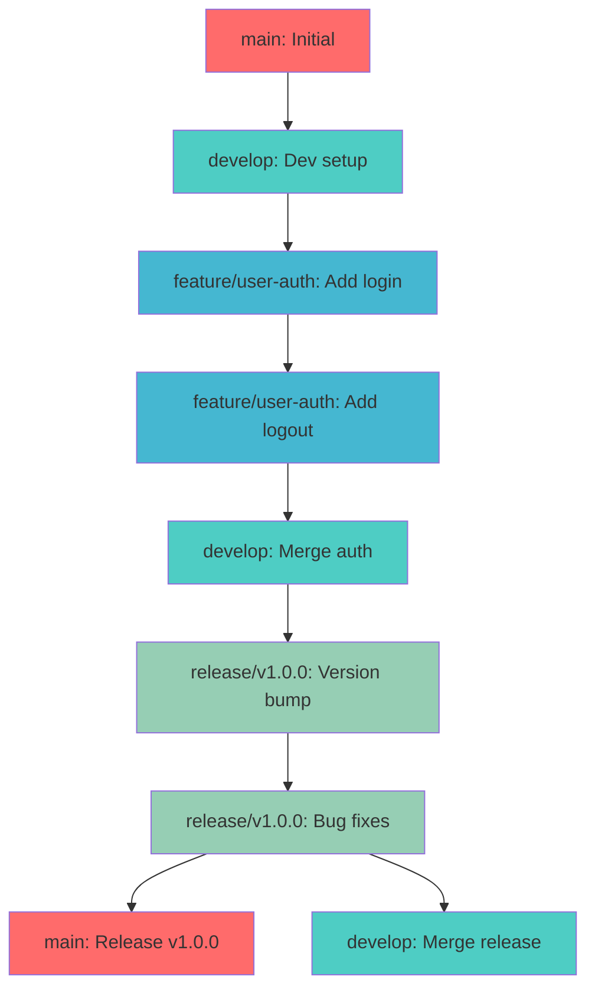
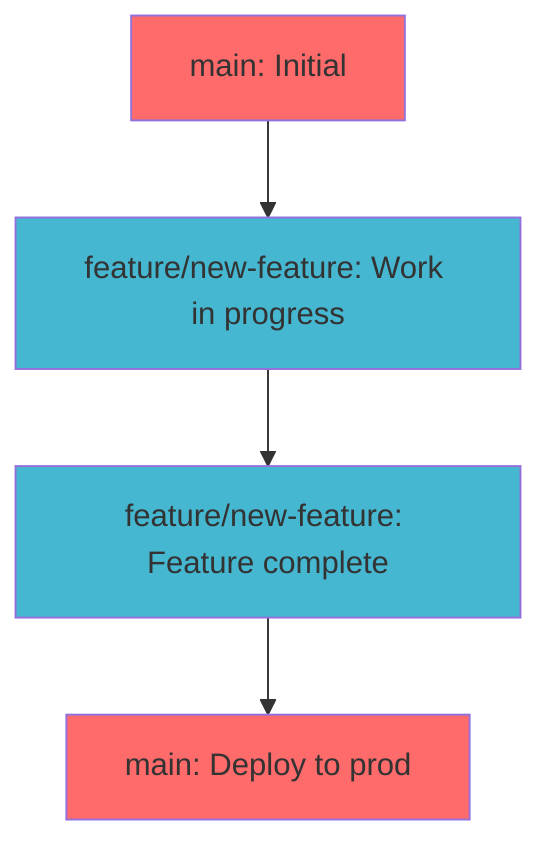
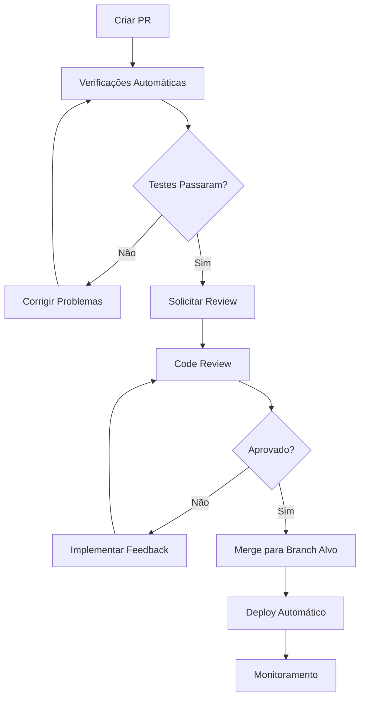
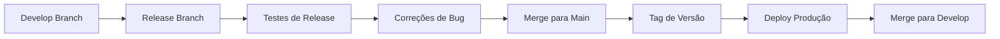
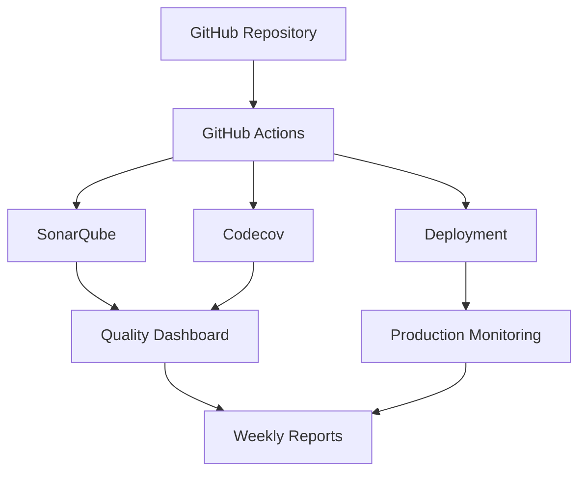

# Template de Git Workflow

<div align="center">

## Guia Completo de Fluxo de Trabalho Git/GitHub - Framework Enterprise

[](https://git-scm.com)
[](https://github.com)
[](https://pre-commit.com)
[](https://conventionalcommits.org)
[](https://github.com/datametria/standards)
[](https://aws.amazon.com/q/)

[🔗 Template Original](link) • [🔗 Diretrizes](link) • [🔗 Exemplos](link)

[🌿 Branching](#-estratégia-de-branching) • [📝 Commits](#-padrões-de-commit) • [🔄 Pull Requests](#-pull-requests) •
[🚀 Release](#-release-e-versionamento) • [🔍 Verificações](#-verificações-pré-commit)

</div>

---

## 📋 Índice

- [🎯 Visão Geral](#-visão-geral)
- [📋 Informações do Projeto](#-informações-do-projeto)
- [🌿 Estratégia de Branching](#-estratégia-de-branching)
- [📝 Padrões de Commit](#-padrões-de-commit)
- [🔍 Verificações Pré-Commit](#-verificações-pré-commit)
- [🔄 Pull Requests](#-pull-requests)
- [🚀 Release e Versionamento](#-release-e-versionamento)
- [🛠️ Configuração do Ambiente](#️-configuração-do-ambiente)
- [📊 Métricas e Monitoramento](#-métricas-e-monitoramento)
- [🔗 Referências](#-referências)

---

## 🎯 Visão Geral

### Framework Git Workflow DATAMETRIA

Este template estabelece um fluxo de trabalho Git/GitHub padronizado para projetos DATAMETRIA, integrando:

- **🌿 Git Flow Enterprise**: Estratégia de branching robusta
- **📝 Conventional Commits**: Padronização de mensagens
- **🔍 Pre-commit Hooks**: Verificações automáticas de qualidade
- **🔄 Pull Request Process**: Revisão de código estruturada
- **🚀 Release Automation**: Versionamento semântico automatizado
- **🤖 Amazon Q Integration**: Contexto automático para IA

### Benefícios

- ✅ **Qualidade**: Verificações automáticas antes de cada commit
- ✅ **Consistência**: Padrões uniformes em toda a organização
- ✅ **Rastreabilidade**: Histórico claro de mudanças
- ✅ **Automação**: Deploy e release automatizados
- ✅ **Colaboração**: Processo estruturado de code review
- ✅ **Compliance**: Auditoria e governança integradas

---

## 📋 Informações do Projeto

| Campo | Descrição | Exemplo |
|-------|-----------|----------|
| **Nome do Projeto** | [Nome do projeto] | Sistema de Autenticação DATAMETRIA |
| **Repositório** | [URL do repositório] | https://github.com/datametria/auth-system |
| **Estratégia de Branch** | [Git Flow / GitHub Flow] | Git Flow (projetos complexos) |
| **Ambiente de Produção** | [URL de produção] | https://auth.datametria.io |
| **Ambiente de Staging** | [URL de staging] | https://auth-staging.datametria.io |
| **Responsável Técnico** | [Nome do tech lead] | Vander Loto (CTO) |
| **CI/CD Pipeline** | [GitHub Actions / GitLab CI] | GitHub Actions |
| **Code Coverage** | [Cobertura mínima] | 85% |
| **Quality Gate** | [SonarQube / CodeClimate] | SonarQube |

---

## 🌿 Estratégia de Branching

### Git Flow (Projetos Complexos)



#### Branches Principais

#### 🌟 main/master

- Código de produção
- Sempre estável e deployável
- Protegida contra push direto
- Apenas merges via Pull Request

#### 🚧 develop

- Branch de integração
- Código em desenvolvimento
- Base para features branches
- Reflete próxima release

#### Branches de Suporte

#### ✨ feature/[nome-da-feature]

```bash
# Criar feature branch
git checkout develop
git pull origin develop
git checkout -b feature/user-authentication

# Desenvolver feature
git add .
git commit -m "feat: add user login functionality"

# Push para remote
git push -u origin feature/user-authentication
```

#### 🐛 bugfix/[nome-do-bug]

```bash
# Criar bugfix branch
git checkout develop
git pull origin develop
git checkout -b bugfix/fix-login-validation

# Corrigir bug
git add .
git commit -m "fix: resolve login validation issue"

# Push para remote
git push -u origin bugfix/fix-login-validation
```

#### 🚀 release/[versão]

```bash
# Criar release branch
git checkout develop
git pull origin develop
git checkout -b release/v1.2.0

# Preparar release
git add .
git commit -m "chore: bump version to 1.2.0"

# Push para remote
git push -u origin release/v1.2.0
```

#### 🔥 hotfix/[nome-do-hotfix]

```bash
# Criar hotfix branch (a partir da main)
git checkout main
git pull origin main
git checkout -b hotfix/critical-security-fix

# Aplicar correção crítica
git add .
git commit -m "fix: resolve critical security vulnerability"

# Push para remote
git push -u origin hotfix/critical-security-fix
```

### GitHub Flow (Projetos Simples)



### Fluxo Simplificado

1. **main** branch sempre deployável
2. **feature branches** para desenvolvimento
3. **Pull Requests** para code review
4. **Merge** direto para main
5. **Deploy** automático após merge

---

## 📝 Padrões de Commit

### Conventional Commits

#### Formato

```
<type>[optional scope]: <description>

[optional body]

[optional footer(s)]
```

#### Tipos de Commit

| Tipo | Descrição | Exemplo |
|------|-----------|---------|
| **feat** | Nova funcionalidade | `feat: add user authentication` |
| **fix** | Correção de bug | `fix: resolve login validation error` |
| **docs** | Documentação | `docs: update API documentation` |
| **style** | Formatação, espaços | `style: fix code formatting` |
| **refactor** | Refatoração de código | `refactor: simplify user service` |
| **test** | Adicionar/modificar testes | `test: add unit tests for auth` |
| **chore** | Tarefas de manutenção | `chore: update dependencies` |
| **perf** | Melhoria de performance | `perf: optimize database queries` |
| **ci** | CI/CD changes | `ci: add GitHub Actions workflow` |
| **build** | Build system changes | `build: update webpack config` |
| **revert** | Reverter commit anterior | `revert: revert feat: add user auth` |

#### Exemplos Práticos

```bash
# Feature nova
git commit -m "feat(auth): add JWT token validation"

# Bug fix
git commit -m "fix(api): resolve 500 error on user creation"

# Documentação
git commit -m "docs(readme): add installation instructions"

# Breaking change
git commit -m "feat!: change API response format

BREAKING CHANGE: API now returns data in different structure"

# Com scope e body
git commit -m "feat(user): add profile picture upload

- Add multer middleware for file upload
- Implement image resizing with sharp
- Add validation for file types and size"
```

### Commit Message Guidelines

### Boas Práticas

- **Imperativo**: Use modo imperativo ("add" não "added")
- **Minúsculo**: Primeira letra minúscula
- **Sem ponto**: Não termine com ponto final
- **Limite**: Máximo 50 caracteres no título
- **Corpo**: Explique o "porquê", não o "como"

#### Template de Commit

```bash
# Configurar template global
git config --global commit.template ~/.gitmessage

# Criar template ~/.gitmessage
# <type>[optional scope]: <description>
#
# [optional body]
#
# [optional footer(s)]
```

---

## 🔍 Verificações Pré-Commit

### Configuração de Pre-commit Hooks

#### Instalação

```bash
# Instalar pre-commit
pip install pre-commit

# Instalar hooks no repositório
pre-commit install
```

### Configuração (.pre-commit-config.yaml)

```yaml
repos:
  - repo: https://github.com/psf/black
    rev: 23.9.1
    hooks:
      - id: black
        language_version: python3.11
        args: [--line-length=88]

  - repo: https://github.com/pycqa/flake8
    rev: 6.1.0
    hooks:
      - id: flake8
        args: [--max-line-length=88, --extend-ignore=E203,W503]

  - repo: https://github.com/pre-commit/mirrors-mypy
    rev: v1.5.1
    hooks:
      - id: mypy
        additional_dependencies: [types-all]
        args: [--ignore-missing-imports]

  - repo: https://github.com/igorshubovych/markdownlint-cli
    rev: v0.37.0
    hooks:
      - id: markdownlint
        args: [--fix, --config, .markdownlint.json]
        files: \.md$

  - repo: https://github.com/pre-commit/pre-commit-hooks
    rev: v4.4.0
    hooks:
      - id: trailing-whitespace
      - id: end-of-file-fixer
      - id: check-yaml
      - id: check-json
      - id: check-merge-conflict
```

### Verificações Manuais

#### Python Code Quality

```bash
# Black - Formatação de código
black --check --diff .

# Flake8 - Linting
flake8 . --count --select=E9,F63,F7,F82 --show-source --statistics

# MyPy - Type checking
mypy . --ignore-missing-imports

# Executar todos juntos
black . && flake8 . && mypy .
```

### Markdown Linting

```bash
# Markdownlint com configuração DATAMETRIA
markdownlint **/*.md --fix --config .markdownlint.json

# Verificar regras específicas
# MD047: Files should end with a single newline character
markdownlint **/*.md --config .markdownlint.json --rules MD047

# Verificar links quebrados
markdown-link-check **/*.md

# Corrigir automaticamente problemas de fim de arquivo
find . -name "*.md" -exec sed -i -e '$a\' {} \;
```

### Regras Markdown Importantes

| Regra | Descrição | Como Corrigir |
|-------|-----------|---------------|
| **MD047** | Arquivos devem terminar com uma única quebra de linha | Adicionar `\n` no final |
| **MD013** | Linha muito longa (>120 caracteres) | Quebrar linha ou usar tabelas |
| **MD033** | HTML inline não permitido | Usar apenas elementos permitidos |
| **MD041** | Primeiro linha deve ser H1 | Começar com `# Título` |

### Configuração .markdownlint.json

```json
{
  "default": true,
  "MD013": {
    "line_length": 120,
    "code_blocks": false,
    "tables": false,
    "headings": false
  },
  "MD033": {
    "allowed_elements": ["div", "img", "br", "details", "summary"]
  },
  "MD041": false,
  "MD047": true
}
```

### Fluxo de Commit com Verificações

```bash
# 1. Verificar mudanças
git status
git diff

# 2. Executar verificações manuais (opcional)
black . && flake8 . && mypy . && markdownlint **/*.md

# 3. Adicionar arquivos
git add .

# 4. Commit (pre-commit hooks executam automaticamente)
git commit -m "feat: add user authentication system"

# 5. Push para remote
git push origin feature/user-authentication

# 6. Criar Pull Request no GitHub
# - Preencher template de PR
# - Aguardar code review
# - Corrigir feedback se necessário
```

---

## 🔄 Pull Requests

### Template de Pull Request

```markdown
## 📋 Descrição

Descreva brevemente as mudanças implementadas.

## 🎯 Tipo de Mudança

- [ ] 🐛 Bug fix (correção que resolve um problema)
- [ ] ✨ Nova feature (funcionalidade que adiciona algo novo)
- [ ] 💥 Breaking change (mudança que quebra compatibilidade)
- [ ] 📚 Documentação (mudanças apenas na documentação)
- [ ] 🎨 Refatoração (mudança que não adiciona feature nem corrige bug)
- [ ] ⚡ Performance (mudança que melhora performance)
- [ ] ✅ Testes (adição ou correção de testes)

## 🧪 Como Testar

1. Faça checkout da branch: `git checkout feature/branch-name`
2. Execute: `npm install` ou `pip install -r requirements.txt`
3. Execute os testes: `npm test` ou `pytest`
4. Verifique funcionalidade: [descrever passos]

## 📝 Checklist

- [ ] Código segue padrões do projeto
- [ ] Self-review realizado
- [ ] Comentários adicionados em código complexo
- [ ] Documentação atualizada
- [ ] Testes adicionados/atualizados
- [ ] Testes passando localmente
- [ ] Mudanças não quebram funcionalidades existentes

## 📸 Screenshots (se aplicável)

[Adicionar screenshots se mudanças visuais]

## 🔗 Issues Relacionadas

Fixes #[número da issue]
Closes #[número da issue]
Resolves #[número da issue]
```

### Processo de Code Review



#### Critérios de Aprovação

- ✅ **Funcionalidade**: Código funciona conforme especificado
- ✅ **Qualidade**: Segue padrões de código do projeto
- ✅ **Testes**: Cobertura adequada e testes passando
- ✅ **Documentação**: Documentação atualizada quando necessário
- ✅ **Segurança**: Não introduz vulnerabilidades
- ✅ **Performance**: Não degrada performance significativamente

---

## 🚀 Release e Versionamento

### Versionamento Semântico

```
MAJOR.MINOR.PATCH
```

- **MAJOR**: Mudanças incompatíveis na API
- **MINOR**: Funcionalidades adicionadas de forma compatível
- **PATCH**: Correções de bugs compatíveis

### Processo de Release



#### Comandos de Release

```bash
# 1. Criar release branch
git checkout develop
git pull origin develop
git checkout -b release/v1.2.0

# 2. Atualizar versão
npm version 1.2.0  # ou manualmente em package.json/setup.py

# 3. Commit mudanças de versão
git add .
git commit -m "chore: bump version to 1.2.0"

# 4. Push release branch
git push -u origin release/v1.2.0

# 5. Criar PR para main
# 6. Após merge, criar tag
git checkout main
git pull origin main
git tag -a v1.2.0 -m "Release version 1.2.0"
git push origin v1.2.0

# 7. Merge de volta para develop
git checkout develop
git merge main
git push origin develop
```

### GitHub Actions para Release

```yaml
# .github/workflows/release.yml
name: Release

on:
  push:
    tags:
      - 'v*'

jobs:
  release:
    runs-on: ubuntu-latest
    steps:
      - uses: actions/checkout@v4

      - name: Create Release
        uses: actions/create-release@v1
        env:
          GITHUB_TOKEN: ${{ secrets.GITHUB_TOKEN }}
        with:
          tag_name: ${{ github.ref }}
          release_name: Release ${{ github.ref }}
          draft: false
          prerelease: false
```

---

## 🛠️ Configuração do Ambiente

### Configuração Inicial do Git

```bash
# Configuração global
git config --global user.name "Seu Nome"
git config --global user.email "seu.email@datametria.io"
git config --global init.defaultBranch main
git config --global pull.rebase false

# Configurar template de commit
git config --global commit.template ~/.gitmessage

# Criar template ~/.gitmessage
echo "# <type>[optional scope]: <description>
#
# [optional body]
#
# [optional footer(s)]" > ~/.gitmessage
```

### Aliases Úteis

```bash
# Aliases para Git
git config --global alias.co checkout
git config --global alias.br branch
git config --global alias.ci commit
git config --global alias.st status
git config --global alias.unstage 'reset HEAD --'
git config --global alias.last 'log -1 HEAD'
git config --global alias.visual '!gitk'
git config --global alias.graph 'log --oneline --graph --decorate --all'
git config --global alias.amend 'commit --amend --no-edit'
```

### Configuração de Hooks

```bash
# Instalar pre-commit globalmente
pip install pre-commit

# No repositório do projeto
pre-commit install
pre-commit install --hook-type commit-msg

# Executar em todos os arquivos
pre-commit run --all-files
```

---

## 📊 Métricas e Monitoramento

### Métricas de Desenvolvimento

| Métrica | Objetivo | Ferramenta |
|---------|----------|------------|
| **Lead Time** | < 2 dias | GitHub Insights |
| **Deployment Frequency** | Diário | GitHub Actions |
| **Change Failure Rate** | < 5% | Monitoramento |
| **Mean Time to Recovery** | < 1 hora | Alertas |
| **Code Coverage** | > 85% | Codecov |
| **Technical Debt** | < 10% | SonarQube |

### Dashboard de Métricas



### Relatórios Automáticos

```bash
# Script para relatório semanal
#!/bin/bash
# weekly-report.sh

echo "📊 Relatório Semanal - $(date)"
echo "================================"

# Commits da semana
echo "📝 Commits desta semana:"
git log --since="1 week ago" --oneline --author="$(git config user.email)"

# Pull Requests
echo "\n🔄 Pull Requests:"
gh pr list --state merged --limit 10

# Issues fechadas
echo "\n✅ Issues fechadas:"
gh issue list --state closed --limit 10
```

---

## 🔗 Referências

### Documentação Oficial

- **[Git Documentation](https://git-scm.com/doc)**: Documentação oficial do Git
- **[GitHub Flow](https://guides.github.com/introduction/flow/)**: Guia oficial do GitHub Flow
- **[Conventional Commits](https://conventionalcommits.org/)**: Especificação de commits convencionais
- **[Semantic Versioning](https://semver.org/)**: Especificação de versionamento semântico

### Ferramentas Recomendadas

| Ferramenta | Propósito | Link |
|------------|-----------|------|
| **Pre-commit** | Hooks de qualidade | [pre-commit.com](https://pre-commit.com) |
| **Commitizen** | Commits padronizados | [commitizen-tools.github.io](https://commitizen-tools.github.io) |
| **GitHub CLI** | Interface de linha de comando | [cli.github.com](https://cli.github.com) |
| **GitKraken** | Interface gráfica | [gitkraken.com](https://gitkraken.com) |
| **Sourcetree** | Interface gráfica | [sourcetreeapp.com](https://sourcetreeapp.com) |

### Templates Relacionados

- **[Template README](template-readme.md)**: Documentação de projeto
- **[Template Changelog](template-changelog.md)**: Histórico de mudanças
- **[Template Release Notes](template-release-notes.md)**: Notas de lançamento
- **[Template Code Review](template-code-review.md)**: Processo de revisão
- **[Template Security Assessment](template-security-assessment.md)**: Avaliação de segurança

---

## ✅ Checklist de Implementação

### Setup Inicial

- [ ] **Repositório** criado com estrutura padrão
- [ ] **Branches** principais configuradas (main, develop)
- [ ] **Branch protection** habilitada para main
- [ ] **Pre-commit hooks** instalados e configurados
- [ ] **GitHub Actions** configurado para CI/CD

### Configuração de Qualidade

- [ ] **Markdownlint** configurado (.markdownlint.json)
- [ ] **Code linting** configurado (Black, Flake8, ESLint)
- [ ] **Type checking** configurado (MyPy, TypeScript)
- [ ] **Test coverage** configurado (>85%)
- [ ] **Security scanning** habilitado

### Processo de Desenvolvimento

- [ ] **Conventional commits** implementado
- [ ] **Pull request template** criado
- [ ] **Code review** processo definido
- [ ] **Release process** automatizado
- [ ] **Documentation** atualizada

### Monitoramento

- [ ] **Métricas** de desenvolvimento configuradas
- [ ] **Alertas** de falha configurados
- [ ] **Dashboard** de qualidade implementado
- [ ] **Relatórios** automáticos configurados

---

<div align="center">

**Desenvolvido por**: Equipe DATAMETRIA
**Última Atualização**: [DD/MM/AAAA]
**Versão**: 2.0.0

---

## Git Workflow Enterprise implementado! Qualidade e automação garantidas! 🚀

</div>
