# Template Mermaid DATAMETRIA

<div align="center">

## Guia Completo de Diagramas Mermaid - Framework Enterprise

[](https://mermaid.js.org)
[](https://www.w3.org/WAI/WCAG21/AA/)
[](https://mermaid.js.org/intro/)
[](https://datametria.io)
[](https://github.com/datametria/standards)
[](https://aws.amazon.com/q/)

[🔗 Template Original](link) • [🔗 Diretrizes](link) • [🔗 Exemplos](link)

[📊 Fluxogramas](#-fluxogramas) • [🔄 Sequência](#-diagramas-de-sequência) • [🏗️ Classes](#️-diagramas-de-classes) •
[📈 Gantt](#-gráficos-de-gantt) • [🎨 Estilos](#-estilos-datametria) • [♿ Acessibilidade](#-acessibilidade)

</div>

---

## 📋 Índice

- [🎯 Visão Geral](#-visão-geral)
- [📊 Fluxogramas](#-fluxogramas)
- [🔄 Diagramas de Sequência](#-diagramas-de-sequência)
- [🏗️ Diagramas de Classes](#️-diagramas-de-classes)
- [🔄 Diagramas de Estado](#-diagramas-de-estado)
- [🗄️ Diagramas ER](#️-diagramas-er)
- [🛣️ Jornada do Usuário](#️-jornada-do-usuário)
- [📅 Gráficos de Gantt](#-gráficos-de-gantt)
- [🍰 Diagramas de Pizza](#-diagramas-de-pizza)
- [🧠 Mindmaps](#-mindmaps)
- [📊 Quadrantes](#-quadrantes)
- [🎨 Estilos DATAMETRIA](#-estilos-datametria)
- [♿ Acessibilidade](#-acessibilidade)
- [🛠️ Melhores Práticas](#️-melhores-práticas)
- [🔗 Referências](#-referências)

---

## 🎯 Visão Geral

### Framework Mermaid DATAMETRIA

Este template fornece diretrizes completas para criação de diagramas Mermaid seguindo os padrões DATAMETRIA, com foco em acessibilidade, consistência visual e melhores práticas enterprise.

#### Configuração de Tema Padrão

**IMPORTANTE**: Todos os diagramas Mermaid devem incluir a configuração de tema no início para garantir compatibilidade com `github-dark.css`:

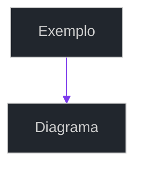

#### Benefícios do Framework

- ✅ **Acessibilidade**: Cores e contrastes WCAG 2.1 AA
- ✅ **Consistência**: Paleta de cores DATAMETRIA padronizada
- ✅ **Legibilidade**: Tipografia e espaçamento otimizados
- ✅ **Manutenibilidade**: Código limpo e bem documentado
- ✅ **Escalabilidade**: Templates reutilizáveis
- ✅ **Performance**: Diagramas otimizados para renderização
- ✅ **Tema Dark**: Compatibilidade com github-dark.css

---

## ✅ Regras de Sintaxe e Boas Práticas

### 📊 Fluxogramas (Flowcharts)

#### Direções e Nós

- **Direções**: `TD` (Top Down), `LR` (Left Right), `BT` (Bottom Top), `RL` (Right Left)
- **Nós básicos**: `[texto]`, `(texto)`, `([texto])`, `{texto}`, `((texto))`
- **Conexões**: `-->`, `---`, `-.-`, `==>`, `-.->`, `===`
- **Labels**: Use `-->|texto|` para labels nas setas

#### Estilos

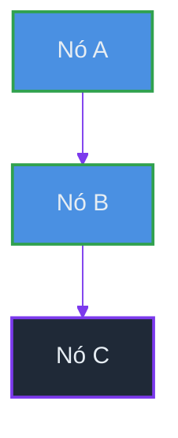

### 🔄 Diagramas de Sequência

#### Participantes

- **Sempre defina** todos os participantes no início:

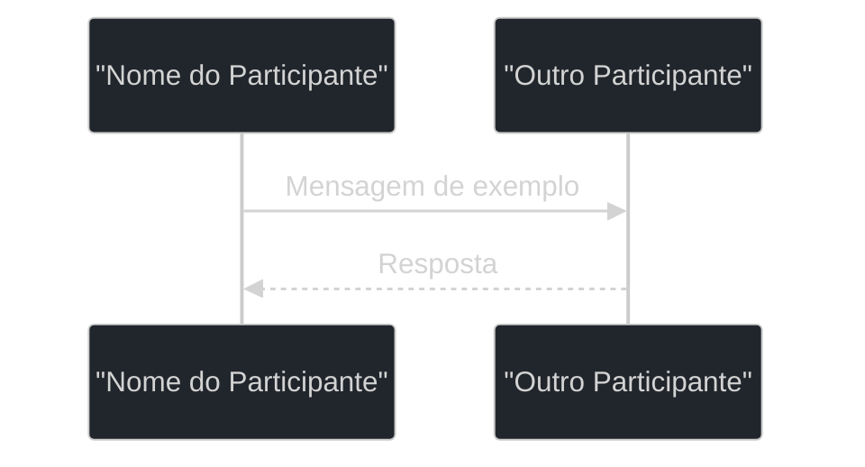

- **Evite emojis** diretos em nomes de participantes
- **Use aspas** para labels com emojis: `participant U as "👤 Usuário"`

#### Mensagens

- **Síncronas**: `->>` para chamadas
- **Assíncronas**: `-->>` para retornos
- **Sempre inclua**: `: Mensagem` após a seta
- **Formato**: `A->>B: Mensagem`

#### Ativação e Desativação

- **Ativar**: `->>+` ativa o participante chamado
- **Desativar**: `-->>-` desativa automaticamente ao retornar
- **⚠️ NUNCA use** `deactivate X` após `-->>-X` → gera erro "Trying to inactivate an inactive participant"
- **Se não precisar** de ativações, use apenas `->>` / `-->>` sem `+` e `-`

#### Blocos Condicionais

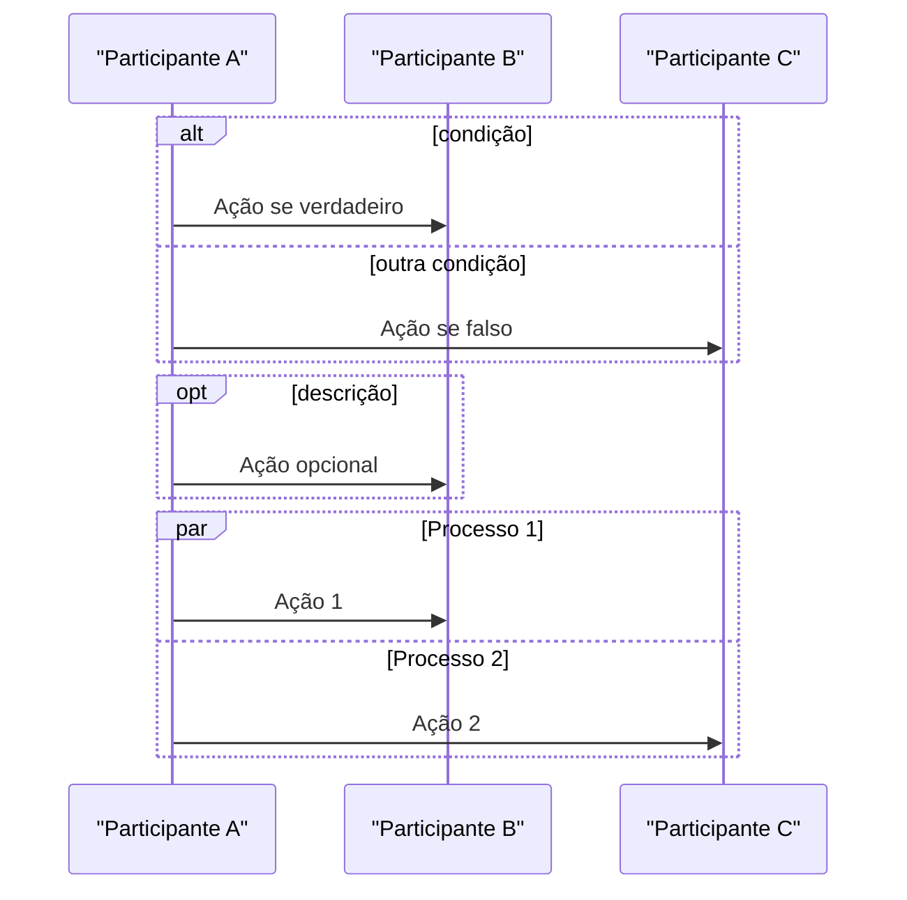

#### Notas

- **Formato**: `Note over A,B: Texto da nota`
- **Quebra de linha**: Use `\n`, não `<br/>`
- **Alinhamento**: Mantenha indentação consistente

### 🏗️ Diagramas de Classes

#### Definição de Classes

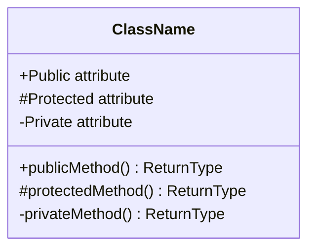

#### Relacionamentos

- **Herança**: `ClassA <|-- ClassB`
- **Composição**: `ClassA *-- ClassB`
- **Agregação**: `ClassA o-- ClassB`
- **Associação**: `ClassA --> ClassB`
- **Dependência**: `ClassA ..> ClassB`

#### Enumerações

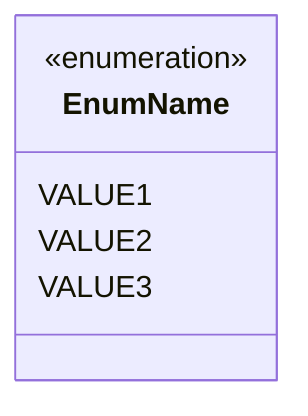

### 🔄 Diagramas de Estado

#### Sintaxe Básica

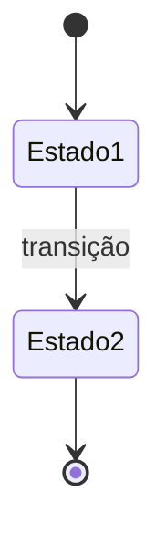

#### Estados Compostos

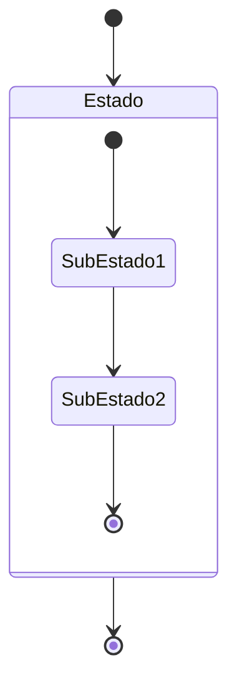

### 🗄️ Diagramas ER

#### Entidades e Atributos

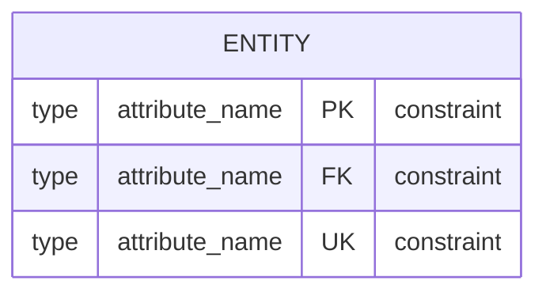

#### Relacionamentos

- **Um para um**: `||--||`
- **Um para muitos**: `||--o{`
- **Muitos para muitos**: `}|--|{`
- **Zero ou muitos**: `}o--o{`

### 🛣️ Jornada do Usuário

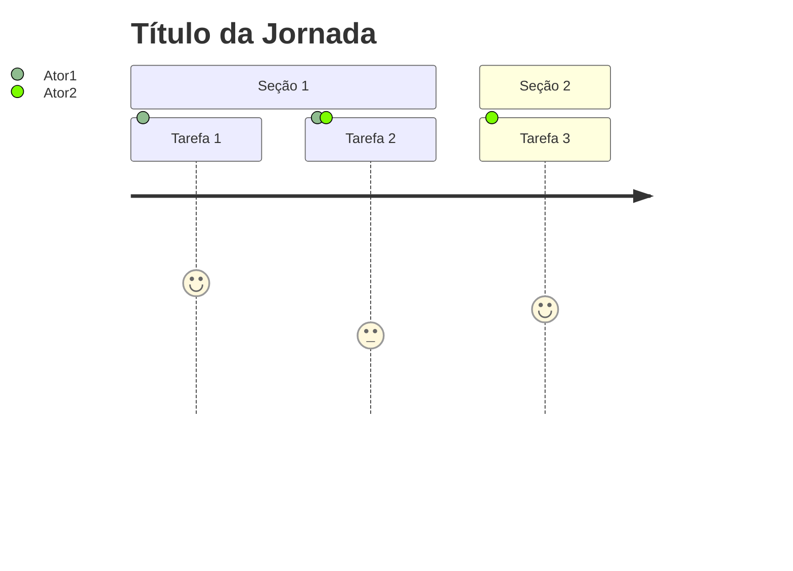

### 📅 Gráficos de Gantt

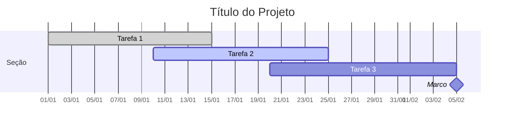

### 🍰 Diagramas de Pizza

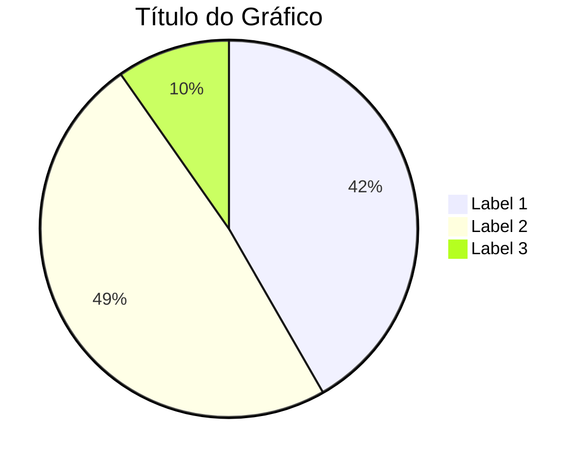

### 🧠 Mindmaps

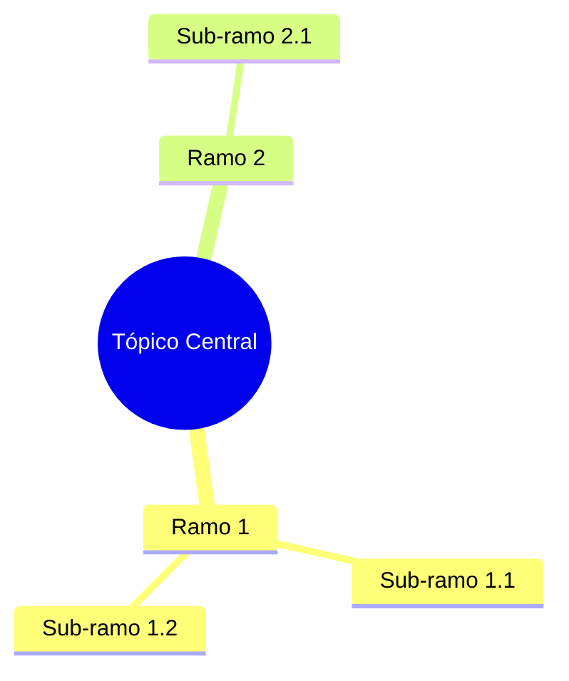

### 🚫 Erros Comuns que Quebram o Renderizador

#### ❌ Evite

- `<br/>` dentro de labels → Use `\n`
- Emojis diretos em `participant` → Use aspas
- `deactivate X` em participantes já desativados
- `->>+` sem correspondente `-->>-`
- Misturar tab e espaço em blocos `alt`/`opt`
- Caracteres especiais não escapados
- Aspas simples em textos com apóstrofes

#### ✅ Use

- Aspas duplas para textos com caracteres especiais
- Indentação consistente (apenas espaços)
- Sintaxe completa para blocos condicionais
- Teste no [Mermaid Live Editor](https://mermaid.live) antes de usar

### 🔧 Compatibilidade

#### Versões do Mermaid

- **Mermaid 8.x**: Suporte básico para flowchart, sequence, class
- **Mermaid 9.x**: Adiciona stateDiagram-v2, erDiagram, journey
- **Mermaid 10.x**: Adiciona mindmap, timeline, quadrantChart

#### Plataformas

- **GitHub/GitLab**: Suporte nativo em markdown
- **Marp**: Pode usar versão antiga → teste compatibilidade
- **VS Code**: Use extensão oficial Mermaid
- **Notion**: Plugin disponível

### 📝 Checklist de Qualidade

- [ ] **Sintaxe**: Verificada no Mermaid Live Editor
- [ ] **Indentação**: Apenas espaços, sem tabs
- [ ] **Participantes**: Todos definidos no início (sequenceDiagram)
- [ ] **Ativação**: Balanceada (`+` e `-` corretos)
- [ ] **Estilos**: Classes CSS aplicadas corretamente
- [ ] **Acessibilidade**: Contraste adequado nas cores
- [ ] **Legibilidade**: Textos claros e concisos
- [ ] **Compatibilidade**: Testado na plataforma alvo

---

### Paleta de Cores DATAMETRIA

```mermaid
flowchart LR
    A["Primary #2196F3"] --> B["Secondary #4CAF50"]
    B --> C["Accent #FF9800"]
    C --> D["Error #F44336"]
    D --> E["Warning FFC107"]
    E --> F["Success #4CAF50"]
    F --> G["Info #2196F3"]

    style A fill:#2196F3,stroke:#1976D2,stroke-width:2px,color:#fff
    style B fill:#4CAF50,stroke:#388E3C,stroke-width:2px,color:#fff
    style C fill:#FF9800,stroke:#F57C00,stroke-width:2px,color:#fff
    style D fill:#F44336,stroke:#D32F2F,stroke-width:2px,color:#fff
    style E fill:#FFC107,stroke:#F57F17,stroke-width:2px,color:#000
    style F fill:#4CAF50,stroke:#388E3C,stroke-width:2px,color:#fff
    style G fill:#2196F3,stroke:#1976D2,stroke-width:2px,color:#fff
```

---

## 📊 Fluxogramas

### Sintaxe Básica DATAMETRIA

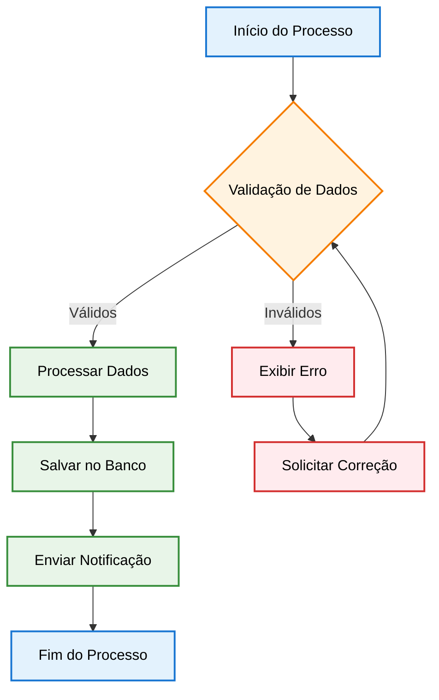

### Tipos de Nós DATAMETRIA

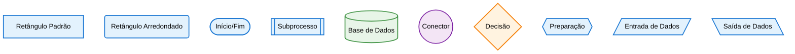

### Exemplo Prático - Sistema de Autenticação

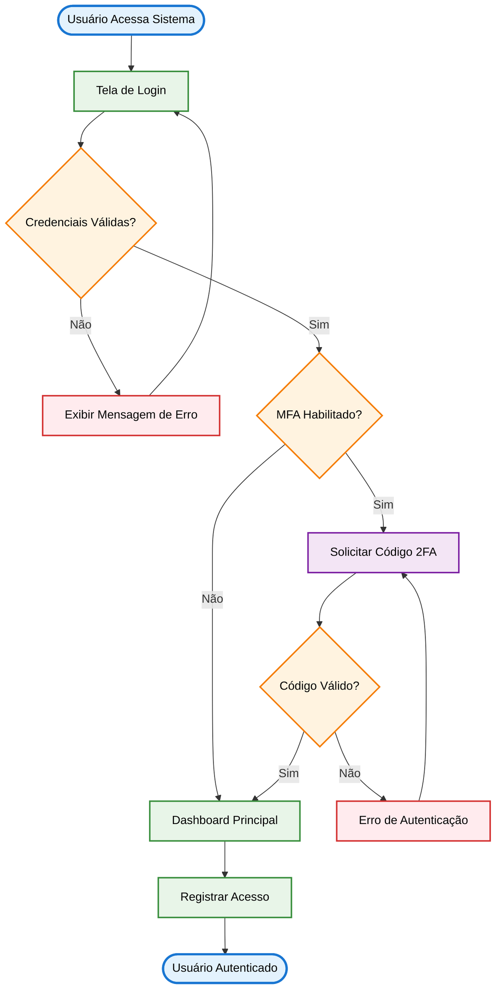

---

## 🔄 Diagramas de Sequência

### Template DATAMETRIA

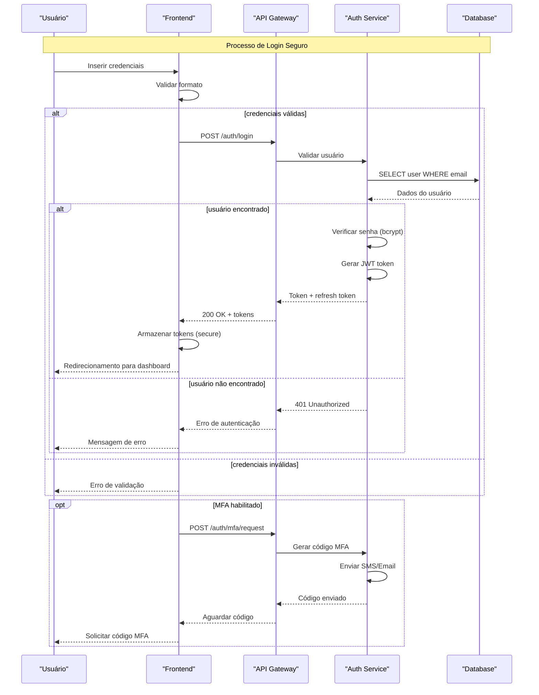

### Exemplo Avançado - E-commerce

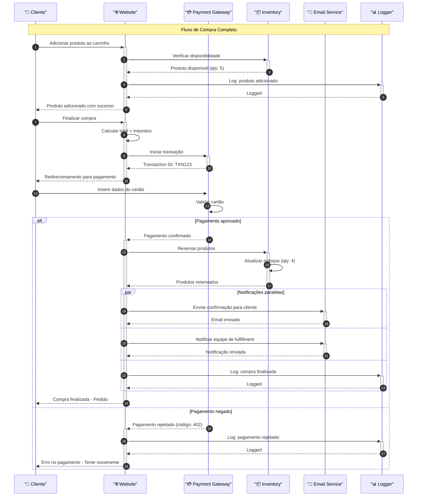

---

## 🏗️ Diagramas de Classes

### Template DATAMETRIA

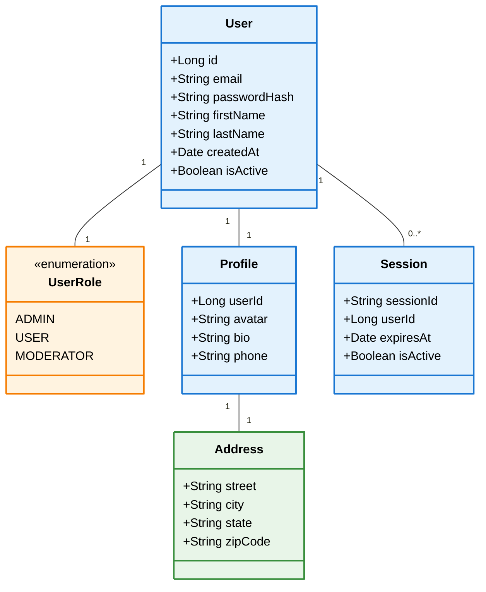

### Exemplo Sistema E-commerce

```mermaid
classDiagram
direction TB
    class Product {
     +Long id
     +String name
     +BigDecimal price
     +Integer stock
     +Boolean isActive
    }

    class Category {
     +Long id
     +String name
     +String slug
    }

    class Order {
     +Long id
     +String orderNumber
     +BigDecimal total
     +OrderStatus status
    }

    class OrderItem {
     +Long id
     +Integer quantity
     +BigDecimal unitPrice
    }

    class OrderStatus {
     PENDING
     CONFIRMED
     SHIPPED
     DELIVERED
     CANCELLED
    }

    class Payment {
     +Long id
     +BigDecimal amount
     +String transactionId
    }

 <<enumeration>> OrderStatus

    Product "1" -- "1" Category
    Order "1" -- "0..*" OrderItem
    OrderItem "1" -- "1" Product
    Order "1" -- "1" Payment
    Order "1" -- "1" OrderStatus

 class Product:::entity
 class Category:::entity
 class Order:::entity
 class OrderItem:::entity
 class OrderStatus:::enum
 class Payment:::financial

 classDef financial fill:#E8F5E8, stroke:#388E3C, stroke-width:2px, color:#000
 classDef enum fill:#FFF3E0, stroke:#F57C00, stroke-width:2px, color:#000
 classDef entity fill:#E3F2FD, stroke:#1976D2, stroke-width:2px, color:#000
```

---

## 🔄 Diagramas de Estado

### Template DATAMETRIA

```mermaid
stateDiagram-v2
    [*] --> Rascunho

    Rascunho --> EmRevisao : submeter
    Rascunho --> Cancelado : cancelar

    EmRevisao --> Aprovado : aprovar
    EmRevisao --> Rejeitado : rejeitar
    EmRevisao --> Rascunho : solicitar_alteracoes

    Aprovado --> Publicado : publicar
    Aprovado --> Rascunho : editar

    Rejeitado --> Rascunho : corrigir
    Rejeitado --> Cancelado : descartar

    Publicado --> Arquivado : arquivar
    Publicado --> Rascunho : nova_versao

    Cancelado --> [*]
    Arquivado --> [*]

    note right of EmRevisao
        Notificar revisores
        Definir prazo de revisão
    end note

    note right of Publicado
        Disponível publicamente
        Indexado para busca
    end note
```

### Exemplo Pedido E-commerce

```mermaid
stateDiagram-v2
    [*] --> Carrinho

    state Carrinho {
        [*] --> Vazio
        Vazio --> ComItens : adicionar_produto
        ComItens --> Vazio : remover_todos
        ComItens --> ComItens : adicionar_produto
        ComItens --> ComItens : remover_produto
    }

    Carrinho --> Checkout : finalizar_compra
    Checkout --> Pagamento : dados_validos
    Checkout --> Carrinho : cancelar

    state Pagamento {
        [*] --> Processando
        Processando --> Aprovado : pagamento_aprovado
        Processando --> Rejeitado : pagamento_rejeitado
        Processando --> Timeout : tempo_esgotado
        Rejeitado --> [*]
        Timeout --> [*]
    }

    Pagamento --> Confirmado : pagamento_aprovado
    Pagamento --> Carrinho : pagamento_rejeitado

    Confirmado --> Preparando : iniciar_preparacao
    Preparando --> Enviado : produto_despachado
    Enviado --> Entregue : produto_entregue
    Enviado --> Devolvido : produto_devolvido

    Entregue --> Avaliado : cliente_avaliou
    Entregue --> [*] : prazo_avaliacao_expirado

    Devolvido --> Reembolsado : processar_reembolso
    Avaliado --> [*]
    Reembolsado --> [*]

    note right of Confirmado
        Enviar email de confirmação
        Reservar produtos no estoque
        Gerar número de rastreamento
    end note

    note right of Entregue
        Solicitar avaliação
        Liberar pagamento para vendedor
    end note
```

---

## 🗄️ Diagramas ER

### Template DATAMETRIA

```mermaid
erDiagram
    USER {
        bigint id PK
        varchar email UK "NOT NULL"
        varchar password_hash "NOT NULL"
        varchar first_name "NOT NULL"
        varchar last_name "NOT NULL"
        timestamp created_at "DEFAULT NOW()"
        timestamp updated_at "DEFAULT NOW()"
        boolean is_active "DEFAULT true"
        enum role "DEFAULT 'USER'"
    }

    PROFILE {
        bigint user_id PK,FK
        varchar avatar_url
        text bio
        varchar phone
        date birth_date
        timestamp updated_at "DEFAULT NOW()"
    }

    ADDRESS {
        bigint id PK
        bigint user_id FK
        varchar street "NOT NULL"
        varchar city "NOT NULL"
        varchar state "NOT NULL"
        varchar zip_code "NOT NULL"
        varchar country "DEFAULT 'BR'"
        boolean is_default "DEFAULT false"
        timestamp created_at "DEFAULT NOW()"
    }

    PRODUCT {
        bigint id PK
        varchar name "NOT NULL"
        text description
        decimal price "NOT NULL CHECK (price > 0)"
        integer stock "DEFAULT 0"
        varchar sku UK "NOT NULL"
        bigint category_id FK
        boolean is_active "DEFAULT true"
        timestamp created_at "DEFAULT NOW()"
        timestamp updated_at "DEFAULT NOW()"
    }

    CATEGORY {
        bigint id PK
        varchar name "NOT NULL"
        varchar slug UK "NOT NULL"
        bigint parent_id FK
        integer sort_order "DEFAULT 0"
        boolean is_active "DEFAULT true"
    }

    ORDER {
        bigint id PK
        varchar order_number UK "NOT NULL"
        bigint customer_id FK "NOT NULL"
        decimal subtotal "NOT NULL"
        decimal tax "DEFAULT 0"
        decimal shipping "DEFAULT 0"
        decimal total "NOT NULL"
        enum status "DEFAULT 'PENDING'"
        timestamp created_at "DEFAULT NOW()"
        timestamp updated_at "DEFAULT NOW()"
    }

    ORDER_ITEM {
        bigint id PK
        bigint order_id FK "NOT NULL"
        bigint product_id FK "NOT NULL"
        integer quantity "NOT NULL CHECK (quantity > 0)"
        decimal unit_price "NOT NULL"
        decimal subtotal "NOT NULL"
    }

    %% Relacionamentos
    USER ||--|| PROFILE : "tem perfil"
    USER ||--o{ ADDRESS : "possui endereços"
    USER ||--o{ ORDER : "faz pedidos"

    CATEGORY ||--o{ PRODUCT : "categoriza"
    CATEGORY ||--o{ CATEGORY : "subcategoria"

    ORDER ||--o{ ORDER_ITEM : "contém itens"
    PRODUCT ||--o{ ORDER_ITEM : "é vendido em"
```

---

## 🛣️ Jornada do Usuário

### Template DATAMETRIA

```mermaid
journey
    title Jornada do Cliente - E-commerce DATAMETRIA

    section 🔍 Descoberta
      Pesquisa no Google: 3: Cliente
      Clica no anúncio: 4: Cliente, Marketing
      Visita homepage: 5: Cliente, Website
      Navega por categorias: 4: Cliente, Website

    section 📱 Exploração
      Visualiza produtos: 5: Cliente, Catálogo
      Lê descrições: 4: Cliente
      Vê avaliações: 4: Cliente, Outros Clientes
      Compara preços: 3: Cliente, Concorrentes
      Adiciona à wishlist: 4: Cliente, Sistema

    section 🛒 Compra
      Adiciona ao carrinho: 5: Cliente, Sistema
      Revisa itens: 4: Cliente
      Aplica cupom desconto: 5: Cliente, Sistema
      Calcula frete: 3: Cliente, Sistema, Correios
      Preenche dados: 2: Cliente

    section 💳 Pagamento
      Escolhe forma pagamento: 4: Cliente
      Insere dados cartão: 2: Cliente
      Confirma compra: 3: Cliente, Gateway
      Recebe confirmação: 5: Cliente, Sistema

    section 📦 Fulfillment
      Pedido processado: 4: Sistema, Estoque
      Produto separado: 4: Funcionário, Sistema
      Produto embalado: 5: Funcionário
      Produto despachado: 4: Funcionário, Transportadora

    section 🚚 Entrega
      Rastreia pedido: 4: Cliente, Transportadora
      Recebe notificações: 5: Cliente, Sistema
      Produto entregue: 5: Cliente, Entregador
      Confirma recebimento: 4: Cliente, Sistema

    section ⭐ Pós-venda
      Avalia produto: 4: Cliente, Sistema
      Avalia entrega: 4: Cliente, Sistema
      Compartilha experiência: 3: Cliente, Redes Sociais
      Considera recompra: 5: Cliente
```

---

## 📅 Gráficos de Gantt

### Template DATAMETRIA

```mermaid
gantt
    title Desenvolvimento Sistema E-commerce DATAMETRIA
    dateFormat YYYY-MM-DD
    axisFormat %d/%m

    section 📋 Planejamento
    Levantamento requisitos    :done, req, 2024-01-01, 2024-01-15
    Análise viabilidade       :done, viab, 2024-01-10, 2024-01-25
    Documentação técnica      :done, doc, 2024-01-20, 2024-02-05
    Aprovação stakeholders    :milestone, approval, 2024-02-05, 0d

    section 🎨 Design
    Research UX               :done, ux-research, 2024-01-25, 2024-02-10
    Wireframes               :done, wireframes, 2024-02-05, 2024-02-20
    Design System            :done, design-sys, 2024-02-15, 2024-03-01
    Protótipos interativos   :done, prototypes, 2024-02-25, 2024-03-10
    Validação usuários       :done, validation, 2024-03-05, 2024-03-15

    section 🏗️ Arquitetura
    Arquitetura sistema      :done, arch, 2024-02-01, 2024-02-20
    Design banco dados       :done, db-design, 2024-02-10, 2024-02-25
    Definição APIs           :done, api-spec, 2024-02-20, 2024-03-05
    Setup infraestrutura     :done, infra, 2024-03-01, 2024-03-15

    section 💻 Desenvolvimento
    Backend - Auth           :active, auth, 2024-03-10, 2024-03-25
    Backend - Produtos       :backend-prod, 2024-03-20, 2024-04-10
    Backend - Pedidos        :backend-orders, 2024-04-01, 2024-04-20
    Frontend - Catálogo      :frontend-cat, 2024-03-25, 2024-04-15
    Frontend - Checkout      :frontend-check, 2024-04-10, 2024-04-30
    Integração Pagamento     :payment, 2024-04-15, 2024-05-01

    section 🧪 Testes
    Testes unitários         :test-unit, 2024-04-01, 2024-05-15
    Testes integração        :test-int, 2024-04-20, 2024-05-20
    Testes performance       :test-perf, 2024-05-01, 2024-05-15
    Testes usuário           :test-user, 2024-05-10, 2024-05-25

    section 🚀 Deploy
    Deploy homologação       :deploy-hom, 2024-05-15, 2024-05-20
    Correções bugs           :bugfix, 2024-05-20, 2024-06-01
    Deploy produção          :deploy-prod, 2024-06-01, 2024-06-05
    Monitoramento inicial    :monitoring, 2024-06-05, 2024-06-15
    Go-live                  :milestone, golive, 2024-06-05, 0d
```

---

## 🍰 Diagramas de Pizza

### Template DATAMETRIA

```mermaid
pie title Distribuição de Vendas por Categoria - Q1 2024
    "Eletrônicos" : 35.2
    "Roupas & Acessórios" : 28.7
    "Casa & Jardim" : 18.4
    "Livros & Mídia" : 9.8
    "Esportes & Lazer" : 5.3
    "Outros" : 2.6
```

### Exemplo Analytics Website

```mermaid
pie title Fontes de Tráfego - DATAMETRIA Analytics
    "Busca Orgânica (SEO)" : 42.8
    "Tráfego Direto" : 23.5
    "Redes Sociais" : 15.7
    "Email Marketing" : 8.9
    "Anúncios Pagos (SEM)" : 6.4
    "Referências Externas" : 2.7
```

---

## 🧠 Mindmaps

### Template DATAMETRIA

```mermaid
mindmap
  root((Estratégia Digital DATAMETRIA))

    SEO & Conteúdo
      Pesquisa Palavras-chave
        Ferramentas
          Google Keyword Planner
          SEMrush
          Ahrefs
        Análise Concorrência
          Gaps de Conteúdo
          Oportunidades
      Otimização On-Page
        Meta Tags
        Estrutura URLs
        Schema Markup
        Core Web Vitals
      Link Building
        Guest Posts
        Parcerias Estratégicas
        Diretórios Qualificados

    Marketing Digital
      Redes Sociais
        LinkedIn
          Artigos Técnicos
          LinkedIn Ads
          Networking B2B
        Instagram
          Stories Técnicos
          Reels Educativos
          IGTV Tutoriais
        YouTube
          Webinars
          Tutoriais
          Case Studies
      Email Marketing
        Segmentação
          Por Persona
          Por Comportamento
          Por Estágio Funil
        Automação
          Welcome Series
          Nurturing Leads
          Reativação
        Personalização
          Conteúdo Dinâmico
          Recomendações
          A/B Testing

    Produto & Tecnologia
      Desenvolvimento
        Frontend
          Vue.js 3
          TypeScript
          PWA
        Backend
          Python Flask
          PostgreSQL
          Redis Cache
        Mobile
          Flutter
          React Native
          Híbrido
      Analytics
        Google Analytics 4
        Hotjar
        Mixpanel
        Custom Dashboards
      Performance
        Core Web Vitals
        Lighthouse
        GTmetrix
        Monitoramento Real

    Vendas & CRM
      Lead Generation
        Landing Pages
        Lead Magnets
        Webinars
        Free Trials
      Qualificação
        Lead Scoring
        BANT Framework
        Behavioral Tracking
      Conversão
        Sales Funnel
        CRM Integration
        Follow-up Automation
```

---

## 📊 Quadrantes

### Template DATAMETRIA

```mermaid
flowchart TD
    subgraph "🟢 FAZER AGORA - Alto Valor, Baixo Esforço"
        A[Otimização SEO Básica]
        B[Correção Bugs Críticos]
        C[Implementar Analytics]
    end

    subgraph "🟡 PLANEJAR - Alto Valor, Alto Esforço"
        D[Nova Funcionalidade Principal]
        E[Migração Arquitetura]
        F[Integração ERP]
    end

    subgraph "🔵 CONSIDERAR - Baixo Valor, Baixo Esforço"
        G[Melhorias UI Menores]
        H[Documentação Adicional]
        I[Testes Automatizados]
    end

    subgraph "🔴 EVITAR - Baixo Valor, Alto Esforço"
        J[Funcionalidade Complexa Pouco Usada]
        K[Integração Sistema Legado]
        L[Customização Excessiva]
    end

    %% Estilos DATAMETRIA
    classDef high fill:#E8F5E8,stroke:#388E3C,stroke-width:2px,color:#000
    classDef medium fill:#FFF3E0,stroke:#F57C00,stroke-width:2px,color:#000
    classDef low fill:#E3F2FD,stroke:#1976D2,stroke-width:2px,color:#000
    classDef avoid fill:#FFEBEE,stroke:#D32F2F,stroke-width:2px,color:#000

    class A,B,C high
    class D,E,F medium
    class G,H,I low
    class J,K,L avoid
```

---

## 🎨 Estilos DATAMETRIA

### Paleta de Cores Acessível

```mermaid
flowchart LR
    subgraph "Cores Primárias"
        P1[Primary Blue #2196F3<br/>Contraste: 4.5:1]
        P2[Primary Dark #1976D2<br/>Contraste: 7:1]
    end

    subgraph "Cores Secundárias"
        S1[Success Green #4CAF50<br/>Contraste: 4.8:1]
        S2[Warning Orange #FF9800<br/>Contraste: 4.2:1]
        S3[Error Red #F44336<br/>Contraste: 5.1:1]
    end

    subgraph "Cores Neutras"
        N1[Light Gray #F5F5F5<br/>Background]
        N2[Dark Gray #424242<br/>Text]
        N3[Medium Gray #757575<br/>Secondary Text]
    end

    %% Aplicar cores reais
    style P1 fill:#2196F3,stroke:#1976D2,stroke-width:2px,color:#fff
    style P2 fill:#1976D2,stroke:#0D47A1,stroke-width:2px,color:#fff
    style S1 fill:#4CAF50,stroke:#388E3C,stroke-width:2px,color:#fff
    style S2 fill:#FF9800,stroke:#F57C00,stroke-width:2px,color:#fff
    style S3 fill:#F44336,stroke:#D32F2F,stroke-width:2px,color:#fff
    style N1 fill:#F5F5F5,stroke:#E0E0E0,stroke-width:2px,color:#000
    style N2 fill:#424242,stroke:#212121,stroke-width:2px,color:#fff
    style N3 fill:#757575,stroke:#424242,stroke-width:2px,color:#fff
```

### Classes CSS DATAMETRIA

```css
/* Classes padrão DATAMETRIA para Mermaid */
.datametria-primary {
    fill: #E3F2FD;
    stroke: #1976D2;
    stroke-width: 2px;
    color: #000;
}

.datametria-success {
    fill: #E8F5E8;
    stroke: #388E3C;
    stroke-width: 2px;
    color: #000;
}

.datametria-warning {
    fill: #FFF3E0;
    stroke: #F57C00;
    stroke-width: 2px;
    color: #000;
}

.datametria-error {
    fill: #FFEBEE;
    stroke: #D32F2F;
    stroke-width: 2px;
    color: #000;
}

.datametria-info {
    fill: #F3E5F5;
    stroke: #7B1FA2;
    stroke-width: 2px;
    color: #000;
}
```

### Template Base com Estilos

```mermaid
%%{init: {
  'theme': 'base',
  'themeVariables': {
    'primaryColor': '#E3F2FD',
    'primaryTextColor': '#000',
    'primaryBorderColor': '#1976D2',
    'lineColor': '#1976D2',
    'secondaryColor': '#E8F5E8',
    'tertiaryColor': '#FFF3E0',
    'background': '#FFFFFF',
    'mainBkg': '#E3F2FD',
    'secondBkg': '#E8F5E8',
    'tertiaryBkg': '#FFF3E0'
  }
}}%%
flowchart TD
    A[Início] --> B{Decisão}
    B -->|Sim| C[Processo A]
    B -->|Não| D[Processo B]
    C --> E[Fim]
    D --> E
```

---

## ♿ Acessibilidade

### Diretrizes WCAG 2.1 AA

#### Contraste de Cores

| Elemento | Cor de Fundo | Cor do Texto | Contraste | Status |
|----------|--------------|--------------|-----------|---------|
| **Texto Normal** | #FFFFFF | #424242 | 12.6:1 | ✅ AAA |
| **Texto Pequeno** | #E3F2FD | #1976D2 | 7.1:1 | ✅ AAA |
| **Botões Primários** | #2196F3 | #FFFFFF | 4.5:1 | ✅ AA |
| **Alertas de Erro** | #FFEBEE | #D32F2F | 5.1:1 | ✅ AA |
| **Alertas de Sucesso** | #E8F5E8 | #388E3C | 4.8:1 | ✅ AA |

#### Exemplo Acessível

```mermaid
flowchart TD
    A[Início do Processo<br/>Alt: Ponto de entrada do fluxo] --> B{Validação de Dados<br/>Alt: Verificação de entrada}
    B -->|Dados Válidos| C[Processar Informações<br/>Alt: Etapa de processamento]
    B -->|Dados Inválidos| D[Exibir Mensagem de Erro<br/>Alt: Notificação de erro]
    C --> E[Salvar no Banco de Dados<br/>Alt: Persistência de dados]
    D --> F[Solicitar Correção<br/>Alt: Requisição de ajuste]
    E --> G[Enviar Notificação<br/>Alt: Comunicação ao usuário]
    F --> B
    G --> H[Fim do Processo<br/>Alt: Conclusão do fluxo]

    %% Estilos com alto contraste
    classDef startEnd fill:#E3F2FD,stroke:#0D47A1,stroke-width:3px,color:#000
    classDef process fill:#E8F5E8,stroke:#1B5E20,stroke-width:2px,color:#000
    classDef decision fill:#FFF3E0,stroke:#E65100,stroke-width:2px,color:#000
    classDef error fill:#FFEBEE,stroke:#B71C1C,stroke-width:2px,color:#000

    class A,H startEnd
    class C,E,G process
    class B decision
    class D,F error
```

### Checklist de Acessibilidade

- [ ] **Contraste**: Mínimo 4.5:1 para texto normal, 3:1 para texto grande
- [ ] **Cores**: Não usar apenas cor para transmitir informação
- [ ] **Texto Alternativo**: Descrições claras para elementos visuais
- [ ] **Estrutura**: Hierarquia lógica e navegável
- [ ] **Tamanho**: Elementos clicáveis com mínimo 44x44px
- [ ] **Foco**: Indicadores visuais claros para navegação por teclado

---

## 🛠️ Melhores Práticas

### Organização de Código

```mermaid
flowchart TD
    subgraph Estrutura["📁 Estrutura de Projeto"]
        A[/docs/diagrams/]
        B[/docs/diagrams/architecture/]
        C[/docs/diagrams/flows/]
        D[/docs/diagrams/sequences/]
    end

    subgraph Nomenclatura["📝 Convenções de Nomenclatura"]
        E[auth-flow.mmd]
        F[user-journey.mmd]
        G[system-architecture.mmd]
        H[payment-sequence.mmd]
    end

    subgraph Visual["🎨 Padronização Visual"]
        I[Cores DATAMETRIA]
        J[Tipografia Consistente]
        K[Espaçamento Uniforme]
        L[Ícones Padronizados]
    end

    A --> E
    B --> G
    C --> F
    D --> H

    classDef folder fill:#FFF3E0,stroke:#F57C00,stroke-width:2px,color:#000
    classDef file fill:#E3F2FD,stroke:#1976D2,stroke-width:2px,color:#000
    classDef visual fill:#E8F5E8,stroke:#388E3C,stroke-width:2px,color:#000

    class A,B,C,D folder
    class E,F,G,H file
    class I,J,K,L visual
```

### Template de Comentários

```mermaid
flowchart TD
    %% ========================================
    %% DATAMETRIA - Sistema de Autenticação
    %% Versão: 2.1.0
    %% Autor: Equipe DATAMETRIA
    %% Data: 15/09/2025
    %% ========================================

    %% Início do fluxo principal
    Start([Usuário Acessa Sistema]) --> Login[Tela de Login]

    %% Validação de credenciais
    Login --> Input{Credenciais Válidas?}
    Input -->|Não| Error[Exibir Erro]
    Error --> Login

    %% Fluxo de autenticação multifator
    Input -->|Sim| MFA{MFA Habilitado?}
    MFA -->|Não| Dashboard[Dashboard Principal]
    MFA -->|Sim| TwoFA[Código 2FA]

    %% Validação 2FA
    TwoFA --> Verify{Código Válido?}
    Verify -->|Não| ErrorMFA[Erro 2FA]
    ErrorMFA --> TwoFA
    Verify -->|Sim| Dashboard

    %% Finalização
    Dashboard --> End([Usuário Logado])

    %% ========================================
    %% ESTILOS DATAMETRIA
    %% ========================================
    classDef startEnd fill:#E3F2FD,stroke:#1976D2,stroke-width:3px,color:#000
    classDef process fill:#E8F5E8,stroke:#388E3C,stroke-width:2px,color:#000
    classDef decision fill:#FFF3E0,stroke:#F57C00,stroke-width:2px,color:#000
    classDef error fill:#FFEBEE,stroke:#D32F2F,stroke-width:2px,color:#000
    classDef security fill:#F3E5F5,stroke:#7B1FA2,stroke-width:2px,color:#000

    %% Aplicação de estilos
    class Start,End startEnd
    class Login,Dashboard process
    class Input,MFA,Verify decision
    class Error,ErrorMFA error
    class TwoFA security
```

### Versionamento de Diagramas

```markdown
<!-- Cabeçalho padrão DATAMETRIA -->
# Sistema de Autenticação - Fluxo Principal

**Versão**: 2.1.0
**Data**: 15/09/2025
**Autor**: Equipe DATAMETRIA
**Revisor**: Vander Loto (CTO)
**Status**: Aprovado

## Histórico de Versões

| Versão | Data | Autor | Mudanças |
|--------|------|-------|----------|
| 2.1.0 | 15/09/2025 | Equipe DATAMETRIA | Adicionado fluxo MFA |
| 2.0.0 | 01/09/2025 | João Silva | Reestruturação completa |
| 1.2.0 | 15/08/2025 | Maria Santos | Correções de validação |
| 1.1.0 | 01/08/2025 | Ana Costa | Melhorias UX |
| 1.0.0 | 15/07/2025 | Equipe DATAMETRIA | Versão inicial |

## Aprovações

- [x] **Tech Lead**: Dalila Rodrigues - 15/09/2025
- [x] **CTO**: Vander Loto - 15/09/2025
- [x] **Security**: Carlos Oliveira - 14/09/2025
- [x] **UX Lead**: Ana Costa - 14/09/2025
```

### Exportação e Integração

```bash
#!/bin/bash
# Script de exportação DATAMETRIA

# Instalar Mermaid CLI
npm install -g @mermaid-js/mermaid-cli

# Exportar diagramas
mmdc -i auth-flow.mmd -o auth-flow.png -w 1920 -H 1080
mmdc -i auth-flow.mmd -o auth-flow.svg
mmdc -i auth-flow.mmd -o auth-flow.pdf

# Otimizar para web
mmdc -i auth-flow.mmd -o auth-flow-web.png -w 800 -H 600

# Gerar thumbnails
mmdc -i auth-flow.mmd -o auth-flow-thumb.png -w 400 -H 300
```

---

## 🔗 Referências

### Documentação Oficial

- **[Mermaid.js](https://mermaid.js.org)**: Documentação oficial completa
- **[Mermaid Live Editor](https://mermaid.live)**: Editor online para testes
- **[GitHub Mermaid](https://github.blog/2022-02-14-include-diagrams-markdown-files-mermaid/)**: Suporte nativo no GitHub

### Ferramentas e Integrações

| Ferramenta | Descrição | Link |
|------------|-----------|------|
| **VS Code Extension** | Extensão oficial para VS Code | [marketplace.visualstudio.com](https://marketplace.visualstudio.com/items?itemName=bierner.markdown-mermaid) |
| **Obsidian** | Suporte nativo para Mermaid | [obsidian.md](https://obsidian.md) |
| **Notion** | Plugin para diagramas Mermaid | [notion.so](https://notion.so) |
| **Confluence** | Plugin oficial Atlassian | [marketplace.atlassian.com](https://marketplace.atlassian.com) |
| **GitLab** | Suporte nativo em markdown | [docs.gitlab.com](https://docs.gitlab.com) |

### Acessibilidade e Padrões

- **[WCAG 2.1 Guidelines](https://www.w3.org/WAI/WCAG21/quickref/)**: Diretrizes de acessibilidade
- **[Color Contrast Checker](https://webaim.org/resources/contrastchecker/)**: Verificador de contraste
- **[Material Design Colors](https://material.io/design/color/)**: Paleta de cores acessível

### Templates DATAMETRIA Relacionados

- **[Template de Documentação](template-documentation.md)**: Padrões de documentação
- **[Template de UX/UI](template-ux-ui.md)**: Diretrizes de design
- **[Template de Arquitetura](template-technical-architecture-diagram.md)**: Diagramas arquiteturais

---

## ✅ Checklist de Qualidade DATAMETRIA

### Antes de Publicar

- [ ] **Acessibilidade**: Contraste mínimo 4.5:1 verificado
- [ ] **Cores**: Paleta DATAMETRIA aplicada corretamente
- [ ] **Estrutura**: Hierarquia lógica e navegável
- [ ] **Comentários**: Código bem documentado
- [ ] **Versionamento**: Histórico de mudanças atualizado
- [ ] **Aprovações**: Revisões técnicas concluídas
- [ ] **Testes**: Renderização verificada em diferentes dispositivos
- [ ] **Performance**: Diagramas otimizados para carregamento rápido

### Manutenção Contínua

- [ ] **Atualização Regular**: Diagramas sincronizados com a realidade
- [ ] **Feedback**: Incorporação de sugestões dos usuários
- [ ] **Evolução**: Acompanhamento de novas funcionalidades Mermaid
- [ ] **Treinamento**: Capacitação da equipe em melhores práticas

---

<div align="center">

**Desenvolvido por**: Equipe DATAMETRIA
**Última Atualização**: 15/09/2025
**Versão**: 1.0.0
**Próxima Revisão**: 15/12/2025

---

## 🎨 Mermaid DATAMETRIA - Diagramas Acessíveis e Profissionais! 🚀

*Para dúvidas ou sugestões sobre este template, entre em contato com a equipe de arquitetura da DATAMETRIA.*

</div>
