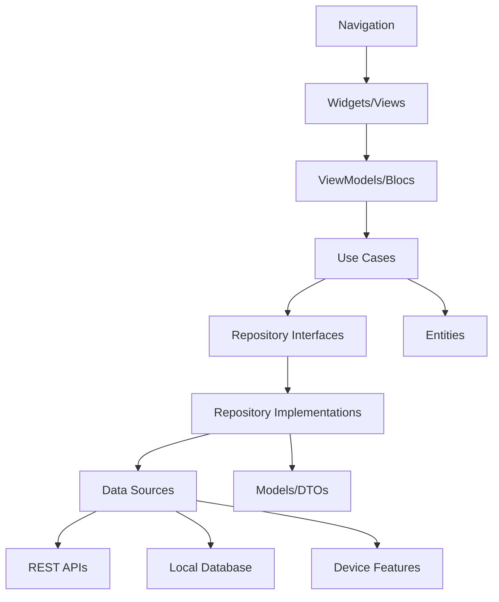
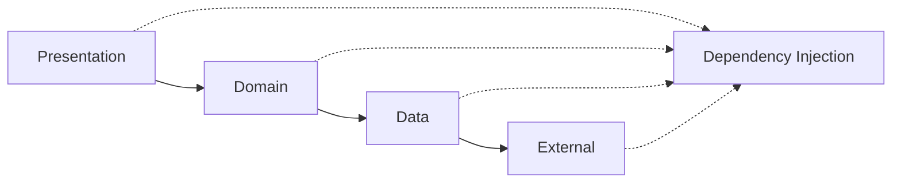
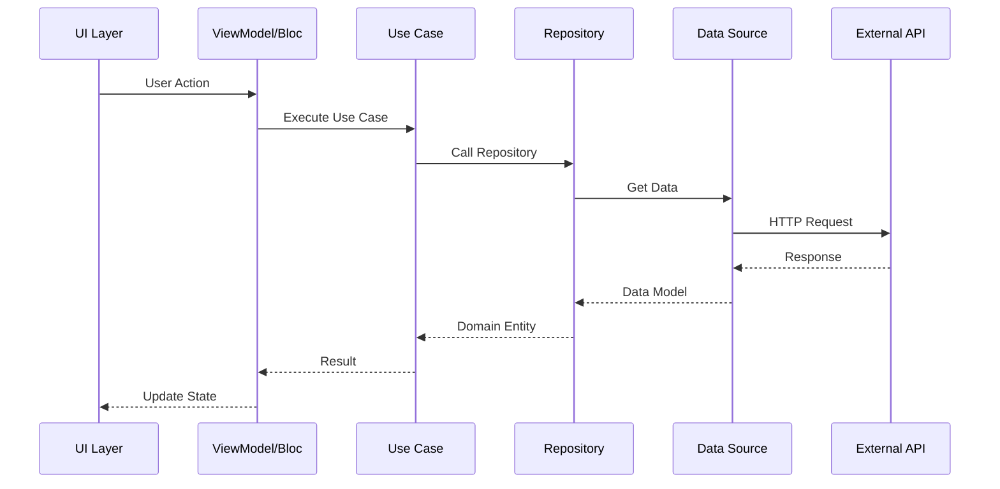
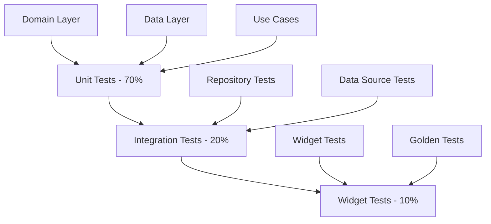

# Template de Arquitetura Mobile

<div align="center">

## Documentação de Arquitetura para Aplicações Mobile - Framework Enterprise

[](https://flutter.dev)
[](https://reactnative.dev)
[](https://blog.cleancoder.com/uncle-bob/2012/08/13/the-clean-architecture.html)
[](https://en.wikipedia.org/wiki/Model%E2%80%93view%E2%80%93viewmodel)
[](https://github.com/datametria/standards)
[](https://aws.amazon.com/q/)

[🔗 Template Original](link) • [🔗 Diretrizes](link) • [🔗 Exemplos](link)

[🏗️ Arquitetura](#-arquitetura-geral) • [📱 Camadas](#-estrutura-de-camadas) • [🔄 Fluxo de Dados](#-fluxo-de-dados) •
[📦 Dependências](#-gerenciamento-de-dependências) • [🧪 Testes](#-estratégia-de-testes)

</div>

---

## 📋 Índice

- [🎯 Visão Geral](#-visão-geral)
- [📋 Informações do Projeto](#-informações-do-projeto)
- [🏗️ Arquitetura Geral](#️-arquitetura-geral)
- [📱 Estrutura de Camadas](#-estrutura-de-camadas)
- [🔄 Fluxo de Dados](#-fluxo-de-dados)
- [📦 Gerenciamento de Dependências](#-gerenciamento-de-dependências)
- [🧪 Estratégia de Testes](#-estratégia-de-testes)
- [🚀 Performance e Otimização](#-performance-e-otimização)
- [🔒 Segurança](#-segurança)
- [📚 Referências](#-referências)

---

## 🎯 Visão Geral

### Framework de Arquitetura Mobile DATAMETRIA

Este template estabelece uma arquitetura robusta para aplicações mobile, combinando **Clean Architecture** com **MVVM pattern**, otimizada para desenvolvimento com Flutter e React Native.

#### Benefícios da Arquitetura

- ✅ **Separação de Responsabilidades**: Cada camada tem função específica
- ✅ **Testabilidade**: Facilita testes unitários e de integração
- ✅ **Manutenibilidade**: Código organizado e fácil de manter
- ✅ **Escalabilidade**: Suporta crescimento da aplicação
- ✅ **Independência de Framework**: Lógica de negócio isolada
- ✅ **Reutilização**: Componentes reutilizáveis entre plataformas

---

## 📋 Informações do Projeto

| Campo | Descrição | Exemplo |
|-------|-----------|----------|
| **Nome da Aplicação** | [Nome do App] | DATAMETRIA Mobile |
| **Plataformas** | [iOS / Android / Web] | iOS 14+, Android API 21+, Web |
| **Framework** | [Flutter / React Native] | Flutter 3.16+ |
| **Versão Mínima** | iOS [X.X] / Android API [XX] | iOS 14.0 / Android API 21 |
| **Arquiteto** | [Nome do Arquiteto] | Vander Loto (CTO) |
| **Data** | [DD/MM/AAAA] | 15/09/2025 |
| **Versão do Documento** | [X.X.X] | 2.0.0 |
| **Estado Management** | [Bloc / Provider / Riverpod] | Bloc Pattern |
| **Navegação** | [Navigator 2.0 / GoRouter] | GoRouter |

---

## 🏗️ Arquitetura Geral

### Visão Geral

Esta aplicação mobile segue os princípios da **Clean Architecture** combinada com **MVVM pattern**, garantindo separação de responsabilidades, testabilidade e manutenibilidade.

### Princípios Arquiteturais

- **🎯 Separation of Concerns**: Cada camada tem responsabilidade específica
- **🔄 Dependency Inversion**: Dependências apontam para abstrações
- **📱 Platform Independence**: Lógica de negócio independente da plataforma
- **🧪 Testability**: Arquitetura facilita testes unitários e integração
- **🔧 Maintainability**: Código organizado e fácil de manter
- **⚡ Performance**: Otimizada para performance mobile

### Diagrama de Arquitetura



### Fluxo de Dependências



---

## 📱 Estrutura de Camadas

### 1. Presentation Layer (UI)

**Responsabilidade**: Interface do usuário e interações

#### Widgets/Views

```dart
// Exemplo Flutter
class ProductListScreen extends StatelessWidget {
  @override
  Widget build(BuildContext context) {
    return BlocBuilder<ProductBloc, ProductState>(
      builder: (context, state) {
        return Scaffold(
          appBar: AppBar(title: Text('Produtos')),
          body: _buildBody(state),
          floatingActionButton: FloatingActionButton(
            onPressed: () => context.read<ProductBloc>().add(LoadProducts()),
            child: Icon(Icons.refresh),
          ),
        );
      },
    );
  }

  Widget _buildBody(ProductState state) {
    if (state is ProductLoading) {
      return Center(child: CircularProgressIndicator());
    } else if (state is ProductLoaded) {
      return ListView.builder(
        itemCount: state.products.length,
        itemBuilder: (context, index) {
          return ProductCard(product: state.products[index]);
        },
      );
    } else if (state is ProductError) {
      return Center(child: Text('Erro: ${state.message}'));
    }
    return Container();
  }
}
```

#### ViewModels/Blocs

```dart
// Bloc para gerenciamento de estado
class ProductBloc extends Bloc<ProductEvent, ProductState> {
  final GetProductsUseCase getProductsUseCase;
  final CreateProductUseCase createProductUseCase;
  final DeleteProductUseCase deleteProductUseCase;

  ProductBloc({
    required this.getProductsUseCase,
    required this.createProductUseCase,
    required this.deleteProductUseCase,
  }) : super(ProductInitial()) {
    on<LoadProducts>(_onLoadProducts);
    on<CreateProduct>(_onCreateProduct);
    on<DeleteProduct>(_onDeleteProduct);
  }

  Future<void> _onLoadProducts(
    LoadProducts event,
    Emitter<ProductState> emit,
  ) async {
    emit(ProductLoading());
    try {
      final products = await getProductsUseCase(NoParams());
      emit(ProductLoaded(products));
    } catch (e) {
      emit(ProductError(e.toString()));
    }
  }

  Future<void> _onCreateProduct(
    CreateProduct event,
    Emitter<ProductState> emit,
  ) async {
    try {
      await createProductUseCase(CreateProductParams(event.product));
      add(LoadProducts());
    } catch (e) {
      emit(ProductError(e.toString()));
    }
  }
}
```

#### Componentes da Camada

- **Screens**: Telas principais da aplicação
- **Widgets**: Componentes reutilizáveis
- **Blocs/ViewModels**: Gerenciamento de estado
- **Navigation**: Roteamento entre telas
- **Themes**: Temas e estilos visuais

### 2. Domain Layer (Business Logic)

**Responsabilidade**: Regras de negócio e casos de uso

#### Entities

```dart
// Entidade de domínio
class Product extends Equatable {
  final String id;
  final String name;
  final double price;
  final String description;
  final String imageUrl;
  final DateTime createdAt;
  final bool isActive;

  const Product({
    required this.id,
    required this.name,
    required this.price,
    required this.description,
    required this.imageUrl,
    required this.createdAt,
    this.isActive = true,
  });

  @override
  List<Object?> get props => [
    id, name, price, description, imageUrl, createdAt, isActive
  ];

  Product copyWith({
    String? id,
    String? name,
    double? price,
    String? description,
    String? imageUrl,
    DateTime? createdAt,
    bool? isActive,
  }) {
    return Product(
      id: id ?? this.id,
      name: name ?? this.name,
      price: price ?? this.price,
      description: description ?? this.description,
      imageUrl: imageUrl ?? this.imageUrl,
      createdAt: createdAt ?? this.createdAt,
      isActive: isActive ?? this.isActive,
    );
  }
}
```

#### Use Cases

```dart
// Caso de uso base
abstract class UseCase<Type, Params> {
  Future<Either<Failure, Type>> call(Params params);
}

// Implementação específica
class GetProductsUseCase implements UseCase<List<Product>, NoParams> {
  final ProductRepository repository;

  GetProductsUseCase(this.repository);

  @override
  Future<Either<Failure, List<Product>>> call(NoParams params) async {
    return await repository.getProducts();
  }
}

class CreateProductUseCase implements UseCase<void, CreateProductParams> {
  final ProductRepository repository;

  CreateProductUseCase(this.repository);

  @override
  Future<Either<Failure, void>> call(CreateProductParams params) async {
    return await repository.createProduct(params.product);
  }
}

// Parâmetros para use cases
class CreateProductParams extends Equatable {
  final Product product;

  const CreateProductParams({required this.product});

  @override
  List<Object> get props => [product];
}

class NoParams extends Equatable {
  @override
  List<Object> get props => [];
}
```

#### Repository Interfaces

```dart
// Interface do repositório
abstract class ProductRepository {
  Future<Either<Failure, List<Product>>> getProducts();
  Future<Either<Failure, Product>> getProductById(String id);
  Future<Either<Failure, void>> createProduct(Product product);
  Future<Either<Failure, void>> updateProduct(Product product);
  Future<Either<Failure, void>> deleteProduct(String id);
  Future<Either<Failure, List<Product>>> searchProducts(String query);
}
```

### 3. Data Layer (Data Access)

**Responsabilidade**: Acesso a dados e implementação de repositórios

#### Repository Implementation

```dart
class ProductRepositoryImpl implements ProductRepository {
  final ProductRemoteDataSource remoteDataSource;
  final ProductLocalDataSource localDataSource;
  final NetworkInfo networkInfo;

  ProductRepositoryImpl({
    required this.remoteDataSource,
    required this.localDataSource,
    required this.networkInfo,
  });

  @override
  Future<Either<Failure, List<Product>>> getProducts() async {
    if (await networkInfo.isConnected) {
      try {
        final remoteProducts = await remoteDataSource.getProducts();
        await localDataSource.cacheProducts(remoteProducts);
        return Right(remoteProducts.map((model) => model.toEntity()).toList());
      } on ServerException {
        return Left(ServerFailure('Erro no servidor'));
      }
    } else {
      try {
        final localProducts = await localDataSource.getLastProducts();
        return Right(localProducts.map((model) => model.toEntity()).toList());
      } on CacheException {
        return Left(CacheFailure('Dados não encontrados localmente'));
      }
    }
  }

  @override
  Future<Either<Failure, void>> createProduct(Product product) async {
    try {
      final productModel = ProductModel.fromEntity(product);
      await remoteDataSource.createProduct(productModel);
      await localDataSource.cacheProduct(productModel);
      return Right(null);
    } on ServerException {
      return Left(ServerFailure('Erro ao criar produto'));
    }
  }
}
```

#### Data Sources

```dart
// Remote Data Source
abstract class ProductRemoteDataSource {
  Future<List<ProductModel>> getProducts();
  Future<ProductModel> getProductById(String id);
  Future<void> createProduct(ProductModel product);
  Future<void> updateProduct(ProductModel product);
  Future<void> deleteProduct(String id);
}

class ProductRemoteDataSourceImpl implements ProductRemoteDataSource {
  final http.Client client;
  final String baseUrl;

  ProductRemoteDataSourceImpl({
    required this.client,
    required this.baseUrl,
  });

  @override
  Future<List<ProductModel>> getProducts() async {
    final response = await client.get(
      Uri.parse('$baseUrl/products'),
      headers: {'Content-Type': 'application/json'},
    );

    if (response.statusCode == 200) {
      final List<dynamic> jsonList = json.decode(response.body);
      return jsonList.map((json) => ProductModel.fromJson(json)).toList();
    } else {
      throw ServerException();
    }
  }

  @override
  Future<void> createProduct(ProductModel product) async {
    final response = await client.post(
      Uri.parse('$baseUrl/products'),
      headers: {'Content-Type': 'application/json'},
      body: json.encode(product.toJson()),
    );

    if (response.statusCode != 201) {
      throw ServerException();
    }
  }
}

// Local Data Source
abstract class ProductLocalDataSource {
  Future<List<ProductModel>> getLastProducts();
  Future<void> cacheProducts(List<ProductModel> products);
  Future<void> cacheProduct(ProductModel product);
  Future<void> clearCache();
}

class ProductLocalDataSourceImpl implements ProductLocalDataSource {
  final SharedPreferences sharedPreferences;
  static const CACHED_PRODUCTS = 'CACHED_PRODUCTS';

  ProductLocalDataSourceImpl({required this.sharedPreferences});

  @override
  Future<List<ProductModel>> getLastProducts() {
    final jsonString = sharedPreferences.getString(CACHED_PRODUCTS);
    if (jsonString != null) {
      final List<dynamic> jsonList = json.decode(jsonString);
      return Future.value(
        jsonList.map((json) => ProductModel.fromJson(json)).toList(),
      );
    } else {
      throw CacheException();
    }
  }

  @override
  Future<void> cacheProducts(List<ProductModel> products) {
    final jsonString = json.encode(
      products.map((product) => product.toJson()).toList(),
    );
    return sharedPreferences.setString(CACHED_PRODUCTS, jsonString);
  }
}
```

#### Models/DTOs

```dart
class ProductModel extends Equatable {
  final String id;
  final String name;
  final double price;
  final String description;
  final String imageUrl;
  final String createdAt;
  final bool isActive;

  const ProductModel({
    required this.id,
    required this.name,
    required this.price,
    required this.description,
    required this.imageUrl,
    required this.createdAt,
    required this.isActive,
  });

  factory ProductModel.fromJson(Map<String, dynamic> json) {
    return ProductModel(
      id: json['id'],
      name: json['name'],
      price: json['price'].toDouble(),
      description: json['description'],
      imageUrl: json['image_url'],
      createdAt: json['created_at'],
      isActive: json['is_active'] ?? true,
    );
  }

  Map<String, dynamic> toJson() {
    return {
      'id': id,
      'name': name,
      'price': price,
      'description': description,
      'image_url': imageUrl,
      'created_at': createdAt,
      'is_active': isActive,
    };
  }

  Product toEntity() {
    return Product(
      id: id,
      name: name,
      price: price,
      description: description,
      imageUrl: imageUrl,
      createdAt: DateTime.parse(createdAt),
      isActive: isActive,
    );
  }

  factory ProductModel.fromEntity(Product product) {
    return ProductModel(
      id: product.id,
      name: product.name,
      price: product.price,
      description: product.description,
      imageUrl: product.imageUrl,
      createdAt: product.createdAt.toIso8601String(),
      isActive: product.isActive,
    );
  }

  @override
  List<Object> get props => [
    id, name, price, description, imageUrl, createdAt, isActive
  ];
}
```

---

## 🔄 Fluxo de Dados

### Fluxo de Requisição



### Estados da Aplicação

#### Loading States

```dart
abstract class ProductState extends Equatable {
  @override
  List<Object> get props => [];
}

class ProductInitial extends ProductState {}

class ProductLoading extends ProductState {}

class ProductLoaded extends ProductState {
  final List<Product> products;

  ProductLoaded(this.products);

  @override
  List<Object> get props => [products];
}

class ProductError extends ProductState {
  final String message;

  ProductError(this.message);

  @override
  List<Object> get props => [message];
}

class ProductCreating extends ProductState {}

class ProductCreated extends ProductState {}
```

### Tratamento de Erros

```dart
abstract class Failure extends Equatable {
  final String message;

  const Failure(this.message);

  @override
  List<Object> get props => [message];
}

class ServerFailure extends Failure {
  const ServerFailure(String message) : super(message);
}

class NetworkFailure extends Failure {
  const NetworkFailure(String message) : super(message);
}

class CacheFailure extends Failure {
  const CacheFailure(String message) : super(message);
}

class ValidationFailure extends Failure {
  const ValidationFailure(String message) : super(message);
}

// Exceções
class ServerException implements Exception {}
class CacheException implements Exception {}
class NetworkException implements Exception {}
```

### Error Handling Widget

```dart
class ErrorWidget extends StatelessWidget {
  final String message;
  final VoidCallback? onRetry;

  const ErrorWidget({
    Key? key,
    required this.message,
    this.onRetry,
  }) : super(key: key);

  @override
  Widget build(BuildContext context) {
    return Center(
      child: Column(
        mainAxisAlignment: MainAxisAlignment.center,
        children: [
          Icon(Icons.error_outline, size: 64, color: Colors.red),
          SizedBox(height: 16),
          Text(message, textAlign: TextAlign.center),
          if (onRetry != null) ...[
            SizedBox(height: 16),
            ElevatedButton(
              onPressed: onRetry,
              child: Text('Tentar Novamente'),
            ),
          ],
        ],
      ),
    );
  }
}
```

---

## 📦 Gerenciamento de Dependências

### Dependency Injection

#### Service Locator (GetIt)

```dart
final sl = GetIt.instance;

Future<void> init() async {
  //! Features - Products
  // Blocs
  sl.registerFactory(
    () => ProductBloc(
      getProductsUseCase: sl(),
      createProductUseCase: sl(),
      deleteProductUseCase: sl(),
    ),
  );

  // Use Cases
  sl.registerLazySingleton(() => GetProductsUseCase(sl()));
  sl.registerLazySingleton(() => CreateProductUseCase(sl()));
  sl.registerLazySingleton(() => DeleteProductUseCase(sl()));

  // Repository
  sl.registerLazySingleton<ProductRepository>(
    () => ProductRepositoryImpl(
      remoteDataSource: sl(),
      localDataSource: sl(),
      networkInfo: sl(),
    ),
  );

  // Data Sources
  sl.registerLazySingleton<ProductRemoteDataSource>(
    () => ProductRemoteDataSourceImpl(
      client: sl(),
      baseUrl: 'https://api.datametria.io',
    ),
  );

  sl.registerLazySingleton<ProductLocalDataSource>(
    () => ProductLocalDataSourceImpl(sharedPreferences: sl()),
  );

  //! Core
  sl.registerLazySingleton<NetworkInfo>(
    () => NetworkInfoImpl(sl()),
  );

  //! External
  final sharedPreferences = await SharedPreferences.getInstance();
  sl.registerLazySingleton(() => sharedPreferences);
  sl.registerLazySingleton(() => http.Client());
  sl.registerLazySingleton(() => DataConnectionChecker());
}
```

### Estrutura de Pastas

```
lib/
├── core/
│   ├── error/
│   │   ├── exceptions.dart
│   │   └── failures.dart
│   ├── network/
│   │   └── network_info.dart
│   ├── usecases/
│   │   └── usecase.dart
│   ├── utils/
│   │   ├── constants.dart
│   │   └── validators.dart
│   └── widgets/
│       ├── loading_widget.dart
│       └── error_widget.dart
├── features/
│   └── products/
│       ├── data/
│       │   ├── datasources/
│       │   │   ├── product_local_data_source.dart
│       │   │   └── product_remote_data_source.dart
│       │   ├── models/
│       │   │   └── product_model.dart
│       │   └── repositories/
│       │       └── product_repository_impl.dart
│       ├── domain/
│       │   ├── entities/
│       │   │   └── product.dart
│       │   ├── repositories/
│       │   │   └── product_repository.dart
│       │   └── usecases/
│       │       ├── get_products.dart
│       │       ├── create_product.dart
│       │       └── delete_product.dart
│       └── presentation/
│           ├── bloc/
│           │   ├── product_bloc.dart
│           │   ├── product_event.dart
│           │   └── product_state.dart
│           ├── pages/
│           │   ├── product_list_page.dart
│           │   └── product_detail_page.dart
│           └── widgets/
│               ├── product_card.dart
│               └── product_form.dart
├── injection_container.dart
└── main.dart
```

### Configuração Principal

```dart
// main.dart
void main() async {
  WidgetsFlutterBinding.ensureInitialized();
  await init(); // Inicializar dependências
  runApp(MyApp());
}

class MyApp extends StatelessWidget {
  @override
  Widget build(BuildContext context) {
    return MaterialApp(
      title: 'DATAMETRIA Mobile',
      theme: ThemeData(
        primarySwatch: Colors.blue,
        visualDensity: VisualDensity.adaptivePlatformDensity,
      ),
      home: BlocProvider(
        create: (_) => sl<ProductBloc>(),
        child: ProductListPage(),
      ),
    );
  }
}
```

---

## 🧪 Estratégia de Testes

### Pirâmide de Testes



### Unit Tests

#### Domain Layer Tests

```dart
// test/features/products/domain/usecases/get_products_test.dart
void main() {
  late GetProductsUseCase usecase;
  late MockProductRepository mockProductRepository;

  setUp(() {
    mockProductRepository = MockProductRepository();
    usecase = GetProductsUseCase(mockProductRepository);
  });

  final tProductList = [
    Product(
      id: '1',
      name: 'Test Product',
      price: 99.99,
      description: 'Test Description',
      imageUrl: 'test.jpg',
      createdAt: DateTime.now(),
    ),
  ];

  test('should get products from the repository', () async {
    // arrange
    when(mockProductRepository.getProducts())
        .thenAnswer((_) async => Right(tProductList));

    // act
    final result = await usecase(NoParams());

    // assert
    expect(result, Right(tProductList));
    verify(mockProductRepository.getProducts());
    verifyNoMoreInteractions(mockProductRepository);
  });
}
```

#### Bloc Tests

```dart
// test/features/products/presentation/bloc/product_bloc_test.dart
void main() {
  late ProductBloc bloc;
  late MockGetProductsUseCase mockGetProductsUseCase;

  setUp(() {
    mockGetProductsUseCase = MockGetProductsUseCase();
    bloc = ProductBloc(getProductsUseCase: mockGetProductsUseCase);
  });

  test('initialState should be ProductInitial', () {
    expect(bloc.state, equals(ProductInitial()));
  });

  blocTest<ProductBloc, ProductState>(
    'should emit [ProductLoading, ProductLoaded] when data is gotten successfully',
    build: () {
      when(mockGetProductsUseCase(any))
          .thenAnswer((_) async => Right(tProductList));
      return bloc;
    },
    act: (bloc) => bloc.add(LoadProducts()),
    expect: () => [
      ProductLoading(),
      ProductLoaded(tProductList),
    ],
  );
}
```

### Integration Tests

```dart
// integration_test/app_test.dart
void main() {
  group('App Integration Tests', () {
    testWidgets('should load products and display them', (tester) async {
      app.main();
      await tester.pumpAndSettle();

      // Verify initial state
      expect(find.byType(CircularProgressIndicator), findsOneWidget);

      // Wait for products to load
      await tester.pumpAndSettle();

      // Verify products are displayed
      expect(find.byType(ProductCard), findsWidgets);
      expect(find.text('Test Product'), findsOneWidget);
    });

    testWidgets('should create new product', (tester) async {
      app.main();
      await tester.pumpAndSettle();

      // Tap add button
      await tester.tap(find.byIcon(Icons.add));
      await tester.pumpAndSettle();

      // Fill form
      await tester.enterText(find.byKey(Key('name_field')), 'New Product');
      await tester.enterText(find.byKey(Key('price_field')), '199.99');

      // Submit
      await tester.tap(find.byKey(Key('submit_button')));
      await tester.pumpAndSettle();

      // Verify product was added
      expect(find.text('New Product'), findsOneWidget);
    });
  });
}
```

### Widget Tests

```dart
// test/features/products/presentation/widgets/product_card_test.dart
void main() {
  testWidgets('ProductCard should display product information', (tester) async {
    final product = Product(
      id: '1',
      name: 'Test Product',
      price: 99.99,
      description: 'Test Description',
      imageUrl: 'test.jpg',
      createdAt: DateTime.now(),
    );

    await tester.pumpWidget(
      MaterialApp(
        home: Scaffold(
          body: ProductCard(product: product),
        ),
      ),
    );

    expect(find.text('Test Product'), findsOneWidget);
    expect(find.text('R\$ 99,99'), findsOneWidget);
    expect(find.text('Test Description'), findsOneWidget);
  });
}
```

---

## 🚀 Performance e Otimização

### Otimizações de Performance

#### Lazy Loading

```dart
class ProductListView extends StatelessWidget {
  final List<Product> products;

  const ProductListView({Key? key, required this.products}) : super(key: key);

  @override
  Widget build(BuildContext context) {
    return ListView.builder(
      itemCount: products.length,
      itemBuilder: (context, index) {
        return ProductCard(product: products[index]);
      },
      // Otimizações
      cacheExtent: 200.0,
      physics: const BouncingScrollPhysics(),
    );
  }
}
```

#### Image Caching

```dart
class OptimizedNetworkImage extends StatelessWidget {
  final String imageUrl;
  final double? width;
  final double? height;

  const OptimizedNetworkImage({
    Key? key,
    required this.imageUrl,
    this.width,
    this.height,
  }) : super(key: key);

  @override
  Widget build(BuildContext context) {
    return CachedNetworkImage(
      imageUrl: imageUrl,
      width: width,
      height: height,
      placeholder: (context, url) => Container(
        width: width,
        height: height,
        color: Colors.grey[300],
        child: Center(child: CircularProgressIndicator()),
      ),
      errorWidget: (context, url, error) => Icon(Icons.error),
      memCacheWidth: width?.toInt(),
      memCacheHeight: height?.toInt(),
    );
  }
}
```

#### State Management Optimization

```dart
class OptimizedProductBloc extends Bloc<ProductEvent, ProductState> {
  final GetProductsUseCase getProductsUseCase;
  Timer? _debounceTimer;

  OptimizedProductBloc({required this.getProductsUseCase})
      : super(ProductInitial()) {
    on<SearchProducts>(_onSearchProducts,
        transformer: debounce(Duration(milliseconds: 300)));
  }

  EventTransformer<T> debounce<T>(Duration duration) {
    return (events, mapper) => events.debounceTime(duration).flatMap(mapper);
  }

  Future<void> _onSearchProducts(
    SearchProducts event,
    Emitter<ProductState> emit,
  ) async {
    if (event.query.isEmpty) {
      add(LoadProducts());
      return;
    }

    emit(ProductSearching());
    try {
      final products = await searchProductsUseCase(
        SearchProductsParams(query: event.query),
      );
      emit(ProductSearchLoaded(products));
    } catch (e) {
      emit(ProductError(e.toString()));
    }
  }
}
```

### Métricas de Performance

```dart
class PerformanceMonitor {
  static void trackScreenLoad(String screenName) {
    final stopwatch = Stopwatch()..start();

    WidgetsBinding.instance.addPostFrameCallback((_) {
      stopwatch.stop();
      print('Screen $screenName loaded in ${stopwatch.elapsedMilliseconds}ms');
    });
  }

  static void trackApiCall(String endpoint, Future<dynamic> apiCall) async {
    final stopwatch = Stopwatch()..start();

    try {
      await apiCall;
      stopwatch.stop();
      print('API $endpoint completed in ${stopwatch.elapsedMilliseconds}ms');
    } catch (e) {
      stopwatch.stop();
      print('API $endpoint failed after ${stopwatch.elapsedMilliseconds}ms: $e');
    }
  }
}
```

---

## 🔒 Segurança

### Implementação de Segurança

#### Secure Storage

```dart
class SecureStorageService {
  static const _storage = FlutterSecureStorage();

  static Future<void> storeToken(String token) async {
    await _storage.write(key: 'auth_token', value: token);
  }

  static Future<String?> getToken() async {
    return await _storage.read(key: 'auth_token');
  }

  static Future<void> deleteToken() async {
    await _storage.delete(key: 'auth_token');
  }
}
```

#### API Security

```dart
class AuthInterceptor extends Interceptor {
  @override
  void onRequest(RequestOptions options, RequestInterceptorHandler handler) async {
    final token = await SecureStorageService.getToken();
    if (token != null) {
      options.headers['Authorization'] = 'Bearer $token';
    }
    handler.next(options);
  }

  @override
  void onError(DioError err, ErrorInterceptorHandler handler) {
    if (err.response?.statusCode == 401) {
      // Token expirado, redirecionar para login
      SecureStorageService.deleteToken();
      // Navegar para tela de login
    }
    handler.next(err);
  }
}
```

#### Certificate Pinning

```dart
class NetworkService {
  static Dio createDio() {
    final dio = Dio();

    (dio.httpClientAdapter as DefaultHttpClientAdapter).onHttpClientCreate = (client) {
      client.badCertificateCallback = (cert, host, port) {
        // Implementar certificate pinning
        return _verifyCertificate(cert, host);
      };
      return client;
    };

    return dio;
  }

  static bool _verifyCertificate(X509Certificate cert, String host) {
    // Verificar se o certificado é válido
    final expectedFingerprint = 'SHA256:...'; // Fingerprint esperado
    final actualFingerprint = _getCertificateFingerprint(cert);
    return expectedFingerprint == actualFingerprint;
  }
}
```

---

## 📚 Referências

### Documentação Oficial

- **[Flutter Architecture](https://flutter.dev/docs/development/data-and-backend/state-mgmt/options)**: Opções de gerenciamento de estado
- **[Clean Architecture](https://blog.cleancoder.com/uncle-bob/2012/08/13/the-clean-architecture.html)**: Princípios da Clean Architecture
- **[Bloc Pattern](https://bloclibrary.dev/)**: Documentação oficial do Bloc

### Ferramentas e Bibliotecas

| Ferramenta | Propósito | Link |
|------------|-----------|------|
| **Flutter Bloc** | Gerenciamento de estado | [pub.dev](https://pub.dev/packages/flutter_bloc) |
| **GetIt** | Dependency Injection | [pub.dev](https://pub.dev/packages/get_it) |
| **Dio** | HTTP Client | [pub.dev](https://pub.dev/packages/dio) |
| **Hive** | Local Database | [pub.dev](https://pub.dev/packages/hive) |
| **Cached Network Image** | Image Caching | [pub.dev](https://pub.dev/packages/cached_network_image) |
| **Flutter Secure Storage** | Secure Storage | [pub.dev](https://pub.dev/packages/flutter_secure_storage) |

### Templates Relacionados

- **[Template Mobile Performance](template-mobile-performance-guide.md)**: Otimização de performance
- **[Template App Store Submission](template-app-store-submission.md)**: Publicação nas lojas
- **[Template Security Assessment](template-security-assessment.md)**: Avaliação de segurança
- **[Template API Documentation](template-api-documentation.md)**: Documentação de APIs

### Padrões de Design

- **Repository Pattern**: Abstração de acesso a dados
- **Observer Pattern**: Implementado via Bloc/Stream
- **Factory Pattern**: Criação de objetos complexos
- **Singleton Pattern**: Instâncias únicas (GetIt)

---

## ✅ Checklist de Implementação

### Setup Inicial

- [ ] **Estrutura de pastas** criada conforme template
- [ ] **Dependency injection** configurado (GetIt)
- [ ] **Bloc pattern** implementado
- [ ] **Repository pattern** implementado
- [ ] **Error handling** configurado

### Camadas da Arquitetura

- [ ] **Presentation Layer** implementada
- [ ] **Domain Layer** implementada
- [ ] **Data Layer** implementada
- [ ] **External dependencies** configuradas

### Testes

- [ ] **Unit tests** implementados (>70% cobertura)
- [ ] **Widget tests** implementados
- [ ] **Integration tests** implementados
- [ ] **Mocks** criados para todas as dependências

### Performance

- [ ] **Image caching** implementado
- [ ] **Lazy loading** configurado
- [ ] **State optimization** aplicada
- [ ] **Memory leaks** verificados

### Segurança

- [ ] **Secure storage** implementado
- [ ] **API authentication** configurado
- [ ] **Certificate pinning** implementado
- [ ] **Data encryption** aplicada

---

<div align="center">

**Desenvolvido por**: Equipe DATAMETRIA
**Última Atualização**: [DD/MM/AAAA]
**Versão**: 2.0.0

---

## Arquitetura Mobile Enterprise implementada! Clean Architecture + MVVM! 🚀

</div>
