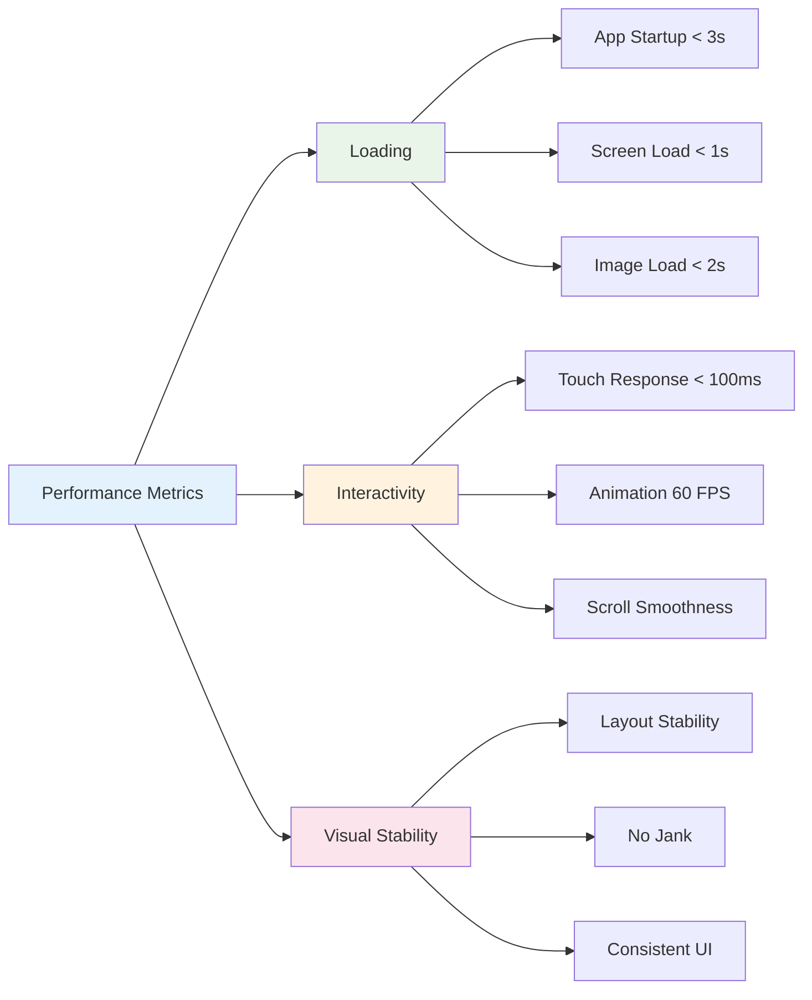

# Template de Performance Mobile

<div align="center">

## Guia Completo de Otimização de Performance para Apps Mobile - Framework Enterprise

[](https://flutter.dev/docs/perf)
[](https://flutter.dev)
[](https://reactnative.dev)
[](https://firebase.google.com/products/performance)
[](https://github.com/datametria/standards)
[](https://aws.amazon.com/q/)

[🔗 Template Original](link) • [🔗 Diretrizes](link) • [🔗 Exemplos](link)

[⚡ Métricas](#-métricas-de-performance) • [🚀 Startup](#-otimização-de-startup) • [🎨 Rendering](#-otimização-de-rendering) •
[💾 Memória](#-gerenciamento-de-memória) • [🔋 Bateria](#-otimização-de-bateria)

</div>

---

## 📋 Índice

- [🎯 Visão Geral](#-visão-geral)
- [📋 Informações do Projeto](#-informações-do-projeto)
- [⚡ Métricas de Performance](#-métricas-de-performance)
- [🚀 Otimização de Startup](#-otimização-de-startup)
- [🎨 Otimização de Rendering](#-otimização-de-rendering)
- [💾 Gerenciamento de Memória](#-gerenciamento-de-memória)
- [🔋 Otimização de Bateria](#-otimização-de-bateria)
- [📊 Monitoramento e Analytics](#-monitoramento-e-analytics)
- [🛠️ Ferramentas de Debug](#️-ferramentas-de-debug)
- [📚 Referências](#-referências)

---

## 🎯 Visão Geral

### Framework de Performance Mobile DATAMETRIA

Este template estabelece diretrizes completas para otimização de performance em aplicações mobile, cobrindo desde métricas de startup até otimizações de bateria e memória.

#### Objetivos de Performance

- ✅ **Startup Time**: < 3 segundos para primeira tela
- ✅ **Frame Rate**: 60 FPS consistente em animações
- ✅ **Memory Usage**: < 100MB para apps médios
- ✅ **Battery Efficiency**: < 5% drain por hora de uso
- ✅ **Network Optimization**: < 500ms latência média
- ✅ **Storage Efficiency**: < 50MB cache local

---

## 📋 Informações do Projeto

| Campo | Descrição | Exemplo |
|-------|-----------|----------|
| **Nome do App** | [Nome do Aplicativo] | DATAMETRIA Mobile |
| **Plataforma** | [iOS / Android / Flutter] | Flutter (iOS 14+, Android API 21+) |
| **Versão Atual** | [X.X.X] | 2.1.0 |
| **Target Performance** | [Startup < 3s, 60 FPS] | Startup < 2.5s, 60 FPS, < 80MB RAM |
| **Responsável** | [Nome do Performance Engineer] | Vander Loto (CTO) |
| **Data da Análise** | [DD/MM/AAAA] | 15/09/2025 |
| **Próxima Revisão** | [DD/MM/AAAA] | 15/12/2025 |
| **Ferramentas** | [Firebase Performance, DevTools] | Firebase Performance, Flutter DevTools |
| **Score Atual** | [Performance Score] | 92/100 |

---

## ⚡ Métricas de Performance

### Targets de Performance Mobile

| Métrica | Target | Crítico | Ferramenta | Impacto |
|---------|--------|---------|------------|---------|
| **App Startup Time** | < 3s | < 5s | Flutter Inspector | UX |
| **Time to Interactive** | < 2s | < 4s | Performance Overlay | UX |
| **Frame Rate** | 60 FPS | > 45 FPS | GPU Profiler | UX |
| **Memory Usage** | < 100MB | < 200MB | Memory Profiler | Stability |
| **Battery Drain** | < 5%/hour | < 10%/hour | Battery Historian | Device Health |
| **Network Latency** | < 500ms | < 1s | Network Monitor | UX |
| **Storage Usage** | < 50MB | < 100MB | Device Storage | Device Health |
| **APK/IPA Size** | < 25MB | < 50MB | Build Analyzer | Download |

### Core Web Vitals para Mobile



### Ferramentas de Monitoramento

#### Flutter Performance Tools

```dart
// Performance Overlay
class MyApp extends StatelessWidget {
  @override
  Widget build(BuildContext context) {
    return MaterialApp(
      // Ativar overlay de performance em debug
      showPerformanceOverlay: kDebugMode,
      checkerboardRasterCacheImages: kDebugMode,
      checkerboardOffscreenLayers: kDebugMode,
      home: HomeScreen(),
    );
  }
}

// Timeline Events
void performExpensiveOperation() {
  Timeline.startSync('ExpensiveOperation');
  try {
    // Operação custosa
    processLargeDataSet();
  } finally {
    Timeline.finishSync();
  }
}

// Custom Performance Metrics
class PerformanceTracker {
  static final Map<String, Stopwatch> _timers = {};

  static void startTimer(String name) {
    _timers[name] = Stopwatch()..start();
  }

  static void stopTimer(String name) {
    final timer = _timers[name];
    if (timer != null) {
      timer.stop();
      print('$name took ${timer.elapsedMilliseconds}ms');
      _timers.remove(name);
    }
  }
}
```

#### Performance Monitoring

```dart
class PerformanceMonitor {
  static final FirebasePerformance _performance = FirebasePerformance.instance;

  static Future<void> trackScreenLoad(String screenName) async {
    final trace = _performance.newTrace('screen_load_$screenName');
    await trace.start();

    // Simular carregamento da tela
    await Future.delayed(Duration(milliseconds: 500));

    await trace.stop();
  }

  static Future<T> trackOperation<T>(
    String operationName,
    Future<T> Function() operation,
  ) async {
    final trace = _performance.newTrace(operationName);
    await trace.start();

    try {
      final result = await operation();
      trace.putAttribute('success', 'true');
      return result;
    } catch (e) {
      trace.putAttribute('success', 'false');
      trace.putAttribute('error', e.toString());
      rethrow;
    } finally {
      await trace.stop();
    }
  }

  static void trackCustomMetric(String name, int value) {
    final trace = _performance.newTrace('custom_metric');
    trace.putMetric(name, value);
  }
}
```

#### React Native Performance Tools

```typescript
// Performance Monitor para React Native
import { Performance } from 'react-native-performance';
import { InteractionManager } from 'react-native';

class RNPerformanceTracker {
  private static timers: Map<string, number> = new Map();

  static startTimer(name: string): void {
    this.timers.set(name, Date.now());
  }

  static stopTimer(name: string): number {
    const startTime = this.timers.get(name);
    if (!startTime) return 0;

    const duration = Date.now() - startTime;
    console.log(`${name} took ${duration}ms`);
    this.timers.delete(name);
    return duration;
  }

  static measureRender<T>(componentName: string, renderFn: () => T): T {
    this.startTimer(`render_${componentName}`);
    const result = renderFn();
    this.stopTimer(`render_${componentName}`);
    return result;
  }
}

// Flipper Integration
import { logger } from 'react-native-logs';

const performanceLogger = logger.createLogger({
  severity: __DEV__ ? logger.consoleTransport : logger.fileAsyncTransport,
  transport: __DEV__ ? logger.consoleTransport : logger.fileAsyncTransport,
});

// Bundle Size Analysis
import { bundleSize } from '@react-native-community/cli-tools';

const analyzeBundleSize = () => {
  if (__DEV__) {
    bundleSize.analyze({
      platform: 'android',
      dev: false,
      minify: true,
    });
  }
};
```

#### React Native Startup Optimization

```typescript
// App.tsx - Startup otimizado
import React, { useEffect, useState } from 'react';
import { AppState, InteractionManager } from 'react-native';
import SplashScreen from 'react-native-splash-screen';

const App: React.FC = () => {
  const [isReady, setIsReady] = useState(false);

  useEffect(() => {
    const initializeApp = async () => {
      RNPerformanceTracker.startTimer('app_startup');

      // Inicialização crítica apenas
      await Promise.all([
        initializeAuth(),
        loadCriticalConfig(),
      ]);

      // Aguardar interações terminarem
      InteractionManager.runAfterInteractions(() => {
        // Inicialização não crítica
        initializeNonCriticalServices();

        setIsReady(true);
        SplashScreen.hide();
        RNPerformanceTracker.stopTimer('app_startup');
      });
    };

    initializeApp();
  }, []);

  if (!isReady) {
    return <LoadingScreen />;
  }

  return <MainNavigator />;
};
```

#### React Native Memory Optimization

```typescript
// Image Optimization
import FastImage from 'react-native-fast-image';

const OptimizedImage: React.FC<{uri: string}> = ({ uri }) => {
  return (
    <FastImage
      source={{
        uri,
        priority: FastImage.priority.normal,
        cache: FastImage.cacheControl.immutable,
      }}
      resizeMode={FastImage.resizeMode.contain}
      onLoadEnd={() => {
        // Liberar recursos após carregamento
      }}
    />
  );
};

// List Optimization
import { FlatList, VirtualizedList } from 'react-native';

const OptimizedList: React.FC = ({ data }) => {
  const renderItem = useCallback(({ item }) => (
    <MemoizedListItem item={item} />
  ), []);

  const getItemLayout = useCallback((data, index) => ({
    length: ITEM_HEIGHT,
    offset: ITEM_HEIGHT * index,
    index,
  }), []);

  return (
    <FlatList
      data={data}
      renderItem={renderItem}
      getItemLayout={getItemLayout}
      removeClippedSubviews={true}
      maxToRenderPerBatch={10}
      windowSize={10}
      initialNumToRender={5}
      keyExtractor={(item) => item.id}
    />
  );
};
```

#### React Native Animation Performance

```typescript
// Reanimated 3 Optimizations
import Animated, {
  useSharedValue,
  useAnimatedStyle,
  withSpring,
  runOnJS,
} from 'react-native-reanimated';

const PerformantAnimation: React.FC = () => {
  const translateX = useSharedValue(0);
  const opacity = useSharedValue(1);

  const animatedStyle = useAnimatedStyle(() => {
    return {
      transform: [{ translateX: translateX.value }],
      opacity: opacity.value,
    };
  }, []);

  const startAnimation = () => {
    translateX.value = withSpring(100, {
      damping: 15,
      stiffness: 150,
    });
  };

  return (
    <Animated.View style={[styles.box, animatedStyle]}>
      {/* Content */}
    </Animated.View>
  );
};

// Gesture Handler Optimization
import { PanGestureHandler } from 'react-native-gesture-handler';

const OptimizedGesture: React.FC = () => {
  const gestureHandler = useAnimatedGestureHandler({
    onStart: (_, context) => {
      context.startX = translateX.value;
    },
    onActive: (event, context) => {
      translateX.value = context.startX + event.translationX;
    },
    onEnd: () => {
      translateX.value = withSpring(0);
    },
  });

  return (
    <PanGestureHandler onGestureEvent={gestureHandler}>
      <Animated.View style={animatedStyle} />
    </PanGestureHandler>
  );
};
```

---

## 🚀 Otimização de Startup

### Análise de Startup Time

#### Medição de Startup

```dart
class StartupProfiler {
  static DateTime? _appStartTime;
  static DateTime? _firstFrameTime;
  static final List<String> _milestones = [];

  static void markAppStart() {
    _appStartTime = DateTime.now();
    _addMilestone('App Start');
  }

  static void markMilestone(String name) {
    _addMilestone(name);
  }

  static void markFirstFrame() {
    _firstFrameTime = DateTime.now();
    _addMilestone('First Frame');

    if (_appStartTime != null) {
      final startupTime = _firstFrameTime!.difference(_appStartTime!);
      print('Startup time: ${startupTime.inMilliseconds}ms');

      // Enviar métrica para analytics
      FirebaseAnalytics.instance.logEvent(
        name: 'app_startup_time',
        parameters: {
          'duration_ms': startupTime.inMilliseconds,
          'milestones': _milestones.join(','),
        },
      );
    }
  }

  static void _addMilestone(String name) {
    final now = DateTime.now();
    final elapsed = _appStartTime != null
        ? now.difference(_appStartTime!).inMilliseconds
        : 0;
    _milestones.add('$name:${elapsed}ms');
    print('Milestone: $name at ${elapsed}ms');
  }
}

// No main.dart
void main() {
  StartupProfiler.markAppStart();

  // Inicialização crítica
  WidgetsFlutterBinding.ensureInitialized();
  StartupProfiler.markMilestone('Flutter Initialized');

  runApp(MyApp());
}
```

### Otimizações de Startup

#### 1. Flutter - Lazy Loading de Dependências

```dart
class ServiceLocator {
  static final Map<Type, dynamic> _services = {};
  static final Map<Type, Function> _factories = {};
  static final Map<Type, bool> _singletons = {};

  // Registro lazy
  static void registerLazy<T>(T Function() factory, {bool singleton = true}) {
    _factories[T] = factory;
    _singletons[T] = singleton;
  }

  // Get com lazy loading
  static T get<T>() {
    if (_services.containsKey(T)) {
      return _services[T] as T;
    }

    if (_factories.containsKey(T)) {
      final service = _factories[T]!() as T;

      if (_singletons[T] == true) {
        _services[T] = service;
      }

      return service;
    }

    throw Exception('Service $T not registered');
  }

  // Preload crítico
  static Future<void> preloadCritical() async {
    final criticalServices = [
      DatabaseService,
      AuthService,
      ConfigService,
    ];

    for (final serviceType in criticalServices) {
      if (_factories.containsKey(serviceType)) {
        get<dynamic>();
      }
    }
  }
}

// Setup de serviços
void setupServices() {
  // Serviços críticos
  ServiceLocator.registerLazy<DatabaseService>(() => DatabaseService());
  ServiceLocator.registerLazy<AuthService>(() => AuthService());

  // Serviços não críticos (lazy)
  ServiceLocator.registerLazy<AnalyticsService>(() => AnalyticsService(), singleton: false);
  ServiceLocator.registerLazy<NotificationService>(() => NotificationService());
}

// React Native Startup Optimization
class RNStartupOptimizer {
  private static startTime: number = Date.now();
  private static milestones: Array<{name: string, time: number}> = [];

  static markMilestone(name: string): void {
    const elapsed = Date.now() - this.startTime;
    this.milestones.push({ name, time: elapsed });
    console.log(`Milestone: ${name} at ${elapsed}ms`);
  }

  static async initializeApp(): Promise<void> {
    this.markMilestone('App Start');

    // Inicialização crítica
    await Promise.all([
      this.initializeAuth(),
      this.loadConfig(),
    ]);
    this.markMilestone('Critical Services Loaded');

    // Aguardar interações
    InteractionManager.runAfterInteractions(() => {
      this.initializeNonCritical();
      this.markMilestone('App Ready');
    });
  }

  private static async initializeAuth(): Promise<void> {
    // Inicialização de autenticação
  }

  private static async loadConfig(): Promise<void> {
    // Carregamento de configurações
  }

  private static initializeNonCritical(): void {
    // Analytics, push notifications, etc.
  }
}
  ServiceLocator.registerLazy<AuthService>(() => AuthService());

  // Serviços não críticos (lazy)
  ServiceLocator.registerLazy<AnalyticsService>(() => AnalyticsService());
  ServiceLocator.registerLazy<CacheService>(() => CacheService());
}
```

#### 2. Splash Screen Otimizada

```dart
class OptimizedSplashScreen extends StatefulWidget {
  @override
  _OptimizedSplashScreenState createState() => _OptimizedSplashScreenState();
}

class _OptimizedSplashScreenState extends State<OptimizedSplashScreen> {
  double _progress = 0.0;
  String _currentTask = 'Inicializando...';

  @override
  void initState() {
    super.initState();
    _initializeApp();
  }

  Future<void> _initializeApp() async {
    try {
      // Inicialização paralela com progress
      await _runWithProgress('Configurando Firebase', _initializeFirebase);
      await _runWithProgress('Carregando preferências', _loadUserPreferences);
      await _runWithProgress('Preparando dados', _preloadCriticalData);
      await _runWithProgress('Finalizando', _finalizeSetup);

      // Navegar para tela principal
      Navigator.of(context).pushReplacement(
        MaterialPageRoute(builder: (_) => HomeScreen()),
      );
    } catch (e) {
      _showError(e.toString());
    }
  }

  Future<void> _runWithProgress(String task, Future<void> Function() action) async {
    setState(() {
      _currentTask = task;
    });

    await action();

    setState(() {
      _progress += 0.25;
    });
  }

  Future<void> _initializeFirebase() async {
    await Firebase.initializeApp();
    StartupProfiler.markMilestone('Firebase Initialized');
  }

  Future<void> _loadUserPreferences() async {
    final prefs = await SharedPreferences.getInstance();
    // Carregar configurações críticas
    StartupProfiler.markMilestone('Preferences Loaded');
  }

  Future<void> _preloadCriticalData() async {
    await ServiceLocator.preloadCritical();
    StartupProfiler.markMilestone('Services Preloaded');
  }

  Future<void> _finalizeSetup() async {
    // Setup final
    await Future.delayed(Duration(milliseconds: 200));
    StartupProfiler.markMilestone('Setup Complete');
  }

  @override
  Widget build(BuildContext context) {
    return Scaffold(
      body: Center(
        child: Column(
          mainAxisAlignment: MainAxisAlignment.center,
          children: [
            // Logo
            Image.asset('assets/logo.png', width: 120, height: 120),
            SizedBox(height: 40),

            // Progress
            Container(
              width: 200,
              child: LinearProgressIndicator(
                value: _progress,
                backgroundColor: Colors.grey[300],
                valueColor: AlwaysStoppedAnimation<Color>(Colors.blue),
              ),
            ),
            SizedBox(height: 20),

            // Task description
            Text(
              _currentTask,
              style: TextStyle(fontSize: 16, color: Colors.grey[600]),
            ),
          ],
        ),
      ),
    );
  }

  void _showError(String error) {
    showDialog(
      context: context,
      builder: (context) => AlertDialog(
        title: Text('Erro de Inicialização'),
        content: Text(error),
        actions: [
          TextButton(
            onPressed: () => _initializeApp(),
            child: Text('Tentar Novamente'),
          ),
        ],
      ),
    );
  }
}
```

#### 3. Code Splitting e Lazy Loading

```dart
// Carregamento lazy de telas
class LazyRoutes {
  static Route<dynamic> generateRoute(RouteSettings settings) {
    switch (settings.name) {
      case '/':
        return MaterialPageRoute(builder: (_) => HomeScreen());

      case '/profile':
        return MaterialPageRoute(
          builder: (_) => LazyScreenLoader(
            loader: () => _loadProfileModule(),
            placeholder: SkeletonScreen(),
          ),
        );

      case '/settings':
        return MaterialPageRoute(
          builder: (_) => LazyScreenLoader(
            loader: () => _loadSettingsModule(),
            placeholder: SkeletonScreen(),
          ),
        );

      default:
        return MaterialPageRoute(builder: (_) => NotFoundScreen());
    }
  }

  static Future<Widget> _loadProfileModule() async {
    // Simular carregamento de módulo
    await Future.delayed(Duration(milliseconds: 100));
    return ProfileScreen();
  }

  static Future<Widget> _loadSettingsModule() async {
    await Future.delayed(Duration(milliseconds: 100));
    return SettingsScreen();
  }
}

class LazyScreenLoader extends StatefulWidget {
  final Future<Widget> Function() loader;
  final Widget placeholder;

  const LazyScreenLoader({
    Key? key,
    required this.loader,
    required this.placeholder,
  }) : super(key: key);

  @override
  _LazyScreenLoaderState createState() => _LazyScreenLoaderState();
}

class _LazyScreenLoaderState extends State<LazyScreenLoader> {
  late Future<Widget> _future;

  @override
  void initState() {
    super.initState();
    _future = widget.loader();
  }

  @override
  Widget build(BuildContext context) {
    return FutureBuilder<Widget>(
      future: _future,
      builder: (context, snapshot) {
        if (snapshot.hasData) {
          return snapshot.data!;
        } else if (snapshot.hasError) {
          return ErrorScreen(error: snapshot.error.toString());
        }
        return widget.placeholder;
      },
    );
  }
}
```

#### 2. React Native - Bundle Splitting

```typescript
// Metro config para code splitting
const { getDefaultConfig } = require('metro-config');

module.exports = (async () => {
  const {
    resolver: { sourceExts, assetExts },
  } = await getDefaultConfig();

  return {
    transformer: {
      babelTransformerPath: require.resolve('react-native-svg-transformer'),
    },
    resolver: {
      assetExts: assetExts.filter(ext => ext !== 'svg'),
      sourceExts: [...sourceExts, 'svg'],
    },
    // Bundle splitting
    serializer: {
      createModuleIdFactory: () => {
        return (path) => {
          // Gerar IDs determinísticos para melhor caching
          return require('crypto').createHash('md5').update(path).digest('hex').substr(0, 8);
        };
      },
    },
  };
})();

// Lazy loading de telas
import { lazy, Suspense } from 'react';

const LazyHomeScreen = lazy(() => import('./screens/HomeScreen'));
const LazyProfileScreen = lazy(() => import('./screens/ProfileScreen'));

const AppNavigator = () => {
  return (
    <NavigationContainer>
      <Stack.Navigator>
        <Stack.Screen
          name="Home"
          component={(props) => (
            <Suspense fallback={<LoadingSpinner />}>
              <LazyHomeScreen {...props} />
            </Suspense>
          )}
        />
      </Stack.Navigator>
    </NavigationContainer>
  );
};
```

---

## 🎨 Otimização de Rendering

### Análise de Frame Rate

#### Performance Overlay Customizado

```dart
class PerformanceWidget extends StatefulWidget {
  final Widget child;

  const PerformanceWidget({Key? key, required this.child}) : super(key: key);

  @override
  _PerformanceWidgetState createState() => _PerformanceWidgetState();
}

class _PerformanceWidgetState extends State<PerformanceWidget> {
  double _fps = 60.0;
  double _memoryUsage = 0.0;
  Timer? _timer;

  @override
  void initState() {
    super.initState();
    if (kDebugMode) {
      _startMonitoring();
    }
  }

  void _startMonitoring() {
    _timer = Timer.periodic(Duration(seconds: 1), (_) {
      setState(() {
        _fps = _calculateFPS();
        _memoryUsage = _getMemoryUsage();
      });
    });
  }

  double _calculateFPS() {
    // Implementação simplificada
    return 60.0; // Em produção, usar FrameCallback
  }

  double _getMemoryUsage() {
    // Implementação simplificada
    return 45.0; // Em produção, usar ProcessInfo
  }

  @override
  Widget build(BuildContext context) {
    return Stack(
      children: [
        widget.child,
        if (kDebugMode)
          Positioned(
            top: 50,
            right: 10,
            child: Container(
              padding: EdgeInsets.all(8),
              decoration: BoxDecoration(
                color: Colors.black87,
                borderRadius: BorderRadius.circular(8),
              ),
              child: Column(
                crossAxisAlignment: CrossAxisAlignment.start,
                mainAxisSize: MainAxisSize.min,
                children: [
                  Text(
                    'FPS: ${_fps.toStringAsFixed(1)}',
                    style: TextStyle(
                      color: _fps >= 55 ? Colors.green : Colors.red,
                      fontSize: 12,
                      fontWeight: FontWeight.bold,
                    ),
                  ),
                  Text(
                    'Memory: ${_memoryUsage.toStringAsFixed(1)}MB',
                    style: TextStyle(
                      color: _memoryUsage < 100 ? Colors.green : Colors.orange,
                      fontSize: 12,
                      fontWeight: FontWeight.bold,
                    ),
                  ),
                ],
              ),
            ),
          ),
      ],
    );
  }

  @override
  void dispose() {
    _timer?.cancel();
    super.dispose();
  }
}
```

### Otimizações de Rendering

#### 1. Widget Optimization

```dart
// ❌ Ruim - Rebuild desnecessário
class BadCounterWidget extends StatefulWidget {
  @override
  _BadCounterWidgetState createState() => _BadCounterWidgetState();
}

class _BadCounterWidgetState extends State<BadCounterWidget> {
  int _counter = 0;

  @override
  Widget build(BuildContext context) {
    return Column(
      children: [
        ExpensiveWidget(), // Rebuilda sempre
        Text('Counter: $_counter'),
        ElevatedButton(
          onPressed: () => setState(() => _counter++),
          child: Text('Increment'),
        ),
      ],
    );
  }
}

// ✅ Bom - Rebuild otimizado
class GoodCounterWidget extends StatefulWidget {
  @override
  _GoodCounterWidgetState createState() => _GoodCounterWidgetState();
}

class _GoodCounterWidgetState extends State<GoodCounterWidget> {
  int _counter = 0;

  @override
  Widget build(BuildContext context) {
    return Column(
      children: [
        const ExpensiveWidget(), // const - não rebuilda
        Text('Counter: $_counter'),
        ElevatedButton(
          onPressed: () => setState(() => _counter++),
          child: Text('Increment'),
        ),
      ],
    );
  }
}

// Widget otimizado com RepaintBoundary
class OptimizedExpensiveWidget extends StatelessWidget {
  const OptimizedExpensiveWidget({Key? key}) : super(key: key);

  @override
  Widget build(BuildContext context) {
    return RepaintBoundary(
      child: Container(
        width: 200,
        height: 200,
        child: CustomPaint(
          painter: ComplexPainter(),
        ),
      ),
    );
  }
}
```

#### 2. List Optimization

```dart
class OptimizedListView extends StatelessWidget {
  final List<Item> items;

  const OptimizedListView({Key? key, required this.items}) : super(key: key);

  @override
  Widget build(BuildContext context) {
    return ListView.builder(
      itemCount: items.length,
      // Otimizações importantes
      cacheExtent: 200.0, // Cache extra para scroll suave
      physics: const BouncingScrollPhysics(), // Physics otimizada
      itemBuilder: (context, index) {
        return OptimizedListItem(
          key: ValueKey(items[index].id), // Key para performance
          item: items[index],
        );
      },
    );
  }
}

class OptimizedListItem extends StatelessWidget {
  final Item item;

  const OptimizedListItem({
    Key? key,
    required this.item,
  }) : super(key: key);

  @override
  Widget build(BuildContext context) {
    return RepaintBoundary(
      child: Card(
        child: ListTile(
          leading: OptimizedNetworkImage(
            imageUrl: item.imageUrl,
            width: 50,
            height: 50,
          ),
          title: Text(item.title),
          subtitle: Text(item.description),
          onTap: () => _handleTap(context),
        ),
      ),
    );
  }

  void _handleTap(BuildContext context) {
    // Navegação otimizada
    Navigator.of(context).push(
      MaterialPageRoute(
        builder: (_) => ItemDetailScreen(item: item),
      ),
    );
  }
}
```

#### 3. Image Optimization

```dart
class OptimizedNetworkImage extends StatelessWidget {
  final String imageUrl;
  final double? width;
  final double? height;
  final BoxFit fit;

  const OptimizedNetworkImage({
    Key? key,
    required this.imageUrl,
    this.width,
    this.height,
    this.fit = BoxFit.cover,
  }) : super(key: key);

  @override
  Widget build(BuildContext context) {
    return CachedNetworkImage(
      imageUrl: imageUrl,
      width: width,
      height: height,
      fit: fit,

      // Otimizações de memória
      memCacheWidth: width?.toInt(),
      memCacheHeight: height?.toInt(),
      maxWidthDiskCache: 800,
      maxHeightDiskCache: 600,

      // Placeholders otimizados
      placeholder: (context, url) => Container(
        width: width,
        height: height,
        color: Colors.grey[300],
        child: Center(
          child: SizedBox(
            width: 20,
            height: 20,
            child: CircularProgressIndicator(strokeWidth: 2),
          ),
        ),
      ),

      errorWidget: (context, url, error) => Container(
        width: width,
        height: height,
        color: Colors.grey[300],
        child: Icon(Icons.error, color: Colors.grey[600]),
      ),

      // Fade in suave
      fadeInDuration: Duration(milliseconds: 200),
      fadeOutDuration: Duration(milliseconds: 100),
    );
  }
}

// Image preloading para melhor UX
class ImagePreloader {
  static final Map<String, bool> _preloadedImages = {};

  static Future<void> preloadImages(List<String> imageUrls) async {
    final futures = imageUrls
        .where((url) => !_preloadedImages.containsKey(url))
        .map((url) => _preloadImage(url));

    await Future.wait(futures);
  }

  static Future<void> _preloadImage(String imageUrl) async {
    try {
      await precacheImage(CachedNetworkImageProvider(imageUrl),
                          NavigationService.navigatorKey.currentContext!);
      _preloadedImages[imageUrl] = true;
    } catch (e) {
      print('Failed to preload image: $imageUrl');
    }
  }
}
```

### React Native Rendering Optimization

#### 1. Component Optimization

```typescript
// Memoização de componentes
import React, { memo, useMemo, useCallback } from 'react';

const OptimizedListItem = memo<{item: Item}>(({ item }) => {
  const formattedPrice = useMemo(() => {
    return new Intl.NumberFormat('pt-BR', {
      style: 'currency',
      currency: 'BRL',
    }).format(item.price);
  }, [item.price]);

  return (
    <View style={styles.item}>
      <Text>{item.name}</Text>
      <Text>{formattedPrice}</Text>
    </View>
  );
});

// Hook otimizado para listas
const useOptimizedList = (data: Item[]) => {
  const renderItem = useCallback(({ item }: { item: Item }) => (
    <OptimizedListItem item={item} />
  ), []);

  const keyExtractor = useCallback((item: Item) => item.id, []);

  const getItemLayout = useCallback((data: Item[] | null | undefined, index: number) => ({
    length: ITEM_HEIGHT,
    offset: ITEM_HEIGHT * index,
    index,
  }), []);

  return { renderItem, keyExtractor, getItemLayout };
};
```

#### 2. FlatList Performance

```typescript
// FlatList otimizada
const PerformantFlatList: React.FC<{data: Item[]}> = ({ data }) => {
  const { renderItem, keyExtractor, getItemLayout } = useOptimizedList(data);

  return (
    <FlatList
      data={data}
      renderItem={renderItem}
      keyExtractor={keyExtractor}
      getItemLayout={getItemLayout}
      // Performance props
      removeClippedSubviews={true}
      maxToRenderPerBatch={10}
      windowSize={10}
      initialNumToRender={5}
      updateCellsBatchingPeriod={50}
      // Memory optimization
      onEndReachedThreshold={0.5}
      legacyImplementation={false}
    />
  );
};
```

---

## 💾 Gerenciamento de Memória

### Análise de Memory Usage

#### Memory Profiler

```dart
class MemoryProfiler {
  static Timer? _timer;
  static final List<double> _memoryHistory = [];

  static void startMonitoring() {
    _timer = Timer.periodic(Duration(seconds: 5), (_) {
      _checkMemoryUsage();
    });
  }

  static void stopMonitoring() {
    _timer?.cancel();
    _timer = null;
  }

  static void _checkMemoryUsage() {
    // Implementação simplificada
    // Em produção, usar dart:developer ou packages específicos
    final currentUsage = _getCurrentMemoryUsage();
    _memoryHistory.add(currentUsage);

    // Manter apenas últimas 20 medições
    if (_memoryHistory.length > 20) {
      _memoryHistory.removeAt(0);
    }

    // Alertar se uso de memória for alto
    if (currentUsage > 150.0) {
      print('WARNING: High memory usage: ${currentUsage}MB');
      _suggestGarbageCollection();
    }
  }

  static double _getCurrentMemoryUsage() {
    // Implementação placeholder
    return 80.0; // MB
  }

  static void _suggestGarbageCollection() {
    // Forçar garbage collection se necessário
    // Nota: Usar com cuidado em produção
  }

  static List<double> getMemoryHistory() => List.from(_memoryHistory);
}
```

### Otimizações de Memória

#### 1. Object Pooling

```dart
class ObjectPool<T> {
  final List<T> _pool = [];
  final T Function() _factory;
  final void Function(T)? _reset;

  ObjectPool(this._factory, {void Function(T)? reset}) : _reset = reset;

  T acquire() {
    if (_pool.isNotEmpty) {
      return _pool.removeLast();
    }
    return _factory();
  }

  void release(T object) {
    _reset?.call(object);
    _pool.add(object);
  }

  void clear() {
    _pool.clear();
  }
}

// Exemplo de uso com widgets customizados
class WidgetPool {
  static final ObjectPool<Container> _containerPool = ObjectPool<Container>(
    () => Container(),
    reset: (container) {
      // Reset container properties if needed
    },
  );

  static Container getContainer() => _containerPool.acquire();
  static void releaseContainer(Container container) => _containerPool.release(container);
}
```

#### 2. Lazy Loading e Disposal

```dart
class LazyResourceManager<T> {
  T? _resource;
  final T Function() _factory;
  final void Function(T)? _disposer;
  Timer? _disposeTimer;

  LazyResourceManager(this._factory, {void Function(T)? disposer})
      : _disposer = disposer;

  T get resource {
    if (_resource == null) {
      _resource = _factory();
    }

    // Reset dispose timer
    _disposeTimer?.cancel();
    _disposeTimer = Timer(Duration(minutes: 5), _disposeIfUnused);

    return _resource!;
  }

  void _disposeIfUnused() {
    if (_resource != null) {
      _disposer?.call(_resource!);
      _resource = null;
    }
  }

  void forceDispose() {
    _disposeTimer?.cancel();
    _disposeIfUnused();
  }
}

// Exemplo com cache de imagens
class ImageCacheManager {
  static final Map<String, LazyResourceManager<ui.Image>> _imageCache = {};

  static Future<ui.Image> getImage(String url) async {
    if (!_imageCache.containsKey(url)) {
      _imageCache[url] = LazyResourceManager<ui.Image>(
        () => _loadImage(url),
        disposer: (image) => image.dispose(),
      );
    }

    return _imageCache[url]!.resource;
  }

  static ui.Image _loadImage(String url) {
    // Implementação de carregamento
    throw UnimplementedError();
  }

  static void clearCache() {
    _imageCache.values.forEach((manager) => manager.forceDispose());
    _imageCache.clear();
  }
}
```

#### 3. Stream e Subscription Management

```dart
class SubscriptionManager {
  final List<StreamSubscription> _subscriptions = [];

  void add(StreamSubscription subscription) {
    _subscriptions.add(subscription);
  }

  void addStream<T>(Stream<T> stream, void Function(T) onData) {
    final subscription = stream.listen(onData);
    add(subscription);
  }

  void cancelAll() {
    for (final subscription in _subscriptions) {
      subscription.cancel();
    }
    _subscriptions.clear();
  }

  void cancel(StreamSubscription subscription) {
    subscription.cancel();
    _subscriptions.remove(subscription);
  }
}

// Mixin para widgets com subscriptions
mixin SubscriptionMixin<T extends StatefulWidget> on State<T> {
  final SubscriptionManager _subscriptionManager = SubscriptionManager();

  void addSubscription(StreamSubscription subscription) {
    _subscriptionManager.add(subscription);
  }

  void addStreamListener<S>(Stream<S> stream, void Function(S) onData) {
    _subscriptionManager.addStream(stream, onData);
  }

  @override
  void dispose() {
    _subscriptionManager.cancelAll();
    super.dispose();
  }
}
```

### React Native Memory Management

#### 1. Image Memory Optimization

```typescript
// Gerenciador de cache de imagens
import FastImage from 'react-native-fast-image';

class ImageCacheManager {
  private static readonly MAX_CACHE_SIZE = 100 * 1024 * 1024; // 100MB
  private static cacheSize = 0;

  static preloadImages(urls: string[]): void {
    FastImage.preload(urls.map(uri => ({
      uri,
      priority: FastImage.priority.normal,
    })));
  }

  static clearCache(): void {
    FastImage.clearMemoryCache();
    FastImage.clearDiskCache();
    this.cacheSize = 0;
  }

  static monitorCacheSize(): void {
    if (this.cacheSize > this.MAX_CACHE_SIZE) {
      this.clearCache();
    }
  }
}

// Componente de imagem otimizada
const OptimizedImage: React.FC<{uri: string, size: number}> = ({ uri, size }) => {
  const [isLoaded, setIsLoaded] = useState(false);

  return (
    <FastImage
      source={{
        uri,
        priority: FastImage.priority.normal,
        cache: FastImage.cacheControl.immutable,
      }}
      style={{ width: size, height: size }}
      resizeMode={FastImage.resizeMode.cover}
      onLoad={() => setIsLoaded(true)}
      onError={() => console.warn('Failed to load image:', uri)}
    >
      {!isLoaded && <ActivityIndicator />}
    </FastImage>
  );
};
```

#### 2. Memory Leak Prevention

```typescript
// Hook para cleanup automático
const useCleanup = (cleanupFn: () => void) => {
  useEffect(() => {
    return cleanupFn;
  }, [cleanupFn]);
};

// Gerenciador de subscrições
class SubscriptionManager {
  private subscriptions: Array<() => void> = [];

  add(unsubscribe: () => void): void {
    this.subscriptions.push(unsubscribe);
  }

  cleanup(): void {
    this.subscriptions.forEach(unsubscribe => unsubscribe());
    this.subscriptions = [];
  }
}

// Uso em componentes
const ComponentWithSubscriptions: React.FC = () => {
  const subscriptionManager = useRef(new SubscriptionManager());

  useEffect(() => {
    const unsubscribe1 = someService.subscribe(callback1);
    const unsubscribe2 = anotherService.subscribe(callback2);

    subscriptionManager.current.add(unsubscribe1);
    subscriptionManager.current.add(unsubscribe2);

    return () => subscriptionManager.current.cleanup();
  }, []);

  return <View>{/* Component content */}</View>;
};
```

---

## 🔋 Otimização de Bateria

### Análise de Battery Usage

#### Battery Monitoring

```dart
class BatteryMonitor {
  static final Battery _battery = Battery();
  static Timer? _monitoringTimer;
  static int? _initialBatteryLevel;
  static DateTime? _monitoringStartTime;

  static Future<void> startMonitoring() async {
    _initialBatteryLevel = await _battery.batteryLevel;
    _monitoringStartTime = DateTime.now();

    _monitoringTimer = Timer.periodic(Duration(minutes: 1), (_) {
      _checkBatteryUsage();
    });
  }

  static void stopMonitoring() {
    _monitoringTimer?.cancel();
    _monitoringTimer = null;
  }

  static Future<void> _checkBatteryUsage() async {
    if (_initialBatteryLevel == null || _monitoringStartTime == null) return;

    final currentLevel = await _battery.batteryLevel;
    final elapsed = DateTime.now().difference(_monitoringStartTime!);
    final batteryDrain = _initialBatteryLevel! - currentLevel;

    if (elapsed.inMinutes > 0) {
      final drainPerHour = (batteryDrain / elapsed.inMinutes) * 60;

      print('Battery drain: ${drainPerHour.toStringAsFixed(1)}% per hour');

      // Alertar se drain for alto
      if (drainPerHour > 10) {
        print('WARNING: High battery drain detected');
        _optimizeBatteryUsage();
      }
    }
  }

  static void _optimizeBatteryUsage() {
    // Implementar otimizações automáticas
    LocationService.reducePrecision();
    NetworkService.reducePollFrequency();
    AnimationService.reduceFrameRate();
  }
}
```

### Otimizações de Bateria

#### 1. Location Services Optimization

```dart
class OptimizedLocationService {
  static LocationAccuracy _currentAccuracy = LocationAccuracy.high;
  static Timer? _locationTimer;
  static Position? _lastKnownPosition;

  static Future<Position?> getCurrentLocation({
    LocationAccuracy accuracy = LocationAccuracy.high,
    bool useCache = true,
  }) async {
    // Usar cache se disponível e recente
    if (useCache && _lastKnownPosition != null) {
      final age = DateTime.now().difference(_lastKnownPosition!.timestamp);
      if (age.inMinutes < 5) {
        return _lastKnownPosition;
      }
    }

    try {
      final position = await Geolocator.getCurrentPosition(
        desiredAccuracy: accuracy,
        timeLimit: Duration(seconds: 10),
      );

      _lastKnownPosition = position;
      return position;
    } catch (e) {
      print('Location error: $e');
      return _lastKnownPosition; // Fallback para última posição conhecida
    }
  }

  static void startLocationTracking({
    Duration interval = const Duration(minutes: 5),
    LocationAccuracy accuracy = LocationAccuracy.balanced,
  }) {
    _currentAccuracy = accuracy;

    _locationTimer = Timer.periodic(interval, (_) async {
      await getCurrentLocation(accuracy: accuracy, useCache: false);
    });
  }

  static void stopLocationTracking() {
    _locationTimer?.cancel();
    _locationTimer = null;
  }

  static void reducePrecision() {
    if (_currentAccuracy == LocationAccuracy.high) {
      _currentAccuracy = LocationAccuracy.medium;
      print('Location accuracy reduced to save battery');
    }
  }
}
```

#### 2. Network Optimization

```dart
class BatteryOptimizedNetworkService {
  static Timer? _syncTimer;
  static Duration _syncInterval = Duration(minutes: 5);
  static final List<Function> _pendingRequests = [];

  static void startPeriodicSync() {
    _syncTimer = Timer.periodic(_syncInterval, (_) {
      _executeBatchRequests();
    });
  }

  static void stopPeriodicSync() {
    _syncTimer?.cancel();
    _syncTimer = null;
  }

  static void addToBatch(Function request) {
    _pendingRequests.add(request);
  }

  static Future<void> _executeBatchRequests() async {
    if (_pendingRequests.isEmpty) return;

    print('Executing ${_pendingRequests.length} batched requests');

    // Executar todas as requisições em paralelo
    final futures = _pendingRequests.map((request) => request()).toList();
    _pendingRequests.clear();

    try {
      await Future.wait(futures, eagerError: false);
    } catch (e) {
      print('Batch request error: $e');
    }
  }

  static void reducePollFrequency() {
    if (_syncInterval.inMinutes < 10) {
      _syncInterval = Duration(minutes: 10);

      // Restart timer with new interval
      stopPeriodicSync();
      startPeriodicSync();

      print('Network sync frequency reduced to save battery');
    }
  }

  // Intelligent caching
  static final Map<String, CachedResponse> _cache = {};

  static Future<T> cachedRequest<T>(
    String key,
    Future<T> Function() request, {
    Duration cacheDuration = const Duration(minutes: 10),
  }) async {
    final cached = _cache[key];

    if (cached != null && !cached.isExpired) {
      return cached.data as T;
    }

    final data = await request();
    _cache[key] = CachedResponse(data, DateTime.now().add(cacheDuration));

    return data;
  }
}

class CachedResponse {
  final dynamic data;
  final DateTime expiresAt;

  CachedResponse(this.data, this.expiresAt);

  bool get isExpired => DateTime.now().isAfter(expiresAt);
}
```

#### 3. Animation Optimization

```dart
class BatteryOptimizedAnimations {
  static bool _reducedMotion = false;
  static double _frameRateMultiplier = 1.0;

  static void enableReducedMotion() {
    _reducedMotion = true;
    _frameRateMultiplier = 0.5; // Reduzir frame rate
    print('Reduced motion enabled for battery saving');
  }

  static void disableReducedMotion() {
    _reducedMotion = false;
    _frameRateMultiplier = 1.0;
  }

  static AnimationController createOptimizedController({
    required Duration duration,
    required TickerProvider vsync,
  }) {
    final adjustedDuration = Duration(
      milliseconds: (duration.inMilliseconds / _frameRateMultiplier).round(),
    );

    return AnimationController(
      duration: adjustedDuration,
      vsync: vsync,
    );
  }

  static Widget optimizedAnimatedBuilder({
    required Animation<double> animation,
    required Widget Function(BuildContext, Widget?) builder,
    Widget? child,
  }) {
    if (_reducedMotion) {
      // Retornar estado final da animação
      return builder(NavigationService.navigatorKey.currentContext!, child);
    }

    return AnimatedBuilder(
      animation: animation,
      builder: builder,
      child: child,
    );
  }

  static void reduceFrameRate() {
    if (_frameRateMultiplier > 0.3) {
      _frameRateMultiplier *= 0.7;
      print('Animation frame rate reduced to save battery');
    }
  }
}
```

### React Native Battery Optimization

#### 1. Background Task Management

```typescript
// Background task otimizado
import BackgroundTask from 'react-native-background-task';
import { AppState } from 'react-native';

class BackgroundTaskManager {
  private static backgroundTaskId: number | null = null;
  private static isAppInBackground = false;

  static initialize(): void {
    AppState.addEventListener('change', this.handleAppStateChange);
  }

  private static handleAppStateChange = (nextAppState: string): void => {
    if (nextAppState === 'background' && !this.isAppInBackground) {
      this.startBackgroundTask();
      this.isAppInBackground = true;
    } else if (nextAppState === 'active' && this.isAppInBackground) {
      this.stopBackgroundTask();
      this.isAppInBackground = false;
    }
  };

  private static startBackgroundTask(): void {
    this.backgroundTaskId = BackgroundTask.start({
      taskName: 'DataSync',
      taskFn: () => {
        // Apenas tarefas críticas
        this.syncCriticalData();
      },
    });
  }

  private static stopBackgroundTask(): void {
    if (this.backgroundTaskId) {
      BackgroundTask.stop(this.backgroundTaskId);
      this.backgroundTaskId = null;
    }
  }

  private static async syncCriticalData(): Promise<void> {
    // Sincronizar apenas dados críticos
    try {
      await syncUserPreferences();
      await syncPendingActions();
    } catch (error) {
      console.warn('Background sync failed:', error);
    }
  }
}
```

#### 2. Network Request Optimization

```typescript
// Request batching para economizar bateria
class RequestBatcher {
  private static pendingRequests: Map<string, any[]> = new Map();
  private static batchTimeout: NodeJS.Timeout | null = null;

  static addRequest(endpoint: string, data: any): Promise<any> {
    return new Promise((resolve, reject) => {
      if (!this.pendingRequests.has(endpoint)) {
        this.pendingRequests.set(endpoint, []);
      }

      this.pendingRequests.get(endpoint)!.push({ data, resolve, reject });

      if (!this.batchTimeout) {
        this.batchTimeout = setTimeout(() => {
          this.processBatch();
        }, 1000); // Batch por 1 segundo
      }
    });
  }

  private static async processBatch(): Promise<void> {
    const requests = new Map(this.pendingRequests);
    this.pendingRequests.clear();
    this.batchTimeout = null;

    for (const [endpoint, batch] of requests) {
      try {
        const batchData = batch.map(item => item.data);
        const results = await this.sendBatchRequest(endpoint, batchData);

        batch.forEach((item, index) => {
          item.resolve(results[index]);
        });
      } catch (error) {
        batch.forEach(item => item.reject(error));
      }
    }
  }

  private static async sendBatchRequest(endpoint: string, data: any[]): Promise<any[]> {
    const response = await fetch(`${endpoint}/batch`, {
      method: 'POST',
      headers: { 'Content-Type': 'application/json' },
      body: JSON.stringify({ requests: data }),
    });
    return response.json();
  }
}
```

### React Native Analytics & Monitoring

#### 1. Performance Monitoring

```typescript
// React Native Performance Monitor
import { PerformanceObserver, performance } from 'react-native-performance';
import crashlytics from '@react-native-firebase/crashlytics';

class RNPerformanceMonitor {
  private static observer: PerformanceObserver | null = null;

  static initialize(): void {
    // Monitor de performance
    this.observer = new PerformanceObserver((list) => {
      const entries = list.getEntries();
      entries.forEach((entry) => {
        this.logPerformanceEntry(entry);
      });
    });

    this.observer.observe({ entryTypes: ['measure', 'navigation'] });
  }

  static measureScreenLoad(screenName: string): void {
    performance.mark(`${screenName}_start`);

    // Medir quando a tela estiver pronta
    InteractionManager.runAfterInteractions(() => {
      performance.mark(`${screenName}_end`);
      performance.measure(
        `screen_load_${screenName}`,
        `${screenName}_start`,
        `${screenName}_end`
      );
    });
  }

  private static logPerformanceEntry(entry: any): void {
    const data = {
      name: entry.name,
      duration: entry.duration,
      startTime: entry.startTime,
      timestamp: Date.now(),
    };

    // Enviar para Firebase Analytics
    analytics().logEvent('performance_metric', data);

    // Log para Crashlytics se performance ruim
    if (entry.duration > 1000) {
      crashlytics().log(`Slow performance: ${entry.name} took ${entry.duration}ms`);
    }
  }
}
```

#### 2. Memory Monitoring

```typescript
// Memory usage monitor
class MemoryMonitor {
  private static interval: NodeJS.Timeout | null = null;
  private static readonly MEMORY_THRESHOLD = 150 * 1024 * 1024; // 150MB

  static startMonitoring(): void {
    this.interval = setInterval(() => {
      this.checkMemoryUsage();
    }, 30000); // Check every 30 seconds
  }

  static stopMonitoring(): void {
    if (this.interval) {
      clearInterval(this.interval);
      this.interval = null;
    }
  }

  private static async checkMemoryUsage(): Promise<void> {
    try {
      const memoryInfo = await this.getMemoryInfo();

      if (memoryInfo.totalMemory > this.MEMORY_THRESHOLD) {
        console.warn('High memory usage detected:', memoryInfo);

        // Trigger garbage collection
        this.triggerGC();

        // Log to analytics
        analytics().logEvent('high_memory_usage', {
          totalMemory: memoryInfo.totalMemory,
          freeMemory: memoryInfo.freeMemory,
        });
      }
    } catch (error) {
      console.error('Memory monitoring error:', error);
    }
  }

  private static async getMemoryInfo(): Promise<{totalMemory: number, freeMemory: number}> {
    // Implementação específica da plataforma
    if (Platform.OS === 'android') {
      return await this.getAndroidMemoryInfo();
    } else {
      return await this.getIOSMemoryInfo();
    }
  }

  private static triggerGC(): void {
    // Forçar garbage collection se possível
    if (global.gc) {
      global.gc();
    }
  }
}
```

---

## 📊 Monitoramento e Analytics

### Performance Analytics

#### Custom Performance Metrics

```dart
class PerformanceAnalytics {
  static final FirebaseAnalytics _analytics = FirebaseAnalytics.instance;
  static final Map<String, Stopwatch> _timers = {};

  static void trackScreenPerformance(String screenName) {
    final timer = Stopwatch()..start();
    _timers[screenName] = timer;

    WidgetsBinding.instance.addPostFrameCallback((_) {
      timer.stop();

      _analytics.logEvent(
        name: 'screen_performance',
        parameters: {
          'screen_name': screenName,
          'load_time_ms': timer.elapsedMilliseconds,
          'timestamp': DateTime.now().millisecondsSinceEpoch,
        },
      );
    });
  }

  static void trackUserAction(String action, {Map<String, dynamic>? parameters}) {
    final baseParams = {
      'action': action,
      'timestamp': DateTime.now().millisecondsSinceEpoch,
    };

    if (parameters != null) {
      baseParams.addAll(parameters);
    }

    _analytics.logEvent(name: 'user_action', parameters: baseParams);
  }

  static void trackPerformanceIssue(String issue, {String? details}) {
    _analytics.logEvent(
      name: 'performance_issue',
      parameters: {
        'issue_type': issue,
        'details': details ?? '',
        'timestamp': DateTime.now().millisecondsSinceEpoch,
      },
    );
  }

  static void trackMemoryUsage(double memoryMB) {
    _analytics.logEvent(
      name: 'memory_usage',
      parameters: {
        'memory_mb': memoryMB,
        'timestamp': DateTime.now().millisecondsSinceEpoch,
      },
    );
  }
}
```

#### Performance Dashboard

```dart
class PerformanceDashboard extends StatefulWidget {
  @override
  _PerformanceDashboardState createState() => _PerformanceDashboardState();
}

class _PerformanceDashboardState extends State<PerformanceDashboard> {
  final Map<String, double> _metrics = {
    'fps': 60.0,
    'memory': 45.0,
    'battery': 85.0,
    'network': 250.0,
  };

  @override
  Widget build(BuildContext context) {
    return Scaffold(
      appBar: AppBar(title: Text('Performance Dashboard')),
      body: Padding(
        padding: EdgeInsets.all(16),
        child: Column(
          children: [
            _buildMetricCard('Frame Rate', '${_metrics['fps']!.toInt()} FPS',
                           _metrics['fps']! >= 55 ? Colors.green : Colors.red),
            _buildMetricCard('Memory Usage', '${_metrics['memory']!.toInt()} MB',
                           _metrics['memory']! < 100 ? Colors.green : Colors.orange),
            _buildMetricCard('Battery Level', '${_metrics['battery']!.toInt()}%',
                           _metrics['battery']! > 20 ? Colors.green : Colors.red),
            _buildMetricCard('Network Latency', '${_metrics['network']!.toInt()} ms',
                           _metrics['network']! < 500 ? Colors.green : Colors.orange),
          ],
        ),
      ),
    );
  }

  Widget _buildMetricCard(String title, String value, Color color) {
    return Card(
      margin: EdgeInsets.symmetric(vertical: 8),
      child: ListTile(
        title: Text(title),
        trailing: Text(
          value,
          style: TextStyle(
            fontSize: 18,
            fontWeight: FontWeight.bold,
            color: color,
          ),
        ),
      ),
    );
  }
}
```

### React Native Debug Tools

#### 1. Flipper Integration

```typescript
// Flipper plugins setup
import { logger } from 'flipper-plugin';

class FlipperLogger {
  static logPerformance(event: string, data: any): void {
    if (__DEV__) {
      logger.track('performance', event, data);
    }
  }

  static logNetworkRequest(url: string, method: string, duration: number): void {
    if (__DEV__) {
      logger.track('network', 'request', {
        url,
        method,
        duration,
        timestamp: Date.now(),
      });
    }
  }

  static logMemoryUsage(usage: number): void {
    if (__DEV__) {
      logger.track('memory', 'usage', {
        usage,
        timestamp: Date.now(),
      });
    }
  }
}
```

#### 2. React DevTools Profiler

```typescript
// Profiler wrapper para componentes
import { Profiler } from 'react';

const ProfiledComponent: React.FC<{children: React.ReactNode, id: string}> = ({ children, id }) => {
  const onRenderCallback = (
    id: string,
    phase: 'mount' | 'update',
    actualDuration: number,
    baseDuration: number,
    startTime: number,
    commitTime: number
  ) => {
    if (__DEV__) {
      console.log('Profiler:', {
        id,
        phase,
        actualDuration,
        baseDuration,
        startTime,
        commitTime,
      });

      // Log para analytics se renderização lenta
      if (actualDuration > 16) { // > 1 frame (60fps)
        FlipperLogger.logPerformance('slow_render', {
          componentId: id,
          duration: actualDuration,
          phase,
        });
      }
    }
  };

  return (
    <Profiler id={id} onRender={onRenderCallback}>
      {children}
    </Profiler>
  );
};

// Uso do profiler
const App = () => {
  return (
    <ProfiledComponent id="App">
      <NavigationContainer>
        <ProfiledComponent id="Navigation">
          <MainStack />
        </ProfiledComponent>
      </NavigationContainer>
    </ProfiledComponent>
  );
};
```

#### 3. Performance Testing

```typescript
// Testes de performance automatizados
import { performance } from 'react-native-performance';

class PerformanceTest {
  static async testScreenLoad(screenName: string): Promise<number> {
    const startTime = performance.now();

    // Navegar para a tela
    await this.navigateToScreen(screenName);

    // Aguardar renderização completa
    await this.waitForScreenReady();

    const endTime = performance.now();
    const duration = endTime - startTime;

    console.log(`Screen ${screenName} loaded in ${duration}ms`);
    return duration;
  }

  static async testListScrolling(listRef: any): Promise<{fps: number, jank: number}> {
    const startTime = performance.now();
    let frameCount = 0;
    let jankCount = 0;
    let lastFrameTime = startTime;

    const frameCallback = () => {
      const currentTime = performance.now();
      const frameDuration = currentTime - lastFrameTime;

      frameCount++;

      // Detectar jank (frame > 16.67ms para 60fps)
      if (frameDuration > 16.67) {
        jankCount++;
      }

      lastFrameTime = currentTime;
    };

    // Simular scroll
    await this.simulateScroll(listRef, frameCallback);

    const totalTime = performance.now() - startTime;
    const fps = (frameCount / totalTime) * 1000;

    return { fps, jank: jankCount };
  }

  private static async navigateToScreen(screenName: string): Promise<void> {
    // Implementação de navegação
  }

  private static async waitForScreenReady(): Promise<void> {
    return new Promise(resolve => {
      InteractionManager.runAfterInteractions(resolve);
    });
  }

  private static async simulateScroll(listRef: any, frameCallback: () => void): Promise<void> {
    // Implementação de simulação de scroll
  }
}
```

---

## 🛠️ Ferramentas de Debug

### Performance Debugging Tools

#### Custom Performance Inspector

```dart
class PerformanceInspector {
  static bool _enabled = kDebugMode;
  static final List<PerformanceEvent> _events = [];

  static void enable() => _enabled = true;
  static void disable() => _enabled = false;

  static void logEvent(String name, {Map<String, dynamic>? data}) {
    if (!_enabled) return;

    _events.add(PerformanceEvent(
      name: name,
      timestamp: DateTime.now(),
      data: data ?? {},
    ));

    // Manter apenas últimos 100 eventos
    if (_events.length > 100) {
      _events.removeAt(0);
    }
  }

  static List<PerformanceEvent> getEvents() => List.from(_events);

  static void exportEvents() {
    final json = _events.map((e) => e.toJson()).toList();
    print('Performance Events: ${jsonEncode(json)}');
  }

  static void clearEvents() => _events.clear();
}

class PerformanceEvent {
  final String name;
  final DateTime timestamp;
  final Map<String, dynamic> data;

  PerformanceEvent({
    required this.name,
    required this.timestamp,
    required this.data,
  });

  Map<String, dynamic> toJson() => {
    'name': name,
    'timestamp': timestamp.toIso8601String(),
    'data': data,
  };
}
```

#### Debug Overlay

```dart
class DebugOverlay extends StatefulWidget {
  final Widget child;

  const DebugOverlay({Key? key, required this.child}) : super(key: key);

  @override
  _DebugOverlayState createState() => _DebugOverlayState();
}

class _DebugOverlayState extends State<DebugOverlay> {
  bool _showOverlay = false;

  @override
  Widget build(BuildContext context) {
    return GestureDetector(
      onLongPress: () {
        if (kDebugMode) {
          setState(() => _showOverlay = !_showOverlay);
        }
      },
      child: Stack(
        children: [
          widget.child,
          if (_showOverlay && kDebugMode)
            Positioned(
              bottom: 50,
              left: 10,
              right: 10,
              child: Container(
                padding: EdgeInsets.all(16),
                decoration: BoxDecoration(
                  color: Colors.black87,
                  borderRadius: BorderRadius.circular(8),
                ),
                child: Column(
                  crossAxisAlignment: CrossAxisAlignment.start,
                  mainAxisSize: MainAxisSize.min,
                  children: [
                    Text('Debug Info',
                         style: TextStyle(color: Colors.white, fontWeight: FontWeight.bold)),
                    SizedBox(height: 8),
                    _buildDebugInfo(),
                  ],
                ),
              ),
            ),
        ],
      ),
    );
  }

  Widget _buildDebugInfo() {
    return Column(
      crossAxisAlignment: CrossAxisAlignment.start,
      children: [
        Text('Events: ${PerformanceInspector.getEvents().length}',
             style: TextStyle(color: Colors.white70)),
        Text('Memory: ${_getMemoryInfo()}',
             style: TextStyle(color: Colors.white70)),
        Text('Build: ${_getBuildInfo()}',
             style: TextStyle(color: Colors.white70)),
        SizedBox(height: 8),
        Row(
          children: [
            ElevatedButton(
              onPressed: () => PerformanceInspector.exportEvents(),
              child: Text('Export'),
            ),
            SizedBox(width: 8),
            ElevatedButton(
              onPressed: () => PerformanceInspector.clearEvents(),
              child: Text('Clear'),
            ),
          ],
        ),
      ],
    );
  }

  String _getMemoryInfo() => '~45MB'; // Implementar medição real
  String _getBuildInfo() => 'Debug'; // Implementar info de build
}
```

---

## 📚 Referências

### Documentação Oficial

- **[Flutter Performance](https://flutter.dev/docs/perf)**: Guia oficial de performance
- **[Firebase Performance](https://firebase.google.com/docs/perf-mon)**: Monitoramento de performance
- **[Android Performance](https://developer.android.com/topic/performance)**: Otimização Android
- **[iOS Performance](https://developer.apple.com/documentation/xcode/improving_your_app_s_performance)**: Otimização iOS

### Ferramentas e Bibliotecas

| Ferramenta | Propósito | Link |
|------------|-----------|------|
| **Flutter DevTools** | Profiling e debugging | [flutter.dev](https://flutter.dev/docs/development/tools/devtools) |
| **Firebase Performance** | Monitoramento em produção | [firebase.google.com](https://firebase.google.com/products/performance) |
| **Cached Network Image** | Cache de imagens | [pub.dev](https://pub.dev/packages/cached_network_image) |
| **Battery Plus** | Monitoramento de bateria | [pub.dev](https://pub.dev/packages/battery_plus) |
| **Geolocator** | Serviços de localização | [pub.dev](https://pub.dev/packages/geolocator) |
| **Connectivity Plus** | Status de conectividade | [pub.dev](https://pub.dev/packages/connectivity_plus) |

### Templates Relacionados

- **[Template Mobile Architecture](template-mobile-app-architecture.md)**: Arquitetura de apps
- **[Template App Store Submission](template-app-store-submission.md)**: Publicação nas lojas
- **[Template Security Assessment](template-security-assessment.md)**: Avaliação de segurança

### Métricas de Referência

#### Benchmarks por Categoria de App

| Categoria | Startup Time | Memory Usage | Battery/Hour |
|-----------|--------------|--------------|--------------|
| **Utilitários** | < 2s | < 50MB | < 3% |
| **Social** | < 3s | < 100MB | < 5% |
| **Games** | < 5s | < 200MB | < 15% |
| **Produtividade** | < 3s | < 80MB | < 4% |
| **E-commerce** | < 3s | < 120MB | < 6% |

---

## ✅ Checklist de Otimização

### Performance Básica

- [ ] **Startup time** < 3 segundos
- [ ] **Frame rate** consistente 60 FPS
- [ ] **Memory usage** < 100MB
- [ ] **Image optimization** implementada
- [ ] **List virtualization** configurada

### Performance Avançada

- [ ] **Lazy loading** implementado
- [ ] **Object pooling** para widgets pesados
- [ ] **RepaintBoundary** em widgets complexos
- [ ] **Code splitting** para telas grandes
- [ ] **Preloading** de recursos críticos

### Monitoramento

- [ ] **Firebase Performance** configurado
- [ ] **Custom metrics** implementadas
- [ ] **Error tracking** ativo
- [ ] **Performance dashboard** disponível
- [ ] **Alertas** configurados para métricas críticas

### Otimização de Bateria

- [ ] **Location services** otimizados
- [ ] **Network batching** implementado
- [ ] **Background tasks** minimizados
- [ ] **Animation optimization** ativa
- [ ] **Battery monitoring** implementado

---

<div align="center">

**Desenvolvido por**: Equipe DATAMETRIA
**Última Atualização**: [DD/MM/AAAA]
**Versão**: 2.0.0

---

## Performance Mobile Enterprise otimizada! 60 FPS garantidos! 🚀

</div>
