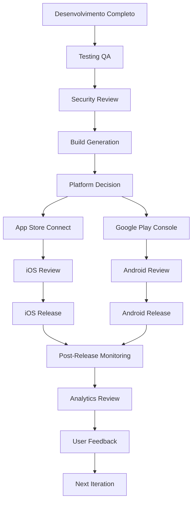
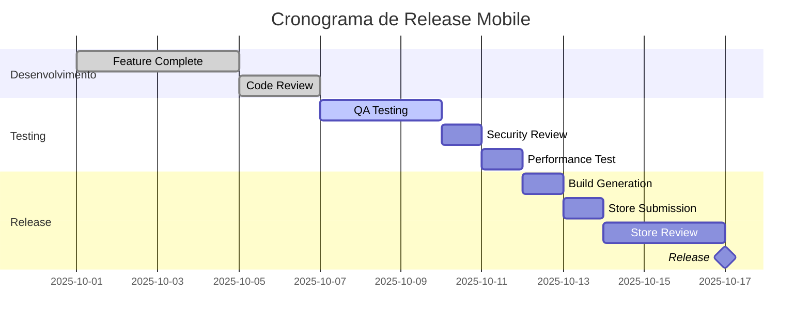
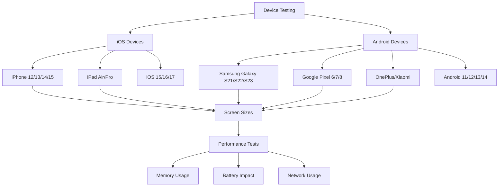
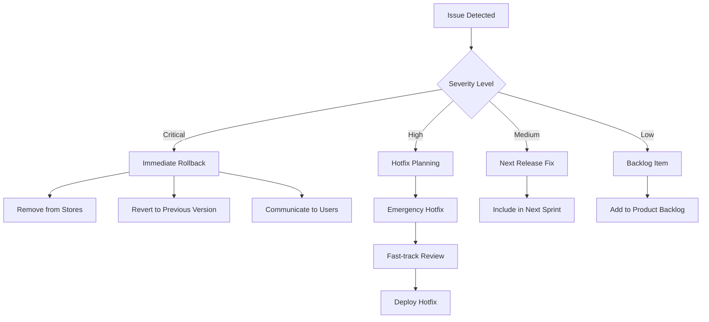

# Template de Checklist de Mobile Release

<div align="center">

## Checklist Completo para Release de Aplicações Mobile - Framework Enterprise

[](https://datametria.io)
[](https://developer.apple.com)
[](https://play.google.com/console)
[](https://flutter.dev)
[](https://reactnative.dev)
[](https://github.com/datametria/standards)
[](https://aws.amazon.com/q/)

[🔗 Template Original](link) • [🔗 Diretrizes](link) • [🔗 Exemplos](link)

[📱 App Store](#-app-store-ios) • [🤖 Play Store](#-play-store-android) • [🧪 Testing](#-testing-mobile) •
[📊 Analytics](#-analytics-e-monitoramento) • [🔒 Security](#-security-checklist) • [🚀 Deploy](#-deploy-automation)

</div>

---

## 📋 Índice

- [🎯 Visão Geral](#-visão-geral)
- [📋 Informações do Release](#-informações-do-release)
- [📱 App Store (iOS)](#-app-store-ios)
- [🤖 Play Store (Android)](#-play-store-android)
- [🧪 Testing Mobile](#-testing-mobile)
- [📊 Analytics e Monitoramento](#-analytics-e-monitoramento)
- [🔒 Security Checklist](#-security-checklist)
- [🚀 Deploy Automation](#-deploy-automation)
- [📈 Post-Release](#-post-release)
- [🔗 Referências](#-referências)

---

## 🎯 Visão Geral

### Framework de Release Mobile DATAMETRIA

Este template fornece um checklist completo para release de aplicações mobile, cobrindo iOS e Android, com foco em qualidade, segurança e automação.

#### Fluxo de Release



#### Benefícios do Framework

- ✅ **Qualidade Garantida**: Checklist completo de testes
- ✅ **Compliance**: Atende requisitos das lojas
- ✅ **Automação**: Scripts e ferramentas integradas
- ✅ **Monitoramento**: Analytics e crash reporting
- ✅ **Segurança**: Verificações de segurança integradas
- ✅ **Performance**: Otimizações e métricas

---

## 📋 Informações do Release

| Campo | Descrição | Exemplo |
|-------|-----------|----------|
| **Nome do App** | [Nome da aplicação] | DATAMETRIA Mobile |
| **Versão** | [X.Y.Z (Build NNNN)] | 2.1.0 (Build 2100) |
| **Plataformas** | [iOS / Android / Ambas] | iOS + Android |
| **Tipo de Release** | [Major / Minor / Patch / Hotfix] | Minor Release |
| **Data de Release** | [DD/MM/AAAA] | 15/10/2025 |
| **Responsável** | [Nome do mobile lead] | João Silva |
| **QA Lead** | [Nome do QA] | Maria Santos |
| **Security Review** | [Nome do security engineer] | Carlos Oliveira |

### Cronograma de Release



---

## 📱 App Store (iOS)

### App Store Connect Setup

- [ ] **App Store Connect**: Acesso configurado e permissões corretas
- [ ] **Bundle ID**: Bundle ID único registrado (`com.datametria.app`)
- [ ] **App ID**: App ID configurado com capabilities necessárias
- [ ] **Provisioning Profiles**: Profiles de distribuição atualizados
- [ ] **Certificates**: Certificados de distribuição válidos (válidos por 1 ano)
- [ ] **Team membership**: Membership ativo no Apple Developer Program ($99/ano)

### App Information

- [ ] **App name**: Nome do app único e aprovado (30 caracteres max)
- [ ] **Subtitle**: Subtítulo descritivo (30 caracteres max)
- [ ] **Keywords**: Palavras-chave otimizadas para ASO (100 caracteres)
- [ ] **Description**: Descrição completa e atrativa (4000 caracteres)
- [ ] **What's New**: Notas da versão atualizadas (4000 caracteres)
- [ ] **Support URL**: URL de suporte funcionando
- [ ] **Marketing URL**: URL de marketing (opcional)
- [ ] **Privacy Policy URL**: URL da política de privacidade (obrigatório)

### App Store Assets

- [ ] **App Icon**: Ícone 1024x1024px sem transparência, formato PNG
- [ ] **Screenshots**: Screenshots para todos os tamanhos de tela obrigatórios
  - [ ] iPhone 6.7" (1290x2796px) - 3 a 10 screenshots
  - [ ] iPhone 6.5" (1242x2688px) - 3 a 10 screenshots
  - [ ] iPhone 5.5" (1242x2208px) - 3 a 10 screenshots
  - [ ] iPad Pro 12.9" (2048x2732px) - 3 a 10 screenshots
  - [ ] iPad Pro 11" (1668x2388px) - 3 a 10 screenshots
- [ ] **App Preview**: Vídeos de preview (opcional, max 30s, formato MP4)

### Build Information

- [ ] **Build uploaded**: Build enviado via Xcode ou Transporter
- [ ] **Build processed**: Build processado sem erros no App Store Connect
- [ ] **Version number**: Número da versão incrementado (semver)
- [ ] **Build number**: Build number único e incrementado
- [ ] **Export compliance**: Declaração de conformidade de exportação
- [ ] **Content rights**: Direitos de conteúdo declarados
- [ ] **Bitcode**: Bitcode habilitado (se aplicável)

#### Scripts de Build iOS

```bash
#!/bin/bash
# build-ios.sh - Script de build para iOS

set -e

echo "🍎 Iniciando build iOS..."

# Limpar build anterior
xcodebuild clean -workspace MyApp.xcworkspace -scheme MyApp

# Atualizar pods
cd ios && pod install && cd ..

# Build para App Store
xcodebuild -workspace MyApp.xcworkspace \
           -scheme MyApp \
           -configuration Release \
           -archivePath MyApp.xcarchive \
           archive

# Export para App Store
xcodebuild -exportArchive \
           -archivePath MyApp.xcarchive \
           -exportPath ./build \
           -exportOptionsPlist ExportOptions.plist

echo "✅ Build iOS concluído!"

# Upload via Transporter (opcional)
if [ "$AUTO_UPLOAD" = "true" ]; then
    xcrun altool --upload-app \
                 --type ios \
                 --file ./build/MyApp.ipa \
                 --username "$APPLE_ID" \
                 --password "@keychain:AC_PASSWORD"
    echo "📤 Upload para App Store Connect concluído!"
fi
```

### App Review Information

- [ ] **Demo account**: Conta de demonstração criada (se necessário)
- [ ] **Review notes**: Notas para revisão detalhadas em inglês
- [ ] **Contact information**: Informações de contato atualizadas
- [ ] **Age rating**: Classificação etária apropriada
- [ ] **Content warnings**: Avisos de conteúdo se aplicável
- [ ] **In-App Purchases**: Produtos configurados (se aplicável)
- [ ] **Subscriptions**: Assinaturas configuradas (se aplicável)

---

## 🤖 Play Store (Android)

### Google Play Console Setup

- [ ] **Play Console**: Acesso configurado e permissões corretas
- [ ] **Developer account**: Conta de desenvolvedor ativa ($25 taxa única)
- [ ] **App signing**: App signing by Google Play configurado
- [ ] **Upload key**: Chave de upload configurada e segura
- [ ] **Release signing**: Certificado de release configurado
- [ ] **API access**: Google Play Developer API configurado (se necessário)

### App Information

- [ ] **App name**: Nome do app único (50 caracteres max)
- [ ] **Short description**: Descrição curta (80 caracteres)
- [ ] **Full description**: Descrição completa (4000 caracteres)
- [ ] **What's new**: Notas da versão (500 caracteres por idioma)
- [ ] **Developer name**: Nome do desenvolvedor
- [ ] **Developer email**: Email de contato público
- [ ] **Website**: Website do desenvolvedor
- [ ] **Privacy Policy**: URL da política de privacidade (obrigatório)

### Store Listing Assets

- [ ] **App icon**: Ícone 512x512px em PNG, 32-bit com alpha
- [ ] **Feature graphic**: Gráfico de destaque 1024x500px (JPG ou PNG 24-bit)
- [ ] **Screenshots**: Screenshots para diferentes dispositivos
  - [ ] Phone: 2-8 screenshots (16:9 ou 9:16, min 320px)
  - [ ] 7-inch tablet: 1-8 screenshots (opcional)
  - [ ] 10-inch tablet: 1-8 screenshots (opcional)
- [ ] **Promo video**: Vídeo promocional no YouTube (opcional)
- [ ] **TV banner**: Banner para Android TV (1280x720px, se aplicável)

### App Bundle/APK

- [ ] **App Bundle**: AAB gerado e assinado (formato preferido)
- [ ] **Version code**: Version code incrementado (inteiro)
- [ ] **Version name**: Version name atualizado (string)
- [ ] **Target SDK**: Target SDK atualizado para versão recente (API 33+)
- [ ] **Min SDK**: Min SDK apropriado para público-alvo
- [ ] **Permissions**: Permissões justificadas e documentadas
- [ ] **App size**: Tamanho otimizado (< 150MB recomendado)

#### Scripts de Build Android

```bash
#!/bin/bash
# build-android.sh - Script de build para Android

set -e

echo "🤖 Iniciando build Android..."

# Limpar build anterior
./gradlew clean

# Executar testes
./gradlew test

# Build App Bundle (recomendado)
./gradlew bundleRelease

# Build APK (alternativo)
./gradlew assembleRelease

# Verificar assinatura
echo "🔐 Verificando assinatura..."
jarsigner -verify -verbose -certs app/build/outputs/bundle/release/app-release.aab

echo "✅ Build Android concluído!"

# Análise de tamanho
echo "📊 Análise de tamanho do app:"
bundletool build-apks --bundle=app/build/outputs/bundle/release/app-release.aab \
                      --output=app-release.apks \
                      --mode=universal

bundletool get-size total --apks=app-release.apks
```

### Content Rating

- [ ] **Content rating**: Questionário de classificação preenchido
- [ ] **Target audience**: Público-alvo definido (crianças, adolescentes, adultos)
- [ ] **Ads**: Declaração sobre anúncios (contém/não contém)
- [ ] **In-app purchases**: Declaração sobre compras no app
- [ ] **User-generated content**: Conteúdo gerado por usuário declarado
- [ ] **Data safety**: Seção de segurança de dados preenchida

### Release Management

- [ ] **Release track**: Track de release selecionado
  - [ ] Internal testing (até 100 testadores)
  - [ ] Closed testing (Alpha/Beta)
  - [ ] Open testing (Beta público)
  - [ ] Production (release público)
- [ ] **Staged rollout**: Rollout gradual configurado (1%, 5%, 10%, 20%, 50%, 100%)
- [ ] **Release notes**: Notas de release em todos os idiomas suportados
- [ ] **Countries**: Países de distribuição selecionados
- [ ] **Device compatibility**: Compatibilidade de dispositivos verificada

---

## 🧪 Testing Mobile

### Functional Testing

- [ ] **Core functionality**: Todas as funcionalidades principais testadas
- [ ] **User flows**: Fluxos de usuário críticos testados end-to-end
- [ ] **Navigation**: Navegação entre telas funcionando corretamente
- [ ] **Forms**: Formulários validados e funcionando
- [ ] **API integration**: Integração com APIs testada (success/error cases)
- [ ] **Offline functionality**: Funcionalidade offline testada
- [ ] **Push notifications**: Notificações push testadas
- [ ] **Deep links**: Deep links e universal links testados

### Device Testing Matrix



### Platform-Specific Testing

#### iOS Testing Checklist

- [ ] **iPhone models**: Testado em iPhone 12, 13, 14, 15 (mini, regular, Pro, Pro Max)
- [ ] **iPad compatibility**: Compatibilidade com iPad testada (se suportado)
- [ ] **iOS versions**: Testado nas últimas 3 versões do iOS (15, 16, 17)
- [ ] **Dark mode**: Suporte ao modo escuro testado
- [ ] **Dynamic Type**: Suporte a tamanhos de fonte dinâmicos
- [ ] **VoiceOver**: Acessibilidade com VoiceOver testada
- [ ] **Handoff**: Continuidade entre dispositivos (se aplicável)
- [ ] **Siri Shortcuts**: Integração com Siri testada (se aplicável)
- [ ] **Widgets**: Widgets testados (se implementados)

#### Android Testing Checklist

- [ ] **Android versions**: Testado em Android 11, 12, 13, 14
- [ ] **Manufacturers**: Testado em Samsung, Google Pixel, OnePlus, Xiaomi
- [ ] **Screen densities**: Testado em mdpi, hdpi, xhdpi, xxhdpi, xxxhdpi
- [ ] **Android features**: Features específicas do Android testadas
- [ ] **TalkBack**: Acessibilidade com TalkBack testada
- [ ] **Adaptive icons**: Ícones adaptativos testados
- [ ] **Android Auto**: Integração com Android Auto (se aplicável)
- [ ] **Widgets**: Widgets Android testados (se implementados)
- [ ] **Shortcuts**: App shortcuts testados

### Automated Testing

- [ ] **Unit tests**: Testes unitários passando (> 80% cobertura)
- [ ] **Integration tests**: Testes de integração implementados
- [ ] **UI tests**: Testes de UI automatizados (Espresso/XCUITest)
- [ ] **Performance tests**: Testes de performance automatizados
- [ ] **Security tests**: Testes de segurança automatizados
- [ ] **Accessibility tests**: Testes de acessibilidade automatizados

#### Exemplo de Testes Automatizados

```dart
// Flutter - Teste de integração
import 'package:flutter_test/flutter_test.dart';
import 'package:integration_test/integration_test.dart';
import 'package:myapp/main.dart' as app;

void main() {
  IntegrationTestWidgetsFlutterBinding.ensureInitialized();

  group('App Integration Tests', () {
    testWidgets('Login flow test', (WidgetTester tester) async {
      app.main();
      await tester.pumpAndSettle();

      // Encontrar e tocar no botão de login
      await tester.tap(find.byKey(Key('login_button')));
      await tester.pumpAndSettle();

      // Inserir credenciais
      await tester.enterText(
        find.byKey(Key('email_field')),
        'test@datametria.io'
      );
      await tester.enterText(
        find.byKey(Key('password_field')),
        'password123'
      );

      // Submeter login
      await tester.tap(find.byKey(Key('submit_button')));
      await tester.pumpAndSettle();

      // Verificar navegação para dashboard
      expect(find.byKey(Key('dashboard_screen')), findsOneWidget);
    });

    testWidgets('Performance test - app startup', (WidgetTester tester) async {
      final stopwatch = Stopwatch()..start();

      app.main();
      await tester.pumpAndSettle();

      stopwatch.stop();

      // App deve iniciar em menos de 3 segundos
      expect(stopwatch.elapsedMilliseconds, lessThan(3000));
    });
  });
}
```

```javascript
// React Native - Teste com Detox
describe('Login Flow', () => {
  beforeAll(async () => {
    await device.launchApp();
  });

  beforeEach(async () => {
    await device.reloadReactNative();
  });

  it('should login successfully', async () => {
    // Navegar para tela de login
    await element(by.id('login_button')).tap();

    // Inserir credenciais
    await element(by.id('email_input')).typeText('test@datametria.io');
    await element(by.id('password_input')).typeText('password123');

    // Submeter
    await element(by.id('submit_button')).tap();

    // Verificar sucesso
    await expect(element(by.id('dashboard_screen'))).toBeVisible();
  });

  it('should handle network errors gracefully', async () => {
    // Simular erro de rede
    await device.setURLBlacklist(['.*api.*']);

    await element(by.id('login_button')).tap();
    await element(by.id('email_input')).typeText('test@datametria.io');
    await element(by.id('password_input')).typeText('password123');
    await element(by.id('submit_button')).tap();

    // Verificar mensagem de erro
    await expect(element(by.text('Network error'))).toBeVisible();
  });
});
```

---

## 📊 Analytics e Monitoramento

### Analytics Setup

- [ ] **Firebase Analytics**: Configurado para iOS e Android
- [ ] **Custom events**: Eventos customizados implementados
- [ ] **User properties**: Propriedades de usuário configuradas
- [ ] **Conversion tracking**: Tracking de conversões configurado
- [ ] **Audience segmentation**: Segmentação de audiência configurada

### Crash Reporting

- [ ] **Firebase Crashlytics**: Configurado e testado
- [ ] **Custom crash logs**: Logs customizados implementados
- [ ] **Non-fatal errors**: Erros não-fatais sendo reportados
- [ ] **User identification**: Identificação de usuários configurada
- [ ] **Crash-free users**: Meta de 99.9% crash-free users

### Performance Monitoring

- [ ] **Firebase Performance**: Monitoramento de performance configurado
- [ ] **App startup time**: Tempo de inicialização monitorado
- [ ] **Screen rendering**: Rendering de telas monitorado
- [ ] **Network requests**: Requests de rede monitorados
- [ ] **Custom traces**: Traces customizados implementados

#### Configuração de Analytics

```dart
// Flutter - Firebase Analytics
import 'package:firebase_analytics/firebase_analytics.dart';

class AnalyticsService {
  static final FirebaseAnalytics _analytics = FirebaseAnalytics.instance;

  static Future<void> logLogin(String method) async {
    await _analytics.logLogin(loginMethod: method);
  }

  static Future<void> logPurchase({
    required String itemId,
    required double value,
    required String currency,
  }) async {
    await _analytics.logPurchase(
      currency: currency,
      value: value,
      parameters: {
        'item_id': itemId,
      },
    );
  }

  static Future<void> logCustomEvent(
    String eventName,
    Map<String, dynamic> parameters,
  ) async {
    await _analytics.logEvent(
      name: eventName,
      parameters: parameters,
    );
  }
}
```

---

## 🔒 Security Checklist

### Code Security

- [ ] **Code obfuscation**: Código ofuscado para release
- [ ] **API keys**: Chaves de API não expostas no código
- [ ] **Certificate pinning**: Certificate pinning implementado
- [ ] **Root/Jailbreak detection**: Detecção de root/jailbreak implementada
- [ ] **Debug flags**: Flags de debug removidas
- [ ] **Logging**: Logs sensíveis removidos da versão de produção

### Data Security

- [ ] **Data encryption**: Dados sensíveis criptografados
- [ ] **Keychain/Keystore**: Uso correto do Keychain (iOS) / Keystore (Android)
- [ ] **Biometric authentication**: Autenticação biométrica implementada
- [ ] **Session management**: Gerenciamento seguro de sessões
- [ ] **Data validation**: Validação de dados de entrada
- [ ] **HTTPS only**: Todas as comunicações via HTTPS

### Privacy Compliance

- [ ] **Privacy policy**: Política de privacidade atualizada
- [ ] **GDPR compliance**: Conformidade com GDPR (se aplicável)
- [ ] **LGPD compliance**: Conformidade com LGPD (Brasil)
- [ ] **Data collection disclosure**: Coleta de dados divulgada
- [ ] **User consent**: Consentimento do usuário implementado
- [ ] **Data deletion**: Funcionalidade de exclusão de dados

#### Exemplo de Implementação de Segurança

```dart
// Flutter - Implementação de segurança
import 'package:flutter_secure_storage/flutter_secure_storage.dart';
import 'package:local_auth/local_auth.dart';

class SecurityService {
  static const _storage = FlutterSecureStorage(
    aOptions: AndroidOptions(
      encryptedSharedPreferences: true,
    ),
    iOptions: IOSOptions(
      accessibility: IOSAccessibility.first_unlock_this_device,
    ),
  );

  static final LocalAuthentication _localAuth = LocalAuthentication();

  // Armazenar token de forma segura
  static Future<void> storeToken(String token) async {
    await _storage.write(key: 'auth_token', value: token);
  }

  // Recuperar token com autenticação biométrica
  static Future<String?> getToken() async {
    final isAvailable = await _localAuth.canCheckBiometrics;
    if (isAvailable) {
      final isAuthenticated = await _localAuth.authenticate(
        localizedReason: 'Authenticate to access your account',
        options: AuthenticationOptions(
          biometricOnly: true,
          stickyAuth: true,
        ),
      );

      if (isAuthenticated) {
        return await _storage.read(key: 'auth_token');
      }
    }
    return null;
  }

  // Verificar se dispositivo está comprometido
  static Future<bool> isDeviceSecure() async {
    // Implementar verificação de root/jailbreak
    // Usar packages como root_check, jailbreak_root_detection
    return true; // Placeholder
  }
}
```

---

## 🚀 Deploy Automation

### CI/CD Pipeline

- [ ] **GitHub Actions**: Pipeline configurado
- [ ] **Automated builds**: Builds automatizados por branch
- [ ] **Automated testing**: Testes executados automaticamente
- [ ] **Code signing**: Assinatura de código automatizada
- [ ] **Store deployment**: Deploy automatizado para lojas
- [ ] **Rollback capability**: Capacidade de rollback implementada

### Environment Management

- [ ] **Development**: Ambiente de desenvolvimento configurado
- [ ] **Staging**: Ambiente de staging configurado
- [ ] **Production**: Ambiente de produção configurado
- [ ] **Feature flags**: Feature flags implementadas
- [ ] **A/B testing**: Testes A/B configurados (se aplicável)

#### GitHub Actions Workflow

```yaml
# .github/workflows/mobile-release.yml
name: Mobile Release

on:
  push:
    tags:
      - 'v*'

jobs:
  test:
    runs-on: ubuntu-latest
    steps:
      - uses: actions/checkout@v4

      - name: Setup Flutter
        uses: subosito/flutter-action@v2
        with:
          flutter-version: '3.16.0'

      - name: Install dependencies
        run: flutter pub get

      - name: Run tests
        run: flutter test --coverage

      - name: Upload coverage
        uses: codecov/codecov-action@v3

  build-ios:
    needs: test
    runs-on: macos-latest
    steps:
      - uses: actions/checkout@v4

      - name: Setup Flutter
        uses: subosito/flutter-action@v2
        with:
          flutter-version: '3.16.0'

      - name: Install dependencies
        run: flutter pub get

      - name: Build iOS
        run: |
          flutter build ios --release --no-codesign

      - name: Build IPA
        run: |
          xcodebuild -workspace ios/Runner.xcworkspace \
                     -scheme Runner \
                     -configuration Release \
                     -archivePath Runner.xcarchive \
                     archive

          xcodebuild -exportArchive \
                     -archivePath Runner.xcarchive \
                     -exportPath build \
                     -exportOptionsPlist ios/ExportOptions.plist

  build-android:
    needs: test
    runs-on: ubuntu-latest
    steps:
      - uses: actions/checkout@v4

      - name: Setup Java
        uses: actions/setup-java@v3
        with:
          java-version: '17'
          distribution: 'temurin'

      - name: Setup Flutter
        uses: subosito/flutter-action@v2
        with:
          flutter-version: '3.16.0'

      - name: Install dependencies
        run: flutter pub get

      - name: Build Android App Bundle
        run: flutter build appbundle --release

      - name: Sign App Bundle
        uses: r0adkll/sign-android-release@v1
        with:
          releaseDirectory: build/app/outputs/bundle/release
          signingKeyBase64: ${{ secrets.SIGNING_KEY }}
          alias: ${{ secrets.ALIAS }}
          keyStorePassword: ${{ secrets.KEY_STORE_PASSWORD }}
          keyPassword: ${{ secrets.KEY_PASSWORD }}

  deploy:
    needs: [build-ios, build-android]
    runs-on: ubuntu-latest
    steps:
      - name: Deploy to App Store
        # Implementar deploy para App Store
        run: echo "Deploying to App Store..."

      - name: Deploy to Play Store
        # Implementar deploy para Play Store
        run: echo "Deploying to Play Store..."
```

---

## 📈 Post-Release

### Monitoring Dashboard

- [ ] **Release metrics**: Métricas de release configuradas
- [ ] **User adoption**: Adoção de usuários monitorada
- [ ] **Performance metrics**: Métricas de performance acompanhadas
- [ ] **Error rates**: Taxa de erros monitorada
- [ ] **User feedback**: Feedback de usuários coletado

### Success Metrics

| Métrica | Target | Atual | Status |
|---------|--------|-------|--------|
| **Crash-free users** | > 99.9% | [%] | 🟢/🟡/🔴 |
| **App startup time** | < 3s | [s] | 🟢/🟡/🔴 |
| **Store rating** | > 4.5 | [rating] | 🟢/🟡/🔴 |
| **Download rate** | [target] | [atual] | 🟢/🟡/🔴 |
| **User retention (D1)** | > 70% | [%] | 🟢/🟡/🔴 |
| **User retention (D7)** | > 30% | [%] | 🟢/🟡/🔴 |

### Post-Release Actions

- [ ] **Monitor crash reports**: Monitorar relatórios de crash nas primeiras 24h
- [ ] **Check store reviews**: Verificar reviews nas lojas
- [ ] **Performance monitoring**: Monitorar performance em produção
- [ ] **User feedback**: Coletar e analisar feedback dos usuários
- [ ] **Hotfix planning**: Planejar hotfixes se necessário
- [ ] **Next iteration**: Planejar próxima iteração baseada em dados

### Rollback Plan



---

## 🔗 Referências

### Documentação Oficial

- **[App Store Review Guidelines](https://developer.apple.com/app-store/review/guidelines/)**: Diretrizes de revisão da App Store
- **[Google Play Policy](https://play.google.com/about/developer-content-policy/)**: Políticas do Google Play
- **[Flutter Deployment](https://docs.flutter.dev/deployment)**: Guia de deployment Flutter
- **[React Native Deployment](https://reactnative.dev/docs/signed-apk-android)**: Guia de deployment React Native

### Ferramentas e Serviços

| Ferramenta | Propósito | Link | Categoria |
|------------|-----------|------|----------|
| **Fastlane** | Automação de deploy | [fastlane.tools](https://fastlane.tools) | Deploy |
| **Firebase** | Analytics e Crashlytics | [firebase.google.com](https://firebase.google.com) | Monitoring |
| **App Center** | CI/CD e distribuição | [appcenter.ms](https://appcenter.ms) | CI/CD |
| **Bitrise** | CI/CD mobile | [bitrise.io](https://bitrise.io) | CI/CD |
| **TestFlight** | Beta testing iOS | [developer.apple.com](https://developer.apple.com/testflight/) | Testing |
| **Play Console** | Gestão Android | [play.google.com/console](https://play.google.com/console) | Store |

### Checklist de Qualidade

#### Pré-Release Final

- [ ] **Todos os testes passando**: Unit, integration e UI tests
- [ ] **Performance verificada**: Startup time, memory usage, battery
- [ ] **Segurança validada**: Code review de segurança completo
- [ ] **Acessibilidade testada**: VoiceOver/TalkBack funcionando
- [ ] **Stores preparadas**: Assets, descrições e builds enviados
- [ ] **Monitoring configurado**: Analytics, crashlytics e performance
- [ ] **Rollback plan**: Plano de rollback documentado e testado

#### Pós-Release

- [ ] **Monitoring ativo**: Dashboards sendo monitorados
- [ ] **User feedback**: Reviews e feedback sendo coletados
- [ ] **Performance metrics**: Métricas dentro dos targets
- [ ] **Crash reports**: Nenhum crash crítico reportado
- [ ] **Store optimization**: ASO e conversão otimizados
- [ ] **Next iteration**: Próximos passos planejados

---

<div align="center">

**Desenvolvido por**: Equipe DATAMETRIA
**Última Atualização**: 15/10/2025
**Versão**: 2.0.0

---

## Checklist completo para release mobile enterprise! 📱🚀

</div>
