# Template de Planejamento MVP

<div align="center">

## Minimum Viable Product Planning Template - Framework Enterprise

[](https://lean-startup.com)
[](https://agilemanifesto.org)
[](https://theleanstartup.com)
[](https://productmanagement.com)
[](https://github.com/datametria/standards)
[](https://aws.amazon.com/q/)

[🔗 Template Original](link) • [🔗 Diretrizes](link) • [🔗 Exemplos](link)

[🎯 Visão](#-visão-do-produto) • [👥 Personas](#-personas-e-usuários) • [🔧 Features](#-features-do-mvp) •
[📊 Métricas](#-métricas-de-sucesso) • [🗓️ Roadmap](#-roadmap-de-desenvolvimento) • [💰 Orçamento](#-recursos-e-orçamento)

</div>

---

## 📋 Índice

- [🎯 Visão Geral](#-visão-geral)
- [📝 Informações do Projeto](#-informações-do-projeto)
- [🎯 Visão do Produto](#-visão-do-produto)
- [📊 Análise de Mercado](#-análise-de-mercado)
- [👥 Personas e Usuários](#-personas-e-usuários)
- [🔧 Features do MVP](#-features-do-mvp)
- [🏗️ Arquitetura Técnica](#️-arquitetura-técnica)
- [📊 Métricas de Sucesso](#-métricas-de-sucesso)
- [🗓️ Roadmap de Desenvolvimento](#️-roadmap-de-desenvolvimento)
- [💰 Recursos e Orçamento](#-recursos-e-orçamento)
- [⚠️ Riscos e Mitigações](#️-riscos-e-mitigações)
- [✅ Critérios de Aceitação](#-critérios-de-aceitação)
- [🔗 Referências](#-referências)

---

## 🎯 Visão Geral

### Framework de MVP Planning DATAMETRIA

Este template fornece uma estrutura completa para planejamento de Minimum Viable Product (MVP), seguindo metodologias Lean Startup e práticas ágeis de desenvolvimento de produto.

#### Metodologia MVP

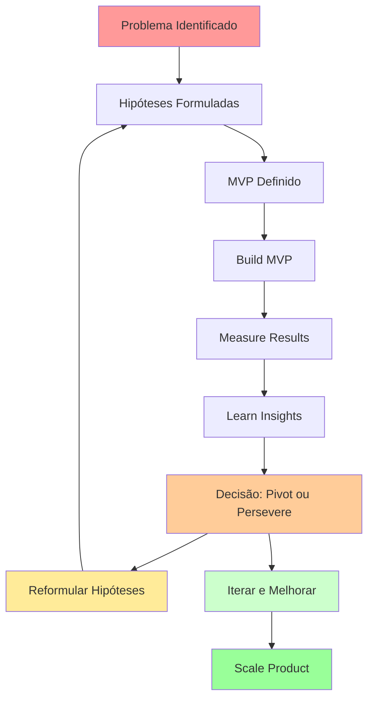

#### Benefícios do Framework

- ✅ **Validação Rápida**: Teste hipóteses com menor investimento
- ✅ **Redução de Riscos**: Identifique problemas antes do desenvolvimento completo
- ✅ **Foco no Usuário**: Priorize features baseadas em necessidades reais
- ✅ **Time-to-Market**: Lance mais rápido e aprenda com o mercado
- ✅ **ROI Otimizado**: Maximize retorno com recursos mínimos
- ✅ **Aprendizado Contínuo**: Ciclos de feedback para melhoria constante

---

## 📝 Informações do Projeto

### Dados Básicos

| Campo | Valor | Exemplo |
|-------|-------|---------|
| **Nome do Produto** | [Nome do MVP] | DATAMETRIA Analytics MVP |
| **Versão** | MVP 1.0 | MVP 1.0.0 |
| **Data de Início** | [DD/MM/AAAA] | 15/10/2025 |
| **Data Prevista de Lançamento** | [DD/MM/AAAA] | 15/12/2025 |
| **Product Owner** | [Nome] | Maria Silva |
| **Tech Lead** | [Nome] | João Santos |
| **Equipe** | [X] desenvolvedores, [Y] designers | 3 devs, 1 designer, 1 QA |
| **Orçamento Total** | [Valor] | R$ 150.000 |

### Contexto do Negócio

#### Problema a ser resolvido

[Descreva o problema principal que o MVP vai resolver de forma clara e específica]

**Exemplo:**
> Pequenas empresas têm dificuldade para analisar dados de vendas de forma eficiente, gastando até 10 horas semanais em planilhas manuais, resultando em decisões baseadas em informações desatualizadas.

#### Oportunidade de mercado

[Explique a oportunidade identificada e o potencial de mercado com dados quantitativos]

**Exemplo:**
> Mercado de analytics para PMEs no Brasil: R$ 2.5 bilhões, crescimento de 15% ao ano. 85% das PMEs ainda usam planilhas para análise de dados.

#### Hipóteses principais

- **Hipótese do Problema**: [Hipótese sobre o problema que você está resolvendo]
- **Hipótese da Solução**: [Hipótese sobre como sua solução resolve o problema]
- **Hipótese do Mercado**: [Hipótese sobre a demanda e disposição para pagar]
- **Hipótese de Crescimento**: [Hipótese sobre como o produto vai crescer]

**Exemplo:**

- **Problema**: PMEs gastam >8h/semana em análise manual de dados
- **Solução**: Dashboard automatizado reduz tempo em 80%
- **Mercado**: 70% das PMEs pagariam R$ 99/mês por solução simples
- **Crescimento**: Indicação boca-a-boca será principal canal de aquisição

---

## 🎯 Visão do Produto

### Declaração de Visão

> [Escreva uma declaração clara e concisa da visão do produto em 1-2 frases]

**Exemplo:**
> Democratizar análise de dados para pequenas empresas através de uma plataforma intuitiva que transforma dados complexos em insights acionáveis, permitindo decisões mais rápidas e precisas.

### Proposta de Valor

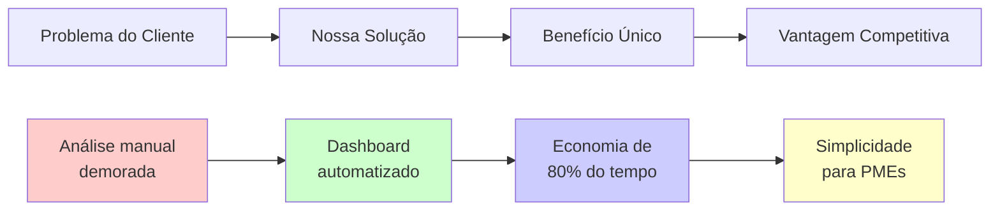

#### Canvas de Proposta de Valor

**Para** [público-alvo específico]
**Que** [necessidade/problema específico]
**O** [nome do produto]
**É um** [categoria do produto]
**Que** [benefício principal mensurável]
**Diferente de** [alternativa principal]
**Nosso produto** [diferencial único e defensável]

**Exemplo:**
> **Para** pequenas empresas com 10-50 funcionários
> **Que** precisam analisar dados de vendas rapidamente
> **O** DATAMETRIA Analytics
> **É uma** plataforma de business intelligence
> **Que** reduz tempo de análise de 8h para 1h por semana
> **Diferente de** soluções complexas como Tableau
> **Nosso produto** é plug-and-play, sem necessidade de treinamento

### Objetivos do MVP

| Objetivo | Descrição | Métrica de Sucesso | Prazo |
|----------|-----------|-------------------|-------|
| **Validar Problema** | Confirmar que o problema existe e é relevante | 80% dos entrevistados confirmam o problema | 4 semanas |
| **Testar Solução** | Verificar se nossa solução resolve o problema | 70% dos usuários completam tarefa principal | 8 semanas |
| **Aprender sobre Usuários** | Entender comportamento e necessidades | 50+ horas de uso coletivo por semana | 12 semanas |
| **Gerar Tração** | Criar base inicial de usuários engajados | 100 usuários ativos mensais | 16 semanas |

---

## 📊 Análise de Mercado

### Tamanho do Mercado

| Métrica | Valor | Fonte | Metodologia |
|---------|-------|-------|-------------|
| **TAM** (Total Addressable Market) | [Valor] | [Fonte] | [Como calculou] |
| **SAM** (Serviceable Addressable Market) | [Valor] | [Fonte] | [Como calculou] |
| **SOM** (Serviceable Obtainable Market) | [Valor] | [Fonte] | [Como calculou] |

**Exemplo:**
| Métrica | Valor | Fonte | Metodologia |
|---------|-------|-------|-------------|
| **TAM** | R$ 2.5 bi | IDC Brasil 2025 | Mercado BI/Analytics Brasil |
| **SAM** | R$ 500 mi | Segmentação própria | PMEs 10-50 funcionários |
| **SOM** | R$ 25 mi | Análise competitiva | 5% market share em 3 anos |

### Análise Competitiva

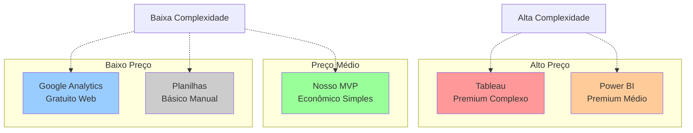

| Concorrente | Pontos Fortes | Pontos Fracos | Nossa Vantagem |
|-------------|---------------|---------------|----------------|
| **Tableau** | Recursos avançados, visualizações | Complexo, caro, curva de aprendizado | Simplicidade, preço acessível |
| **Power BI** | Integração Microsoft, preço médio | Complexidade para PMEs | Foco específico em PMEs |
| **Google Analytics** | Gratuito, web analytics | Limitado a web, não customizável | Analytics completo de negócio |
| **Planilhas Excel** | Familiar, flexível | Manual, propenso a erros | Automação e confiabilidade |

### Tendências de Mercado

- **Democratização de BI**: Crescimento de 25% ao ano em soluções self-service
- **Cloud-First**: 80% das novas implementações são cloud-native
- **Mobile Analytics**: 60% dos usuários acessam dashboards via mobile
- **AI/ML Integration**: Demanda crescente por insights preditivos

---

## 👥 Personas e Usuários

### Persona Primária: Gestor de PME

**Nome:** Carlos Empresário
**Idade:** 35-45 anos
**Cargo:** Sócio-diretor / Gerente Geral
**Localização:** São Paulo, Brasil
**Empresa:** 15-30 funcionários

#### Características

- **Demografia:** Ensino superior, renda familiar R$ 15-25k
- **Comportamento:** Usa smartphone para trabalho, prefere soluções simples
- **Motivações:** Crescer o negócio, tomar decisões baseadas em dados
- **Frustrações:** Falta de tempo, dificuldade com tecnologia complexa
- **Ferramentas atuais:** Excel, WhatsApp Business, sistema de vendas básico

#### Jornada do Usuário

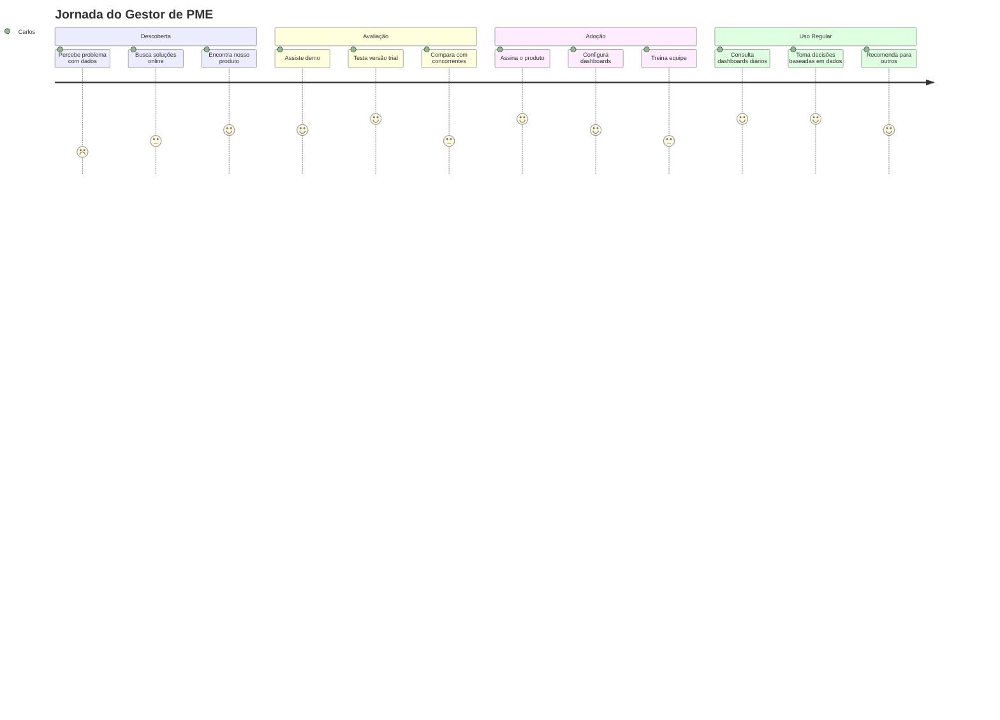

#### Jobs-to-be-Done

1. **Functional Job**: Analisar performance de vendas semanalmente
2. **Emotional Job**: Sentir-se confiante nas decisões de negócio
3. **Social Job**: Demonstrar profissionalismo para investidores/parceiros

### Personas Secundárias

<details>
<summary>Persona Secundária 1: Analista Financeiro</summary>

**Nome:** Ana Analista
**Perfil:** Responsável por relatórios financeiros e análises
**Necessidades:** Automatizar relatórios, reduzir erros manuais
**Como o MVP atende:** Dashboards financeiros automatizados com KPIs principais

</details>

<details>
<summary>Persona Secundária 2: Gerente de Vendas</summary>

**Nome:** Roberto Vendas
**Perfil:** Gerencia equipe de vendas e metas
**Necessidades:** Acompanhar performance da equipe em tempo real
**Como o MVP atende:** Dashboard de vendas com ranking e metas individuais

</details>

---

## 🔧 Features do MVP

### Matriz de Priorização (Impact vs Effort)

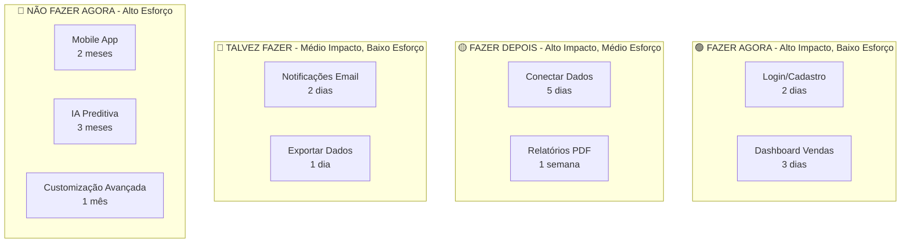

| Impacto \ Esforço | Baixo Esforço (1-3 dias) | Médio Esforço (1-2 semanas) | Alto Esforço (1+ mês) |
|-------------------|---------------------------|------------------------------|------------------------|
| **Alto Impacto** | 🟢 **Fazer Agora**<br/>• Login/Cadastro<br/>• Dashboard básico | 🟡 **Fazer Depois**<br/>• Conectores de dados<br/>• Relatórios automáticos | 🔴 **Não Fazer Agora**<br/>• IA Preditiva<br/>• Mobile App nativo |
| **Médio Impacto** | 🔵 **Talvez Fazer**<br/>• Notificações email<br/>• Exportar dados | 🟡 **Avaliar**<br/>• Múltiplos usuários<br/>• Histórico de dados | 🔴 **Não Fazer**<br/>• Customização avançada<br/>• API pública |
| **Baixo Impacto** | 🔵 **Nice-to-Have**<br/>• Temas visuais<br/>• Tooltips | 🔴 **Não Prioritário**<br/>• Integração Slack<br/>• Comentários | 🔴 **Não Fazer**<br/>• White-label<br/>• Multi-idioma |

### Features Essenciais (Must Have)

#### Feature 1: Sistema de Autenticação

- **Descrição:** Sistema seguro de login e cadastro de usuários
- **User Story:** Como gestor, eu quero criar uma conta segura para acessar meus dados de forma privada
- **Critérios de Aceitação:**
  - [ ] Cadastro com email e senha
  - [ ] Login com validação
  - [ ] Recuperação de senha
  - [ ] Sessão segura (JWT)
- **Esforço:** 2 dias
- **Prioridade:** Crítica

#### Feature 2: Dashboard de Vendas

- **Descrição:** Painel principal com KPIs de vendas mais importantes
- **User Story:** Como gestor, eu quero ver rapidamente como estão minhas vendas para tomar decisões diárias
- **Critérios de Aceitação:**
  - [ ] Receita total do mês
  - [ ] Número de vendas
  - [ ] Ticket médio
  - [ ] Gráfico de vendas por dia
  - [ ] Comparação com mês anterior
- **Esforço:** 3 dias
- **Prioridade:** Crítica

#### Feature 3: Importação de Dados

- **Descrição:** Capacidade de importar dados de vendas via CSV/Excel
- **User Story:** Como gestor, eu quero importar meus dados existentes para começar a usar o sistema
- **Critérios de Aceitação:**
  - [ ] Upload de arquivo CSV
  - [ ] Mapeamento de colunas
  - [ ] Validação de dados
  - [ ] Preview antes de importar
- **Esforço:** 5 dias
- **Prioridade:** Alta

### Features Importantes (Should Have)

#### Feature 4: Relatórios Automáticos

- **Descrição:** Geração automática de relatórios semanais/mensais
- **User Story:** Como gestor, eu quero receber relatórios automáticos para acompanhar performance sem esforço manual
- **Critérios de Aceitação:**
  - [ ] Relatório semanal por email
  - [ ] Relatório mensal detalhado
  - [ ] Configuração de frequência
- **Esforço:** 1 semana
- **Prioridade:** Média

### Features Desejáveis (Could Have)

#### Feature 5: Alertas Personalizados

- **Descrição:** Notificações quando métricas atingem determinados valores
- **User Story:** Como gestor, eu quero ser alertado quando vendas caem abaixo da meta
- **Esforço:** 3 dias
- **Prioridade:** Baixa

### Features Excluídas (Won't Have)

- **Mobile App Nativo**: Complexidade alta, web responsivo suficiente para MVP
- **IA Preditiva**: Requer dados históricos que usuários MVP não terão
- **API Pública**: Não há demanda validada para integrações
- **Multi-idioma**: Foco inicial no mercado brasileiro

---

## 🏗️ Arquitetura Técnica

### Stack Tecnológica

| Camada | Tecnologia | Justificativa | Alternativas Consideradas |
|--------|------------|---------------|---------------------------|
| **Frontend** | Vue.js 3 + TypeScript | Produtividade, ecosystem maduro | React, Angular |
| **Backend** | Node.js + Express | JavaScript full-stack, performance | Python Flask, Java Spring |
| **Banco de Dados** | PostgreSQL | Confiabilidade, SQL complexo | MongoDB, MySQL |
| **Cache** | Redis | Performance, sessões | Memcached |
| **Infraestrutura** | AWS (EC2, RDS, S3) | Escalabilidade, serviços gerenciados | GCP, Azure |
| **Monitoramento** | DataDog | Observabilidade completa | New Relic, Grafana |

### Arquitetura de Alto Nível

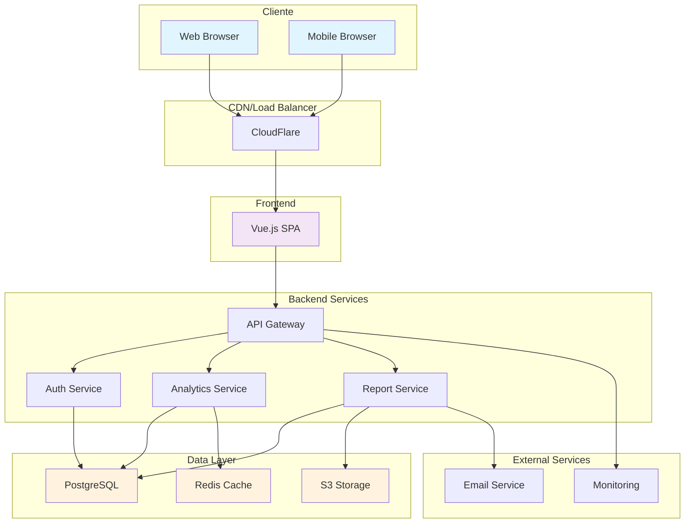

### Considerações Técnicas

#### Escalabilidade

- **Usuários simultâneos:** 100 usuários (MVP), 1000 usuários (6 meses)
- **Crescimento previsto:** 50% ao mês após validação
- **Estratégia de escala:** Horizontal scaling com load balancer, microserviços

#### Segurança

- **Autenticação:** JWT com refresh tokens
- **Autorização:** RBAC (Role-Based Access Control)
- **Proteção de dados:** Criptografia AES-256, HTTPS obrigatório
- **Compliance:** LGPD compliance desde o início

#### Performance

- **Tempo de resposta:** < 2s para dashboards, < 500ms para APIs
- **Disponibilidade:** 99.5% SLA (MVP), 99.9% (produção)
- **Monitoramento:** APM, logs centralizados, alertas automáticos

---

## 📊 Métricas de Sucesso

### Framework AARRR (Pirate Metrics)

```mermaid
funnel
    title Funil de Conversão MVP
    "Visitantes" : 1000
    "Cadastros" : 100
    "Ativação" : 70
    "Retenção" : 35
    "Receita" : 20
    "Referência" : 5
```

### Métricas de Produto (HEART Framework)

| Categoria | Métrica | Baseline | Meta MVP | Meta 3 meses | Como Medir |
|-----------|---------|----------|----------|--------------|------------|
| **Happiness** | NPS | N/A | 30+ | 50+ | Survey mensal |
| **Engagement** | DAU/MAU | N/A | 30% | 40% | Analytics |
| **Adoption** | Feature Usage | N/A | 80% | 90% | Event tracking |
| **Retention** | D7 Retention | N/A | 40% | 60% | Cohort analysis |
| **Task Success** | Dashboard Load Time | N/A | <3s | <2s | Performance monitoring |

### Métricas de Negócio

| Métrica | Baseline | Meta MVP | Meta 3 meses | Método de Cálculo |
|---------|----------|----------|--------------|-------------------|
| **MRR** (Monthly Recurring Revenue) | R$ 0 | R$ 2.000 | R$ 10.000 | Assinaturas ativas × preço |
| **CAC** (Customer Acquisition Cost) | N/A | R$ 100 | R$ 80 | Gasto marketing ÷ novos clientes |
| **LTV** (Lifetime Value) | N/A | R$ 600 | R$ 1.200 | ARPU × tempo de vida |
| **Churn Rate** | N/A | <10% | <5% | Cancelamentos ÷ base ativa |
| **Payback Period** | N/A | 6 meses | 4 meses | CAC ÷ MRR por cliente |

### Métricas de Aprendizado

- **Hipóteses validadas:** 4/6 hipóteses principais testadas
- **Feedback coletado:** 50+ respostas de usuários por mês
- **Iterações realizadas:** 2 sprints de melhoria por mês
- **Insights acionáveis:** 5+ insights que geraram mudanças no produto

### Dashboard de Métricas

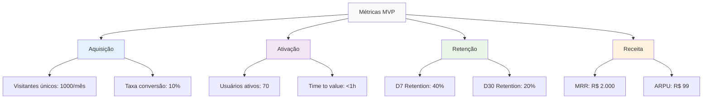

---

## 🗓️ Roadmap de Desenvolvimento

### Cronograma Geral (16 semanas)

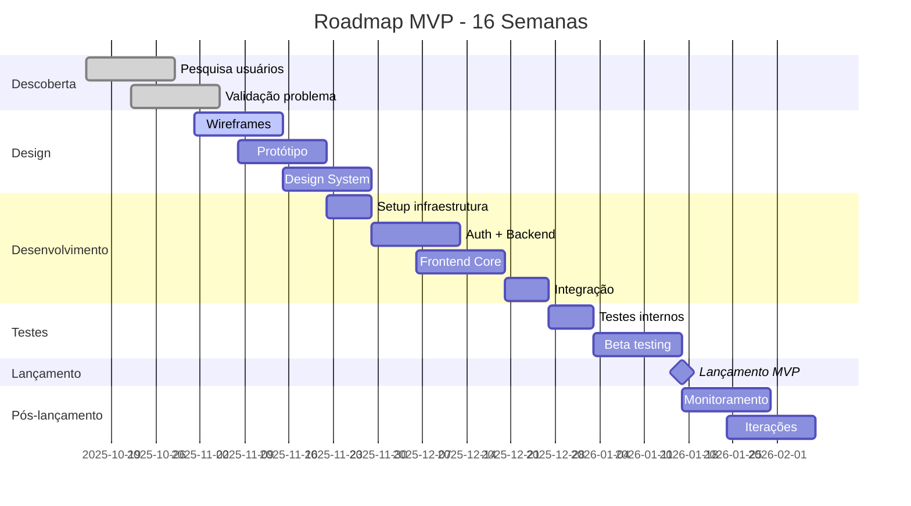

### Sprints Detalhados

#### Sprint 1-2: Descoberta e Validação (Semanas 1-4)

**Objetivos:**

- Validar problema com 50+ entrevistas
- Definir personas principais
- Confirmar proposta de valor

**Entregas:**

- [ ] Relatório de pesquisa de usuários
- [ ] Personas validadas
- [ ] Jobs-to-be-done mapeados
- [ ] Proposta de valor refinada

#### Sprint 3-4: Design e Prototipagem (Semanas 5-8)

**Objetivos:**

- Criar wireframes de todas as telas
- Desenvolver protótipo navegável
- Testar usabilidade com usuários

**Entregas:**

- [ ] Wireframes completos
- [ ] Protótipo interativo (Figma)
- [ ] Testes de usabilidade realizados
- [ ] Design system básico

#### Sprint 5-8: Desenvolvimento Core (Semanas 9-12)

**Objetivos:**

- Implementar features essenciais
- Setup de infraestrutura
- Testes automatizados

**Entregas:**

- [ ] Sistema de autenticação
- [ ] Dashboard básico funcionando
- [ ] Importação de dados
- [ ] Infraestrutura AWS configurada

#### Sprint 9-10: Integração e Testes (Semanas 13-14)

**Objetivos:**

- Integrar todos os componentes
- Testes de performance e segurança
- Preparar para beta

**Entregas:**

- [ ] Sistema integrado funcionando
- [ ] Testes de carga realizados
- [ ] Documentação de usuário
- [ ] Plano de beta testing

#### Sprint 11-12: Beta e Lançamento (Semanas 15-16)

**Objetivos:**

- Beta com 20 usuários selecionados
- Correções baseadas em feedback
- Lançamento público

**Entregas:**

- [ ] Beta testing completado
- [ ] Bugs críticos corrigidos
- [ ] MVP lançado publicamente
- [ ] Métricas de baseline coletadas

---

## 💰 Recursos e Orçamento

### Estrutura de Custos

| Categoria | Item | Custo Mensal | Custo Total (4 meses) | Justificativa |
|-----------|------|--------------|----------------------|---------------|
| **Pessoal** | Tech Lead (1.0 FTE) | R$ 15.000 | R$ 60.000 | Liderança técnica |
| | Desenvolvedor Sênior (1.0 FTE) | R$ 12.000 | R$ 48.000 | Desenvolvimento backend |
| | Desenvolvedor Pleno (1.0 FTE) | R$ 8.000 | R$ 32.000 | Desenvolvimento frontend |
| | Designer UX/UI (0.5 FTE) | R$ 6.000 | R$ 12.000 | Design e usabilidade |
| | QA Engineer (0.5 FTE) | R$ 5.000 | R$ 10.000 | Qualidade e testes |
| **Infraestrutura** | AWS (EC2, RDS, S3) | R$ 500 | R$ 2.000 | Hospedagem e dados |
| | Ferramentas (Figma, DataDog) | R$ 300 | R$ 1.200 | Design e monitoramento |
| **Marketing** | Landing page + ads | R$ 2.000 | R$ 8.000 | Aquisição inicial |
| **Outros** | Legal, contabilidade | R$ 1.000 | R$ 4.000 | Compliance |
| **Total** | | **R$ 49.800** | **R$ 177.200** | |

### ROI Projetado

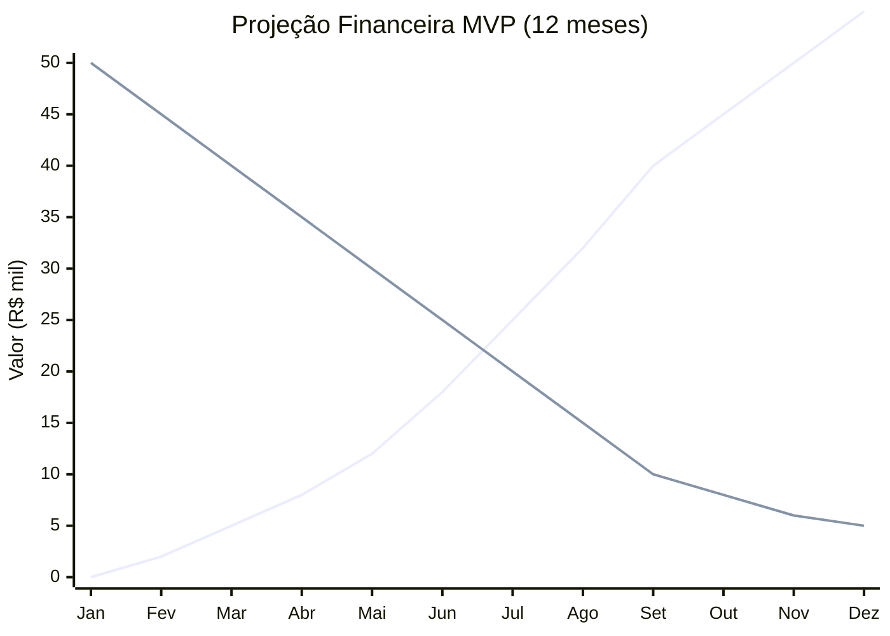

### Análise de Break-even

- **Investimento inicial:** R$ 177.200
- **Preço por usuário:** R$ 99/mês
- **Margem bruta:** 80% (R$ 79,20 por usuário)
- **Break-even:** 187 usuários pagantes
- **Tempo para break-even:** 8-10 meses (projeção)

### Cenários de ROI

| Cenário | Usuários (12 meses) | MRR (12 meses) | ROI | Probabilidade |
|---------|---------------------|----------------|-----|---------------|
| **Pessimista** | 100 | R$ 9.900 | -40% | 20% |
| **Realista** | 200 | R$ 19.800 | +35% | 60% |
| **Otimista** | 400 | R$ 39.600 | +170% | 20% |

---

## ⚠️ Riscos e Mitigações

### Matriz de Riscos

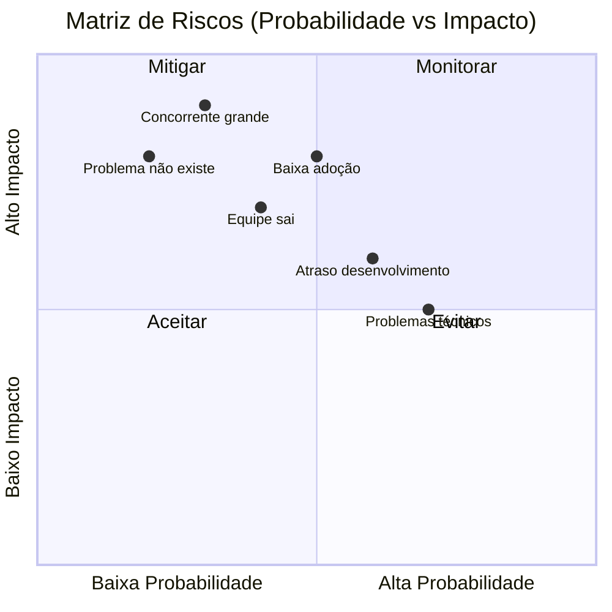

### Riscos Críticos (Alto Impacto)

#### Risco 1: Problema não é relevante o suficiente

- **Probabilidade:** Baixa (20%)
- **Impacto:** Alto
- **Mitigação:**
  - Pesquisa extensiva com 50+ entrevistas
  - Validação contínua durante desenvolvimento
  - Pivot rápido se necessário
- **Plano B:** Pivotar para problema relacionado identificado na pesquisa

#### Risco 2: Concorrente grande entra no mercado

- **Probabilidade:** Média (30%)
- **Impacto:** Alto
- **Mitigação:**
  - Foco em nicho específico (PMEs brasileiras)
  - Construir vantagens defensáveis (simplicidade, suporte)
  - Parcerias estratégicas
- **Plano B:** Posicionar como solução complementar ou especializada

#### Risco 3: Baixa adoção de usuários

- **Probabilidade:** Média (50%)
- **Impacto:** Alto
- **Mitigação:**
  - Testes de usabilidade frequentes
  - Onboarding simplificado
  - Suporte ativo nos primeiros usuários
- **Plano B:** Reformular proposta de valor baseada em feedback

### Riscos Médios

#### Risco 4: Atraso no desenvolvimento

- **Probabilidade:** Alta (60%)
- **Impacto:** Médio
- **Mitigação:**
  - Buffer de 20% no cronograma
  - Sprints curtos com entregas incrementais
  - Priorização rigorosa de features
- **Plano B:** Lançar com features mínimas e iterar rapidamente

#### Risco 5: Problemas técnicos de escalabilidade

- **Probabilidade:** Alta (70%)
- **Impacto:** Médio
- **Mitigação:**
  - Arquitetura escalável desde o início
  - Testes de carga regulares
  - Monitoramento proativo
- **Plano B:** Refatoração técnica em paralelo ao crescimento

### Plano de Contingência

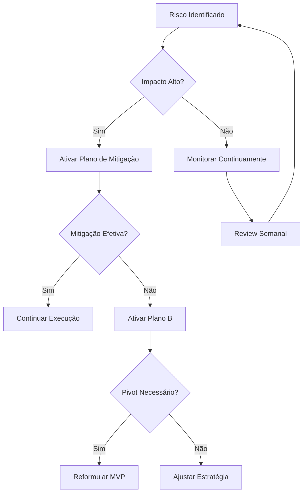

---

## ✅ Critérios de Aceitação

### Critérios de Sucesso do MVP

#### Critérios Quantitativos

- [ ] **100 usuários cadastrados** em 8 semanas pós-lançamento
- [ ] **70% dos usuários** completam onboarding
- [ ] **40% de retenção D7** (usuários que voltam após 7 dias)
- [ ] **20 usuários pagantes** em 12 semanas
- [ ] **NPS > 30** após 3 meses
- [ ] **<3 segundos** tempo de carregamento do dashboard
- [ ] **99% uptime** durante período de teste

#### Critérios Qualitativos

- [ ] **Usuários conseguem** importar dados e ver dashboard em <10 minutos
- [ ] **Feedback positivo** sobre simplicidade vs concorrentes
- [ ] **Usuários recomendam** o produto para outros (evidência de product-market fit)
- [ ] **Suporte técnico** resolve 90% dos problemas em <24h
- [ ] **Zero bugs críticos** que impedem uso principal

### Critérios de Go/No-Go para Próxima Fase

#### Go (Continuar para versão completa)

- ✅ Pelo menos 3/5 critérios quantitativos atingidos
- ✅ Feedback qualitativo majoritariamente positivo
- ✅ Evidências claras de product-market fit
- ✅ Viabilidade técnica e financeira confirmada
- ✅ Equipe alinhada e motivada para continuar

#### No-Go (Pivot ou parar)

- ❌ Menos de 2/5 critérios quantitativos atingidos
- ❌ Feedback consistentemente negativo sobre valor
- ❌ Problemas técnicos fundamentais não resolvidos
- ❌ Inviabilidade financeira clara
- ❌ Perda de interesse do mercado-alvo

### Processo de Avaliação

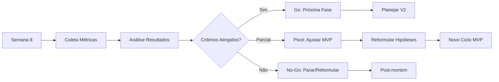

---

## 🔗 Referências

### Metodologias e Frameworks

- **[Lean Startup](https://theleanstartup.com/)**: Metodologia principal para desenvolvimento do MVP
- **[Design Thinking](https://www.ideou.com/blogs/inspiration/what-is-design-thinking)**: Processo de descoberta e validação
- **[Jobs-to-be-Done](https://jobs-to-be-done.com/)**: Framework para entender necessidades dos usuários
- **[OKRs](https://www.whatmatters.com/)**: Definição e acompanhamento de objetivos

### Ferramentas de Desenvolvimento

| Ferramenta | Propósito | Link | Categoria |
|------------|-----------|------|----------|
| **Figma** | Design e prototipagem | [figma.com](https://figma.com) | Design |
| **Miro** | Colaboração e workshops | [miro.com](https://miro.com) | Colaboração |
| **Hotjar** | Analytics comportamental | [hotjar.com](https://hotjar.com) | Analytics |
| **Mixpanel** | Product analytics | [mixpanel.com](https://mixpanel.com) | Analytics |
| **Intercom** | Suporte e feedback | [intercom.com](https://intercom.com) | Suporte |
| **Typeform** | Pesquisas e feedback | [typeform.com](https://typeform.com) | Pesquisa |

### Livros e Recursos

- **"The Lean Startup"** - Eric Ries: Metodologia fundamental
- **"Sprint"** - Jake Knapp: Processo de validação rápida
- **"Hooked"** - Nir Eyal: Engajamento e retenção de usuários
- **"Crossing the Chasm"** - Geoffrey Moore: Adoção de produtos inovadores

### Templates e Checklists

- **[Lean Canvas](https://leanstack.com/lean-canvas)**: Canvas de modelo de negócio
- **[Value Proposition Canvas](https://www.strategyzer.com/canvas/value-proposition-canvas)**: Canvas de proposta de valor
- **[User Story Mapping](https://www.jpattonassociates.com/user-story-mapping/)**: Mapeamento de jornada do usuário

### Métricas e KPIs

- **[AARRR Metrics](https://www.slideshare.net/dmc500hats/startup-metrics-for-pirates-long-version)**: Framework de métricas para startups
- **[HEART Framework](https://library.gv.com/how-to-choose-the-right-ux-metrics-for-your-product-5f46359ab5be)**: Métricas de UX do Google
- **[North Star Framework](https://amplitude.com/north-star)**: Definição de métrica principal

---

<div align="center">

**Desenvolvido por**: Equipe DATAMETRIA
**Última Atualização**: 15/10/2025
**Versão**: 2.0.0

---

## Framework completo de MVP Planning implementado! 🚀📊

</div>
