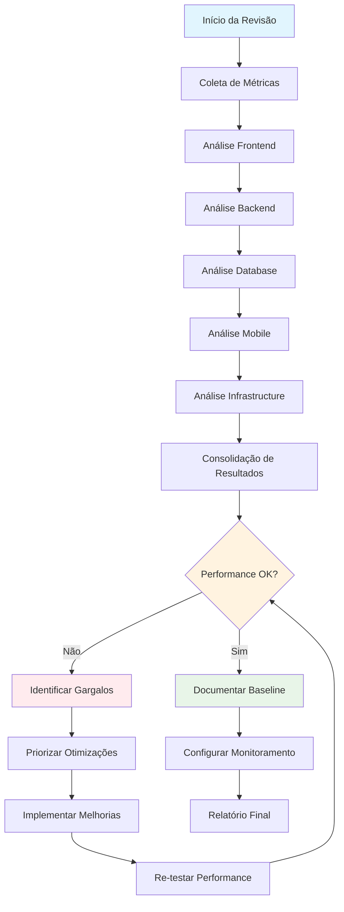
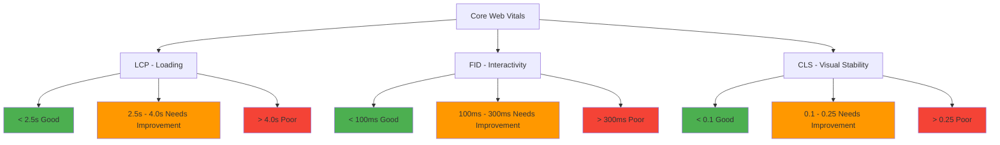
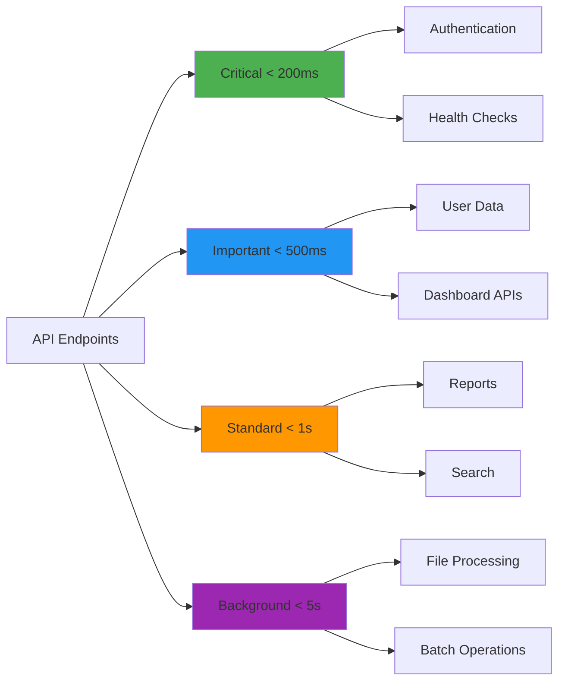
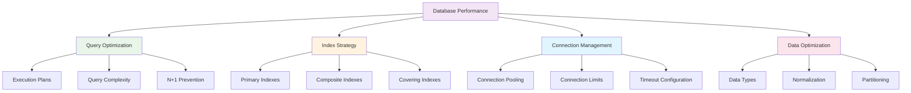
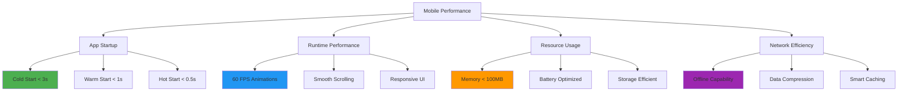
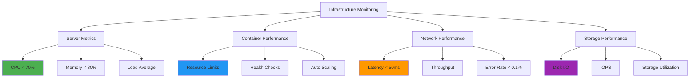
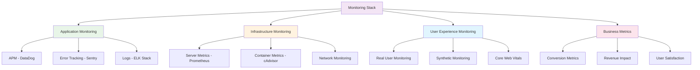
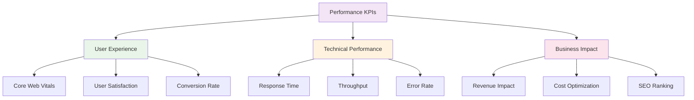

# Template de Checklist de Performance Review

<div align="center">

## Checklist Completo para Revisão de Performance - Framework Enterprise

[](https://datametria.io)
[](https://web.dev/vitals/)
[](https://web.dev/vitals/)
[](https://developers.google.com/web/tools/lighthouse)
[](https://web.dev/performance-budgets-101/)
[](https://github.com/datametria/standards)
[](https://aws.amazon.com/q/)

[🔗 Template Original](link) • [🔗 Diretrizes](link) • [🔗 Exemplos](link)

[⚡ Frontend](#-frontend-performance) • [🔧 Backend](#-backend-performance) • [🗄️ Database](#️-database-performance) •
[📱 Mobile](#-mobile-performance) • [☁️ Infrastructure](#️-infrastructure-performance) • [📊 Monitoring](#-monitoring-e-alertas)

</div>

---

## 📋 Índice

- [🎯 Visão Geral](#-visão-geral)
- [📝 Informações da Revisão](#-informações-da-revisão)
- [⚡ Frontend Performance](#-frontend-performance)
- [🔧 Backend Performance](#-backend-performance)
- [🗄️ Database Performance](#️-database-performance)
- [📱 Mobile Performance](#-mobile-performance)
- [☁️ Infrastructure Performance](#️-infrastructure-performance)
- [📊 Monitoring e Alertas](#-monitoring-e-alertas)
- [🔧 Ferramentas de Performance](#-ferramentas-de-performance)
- [📈 Métricas e KPIs](#-métricas-e-kpis)
- [🔗 Referências](#-referências)

---

## 🎯 Visão Geral

### Framework de Performance Review DATAMETRIA

Este template fornece um checklist completo para revisão de performance de aplicações, cobrindo frontend, backend, mobile e infraestrutura com foco em Core Web Vitals e métricas de negócio.

#### Fluxo de Performance Review



#### Benefícios do Framework

- ✅ **Performance Otimizada**: Identificação sistemática de gargalos
- ✅ **User Experience**: Melhoria da experiência do usuário
- ✅ **SEO Benefits**: Melhor ranking nos motores de busca
- ✅ **Cost Optimization**: Redução de custos de infraestrutura
- ✅ **Scalability**: Preparação para crescimento
- ✅ **Monitoring**: Monitoramento contínuo de performance

---

## 📝 Informações da Revisão

### Dados Básicos

| Campo | Descrição | Exemplo |
|-------|-----------|---------|
| **Aplicação** | [Nome da aplicação] | DATAMETRIA Dashboard |
| **Versão** | [Versão da aplicação] | v2.1.0 |
| **Reviewer** | [Nome do performance engineer] | João Silva |
| **Data da Revisão** | [DD/MM/AAAA] | 15/10/2025 |
| **Ambiente** | [Development/Staging/Production] | Production |
| **Tipo de Teste** | [Load/Stress/Volume/Spike] | Load Testing |
| **Ferramentas** | [Lighthouse/JMeter/K6/etc.] | Lighthouse, K6, DataDog |
| **Baseline Anterior** | [Data da última revisão] | 15/07/2025 |

### Contexto da Aplicação

#### Características Técnicas

- **Stack Frontend**: [Vue.js/React/Angular]
- **Stack Backend**: [Node.js/Python/Java]
- **Database**: [PostgreSQL/MongoDB/MySQL]
- **Infrastructure**: [AWS/GCP/Azure]
- **CDN**: [CloudFlare/AWS CloudFront]
- **Monitoring**: [DataDog/New Relic/Grafana]

#### Métricas de Negócio

- **Usuários Ativos**: [Número de usuários]
- **Requests/dia**: [Volume de requests]
- **Pico de Tráfego**: [Horário de maior uso]
- **SLA Target**: [99.9% uptime]
- **Performance Budget**: [Orçamento de performance]

---

## ⚡ Frontend Performance

### Core Web Vitals



#### Métricas Principais

- [ ] **LCP (Largest Contentful Paint)**: < 2.5s ⭐ | < 4.0s ⚠️ | > 4.0s ❌
- [ ] **FID (First Input Delay)**: < 100ms ⭐ | < 300ms ⚠️ | > 300ms ❌
- [ ] **CLS (Cumulative Layout Shift)**: < 0.1 ⭐ | < 0.25 ⚠️ | > 0.25 ❌
- [ ] **FCP (First Contentful Paint)**: < 1.8s ⭐ | < 3.0s ⚠️ | > 3.0s ❌
- [ ] **TTI (Time to Interactive)**: < 3.8s ⭐ | < 7.3s ⚠️ | > 7.3s ❌
- [ ] **TBT (Total Blocking Time)**: < 200ms ⭐ | < 600ms ⚠️ | > 600ms ❌

#### Lighthouse Score

- [ ] **Performance Score**: > 90 ⭐ | > 70 ⚠️ | < 70 ❌
- [ ] **Accessibility Score**: > 90 ⭐ | > 70 ⚠️ | < 70 ❌
- [ ] **Best Practices Score**: > 90 ⭐ | > 70 ⚠️ | < 70 ❌
- [ ] **SEO Score**: > 90 ⭐ | > 70 ⚠️ | < 70 ❌

### Loading Performance

#### Resource Optimization

- [ ] **Critical resources**: Recursos críticos priorizados e inline
- [ ] **Resource hints**: dns-prefetch, preconnect, preload implementados
- [ ] **Code splitting**: Código dividido por rotas/componentes
- [ ] **Lazy loading**: Imagens e componentes carregados sob demanda
- [ ] **Tree shaking**: Código não utilizado removido automaticamente
- [ ] **Bundle size**: Tamanho do bundle otimizado (< 250KB inicial)
- [ ] **Compression**: Gzip/Brotli habilitado (>80% redução)

#### Exemplos de Otimização

```javascript
// ✅ Bom - Lazy loading de componente
const LazyComponent = React.lazy(() => import('./HeavyComponent'));

function App() {
  return (
    <Suspense fallback={<div>Loading...</div>}>
      <LazyComponent />
    </Suspense>
  );
}

// ✅ Bom - Preload de recurso crítico
<link rel="preload" href="/critical-font.woff2" as="font" type="font/woff2" crossorigin>

// ✅ Bom - Resource hints
<link rel="dns-prefetch" href="//api.datametria.io">
<link rel="preconnect" href="https://fonts.googleapis.com" crossorigin>

// ❌ Ruim - Importação de biblioteca inteira
import _ from 'lodash';

// ✅ Bom - Importação específica
import { debounce } from 'lodash-es';

// ✅ Bom - Dynamic import com error handling
const loadModule = async () => {
  try {
    const module = await import('./heavy-module');
    return module.default;
  } catch (error) {
    console.error('Failed to load module:', error);
    return null;
  }
};
```

### Image Optimization

#### Formatos e Compressão

- [ ] **Modern formats**: WebP/AVIF para browsers suportados
- [ ] **Responsive images**: srcset e sizes implementados corretamente
- [ ] **Image compression**: Imagens comprimidas adequadamente (>70% redução)
- [ ] **Lazy loading**: Imagens carregadas sob demanda com intersection observer
- [ ] **Critical images**: Imagens above-the-fold priorizadas
- [ ] **Image CDN**: CDN para otimização automática e transformações
- [ ] **Placeholder strategy**: Placeholders ou blur-up implementados

#### Implementação de Imagens

```html
<!-- ✅ Bom - Responsive image com formatos modernos -->
<picture>
  <source srcset="image.avif" type="image/avif">
  <source srcset="image.webp" type="image/webp">
  
</picture>

<!-- ✅ Bom - Preload de imagem crítica -->
<link rel="preload" as="image" href="hero-image.webp" type="image/webp">
```

### CSS Performance

#### Otimizações CSS

- [ ] **Critical CSS**: CSS crítico inline (< 14KB)
- [ ] **CSS minification**: CSS minificado e comprimido
- [ ] **Unused CSS**: CSS não utilizado removido (PurgeCSS/UnCSS)
- [ ] **CSS-in-JS optimization**: Otimização de CSS-in-JS com cache
- [ ] **Font loading**: Fontes carregadas com font-display: swap
- [ ] **Animation performance**: Animações usam transform/opacity apenas
- [ ] **CSS containment**: CSS containment para isolamento de performance

#### Exemplos CSS Otimizado

```css
/* ✅ Bom - Animação performática */
.element {
  transform: translateX(0);
  transition: transform 0.3s ease;
  will-change: transform;
}

.element:hover {
  transform: translateX(10px);
}

/* ✅ Bom - Font loading otimizado */
@font-face {
  font-family: 'CustomFont';
  src: url('font.woff2') format('woff2');
  font-display: swap;
}

/* ✅ Bom - CSS containment */
.card {
  contain: layout style paint;
}

/* ❌ Ruim - Animação que causa reflow */
.element {
  left: 0;
  transition: left 0.3s ease;
}

.element:hover {
  left: 10px; /* Causa reflow */
}
```

### JavaScript Performance

#### Otimizações JavaScript

- [ ] **Script loading**: Scripts carregados de forma otimizada (async/defer)
- [ ] **Event delegation**: Delegação de eventos implementada
- [ ] **Memory leaks**: Sem vazamentos de memória detectados
- [ ] **DOM manipulation**: Manipulação DOM otimizada (batch updates)
- [ ] **Debouncing/Throttling**: Implementado para eventos frequentes
- [ ] **Service Workers**: Cache inteligente implementado
- [ ] **Web Workers**: Processamento pesado em background threads

#### Exemplos JavaScript Otimizado

```javascript
// ✅ Bom - Event delegation
document.addEventListener('click', (e) => {
  if (e.target.matches('.button')) {
    handleButtonClick(e.target);
  }
});

// ✅ Bom - Debouncing
const debouncedSearch = debounce((query) => {
  performSearch(query);
}, 300);

// ✅ Bom - Batch DOM updates
const fragment = document.createDocumentFragment();
items.forEach(item => {
  const element = createElement(item);
  fragment.appendChild(element);
});
container.appendChild(fragment);

// ✅ Bom - Web Worker para processamento pesado
const worker = new Worker('heavy-computation.js');
worker.postMessage(data);
worker.onmessage = (e) => {
  updateUI(e.data);
};

// ✅ Bom - Service Worker para cache
self.addEventListener('fetch', (event) => {
  if (event.request.destination === 'image') {
    event.respondWith(
      caches.match(event.request).then(response => {
        return response || fetch(event.request);
      })
    );
  }
});
```

---

## 🔧 Backend Performance

### Response Time Targets



#### Performance Targets

- [ ] **Critical APIs**: < 200ms (auth, health checks)
- [ ] **Important APIs**: < 500ms (user data, dashboard)
- [ ] **Standard APIs**: < 1s (reports, search)
- [ ] **Background jobs**: < 5s (file processing, batch)
- [ ] **Database queries**: < 100ms para queries simples
- [ ] **External API calls**: Timeout e retry configurados
- [ ] **Error rate**: < 0.1% para endpoints críticos

### Scalability Checklist

#### Architecture Patterns

- [ ] **Horizontal scaling**: Aplicação suporta múltiplas instâncias
- [ ] **Stateless design**: Aplicação é completamente stateless
- [ ] **Load balancing**: Load balancer configurado com health checks
- [ ] **Connection pooling**: Pool de conexões implementado
- [ ] **Resource limits**: Limites de CPU/memória definidos
- [ ] **Circuit breaker**: Pattern implementado para serviços externos
- [ ] **Rate limiting**: Rate limiting implementado por usuário/IP

#### Implementação de Escalabilidade

```python
# ✅ Bom - Connection pooling
from sqlalchemy import create_engine
from sqlalchemy.pool import QueuePool

engine = create_engine(
    DATABASE_URL,
    poolclass=QueuePool,
    pool_size=20,
    max_overflow=30,
    pool_pre_ping=True,
    pool_recycle=3600
)

# ✅ Bom - Circuit breaker
from circuitbreaker import circuit

@circuit(failure_threshold=5, recovery_timeout=30)
def call_external_api(data):
    response = requests.post(EXTERNAL_API_URL, json=data, timeout=5)
    response.raise_for_status()
    return response.json()

# ✅ Bom - Rate limiting
from flask_limiter import Limiter
from flask_limiter.util import get_remote_address

limiter = Limiter(
    app,
    key_func=get_remote_address,
    default_limits=["1000 per hour"]
)

@app.route('/api/data')
@limiter.limit("100 per minute")
def get_data():
    return jsonify(data)
```

### Caching Strategy

#### Multi-Layer Caching

- [ ] **Application cache**: Cache de aplicação implementado (Redis/Memcached)
- [ ] **Database cache**: Cache de queries implementado
- [ ] **CDN**: CDN configurado para assets estáticos
- [ ] **Browser cache**: Headers de cache configurados adequadamente
- [ ] **Cache invalidation**: Estratégia de invalidação bem definida
- [ ] **Cache warming**: Pre-aquecimento de cache implementado
- [ ] **Cache monitoring**: Monitoramento de hit rate e performance

#### Implementação de Cache

```python
# ✅ Bom - Cache com Redis e TTL
import redis
from functools import wraps

redis_client = redis.Redis(host='localhost', port=6379, db=0)

def cache_result(ttl=300):
    def decorator(func):
        @wraps(func)
        def wrapper(*args, **kwargs):
            cache_key = f"{func.__name__}:{hash(str(args) + str(kwargs))}"

            # Try to get from cache
            cached_result = redis_client.get(cache_key)
            if cached_result:
                return json.loads(cached_result)

            # Execute function and cache result
            result = func(*args, **kwargs)
            redis_client.setex(cache_key, ttl, json.dumps(result))
            return result
        return wrapper
    return decorator

@cache_result(ttl=600)
def get_user_profile(user_id):
    return db.session.query(User).filter_by(id=user_id).first()

# ✅ Bom - Cache de query com eager loading
users = User.query.options(
    db.joinedload(User.profile),
    db.joinedload(User.permissions)
).all()

# ❌ Ruim - N+1 queries
users = User.query.all()
for user in users:
    print(user.profile.name)  # Query adicional para cada user
```

### API Optimization

#### Performance Patterns

- [ ] **Pagination**: Paginação implementada para todas as listas
- [ ] **Field selection**: Seleção de campos específicos (GraphQL-style)
- [ ] **Batch operations**: Operações em lote suportadas
- [ ] **Compression**: Compressão gzip/brotli habilitada
- [ ] **HTTP/2**: HTTP/2 habilitado no servidor
- [ ] **Keep-alive**: Conexões keep-alive configuradas
- [ ] **Request/Response optimization**: Payloads otimizados

---

## 🗄️ Database Performance

### Query Performance Matrix



### Query Optimization

#### Performance Targets

- [ ] **Simple queries**: < 10ms execution time
- [ ] **Complex queries**: < 100ms execution time
- [ ] **Report queries**: < 1s execution time
- [ ] **Batch operations**: < 5s execution time
- [ ] **Query execution plans**: Analisados e otimizados
- [ ] **Index usage**: Índices utilizados em 95%+ das queries
- [ ] **Query complexity**: Queries complexas refatoradas
- [ ] **N+1 queries**: Problema N+1 completamente eliminado

#### Exemplos de Otimização

```sql
-- ✅ Bom - Query otimizada com índice composto
CREATE INDEX idx_user_status_created ON users(status, created_at)
WHERE status IN ('active', 'pending');

-- ✅ Bom - Query que usa o índice eficientemente
SELECT id, name, email, created_at
FROM users
WHERE status = 'active'
  AND created_at >= '2025-01-01'
ORDER BY created_at DESC
LIMIT 20;

-- ✅ Bom - Query com JOIN otimizado
SELECT u.name, p.title, COUNT(o.id) as order_count
FROM users u
JOIN profiles p ON u.id = p.user_id
LEFT JOIN orders o ON u.id = o.user_id
WHERE u.status = 'active'
GROUP BY u.id, u.name, p.title
HAVING COUNT(o.id) > 0;

-- ❌ Ruim - Query que não usa índices
SELECT * FROM users WHERE UPPER(email) = 'USER@EXAMPLE.COM';

-- ✅ Bom - Versão otimizada
SELECT * FROM users WHERE email = LOWER('USER@EXAMPLE.COM');
-- Com índice: CREATE INDEX idx_users_email_lower ON users(LOWER(email));
```

### Indexing Strategy

#### Index Types and Usage

- [ ] **Primary indexes**: Índices primários otimizados para queries principais
- [ ] **Composite indexes**: Índices compostos para queries complexas
- [ ] **Covering indexes**: Índices que cobrem queries completas
- [ ] **Partial indexes**: Índices parciais para subconjuntos específicos
- [ ] **Unique indexes**: Constraints de unicidade com performance
- [ ] **Index maintenance**: Manutenção automática de índices
- [ ] **Index monitoring**: Monitoramento de uso e performance

### Connection Management

#### Connection Pool Configuration

- [ ] **Pool size**: Tamanho do pool otimizado para carga
- [ ] **Max connections**: Limite máximo configurado adequadamente
- [ ] **Connection timeout**: Timeout de conexão configurado
- [ ] **Idle timeout**: Timeout para conexões idle
- [ ] **Connection validation**: Validação de conexões implementada
- [ ] **Connection monitoring**: Monitoramento de pool de conexões
- [ ] **Failover**: Failover automático configurado

```python
# ✅ Bom - Configuração otimizada de connection pool
DATABASE_CONFIG = {
    'pool_size': 20,
    'max_overflow': 30,
    'pool_timeout': 30,
    'pool_recycle': 3600,
    'pool_pre_ping': True,
    'connect_args': {
        'connect_timeout': 10,
        'application_name': 'datametria_app'
    }
}

# ✅ Bom - Monitoramento de conexões
def monitor_db_connections():
    active_connections = engine.pool.checkedout()
    pool_size = engine.pool.size()
    overflow = engine.pool.checkedin()

    metrics = {
        'active_connections': active_connections,
        'pool_size': pool_size,
        'overflow_connections': overflow,
        'utilization': (active_connections / pool_size) * 100
    }

    return metrics
```

---

## 📱 Mobile Performance

### Performance Targets Mobile



### App Performance Metrics

#### Startup Performance

- [ ] **Cold start time**: < 3s para primeira inicialização
- [ ] **Warm start time**: < 1s para reinicialização
- [ ] **Hot start time**: < 0.5s para retorno do background
- [ ] **Time to interactive**: < 2s após splash screen
- [ ] **First meaningful paint**: < 1.5s
- [ ] **App size**: APK/IPA otimizado (< 50MB base)

#### Runtime Performance

- [ ] **Frame rate**: 60fps consistente em animações
- [ ] **Screen transitions**: Transições fluidas entre telas
- [ ] **Scroll performance**: Scroll suave em listas longas
- [ ] **Memory usage**: < 100MB em uso normal
- [ ] **Battery consumption**: Otimizado para duração da bateria
- [ ] **Network efficiency**: Uso eficiente de dados móveis

### Flutter Performance

#### Widget Optimization

- [ ] **Widget rebuilds**: Rebuilds desnecessários evitados com keys
- [ ] **Image caching**: Cache de imagens implementado
- [ ] **List performance**: ListView.builder para listas grandes
- [ ] **Animation performance**: Animações otimizadas com Transform
- [ ] **Bundle size**: Tamanho do APK/IPA otimizado
- [ ] **Tree shaking**: Código não utilizado removido

#### Exemplos Flutter Otimizado

```dart
// ✅ Bom - ListView otimizado para performance
class OptimizedListView extends StatelessWidget {
  final List<Item> items;

  const OptimizedListView({Key? key, required this.items}) : super(key: key);

  @override
  Widget build(BuildContext context) {
    return ListView.builder(
      itemCount: items.length,
      itemExtent: 80.0, // Fixed height for better performance
      itemBuilder: (context, index) {
        return ItemWidget(
          key: ValueKey(items[index].id), // Stable key
          item: items[index],
        );
      },
    );
  }
}

// ✅ Bom - Animação performática
class PerformantAnimation extends StatefulWidget {
  @override
  _PerformantAnimationState createState() => _PerformantAnimationState();
}

class _PerformantAnimationState extends State<PerformantAnimation>
    with SingleTickerProviderStateMixin {
  late AnimationController _controller;
  late Animation<double> _animation;

  @override
  void initState() {
    super.initState();
    _controller = AnimationController(
      duration: Duration(milliseconds: 300),
      vsync: this,
    );
    _animation = Tween<double>(begin: 0.0, end: 1.0).animate(
      CurvedAnimation(parent: _controller, curve: Curves.easeInOut),
    );
  }

  @override
  Widget build(BuildContext context) {
    return AnimatedBuilder(
      animation: _animation,
      builder: (context, child) {
        return Transform.scale(
          scale: _animation.value,
          child: Container(
            width: 100,
            height: 100,
            color: Colors.blue,
          ),
        );
      },
    );
  }
}

// ❌ Ruim - Lista não otimizada
Column(
  children: items.map((item) =>
    ExpensiveWidget(item: item) // Todos os widgets criados de uma vez
  ).toList(),
)

// ✅ Bom - Image caching otimizado
CachedNetworkImage(
  imageUrl: imageUrl,
  placeholder: (context, url) => CircularProgressIndicator(),
  errorWidget: (context, url, error) => Icon(Icons.error),
  memCacheWidth: 300, // Resize for memory efficiency
  memCacheHeight: 300,
)
```

### React Native Performance

#### Optimization Strategies

- [ ] **FlatList usage**: FlatList para listas grandes com virtualization
- [ ] **Image optimization**: Imagens otimizadas e cached
- [ ] **Bundle splitting**: Code splitting implementado
- [ ] **Native modules**: Módulos nativos para operações pesadas
- [ ] **Memory leaks**: Vazamentos de memória evitados
- [ ] **Bridge optimization**: Minimizar calls entre JS e Native

#### Exemplos React Native Otimizado

```javascript
// ✅ Bom - FlatList otimizado
const OptimizedList = ({ data }) => {
  const renderItem = useCallback(({ item }) => (
    <ItemComponent key={item.id} item={item} />
  ), []);

  const keyExtractor = useCallback((item) => item.id.toString(), []);

  return (
    <FlatList
      data={data}
      renderItem={renderItem}
      keyExtractor={keyExtractor}
      removeClippedSubviews={true}
      maxToRenderPerBatch={10}
      windowSize={10}
      initialNumToRender={10}
      getItemLayout={(data, index) => ({
        length: ITEM_HEIGHT,
        offset: ITEM_HEIGHT * index,
        index,
      })}
    />
  );
};

// ✅ Bom - Image otimizada
import FastImage from 'react-native-fast-image';

const OptimizedImage = ({ uri, style }) => (
  <FastImage
    style={style}
    source={{
      uri,
      priority: FastImage.priority.normal,
      cache: FastImage.cacheControl.immutable,
    }}
    resizeMode={FastImage.resizeMode.cover}
  />
);

// ✅ Bom - Prevenção de memory leaks
useEffect(() => {
  const subscription = someObservable.subscribe(handleData);

  return () => {
    subscription.unsubscribe(); // Cleanup
  };
}, []);
```

---

## ☁️ Infrastructure Performance

### Server Performance Monitoring



### Server Performance Targets

#### Resource Utilization

- [ ] **CPU utilization**: < 70% em operação normal
- [ ] **Memory usage**: < 80% da memória disponível
- [ ] **Disk I/O**: IOPS otimizado para workload
- [ ] **Network latency**: < 50ms entre serviços
- [ ] **Load average**: < número de cores disponíveis
- [ ] **Swap usage**: Swap usage mínimo (< 10%)

#### Performance Monitoring

- [ ] **Response time**: P95 < 500ms para APIs críticas
- [ ] **Throughput**: Requests/segundo dentro do esperado
- [ ] **Error rate**: < 0.1% para endpoints críticos
- [ ] **Availability**: > 99.9% uptime
- [ ] **Recovery time**: < 5 minutos para falhas
- [ ] **Capacity planning**: Projeção de crescimento implementada

### Container Performance

#### Docker Optimization

- [ ] **Resource limits**: CPU/memória definidos adequadamente
- [ ] **Image optimization**: Imagens multi-stage e otimizadas
- [ ] **Health checks**: Health checks configurados
- [ ] **Startup probes**: Probes de inicialização configurados
- [ ] **Security scanning**: Vulnerabilidades verificadas
- [ ] **Registry optimization**: Registry privado configurado

#### Exemplos Docker Otimizado

```dockerfile
# ✅ Bom - Multi-stage build otimizado
FROM node:18-alpine AS builder
WORKDIR /app
COPY package*.json ./
RUN npm ci --only=production && npm cache clean --force

FROM node:18-alpine AS runtime
RUN addgroup -g 1001 -S nodejs && \
    adduser -S nextjs -u 1001

WORKDIR /app
COPY --from=builder /app/node_modules ./node_modules
COPY --chown=nextjs:nodejs . .

USER nextjs
EXPOSE 3000

HEALTHCHECK --interval=30s --timeout=3s --start-period=5s --retries=3 \
  CMD curl -f http://localhost:3000/health || exit 1

CMD ["npm", "start"]
```

```yaml
# ✅ Bom - Kubernetes deployment otimizado
apiVersion: apps/v1
kind: Deployment
metadata:
  name: datametria-app
spec:
  replicas: 3
  selector:
    matchLabels:
      app: datametria-app
  template:
    metadata:
      labels:
        app: datametria-app
    spec:
      containers:
      - name: app
        image: datametria/app:latest
        ports:
        - containerPort: 3000
        resources:
          requests:
            memory: "256Mi"
            cpu: "250m"
          limits:
            memory: "512Mi"
            cpu: "500m"
        livenessProbe:
          httpGet:
            path: /health
            port: 3000
          initialDelaySeconds: 30
          periodSeconds: 10
        readinessProbe:
          httpGet:
            path: /ready
            port: 3000
          initialDelaySeconds: 5
          periodSeconds: 5
        env:
        - name: NODE_ENV
          value: "production"
```

---

## 📊 Monitoring e Alertas

### Performance Monitoring Stack



### Alerting Strategy

#### Critical Alerts (P0)

- [ ] **Application down**: Aplicação inacessível
- [ ] **Database down**: Banco de dados inacessível
- [ ] **High error rate**: > 5% error rate
- [ ] **Response time**: P95 > 2s para APIs críticas
- [ ] **Memory usage**: > 90% utilização
- [ ] **Disk space**: > 85% utilização

#### Warning Alerts (P1)

- [ ] **Performance degradation**: P95 > 1s
- [ ] **High CPU**: > 80% por 5 minutos
- [ ] **High memory**: > 85% por 5 minutos
- [ ] **Queue backlog**: Filas com backlog > 1000
- [ ] **Cache miss rate**: > 20% miss rate
- [ ] **SSL certificate**: Expira em 30 dias

### Monitoring Implementation

```python
# ✅ Bom - Custom metrics com Prometheus
from prometheus_client import Counter, Histogram, Gauge
import time

# Métricas customizadas
REQUEST_COUNT = Counter('http_requests_total', 'Total HTTP requests', ['method', 'endpoint'])
REQUEST_DURATION = Histogram('http_request_duration_seconds', 'HTTP request duration')
ACTIVE_USERS = Gauge('active_users_total', 'Number of active users')

def monitor_performance(func):
    def wrapper(*args, **kwargs):
        start_time = time.time()

        try:
            result = func(*args, **kwargs)
            REQUEST_COUNT.labels(method='GET', endpoint='/api/data').inc()
            return result
        except Exception as e:
            REQUEST_COUNT.labels(method='GET', endpoint='/api/data').inc()
            raise
        finally:
            REQUEST_DURATION.observe(time.time() - start_time)

    return wrapper

# ✅ Bom - Health check endpoint
@app.route('/health')
def health_check():
    checks = {
        'database': check_database_connection(),
        'redis': check_redis_connection(),
        'external_api': check_external_api(),
        'disk_space': check_disk_space(),
        'memory': check_memory_usage()
    }

    all_healthy = all(checks.values())
    status_code = 200 if all_healthy else 503

    return jsonify({
        'status': 'healthy' if all_healthy else 'unhealthy',
        'checks': checks,
        'timestamp': datetime.utcnow().isoformat()
    }), status_code
```

---

## 🔧 Ferramentas de Performance

### Frontend Tools

| Ferramenta | Propósito | Link | Categoria |
|------------|-----------|------|----------|
| **Lighthouse** | Auditoria de performance | [developers.google.com/web/tools/lighthouse](https://developers.google.com/web/tools/lighthouse) | Auditoria |
| **WebPageTest** | Teste de performance | [webpagetest.org](https://webpagetest.org) | Testing |
| **Chrome DevTools** | Debugging e profiling | [developer.chrome.com/docs/devtools](https://developer.chrome.com/docs/devtools) | Debugging |
| **Webpack Bundle Analyzer** | Análise de bundle | [github.com/webpack-contrib/webpack-bundle-analyzer](https://github.com/webpack-contrib/webpack-bundle-analyzer) | Análise |

### Backend Tools

| Ferramenta | Propósito | Link | Categoria |
|------------|-----------|------|----------|
| **K6** | Load testing | [k6.io](https://k6.io) | Testing |
| **JMeter** | Performance testing | [jmeter.apache.org](https://jmeter.apache.org) | Testing |
| **New Relic** | APM monitoring | [newrelic.com](https://newrelic.com) | Monitoring |
| **DataDog** | Observabilidade | [datadoghq.com](https://datadoghq.com) | Monitoring |

### Database Tools

| Ferramenta | Propósito | Link | Categoria |
|------------|-----------|------|----------|
| **pgAdmin** | PostgreSQL management | [pgadmin.org](https://pgadmin.org) | Database |
| **MongoDB Compass** | MongoDB GUI | [mongodb.com/products/compass](https://mongodb.com/products/compass) | Database |
| **Query Analyzer** | Query optimization | Varia por SGBD | Optimization |

---

## 📈 Métricas e KPIs

### Performance KPIs Dashboard



### Métricas de Sucesso

| Categoria | Métrica | Target | Atual | Status |
|-----------|---------|--------|-------|--------|
| **Core Web Vitals** | LCP | < 2.5s | [valor] | 🟢/🟡/🔴 |
| **Core Web Vitals** | FID | < 100ms | [valor] | 🟢/🟡/🔴 |
| **Core Web Vitals** | CLS | < 0.1 | [valor] | 🟢/🟡/🔴 |
| **API Performance** | P95 Response Time | < 500ms | [valor] | 🟢/🟡/🔴 |
| **Availability** | Uptime | > 99.9% | [valor] | 🟢/🟡/🔴 |
| **User Experience** | Bounce Rate | < 40% | [valor] | 🟢/🟡/🔴 |
| **Business** | Conversion Rate | > 3% | [valor] | 🟢/🟡/🔴 |

### Performance Budget

```javascript
// performance-budget.json
{
  "budget": [
    {
      "resourceSizes": [
        {
          "resourceType": "script",
          "budget": 250
        },
        {
          "resourceType": "total",
          "budget": 500
        }
      ],
      "resourceCounts": [
        {
          "resourceType": "third-party",
          "budget": 10
        }
      ]
    }
  ]
}
```

---

## 🔗 Referências

### Documentação Oficial

- **[Web Vitals](https://web.dev/vitals/)**: Métricas essenciais para experiência do usuário
- **[Lighthouse](https://developers.google.com/web/tools/lighthouse)**: Ferramenta de auditoria de performance
- **[Chrome DevTools](https://developer.chrome.com/docs/devtools/performance/)**: Guia de performance no DevTools
- **[React Performance](https://reactjs.org/docs/optimizing-performance.html)**: Otimização de performance no React

### Ferramentas e Recursos

- **[PageSpeed Insights](https://pagespeed.web.dev/)**: Análise de performance de páginas
- **[GTmetrix](https://gtmetrix.com/)**: Teste de velocidade de websites
- **[Pingdom](https://www.pingdom.com/)**: Monitoramento de uptime e performance
- **[WebPageTest](https://webpagetest.org/)**: Teste detalhado de performance

### Guias e Best Practices

- **[Google Performance Best Practices](https://developers.google.com/web/fundamentals/performance)**: Melhores práticas do Google
- **[MDN Performance](https://developer.mozilla.org/en-US/docs/Web/Performance)**: Guia completo de performance web
- **[High Performance Browser Networking](https://hpbn.co/)**: Livro sobre networking e performance

---

<div align="center">

**Desenvolvido por**: Equipe DATAMETRIA
**Última Atualização**: 15/10/2025
**Versão**: 2.0.0

---

## Framework completo de Performance Review implementado! ⚡📊

</div>
