# Template de Product Backlog

**Versão:** 2.0.0
**Última Atualização:** 03/11/2025
**Autor:** Vander Loto - CTO DATAMETRIA

<div align="center">

## Product Backlog Template - Framework Ágil Enterprise

[](https://www.scrum.org/resources/what-is-a-product-backlog)
[](https://agilemanifesto.org)
[](https://www.mountaingoatsoftware.com/agile/user-stories)
[](https://www.scrum.org/resources/what-is-sprint-planning)
[](https://www.productplan.com/glossary/product-backlog/)
[](https://github.com/datametria/standards)
[](https://aws.amazon.com/q/)

[🔗 Template Original](link) • [🔗 Diretrizes](link) • [🔗 Exemplos](link)

[🎯 Sprint Atual](#-sprint-atual) • [📋 Backlog](#-backlog-de-funcionalidades) • [🐛 Bugs](#-backlog-de-bugs) •
[🔧 Melhorias](#-backlog-de-melhorias-técnicas) • [💡 Icebox](#-icebox---ideias-futuras) • [📊 Métricas](#-métricas-e-kpis)

</div>

---

## 📋 Índice

- [📚 Geração de Backlog Inicial](#-geração-de-backlog-inicial)
- [🤖 Guia Interativo Amazon Q](#-guia-interativo-amazon-q)
- [🎯 Visão Geral](#-visão-geral)
- [📝 Informações do Projeto](#-informações-do-projeto)
- [🎯 Sprint Atual](#-sprint-atual)
- [📋 Backlog de Funcionalidades](#-backlog-de-funcionalidades)
- [🐛 Backlog de Bugs](#-backlog-de-bugs)
- [🔧 Backlog de Melhorias Técnicas](#-backlog-de-melhorias-técnicas)
- [💡 Icebox - Ideias Futuras](#-icebox---ideias-futuras)
- [✅ Critérios de Definição de Pronto](#-critérios-de-definição-de-pronto-dod)
- [🔄 Processo de Gestão do Backlog](#-processo-de-gestão-do-backlog)
- [📊 Métricas e KPIs](#-métricas-e-kpis)
- [🗓️ Roadmap de Alto Nível](#️-roadmap-de-alto-nível)
- [🔗 Referências](#-referências)

---

## 📚 Geração de Backlog Inicial

### Como Gerar Backlog a Partir de Documentos de Concepção

O backlog inicial é gerado automaticamente pelo Amazon Q Developer a partir de 3 documentos principais:

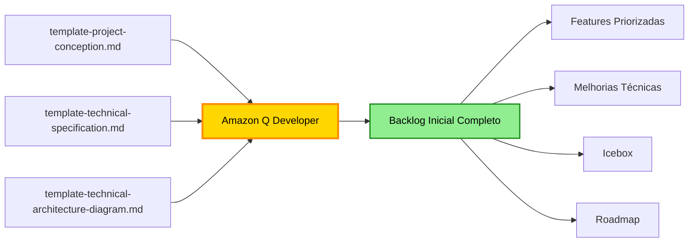

### 📝 Documentos Necessários

#### 1️⃣ template-project-conception.md

**O que fornece:**
- ✅ Visão do produto e objetivos estratégicos
- ✅ Stakeholders e personas
- ✅ Escopo (dentro/fora)
- ✅ Épicos identificados
- ✅ Cronograma e marcos
- ✅ ROI e justificativa de negócio
- ✅ Análise de riscos

**Usado para gerar:**
- 🎯 Épicos principais
- 📈 Roadmap de alto nível
- 📊 Métricas de sucesso
- 💡 Ideias para Icebox

#### 2️⃣ template-technical-specification.md

**O que fornece:**
- ✅ Requisitos funcionais (RF-001, RF-002...)
- ✅ Requisitos não funcionais (RNF-001...)
- ✅ User Stories com critérios de aceitação
- ✅ Componentes técnicos
- ✅ Estimativas de esforço
- ✅ Fases de implementação
- ✅ Testes e validação

**Usado para gerar:**
- 🎯 Features detalhadas (FEAT-001, FEAT-002...)
- 🔧 Melhorias técnicas (TECH-001, PERF-001...)
- ✅ Critérios de aceitação
- 📏 Estimativas AI-First

#### 3️⃣ template-technical-architecture-diagram.md

**O que fornece:**
- ✅ Componentes do sistema
- ✅ Integrações necessárias
- ✅ Dependências técnicas
- ✅ Fluxos de dados
- ✅ Infraestrutura

**Usado para gerar:**
- 🔧 Débito técnico (TECH-001...)
- 🔒 Itens de segurança (SEC-001...)
- ⚡ Otimizações de performance (PERF-001...)
- 🔗 Dependências entre features

### 🤖 Prompt para Geração Automática

**Prompt Completo para Amazon Q:**

```
@file template-project-conception.md
@file template-technical-specification.md
@file template-technical-architecture-diagram.md
@file template-product-backlog.md

Gere o backlog inicial completo do projeto seguindo estas instruções:

1. FEATURES: Extraia todas as User Stories da especificação técnica e crie itens FEAT-XXX
2. ÉPICOS: Agrupe features relacionadas nos épicos identificados na concepção
3. PRIORIZAÇÃO: Aplique framework RICE baseado no ROI e cronograma
4. ESTIMATIVAS: Converta estimativas tradicionais para AI-First (85-90% redução)
5. MELHORIAS TÉCNICAS: Identifique débito técnico dos diagramas de arquitetura
6. DEPENDÊNCIAS: Mapeie dependências entre componentes
7. ROADMAP: Crie roadmap visual baseado no cronograma
8. ICEBOX: Adicione funcionalidades fora do escopo como ideias futuras

Formato de saída: Markdown seguindo estrutura do template-product-backlog.md
```

### 📊 Mapeamento Automático

#### De Concepção para Backlog

| Origem (Concepção) | Destino (Backlog) | Transformação |
|------------------------|-------------------|------------------|
| **Visão do Produto** | Visão do Projeto | Cópia direta |
| **Objetivos SMART** | Critérios de Sucesso | Conversão em métricas |
| **Escopo Dentro** | Features (FEAT-XXX) | Quebra em itens acionáveis |
| **Escopo Fora** | Icebox (IDEA-XXX) | Ideias futuras |
| **Cronograma** | Roadmap de Alto Nível | Gantt chart |
| **Riscos** | Dependências e Riscos | Mapeamento de bloqueios |
| **Personas** | User Stories | "Como [persona]..." |

#### De Especificação Técnica para Backlog

| Origem (Especificação) | Destino (Backlog) | Transformação |
|----------------------------|-------------------|------------------|
| **RF-001** | FEAT-001 | Conversão direta |
| **RNF-001 (Performance)** | PERF-001 | Melhoria técnica |
| **RNF-002 (Segurança)** | SEC-001 | Item de segurança |
| **User Stories** | Features com critérios | Enriquecimento |
| **Estimativas (pontos)** | Estimativas AI-First | Redução 85-90% |
| **Fases de Implementação** | Sprints planejadas | Distribuição temporal |

#### De Arquitetura para Backlog

| Origem (Arquitetura) | Destino (Backlog) | Transformação |
|----------------------|-------------------|------------------|
| **Componentes** | Features de infraestrutura | TECH-XXX |
| **Integrações** | Features de integração | FEAT-XXX |
| **Dependências** | Dependências entre itens | Mapeamento |
| **Fluxos de Dados** | Features de API | FEAT-XXX |
| **Segurança** | Itens de segurança | SEC-XXX |
| **Performance** | Otimizações | PERF-XXX |

### 🛠️ Exemplo Prático de Geração

#### Entrada: Documento de Concepção

```markdown
## Escopo do Projeto

### ✅ Dentro do Escopo
- Autenticação Unificada: SSO para todos os sistemas internos
- Autenticação Multifator: SMS, email, app authenticator
- Dashboard Administrativo: Gestão de usuários e permissões
```

#### Saída: Backlog Gerado

```markdown
### 🔴 Itens Críticos

#### FEAT-001: Sistema de Autenticação SSO
**Status**: 📋 Backlog
**Estimativa**: 13 pts (tradicional) → 2 pts (AI-First)
**Epic**: Segurança e Autenticação
**Prioridade**: 🔴 Crítica

**Descrição**: Como usuário interno, eu quero fazer login uma única vez para acessar todos os sistemas.

**Critérios de Aceitação**:
- [ ] Login único funciona em todos os 5 sistemas
- [ ] Token JWT com expiração de 24h
- [ ] Refresh token implementado
- [ ] Logout invalida token em todos os sistemas

#### FEAT-002: Autenticação Multifator (MFA)
**Status**: 📋 Backlog
**Estimativa**: 8 pts (tradicional) → 1 pt (AI-First)
**Epic**: Segurança e Autenticação
**Prioridade**: 🔴 Crítica
**Dependências**: FEAT-001 deve estar pronta

**Descrição**: Como administrador, eu quero exigir MFA para aumentar segurança.

**Critérios de Aceitação**:
- [ ] Suporte a SMS
- [ ] Suporte a email
- [ ] Suporte a app authenticator (TOTP)
- [ ] Configuração por usuário
```

### ⚙️ Configuração da Geração

#### Parâmetros de Conversão

```yaml
# Configuração de geração de backlog
backlog_generation:
  # Estimativas AI-First
  ai_first_reduction:
    crud_simples: 90%      # 8 pts → 1 pt
    api_rest: 85%          # 13 pts → 2 pts
    dashboard: 85%         # 21 pts → 3 pts
    integracao: 87%        # 8 pts → 1 pt
    bug_fix: 85%           # 3 pts → 0.5 pt

  # Priorização automática
  priority_mapping:
    must_have: "🔴 Crítica"
    should_have: "🟠 Alta"
    could_have: "🟡 Média"
    wont_have: "💡 Icebox"

  # Numeração de IDs
  id_format:
    features: "FEAT-{counter:03d}"
    bugs: "BUG-{counter:03d}"
    tech_debt: "TECH-{counter:03d}"
    performance: "PERF-{counter:03d}"
    security: "SEC-{counter:03d}"
    ideas: "IDEA-{counter:03d}"
```

### ✅ Checklist de Validação

#### Antes de Gerar o Backlog

- [ ] **Documento de Concepção** completo e aprovado
- [ ] **Especificação Técnica** com todos os requisitos
- [ ] **Diagramas de Arquitetura** finalizados
- [ ] **Stakeholders** identificados e validados
- [ ] **Cronograma** definido com marcos
- [ ] **Orçamento** aprovado

#### Após Gerar o Backlog

- [ ] **Todas as features** do escopo foram mapeadas
- [ ] **Priorização** aplicada (RICE framework)
- [ ] **Estimativas AI-First** calculadas
- [ ] **Dependências** identificadas
- [ ] **Roadmap** visual criado
- [ ] **Icebox** populado com ideias futuras
- [ ] **Métricas** de sucesso definidas
- [ ] **Revisão** com Product Owner realizada

### 📊 Exemplo Completo de Transformação

#### 📝 Input: Especificação Técnica

```markdown
### Requisitos Funcionais

| ID | Requisito | Prioridade |
|----|-----------|------------|
| RF-001 | Sistema deve permitir login com email/senha | Must Have |
| RF-002 | Sistema deve suportar MFA via SMS | Must Have |
| RF-003 | Dashboard deve exibir usuários ativos | Should Have |

### User Stories

#### US-001: Login de Usuário
**Como** usuário
**Eu quero** fazer login com email e senha
**Para que** eu possa acessar o sistema de forma segura

**Critérios de Aceitação**:
- Login com credenciais válidas
- Mensagem de erro para credenciais inválidas
- Bloqueio após 5 tentativas falhas
```

#### 🎯 Output: Backlog Estruturado

```markdown
### 🔴 Itens Críticos

#### FEAT-001: Sistema de Login Email/Senha
**Status**: 📋 Backlog
**Estimativa Tradicional**: 8 pontos (2 dias)
**Estimativa AI-First**: 1 ponto (2 horas) - Redução de 87%
**Assignee**: A definir
**Epic**: Autenticação
**Labels**: security, authentication, backend
**Prioridade**: 🔴 Crítica (Must Have)
**Valor de Negócio**: Alto
**Impacto no Usuário**: Alto

**Descrição**: Como usuário, eu quero fazer login com email e senha para acessar o sistema de forma segura.

**Critérios de Aceitação**:
- [ ] Login com credenciais válidas retorna token JWT
- [ ] Mensagem de erro clara para credenciais inválidas
- [ ] Bloqueio automático após 5 tentativas falhas
- [ ] Tempo de resposta < 500ms
- [ ] Logs de auditoria para todas as tentativas

**Tarefas Técnicas**:
- [ ] Implementar endpoint POST /api/v1/auth/login
- [ ] Criar middleware de autenticação
- [ ] Implementar rate limiting
- [ ] Adicionar logs de segurança
- [ ] Escrever testes unitários (85% coverage)
- [ ] Escrever testes de integração
- [ ] Documentar API no OpenAPI

**Dependências**:
- Configuração do banco de dados PostgreSQL
- Configuração do Redis para rate limiting

**Riscos**:
- Integração com sistema legado pode ser complexa
- Performance pode ser afetada com muitos usuários simultâneos

**Documentação Necessária**:
- [ ] API documentation (template-api-documentation.md)
- [ ] Feature documentation (template-feature-documentation.md)
- [ ] Security assessment (template-security-assessment.md)

**Testes Necessários**:
- [ ] Unit tests (85% coverage)
- [ ] Integration tests (85% coverage)
- [ ] E2E tests (85% coverage)
- [ ] Security tests (OWASP)
- [ ] Performance tests (< 500ms)

---

#### FEAT-002: Autenticação Multifator (MFA) via SMS
**Status**: 📋 Backlog
**Estimativa Tradicional**: 13 pontos (3 dias)
**Estimativa AI-First**: 2 pontos (4 horas) - Redução de 85%
**Assignee**: A definir
**Epic**: Autenticação
**Labels**: security, mfa, sms
**Prioridade**: 🔴 Crítica (Must Have)
**Dependências**: FEAT-001 deve estar pronta

**Descrição**: Como administrador, eu quero exigir MFA via SMS para aumentar a segurança do sistema.

**Critérios de Aceitação**:
- [ ] Envio de código SMS após login bem-sucedido
- [ ] Validação de código de 6 dígitos
- [ ] Expiração do código em 5 minutos
- [ ] Máximo 3 tentativas de validação
- [ ] Opção de reenvio de código (1x a cada 60s)

---

#### FEAT-003: Dashboard de Usuários Ativos
**Status**: 📋 Backlog
**Estimativa Tradicional**: 21 pontos (1 semana)
**Estimativa AI-First**: 3 pontos (1 dia) - Redução de 85%
**Assignee**: A definir
**Epic**: Dashboard Administrativo
**Labels**: frontend, dashboard, analytics
**Prioridade**: 🟠 Alta (Should Have)
**Dependências**: FEAT-001 (autenticação)

**Descrição**: Como administrador, eu quero visualizar usuários ativos em tempo real para monitorar o sistema.

**Critérios de Aceitação**:
- [ ] Gráfico de usuários ativos em tempo real
- [ ] Filtro por período (última hora, dia, semana, mês)
- [ ] Exportação de dados em CSV
- [ ] Atualização automática a cada 30 segundos
- [ ] Tempo de carregamento < 2 segundos
```

### 🚀 Próximos Passos

Após gerar o backlog inicial:

1. **Revisão com Stakeholders** (2-3 dias)
   - Validar priorização
   - Ajustar estimativas
   - Confirmar dependências

2. **Refinamento do Backlog** (1 semana)
   - Detalhar features de alta prioridade
   - Quebrar itens grandes em menores
   - Adicionar critérios de aceitação faltantes

3. **Sprint Planning** (4 horas)
   - Selecionar itens para Sprint 1
   - Distribuir entre equipe
   - Definir objetivo da sprint

4. **Kick-off do Desenvolvimento** (1 dia)
   - Setup de ambiente
   - Configuração de ferramentas
   - Início do desenvolvimento AI-First

---

## 🤖 Guia Interativo Amazon Q

### Como Usar Este Template com Amazon Q

**Prompt Recomendado para Criar Itens de Backlog:**

```
@file template-product-backlog.md
Quero criar um novo item de backlog. Me faça as perguntas do Guia Interativo.
```

### Perguntas para Criação de Features (🎯)

Quando você solicitar criação de uma **Feature**, farei estas perguntas:

**Nota**: O ID será gerado automaticamente (próximo FEAT-XXX disponível)

#### 1️⃣ Identificação Básica
- **Qual o título resumido?** (Ex: "Sistema de Notificações Push")
- **Qual o Epic relacionado?** (Ex: "Engajamento de Usuários")
- **Quem será o assignee?** (Nome do desenvolvedor ou "A definir")

#### 2️⃣ User Story
- **Como** [tipo de usuário]?
- **Eu quero** [objetivo/funcionalidade]?
- **Para que** [benefício/valor]?

#### 3️⃣ Critérios de Aceitação
- **Quais são os critérios mensuráveis?** (Mínimo 3, máximo 7)
- **Há requisitos de performance?** (Ex: tempo de resposta < 2s)
- **Há requisitos de segurança?** (Ex: autenticação obrigatória)
- **Há requisitos de acessibilidade?** (Ex: WCAG 2.1 AA)

#### 4️⃣ Priorização
- **Qual a prioridade?** (🔴 Crítica | 🟠 Alta | 🟡 Média | 🟢 Baixa)
- **Qual o valor de negócio?** (Alto | Médio | Baixo)
- **Qual o impacto no usuário?** (Alto | Médio | Baixo)
- **Há deadline regulatório?** (Sim/Não, data se sim)

#### 5️⃣ Estimativa (AI-First)
- **Qual a complexidade técnica?** (Simples | Média | Alta)
- **Tipo de tarefa?** (CRUD | API REST | Dashboard | Integração | Outro)
- **Estimativa tradicional seria?** (Em pontos ou dias)
- **Estimativa AI-First:** [Calculada automaticamente com 85-90% redução]

#### 6️⃣ Dependências e Riscos
- **Há dependências técnicas?** (Ex: configuração de Redis)
- **Há dependências de outras features?** (Ex: FEAT-001 deve estar pronta)
- **Quais os riscos identificados?** (Técnicos, de negócio, de prazo)
- **Há workarounds possíveis?** (Plano B se houver bloqueios)

#### 7️⃣ Documentação e Testes
- **Precisa de documentação específica?** (API docs, user guide, etc.)
- **Quais tipos de teste são necessários?** (Unit 85% | Integration 85% | E2E 85%)
- **Há casos de teste específicos?** (Cenários críticos)

### Perguntas para Criação de Bugs (🐛)

Quando você solicitar registro de um **Bug**, farei estas perguntas:

**Nota**: O ID será gerado automaticamente (próximo BUG-XXX disponível)

#### 1️⃣ Identificação
- **Qual o título resumido?** (Ex: "Erro de timeout em relatórios")
- **Qual a severidade?** (🔴 Crítica | 🟠 Alta | 🟡 Média | 🟢 Baixa)
- **Em qual ambiente ocorre?** (Produção | Staging | Desenvolvimento)

#### 2️⃣ Descrição do Problema
- **O que está acontecendo?** (Descrição clara e objetiva)
- **Qual o comportamento esperado?**
- **Qual o comportamento atual?**
- **Com que frequência ocorre?** (Sempre | Frequente | Ocasional | Rara)

#### 3️⃣ Reprodução
- **Quais os passos para reproduzir?** (Lista numerada detalhada)
- **Em qual browser/dispositivo?** (Chrome, Safari, iOS, Android, etc.)
- **Qual a versão afetada?** (Ex: v2.1.0)
- **Há logs de erro?** (Copiar mensagens relevantes)

#### 4️⃣ Impacto
- **Quantos usuários são afetados?** (Número ou percentual)
- **Qual o impacto no negócio?** (Perda de receita, reputação, etc.)
- **Há workaround disponível?** (Solução temporária)
- **Qual o SLA de resolução?** (4h | 24h | 48h | 1 semana)

#### 5️⃣ Análise Técnica
- **Qual o módulo/componente afetado?** (Ex: Dashboard, API Auth)
- **Há suspeita da causa raiz?** (Hipótese inicial)
- **Estimativa de esforço para correção?** (Em pontos ou horas)

### Perguntas para Melhorias Técnicas (🔧)

Quando você solicitar uma **Melhoria Técnica**, farei estas perguntas:

**Nota**: O ID será gerado automaticamente baseado no tipo (TECH-XXX, PERF-XXX, SEC-XXX)

#### 1️⃣ Identificação
- **Qual o tipo?** (⚡ Performance | 🔧 Débito Técnico | 🔒 Segurança | 📚 Docs)
- **Qual o título?** (Ex: "Implementar CDN para Assets")

#### 2️⃣ Problema Atual
- **Qual o problema técnico atual?** (Descrição do débito/gargalo)
- **Qual o impacto se não resolver?** (Técnico e de negócio)
- **Há métricas atuais?** (Ex: tempo de carregamento 5s)

#### 3️⃣ Solução Proposta
- **Qual a solução técnica?** (Descrição da implementação)
- **Quais tecnologias serão usadas?** (Ex: CloudFlare CDN, Redis)
- **Qual o impacto esperado?** (Ex: 50% redução no tempo)
- **Há alternativas consideradas?** (Outras abordagens avaliadas)

#### 4️⃣ ROI e Priorização
- **Qual o ROI estimado?** (Alto | Médio | Baixo)
- **Qual a prioridade?** (🔴 Crítica | 🟠 Alta | 🟡 Média | 🟢 Baixa)
- **Qual o prazo recomendado?** (Q1 2026, 30 dias, etc.)
- **Há compliance envolvido?** (LGPD, OWASP, ISO27001)

### Perguntas para Ideias Futuras (💡 Icebox)

Quando você sugerir uma **Ideia para o Icebox**, farei estas perguntas:

**Nota**: O ID será gerado automaticamente (próximo IDEA-XXX disponível)

#### 1️⃣ Conceito
- **Qual o título?** (Ex: "Dashboard com IA Preditiva")
- **Qual o tipo?** (Disruptiva | Transformacional | Incremental | Experimental)

#### 2️⃣ Visão
- **Qual a descrição da ideia?** (Visão geral)
- **Qual o benefício esperado?** (Valor para usuário/negócio)
- **Qual o valor potencial?** (Muito Alto | Alto | Médio | Baixo)

#### 3️⃣ Viabilidade
- **Qual a complexidade?** (Alta | Média | Baixa)
- **Quais tecnologias necessárias?** (Ex: TensorFlow, ML, NLP)
- **Qual o esforço estimado?** (Em pontos ou sprints)
- **Qual o timeline?** (2026, 2027, 2028)

#### 4️⃣ Validação
- **Precisa de pesquisa/POC?** (Sim/Não)
- **Qual o budget estimado?** (Se aplicável)
- **Quais os critérios de decisão?** (Para tirar do icebox)

### Exemplo de Uso Interativo

**Desenvolvedor:**
```
@file template-product-backlog.md
Quero criar uma feature de exportação de relatórios em PDF
```

**Amazon Q:**
```
Vou te ajudar a criar essa feature seguindo o framework DATAMETRIA!

📝 IDENTIFICAÇÃO BÁSICA
ID gerado automaticamente: FEAT-004

1. Qual o Epic relacionado? (ex: Automação de Relatórios)
2. Quem será o assignee?

📖 USER STORY
4. Como [tipo de usuário] você quer exportar relatórios em PDF?
5. Para que [benefício] isso é necessário?

✅ CRITÉRIOS DE ACEITAÇÃO
6. Quais formatos além de PDF? (Excel, CSV?)
7. Há limite de tamanho de relatório?
8. Precisa de marca d'água ou logo?

[... continua com todas as perguntas relevantes ...]
```

### Comandos Rápidos

| Comando | Ação |
|---------|------|
| `criar feature` | Inicia questionário para Feature |
| `registrar bug` | Inicia questionário para Bug |
| `propor melhoria` | Inicia questionário para Melhoria Técnica |
| `adicionar ideia` | Inicia questionário para Icebox |
| `estimar item` | Calcula estimativa AI-First |
| `priorizar backlog` | Aplica framework RICE |

---

## 🎯 Visão Geral

### Framework de Product Backlog DATAMETRIA

Este template fornece uma estrutura completa para gestão de product backlog seguindo metodologias ágeis e melhores práticas de product management.

#### Fluxo de Gestão do Backlog

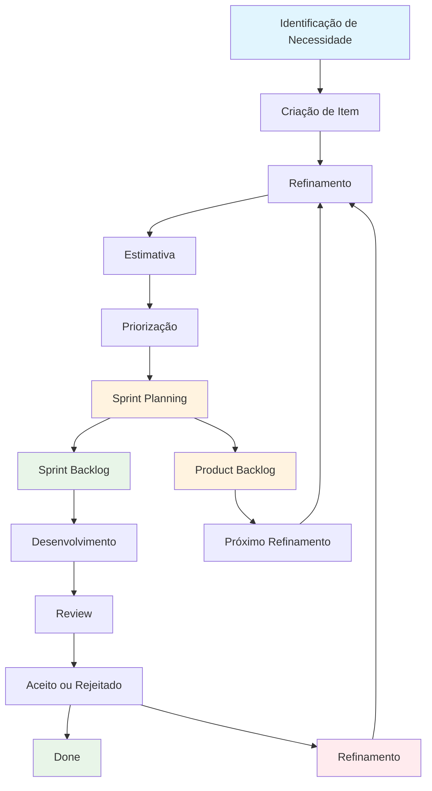

#### Benefícios do Framework

- ✅ **Transparência**: Visibilidade completa do roadmap de produto
- ✅ **Priorização**: Critérios claros para tomada de decisão
- ✅ **Agilidade**: Adaptação rápida a mudanças de mercado
- ✅ **Qualidade**: Critérios de aceitação bem definidos
- ✅ **Colaboração**: Alinhamento entre stakeholders
- ✅ **Métricas**: Acompanhamento de valor entregue

### Legendas do Sistema

#### Prioridades

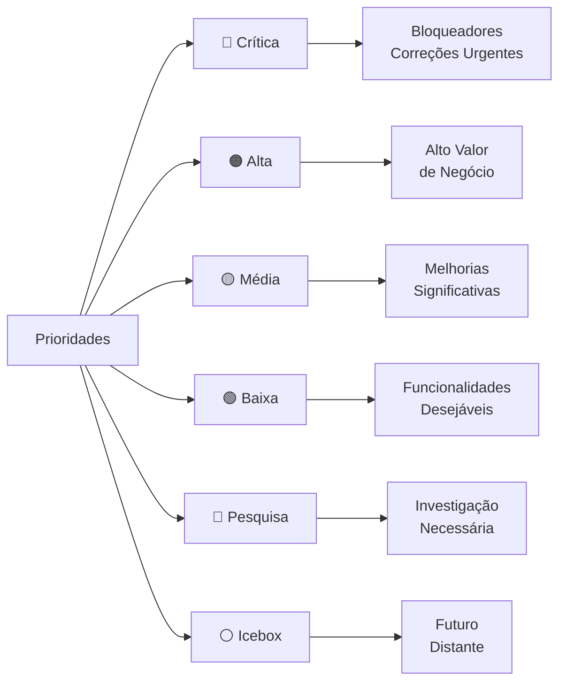

#### Status de Desenvolvimento

- **📋 Backlog**: Item identificado e documentado
- **🔍 Refinamento**: Em processo de detalhamento
- **📏 Estimado**: Estimativa de esforço definida
- **✅ Pronto**: Pronto para desenvolvimento
- **🔄 Em Progresso**: Desenvolvimento iniciado
- **🧪 Teste**: Em fase de testes
- **✅ Concluído**: Implementado e testado
- **❌ Cancelado**: Item removido do escopo
- **⏸️ Pausado**: Desenvolvimento temporariamente suspenso

#### Tipos de Item

- **🎯 Feature**: Nova funcionalidade
- **🐛 Bug**: Correção de defeito
- **⚡ Performance**: Melhoria de performance
- **🔧 Tech Debt**: Débito técnico
- **📚 Docs**: Documentação
- **🔒 Security**: Segurança
- **🎨 UX/UI**: Experiência do usuário

---

## 📝 Informações do Projeto

### Dados Básicos

| Campo | Valor | Exemplo |
|-------|-------|---------|
| **Nome do Projeto** | [Nome do projeto] | DATAMETRIA Analytics |
| **Product Owner** | [Nome do PO] | Maria Silva |
| **Scrum Master** | [Nome do SM] | João Santos |
| **Tech Lead** | [Nome do TL] | Ana Costa |
| **Sprint Atual** | [Número da sprint] | Sprint 15 |
| **Duração da Sprint** | [1 ou 2 semanas] | 2 semanas |
| **Versão Atual** | [Versão em produção] | v2.1.0 |
| **Próxima Release** | [Versão planejada] | v2.2.0 |
| **Data da Release** | [Data prevista] | 15/12/2025 |

### Contexto do Produto

#### Visão do Produto

> [Declaração de visão clara e concisa do produto]

**Exemplo:**
> Democratizar análise de dados para pequenas empresas através de uma plataforma intuitiva que transforma dados complexos em insights acionáveis.

#### Objetivos Estratégicos

- **Objetivo 1**: [Descrição do objetivo estratégico]
- **Objetivo 2**: [Descrição do objetivo estratégico]
- **Objetivo 3**: [Descrição do objetivo estratégico]

#### Personas Principais

- **Persona 1**: [Nome e descrição breve]
- **Persona 2**: [Nome e descrição breve]
- **Persona 3**: [Nome e descrição breve]

---

## 🎯 Sprint Atual

### Sprint [Número] - Versão [X.Y.Z] (Planejada para [Data])

**Duração**: [1 semana | 2 semanas]
**Período**: [Data Início] a [Data Fim]

#### Objetivo da Sprint

> [Objetivo claro e mensurável da sprint atual]

**Nota sobre Duração de Sprints**:
- **Sprints de 1 semana**: Recomendadas para equipes pequenas (2-4 pessoas) ou projetos com alta volatilidade
- **Sprints de 2 semanas**: Padrão recomendado para maioria dos projetos, oferece melhor equilíbrio entre planejamento e entrega
- **Sprints de 3-4 semanas**: Não recomendadas - muito longas, perdem agilidade e feedback rápido

#### Capacidade da Sprint

- **Velocity Média**: [X] pontos
- **Capacidade Planejada**: [X] pontos
- **Pontos Comprometidos**: [X] pontos
- **Utilização**: [X]%

**🤖 Nota sobre AI-First Development**:

Com Amazon Q Developer (90% IA + 10% Humano), as estimativas são **10x mais rápidas**:

| Tipo de Tarefa | Tradicional | AI-First | Redução |
|----------------|-------------|----------|----------|
| **CRUD Simples** | 8 pts (2 dias) | 1 pt (2h) | 90% |
| **API REST** | 13 pts (3 dias) | 2 pts (4h) | 85% |
| **Dashboard** | 21 pts (1 semana) | 3 pts (1 dia) | 85% |
| **Integração** | 8 pts (2 dias) | 1 pt (2h) | 87% |
| **Bug Fix** | 3 pts (4h) | 0.5 pt (30min) | 85% |

**Distribuição do Esforço**:
- 🤖 **90% Amazon Q**: Geração de código, testes, documentação
- 👨‍💻 **10% Humano**: Análise crítica, code review, decisões arquiteturais

### 🔴 Itens Críticos

#### FEAT-001: Sistema de Autenticação JWT

**Status**: 🔄 Em Progresso
**Estimativa**: 8 pontos
**Assignee**: João Silva
**Epic**: Segurança e Autenticação
**Labels**: security, authentication, backend

**Descrição**: Como usuário do sistema, eu quero fazer login de forma segura para acessar minhas informações protegidas.

**Critérios de Aceitação**:

- [ ] Login com email e senha
- [ ] Token JWT gerado com expiração de 24h
- [ ] Refresh token implementado
- [ ] Logout que invalida o token
- [ ] Proteção contra ataques de força bruta

**Tarefas Técnicas**:

- [x] Implementar middleware de autenticação
- [x] Criar endpoints de login/logout
- [ ] Implementar refresh token
- [ ] Adicionar rate limiting
- [ ] Escrever testes unitários

**Dependências**: Configuração do Redis para cache de tokens
**Riscos**: Integração com sistema legado pode ser complexa
**Notas**: Seguir padrões OWASP para segurança

#### BUG-045: Dashboard não carrega em Safari

**Status**: 🧪 Teste
**Estimativa**: 3 pontos
**Assignee**: Ana Costa
**Severidade**: Alta
**Ambiente**: Produção

**Descrição**: Dashboard principal não carrega corretamente no Safari, apresentando tela branca.

**Passos para Reproduzir**:

1. Abrir Safari (versão 14+)
2. Fazer login no sistema
3. Navegar para o dashboard principal

**Comportamento Esperado**: Dashboard carrega normalmente
**Comportamento Atual**: Tela branca com erro no console
**Impacto**: 15% dos usuários afetados (usuários Mac)
**Workaround**: Usar Chrome ou Firefox

### 🟠 Itens de Alta Prioridade

#### FEAT-002: Relatórios Automáticos

**Status**: ✅ Pronto
**Estimativa**: 13 pontos
**Assignee**: Carlos Oliveira
**Epic**: Automação de Relatórios

**Descrição**: Como gestor, eu quero receber relatórios automáticos por email para acompanhar KPIs sem esforço manual.

**Critérios de Aceitação**:

- [ ] Configuração de frequência (diária, semanal, mensal)
- [ ] Seleção de métricas personalizadas
- [ ] Template de email responsivo
- [ ] Agendamento de envio

**Valor de Negócio**: Alto - Reduz 80% do tempo gasto em relatórios manuais
**Impacto no Usuário**: Melhora significativa na produtividade dos gestores

### 🟡 Itens de Média Prioridade

#### PERF-012: Otimização de Queries do Dashboard

**Status**: 📏 Estimado
**Estimativa**: 5 pontos
**Assignee**: A definir

**Descrição**: Otimizar queries do dashboard principal para reduzir tempo de carregamento de 3s para <1s.

**Critérios de Aceitação**:

- [ ] Tempo de carregamento < 1s
- [ ] Implementar cache de queries
- [ ] Otimizar índices do banco

---

## 📋 Backlog de Funcionalidades

### Matriz de Priorização

| Valor \ Esforço | Baixo Esforço | Médio Esforço | Alto Esforço |
|-----------------|---------------|---------------|---------------|
| **Alto Valor** | 🟢 **Fazer Agora**<br/>• Autenticação JWT<br/>• Relatórios Auto | 🟡 **Fazer Depois**<br/>• Dashboard Mobile | 🔴 **Não Fazer Agora**<br/>• API Pública |
| **Médio Valor** | 🔵 **Talvez Fazer**<br/>• Integração Slack | 🟡 **Avaliar**<br/>• Notificações Push | 🔴 **Não Fazer**<br/>• Multi-idioma |
| **Baixo Valor** | 🔵 **Nice-to-Have**<br/>• Temas Customizados | 🔴 **Não Prioritário**<br/>• Widgets Extras | 🔴 **Não Fazer**<br/>• Gamificação |

### Épicos Planejados

#### Epic 1: Automação de Relatórios

**Objetivo**: Automatizar geração e distribuição de relatórios para reduzir trabalho manual
**Valor de Negócio**: Economia de 10h/semana por usuário
**Estimativa Total**: 34 pontos
**Timeline**: Q4 2025

**Histórias Incluídas**:

- FEAT-002: Relatórios Automáticos - 13 pontos
- FEAT-015: Templates Customizáveis - 8 pontos
- FEAT-023: Distribuição por WhatsApp - 5 pontos
- FEAT-031: Analytics de Abertura - 8 pontos

#### Epic 2: Mobile Experience

**Objetivo**: Criar experiência mobile nativa para acesso em movimento
**Valor de Negócio**: Aumentar engajamento em 40%
**Estimativa Total**: 55 pontos
**Timeline**: Q1 2026

**Histórias Incluídas**:

- FEAT-018: App Mobile Flutter - 21 pontos
- FEAT-025: Push Notifications - 13 pontos
- FEAT-032: Offline Mode - 21 pontos

#### Epic 3: Integrações Enterprise

**Objetivo**: Conectar com principais ferramentas empresariais
**Estimativa Total**: 42 pontos
**Timeline**: Q2 2026

### Backlog Priorizado

#### 🔴 Críticas (Sprint +1)

| ID | Título | Estimativa | Assignee | Epic |
|----|--------|------------|----------|------|
| FEAT-003 | API de Exportação | 8 pts | A definir | Integrações |
| BUG-046 | Erro de timeout em relatórios | 5 pts | A definir | - |
| SEC-007 | Auditoria de Logs | 13 pts | A definir | Segurança |

#### 🟠 Alta (Sprint +2/+3)

| ID | Título | Estimativa | Epic | Valor |
|----|--------|------------|------|-------|
| FEAT-015 | Templates Customizáveis | 8 pts | Relatórios | Alto |
| FEAT-018 | App Mobile Flutter | 21 pts | Mobile | Alto |
| PERF-013 | Cache Distribuído | 13 pts | Performance | Médio |

#### 🟡 Média (Próximas Releases)

| ID | Título | Estimativa | Epic | Valor |
|----|--------|------------|------|-------|
| FEAT-025 | Push Notifications | 13 pts | Mobile | Médio |
| FEAT-032 | Offline Mode | 21 pts | Mobile | Médio |
| UX-008 | Redesign Dashboard | 34 pts | UX/UI | Médio |

---

## 🐛 Backlog de Bugs

### Classificação de Severidade

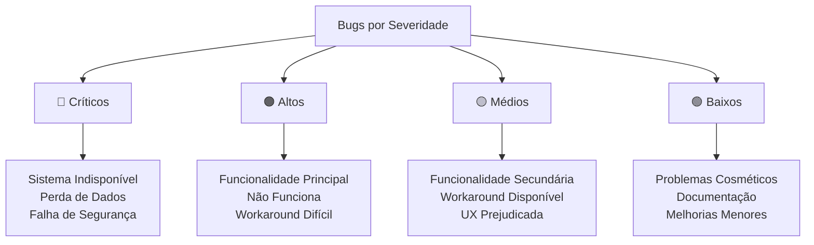

### 🔴 Bugs Críticos

#### BUG-047: Falha na Sincronização de Dados

**Status**: 📋 Backlog
**Severidade**: Crítica
**Ambiente**: Produção
**Reportado por**: Suporte Técnico
**Data**: 10/10/2025
**SLA**: 4 horas

**Descrição**: Sincronização entre banco principal e cache Redis falha intermitentemente, causando inconsistência de dados.

**Passos para Reproduzir**:

1. Executar operação de alta carga (>1000 requests/min)
2. Observar logs de sincronização
3. Verificar inconsistências no Redis vs PostgreSQL

**Comportamento Esperado**: Dados sempre sincronizados
**Comportamento Atual**: Falha de sincronização em 5% dos casos
**Impacto**: Dados incorretos exibidos para usuários
**Workaround**: Restart manual do serviço de sincronização

### 🟠 Bugs de Alta Prioridade

#### BUG-048: Performance Degradada em Relatórios

**Status**: 🔍 Refinamento
**Severidade**: Alta
**Ambiente**: Produção
**Reportado por**: Cliente Enterprise

**Descrição**: Relatórios com >10k registros demoram mais de 30s para gerar
**Impacto**: Timeout em 20% dos relatórios grandes
**SLA**: 24 horas

### 🟡 Bugs de Média Prioridade

#### BUG-049: Filtros não Persistem na Navegação

**Status**: 📋 Backlog
**Severidade**: Média
**Estimativa**: 3 pontos

**Descrição**: Filtros aplicados no dashboard são perdidos ao navegar entre páginas
**Impacto**: UX prejudicada, usuários precisam reaplicar filtros

---

## 🔧 Backlog de Melhorias Técnicas

### Categorização de Débito Técnico

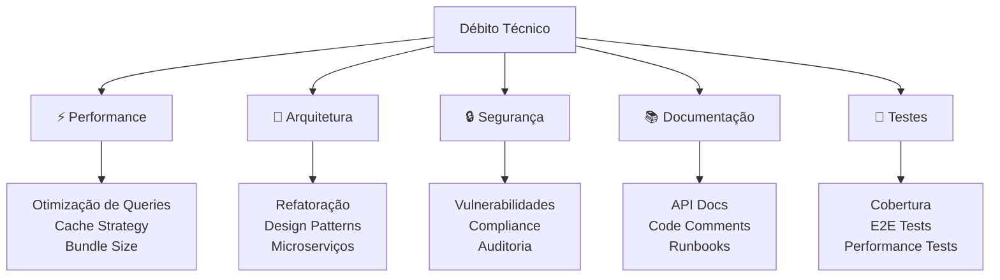

### ⚡ Performance

#### PERF-014: Implementar CDN para Assets

**Status**: 📏 Estimado
**Estimativa**: 8 pontos
**Impacto Esperado**: 50% redução no tempo de carregamento
**ROI**: Alto

**Problema Atual**: Assets estáticos servidos diretamente do servidor, causando lentidão
**Solução Proposta**: Implementar CloudFlare CDN com cache inteligente
**Métricas**: Time to First Byte < 200ms, Lighthouse Score > 90

#### PERF-015: Otimização de Bundle JavaScript

**Status**: 📋 Backlog
**Estimativa**: 13 pontos
**Impacto Esperado**: 40% redução no bundle size

**Problema Atual**: Bundle principal com 2.5MB, causando lentidão em conexões lentas
**Solução Proposta**: Code splitting, tree shaking, lazy loading
**Métricas**: Bundle < 500KB, FCP < 1.5s

### 🔧 Débito Técnico

#### TECH-016: Refatoração do Sistema de Autenticação

**Status**: 🔍 Refinamento
**Estimativa**: 21 pontos
**Prioridade**: Alta
**Prazo**: Q1 2026

**Descrição**: Sistema atual mistura autenticação e autorização, dificultando manutenção
**Justificativa**: Facilitar implementação de SSO e múltiplos providers
**Impacto se não resolvido**: Dificuldade para escalar e adicionar novos recursos de auth

#### TECH-017: Migração para Microserviços

**Status**: 🔵 Pesquisa
**Estimativa**: 89 pontos
**Prioridade**: Média
**Timeline**: Q2-Q3 2026

**Descrição**: Quebrar monolito em microserviços para melhor escalabilidade
**Justificativa**: Permitir deploy independente e escalabilidade por serviço
**Riscos**: Complexidade de deploy, latência entre serviços

### 🔒 Segurança

#### SEC-008: Implementar OWASP Security Headers

**Status**: ✅ Pronto
**Severidade**: Alta
**Compliance**: OWASP Top 10
**Prazo**: 30 dias

**Vulnerabilidade**: Headers de segurança não implementados (CSP, HSTS, etc.)
**Solução**: Configurar headers no nginx e aplicação
**Validação**: Scan de segurança automatizado

---

## 💡 Icebox - Ideias Futuras

### Matriz de Inovação

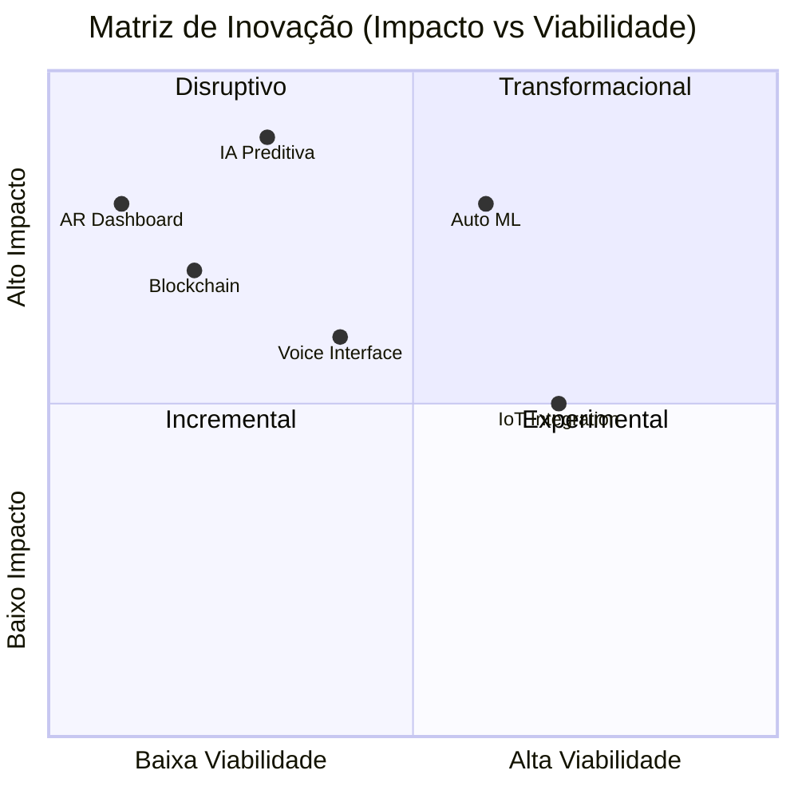

### 💡 Funcionalidades Inovadoras

#### IDEA-001: Dashboard com IA Preditiva

**Tipo**: Feature Disruptiva
**Complexidade**: Alta
**Valor Potencial**: Muito Alto
**Timeline**: 2026-2027

**Descrição**: Dashboard que usa machine learning para prever tendências e sugerir ações
**Benefício**: Transformar dados históricos em insights preditivos
**Esforço Estimado**: 144 pontos
**Tecnologias**: TensorFlow, Python ML, Time Series Analysis

#### IDEA-002: Interface por Voz

**Tipo**: Feature Experimental
**Complexidade**: Média
**Valor Potencial**: Alto
**Timeline**: 2026

**Descrição**: Controle do dashboard através de comandos de voz
**Benefício**: Acessibilidade e produtividade para usuários em movimento
**Esforço Estimado**: 55 pontos
**Tecnologias**: Web Speech API, NLP

### 🔬 Pesquisa e Desenvolvimento

#### R&D-001: Viabilidade de Blockchain para Auditoria

**Status**: 🔵 Pesquisa
**Prazo para Decisão**: 31/12/2025
**Budget**: R$ 50.000

**Objetivo**: Avaliar uso de blockchain para trilha de auditoria imutável
**Hipótese**: Blockchain pode aumentar confiança em relatórios financeiros
**Critérios de Sucesso**:

- Prova de conceito funcional
- Análise de custo-benefício
- Avaliação de performance

#### R&D-002: Auto ML para Insights Automáticos

**Status**: 🔵 Pesquisa
**Prazo para Decisão**: 28/02/2026
**Budget**: R$ 80.000

**Objetivo**: Implementar AutoML para gerar insights automáticos dos dados
**Hipótese**: IA pode identificar padrões que humanos não percebem
**Critérios de Sucesso**:

- Precisão > 85% em predições
- Insights acionáveis gerados automaticamente
- Interface intuitiva para usuários não-técnicos

---

## ✅ Critérios de Definição de Pronto (DoD)

### Checklist de Desenvolvimento

#### Código e Arquitetura

- [ ] **Código implementado** seguindo padrões da equipe (ESLint, Prettier)
- [ ] **Code review aprovado** por pelo menos um desenvolvedor sênior
- [ ] **Arquitetura validada** pelo Tech Lead
- [ ] **Performance verificada** (< 2s response time para APIs críticas)
- [ ] **Segurança validada** (OWASP checklist aplicado)

#### Testes e Qualidade (Obrigatório)

**🎯 Feature (Item Individual)**:
- [ ] **Testes unitários** escritos e passando (**cobertura mínima 85%**)
- [ ] **Testes unitários** cobrem todos os critérios de aceitação
- [ ] **Testes unitários** incluem casos de sucesso e falha

**📚 Epic (Conjunto de Features)**:
- [ ] **Testes de integração** implementados (**cobertura mínima 85%**)
- [ ] **Testes de integração** validam comunicação entre módulos
- [ ] **Testes de integração** cobrem fluxos principais do epic

**🏃 Sprint (Conjunto de Epics/Features)**:
- [ ] **Testes E2E** implementados (**cobertura mínima 85%**)
- [ ] **Testes E2E** cobrem jornadas completas do usuário
- [ ] **Testes E2E** validam integração frontend + backend
- [ ] **Testes E2E** executam em ambiente staging

**Outros Testes**:
- [ ] **Testes de performance** realizados para funcionalidades críticas
- [ ] **Testes de segurança** executados (SAST/DAST)

#### Documentação (Obrigatório)

**🎯 Feature (Obrigatório para CADA feature)**:
- [ ] **Documentação da feature** criada (template-feature-documentation.md)
- [ ] **Critérios de aceitação** documentados
- [ ] **Exemplos de uso** incluídos
- [ ] **Screenshots/GIFs** da feature (se UI)

**Documentação Técnica**:
- [ ] **Documentação técnica** atualizada (README, API docs)
- [ ] **Docstrings/JSDoc** em todas as funções públicas
- [ ] **Changelog** atualizado com mudanças
- [ ] **Runbooks** atualizados para operações
- [ ] **Guias de troubleshooting** atualizados

#### Deploy e Monitoramento

- [ ] **Deploy em staging** realizado e validado
- [ ] **Testes de aceitação** aprovados pelo Product Owner
- [ ] **Plano de rollback** definido e testado
- [ ] **Monitoramento e alertas** configurados
- [ ] **Feature flags** configuradas (se aplicável)
- [ ] **Métricas de negócio** configuradas

#### Controle de Versão (Obrigatório)

**🎯 Feature (Obrigatório para CADA feature)**:
- [ ] **Código commitado no GitHub** com mensagem descritiva
- [ ] **Commit segue Conventional Commits** (feat:, fix:, docs:, etc.)
- [ ] **Branch criada** seguindo padrão (feature/FEAT-XXX-descricao)
- [ ] **Pull Request criado** com descrição completa
- [ ] **PR aprovado** por pelo menos 1 revisor
- [ ] **Merge realizado** após aprovação

#### Compliance e Acessibilidade

- [ ] **Acessibilidade validada** (WCAG 2.1 AA)
- [ ] **Compatibilidade testada** em browsers/dispositivos suportados
- [ ] **LGPD compliance** verificado para dados pessoais
- [ ] **Análise de impacto** de performance realizada
- [ ] **Backup e recovery** testados (se aplicável)

---

## 🔄 Processo de Gestão do Backlog

### Cerimônias Ágeis

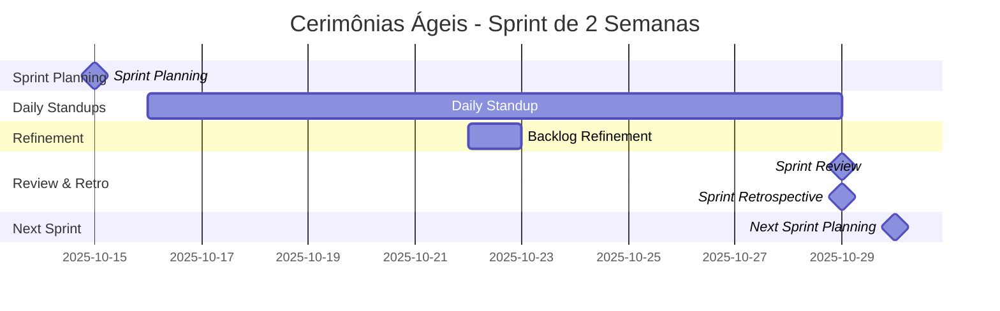

### Refinamento do Backlog

**Frequência**: Semanal (Quartas-feiras)
**Duração**: 2 horas
**Participantes**: Product Owner, Scrum Master, Tech Lead, Desenvolvedores Sênior

**Atividades**:

- Revisão e repriorização de itens baseada em feedback
- Detalhamento de histórias para próximas 2-3 sprints
- Estimativas de esforço usando Planning Poker
- Identificação de dependências e riscos
- Remoção de itens obsoletos ou duplicados
- Validação de critérios de aceitação

### Critérios de Priorização

#### Framework RICE

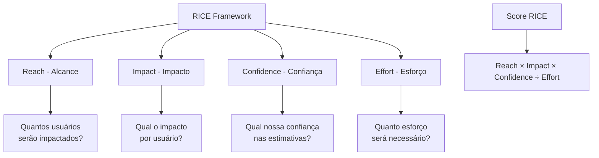

#### Matriz de Priorização (Valor vs Esforço)

| Valor \ Esforço | **Baixo (1-3 pts)** | **Médio (5-8 pts)** | **Alto (13+ pts)** |
|---|---|---|---|
| **Alto (ROI > 300%)** | 🔴 Crítica | 🟠 Alta | 🟡 Média |
| **Médio (ROI 100-300%)** | 🟠 Alta | 🟡 Média | 🟢 Baixa |
| **Baixo (ROI < 100%)** | 🟡 Média | 🟢 Baixa | ⚪ Icebox |

#### Fatores de Priorização

1. **Valor de Negócio** (peso: 40%)
   - Impacto na receita (0-10)
   - Satisfação do cliente (0-10)
   - Vantagem competitiva (0-10)

2. **Urgência** (peso: 25%)
   - Prazo regulatório (0-10)
   - Dependências críticas (0-10)
   - Janela de oportunidade (0-10)

3. **Esforço** (peso: 20%)
   - Complexidade técnica (0-10)
   - Recursos necessários (0-10)
   - Tempo estimado (0-10)

4. **Risco** (peso: 15%)
   - Incertezas técnicas (0-10)
   - Dependências externas (0-10)
   - Impacto em sistemas existentes (0-10)

### Templates de História

#### Template de User Story

```markdown
**Como** [tipo de usuário]
**Eu quero** [objetivo/funcionalidade]
**Para que** [benefício/valor]

**Critérios de Aceitação:**
- [ ] [Critério 1 - específico e testável]
- [ ] [Critério 2 - específico e testável]
- [ ] [Critério 3 - específico e testável]

**Definição de Pronto:**
- [ ] Todos os critérios de aceitação atendidos
- [ ] Testes automatizados implementados
- [ ] Code review aprovado
- [ ] Deploy em staging validado
```

#### Template para Bugs

```markdown
**Ambiente**: [Produção/Homologação/Desenvolvimento]
**Severidade**: [Crítica/Alta/Média/Baixa]
**Frequência**: [Sempre/Frequente/Ocasional/Rara]
**Browser/Device**: [Informações do ambiente]

**Descrição**: [O que está acontecendo de forma clara e objetiva]

**Passos para Reproduzir**:
1. [Passo 1 detalhado]
2. [Passo 2 detalhado]
3. [Passo 3 detalhado]

**Resultado Esperado**: [O que deveria acontecer]
**Resultado Atual**: [O que está acontecendo]
**Impacto**: [Impacto no negócio/usuário com dados quantitativos]
**Workaround**: [Solução temporária, se houver]

**Evidências**:
- Screenshots/Videos: [Links]
- Logs de erro: [Trechos relevantes]
- Network traces: [Se aplicável]
```

---

## 📊 Métricas e KPIs

### Dashboard de Métricas

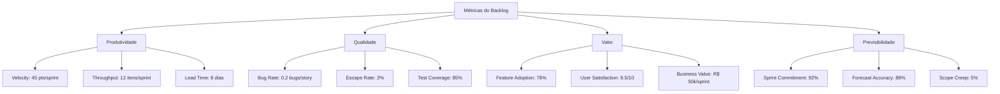

### Métricas de Backlog

| Métrica | Valor Atual | Meta | Tendência |
|---------|-------------|------|-----------|
| **Tamanho do Backlog** | 156 itens | < 200 | ↗️ |
| **Velocity Média** | 45 pontos/sprint | 40-50 | ↗️ |
| **Lead Time Médio** | 8 dias | < 10 dias | ↘️ |
| **Cycle Time Médio** | 5 dias | < 7 dias | ↘️ |
| **Taxa de Entrega** | 92% | > 85% | ↗️ |
| **Itens Refinados** | 3 sprints | 2-3 sprints | ✅ |

### Métricas de Qualidade

| Métrica | Valor Atual | Meta | Status |
|---------|-------------|------|--------|
| **Bug Rate** | 0.2 bugs/story | < 0.3 | 🟢 |
| **Escape Rate** | 2% | < 5% | 🟢 |
| **Tempo de Resolução** | 2.5 dias | < 3 dias | 🟢 |
| **Cobertura de Testes** | 85% | > 80% | 🟢 |
| **Code Review Time** | 4 horas | < 8 horas | 🟢 |
| **Hotfixes** | 1/sprint | < 2/sprint | 🟢 |

### Métricas de Valor

| Métrica | Valor Atual | Meta | Impacto |
|---------|-------------|------|---------|
| **Feature Adoption** | 78% | > 70% | Alto |
| **User Satisfaction (NPS)** | 8.5/10 | > 8.0 | Alto |
| **Time-to-Market** | 12 dias | < 15 dias | Médio |
| **ROI de Features** | 250% | > 200% | Alto |
| **Customer Retention** | 94% | > 90% | Alto |
| **Revenue per Feature** | R$ 25k | > R$ 20k | Alto |

### Análise de Tendências

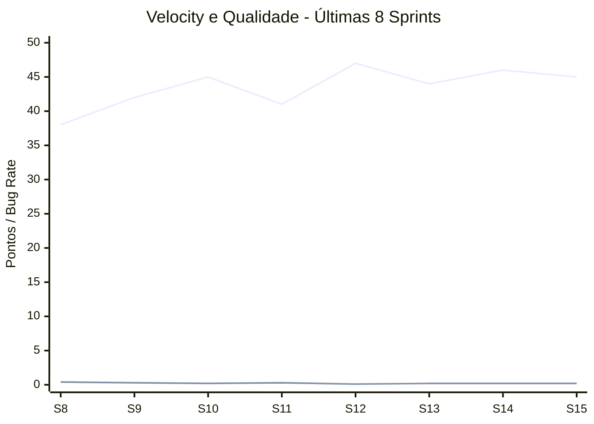

---

## 🗓️ Roadmap de Alto Nível

### Visão Trimestral

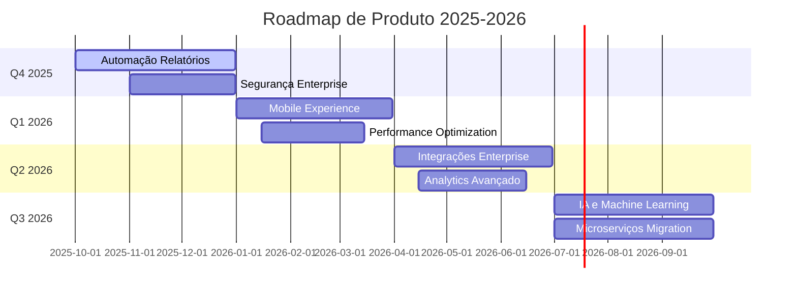

### Q4 2025 - Foco: Automação e Segurança

**Objetivos**:

- Reduzir trabalho manual em 80% através de automação
- Implementar segurança enterprise (SSO, auditoria, compliance)
- Melhorar performance geral do sistema

**Épicos Principais**:

- ✅ Automação de Relatórios (34 pts)
- 🔄 Segurança Enterprise (55 pts)
- 📋 Otimização de Performance (21 pts)

**Métricas de Sucesso**:

- Tempo de geração de relatórios: < 30s
- Compliance LGPD: 100%
- Performance score: > 90

### Q1 2026 - Foco: Mobile e Performance

**Objetivos**:

- Lançar experiência mobile completa
- Otimizar performance para escala enterprise
- Implementar monitoramento avançado

**Épicos Principais**:

- 📋 Mobile Experience (55 pts)
- 📋 Performance Enterprise (34 pts)
- 📋 Observabilidade (21 pts)

### Q2 2026 - Foco: Integrações e Analytics

**Objetivos**:

- Conectar com principais ferramentas do mercado
- Implementar analytics avançado com IA
- Expandir capacidades de API

**Épicos Principais**:

- 📋 Integrações Enterprise (42 pts)
- 📋 Analytics com IA (89 pts)
- 📋 API Pública v2 (34 pts)

### Q3 2026 - Foco: IA e Arquitetura

**Objetivos**:

- Implementar IA preditiva e insights automáticos
- Migrar para arquitetura de microserviços
- Preparar para escala global

**Épicos Principais**:

- 📋 IA Preditiva (144 pts)
- 📋 Microserviços (89 pts)
- 📋 Globalização (55 pts)

---

## 🔗 Referências

### Metodologias e Frameworks

- **[Scrum Guide](https://scrumguides.org/)**: Guia oficial do Scrum
- **[Product Backlog Management](https://www.scrum.org/resources/blog/product-backlog-management-explained)**: Gestão de backlog
- **[User Story Mapping](https://www.jpattonassociates.com/user-story-mapping/)**: Técnica de mapeamento
- **[RICE Framework](https://www.intercom.com/blog/rice-simple-prioritization-for-product-managers/)**: Framework de priorização

### Ferramentas de Gestão

| Ferramenta | Propósito | Link | Categoria |
|------------|-----------|------|----------|
| **Jira** | Gestão de backlog | [atlassian.com/software/jira](https://atlassian.com/software/jira) | Backlog |
| **Azure DevOps** | ALM completo | [azure.microsoft.com/services/devops](https://azure.microsoft.com/services/devops) | ALM |
| **Linear** | Gestão ágil moderna | [linear.app](https://linear.app) | Backlog |
| **Notion** | Documentação colaborativa | [notion.so](https://notion.so) | Docs |
| **Miro** | Colaboração visual | [miro.com](https://miro.com) | Colaboração |
| **ProductPlan** | Roadmap visual | [productplan.com](https://productplan.com) | Roadmap |

### Livros e Recursos

- **"User Stories Applied"** - Mike Cohn: Guia completo sobre user stories
- **"Agile Estimating and Planning"** - Mike Cohn: Técnicas de estimativa
- **"The Lean Startup"** - Eric Ries: Desenvolvimento de produto lean
- **"Inspired"** - Marty Cagan: Product management moderno

### Métricas e Analytics

- **[Agile Metrics](https://www.atlassian.com/agile/project-management/metrics)**: Métricas ágeis essenciais
- **[Product Metrics](https://amplitude.com/blog/product-metrics)**: KPIs de produto
- **[DORA Metrics](https://www.devops-research.com/research.html)**: Métricas de DevOps

---

<div align="center">

**Desenvolvido por**: Equipe DATAMETRIA
**Última Atualização**: 15/10/2025
**Versão**: 2.0.0

---

## Framework completo de Product Backlog implementado! 📋🚀

</div>
