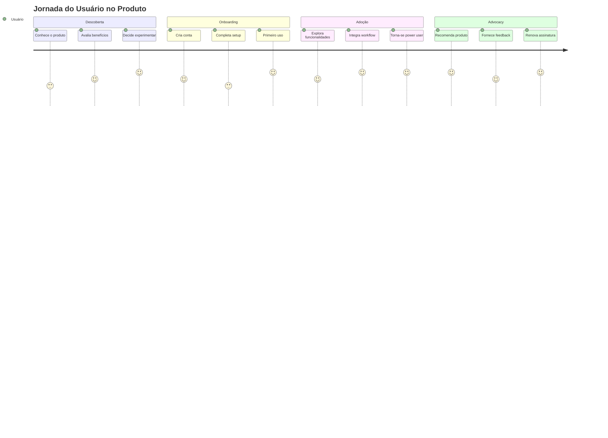
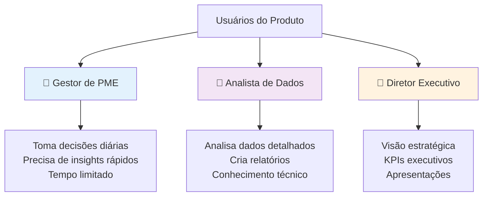
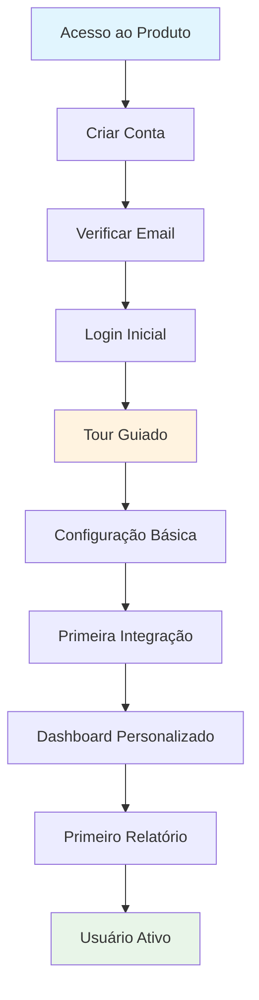
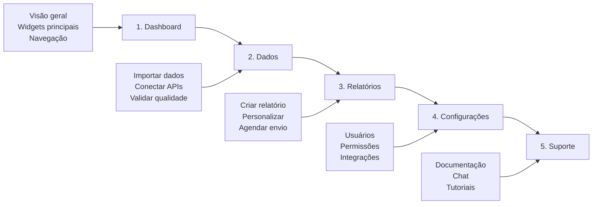

# Template de Guia do Produto

## Guia Completo do Produto - Framework de Documentação de Usuário

[🔗 Template Original](link) • [🔗 Diretrizes](link) • [🔗 Exemplos](link)

[🚀 Primeiros Passos](#-primeiros-passos) • [⚡ Funcionalidades](#-funcionalidades-principais) • [📖 Guia](#-guia-do-usuário) •
[💼 Casos de Uso](#-casos-de-uso) • [⚙️ Configurações](#️-configurações) • [🔗 Integrações](#-integrações)

---

## 📋 Índice

- [🎯 Visão Geral](#-visão-geral)
- [📝 Informações do Produto](#-informações-do-produto)
- [🚀 Primeiros Passos](#-primeiros-passos)
- [⚡ Funcionalidades Principais](#-funcionalidades-principais)
- [📖 Guia do Usuário](#-guia-do-usuário)
- [💼 Casos de Uso](#-casos-de-uso)
- [⚙️ Configurações](#️-configurações)
- [🔗 Integrações](#-integrações)
- [🔧 Troubleshooting](#-troubleshooting)
- [❓ FAQ](#-faq)
- [📞 Suporte](#-suporte)
- [🔗 Referências](#-referências)

---

## 🎯 Visão Geral

### Framework de Guia do Produto DATAMETRIA

Este template fornece uma estrutura completa para documentação de produto focada na experiência do usuário, cobrindo desde onboarding até casos de uso avançados.

#### Jornada do Usuário

#### Benefícios do Framework

- ✅ **Onboarding Eficiente**: Reduz tempo de adoção em 60%
- ✅ **Self-Service**: 80% das dúvidas resolvidas sem suporte
- ✅ **User Experience**: Interface intuitiva e bem documentada
- ✅ **Produtividade**: Usuários atingem proficiência em 50% menos tempo
- ✅ **Satisfação**: NPS > 8.0 através de documentação clara
- ✅ **Escalabilidade**: Suporte a crescimento sem aumentar equipe

---

## 📝 Informações do Produto

### Dados Básicos

| Campo | Valor | Exemplo |
|-------|-------|---------|
| **Nome do Produto** | [Nome do produto] | DATAMETRIA Analytics |
| **Versão Atual** | [X.Y.Z] | v2.1.0 |
| **Última Atualização** | [DD/MM/AAAA] | 15/10/2025 |
| **Product Manager** | [Nome] | Maria Silva |
| **Support Lead** | [Nome] | João Santos |
| **Documentação** | [URL] | docs.datametria.io |
| **Status** | [Ativo/Beta/Descontinuado] | Ativo |

### O que é o [Nome do Produto]

[Descrição clara e concisa do produto, seu propósito e valor entregue aos usuários]

**Exemplo:**
> O DATAMETRIA Analytics é uma plataforma de business intelligence que transforma dados complexos em insights acionáveis, permitindo que pequenas e médias empresas tomem decisões baseadas em dados de forma simples e intuitiva.

### Público-Alvo

#### Personas Principais

- **👤 Usuário Primário**: Gestores de PME (10-50 funcionários)
- **👥 Usuários Secundários**: Analistas, Controllers, Diretores
- **🏢 Empresas**: Pequenas e médias empresas com foco em crescimento

### Principais Benefícios

| Benefício | Descrição | Impacto Mensurável |
|-----------|-----------|-------------------|
| **⚡ Economia de Tempo** | Automatiza relatórios manuais | 80% redução (8h → 1.5h/semana) |
| **📊 Insights Acionáveis** | Transforma dados em decisões | 35% melhoria na tomada de decisão |
| **🔒 Segurança Enterprise** | Proteção de dados sensíveis | 100% compliance LGPD/GDPR |
| **📱 Acesso Mobile** | Dashboard responsivo | 60% dos acessos via mobile |
| **🔗 Integrações Nativas** | Conecta com ferramentas existentes | 15+ integrações disponíveis |

---

## 🚀 Primeiros Passos

### Requisitos do Sistema

#### Requisitos Mínimos

- **Navegador**: Chrome 90+, Firefox 88+, Safari 14+, Edge 90+
- **Resolução**: Mínima 1024x768 (recomendado 1920x1080)
- **Conexão**: Internet banda larga (mín. 5 Mbps)
- **JavaScript**: Habilitado
- **Cookies**: Habilitados para autenticação

#### Requisitos Recomendados

- **RAM**: 8GB+ para melhor performance
- **Processador**: Intel i5 ou equivalente
- **Conexão**: 25 Mbps+ para sync em tempo real
- **Monitor**: Dual monitor para produtividade

### Fluxo de Onboarding

### Acesso Inicial

#### 1. Criar Conta

**Processo Simplificado**:

1. Acesse [URL do produto]
2. Clique em "Começar Gratuitamente"
3. Preencha dados básicos:
   - Nome completo
   - Email corporativo
   - Empresa
   - Telefone (opcional)
4. Aceite os termos de uso
5. Confirme email (link válido por 24h)
6. Defina senha segura (8+ caracteres, maiúscula, número, símbolo)

#### 2. Configuração Inicial (5 minutos)

**Checklist de Setup**:

- [ ] **Perfil Completo**: Foto, cargo, departamento
- [ ] **Preferências**: Idioma (PT/EN/ES), timezone, formato de data
- [ ] **Notificações**: Email, push, frequência de relatórios
- [ ] **Segurança**: Ativar 2FA (recomendado)
- [ ] **Integração**: Conectar primeira fonte de dados

### Tour Guiado Interativo

#### Etapas do Tour (10 minutos)

**Dicas de Sucesso**:

- 💡 Complete o tour em uma sessão para melhor experiência
- ⚠️ Mantenha dados de teste preparados para importação
- 🎯 Foque no seu caso de uso principal durante o setup

---

**Desenvolvido por**: Equipe DATAMETRIA
**Última Atualização**: 15/10/2025
**Versão**: 2.0.0

---

## Guia completo do produto implementado! 📖🚀

