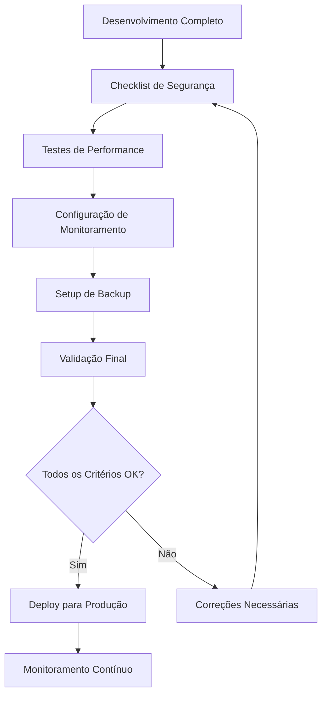
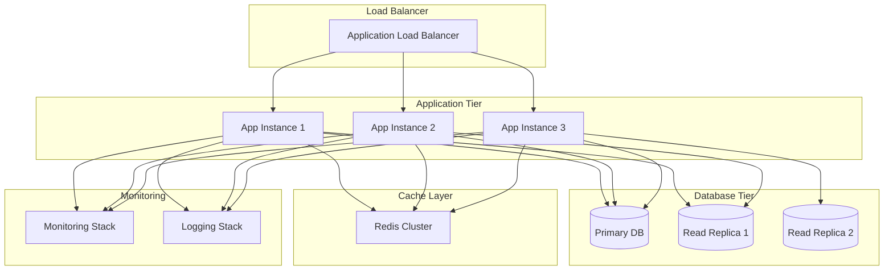
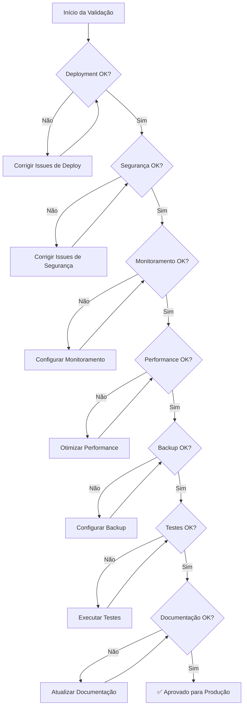

# Template de Checklist de Production Readiness

<div align="center">

## Checklist Completo para Preparação de Produção - Framework Enterprise

[](https://datametria.io)
[](https://datametria.io)
[](https://datametria.io)
[](https://datametria.io)
[](https://github.com/datametria/standards)
[](https://aws.amazon.com/q/)

[🔗 Template Original](link) • [🔗 Diretrizes](link) • [🔗 Exemplos](link)

[🚀 Deploy](#-deployment) • [🔒 Segurança](#-segurança) • [📊 Monitoramento](#-monitoramento-e-observabilidade) •
[⚡ Performance](#-performance) • [🔄 Backup](#-backup-e-disaster-recovery)

</div>

---

## 📋 Índice

- [🎯 Visão Geral](#-visão-geral)
- [📋 Informações da Aplicação](#-informações-da-aplicação)
- [🚀 Deployment](#-deployment)
- [🔒 Segurança](#-segurança)
- [📊 Monitoramento e Observabilidade](#-monitoramento-e-observabilidade)
- [⚡ Performance](#-performance)
- [🔄 Backup e Disaster Recovery](#-backup-e-disaster-recovery)
- [🧪 Testes](#-testes)
- [📚 Documentação](#-documentação)
- [✅ Checklist Final](#-checklist-final)
- [📈 Exemplos Práticos](#-exemplos-práticos)
- [🔗 Referências](#-referências)

---

## 🎯 Visão Geral

### Framework de Production Readiness

Este checklist garante que aplicações estejam prontas para produção seguindo as melhores práticas de DevOps, segurança, performance e observabilidade.

#### Fluxo de Preparação



#### Critérios de Aprovação

| Categoria | Peso | Critérios Mínimos | Status |
|-----------|------|------------------|--------|
| **🚀 Deployment** | 20% | 90% dos itens completos | ⏳ Pendente |
| **🔒 Segurança** | 25% | 100% dos itens críticos | ⏳ Pendente |
| **📊 Monitoramento** | 20% | 85% dos itens completos | ⏳ Pendente |
| **⚡ Performance** | 20% | Métricas dentro do SLA | ⏳ Pendente |
| **🔄 Backup** | 15% | 100% dos itens críticos | ⏳ Pendente |

---

## 📋 Informações da Aplicação

| Campo | Descrição | Exemplo |
|-------|-----------|---------|
| **Nome da Aplicação** | [Nome da aplicação] | Sistema de Autenticação DATAMETRIA |
| **Versão** | [Versão para produção] | v2.1.0 |
| **Responsável Técnico** | [Nome do tech lead] | João Silva |
| **DevOps Engineer** | [Nome do DevOps] | Maria Santos |
| **Security Engineer** | [Nome do Security] | Pedro Costa |
| **Data de Deploy** | [DD/MM/AAAA] | 15/10/2025 |
| **Ambiente** | [Production/Staging] | Production |
| **Criticidade** | [Baixa/Média/Alta/Crítica] | Alta |
| **SLA Target** | [Uptime esperado] | 99.9% |
| **RTO** | [Recovery Time Objective] | 15 minutos |
| **RPO** | [Recovery Point Objective] | 5 minutos |

### Arquitetura da Aplicação



---

## 🚀 Deployment

### Infraestrutura

#### Provisionamento

- [ ] **Ambiente provisionado**: Infraestrutura de produção provisionada via IaC
- [ ] **DNS configurado**: Domínio e subdomínios configurados com TTL baixo
- [ ] **SSL/TLS**: Certificados SSL válidos e auto-renováveis
- [ ] **Load balancer**: Load balancer configurado com health checks
- [ ] **CDN**: CDN configurado para assets estáticos e APIs
- [ ] **Firewall**: Regras de firewall configuradas (whitelist approach)
- [ ] **VPC/Network**: Rede isolada e segura configurada

#### Exemplo de Configuração Terraform

```hcl
# Exemplo de infraestrutura production-ready
resource "aws_lb" "main" {
  name               = "production-alb"
  internal           = false
  load_balancer_type = "application"
  security_groups    = [aws_security_group.alb.id]
  subnets           = aws_subnet.public[*].id

  enable_deletion_protection = true

  tags = {
    Environment = "production"
    Project     = "datametria-app"
  }
}

resource "aws_lb_target_group" "app" {
  name     = "app-tg"
  port     = 80
  protocol = "HTTP"
  vpc_id   = aws_vpc.main.id

  health_check {
    enabled             = true
    healthy_threshold   = 2
    interval            = 30
    matcher             = "200"
    path                = "/health"
    port                = "traffic-port"
    protocol            = "HTTP"
    timeout             = 5
    unhealthy_threshold = 2
  }
}
```

### Containerização

#### Docker Configuration

- [ ] **Docker images**: Imagens otimizadas e escaneadas por vulnerabilidades
- [ ] **Registry**: Imagens publicadas em registry seguro (ECR/Harbor)
- [ ] **Multi-stage builds**: Builds otimizados implementados
- [ ] **Health checks**: Health checks configurados nos containers
- [ ] **Resource limits**: Limites de CPU/memória definidos
- [ ] **Security context**: Contexto de segurança configurado (non-root)
- [ ] **Image scanning**: Scan automático de vulnerabilidades

#### Dockerfile Production-Ready

```dockerfile
# Multi-stage build otimizado
FROM node:18-alpine AS builder
WORKDIR /app

# Instalar dependências
COPY package*.json ./
RUN npm ci --only=production && npm cache clean --force

# Build da aplicação
COPY . .
RUN npm run build

# Runtime stage
FROM node:18-alpine AS runtime

# Criar usuário não-root
RUN addgroup -g 1001 -S nodejs && \
    adduser -S nextjs -u 1001

# Instalar dumb-init para signal handling
RUN apk add --no-cache dumb-init

WORKDIR /app

# Copiar apenas o necessário
COPY --from=builder --chown=nextjs:nodejs /app/dist ./dist
COPY --from=builder --chown=nextjs:nodejs /app/node_modules ./node_modules
COPY --chown=nextjs:nodejs package.json ./

# Configurar usuário
USER nextjs

# Expor porta
EXPOSE 3000

# Health check
HEALTHCHECK --interval=30s --timeout=3s --start-period=5s --retries=3 \
  CMD curl -f http://localhost:3000/health || exit 1

# Usar dumb-init como PID 1
ENTRYPOINT ["dumb-init", "--"]
CMD ["node", "dist/server.js"]
```

### Kubernetes/Orchestration

#### Manifests

- [ ] **Deployment manifests**: Manifests validados e testados
- [ ] **Services**: Services configurados adequadamente
- [ ] **Ingress**: Ingress configurado com SSL e rate limiting
- [ ] **ConfigMaps**: Configurações externalizadas
- [ ] **Secrets**: Secrets gerenciados via Vault/AWS Secrets Manager
- [ ] **RBAC**: Controle de acesso configurado (least privilege)
- [ ] **Network policies**: Políticas de rede implementadas
- [ ] **Pod Security Standards**: PSS configurados (restricted)

#### Exemplo de Deployment Kubernetes

```yaml
apiVersion: apps/v1
kind: Deployment
metadata:
  name: datametria-app
  namespace: production
spec:
  replicas: 3
  strategy:
    type: RollingUpdate
    rollingUpdate:
      maxSurge: 1
      maxUnavailable: 0
  selector:
    matchLabels:
      app: datametria-app
  template:
    metadata:
      labels:
        app: datametria-app
    spec:
      securityContext:
        runAsNonRoot: true
        runAsUser: 1001
        fsGroup: 1001
      containers:
      - name: app
        image: datametria/app:v2.1.0
        ports:
        - containerPort: 3000
        resources:
          requests:
            memory: "256Mi"
            cpu: "250m"
          limits:
            memory: "512Mi"
            cpu: "500m"
        livenessProbe:
          httpGet:
            path: /health
            port: 3000
          initialDelaySeconds: 30
          periodSeconds: 10
        readinessProbe:
          httpGet:
            path: /ready
            port: 3000
          initialDelaySeconds: 5
          periodSeconds: 5
        env:
        - name: NODE_ENV
          value: "production"
        - name: DB_PASSWORD
          valueFrom:
            secretKeyRef:
              name: db-secret
              key: password
```

### CI/CD Pipeline

#### Pipeline Configuration

- [ ] **Automated testing**: Testes automatizados no pipeline (unit, integration, e2e)
- [ ] **Security scanning**: Scan de segurança automatizado (SAST, DAST, SCA)
- [ ] **Quality gates**: Gates de qualidade configurados (coverage, complexity)
- [ ] **Deployment strategy**: Estratégia de deploy definida (blue-green, canary)
- [ ] **Rollback capability**: Capacidade de rollback automático testada
- [ ] **Environment promotion**: Promoção entre ambientes automatizada
- [ ] **Approval gates**: Gates de aprovação para produção

#### GitHub Actions Production Pipeline

```yaml
name: Production Deployment

on:
  push:
    branches: [main]
    tags: ['v*']

jobs:
  security-scan:
    runs-on: ubuntu-latest
    steps:
      - uses: actions/checkout@v4
      - name: Run Trivy vulnerability scanner
        uses: aquasecurity/trivy-action@master
        with:
          scan-type: 'fs'
          scan-ref: '.'
          format: 'sarif'
          output: 'trivy-results.sarif'

  quality-gate:
    runs-on: ubuntu-latest
    steps:
      - uses: actions/checkout@v4
      - name: SonarCloud Scan
        uses: SonarSource/sonarcloud-github-action@master
        env:
          GITHUB_TOKEN: ${{ secrets.GITHUB_TOKEN }}
          SONAR_TOKEN: ${{ secrets.SONAR_TOKEN }}

  deploy-production:
    needs: [security-scan, quality-gate]
    runs-on: ubuntu-latest
    environment: production
    steps:
      - name: Deploy to Production
        run: |
          # Blue-Green Deployment
          kubectl apply -f k8s/production/
          kubectl rollout status deployment/datametria-app -n production
```

---

## 🔒 Segurança

### Authentication & Authorization

#### Identity Management

- [ ] **Authentication**: Sistema de autenticação robusto (OAuth2/OIDC)
- [ ] **Authorization**: Controle de acesso baseado em roles (RBAC)
- [ ] **Session management**: Gerenciamento de sessão seguro (JWT com refresh)
- [ ] **Password policies**: Políticas de senha implementadas (NIST guidelines)
- [ ] **2FA/MFA**: Autenticação multifator obrigatória para admins
- [ ] **API security**: APIs protegidas com rate limiting e authentication
- [ ] **Token management**: Tokens com expiração e rotação automática

#### Exemplo de Configuração OAuth2

```python
# Configuração OAuth2 com Flask
from flask_oauthlib.provider import OAuth2Provider

oauth = OAuth2Provider()

@oauth.clientgetter
def load_client(client_id):
    return Client.query.filter_by(client_id=client_id).first()

@oauth.grantgetter
def load_grant(client_id, code):
    return Grant.query.filter_by(client_id=client_id, code=code).first()

@oauth.tokengetter
def load_token(access_token=None, refresh_token=None):
    if access_token:
        return Token.query.filter_by(access_token=access_token).first()
    elif refresh_token:
        return Token.query.filter_by(refresh_token=refresh_token).first()

@app.route('/oauth/authorize', methods=['GET', 'POST'])
@oauth.authorize_handler
def authorize(*args, **kwargs):
    if request.method == 'GET':
        return render_template('authorize.html')
    confirm = request.form.get('confirm', 'no')
    return confirm == 'yes'
```

### Data Protection

#### Encryption & Privacy

- [ ] **Encryption at rest**: Dados criptografados em repouso (AES-256)
- [ ] **Encryption in transit**: Comunicação criptografada (TLS 1.3)
- [ ] **Key management**: Chaves gerenciadas via HSM/KMS
- [ ] **PII protection**: Dados pessoais protegidos e classificados
- [ ] **Data masking**: Dados sensíveis mascarados em logs e não-prod
- [ ] **Secure deletion**: Exclusão segura implementada (crypto-shredding)
- [ ] **Data classification**: Dados classificados por sensibilidade

#### Exemplo de Criptografia

```python
# Exemplo de criptografia de dados sensíveis
from cryptography.fernet import Fernet
import os

class DataEncryption:
    def __init__(self):
        # Usar KMS em produção
        self.key = os.environ.get('ENCRYPTION_KEY', Fernet.generate_key())
        self.cipher_suite = Fernet(self.key)

    def encrypt_pii(self, data: str) -> str:
        """Criptografar dados PII"""
        return self.cipher_suite.encrypt(data.encode()).decode()

    def decrypt_pii(self, encrypted_data: str) -> str:
        """Descriptografar dados PII"""
        return self.cipher_suite.decrypt(encrypted_data.encode()).decode()

    def hash_sensitive_data(self, data: str) -> str:
        """Hash para dados que não precisam ser recuperados"""
        import hashlib
        return hashlib.sha256(data.encode()).hexdigest()
```

### Network Security

#### Security Configuration

- [ ] **HTTPS only**: Toda comunicação via HTTPS com HSTS
- [ ] **Security headers**: Headers de segurança configurados
- [ ] **CORS**: CORS configurado adequadamente (whitelist)
- [ ] **Rate limiting**: Rate limiting implementado por IP/usuário
- [ ] **DDoS protection**: Proteção contra DDoS (CloudFlare/AWS Shield)
- [ ] **WAF**: Web Application Firewall configurado
- [ ] **IP whitelisting**: Whitelist para endpoints administrativos

#### Nginx Security Configuration

```nginx
# Configuração de segurança Nginx production-ready
server {
    listen 443 ssl http2;
    server_name api.datametria.io;

    # SSL Configuration
    ssl_certificate /etc/ssl/certs/datametria.crt;
    ssl_certificate_key /etc/ssl/private/datametria.key;
    ssl_protocols TLSv1.2 TLSv1.3;
    ssl_ciphers ECDHE-RSA-AES256-GCM-SHA512:DHE-RSA-AES256-GCM-SHA512:ECDHE-RSA-AES256-GCM-SHA384;
    ssl_prefer_server_ciphers off;

    # Security Headers
    add_header Strict-Transport-Security "max-age=63072000; includeSubDomains; preload" always;
    add_header X-Content-Type-Options nosniff always;
    add_header X-Frame-Options DENY always;
    add_header X-XSS-Protection "1; mode=block" always;
    add_header Referrer-Policy "strict-origin-when-cross-origin" always;
    add_header Content-Security-Policy "default-src 'self'; script-src 'self' 'unsafe-inline'; style-src 'self' 'unsafe-inline'" always;

    # Rate Limiting
    limit_req_zone $binary_remote_addr zone=api:10m rate=10r/s;
    limit_req_zone $binary_remote_addr zone=login:10m rate=1r/s;

    location /api/ {
        limit_req zone=api burst=20 nodelay;
        proxy_pass http://backend;
        proxy_set_header Host $host;
        proxy_set_header X-Real-IP $remote_addr;
        proxy_set_header X-Forwarded-For $proxy_add_x_forwarded_for;
        proxy_set_header X-Forwarded-Proto $scheme;
    }

    location /auth/login {
        limit_req zone=login burst=5 nodelay;
        proxy_pass http://backend;
    }
}
```

### Compliance

#### Regulatory Compliance

- [ ] **LGPD/GDPR**: Compliance com regulamentações de privacidade
- [ ] **Data retention**: Políticas de retenção implementadas
- [ ] **Audit logging**: Logs de auditoria configurados e imutáveis
- [ ] **Privacy policy**: Política de privacidade atualizada
- [ ] **Terms of service**: Termos de serviço atualizados
- [ ] **Data processing agreements**: DPAs assinados com fornecedores
- [ ] **Breach notification**: Processo de notificação de violação

---

## 📊 Monitoramento e Observabilidade

### Application Monitoring

#### Observability Stack

- [ ] **Health checks**: Endpoints de health check implementados (/health, /ready)
- [ ] **Metrics collection**: Métricas de aplicação coletadas (Prometheus)
- [ ] **Performance monitoring**: APM implementado (New Relic/Datadog)
- [ ] **Error tracking**: Rastreamento de erros (Sentry/Rollbar)
- [ ] **User analytics**: Analytics de usuário configurados
- [ ] **Business metrics**: Métricas de negócio monitoradas
- [ ] **Distributed tracing**: Tracing distribuído implementado

#### Exemplo de Health Checks

```python
# Health checks robustos
from flask import Flask, jsonify
import psutil
import redis
import psycopg2

app = Flask(__name__)

@app.route('/health')
def health_check():
    """Health check básico"""
    return jsonify({
        'status': 'healthy',
        'timestamp': datetime.utcnow().isoformat(),
        'version': os.environ.get('APP_VERSION', 'unknown')
    }), 200

@app.route('/ready')
def readiness_check():
    """Readiness check com dependências"""
    checks = {
        'database': check_database(),
        'redis': check_redis(),
        'disk_space': check_disk_space(),
        'memory': check_memory()
    }

    all_healthy = all(checks.values())
    status_code = 200 if all_healthy else 503

    return jsonify({
        'status': 'ready' if all_healthy else 'not_ready',
        'checks': checks,
        'timestamp': datetime.utcnow().isoformat()
    }), status_code

def check_database():
    try:
        conn = psycopg2.connect(DATABASE_URL)
        cursor = conn.cursor()
        cursor.execute('SELECT 1')
        cursor.close()
        conn.close()
        return True
    except:
        return False

def check_redis():
    try:
        r = redis.Redis.from_url(REDIS_URL)
        r.ping()
        return True
    except:
        return False

def check_disk_space():
    disk_usage = psutil.disk_usage('/')
    free_percent = (disk_usage.free / disk_usage.total) * 100
    return free_percent > 10  # Pelo menos 10% livre

def check_memory():
    memory = psutil.virtual_memory()
    return memory.percent < 90  # Menos de 90% de uso
```

### Infrastructure Monitoring

#### System Monitoring

- [ ] **Server monitoring**: Monitoramento de servidores (CPU, RAM, Disk)
- [ ] **Container monitoring**: Monitoramento de containers (cAdvisor)
- [ ] **Network monitoring**: Monitoramento de rede (latência, throughput)
- [ ] **Database monitoring**: Monitoramento de banco de dados
- [ ] **Storage monitoring**: Monitoramento de armazenamento
- [ ] **Resource utilization**: Utilização de recursos monitorada
- [ ] **Capacity planning**: Alertas de capacidade configurados

#### Prometheus Configuration

```yaml
# prometheus.yml
global:
  scrape_interval: 15s
  evaluation_interval: 15s

rule_files:
  - "alert_rules.yml"

scrape_configs:
  - job_name: 'datametria-app'
    static_configs:
      - targets: ['app:3000']
    metrics_path: /metrics
    scrape_interval: 10s

  - job_name: 'node-exporter'
    static_configs:
      - targets: ['node-exporter:9100']

  - job_name: 'postgres-exporter'
    static_configs:
      - targets: ['postgres-exporter:9187']

alerting:
  alertmanagers:
    - static_configs:
        - targets:
          - alertmanager:9093
```

### Logging

#### Centralized Logging

- [ ] **Centralized logging**: Logs centralizados (ELK/Loki)
- [ ] **Structured logging**: Logs estruturados (JSON)
- [ ] **Log levels**: Níveis de log apropriados
- [ ] **Log retention**: Política de retenção de logs (30-90 dias)
- [ ] **Log security**: Logs protegidos e sem dados sensíveis
- [ ] **Log analysis**: Análise de logs automatizada
- [ ] **Correlation IDs**: IDs de correlação para tracing

#### Structured Logging Implementation

```python
# Logging estruturado enterprise
import logging
import json
import uuid
from datetime import datetime
from flask import request, g

class JSONFormatter(logging.Formatter):
    def format(self, record):
        log_entry = {
            'timestamp': datetime.utcnow().isoformat() + 'Z',
            'level': record.levelname,
            'service': 'datametria-app',
            'message': record.getMessage(),
            'module': record.module,
            'function': record.funcName,
            'line': record.lineno,
            'thread': record.thread,
            'process': record.process
        }

        # Adicionar contexto da requisição se disponível
        if hasattr(g, 'request_id'):
            log_entry['request_id'] = g.request_id

        if hasattr(g, 'user_id'):
            log_entry['user_id'] = g.user_id

        # Adicionar informações da requisição HTTP
        if request:
            log_entry['http'] = {
                'method': request.method,
                'url': request.url,
                'user_agent': request.headers.get('User-Agent'),
                'remote_addr': request.remote_addr
            }

        # Adicionar stack trace para erros
        if record.exc_info:
            log_entry['exception'] = self.formatException(record.exc_info)

        return json.dumps(log_entry, ensure_ascii=False)

# Configurar logging
def setup_logging():
    logger = logging.getLogger()
    logger.setLevel(logging.INFO)

    handler = logging.StreamHandler()
    handler.setFormatter(JSONFormatter())
    logger.addHandler(handler)

# Middleware para request ID
@app.before_request
def before_request():
    g.request_id = str(uuid.uuid4())
    g.start_time = datetime.utcnow()

@app.after_request
def after_request(response):
    duration = (datetime.utcnow() - g.start_time).total_seconds()

    logger.info("Request completed", extra={
        'http_status': response.status_code,
        'duration_seconds': duration,
        'response_size': len(response.get_data())
    })

    return response
```

### Alerting

#### Alert Configuration

- [ ] **Critical alerts**: Alertas para problemas críticos (< 1 min)
- [ ] **Performance alerts**: Alertas de performance (SLA breach)
- [ ] **Error rate alerts**: Alertas de taxa de erro (> 1%)
- [ ] **Capacity alerts**: Alertas de capacidade (> 80%)
- [ ] **Security alerts**: Alertas de segurança (tentativas de invasão)
- [ ] **Business alerts**: Alertas de métricas de negócio
- [ ] **Escalation procedures**: Procedimentos de escalação definidos

#### Alertmanager Configuration

```yaml
# alertmanager.yml
global:
  smtp_smarthost: 'smtp.gmail.com:587'
  smtp_from: 'alerts@datametria.io'

route:
  group_by: ['alertname']
  group_wait: 10s
  group_interval: 10s
  repeat_interval: 1h
  receiver: 'web.hook'
  routes:
  - match:
      severity: critical
    receiver: 'critical-alerts'
  - match:
      severity: warning
    receiver: 'warning-alerts'

receivers:
- name: 'web.hook'
  webhook_configs:
  - url: 'http://slack-webhook/alerts'

- name: 'critical-alerts'
  email_configs:
  - to: 'oncall@datametria.io'
    subject: 'CRITICAL: {{ .GroupLabels.alertname }}'
    body: |
      {{ range .Alerts }}
      Alert: {{ .Annotations.summary }}
      Description: {{ .Annotations.description }}
      {{ end }}
  slack_configs:
  - api_url: 'https://hooks.slack.com/services/...'
    channel: '#critical-alerts'
    title: 'Critical Alert'
    text: '{{ range .Alerts }}{{ .Annotations.summary }}{{ end }}'

- name: 'warning-alerts'
  slack_configs:
  - api_url: 'https://hooks.slack.com/services/...'
    channel: '#alerts'
    title: 'Warning Alert'
```

---

## ⚡ Performance

### Application Performance

#### Performance Metrics

- [ ] **Response times**: Tempos de resposta < 200ms (P95)
- [ ] **Throughput**: Taxa de transferência > 1000 RPS
- [ ] **Concurrency**: Suporte a 10k+ usuários simultâneos
- [ ] **Memory usage**: Uso de memória < 80%
- [ ] **CPU usage**: Uso de CPU < 70%
- [ ] **Caching**: Estratégia de cache implementada (Redis/Memcached)
- [ ] **CDN**: CDN configurado para assets estáticos

#### Performance Optimization

```python
# Exemplo de otimizações de performance
from flask import Flask, request, jsonify
from flask_caching import Cache
from functools import wraps
import time

app = Flask(__name__)
cache = Cache(app, config={'CACHE_TYPE': 'redis'})

def rate_limit(max_requests=100, window=60):
    """Rate limiting decorator"""
    def decorator(f):
        @wraps(f)
        def decorated_function(*args, **kwargs):
            key = f"rate_limit:{request.remote_addr}:{f.__name__}"
            current = cache.get(key) or 0

            if current >= max_requests:
                return jsonify({'error': 'Rate limit exceeded'}), 429

            cache.set(key, current + 1, timeout=window)
            return f(*args, **kwargs)
        return decorated_function
    return decorator

@app.route('/api/users')
@cache.cached(timeout=300)  # Cache por 5 minutos
@rate_limit(max_requests=1000, window=60)
def get_users():
    # Implementação otimizada
    return jsonify(users)

# Connection pooling para banco de dados
from sqlalchemy import create_engine
from sqlalchemy.pool import QueuePool

engine = create_engine(
    DATABASE_URL,
    poolclass=QueuePool,
    pool_size=20,
    max_overflow=30,
    pool_pre_ping=True,
    pool_recycle=3600
)
```

### Database Performance

#### Database Optimization

- [ ] **Query optimization**: Queries otimizadas com EXPLAIN ANALYZE
- [ ] **Indexing**: Índices apropriados criados e monitorados
- [ ] **Connection pooling**: Pool de conexões configurado
- [ ] **Read replicas**: Réplicas de leitura configuradas
- [ ] **Database monitoring**: Monitoramento de performance (slow queries)
- [ ] **Backup performance**: Performance de backup testada
- [ ] **Partitioning**: Particionamento implementado para tabelas grandes

#### Database Configuration

```sql
-- Configurações PostgreSQL para produção
-- postgresql.conf

# Memory settings
shared_buffers = 256MB
effective_cache_size = 1GB
work_mem = 4MB
maintenance_work_mem = 64MB

# Checkpoint settings
checkpoint_completion_target = 0.9
wal_buffers = 16MB
default_statistics_target = 100

# Connection settings
max_connections = 200

# Logging
log_min_duration_statement = 1000  # Log queries > 1s
log_checkpoints = on
log_connections = on
log_disconnections = on
log_lock_waits = on

# Índices recomendados
CREATE INDEX CONCURRENTLY idx_users_email ON users(email);
CREATE INDEX CONCURRENTLY idx_orders_user_id ON orders(user_id);
CREATE INDEX CONCURRENTLY idx_orders_created_at ON orders(created_at);

-- Particionamento por data
CREATE TABLE orders_2025 PARTITION OF orders
FOR VALUES FROM ('2025-01-01') TO ('2026-01-01');
```

### Load Testing

#### Performance Testing

- [ ] **Load testing**: Testes de carga realizados (JMeter/k6)
- [ ] **Stress testing**: Testes de stress realizados
- [ ] **Capacity planning**: Planejamento de capacidade feito
- [ ] **Performance baselines**: Baselines estabelecidos
- [ ] **Scalability testing**: Testes de escalabilidade
- [ ] **Performance budgets**: Orçamentos de performance definidos

#### k6 Load Testing Script

```javascript
// load-test.js
import http from 'k6/http';
import { check, sleep } from 'k6';
import { Rate } from 'k6/metrics';

export let errorRate = new Rate('errors');

export let options = {
  stages: [
    { duration: '2m', target: 100 }, // Ramp up
    { duration: '5m', target: 100 }, // Stay at 100 users
    { duration: '2m', target: 200 }, // Ramp up to 200
    { duration: '5m', target: 200 }, // Stay at 200
    { duration: '2m', target: 0 },   // Ramp down
  ],
  thresholds: {
    http_req_duration: ['p(95)<500'], // 95% das requests < 500ms
    http_req_failed: ['rate<0.01'],   // Taxa de erro < 1%
    errors: ['rate<0.01'],
  },
};

export default function() {
  // Test login endpoint
  let loginResponse = http.post('https://api.datametria.io/auth/login', {
    email: 'test@example.com',
    password: 'password123'
  });

  let loginSuccess = check(loginResponse, {
    'login status is 200': (r) => r.status === 200,
    'login response time < 500ms': (r) => r.timings.duration < 500,
  });

  errorRate.add(!loginSuccess);

  if (loginSuccess) {
    let token = loginResponse.json('token');

    // Test authenticated endpoint
    let params = {
      headers: { 'Authorization': `Bearer ${token}` },
    };

    let apiResponse = http.get('https://api.datametria.io/api/users', params);

    let apiSuccess = check(apiResponse, {
      'api status is 200': (r) => r.status === 200,
      'api response time < 200ms': (r) => r.timings.duration < 200,
    });

    errorRate.add(!apiSuccess);
  }

  sleep(1);
}
```

---

## 🔄 Backup e Disaster Recovery

### Backup Strategy

#### Backup Configuration

- [ ] **Automated backups**: Backups automatizados configurados
- [ ] **Backup frequency**: Frequência adequada definida (diário/contínuo)
- [ ] **Backup retention**: Política de retenção implementada (30-90 dias)
- [ ] **Backup encryption**: Backups criptografados em trânsito e repouso
- [ ] **Cross-region backups**: Backups em múltiplas regiões
- [ ] **Backup testing**: Testes de restore regulares
- [ ] **Backup monitoring**: Monitoramento de sucesso/falha

#### Backup Script Example

```bash
#!/bin/bash
# backup-database.sh

set -euo pipefail

# Configurações
DB_HOST="${DB_HOST:-localhost}"
DB_NAME="${DB_NAME:-datametria}"
DB_USER="${DB_USER:-postgres}"
BACKUP_DIR="/backups"
S3_BUCKET="datametria-backups"
RETENTION_DAYS=30

# Criar diretório de backup
mkdir -p "$BACKUP_DIR"

# Nome do arquivo com timestamp
TIMESTAMP=$(date +%Y%m%d_%H%M%S)
BACKUP_FILE="$BACKUP_DIR/${DB_NAME}_${TIMESTAMP}.sql.gz"

# Realizar backup
echo "Iniciando backup do banco $DB_NAME..."
pg_dump -h "$DB_HOST" -U "$DB_USER" -d "$DB_NAME" \
  --no-password --verbose --format=custom \
  | gzip > "$BACKUP_FILE"

# Verificar se o backup foi criado
if [[ ! -f "$BACKUP_FILE" ]]; then
  echo "Erro: Backup não foi criado"
  exit 1
fi

# Upload para S3
echo "Enviando backup para S3..."
aws s3 cp "$BACKUP_FILE" "s3://$S3_BUCKET/database/" \
  --server-side-encryption AES256

# Verificar upload
if aws s3 ls "s3://$S3_BUCKET/database/$(basename "$BACKUP_FILE")" > /dev/null; then
  echo "Backup enviado com sucesso para S3"
  rm "$BACKUP_FILE"  # Remover arquivo local
else
  echo "Erro: Falha no upload para S3"
  exit 1
fi

# Limpeza de backups antigos
echo "Removendo backups antigos..."
aws s3 ls "s3://$S3_BUCKET/database/" --recursive \
  | awk '$1 <= "'$(date -d "$RETENTION_DAYS days ago" +%Y-%m-%d)'" {print $4}' \
  | xargs -I {} aws s3 rm "s3://$S3_BUCKET/{}"

echo "Backup concluído com sucesso"

# Enviar notificação
curl -X POST "$SLACK_WEBHOOK" \
  -H 'Content-type: application/json' \
  --data "{\"text\":\"✅ Backup do banco $DB_NAME concluído com sucesso\"}"
```

### Disaster Recovery

#### DR Planning

- [ ] **RTO defined**: Recovery Time Objective definido (< 15 min)
- [ ] **RPO defined**: Recovery Point Objective definido (< 5 min)
- [ ] **DR procedures**: Procedimentos de DR documentados
- [ ] **DR testing**: Testes de DR realizados regularmente
- [ ] **Failover automation**: Failover automatizado configurado
- [ ] **Data replication**: Replicação de dados em tempo real
- [ ] **Communication plan**: Plano de comunicação durante incidentes

#### DR Runbook

```yaml
# disaster-recovery-runbook.yml
disaster_recovery:
  rto: "15 minutes"
  rpo: "5 minutes"

  procedures:
    database_failure:
      steps:
        1: "Verificar status do banco primário"
        2: "Promover replica para primário"
        3: "Atualizar DNS para novo endpoint"
        4: "Verificar integridade dos dados"
        5: "Notificar stakeholders"

      commands:
        promote_replica: |
          aws rds promote-read-replica \
            --db-instance-identifier datametria-replica-1

        update_dns: |
          aws route53 change-resource-record-sets \
            --hosted-zone-id Z123456789 \
            --change-batch file://dns-change.json

    application_failure:
      steps:
        1: "Verificar health checks"
        2: "Analisar logs de erro"
        3: "Executar rollback se necessário"
        4: "Escalar horizontalmente se needed"
        5: "Investigar causa raiz"

      rollback_command: |
        kubectl rollout undo deployment/datametria-app -n production

  contacts:
    primary_oncall: "+55 11 99999-9999"
    secondary_oncall: "+55 11 88888-8888"
    incident_channel: "#incidents"
```

---

## 🧪 Testes

### Test Coverage

#### Testing Strategy

- [ ] **Unit tests**: Cobertura de testes unitários > 80%
- [ ] **Integration tests**: Testes de integração implementados
- [ ] **End-to-end tests**: Testes E2E para fluxos críticos
- [ ] **Performance tests**: Testes de performance automatizados
- [ ] **Security tests**: Testes de segurança (SAST/DAST)
- [ ] **Smoke tests**: Testes de smoke pós-deploy
- [ ] **Contract tests**: Testes de contrato para APIs

#### Test Automation

```python
# test_production_readiness.py
import pytest
import requests
import psycopg2
import redis
from unittest.mock import patch

class TestProductionReadiness:

    @pytest.fixture
    def app_url(self):
        return "https://api.datametria.io"

    def test_health_endpoint(self, app_url):
        """Teste do endpoint de health"""
        response = requests.get(f"{app_url}/health")
        assert response.status_code == 200
        assert response.json()["status"] == "healthy"

    def test_readiness_endpoint(self, app_url):
        """Teste do endpoint de readiness"""
        response = requests.get(f"{app_url}/ready")
        assert response.status_code == 200
        data = response.json()
        assert data["status"] == "ready"
        assert all(data["checks"].values())

    def test_database_connection(self):
        """Teste de conexão com banco"""
        conn = psycopg2.connect(DATABASE_URL)
        cursor = conn.cursor()
        cursor.execute("SELECT 1")
        result = cursor.fetchone()
        assert result[0] == 1
        cursor.close()
        conn.close()

    def test_redis_connection(self):
        """Teste de conexão com Redis"""
        r = redis.Redis.from_url(REDIS_URL)
        assert r.ping() is True

    def test_ssl_certificate(self, app_url):
        """Teste de certificado SSL"""
        response = requests.get(app_url)
        assert response.url.startswith("https://")

    def test_security_headers(self, app_url):
        """Teste de headers de segurança"""
        response = requests.get(app_url)
        headers = response.headers

        assert "Strict-Transport-Security" in headers
        assert "X-Content-Type-Options" in headers
        assert "X-Frame-Options" in headers
        assert "X-XSS-Protection" in headers

    def test_rate_limiting(self, app_url):
        """Teste de rate limiting"""
        # Fazer muitas requisições rapidamente
        responses = []
        for _ in range(150):
            resp = requests.get(f"{app_url}/api/test")
            responses.append(resp.status_code)

        # Deve haver pelo menos uma resposta 429 (Too Many Requests)
        assert 429 in responses

    @pytest.mark.performance
    def test_response_time(self, app_url):
        """Teste de tempo de resposta"""
        response = requests.get(f"{app_url}/api/users")
        assert response.elapsed.total_seconds() < 0.5  # < 500ms

    def test_backup_exists(self):
        """Verificar se backup recente existe"""
        import boto3
        from datetime import datetime, timedelta

        s3 = boto3.client('s3')
        yesterday = datetime.now() - timedelta(days=1)

        objects = s3.list_objects_v2(
            Bucket='datametria-backups',
            Prefix='database/'
        )

        recent_backups = [
            obj for obj in objects.get('Contents', [])
            if obj['LastModified'].replace(tzinfo=None) > yesterday
        ]

        assert len(recent_backups) > 0, "Nenhum backup recente encontrado"
```

---

## 📚 Documentação

### Documentation Requirements

#### Technical Documentation

- [ ] **API documentation**: Documentação de API atualizada (OpenAPI/Swagger)
- [ ] **Architecture documentation**: Documentação de arquitetura
- [ ] **Deployment guide**: Guia de deployment atualizado
- [ ] **Troubleshooting guide**: Guia de troubleshooting
- [ ] **Runbooks**: Runbooks para operações comuns
- [ ] **Security documentation**: Documentação de segurança
- [ ] **Monitoring documentation**: Documentação de monitoramento

#### Operational Documentation

- [ ] **Incident response**: Procedimentos de resposta a incidentes
- [ ] **Escalation procedures**: Procedimentos de escalação
- [ ] **Contact information**: Informações de contato atualizadas
- [ ] **SLA documentation**: Documentação de SLAs
- [ ] **Change management**: Processo de gestão de mudanças
- [ ] **Capacity planning**: Documentação de planejamento de capacidade

---

## ✅ Checklist Final

### Pre-Production Validation



### Final Approval

| Categoria | Status | Responsável | Data | Observações |
|-----------|--------|-------------|------|-------------|
| **🚀 Deployment** | ⏳ Pendente | DevOps Engineer | - | - |
| **🔒 Segurança** | ⏳ Pendente | Security Engineer | - | - |
| **📊 Monitoramento** | ⏳ Pendente | SRE | - | - |
| **⚡ Performance** | ⏳ Pendente | Tech Lead | - | - |
| **🔄 Backup** | ⏳ Pendente | DBA | - | - |
| **🧪 Testes** | ⏳ Pendente | QA Engineer | - | - |
| **📚 Documentação** | ⏳ Pendente | Tech Writer | - | - |

### Sign-off

- [ ] **Tech Lead**: _________________________ Data: _________
- [ ] **DevOps Engineer**: __________________ Data: _________
- [ ] **Security Engineer**: ________________ Data: _________
- [ ] **Product Owner**: ____________________ Data: _________

---

## 📈 Exemplos Práticos

### Exemplo Completo: API REST

#### Configuração de Produção

```yaml
# docker-compose.production.yml
version: '3.8'

services:
  app:
    image: datametria/api:v2.1.0
    deploy:
      replicas: 3
      resources:
        limits:
          cpus: '0.5'
          memory: 512M
        reservations:
          cpus: '0.25'
          memory: 256M
    environment:
      - NODE_ENV=production
      - DATABASE_URL=${DATABASE_URL}
      - REDIS_URL=${REDIS_URL}
    healthcheck:
      test: ["CMD", "curl", "-f", "http://localhost:3000/health"]
      interval: 30s
      timeout: 10s
      retries: 3
    logging:
      driver: "json-file"
      options:
        max-size: "10m"
        max-file: "3"

  nginx:
    image: nginx:alpine
    ports:
      - "443:443"
      - "80:80"
    volumes:
      - ./nginx.conf:/etc/nginx/nginx.conf
      - ./ssl:/etc/ssl
    depends_on:
      - app

  prometheus:
    image: prom/prometheus
    ports:
      - "9090:9090"
    volumes:
      - ./prometheus.yml:/etc/prometheus/prometheus.yml

  grafana:
    image: grafana/grafana
    ports:
      - "3001:3000"
    environment:
      - GF_SECURITY_ADMIN_PASSWORD=${GRAFANA_PASSWORD}
```

### Métricas de Sucesso

| Métrica | Target | Atual | Status |
|---------|--------|-------|--------|
| **Uptime** | 99.9% | - | ⏳ |
| **Response Time (P95)** | < 200ms | - | ⏳ |
| **Error Rate** | < 0.1% | - | ⏳ |
| **Throughput** | > 1000 RPS | - | ⏳ |
| **MTTR** | < 15 min | - | ⏳ |
| **Security Score** | A+ | - | ⏳ |

---

## 🔗 Referências

### Documentação Oficial

- **[AWS Well-Architected Framework](https://aws.amazon.com/architecture/well-architected/)**: Framework de arquitetura AWS
- **[Google SRE Book](https://sre.google/sre-book/table-of-contents/)**: Livro de SRE do Google
- **[OWASP Top 10](https://owasp.org/www-project-top-ten/)**: Top 10 vulnerabilidades de segurança
- **[12 Factor App](https://12factor.net/)**: Metodologia para aplicações SaaS

### Ferramentas e Recursos

| Categoria | Ferramenta | Descrição | Link |
|-----------|------------|-----------|------|
| **Monitoring** | Prometheus | Sistema de monitoramento | [prometheus.io](https://prometheus.io) |
| **Logging** | ELK Stack | Elasticsearch, Logstash, Kibana | [elastic.co](https://elastic.co) |
| **Security** | OWASP ZAP | Security testing | [zaproxy.org](https://zaproxy.org) |
| **Performance** | k6 | Load testing | [k6.io](https://k6.io) |
| **Container** | Docker | Containerização | [docker.com](https://docker.com) |
| **Orchestration** | Kubernetes | Orquestração de containers | [kubernetes.io](https://kubernetes.io) |

### Compliance e Standards

- **ISO 27001**: Padrão de segurança da informação
- **SOC 2**: Controles de segurança e disponibilidade
- **LGPD/GDPR**: Regulamentações de privacidade de dados
- **PCI DSS**: Padrão de segurança para dados de cartão

---

<div align="center">

**Desenvolvido por**: Equipe DATAMETRIA
**Última Atualização**: 15/10/2025
**Versão**: 2.0.0

---

## Checklist de Production Readiness implementado! 🚀

</div>
