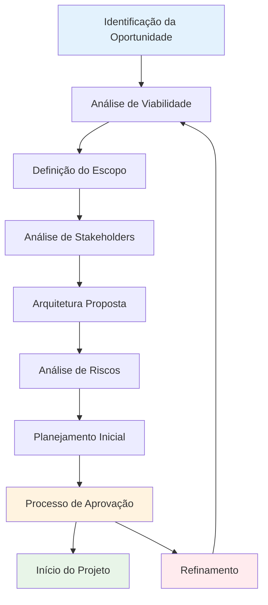
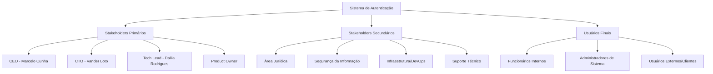
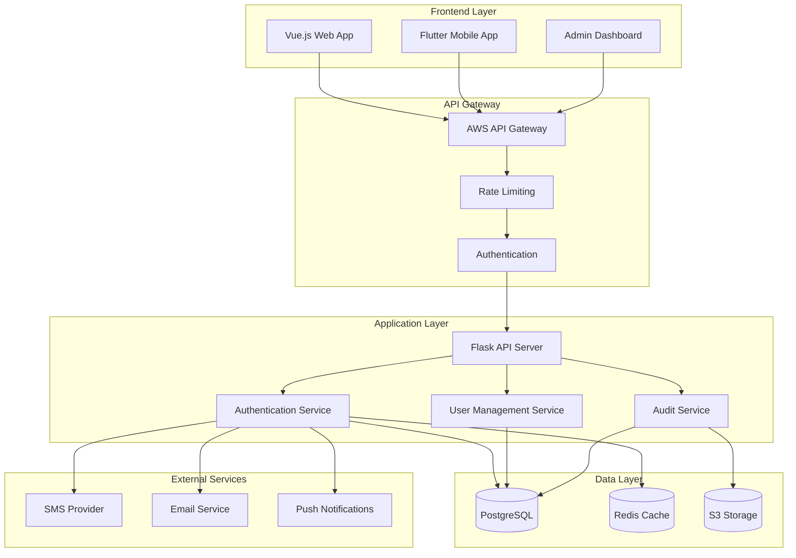
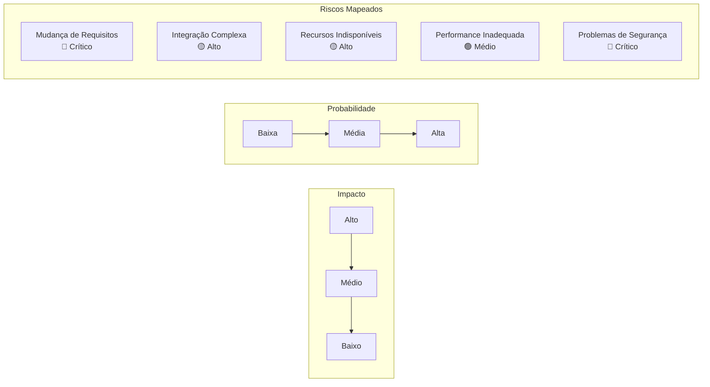
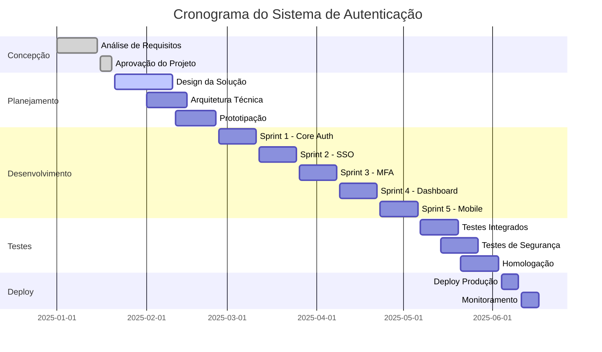
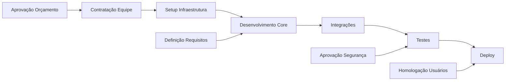
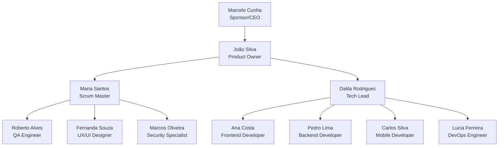
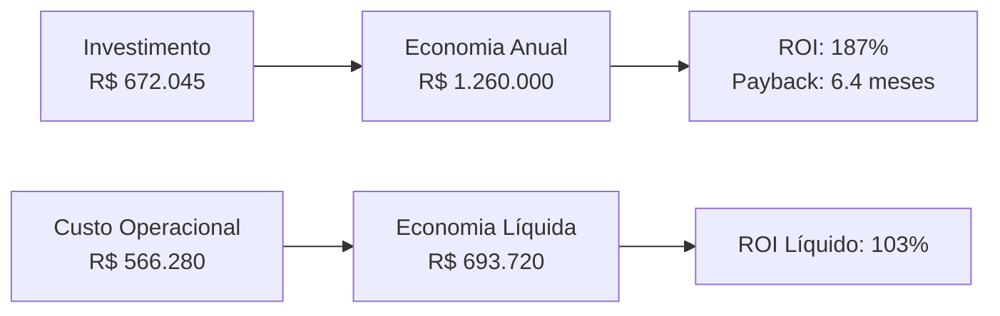

# Template de Concepção de Projeto

<div align="center">

## Documento de Concepção e Planejamento Inicial - Framework Enterprise

[](https://datametria.io)
[](https://datametria.io)
[](https://datametria.io)
[](https://github.com/datametria/standards)
[](https://aws.amazon.com/q/)

[🔗 Template Original](link) • [🔗 Diretrizes](link) • [🔗 Exemplos](link)

[🎯 Visão](#-visão-do-projeto) • [📋 Escopo](#-escopo-e-objetivos) • [🏗️ Arquitetura](#️-arquitetura-proposta) •
[📅 Cronograma](#-cronograma-e-marcos) • [👥 Equipe](#-equipe-e-recursos)

</div>

---

## 📋 Índice

- [🎯 Visão Geral](#-visão-geral)
- [📋 Informações Básicas](#-informações-básicas)
- [🎯 Visão do Projeto](#-visão-do-projeto)
- [📋 Escopo e Objetivos](#-escopo-e-objetivos)
- [👥 Stakeholders e Usuários](#-stakeholders-e-usuários)
- [🏗️ Arquitetura Proposta](#️-arquitetura-proposta)
- [📊 Análise de Riscos](#-análise-de-riscos)
- [📅 Cronograma e Marcos](#-cronograma-e-marcos)
- [👥 Equipe e Recursos](#-equipe-e-recursos)
- [💰 Análise Financeira](#-análise-financeira)
- [📈 Exemplos Práticos](#-exemplos-práticos)
- [🔗 Referências](#-referências)

---

## 🎯 Visão Geral

### Framework de Concepção de Projetos

Este template fornece uma estrutura completa para documentar a concepção inicial de projetos, seguindo as melhores práticas de gestão de projetos e alinhamento estratégico.

#### Fluxo de Concepção



---

## 📋 Informações Básicas

| Campo | Valor | Exemplo |
|-------|-------|---------|
| **Nome do Projeto** | [Nome do Projeto] | Sistema de Autenticação DATAMETRIA |
| **Código do Projeto** | [PROJ-YYYY-NNN] | PROJ-2025-001 |
| **Sponsor** | [Nome do Sponsor] | Marcelo Cunha (CEO) |
| **Product Owner** | [Nome do PO] | João Silva |
| **Tech Lead** | [Nome do Tech Lead] | Dalila Rodrigues |
| **Data de Concepção** | [DD/MM/AAAA] | 15/01/2025 |
| **Prazo Estimado** | [DD/MM/AAAA] | 15/06/2025 |
| **Orçamento Estimado** | [R$ XXX.XXX,XX] | R$ 250.000,00 |
| **Prioridade** | [Alta/Média/Baixa] | Alta |
| **Categoria** | [Web/Mobile/Cloud/AI] | Web + Mobile |
| **Complexidade** | [Baixa/Média/Alta] | Média |

---

## 🎯 Visão do Projeto

### Problema a Resolver

#### Contexto

[Descreva o contexto atual e o problema que o projeto pretende resolver]

**Exemplo**: A empresa atualmente utiliza múltiplos sistemas de autenticação desconectados, causando problemas de segurança e experiência do usuário fragmentada.

#### Dor Identificada

[Explique a dor específica dos usuários/negócio que será solucionada]

**Exemplo**:

- Usuários precisam lembrar múltiplas senhas
- Administradores gastam 40% do tempo gerenciando acessos
- Riscos de segurança por senhas fracas
- Falta de auditoria centralizada

#### Impacto Atual

[Quantifique o impacto do problema atual - custos, tempo, eficiência]

**Exemplo**:

- **Custo**: R$ 50.000/mês em suporte a senhas
- **Tempo**: 2 horas/dia por usuário em logins
- **Segurança**: 15 incidentes/mês relacionados a acesso
- **Produtividade**: 20% de redução por problemas de acesso

### Solução Proposta

#### Visão Geral

[Descreva a solução em alto nível - o que será construído]

**Exemplo**: Sistema unificado de autenticação com Single Sign-On (SSO), autenticação multifator (MFA) e gestão centralizada de identidades.

#### Valor Agregado

[Explique o valor que a solução trará para o negócio/usuários]

**Exemplo**:

- **Usuários**: Login único para todos os sistemas
- **Administradores**: Gestão centralizada e automatizada
- **Empresa**: Redução de custos e aumento de segurança
- **Compliance**: Auditoria completa e rastreabilidade

#### Diferencial Competitivo

[Se aplicável, descreva como a solução se diferencia da concorrência]

**Exemplo**: Integração nativa com sistemas DATAMETRIA, customização completa e suporte a biometria avançada.

### Justificativa do Projeto

#### ROI Esperado

- **Investimento**: R$ 250.000
- **Economia Anual**: R$ 600.000
- **Payback**: 5 meses
- **ROI %**: 240%

#### Benefícios Quantitativos

- **Redução de Custos**: R$ 50.000/mês em suporte
- **Aumento de Produtividade**: 20% de ganho
- **Redução de Incidentes**: 90% menos problemas de acesso
- **Economia de Tempo**: 2 horas/dia por usuário

#### Benefícios Qualitativos

- Melhoria significativa na experiência do usuário
- Aumento da segurança e compliance
- Redução de riscos operacionais
- Padronização de processos

---

## 📋 Escopo e Objetivos

### Objetivos SMART

| Objetivo | Descrição | Meta | Prazo |
|----------|------------|------|-------|
| **Reduzir Tempo de Login** | Implementar SSO em todos os sistemas | Redução de 80% no tempo | 3 meses |
| **Aumentar Segurança** | Implementar MFA obrigatório | 100% dos usuários com MFA | 2 meses |
| **Centralizar Gestão** | Dashboard único de administração | 100% dos acessos gerenciados | 4 meses |

### Escopo do Projeto

#### ✅ Dentro do Escopo

- **Autenticação Unificada**: SSO para todos os sistemas internos
- **Autenticação Multifator**: SMS, email, app authenticator
- **Dashboard Administrativo**: Gestão de usuários e permissões
- **API de Integração**: Para sistemas terceiros
- **Auditoria e Logs**: Rastreamento completo de acessos
- **Mobile App**: Aplicativo para autenticação móvel
- **Migração de Dados**: Importação de usuários existentes

#### ❌ Fora do Escopo

- Integração com sistemas externos de terceiros
- Autenticação biométrica avançada (impressão digital, facial)
- Funcionalidades de gestão de documentos
- Integração com Active Directory corporativo (fase futura)

#### 🔄 Escopo Futuro (Roadmap)

- **Fase 2**: Biometria avançada e integração AD
- **Fase 3**: IA para detecção de anomalias
- **Fase 4**: Blockchain para identidade descentralizada

### Critérios de Sucesso

| Critério | Métrica | Meta | Método de Medição |
|----------|---------|------|-------------------|
| **Performance** | Tempo de login | < 2 segundos | Monitoramento APM |
| **Usabilidade** | SUS Score | > 80 pontos | Pesquisa com usuários |
| **Adoção** | % usuários ativos | > 95% | Analytics do sistema |
| **Segurança** | Incidentes de acesso | < 1/mês | Logs de segurança |
| **Disponibilidade** | Uptime | > 99.9% | Monitoramento contínuo |

---

## 👥 Stakeholders e Usuários

### Mapa de Stakeholders



### Personas dos Usuários

#### Persona 1: Funcionário Interno

- **Perfil**: Analista/Desenvolvedor, 25-40 anos
- **Objetivos**: Acessar sistemas rapidamente para trabalhar
- **Dores**: Múltiplas senhas, esquecimento frequente, tempo perdido
- **Comportamento**: Usa múltiplos dispositivos, trabalha remotamente
- **Necessidades**: Login rápido, seguro e único para todos os sistemas

#### Persona 2: Administrador de Sistema

- **Perfil**: Especialista em TI, 30-45 anos
- **Objetivos**: Gerenciar acessos de forma eficiente e segura
- **Dores**: Gestão manual, falta de visibilidade, processos demorados
- **Comportamento**: Trabalha com dashboards, precisa de relatórios
- **Necessidades**: Controle centralizado, automação, auditoria completa

#### Persona 3: Usuário Externo/Cliente

- **Perfil**: Cliente da empresa, idade variada
- **Objetivos**: Acessar serviços da empresa facilmente
- **Dores**: Cadastros complexos, senhas esquecidas
- **Comportamento**: Acesso esporádico, usa principalmente mobile
- **Necessidades**: Processo simples, recuperação fácil de senha

---

## 🏗️ Arquitetura Proposta

### Stack Tecnológico DATAMETRIA

**Tipo de Projeto**: Web + Mobile + Cloud

#### Frontend

- **Framework Web**: Vue.js 3 + TypeScript
- **Framework Mobile**: Flutter + Dart
- **UI Library**: Vue Material + Flutter Material
- **Estado**: Pinia (Vue) + Bloc (Flutter)
- **Build**: Vite + Flutter Build Tools

#### Backend

- **Framework**: Flask + Python 3.11
- **Database**: PostgreSQL 15
- **ORM**: SQLAlchemy 2.0
- **Cache**: Redis 7
- **Message Queue**: Celery + Redis

#### Infraestrutura

- **Cloud**: AWS (ECS, RDS, ElastiCache)
- **Container**: Docker + Kubernetes
- **CI/CD**: GitHub Actions
- **Monitoramento**: CloudWatch + Grafana
- **CDN**: CloudFront

### Diagrama de Arquitetura



### Integrações Necessárias

| Sistema | Tipo | Protocolo | Criticidade | Complexidade |
|---------|------|-----------|-------------|--------------|
| **Sistema ERP** | REST API | HTTPS/OAuth2 | Alta | Média |
| **Sistema CRM** | REST API | HTTPS/JWT | Alta | Baixa |
| **Email Service** | SMTP/API | HTTPS | Alta | Baixa |
| **SMS Gateway** | REST API | HTTPS | Média | Baixa |
| **Push Notifications** | FCM/APNS | HTTPS | Média | Média |
| **Monitoring** | Webhook | HTTPS | Baixa | Baixa |

---

## 📊 Análise de Riscos

### Matriz de Riscos



| Risco | Probabilidade | Impacto | Severidade | Mitigação |
|-------|---------------|---------|------------|-----------|
| **Mudança de requisitos** | Alta | Alto | 🔴 Crítico | Documentação detalhada + aprovações formais |
| **Integração complexa** | Média | Alto | 🟡 Alto | POCs antecipadas + testes de integração |
| **Recursos indisponíveis** | Baixa | Alto | 🟡 Alto | Planejamento de recursos + backup team |
| **Performance inadequada** | Média | Médio | 🟢 Médio | Testes de carga + otimização contínua |
| **Problemas de segurança** | Baixa | Alto | 🔴 Crítico | Security by design + auditorias |

### Plano de Contingência

#### Risco 1: Mudança de Requisitos

- **Trigger**: Solicitação de mudança > 20% do escopo
- **Ação**: Reunião de comitê + análise de impacto + re-aprovação
- **Responsável**: Product Owner + Sponsor
- **Prazo**: 5 dias úteis para decisão

#### Risco 2: Integração Complexa

- **Trigger**: Falha em POC de integração
- **Ação**: Revisão arquitetural + consultor especialista
- **Responsável**: Tech Lead + Arquiteto
- **Prazo**: 10 dias úteis para solução

#### Risco 3: Performance Inadequada

- **Trigger**: Testes de carga < 80% da meta
- **Ação**: Otimização de código + revisão de arquitetura
- **Responsável**: Tech Lead + Equipe de desenvolvimento
- **Prazo**: 15 dias úteis para correção

---

## 📅 Cronograma e Marcos

### Fases do Projeto



### Marcos Principais

| Marco | Data | Entregável | Critério de Aceite | Responsável |
|-------|------|------------|-------------------|-------------|
| **M1 - Concepção** | 20/01 | Documento de Concepção | Aprovação formal do sponsor | Product Owner |
| **M2 - Design** | 25/02 | Protótipos e Wireframes | Validação com 10 usuários | UX Designer |
| **M3 - MVP** | 11/04 | Core de Autenticação | Login/logout funcionando | Tech Lead |
| **M4 - Beta** | 06/06 | Sistema Completo | Todos os requisitos implementados | Scrum Master |
| **M5 - Produção** | 17/06 | Go-Live | Sistema em produção estável | DevOps |

### Dependências Críticas



---

## 👥 Equipe e Recursos

### Estrutura da Equipe



### Papéis e Responsabilidades

| Papel | Nome | Responsabilidades | Dedicação | Custo/Mês |
|-------|------|------------------|-----------|-----------|
| **Sponsor** | Marcelo Cunha | Aprovações e direcionamento estratégico | 10% | - |
| **Product Owner** | João Silva | Definição de requisitos e prioridades | 100% | R$ 15.000 |
| **Tech Lead** | Dalila Rodrigues | Arquitetura e liderança técnica | 100% | R$ 18.000 |
| **Scrum Master** | Maria Santos | Facilitação e remoção de impedimentos | 50% | R$ 7.500 |
| **Frontend Dev** | Ana Costa | Desenvolvimento Vue.js e interfaces | 100% | R$ 12.000 |
| **Backend Dev** | Pedro Lima | Desenvolvimento Flask e APIs | 100% | R$ 12.000 |
| **Mobile Dev** | Carlos Silva | Desenvolvimento Flutter | 100% | R$ 12.000 |
| **DevOps** | Lucia Ferreira | Infraestrutura e CI/CD | 75% | R$ 11.250 |
| **QA Engineer** | Roberto Alves | Testes e qualidade | 100% | R$ 10.000 |
| **UX/UI Designer** | Fernanda Souza | Design e experiência do usuário | 75% | R$ 9.000 |
| **Security** | Marcos Oliveira | Segurança e compliance | 50% | R$ 8.000 |

### Recursos Necessários

#### Infraestrutura

| Recurso | Especificação | Custo Mensal | Justificativa |
|---------|---------------|--------------|---------------|
| **AWS ECS** | 4 instâncias t3.large | R$ 2.400 | Aplicação principal |
| **RDS PostgreSQL** | db.t3.large Multi-AZ | R$ 1.800 | Banco de dados |
| **ElastiCache Redis** | cache.t3.medium | R$ 600 | Cache e sessões |
| **CloudFront CDN** | 1TB transfer | R$ 300 | Distribuição de conteúdo |
| **Route53** | Hosted zone + queries | R$ 50 | DNS |
| **Monitoring** | CloudWatch + Grafana | R$ 400 | Observabilidade |

#### Ferramentas e Licenças

| Ferramenta | Licenças | Custo Mensal | Finalidade |
|------------|----------|--------------|------------|
| **GitHub Enterprise** | 11 usuários | R$ 550 | Repositório e CI/CD |
| **Figma Professional** | 2 usuários | R$ 120 | Design |
| **Slack Business** | 11 usuários | R$ 440 | Comunicação |
| **Jira Software** | 11 usuários | R$ 330 | Gestão de projeto |
| **SonarCloud** | 1 projeto | R$ 200 | Qualidade de código |

---

## 💰 Análise Financeira

### Investimento Total

#### Desenvolvimento (5 meses)

| Categoria | Valor | Detalhamento |
|-----------|-------|--------------|
| **Recursos Humanos** | R$ 575.000 | 11 profissionais x 5 meses |
| **Infraestrutura** | R$ 27.750 | AWS + ferramentas x 5 meses |
| **Licenças e Ferramentas** | R$ 8.200 | Desenvolvimento + design |
| **Contingência (10%)** | R$ 61.095 | Reserva para imprevistos |
| **Total** | **R$ 672.045** | Investimento total do projeto |

#### Custos Operacionais (Anuais)

| Categoria | Valor Anual | Detalhamento |
|-----------|-------------|--------------|
| **Infraestrutura AWS** | R$ 66.600 | Produção + staging |
| **Licenças** | R$ 19.680 | Ferramentas operacionais |
| **Suporte (2 pessoas)** | R$ 480.000 | Manutenção e evolução |
| **Total Operacional** | **R$ 566.280** | Custo anual de operação |

### Retorno do Investimento

#### Economia Anual

| Fonte de Economia | Valor Anual | Justificativa |
|-------------------|-------------|---------------|
| **Redução Suporte** | R$ 600.000 | Eliminação de 50k/mês em suporte |
| **Ganho Produtividade** | R$ 480.000 | 2h/dia x 100 usuários x R$ 100/h |
| **Redução Incidentes** | R$ 120.000 | 90% menos problemas de acesso |
| **Economia Licenças** | R$ 60.000 | Consolidação de sistemas |
| **Total Economia** | **R$ 1.260.000** | Economia total anual |

#### Análise de ROI



| Métrica | Valor | Observação |
|---------|-------|------------|
| **Investimento Inicial** | R$ 672.045 | Desenvolvimento completo |
| **Economia Anual** | R$ 1.260.000 | Benefícios quantificados |
| **Custo Operacional** | R$ 566.280 | Manutenção anual |
| **Economia Líquida** | R$ 693.720 | Economia - operação |
| **ROI Bruto** | 187% | Economia/investimento |
| **ROI Líquido** | 103% | Líquido/investimento |
| **Payback** | 6.4 meses | Tempo para recuperar investimento |

---

## 📈 Exemplos Práticos

### Caso de Uso 1: Login Unificado

#### Cenário Atual

```
Usuário precisa acessar 5 sistemas diferentes:
1. ERP: login separado (2 min)
2. CRM: login separado (1.5 min)
3. Email: login separado (1 min)
4. Intranet: login separado (1.5 min)
5. BI: login separado (2 min)
Total: 8 minutos por sessão
```

#### Cenário Futuro

```
Usuário faz login único:
1. Sistema de Autenticação: login SSO (30 seg)
2. Acesso automático a todos os sistemas
Total: 30 segundos por sessão
Economia: 7.5 minutos (93.75%)
```

### Caso de Uso 2: Gestão de Usuários

#### Cenário Atual

```
Administrador precisa criar novo usuário:
1. Criar no ERP: 10 min
2. Criar no CRM: 8 min
3. Configurar email: 5 min
4. Configurar intranet: 7 min
5. Configurar BI: 10 min
Total: 40 minutos por usuário
```

#### Cenário Futuro

```
Administrador usa dashboard único:
1. Criar usuário central: 5 min
2. Propagação automática para todos os sistemas
Total: 5 minutos por usuário
Economia: 35 minutos (87.5%)
```

### Métricas de Sucesso Esperadas

| Métrica | Baseline | Meta | Método de Medição |
|---------|----------|------|-------------------|
| **Tempo de Login** | 8 min/sessão | 30 seg/sessão | Analytics do sistema |
| **Chamados de Suporte** | 150/mês | 15/mês | Sistema de tickets |
| **Satisfação do Usuário** | 6.2/10 | 8.5/10 | Pesquisa NPS |
| **Incidentes de Segurança** | 15/mes | 1/mes | Logs de auditoria |
| **Tempo de Onboarding** | 40 min/usuario | 5 min/usuario | Processo documentado |

---

## 🔗 Referências

### Documentação Técnica

- **[OAuth 2.0 Specification](https://oauth.net/2/)**: Padrão de autenticação
- **[OpenID Connect](https://openid.net/connect/)**: Camada de identidade
- **[SAML 2.0](https://wiki.oasis-open.org/security)**: Padrão de SSO
- **[JWT Specification](https://jwt.io/)**: JSON Web Tokens

### Frameworks e Tecnologias

| Tecnologia | Documentação | Versão | Justificativa |
|------------|--------------|--------|---------------|
| **Vue.js** | [vuejs.org](https://vuejs.org) | 3.x | Framework frontend moderno |
| **Flutter** | [flutter.dev](https://flutter.dev) | 3.x | Desenvolvimento mobile híbrido |
| **Flask** | [flask.palletsprojects.com](https://flask.palletsprojects.com) | 2.x | Framework backend Python |
| **PostgreSQL** | [postgresql.org](https://postgresql.org) | 15.x | Banco de dados relacional |
| **Redis** | [redis.io](https://redis.io) | 7.x | Cache e sessões |

### Melhores Práticas

- **[OWASP Authentication Cheat Sheet](https://cheatsheetseries.owasp.org/cheatsheets/Authentication_Cheat_Sheet.html)**
- **[NIST Digital Identity Guidelines](https://pages.nist.gov/800-63-3/)**
- **[AWS Security Best Practices](https://aws.amazon.com/architecture/security-identity-compliance/)**
- **[Google Identity Platform](https://cloud.google.com/identity-platform)**

### Compliance e Regulamentações

- **LGPD**: Lei Geral de Proteção de Dados
- **ISO 27001**: Gestão de Segurança da Informação
- **SOC 2**: Controles de Segurança e Disponibilidade
- **GDPR**: General Data Protection Regulation

---

<div align="center">

**Desenvolvido por**: Equipe DATAMETRIA
**Última Atualização**: 15/01/2025
**Versão**: 2.0.0

---

## Documento de Concepção de Projeto implementado! 🚀

</div>
