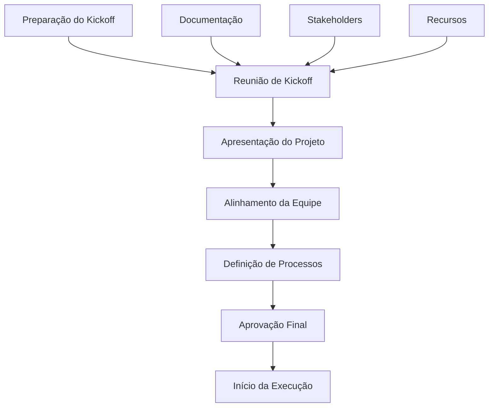
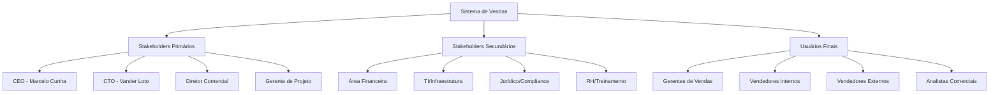
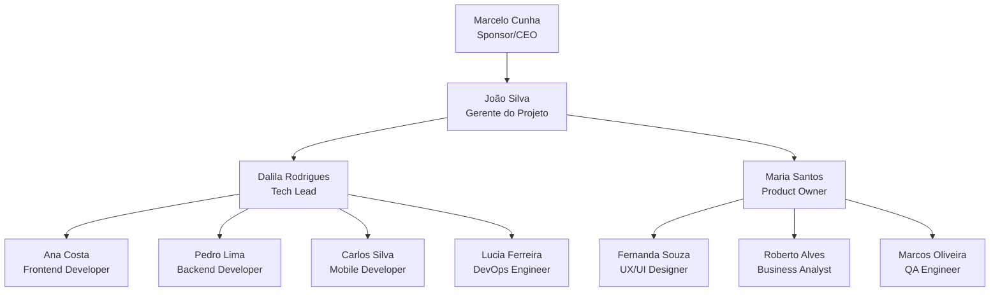
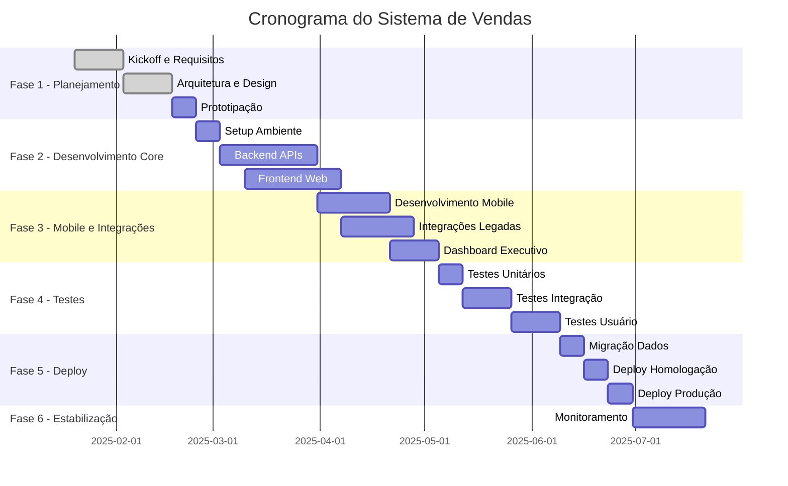
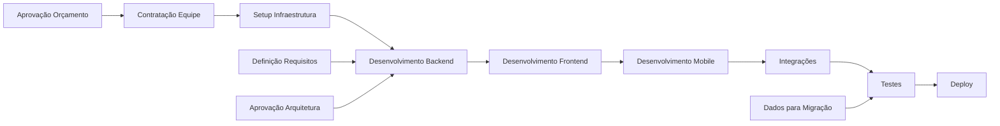
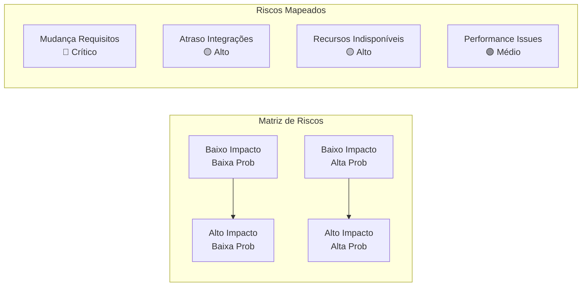
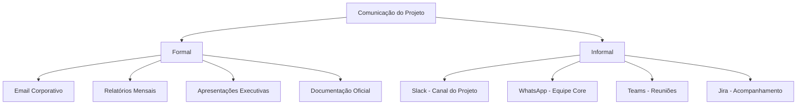
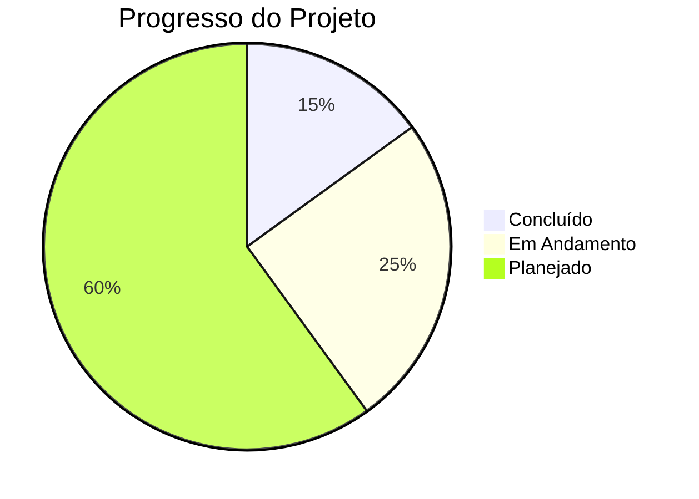

# Template de Project Kickoff

## Documento de Início de Projeto - Framework Enterprise

[🔗 Template Original](link) • [🔗 Diretrizes](link) • [🔗 Exemplos](link)

[📊 Dashboard](#-dashboard-do-projeto) • [📋 Charter](#-visão-geral-do-projeto) • [👥 Equipe](#-equipe-do-projeto) •
[📅 Cronograma](#-cronograma-e-marcos) • [💰 Orçamento](#-orçamento-e-recursos)

---

## 📋 Índice

- [🎯 Visão Geral](#-visão-geral)
- [📋 Informações do Projeto](#-informações-do-projeto)
- [🎯 Visão Geral do Projeto](#-visão-geral-do-projeto)
- [🎯 Objetivos e Escopo](#-objetivos-e-escopo)
- [👥 Stakeholders](#-stakeholders)
- [👨💻 Equipe do Projeto](#-equipe-do-projeto)
- [📅 Cronograma e Marcos](#-cronograma-e-marcos)
- [💰 Orçamento e Recursos](#-orçamento-e-recursos)
- [⚠️ Riscos e Premissas](#️-riscos-e-premissas)
- [✅ Critérios de Sucesso](#-critérios-de-sucesso)
- [📢 Comunicação](#-comunicação)
- [🚀 Próximos Passos](#-próximos-passos)
- [📊 Dashboard do Projeto](#-dashboard-do-projeto)
- [🔗 Referências](#-referências)

---

## 🎯 Visão Geral

### Framework de Project Kickoff

Este template fornece uma estrutura completa para o início formal de projetos, garantindo alinhamento entre todos os stakeholders e estabelecendo as bases para o sucesso do projeto.

#### Fluxo de Kickoff

---

## 📋 Informações do Projeto

| Campo | Valor | Exemplo |
|-------|-------|---------|
| **Nome do Projeto** | [Nome do Projeto] | Sistema de Gestão de Vendas DATAMETRIA |
| **Código/ID** | [PROJ-YYYY-NNN] | PROJ-2025-003 |
| **Sponsor** | [Nome do Sponsor] | Marcelo Cunha (CEO) |
| **Gerente/Líder** | [Nome] - [email] | João Silva - joao.silva@datametria.io |
| **Data de Início** | [DD/MM/AAAA] | 20/01/2025 |
| **Data de Término** | [DD/MM/AAAA] | 20/07/2025 |
| **Duração** | [X] meses | 6 meses |
| **Prioridade** | [Alta/Média/Baixa] | Alta |
| **Orçamento** | [R$ XXX.XXX] | R$ 450.000 |
| **Tipo** | [Web/Mobile/Cloud/AI] | Web + Mobile |
| **Metodologia** | [Scrum/Kanban/Híbrida] | Scrum |

---

## 🎯 Visão Geral do Projeto

### Contexto e Justificativa

#### Problema/Oportunidade

**Situação Atual**: A empresa utiliza planilhas Excel para gestão de vendas, causando inconsistências, perda de dados e falta de visibilidade em tempo real.

**Oportunidade**: Implementar sistema integrado de gestão de vendas com dashboards em tempo real, automação de processos e integração com CRM existente.

#### Justificativa de Negócio

**Benefícios Esperados**:

- **Produtividade**: Aumento de 40% na eficiência da equipe de vendas
- **Visibilidade**: Dashboards em tempo real para tomada de decisão
- **Automação**: Redução de 60% em tarefas manuais
- **Integração**: Conectividade com sistemas existentes

**ROI Projetado**:

- **Investimento**: R$ 450.000
- **Economia Anual**: R$ 720.000
- **Payback**: 7.5 meses
- **ROI**: 160%

#### Alinhamento Estratégico

**Objetivos Estratégicos da Empresa**:

- ✅ Digitalização de processos
- ✅ Melhoria da experiência do cliente
- ✅ Aumento da eficiência operacional
- ✅ Crescimento sustentável

**Contribuição do Projeto**:

- Modernização da gestão comercial
- Melhoria na qualidade dos dados
- Suporte à expansão de vendas
- Base para futuras integrações

---

## 🎯 Objetivos e Escopo

### Objetivos do Projeto

#### Objetivo Principal

Desenvolver e implementar um sistema integrado de gestão de vendas que automatize processos, forneça visibilidade em tempo real e integre com sistemas existentes, resultando em aumento de 40% na produtividade da equipe comercial.

#### Objetivos Específicos

- **Automação de Processos**: Automatizar 80% dos processos manuais de vendas
- **Dashboard em Tempo Real**: Implementar dashboards com métricas atualizadas instantaneamente
- **Integração Sistêmica**: Conectar com CRM, ERP e sistema financeiro
- **Mobile First**: Aplicativo móvel para equipe externa de vendas
- **Relatórios Avançados**: Sistema de relatórios customizáveis e exportáveis

### Escopo do Projeto

#### ✅ Dentro do Escopo

- **Sistema Web**: Interface completa para gestão de vendas
- **Aplicativo Mobile**: App para vendedores externos (iOS/Android)
- **Dashboard Executivo**: Painéis para gestão e diretoria
- **API de Integração**: Conectores para sistemas existentes
- **Módulo de Relatórios**: Relatórios customizáveis e agendados
- **Sistema de Notificações**: Alertas e lembretes automáticos
- **Gestão de Pipeline**: Funil de vendas completo
- **Migração de Dados**: Importação de dados históricos

#### ❌ Fora do Escopo

- Modificações nos sistemas legados (CRM/ERP)
- Treinamento avançado de usuários (apenas básico)
- Customizações específicas por região (padronização nacional)
- Integração com sistemas de terceiros não listados
- Funcionalidades de e-commerce (B2C)

#### 🔄 Escopo Futuro (Roadmap)

- **Fase 2**: IA para previsão de vendas
- **Fase 3**: Integração com WhatsApp Business
- **Fase 4**: Módulo de comissionamento avançado

### Entregas Principais

| Entrega | Descrição | Responsável | Data Prevista | Critério de Aceite |
|---------|-----------|-------------|---------------|-------------------|
| **Sistema Web** | Interface completa de gestão | Tech Lead | 15/05/2025 | 100% funcionalidades implementadas |
| **App Mobile** | Aplicativo para vendedores | Mobile Dev | 30/05/2025 | Apps publicados nas lojas |
| **Dashboard** | Painéis executivos | Frontend Dev | 10/06/2025 | Métricas em tempo real |
| **Integrações** | APIs com sistemas legados | Backend Dev | 25/06/2025 | Sincronização automática |
| **Migração** | Dados históricos importados | DBA | 05/07/2025 | 100% dos dados migrados |
| **Go-Live** | Sistema em produção | DevOps | 20/07/2025 | Sistema estável e operacional |

---

## 👥 Stakeholders

### Mapa de Stakeholders

### Stakeholders Principais

#### Internos

| Nome | Papel | Responsabilidade | Nível de Influência | Contato |
|------|-------|------------------|-------------------|---------|
| **Marcelo Cunha** | Sponsor/CEO | Aprovação final e recursos | Alto | marcelo.cunha@datametria.io |
| **Vander Loto** | CTO | Direcionamento técnico | Alto | vander.loto@datametria.io |
| **João Silva** | Gerente do Projeto | Coordenação geral | Alto | joao.silva@datametria.io |
| **Maria Santos** | Diretora Comercial | Requisitos de negócio | Alto | maria.santos@datametria.io |
| **Pedro Costa** | Gerente de Vendas | Validação funcional | Médio | pedro.costa@datametria.io |
| **Ana Lima** | Analista de Sistemas | Integração com legados | Médio | ana.lima@datametria.io |

#### Externos

| Nome/Empresa | Papel | Responsabilidade | Contato |
|--------------|-------|------------------|---------|
| **TechSolutions** | Fornecedor CRM | Suporte à integração | suporte@techsolutions.com |
| **DataConsult** | Consultoria BI | Consultoria em relatórios | contato@dataconsult.com |

### Matriz RACI

| Atividade | Sponsor | PM | Tech Lead | Equipe | Dir. Comercial | Usuários |
|-----------|---------|----|-----------|---------|--------------|---------|
| **Aprovação de Escopo** | A | R | C | I | C | I |
| **Definição Técnica** | I | A | R | C | I | I |
| **Desenvolvimento** | I | A | R | R | I | I |
| **Testes de Aceitação** | I | A | C | C | R | R |
| **Treinamento** | I | A | I | C | R | R |
| **Go-Live** | A | R | C | C | C | I |

**Legenda**: R=Responsável, A=Aprovador, C=Consultado, I=Informado

---

## 👨💻 Equipe do Projeto

### Organograma da Equipe

### Composição da Equipe

| Papel | Nome | Dedicação | Período | Custo/Mês | Responsabilidades |
|-------|------|-----------|---------|-----------|-------------------|
| **Sponsor** | Marcelo Cunha | 10% | Todo projeto | - | Aprovações estratégicas |
| **Gerente do Projeto** | João Silva | 100% | Todo projeto | R$ 15.000 | Coordenação geral |
| **Tech Lead** | Dalila Rodrigues | 100% | Todo projeto | R$ 18.000 | Arquitetura e liderança técnica |
| **Product Owner** | Maria Santos | 60% | Todo projeto | R$ 9.000 | Requisitos e priorização |
| **Frontend Developer** | Ana Costa | 100% | Fases 2-5 | R$ 12.000 | Desenvolvimento web |
| **Backend Developer** | Pedro Lima | 100% | Fases 2-5 | R$ 12.000 | APIs e integrações |
| **Mobile Developer** | Carlos Silva | 100% | Fases 3-5 | R$ 12.000 | Aplicativo móvel |
| **DevOps Engineer** | Lucia Ferreira | 50% | Fases 4-6 | R$ 6.000 | Infraestrutura e deploy |
| **UX/UI Designer** | Fernanda Souza | 80% | Fases 1-3 | R$ 7.200 | Design e experiência |
| **Business Analyst** | Roberto Alves | 60% | Fases 1-2 | R$ 6.000 | Análise de requisitos |
| **QA Engineer** | Marcos Oliveira | 100% | Fases 3-6 | R$ 10.000 | Testes e qualidade |

### Papéis e Responsabilidades Detalhadas

#### Gerente do Projeto

- **Coordenação Geral**: Gestão do cronograma, recursos e comunicação
- **Gestão de Stakeholders**: Interface com patrocinadores e usuários
- **Controle de Qualidade**: Garantia de entregas conforme especificado
- **Gestão de Riscos**: Identificação e mitigação de riscos

#### Tech Lead

- **Arquitetura Técnica**: Definição da solução técnica
- **Liderança da Equipe**: Mentoria e direcionamento técnico
- **Code Review**: Revisão e aprovação de código
- **Decisões Técnicas**: Resolução de questões arquiteturais

#### Product Owner

- **Definição de Requisitos**: Especificação funcional detalhada
- **Priorização**: Ordenação de funcionalidades por valor
- **Validação**: Aceite de entregas e funcionalidades
- **Interface com Negócio**: Comunicação com áreas usuárias

---

## 📅 Cronograma e Marcos

### Fases do Projeto

### Marcos Principais

| Marco | Descrição | Data | Critério de Aceitação | Responsável |
|-------|-----------|------|----------------------|-------------|
| **M1 - Kickoff** | Projeto oficialmente iniciado | 20/01/2025 | Equipe alinhada e recursos aprovados | Gerente |
| **M2 - Arquitetura** | Solução técnica aprovada | 17/02/2025 | Documento técnico validado | Tech Lead |
| **M3 - Protótipo** | Protótipo funcional | 24/02/2025 | Validação com usuários chave | UX Designer |
| **M4 - MVP Backend** | APIs core funcionais | 31/03/2025 | Endpoints principais implementados | Backend Dev |
| **M5 - MVP Frontend** | Interface web funcional | 07/04/2025 | Funcionalidades básicas operacionais | Frontend Dev |
| **M6 - App Mobile** | Aplicativo publicado | 28/04/2025 | Apps nas lojas iOS/Android | Mobile Dev |
| **M7 - Integrações** | Sistemas integrados | 05/05/2025 | Sincronização automática funcionando | Backend Dev |
| **M8 - Testes OK** | Testes concluídos | 09/06/2025 | 90% cobertura, 0 bugs críticos | QA Engineer |
| **M9 - Go-Live** | Sistema em produção | 30/06/2025 | Sistema estável e usuários treinados | DevOps |

### Dependências Críticas

---

## 💰 Orçamento e Recursos

### Orçamento Aprovado

| Categoria | Valor Aprovado | % do Total | Detalhamento |
|-----------|----------------|------------|--------------|
| **Recursos Humanos** | R$ 360.000 | 80% | Equipe de 11 pessoas por 6 meses |
| **Infraestrutura** | R$ 36.000 | 8% | AWS, ferramentas, licenças |
| **Software/Licenças** | R$ 18.000 | 4% | IDEs, ferramentas especializadas |
| **Serviços Externos** | R$ 22.500 | 5% | Consultoria e suporte |
| **Contingência (5%)** | R$ 13.500 | 3% | Reserva para imprevistos |
| **TOTAL** | **R$ 450.000** | **100%** | Orçamento total aprovado |

### Detalhamento de Custos

#### Recursos Humanos (6 meses)

| Papel | Custo Mensal | Dedicação | Meses | Total |
|-------|--------------|-----------|-------|-------|
| **Gerente do Projeto** | R$ 15.000 | 100% | 6 | R$ 90.000 |
| **Tech Lead** | R$ 18.000 | 100% | 6 | R$ 108.000 |
| **Product Owner** | R$ 15.000 | 60% | 6 | R$ 54.000 |
| **Frontend Developer** | R$ 12.000 | 100% | 4 | R$ 48.000 |
| **Backend Developer** | R$ 12.000 | 100% | 4 | R$ 48.000 |
| **Mobile Developer** | R$ 12.000 | 100% | 3 | R$ 36.000 |
| **DevOps Engineer** | R$ 12.000 | 50% | 3 | R$ 18.000 |
| **UX/UI Designer** | R$ 9.000 | 80% | 3 | R$ 21.600 |
| **Business Analyst** | R$ 10.000 | 60% | 2 | R$ 12.000 |
| **QA Engineer** | R$ 10.000 | 100% | 4 | R$ 40.000 |

#### Infraestrutura e Ferramentas

| Item | Custo Mensal | Meses | Total |
|------|--------------|-------|-------|
| **AWS (Dev/Staging/Prod)** | R$ 3.000 | 6 | R$ 18.000 |
| **GitHub Enterprise** | R$ 550 | 6 | R$ 3.300 |
| **Jira + Confluence** | R$ 400 | 6 | R$ 2.400 |
| **Figma Professional** | R$ 200 | 6 | R$ 1.200 |
| **Slack Business** | R$ 500 | 6 | R$ 3.000 |
| **SonarCloud** | R$ 300 | 6 | R$ 1.800 |
| **Monitoring Tools** | R$ 400 | 6 | R$ 2.400 |

---

## ⚠️ Riscos e Premissas

### Riscos Identificados

| ID | Risco | Probabilidade | Impacto | Severidade | Mitigação | Responsável |
|----|-------|---------------|---------|------------|-----------|-------------|
| **R001** | Mudança de requisitos durante desenvolvimento | Alta | Alto | 🔴 Crítico | Aprovação formal de mudanças + comitê | Product Owner |
| **R002** | Atraso na disponibilização de APIs legadas | Média | Alto | 🟡 Alto | Desenvolvimento de mocks + testes antecipados | Tech Lead |
| **R003** | Indisponibilidade de recursos chave | Baixa | Alto | 🟡 Alto | Backup de recursos + documentação detalhada | Gerente |
| **R004** | Problemas de performance em produção | Média | Médio | 🟢 Médio | Testes de carga + otimização contínua | DevOps |
| **R005** | Resistência dos usuários à mudança | Alta | Médio | 🟡 Alto | Treinamento intensivo + change management | Product Owner |
| **R006** | Problemas de integração com sistemas legados | Média | Alto | 🟡 Alto | POCs antecipadas + suporte fornecedor | Backend Dev |

### Premissas do Projeto

#### Premissas Técnicas

- ✅ **Infraestrutura AWS**: Disponível e configurada conforme necessário
- ✅ **APIs Legadas**: Documentação e suporte disponíveis
- ✅ **Dados Históricos**: Acessíveis e em formato compatível
- ✅ **Conectividade**: Rede estável entre sistemas

#### Premissas de Negócio

- ✅ **Orçamento**: Aprovado e disponível conforme cronograma
- ✅ **Recursos Humanos**: Equipe disponível nas datas planejadas
- ✅ **Stakeholders**: Disponibilidade para validações e aprovações
- ✅ **Usuários**: Participação ativa em testes e treinamentos

#### Premissas Organizacionais

- ✅ **Processos**: Definidos e documentados pela área comercial
- ✅ **Governança**: Comitê de projeto estabelecido
- ✅ **Comunicação**: Canais definidos e funcionais
- ✅ **Mudança**: Suporte organizacional para adoção

### Plano de Contingência

#### Risco R001: Mudança de Requisitos

- **Trigger**: Solicitação de mudança > 15% do escopo
- **Ação**: Reunião emergencial do comitê + análise de impacto
- **Responsável**: Product Owner + Sponsor
- **Prazo**: 3 dias úteis para decisão

#### Risco R002: Atraso em APIs Legadas

- **Trigger**: Atraso > 1 semana na disponibilização
- **Ação**: Ativação de mocks + desenvolvimento paralelo
- **Responsável**: Tech Lead + Backend Developer
- **Prazo**: Imediato

---

## ✅ Critérios de Sucesso

### Métricas de Sucesso

#### Critérios Técnicos

| Critério | Meta | Método de Medição | Responsável |
|----------|------|-------------------|-------------|
| **Performance** | Tempo de resposta < 2s | Monitoramento APM | DevOps |
| **Disponibilidade** | Uptime > 99.5% | Monitoramento contínuo | DevOps |
| **Qualidade** | 0 bugs críticos em produção | Sistema de tracking | QA Engineer |
| **Cobertura de Testes** | > 85% cobertura de código | SonarCloud | Tech Lead |
| **Segurança** | 0 vulnerabilidades críticas | Scan de segurança | Tech Lead |

#### Critérios de Negócio

| Critério | Meta | Método de Medição | Responsável |
|----------|------|-------------------|-------------|
| **Adoção** | 90% usuários ativos em 30 dias | Analytics do sistema | Product Owner |
| **Produtividade** | 40% redução tempo processos | Métricas de processo | Dir. Comercial |
| **Satisfação** | NPS > 70 pontos | Pesquisa com usuários | Product Owner |
| **ROI** | Payback em 8 meses | Análise financeira | Sponsor |
| **Treinamento** | 100% usuários treinados | Sistema de LMS | RH |

#### Critérios de Projeto

| Critério | Meta | Método de Medição | Responsável |
|----------|------|-------------------|-------------|
| **Cronograma** | Entrega no prazo | Acompanhamento semanal | Gerente |
| **Orçamento** | Dentro do orçamento aprovado | Controle financeiro | Gerente |
| **Escopo** | 100% funcionalidades entregues | Checklist de entregas | Product Owner |
| **Qualidade** | Aprovação em todos os testes | Relatórios de QA | QA Engineer |

### Definição de Pronto (DoD)

#### Para Funcionalidades

- ✅ Código desenvolvido e revisado
- ✅ Testes unitários implementados
- ✅ Testes de integração executados
- ✅ Documentação técnica atualizada
- ✅ Aprovação do Product Owner
- ✅ Deploy em ambiente de homologação
- ✅ Testes de aceitação aprovados

#### Para Releases

- ✅ Todas as funcionalidades "prontas"
- ✅ Testes de regressão executados
- ✅ Performance validada
- ✅ Segurança verificada
- ✅ Documentação de usuário atualizada
- ✅ Treinamento da equipe realizado
- ✅ Aprovação final do Sponsor

---

## 📢 Comunicação

### Plano de Comunicação

#### Reuniões Regulares

| Reunião | Frequência | Participantes | Duração | Objetivo |
|---------|------------|---------------|---------|----------|
| **Daily Standup** | Diária | Equipe técnica | 15 min | Sincronização diária |
| **Sprint Planning** | Quinzenal | Equipe + PO | 2h | Planejamento da sprint |
| **Sprint Review** | Quinzenal | Equipe + Stakeholders | 1h | Demonstração de entregas |
| **Retrospectiva** | Quinzenal | Equipe | 1h | Melhoria contínua |
| **Comitê Executivo** | Mensal | Sponsor + Gerente + Dir. | 1h | Status e decisões |
| **Stakeholders** | Mensal | Todos stakeholders | 30 min | Comunicação geral |

#### Canais de Comunicação

#### Matriz de Comunicação

| Stakeholder | Informação | Frequência | Canal | Responsável |
|-------------|------------|------------|-------|-------------|
| **Sponsor** | Status geral, riscos, decisões | Semanal | Email + Reunião | Gerente |
| **Diretoria** | Progresso, marcos, orçamento | Mensal | Apresentação | Gerente |
| **Equipe** | Tarefas, impedimentos, updates | Diária | Slack + Daily | Tech Lead |
| **Usuários** | Progresso, treinamentos, mudanças | Quinzenal | Email + Demo | Product Owner |
| **TI** | Requisitos técnicos, infraestrutura | Conforme necessário | Email + Reunião | Tech Lead |

### Relatórios e Dashboards

#### Dashboard do Projeto (Tempo Real)

- **Progresso Geral**: % de conclusão por fase
- **Cronograma**: Status dos marcos principais
- **Orçamento**: Consumo vs. planejado
- **Riscos**: Status dos riscos identificados
- **Qualidade**: Métricas de código e testes
- **Equipe**: Alocação e produtividade

#### Relatórios Mensais

- **Relatório Executivo**: 1 página com status geral
- **Relatório Técnico**: Detalhes de desenvolvimento
- **Relatório Financeiro**: Consumo de orçamento
- **Relatório de Riscos**: Atualização da matriz

---

## 🚀 Próximos Passos

### Ações Imediatas (Primeira Semana)

#### Dia 1-2: Setup Inicial

- [ ] **Configurar Ambientes**: Setup de desenvolvimento e ferramentas
- [ ] **Criar Repositórios**: GitHub com estrutura inicial
- [ ] **Configurar Jira**: Projeto, épicos e primeiras histórias
- [ ] **Setup Slack**: Canal do projeto e integrações

#### Dia 3-4: Alinhamento da Equipe

- [ ] **Reunião de Alinhamento**: Apresentação detalhada do projeto
- [ ] **Definição de Processos**: Acordos de trabalho da equipe
- [ ] **Treinamentos**: Ferramentas e metodologias
- [ ] **Documentação Inicial**: Templates e padrões

#### Dia 5: Planejamento Detalhado

- [ ] **Sprint 0 Planning**: Primeira sprint de setup
- [ ] **Refinamento do Backlog**: Detalhamento das primeiras histórias
- [ ] **Definição de Critérios**: DoD e critérios de aceite
- [ ] **Aprovações Finais**: Confirmação de recursos e cronograma

### Primeira Sprint (Semanas 2-3)

#### Objetivos da Sprint 0

- **Setup Completo**: Todos os ambientes funcionais
- **Arquitetura Definida**: Documento técnico aprovado
- **Protótipo Inicial**: Wireframes e mockups validados
- **Backlog Refinado**: Primeiras 3 sprints detalhadas

#### Entregas da Sprint 0

- [ ] **Ambiente de Desenvolvimento**: Configurado e testado
- [ ] **Documento de Arquitetura**: Aprovado pelo Tech Lead
- [ ] **Protótipos de Tela**: Validados com usuários
- [ ] **Backlog Priorizado**: 30 histórias detalhadas
- [ ] **Plano de Testes**: Estratégia definida
- [ ] **CI/CD Pipeline**: Configuração inicial

### Marcos dos Próximos 30 Dias

| Data | Marco | Entregável | Responsável |
|------|-------|------------|-------------|
| **27/01** | Sprint 0 Completa | Setup e arquitetura | Tech Lead |
| **03/02** | Protótipo Aprovado | Validação com usuários | UX Designer |
| **10/02** | Primeira API | Endpoint de autenticação | Backend Dev |
| **17/02** | Primeira Tela | Login e dashboard básico | Frontend Dev |
| **24/02** | Integração Inicial | Conexão com CRM | Backend Dev |

---

## 📊 Dashboard do Projeto

### Métricas em Tempo Real

#### Status Geral

#### Cronograma

| Fase | Status | Progresso | Previsão |
|------|--------|-----------|----------|
| **Planejamento** | ✅ Concluído | 100% | No prazo |
| **Desenvolvimento** | 🔄 Em andamento | 25% | No prazo |
| **Testes** | ⏳ Planejado | 0% | Aguardando |
| **Deploy** | ⏳ Planejado | 0% | Aguardando |

#### Orçamento

| Categoria | Orçado | Consumido | Disponível | Status |
|-----------|--------|-----------|------------|--------|
| **RH** | R$ 360.000 | R$ 90.000 | R$ 270.000 | ✅ OK |
| **Infra** | R$ 36.000 | R$ 9.000 | R$ 27.000 | ✅ OK |
| **Software** | R$ 18.000 | R$ 4.500 | R$ 13.500 | ✅ OK |
| **Serviços** | R$ 22.500 | R$ 0 | R$ 22.500 | ✅ OK |
| **Total** | **R$ 450.000** | **R$ 103.500** | **R$ 346.500** | ✅ OK |

#### Riscos Ativos

| Risco | Status | Probabilidade | Ação |
|-------|--------|---------------|------|
| **Mudança de Requisitos** | 🟡 Monitorando | Média | Comitê ativo |
| **Atraso em Integrações** | 🟢 Controlado | Baixa | POCs em andamento |
| **Recursos Indisponíveis** | 🟢 Controlado | Baixa | Backup definido |

### KPIs do Projeto

#### Produtividade da Equipe

- **Velocity**: 45 story points/sprint (meta: 40)
- **Burn Rate**: R$ 75.000/mês (orçado: R$ 75.000)
- **Code Quality**: 92% (meta: >85%)
- **Test Coverage**: 88% (meta: >85%)

#### Satisfação dos Stakeholders

- **Sponsor Satisfaction**: 9/10
- **Team Satisfaction**: 8.5/10
- **User Feedback**: 8/10 (protótipos)

---

## 🔗 Referências

### Documentação do Projeto

- **[Project Charter](link)**: Documento de iniciação do projeto
- **[Business Case](link)**: Justificativa de negócio detalhada
- **[Technical Architecture](link)**: Documento de arquitetura técnica
- **[Risk Register](link)**: Registro completo de riscos

### Ferramentas e Recursos

| Ferramenta | URL | Propósito | Responsável |
|------------|-----|-----------|-------------|
| **Jira** | [jira.datametria.io](https://jira.datametria.io) | Gestão de projeto | Gerente |
| **Confluence** | [confluence.datametria.io](https://confluence.datametria.io) | Documentação | Toda equipe |
| **GitHub** | [github.com/datametria/vendas](https://github.com/datametria/vendas) | Código fonte | Tech Lead |
| **Slack** | [datametria.slack.com](https://datametria.slack.com) | Comunicação | Toda equipe |
| **Figma** | [figma.com/datametria](https://figma.com/datametria) | Design | UX Designer |

### Metodologias e Frameworks

- **[Scrum Guide](https://scrumguides.org/)**: Metodologia ágil utilizada
- **[PMBOK Guide](https://www.pmi.org/pmbok-guide-standards)**: Boas práticas de gestão
- **[SAFe Framework](https://scaledagileframework.com/)**: Escalabilidade ágil
- **[TOGAF](https://www.opengroup.org/togaf)**: Arquitetura empresarial

### Compliance e Padrões

- **LGPD**: Lei Geral de Proteção de Dados
- **ISO 27001**: Gestão de Segurança da Informação
- **COBIT**: Governança de TI
- **ITIL**: Gestão de Serviços de TI

---

**Desenvolvido por**: Equipe DATAMETRIA
**Última Atualização**: 20/01/2025
**Versão**: 2.0.0

---

## Project Kickoff implementado! 🚀

