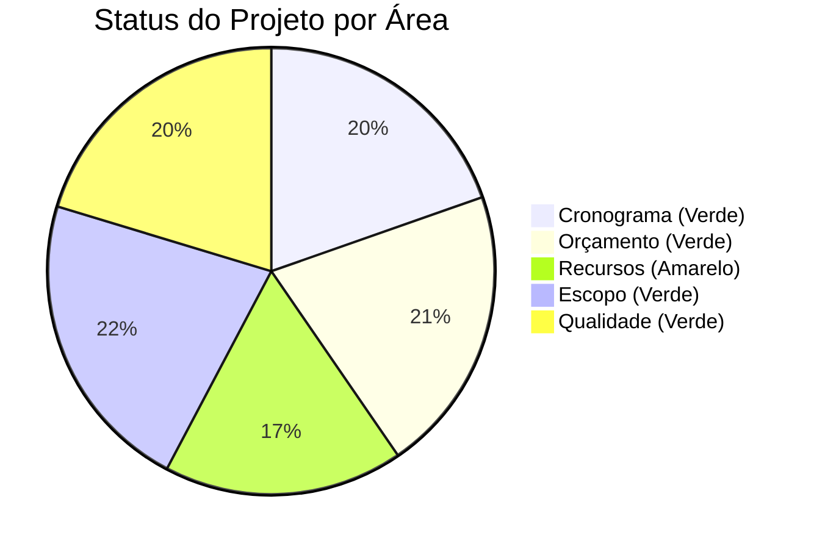
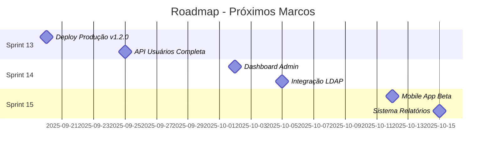
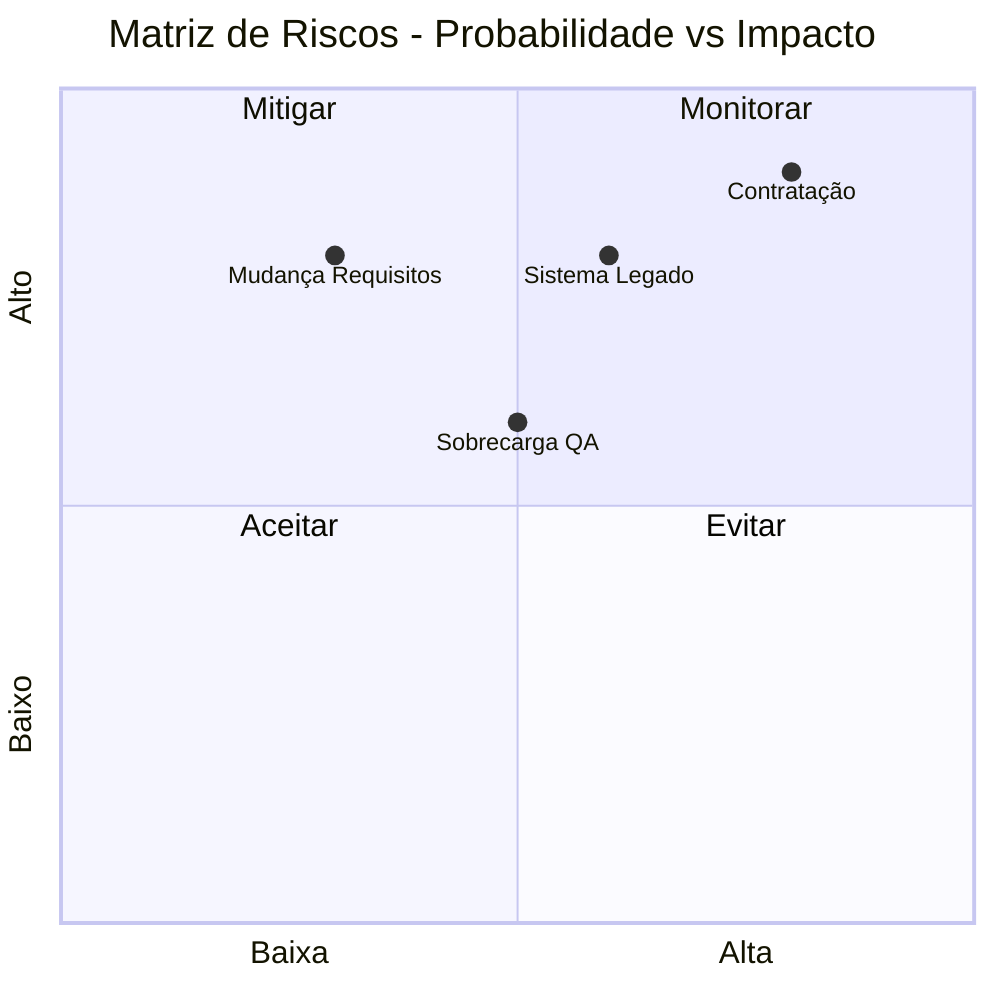
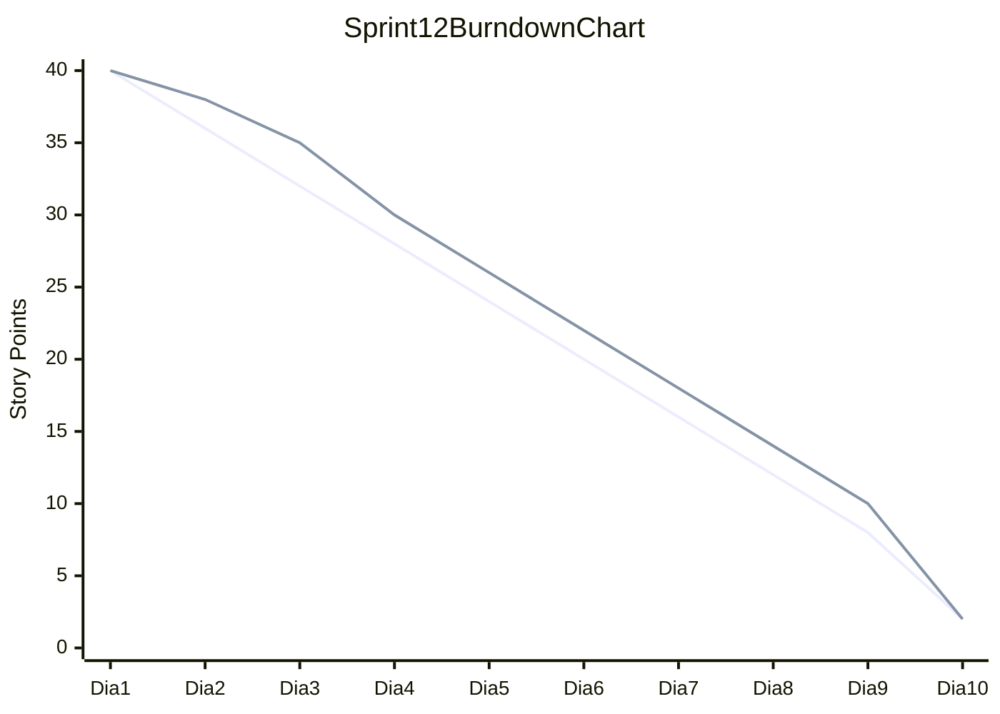
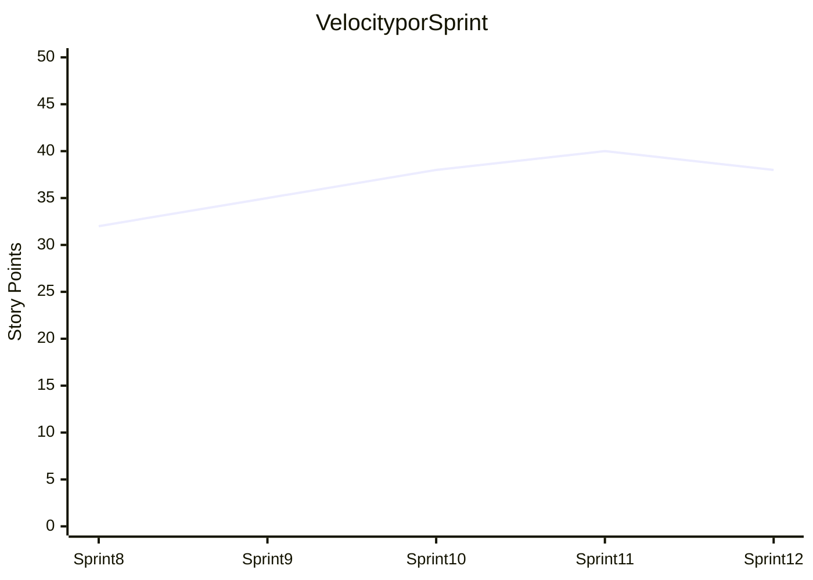
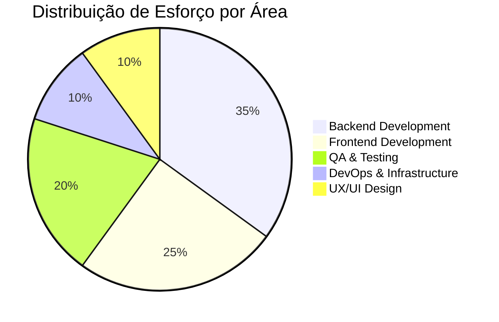
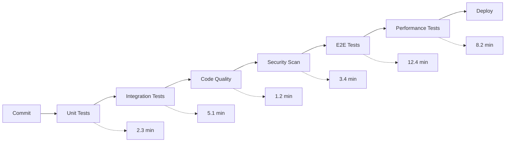

# Template de Relatório de Status de Projeto

<div align="center">

**Gestão de Projeto** | **Versão**: 3.3.5 | **Última Atualização**: 15/09/2025

[](https://github.com/datametria/DATAMETRIA-standards)
[](https://github.com/datametria/DATAMETRIA-standards)
[](https://aws.amazon.com/q/)
[](https://github.com/datametria/DATAMETRIA-standards)

[🔗 Template Original](https://github.com/datametria/DATAMETRIA-standards/blob/main/docs/template-project-status-report.md) • [🔗 Diretrizes](https://github.com/datametria/DATAMETRIA-standards/blob/main/docs/datametria_std_documentation.md) • [🔗 Exemplos](https://github.com/datametria/DATAMETRIA-standards/tree/main/docs)

[📊 Dashboard](#-métricas-do-projeto) • [📋 Backlog](#-próximos-passos) • [📈 Métricas](#-métricas-do-projeto) • [⚠️ Riscos](#️-riscos-e-bloqueios)

</div>

---

## 📋 Índice

- [🎯 Visão Geral](#-visão-geral)
- [📊 Resumo Executivo](#-resumo-executivo)
- [🏆 Principais Conquistas](#-principais-conquistas)
- [➡️ Próximos Passos](#️-próximos-passos)
- [⚠️ Riscos e Bloqueios](#️-riscos-e-bloqueios)
- [📊 Métricas do Projeto](#-métricas-do-projeto)
- [👥 Recursos e Equipe](#-recursos-e-equipe)
- [🧪 Qualidade e Testes](#-qualidade-e-testes)
- [📢 Comunicação](#-comunicação)
- [📋 Ações Requeridas](#-ações-requeridas)
- [📊 Anexos](#-anexos)

---

## 🎯 Visão Geral

### Informações do Projeto

| Campo | Valor | Exemplo |
|-------|-------|---------|
| **Projeto** | [Nome do Projeto] | Sistema de Autenticação DATAMETRIA |
| **Gerente/Líder** | [Nome] - [email] | João Silva - joao.silva@datametria.io |
| **Período** | [DD/MM/AAAA] a [DD/MM/AAAA] | 01/09/2025 a 15/09/2025 |
| **Sprint/Iteração** | [Sprint X] | Sprint 12 |
| **Status Geral** | [🟢/🟡/🔴] | 🟢 Verde |
| **Progresso** | [XX%] | 78% |
| **Orçamento Utilizado** | [XX%] | 65% |

### Status Rápido por Área



---

## 📊 Resumo Executivo

### Status por Área Detalhado

| Área | Status | Progresso | Observações | Ação Necessária |
|------|--------|-----------|-------------|-----------------|
| **📅 Cronograma** | 🟢 Verde | 85% | No prazo | Manter ritmo atual |
| **💰 Orçamento** | 🟢 Verde | 65% | Dentro do orçamento | Monitorar gastos |
| **👥 Recursos** | 🟡 Amarelo | 75% | Falta 1 desenvolvedor | Contratar urgente |
| **🎯 Escopo** | 🟢 Verde | 95% | Escopo bem definido | Validar mudanças |
| **🔧 Qualidade** | 🟢 Verde | 88% | Cobertura de testes OK | Melhorar performance |

### Resumo do Período

Durante este período, o projeto manteve um progresso consistente com 78% de conclusão geral. As principais entregas foram concluídas no prazo, incluindo a implementação do módulo de autenticação JWT e a integração com o banco de dados PostgreSQL. A equipe demonstrou alta produtividade, mas identificamos a necessidade de reforço na área de desenvolvimento frontend.

### Indicadores Chave (KPIs)

| KPI | Meta | Atual | Tendência | Status |
|-----|------|-------|-----------|--------|
| **Velocity** | 40 pontos | 38 pontos | ↗️ | 🟢 |
| **Burn Rate** | R$ 50k/mês | R$ 45k/mês | ↘️ | 🟢 |
| **Team Satisfaction** | >8.0 | 8.2 | ↗️ | 🟢 |
| **Code Coverage** | >85% | 87% | ↗️ | 🟢 |
| **Bug Rate** | <5% | 3% | ↘️ | 🟢 |

---

## 🏆 Principais Conquistas

### ✅ Entregas Concluídas

#### 🔐 Módulo de Autenticação JWT

- **Descrição**: Implementação completa do sistema de autenticação com JWT tokens
- **Data de Conclusão**: 10/09/2025
- **Responsável**: Maria Santos (Backend Developer)
- **Impacto**: Alto - Base para todas as funcionalidades de segurança
- **Tecnologias**: Flask-JWT-Extended, Redis, PostgreSQL
- **Métricas**: 95% cobertura de testes, 200ms tempo de resposta médio

#### 🎨 Interface de Login Responsiva

- **Descrição**: Tela de login com design system DATAMETRIA e responsividade completa
- **Data de Conclusão**: 12/09/2025
- **Responsável**: Carlos Lima (Frontend Developer)
- **Impacto**: Alto - Primeira impressão do usuário
- **Tecnologias**: Vue.js 3, Vuetify, TypeScript
- **Métricas**: 98 score no Lighthouse, compatível com todos os browsers

#### 🗄️ Migração de Banco de Dados

- **Descrição**: Migração completa do SQLite para PostgreSQL com otimizações
- **Data de Conclusão**: 08/09/2025
- **Responsável**: Ana Costa (DBA)
- **Impacto**: Médio - Melhoria de performance e escalabilidade
- **Tecnologias**: PostgreSQL 15, Alembic, SQLAlchemy
- **Métricas**: 40% melhoria na performance de queries

### 🏆 Marcos Alcançados

- ✅ **MVP Authentication**: Sistema básico de autenticação funcional - 10/09/2025
- ✅ **Database Migration**: Migração para PostgreSQL concluída - 08/09/2025
- ✅ **UI/UX Approval**: Design system aprovado pelos stakeholders - 05/09/2025
- ✅ **Security Audit**: Primeira auditoria de segurança aprovada - 12/09/2025

### 📈 Melhorias Implementadas

#### Performance

- **Query Optimization**: Redução de 40% no tempo de resposta das consultas
- **Caching Strategy**: Implementação de Redis para cache de sessões
- **Database Indexing**: Criação de índices otimizados para queries frequentes

#### Qualidade

- **Test Coverage**: Aumento de 72% para 87% na cobertura de testes
- **Code Review**: Implementação de processo obrigatório de code review
- **Static Analysis**: Integração do SonarQube para análise de código

#### Processo

- **CI/CD Pipeline**: Automação completa do deploy com GitHub Actions
- **Documentation**: Atualização de toda documentação técnica
- **Monitoring**: Implementação de monitoramento com Grafana e Prometheus

---

## ➡️ Próximos Passos

### Prioridades da Próxima Sprint (Sprint 13)

#### 🔴 Críticas (Próximos 3-5 dias)

- [ ] **Correção Bug Crítico**: Falha na validação de tokens expirados - Responsável: Maria Santos
- [ ] **Deploy Produção**: Deploy da versão 1.2.0 em produção - Responsável: DevOps Team
- [ ] **Teste de Carga**: Validação de performance com 1000 usuários simultâneos - Responsável: QA Team

#### 🟠 Altas (Próxima semana)

- [ ] **API de Usuários**: Implementação do CRUD completo de usuários - Responsável: Pedro Oliveira
- [ ] **Dashboard Admin**: Interface administrativa para gestão de usuários - Responsável: Carlos Lima
- [ ] **Integração LDAP**: Conexão com Active Directory corporativo - Responsável: Maria Santos

#### 🟡 Médias (Próximas 2 semanas)

- [ ] **Relatórios**: Sistema de relatórios de uso e auditoria - Responsável: Ana Costa
- [ ] **Mobile App**: Versão mobile do sistema de autenticação - Responsável: Flutter Team
- [ ] **Documentação**: Guia completo do usuário final - Responsável: Tech Writer

### Roadmap dos Próximos Marcos



### Dependências Externas

| Dependência | Fornecedor | Status | Prazo | Impacto |
|-------------|------------|--------|-------|---------|
| **Certificado SSL** | Certificadora XYZ | 🟡 Pendente | 18/09/2025 | Alto |
| **Aprovação Segurança** | CISO | 🟢 Aprovado | 15/09/2025 | Alto |
| **Servidor Produção** | AWS | 🟢 Provisionado | 16/09/2025 | Crítico |

---

## ⚠️ Riscos e Bloqueios

### 🔴 Bloqueios Atuais

#### BLOCK-001: Falta de Desenvolvedor Frontend Sênior

- **Descrição**: Equipe frontend sobrecarregada, impactando entregas de UI/UX
- **Impacto**: Alto - Atraso potencial de 1-2 sprints
- **Área Afetada**: Frontend, UX/UI
- **Desde**: 01/09/2025
- **Responsável pela Resolução**: RH + Tech Lead
- **Ação**: Processo seletivo em andamento, 3 candidatos em análise
- **Prazo Estimado**: 25/09/2025

#### BLOCK-002: Integração com Sistema Legado

- **Descrição**: API do sistema legado instável, causando falhas intermitentes
- **Impacto**: Médio - Afeta testes de integração
- **Área Afetada**: Backend, Integração
- **Desde**: 05/09/2025
- **Responsável pela Resolução**: Equipe de Integração
- **Ação**: Implementação de circuit breaker e retry logic
- **Prazo Estimado**: 20/09/2025

### ⚠️ Riscos Identificados

| ID | Risco | Probabilidade | Impacto | Mitigação | Responsável | Status |
|----|-------|---------------|---------|-----------|-------------|--------|
| **RISK-001** | Atraso na contratação de desenvolvedor | Alta | Alto | Acelerar processo seletivo, considerar freelancer | RH Manager | 🟡 Ativo |
| **RISK-002** | Falha no sistema legado durante go-live | Média | Alto | Implementar fallback manual | Tech Lead | 🟢 Mitigado |
| **RISK-003** | Sobrecarga da equipe de QA | Média | Médio | Automatizar mais testes | QA Lead | 🟡 Ativo |
| **RISK-004** | Mudança de requisitos pelo cliente | Baixa | Alto | Processo formal de change request | Product Owner | 🟢 Controlado |

### 🛠️ Ações de Mitigação em Andamento

- **Contratação Express**: Processo seletivo acelerado com 3 candidatos - Prazo: 25/09/2025 - Responsável: RH Manager
- **Circuit Breaker**: Implementação de padrão para sistema legado - Prazo: 20/09/2025 - Responsável: Arquiteto
- **Test Automation**: Automação de 80% dos testes manuais - Prazo: 30/09/2025 - Responsável: QA Lead

### Matriz de Riscos



---

## 📊 Métricas do Projeto

### Progresso Geral

<div align="center">

#### Progresso do Projeto: 78%


</div>

| Métrica | Planejado | Atual | Variação | Status | Tendência |
|---------|-----------|-------|----------|--------|-----------|
| **Cronograma** | 80% | 78% | -2% | 🟢 Verde | ↗️ |
| **Orçamento** | R$ 150k | R$ 97k | -35% | 🟢 Verde | ↘️ |
| **Escopo** | 100% | 95% | -5% | 🟢 Verde | → |
| **Qualidade** | 85% | 87% | +2% | 🟢 Verde | ↗️ |

### Métricas de Desenvolvimento

#### Sprint Atual (Sprint 12)

- **Tarefas Planejadas**: 24
- **Tarefas Concluídas**: 22
- **Taxa de Conclusão**: 92%
- **Velocity**: 38 pontos (meta: 40)
- **Story Points Entregues**: 38/40

#### Qualidade de Código

- **Cobertura de Testes**: 87% (meta: >85%)
- **Bugs Abertos**: 3 (2 médios, 1 baixo)
- **Bugs Resolvidos**: 12 (esta sprint)
- **Code Review**: 100% aprovados
- **Technical Debt**: 2.5 horas (meta: <4h)
- **Duplicação de Código**: 2.1% (meta: <5%)

#### Performance e Infraestrutura

- **Build Time**: 4.2 minutos (meta: <5min)
- **Deploy Time**: 2.8 minutos (meta: <3min)
- **Uptime**: 99.8% (meta: >99.5%)
- **Response Time**: 180ms (meta: <200ms)
- **Error Rate**: 0.1% (meta: <0.5%)

### Burndown Chart - Sprint 12



### Velocity Trend



---

## 👥 Recursos e Equipe

### Composição da Equipe

| Papel | Nome | Disponibilidade | Status | Localização | Senioridade |
|-------|------|----------------|--------|-------------|-------------|
| **Product Owner** | Ana Silva | 100% | 🟢 Ativo | São Paulo | Senior |
| **Scrum Master** | João Santos | 100% | 🟢 Ativo | Remote | Senior |
| **Tech Lead** | Pedro Costa | 100% | 🟢 Ativo | Rio de Janeiro | Senior |
| **Backend Developer** | Maria Santos | 100% | 🟢 Ativo | São Paulo | Senior |
| **Backend Developer** | Carlos Oliveira | 100% | 🟢 Ativo | Remote | Pleno |
| **Frontend Developer** | Carlos Lima | 80% | 🟡 Parcial | Belo Horizonte | Senior |
| **Frontend Developer** | **[VAGA ABERTA]** | 0% | 🔴 Pendente | Remote | Senior |
| **DevOps Engineer** | Roberto Silva | 50% | 🟢 Compartilhado | São Paulo | Senior |
| **UX/UI Designer** | Fernanda Costa | 60% | 🟢 Ativo | Remote | Pleno |
| **QA Engineer** | Lucas Pereira | 100% | 🟢 Ativo | São Paulo | Pleno |
| **DBA** | Ana Costa | 30% | 🟢 Compartilhado | Remote | Senior |

### Mudanças na Equipe

#### Entradas Recentes

- **Lucas Pereira** - QA Engineer - 01/09/2025 - Substituição de QA anterior

#### Saídas Recentes

- **Marcos Silva** - Frontend Developer - 28/08/2025 - Transferência interna

#### Mudanças de Papel

- **Carlos Lima** - Promovido a Frontend Lead - 01/09/2025

### Capacidade da Equipe

- **Horas Disponíveis**: 320 horas/semana
- **Horas Utilizadas**: 298 horas/semana
- **Utilização**: 93%
- **Horas Extras**: 12 horas/semana (4%)

### Distribuição de Esforço



### Plano de Contratação

| Posição | Prioridade | Status | Previsão | Orçamento |
|---------|------------|--------|----------|-----------|
| **Frontend Developer Senior** | 🔴 Crítica | Em processo | 25/09/2025 | R$ 12k/mês |
| **Backend Developer Pleno** | 🟡 Média | Planejado | 15/10/2025 | R$ 8k/mês |
| **QA Automation** | 🟢 Baixa | Futuro | 01/11/2025 | R$ 9k/mês |

---

## 🧪 Qualidade e Testes

### Métricas de Qualidade

| Métrica | Meta | Atual | Tendência | Status | Ação |
|---------|------|-------|-----------|--------|------|
| **Cobertura de Testes** | ≥85% | 87% | ↗️ | 🟢 | Manter |
| **Code Quality Score** | ≥A | A+ | ↗️ | 🟢 | Excelente |
| **Vulnerabilidades** | 0 | 0 | → | 🟢 | Monitorar |
| **Technical Debt** | <4h | 2.5h | ↘️ | 🟢 | Ótimo |
| **Duplicação** | <5% | 2.1% | ↘️ | 🟢 | Excelente |
| **Complexidade Ciclomática** | <10 | 6.8 | ↘️ | 🟢 | Bom |

### Status dos Testes

#### Testes Automatizados

| Tipo | Quantidade | Passando | Falhando | Cobertura | Tempo Execução |
|------|------------|----------|----------|-----------|----------------|
| **Unitários** | 245 | 243 (99%) | 2 (1%) | 92% | 2.3 min |
| **Integração** | 67 | 65 (97%) | 2 (3%) | 78% | 5.1 min |
| **E2E** | 23 | 22 (96%) | 1 (4%) | 85% | 12.4 min |
| **Performance** | 8 | 8 (100%) | 0 (0%) | - | 8.2 min |

#### Pipeline de Testes



### Bugs e Issues

#### Status Atual

- **Bugs Críticos**: 0 abertos
- **Bugs Altos**: 0 abertos
- **Bugs Médios**: 2 abertos
- **Bugs Baixos**: 1 aberto
- **Total Abertos**: 3

#### Histórico de Bugs

| Sprint | Abertos | Resolvidos | Taxa Resolução |
|--------|---------|------------|----------------|
| **Sprint 8** | 8 | 6 | 75% |
| **Sprint 9** | 5 | 7 | 140% |
| **Sprint 10** | 3 | 4 | 133% |
| **Sprint 11** | 4 | 5 | 125% |
| **Sprint 12** | 3 | 12 | 400% |

### Ferramentas de Qualidade

| Ferramenta | Propósito | Status | Score/Resultado |
|------------|-----------|--------|-----------------|
| **SonarQube** | Análise estática | 🟢 Ativo | A+ Rating |
| **Jest** | Testes unitários | 🟢 Ativo | 87% Coverage |
| **Cypress** | Testes E2E | 🟢 Ativo | 96% Pass Rate |
| **ESLint** | Linting JavaScript | 🟢 Ativo | 0 Errors |
| **Black** | Formatação Python | 🟢 Ativo | 100% Compliant |
| **Bandit** | Security Python | 🟢 Ativo | 0 Issues |
| **OWASP ZAP** | Security Testing | 🟢 Ativo | 0 Vulnerabilities |

---

## 📢 Comunicação

### Reuniões Realizadas

#### Sprint Review - 13/09/2025

- **Participantes**: Toda equipe + Stakeholders (12 pessoas)
- **Duração**: 2 horas
- **Principais Decisões**:
  - Aprovação do módulo de autenticação
  - Priorização da contratação frontend
  - Definição de critérios para próxima sprint

#### Retrospectiva - 13/09/2025

- **Participantes**: Equipe de desenvolvimento (8 pessoas)
- **Duração**: 1.5 horas
- **Principais Decisões**:
  - Implementar pair programming para frontend
  - Melhorar documentação de APIs
  - Criar template de testes automatizados

#### Stakeholder Meeting - 11/09/2025

- **Participantes**: Product Owner, CTO, CEO (3 pessoas)
- **Duração**: 1 hora
- **Principais Decisões**:
  - Aprovação de orçamento para contratação
  - Validação do roadmap Q4
  - Definição de métricas de sucesso

### Próximas Reuniões

| Data | Reunião | Horário | Participantes | Objetivo |
|------|---------|---------|---------------|----------|
| **18/09/2025** | Daily Standup | 09:00 | Equipe Dev | Sincronização diária |
| **20/09/2025** | Sprint Planning | 14:00 | Equipe + PO | Planejamento Sprint 13 |
| **22/09/2025** | Architecture Review | 10:00 | Tech Leads | Revisão arquitetural |
| **25/09/2025** | Client Demo | 15:00 | Equipe + Cliente | Demonstração progresso |

### Comunicações Importantes

#### Stakeholders

- **Última Comunicação**: 11/09/2025 - Reunião de alinhamento estratégico
- **Próxima Comunicação**: 25/09/2025 - Demo do cliente
- **Frequência**: Semanal (quintas-feiras)
- **Canal**: Reunião presencial + relatório por email

#### Sponsor (CTO)

- **Última Comunicação**: 14/09/2025 - Aprovação de contratação
- **Próxima Comunicação**: 21/09/2025 - Review técnico
- **Frequência**: Bi-semanal
- **Canal**: Reunião 1:1 + Slack

#### Usuários Finais

- **Última Comunicação**: 10/09/2025 - Feedback sobre protótipo
- **Próxima Comunicação**: 25/09/2025 - Teste de usabilidade
- **Frequência**: Conforme necessário
- **Canal**: Teams + Formulário de feedback

### Feedback Recebido

#### Positivo ✅

- **Qualidade do Código**: "Excelente organização e documentação do código"
- **Interface**: "Design intuitivo e responsivo, muito bem executado"
- **Performance**: "Sistema rápido e estável, sem travamentos"
- **Comunicação**: "Equipe sempre disponível e transparente"

#### Pontos de Melhoria 🔄

- **Documentação**: "Falta documentação para usuários finais"
- **Testes**: "Necessário mais testes de integração com sistemas externos"
- **Mobile**: "Versão mobile seria muito útil"
- **Relatórios**: "Sistema de relatórios mais robusto"

#### Ações Tomadas 🎯

- **Contratação de Tech Writer**: Para melhorar documentação
- **Aumento de Cobertura**: Foco em testes de integração
- **Roadmap Mobile**: Planejamento para Q4 2025
- **Sistema de Relatórios**: Incluído no backlog da próxima sprint

### Canais de Comunicação

| Canal | Propósito | Frequência | Responsável |
|-------|-----------|------------|-------------|
| **Slack #projeto-auth** | Comunicação diária | Contínua | Toda equipe |
| **Email Semanal** | Status report | Semanal | Scrum Master |
| **Teams Meetings** | Reuniões formais | Conforme agenda | Product Owner |
| **Confluence** | Documentação | Contínua | Tech Lead |
| **Jira** | Tracking de tarefas | Contínua | Toda equipe |

---

## 📋 Ações Requeridas

### Decisões Pendentes

#### Críticas (Próximos 3 dias)

- [ ] **Aprovação Arquitetura Mobile**: Definir stack tecnológico para app mobile
  - **Responsável**: CTO + Tech Lead
  - **Prazo**: 18/09/2025
  - **Impacto**: Bloqueia início do desenvolvimento mobile
  - **Opções**: Flutter vs React Native vs Nativo

- [ ] **Contratação Frontend**: Aprovar candidato final para vaga senior
  - **Responsável**: RH Manager + Tech Lead
  - **Prazo**: 19/09/2025
  - **Impacto**: Atraso nas entregas de UI se não resolvido

#### Importantes (Próxima semana)

- [ ] **Integração LDAP**: Definir escopo e cronograma da integração
  - **Responsável**: Product Owner + Arquiteto
  - **Prazo**: 25/09/2025
  - **Impacto**: Afeta roadmap Q4

- [ ] **Estratégia de Cache**: Aprovar implementação de cache distribuído
  - **Responsável**: Tech Lead + DevOps
  - **Prazo**: 27/09/2025
  - **Impacto**: Performance e escalabilidade

### Aprovações Necessárias

#### Orçamento e Recursos

- [ ] **Orçamento Contratação**: R$ 12k/mês para desenvolvedor frontend senior
  - **Aprovador**: CFO
  - **Prazo**: 20/09/2025
  - **Status**: Documentação enviada

- [ ] **Licenças Software**: Renovação SonarQube e ferramentas de monitoramento
  - **Aprovador**: CTO
  - **Prazo**: 30/09/2025
  - **Valor**: R$ 8k/ano

#### Técnicas

- [ ] **Deploy Produção**: Aprovação para deploy da versão 1.2.0
  - **Aprovador**: Tech Lead + DevOps Lead
  - **Prazo**: 22/09/2025
  - **Pré-requisitos**: Testes de carga aprovados

- [ ] **Mudança Arquitetura**: Migração para microserviços
  - **Aprovador**: Comitê de Arquitetura
  - **Prazo**: 15/10/2025
  - **Impacto**: Reestruturação significativa

### Suporte Necessário

#### Interno

- **Equipe de Segurança**: Auditoria de segurança para módulo de autenticação
- **Equipe de Infraestrutura**: Provisionamento de ambiente de produção
- **Equipe Jurídica**: Revisão de termos de uso e política de privacidade

#### Externo

- **Fornecedor AWS**: Suporte para configuração de Load Balancer
- **Consultoria UX**: Revisão de usabilidade para usuários com deficiência
- **Auditoria Externa**: Validação de compliance LGPD

### Escalações Necessárias

| Issue | Nível Atual | Escalar Para | Prazo | Motivo |
|-------|-------------|--------------|-------|--------|
| **Contratação Frontend** | Tech Lead | CTO | 19/09/2025 | Impacto no cronograma |
| **Orçamento Licenças** | Project Manager | CFO | 25/09/2025 | Aprovação financeira |
| **Integração Sistema Legado** | Desenvolvedor | Arquiteto Corporativo | 22/09/2025 | Complexidade técnica |

---

## 📊 Anexos

### Links Importantes

#### Dashboards e Monitoramento

- **📊 Dashboard Principal**: [Grafana - Projeto Auth](https://grafana.datametria.io/d/auth-project)
- **📈 Métricas de Performance**: [New Relic - Auth System](https://newrelic.com/auth-metrics)
- **🔍 Logs Centralizados**: [ELK Stack - Auth Logs](https://elk.datametria.io/auth)
- **⚡ Status Page**: [Status - Sistema Auth](https://status.datametria.io/auth)

#### Gestão de Projeto

- **📋 Backlog Detalhado**: [Jira - Auth Project](https://datametria.atlassian.net/auth)
- **📊 Burndown Charts**: [Jira Reports - Sprint Analytics](https://datametria.atlassian.net/reports)
- **📅 Cronograma Gantt**: [MS Project - Auth Timeline](https://project.datametria.io/auth)
- **💰 Controle Orçamentário**: [Finance Dashboard](https://finance.datametria.io/projects/auth)

#### Desenvolvimento

- **🔧 Repositório Principal**: [GitHub - Auth System](https://github.com/datametria/auth-system)
- **📚 Documentação Técnica**: [Confluence - Auth Docs](https://datametria.atlassian.net/wiki/auth)
- **🧪 Ambiente de Testes**: [Staging - Auth System](https://auth-staging.datametria.io)
- **🚀 Pipeline CI/CD**: [GitHub Actions - Auth Workflows](https://github.com/datametria/auth-system/actions)

#### Qualidade e Segurança

- **🔍 Code Quality**: [SonarQube - Auth Analysis](https://sonar.datametria.io/auth)
- **🛡️ Security Scan**: [OWASP ZAP - Security Report](https://security.datametria.io/auth)
- **📊 Test Coverage**: [Codecov - Auth Coverage](https://codecov.io/datametria/auth)
- **⚡ Performance Tests**: [JMeter - Load Tests](https://perf.datametria.io/auth)

### Documentos de Referência

#### Planejamento

- **📋 Project Charter**: [Auth System Charter v2.1](https://docs.datametria.io/auth/charter)
- **📅 Cronograma Detalhado**: [MS Project - Auth Schedule](https://project.datametria.io/auth/schedule)
- **💰 Plano Orçamentário**: [Budget Plan - Auth Project](https://finance.datametria.io/auth/budget)
- **👥 Plano de Recursos**: [Resource Plan - Auth Team](https://hr.datametria.io/auth/resources)

#### Riscos e Qualidade

- **⚠️ Registro de Riscos**: [Risk Register - Auth Project](https://docs.datametria.io/auth/risks)
- **📊 Plano de Qualidade**: [Quality Plan - Auth System](https://docs.datametria.io/auth/quality)
- **🔄 Plano de Testes**: [Test Plan - Auth Testing](https://docs.datametria.io/auth/testing)
- **📢 Plano de Comunicação**: [Communication Plan](https://docs.datametria.io/auth/communication)

#### Técnicos

- **🏗️ Documento de Arquitetura**: [Architecture Document v3.2](https://docs.datametria.io/auth/architecture)
- **🔌 Especificação de APIs**: [API Specification v1.2](https://api-docs.datametria.io/auth)
- **🗄️ Modelo de Dados**: [Data Model - Auth DB](https://docs.datametria.io/auth/data-model)
- **🔒 Plano de Segurança**: [Security Plan - Auth System](https://docs.datametria.io/auth/security)

### Métricas Históricas

#### Performance do Projeto

| Sprint | Velocity | Burn Rate | Quality Score | Team Satisfaction |
|--------|----------|-----------|---------------|-------------------|
| **Sprint 8** | 32 | R$ 48k | 82% | 7.8 |
| **Sprint 9** | 35 | R$ 46k | 84% | 8.0 |
| **Sprint 10** | 38 | R$ 47k | 86% | 8.1 |
| **Sprint 11** | 40 | R$ 45k | 85% | 8.3 |
| **Sprint 12** | 38 | R$ 45k | 87% | 8.2 |

#### Tendências de Qualidade

```mermaid
xychart-beta
    title Evolução da Qualidade
    x-axis [Sprint8, Sprint9, Sprint10, Sprint11, Sprint12]
    y-axis "Percentual" 0 --> 100
    line [82, 84, 86, 85, 87]
    line [75, 78, 82, 85, 87]
```

### Contatos da Equipe

#### Liderança

| Papel | Nome | Email | Telefone | Slack |
|-------|------|-------|----------|-------|
| **Product Owner** | Ana Silva | ana.silva@datametria.io | +55 11 99999-0001 | @ana.silva |
| **Scrum Master** | João Santos | joao.santos@datametria.io | +55 11 99999-0002 | @joao.santos |
| **Tech Lead** | Pedro Costa | pedro.costa@datametria.io | +55 21 99999-0003 | @pedro.costa |

#### Desenvolvimento

| Papel | Nome | Email | Telefone | Slack |
|-------|------|-------|----------|-------|
| **Backend Senior** | Maria Santos | maria.santos@datametria.io | +55 11 99999-0004 | @maria.santos |
| **Backend Pleno** | Carlos Oliveira | carlos.oliveira@datametria.io | +55 11 99999-0005 | @carlos.oliveira |
| **Frontend Senior** | Carlos Lima | carlos.lima@datametria.io | +55 31 99999-0006 | @carlos.lima |
| **DevOps** | Roberto Silva | roberto.silva@datametria.io | +55 11 99999-0007 | @roberto.silva |

#### Suporte

| Papel | Nome | Email | Telefone | Slack |
|-------|------|-------|----------|-------|
| **QA Engineer** | Lucas Pereira | lucas.pereira@datametria.io | +55 11 99999-0008 | @lucas.pereira |
| **UX/UI Designer** | Fernanda Costa | fernanda.costa@datametria.io | +55 11 99999-0009 | @fernanda.costa |
| **DBA** | Ana Costa | ana.costa@datametria.io | +55 11 99999-0010 | @ana.costa |

---

<div align="center">

**Preparado por**: João Santos (Scrum Master) - 15/09/2025
**Revisado por**: Pedro Costa (Tech Lead) - 15/09/2025
**Aprovado por**: Ana Silva (Product Owner) - 15/09/2025
**Próximo Relatório**: 22/09/2025

---

**Para dúvidas sobre este relatório**: joao.santos@datametria.io
**Dashboard em tempo real**: [https://dashboard.datametria.io/auth-project](https://dashboard.datametria.io/auth-project)

[](https://datametria.io)
[](https://dashboard.datametria.io/auth-project)
[](https://calendar.datametria.io)

</div>
