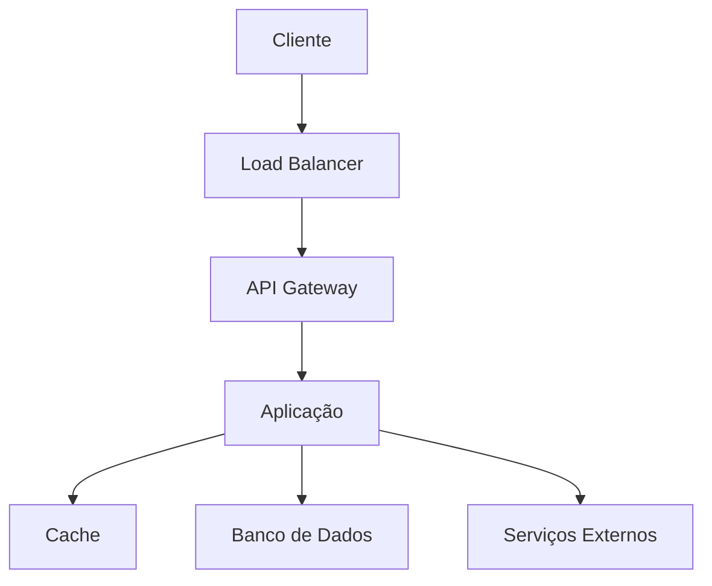
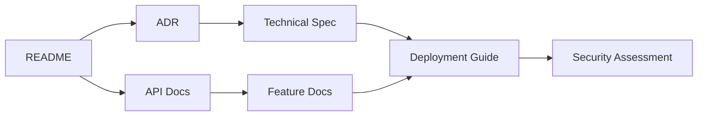

# [Nome do Projeto]

<div align="center">


## [Tagline/Descrição breve do projeto]

[](https://github.com/usuario/repo/actions)
[](https://codecov.io/gh/usuario/repo)
[](LICENSE)
[](https://github.com/usuario/repo/releases)
[](https://github.com/usuario/repo/graphs/contributors)
[](https://github.com/datametria/DATAMETRIA-standards)
[](https://aws.amazon.com/q/)

[🚀 Demo](link-para-demo) • [📖 Documentação](link-para-docs) • [🐛 Reportar Bug](link-para-issues) •
[💡 Solicitar Feature](link-para-feature-request) • [🔄 Templates Relacionados](#templates-relacionados)

</div>

---

## 📋 Índice

- [Sobre o Projeto](#sobre-o-projeto)
- [Funcionalidades](#funcionalidades)
- [Tecnologias](#tecnologias)
- [Pré-requisitos](#pre-requisitos)
- [Instalação](#instalacao)
- [Uso](#uso)
- [API](#exemplo-de-uso-via-api)
- [Configuração](#configuracao)
- [Deploy](#deploy)
- [Testes](#testes)
- [Contribuição](#contribuicao)
- [Roadmap](#roadmap)
- [Licença](#licenca)
- [Contato](#contato)
- [Agradecimentos](#agradecimentos)
- [Templates Relacionados](#templates-relacionados)

---

## 🎯 Sobre o Projeto

### Visão Geral

[Descrição detalhada do projeto, seu propósito e contexto de uso. Explique o problema que resolve e o valor que entrega.]

### Objetivos

- **Objetivo Principal**: [Objetivo principal do projeto]
- **Objetivos Específicos**:
  - [Objetivo específico 1]
  - [Objetivo específico 2]
  - [Objetivo específico 3]

### Benefícios

- ✅ **[Benefício 1]**: [Descrição do benefício]
- ✅ **[Benefício 2]**: [Descrição do benefício]
- ✅ **[Benefício 3]**: [Descrição do benefício]
- ✅ **[Benefício 4]**: [Descrição do benefício]

---

## ⚡ Funcionalidades

### Principais

- 🎯 **[Funcionalidade 1]**: [Descrição detalhada]
- 🔧 **[Funcionalidade 2]**: [Descrição detalhada]
- 📊 **[Funcionalidade 3]**: [Descrição detalhada]
- 🔒 **[Funcionalidade 4]**: [Descrição detalhada]

### Funcionalidades Avançadas

<details>
<summary>Clique para expandir</summary>

- **[Funcionalidade Avançada 1]**: [Descrição]
- **[Funcionalidade Avançada 2]**: [Descrição]
- **[Funcionalidade Avançada 3]**: [Descrição]

</details>

### Screenshots

<div align="center">

| Dashboard | Gerenciamento | Relatórios |
|-----------|---------------|------------|
|  |  |  |

</div>

---

## 🛠️ Tecnologias

### Stack Principal

| Categoria | Tecnologia | Versão | Descrição |
|-----------|------------|--------|-----------|
| **Backend** | [Tecnologia] | [Versão] | [Descrição] |
| **Frontend** | [Tecnologia] | [Versão] | [Descrição] |
| **Banco de Dados** | [Tecnologia] | [Versão] | [Descrição] |
| **Cache** | [Tecnologia] | [Versão] | [Descrição] |

### Dependências Principais

```json
{
  "dependencies": {
    "[dependencia-1]": "[versao]",
    "[dependencia-2]": "[versao]",
    "[dependencia-3]": "[versao]"
  }
}
```

### Arquitetura



---

## 📋 Pré-requisitos

### Requisitos do Sistema

- **Sistema Operacional**: [Windows/Linux/macOS] [versões]
- **Memória RAM**: [X] GB mínimo, [Y] GB recomendado
- **Espaço em Disco**: [X] GB disponível
- **Rede**: Conexão com internet para dependências

### Software Necessário

- **[Software 1]**: [Versão] ou superior - [Link para download]
- **[Software 2]**: [Versão] ou superior - [Link para download]
- **[Software 3]**: [Versão] ou superior - [Link para download]

### Verificação de Pré-requisitos

```bash
# Verificar versões instaladas
[comando-verificacao-1] --version
[comando-verificacao-2] --version
[comando-verificacao-3] --version
```

---

## 🚀 Instalação

### Instalação Rápida

```bash
# Clone o repositório
git clone https://github.com/usuario/repo.git
cd repo

# Instale as dependências
[comando-instalacao-dependencias]

# Configure o ambiente
cp .env.example .env

# Execute a aplicação
[comando-execucao]
```

### Instalação Detalhada

<details>
<summary>Clique para ver instruções detalhadas</summary>

#### 1. Clone o Repositório

```bash
git clone https://github.com/usuario/repo.git
cd repo
```

#### 2. Configure o Ambiente

```bash
# Crie o ambiente virtual (se aplicável)
[comando-ambiente-virtual]

# Ative o ambiente virtual
[comando-ativacao-ambiente]
```

#### 3. Instale as Dependências

```bash
# Instale dependências do backend
[comando-instalacao-backend]

# Instale dependências do frontend
[comando-instalacao-frontend]
```

#### 4. Configure o Banco de Dados

```bash
# Execute as migrações
[comando-migracoes]

# Popule dados iniciais (opcional)
[comando-seed]
```

#### 5. Configure Variáveis de Ambiente

```bash
# Copie o arquivo de exemplo
cp .env.example .env

# Edite as configurações
nano .env
```

</details>

### Instalação com Docker

```bash
# Clone o repositório
git clone https://github.com/usuario/repo.git
cd repo

# Execute com Docker Compose
docker-compose up -d

# Acesse a aplicação
open http://localhost:[porta]
```

### Verificação da Instalação

```bash
# Teste se a aplicação está funcionando
[comando-teste]

# Verifique os logs
[comando-logs]
```

---

## 💻 Uso

### Início Rápido

1. **Acesse a aplicação**: Abra [http://localhost:[porta]](http://localhost:[porta])
2. **Faça login**: Use as credenciais padrão ou crie uma conta
3. **Explore**: Navegue pelas funcionalidades principais

### Guia do Usuário

#### Funcionalidade Principal

```bash
# Exemplo de uso via CLI
[comando-exemplo] --parametro valor

# Exemplo de uso via API
curl -X POST http://localhost:[porta]/api/endpoint \
  -H "Content-Type: application/json" \
  -d '{"campo": "valor"}'
```

### Casos de Uso Comuns

<details>
<summary>Caso de Uso 1: [Nome do Caso]</summary>

**Objetivo**: [Descrição do objetivo]

**Passos**:

1. [Passo 1]
2. [Passo 2]
3. [Passo 3]

**Resultado Esperado**: [Descrição do resultado]

</details>

<details>
<summary>Caso de Uso 2: [Nome do Caso]</summary>

**Objetivo**: [Descrição do objetivo]

**Passos**:

1. [Passo 1]
2. [Passo 2]
3. [Passo 3]

**Resultado Esperado**: [Descrição do resultado]

</details>

### Interface do Usuário

#### Dashboard Principal

- **Seção 1**: [Descrição da funcionalidade]
- **Seção 2**: [Descrição da funcionalidade]
- **Seção 3**: [Descrição da funcionalidade]

#### Navegação

- **Menu Principal**: Acesso às funcionalidades principais
- **Barra de Pesquisa**: Busca rápida por [itens]
- **Perfil do Usuário**: Configurações e preferências

---

## 🔌 API

### Visão Geral

A API RESTful oferece acesso programático a todas as funcionalidades do sistema.

- **Base URL**: `http://localhost:[porta]/api`
- **Formato**: JSON
- **Autenticação**: [Tipo de autenticação]
- **Rate Limiting**: [X] requisições por minuto

### Endpoints Principais

#### Autenticação

```http
POST /api/auth/login
Content-Type: application/json

{
  "email": "usuario@exemplo.com",
  "password": "<sua-senha-segura>"
}
```

#### Recursos

```http
# Listar recursos
GET /api/recursos?page=1&limit=10

# Criar recurso
POST /api/recursos
Content-Type: application/json

{
  "nome": "Novo Recurso",
  "descricao": "Descrição do recurso"
}

# Obter recurso específico
GET /api/recursos/{id}

# Atualizar recurso
PUT /api/recursos/{id}

# Deletar recurso
DELETE /api/recursos/{id}
```

### Códigos de Resposta

| Código | Descrição |
|--------|-----------|
| 200 | Sucesso |
| 201 | Criado com sucesso |
| 400 | Requisição inválida |
| 401 | Não autorizado |
| 403 | Proibido |
| 404 | Não encontrado |
| 429 | Muitas requisições |
| 500 | Erro interno do servidor |

### Documentação Completa

📖 **[Documentação da API](link-para-docs-api)** - Swagger/OpenAPI com exemplos interativos

---

## ⚙️ Configuração

### Variáveis de Ambiente

```bash
# Configurações da aplicação
APP_NAME=[nome-da-aplicacao]
APP_ENV=[development|production]
APP_DEBUG=[true|false]
APP_URL=[url-da-aplicacao]

# Banco de dados
DB_CONNECTION=[tipo-conexao]
DB_HOST=[host]
DB_PORT=[porta]
DB_DATABASE=[nome-banco]
DB_USERNAME=[usuario]
DB_PASSWORD=[senha-segura]

# Cache
CACHE_DRIVER=[driver-cache]
REDIS_HOST=[host-redis]
REDIS_PORT=[porta-redis]
REDIS_PASSWORD=[senha-redis]

# Segurança
JWT_SECRET=[jwt-secret-key]
API_KEY=[api-key]
ENCRYPTION_KEY=[encryption-key]

# Serviços externos
MAIL_HOST=[smtp-host]
MAIL_PORT=[smtp-port]
MAIL_USERNAME=[smtp-username]
MAIL_PASSWORD=[smtp-password]

# Monitoramento
LOG_LEVEL=[debug|info|warning|error]
MONITORING_ENABLED=[true|false]
```

### Configurações de Segurança

⚠️ **Importante**: Nunca commite credenciais reais no repositório. Use:

- **Desenvolvimento**: Arquivo `.env` (incluído no `.gitignore`)
- **Produção**: Variáveis de ambiente ou serviços como AWS Secrets Manager
- **CI/CD**: Secrets do GitHub Actions ou similar

### Configurações por Ambiente

#### Desenvolvimento

```bash
APP_ENV=development
APP_DEBUG=true
DB_HOST=localhost
DB_PORT=5432
CACHE_DRIVER=file
```

#### Produção

```bash
APP_ENV=production
APP_DEBUG=false
DB_HOST=${DB_HOST}
DB_PORT=${DB_PORT}
CACHE_DRIVER=redis
```

---

## 🚀 Deploy

### Deploy Local

```bash
# Construir a aplicação
[comando-build]

# Executar em modo produção
[comando-producao]
```

### Deploy com Docker

```bash
# Construir imagem
docker build -t [nome-projeto] .

# Executar container
docker run -d -p [porta]:3000 [nome-projeto]
```

### Deploy na Nuvem

#### AWS

```bash
# Deploy usando AWS CLI
aws deploy create-deployment \
  --application-name [nome-app] \
  --deployment-group-name [grupo] \
  --s3-location bucket=[bucket],key=[arquivo],bundleType=zip
```

#### Heroku

```bash
# Deploy no Heroku
heroku create [nome-app]
git push heroku main
heroku open
```

#### Vercel

```bash
# Deploy na Vercel
npx vercel --prod
```

### Configuração de CI/CD

#### GitHub Actions

```yaml
name: Deploy
on:
  push:
    branches: [main]
jobs:
  deploy:
    runs-on: ubuntu-latest
    steps:
      - uses: actions/checkout@v4
      - name: Deploy
        run: |
          [comandos-deploy]
```

---

## 🧪 Testes

### Executar Testes

```bash
# Todos os testes
[comando-todos-testes]

# Testes unitários
[comando-testes-unitarios]

# Testes de integração
[comando-testes-integracao]

# Testes e2e
[comando-testes-e2e]

# Coverage
[comando-coverage]
```

### Estrutura de Testes

```
tests/
├── unit/           # Testes unitários
├── integration/    # Testes de integração
├── e2e/           # Testes end-to-end
└── fixtures/      # Dados de teste
```

### Métricas de Qualidade

- **Coverage**: Mínimo 80%
- **Testes Unitários**: Todas as funções críticas
- **Testes de Integração**: Fluxos principais
- **Testes E2E**: Cenários de usuário

---

## 🤝 Contribuição

### Como Contribuir

1. **Fork** o projeto
2. **Crie** uma branch para sua feature (`git checkout -b feature/AmazingFeature`)
3. **Commit** suas mudanças (`git commit -m 'Add some AmazingFeature'`)
4. **Push** para a branch (`git push origin feature/AmazingFeature`)
5. **Abra** um Pull Request

### Diretrizes de Contribuição

- Siga os padrões de código estabelecidos
- Inclua testes para novas funcionalidades
- Atualize a documentação quando necessário
- Use commits semânticos (feat, fix, docs, etc.)

### Código de Conduta

Este projeto segue o [Código de Conduta](CODE_OF_CONDUCT.md). Ao participar, você concorda em seguir estes termos.

---

## 🗺️ Roadmap

### Versão Atual (v[X.Y.Z])

- [x] **Funcionalidade 1**: Implementada
- [x] **Funcionalidade 2**: Implementada
- [ ] **Funcionalidade 3**: Em desenvolvimento

### Próximas Versões

#### v[X.Y+1.Z] - [Nome da Versão]

- [ ] **Nova Funcionalidade A**: [Descrição]
- [ ] **Melhoria B**: [Descrição]
- [ ] **Correção C**: [Descrição]

#### v[X+1.Y.Z] - [Nome da Versão]

- [ ] **Funcionalidade Major A**: [Descrição]
- [ ] **Refatoração B**: [Descrição]
- [ ] **Performance C**: [Descrição]

### Backlog

- **Funcionalidade Futura 1**: [Descrição]
- **Funcionalidade Futura 2**: [Descrição]
- **Integração X**: [Descrição]

---

## 📄 Licença

Este projeto está licenciado sob a Licença [TIPO] - veja o arquivo [LICENSE](LICENSE) para detalhes.

### Resumo da Licença

- ✅ **Uso Comercial**: [Permitido/Não Permitido]
- ✅ **Modificação**: [Permitida/Não Permitida]
- ✅ **Distribuição**: [Permitida/Não Permitida]
- ✅ **Uso Privado**: [Permitido/Não Permitido]

---

## 📞 Contato

### Equipe de Desenvolvimento

- **Maintainer**: [Nome] - [email@exemplo.com]
- **Contributors**: [Ver todos os contribuidores](https://github.com/usuario/repo/graphs/contributors)

### Canais de Suporte

- 📧 **Email**: [email-suporte@exemplo.com]
- 💬 **Discord**: [Link do Discord]
- 🐛 **Issues**: [GitHub Issues](https://github.com/usuario/repo/issues)
- 💡 **Discussions**: [GitHub Discussions](https://github.com/usuario/repo/discussions)

### Links do Projeto

- 🏠 **Homepage**: [https://projeto.exemplo.com]
- 📖 **Documentação**: [https://docs.projeto.exemplo.com]
- 🚀 **Demo**: [https://demo.projeto.exemplo.com]
- 📊 **Status**: [https://status.projeto.exemplo.com]

---

## 🙏 Agradecimentos

### Inspirações e Referências

- **[Projeto/Biblioteca A]**: [Descrição da inspiração]
- **[Projeto/Biblioteca B]**: [Descrição da inspiração]
- **[Recurso/Tutorial C]**: [Descrição da inspiração]

### Contribuidores Especiais

- **[Nome 1]**: [Contribuição específica]
- **[Nome 2]**: [Contribuição específica]
- **[Nome 3]**: [Contribuição específica]

### Ferramentas e Serviços

- **[Ferramenta 1]**: [Como ajudou no projeto]
- **[Serviço 2]**: [Como ajudou no projeto]
- **[Plataforma 3]**: [Como ajudou no projeto]

---

## 🔄 Templates Relacionados

### Templates DATAMETRIA

| Template | Descrição | Link |
|----------|-----------|------|
| **[ADR](../docs/template-adr.md)** | Architectural Decision Records | Para decisões arquiteturais |
| **[API Documentation](../docs/template-api-documentation.md)** | Documentação de APIs | Para documentar APIs REST |
| **[Deployment Guide](../docs/template-deployment-guide.md)** | Guia de Deploy | Para processos de deployment |
| **[Feature Documentation](../docs/template-feature-documentation.md)** | Documentação de Features | Para novas funcionalidades |
| **[Security Assessment](../docs/template-security-assessment.md)** | Avaliação de Segurança | Para auditorias de segurança |

### Diretrizes Relacionadas

| Diretriz | Aplicação | Link |
|----------|-----------|------|
| **[Web Development](../docs/datametria_std_web_dev.md)** | Projetos web Flask + Vue.js | Para desenvolvimento web |
| **[Python Automation](../docs/datametria_std_python_automation.md)** | Projetos Python | Para automação e scripts |
| **[AWS Development](../docs/datametria_std_aws_development.md)** | Projetos na AWS | Para cloud e serverless |
| **[Security Development](../docs/datametria_std_security.md)** | Todos os projetos | Para práticas de segurança |
| **[Documentation](../docs/datametria_std_documentation.md)** | Documentação | Para padrões de documentação |

### Fluxo de Trabalho Sugerido



---

<div align="center">

**Desenvolvido com ❤️ seguindo os padrões [DATAMETRIA](https://github.com/datametria/DATAMETRIA-standards)**

⭐ **Se este projeto te ajudou, considere dar uma estrela!** ⭐

</div>
