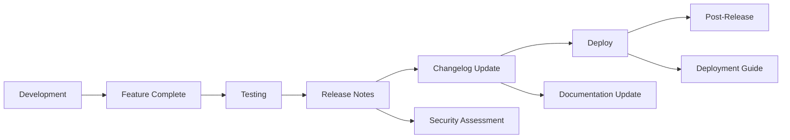

# Release Notes - [Nome do Projeto]

<div align="center">


[](https://github.com/datametria/DATAMETRIA-standards)
[](https://aws.amazon.com/q/)

[🔗 Changelog](CHANGELOG.md) • [📖 Documentação](README.md) • [🐛 Issues](link-para-issues) • [🚀 Demo](link-para-demo)

</div>

---

## 📋 Índice

- [Informações da Release](#informações-da-release)
- [Destaques](#destaques-desta-versão)
- [Novas Funcionalidades](#novas-funcionalidades)
- [Melhorias Técnicas](#melhorias-técnicas)
- [Correções de Bugs](#correções-de-bugs)
- [Breaking Changes](#breaking-changes--limitações)
- [Processo de Atualização](#processo-de-atualização)
- [Requisitos do Sistema](#requisitos-do-sistema)
- [Informações de Segurança](#informações-de-segurança)
- [Próximos Passos](#próximos-passos)
- [Suporte](#suporte-e-feedback)
- [Templates Relacionados](#templates-relacionados)

---

## 📊 Informações da Release

### Versão X.Y.Z - "[descrição curta da release]"

| Campo | Valor |
|-------|-------|
| **Data de Lançamento** | 06/09/2025 |
| **Tipo de Release** | [Major/Minor/Patch] Release |
| **Status** | [Estável para Produção/Beta/Alpha] |
| **Compatibilidade** | [Compatível/Breaking Changes] |
| **Tempo de Desenvolvimento** | [X] semanas |
| **Issues Fechadas** | [X] issues |
| **Pull Requests** | [X] PRs |
| **Contribuidores** | [X] pessoas |

### 🌟 Destaques desta Versão

[Descrição geral das principais funcionalidades e melhorias desta versão]

### 🚀 Novas Funcionalidades

#### [Nome da Funcionalidade 1]

- **[Recurso]**: [Descrição detalhada]
- **[Recurso]**: [Descrição detalhada]
- **Impacto**: [Alto/Médio/Baixo] - [Justificativa]

#### [Nome da Funcionalidade 2]

- **[Recurso]**: [Descrição detalhada]
- **[Recurso]**: [Descrição detalhada]
- **Impacto**: [Alto/Médio/Baixo] - [Justificativa]

### 🔧 Melhorias Técnicas

#### Performance

- **[Melhoria]**: [Descrição] - [% de melhoria]

#### Arquitetura

- **[Melhoria]**: [Descrição]

#### Qualidade de Código

- **[Melhoria]**: [Descrição]

### 📚 Documentação

#### [Tipo de Documentação]

- **[Documento]**: [Descrição]
- **[Documento]**: [Descrição]

### 🛠️ Requisitos do Sistema

#### Requisitos Mínimos

- **[Tecnologia]**: [Versão] ou superior
- **[Recurso]**: [Especificação]

#### Dependências Principais

- **[Dependência]**: [Versão] ([descrição])
- **[Dependência]**: [Versão] ([descrição])

### 🔄 Processo de Atualização

#### Para Novas Instalações

```bash
[comandos de instalação]
```

#### Migração de Versões Anteriores

[Instruções de migração ou indicação se não há processo necessário]

### 🐛 Correções de Bugs

#### Críticos

- **[Bug]**: [Descrição da correção] - Issue #[número]

#### Menores

- **[Bug]**: [Descrição da correção] - Issue #[número]

#### Melhorias de UX

- **[Bug]**: [Descrição da correção] - Issue #[número]

### ⚠️ Breaking Changes & Limitações

#### Breaking Changes

- **[Mudança]**: [Descrição do impacto e como migrar]
- **[Mudança]**: [Descrição do impacto e como migrar]

#### Limitações Conhecidas

- **[Limitação]**: [Descrição] (planejado para v[X.Y.Z])
- **[Limitação]**: [Descrição] (planejado para v[X.Y.Z])

#### Workarounds Temporários

- **[Problema]**: [Solução temporária]
- **[Problema]**: [Solução temporária]

### 🔮 Próximos Passos

#### Versão [X.Y.Z] ([Data])

- [Funcionalidade planejada]
- [Funcionalidade planejada]

### 📞 Suporte e Feedback

#### Canais de Suporte

- **Issues**: [Link para issues]
- **Documentação**: [Link para documentação]
- **Email**: [email de suporte]

#### Como Reportar Bugs

1. [Passo 1]
2. [Passo 2]
3. [Passo 3]

### 🏆 Agradecimentos

#### Equipe de Desenvolvimento

- **[Nome]**: [Contribuição]
- **[Nome]**: [Contribuição]

### 📊 Estatísticas da Release

#### Métricas de Desenvolvimento

- **Linhas de Código**: [número] (+/-[diferença] da versão anterior)
- **Arquivos Modificados**: [número]
- **Commits**: [número]
- **Issues Fechadas**: [número]
- **Pull Requests**: [número]
- **Tempo de Desenvolvimento**: [período]
- **Cobertura de Testes**: [%] (+/-[diferença]%)

### 🔐 Informações de Segurança

#### Vulnerabilidades Corrigidas

- **[CVE/ID]**: [Descrição] - Severidade: [Alta/Média/Baixa]

#### Vulnerabilidades Conhecidas

[Descrição ou "Nenhuma vulnerabilidade crítica conhecida"]

#### Recomendações de Segurança

- [Recomendação 1]
- [Recomendação 2]

#### Auditoria de Dependências

- **Dependências Atualizadas**: [número]
- **Vulnerabilidades em Dependências**: [número] (resolvidas: [número])

### 🎯 Checklist de Release

- [ ] Testes automatizados executados com sucesso
- [ ] Documentação atualizada
- [ ] Changelog atualizado
- [ ] Backup de produção realizado
- [ ] Plano de rollback preparado
- [ ] Stakeholders notificados

---

**Preparado por**: [Nome] - [Data]
**Revisado por**: [Nome] - [Data]
**Aprovado por**: [Nome] - [Data]
**Data de Publicação**: 06/09/2025

---

### 📋 Links Úteis

- [CHANGELOG.md](CHANGELOG.md)
- [Documentação Completa](README.md)
- [Issues da Release](link-para-milestone)
- [Guia de Migração](link-para-guia)
- [Ambiente de Demonstração](link-para-demo)

---

## 📝 Markdown Linting

### Configuração Markdownlint

Para evitar erros MD047 (files should end with a single newline character):

1. **Sempre terminar arquivos .md com uma linha em branco**
2. **Configurar editor para inserir newline final automaticamente**
3. **Usar pre-commit hooks para validação automática**

#### VS Code Settings

```json
{
  "files.insertFinalNewline": true,
  "files.trimFinalNewlines": true
}
```

---

## 🔄 Templates Relacionados

### Templates DATAMETRIA

| Template | Descrição | Quando Usar |
|----------|-----------|-------------|
| **[Changelog](template-changelog.md)** | Histórico de mudanças | Manter registro de todas as versões |
| **[README](template-readme.md)** | Documentação principal | Documentação geral do projeto |
| **[Feature Documentation](template-feature-documentation.md)** | Documentação de funcionalidades | Detalhar novas features |
| **[Deployment Guide](template-deployment-guide.md)** | Guia de deploy | Instruções de deployment |
| **[Security Assessment](template-security-assessment.md)** | Avaliação de segurança | Auditorias de segurança |

### Diretrizes Relacionadas

| Diretriz | Aplicação | Link |
|----------|-----------|------|
| **[Documentation](datametria_std_documentation.md)** | Padrões de documentação | Para todas as releases |
| **[Security Development](datametria_std_security.md)** | Práticas de segurança | Para releases com correções de segurança |
| **[Web Development](datametria_std_web_dev.md)** | Projetos web | Para releases de aplicações web |
| **[Mobile Flutter](datametria_std_mobile_flutter.md)** | Projetos mobile | Para releases de apps móveis |

### Fluxo de Release



---

<div align="center">

**Desenvolvido com ❤️ seguindo os padrões [DATAMETRIA](https://github.com/datametria/DATAMETRIA-standards)**

⭐ **Se este projeto te ajudou, considere dar uma estrela!** ⭐

</div>
