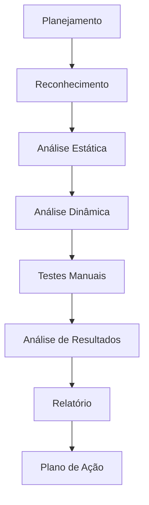
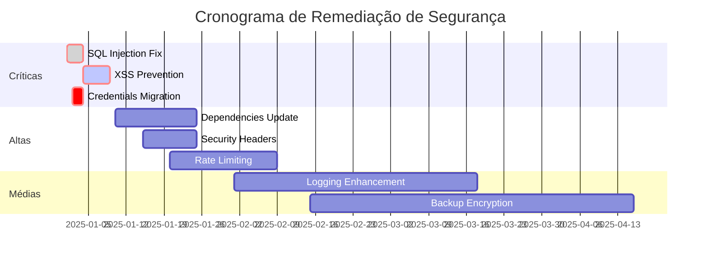
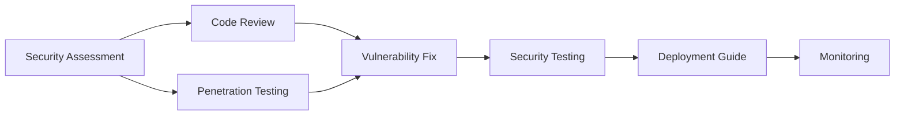

# Security Assessment - [Nome do Projeto]

<div align="center">


## Avaliação de Segurança Completa

**Versão**: [X.Y.Z] | **Data da Avaliação**: [DD/MM/AAAA] | **Auditor**: [Nome do Auditor]

[](link-assessment)
[](https://owasp.org/Top10/)
[](link-compliance)
[](https://github.com/datametria/DATAMETRIA-standards)
[](https://aws.amazon.com/q/)

[📊 Dashboard](link-dashboard) • [🔍 Scan Results](link-scan) • [📋 Action Plan](link-plan) • [🔄 Templates Relacionados](#templates-relacionados)

</div>

---

## 📋 Índice

- [Resumo Executivo](#resumo-executivo)
- [Escopo da Avaliação](#escopo-da-avaliacao)
- [Metodologia](#metodologia)
- [Vulnerabilidades Identificadas](#vulnerabilidades-identificadas)
- [Análise OWASP Top 10](#analise-owasp-top-10)
- [Testes de Penetração](#testes-de-penetracao)
- [Análise de Código](#analise-de-codigo)
- [Configuração de Infraestrutura](#infraestrutura)
- [Compliance e Regulamentações](#compliance-e-regulamentacoes)
- [Plano de Ação](#plano-de-acao)
- [Recomendações](#recomendacoes)
- [Anexos](#anexos)

---

## 📊 Resumo Executivo

### Visão Geral

[Resumo da avaliação de segurança, principais achados e recomendações críticas]

### Score de Segurança

<div align="center">

#### Score Geral: [X]/10

| Categoria | Score | Status |
|-----------|-------|--------|
| **Autenticação** | [X]/10 |  |
| **Autorização** | [X]/10 |  |
| **Criptografia** | [X]/10 |  |
| **Validação de Entrada** | [X]/10 |  |
| **Configuração** | [X]/10 |  |

</div>

### Resumo de Vulnerabilidades

| Severidade | Quantidade | Resolvidas | Pendentes |
|------------|------------|------------|-----------|
| **🔴 Crítica** | [X] | [X] | [X] |
| **🟠 Alta** | [X] | [X] | [X] |
| **🟡 Média** | [X] | [X] | [X] |
| **🟢 Baixa** | [X] | [X] | [X] |
| **🔵 Info** | [X] | [X] | [X] |

### Principais Achados

- **🔴 [Vulnerabilidade Crítica]**: [Descrição breve]
- **🟠 [Vulnerabilidade Alta]**: [Descrição breve]
- **🟡 [Vulnerabilidade Média]**: [Descrição breve]

---

## 🎯 Escopo da Avaliação

### Aplicações Avaliadas

| Aplicação | Versão | URL | Tecnologia |
|-----------|--------|-----|------------|
| **[Nome da App]** | [X.Y.Z] | [URL] | [Flask/Vue.js] |
| **[API Backend]** | [X.Y.Z] | [URL] | [Flask-RESTX] |
| **[Frontend]** | [X.Y.Z] | [URL] | [Vue.js 3] |

### Infraestrutura

- **Servidores**: [Quantidade] servidores
- **Banco de Dados**: [Tipo e versão]
- **Load Balancer**: [Tipo]
- **CDN**: [Provedor]
- **Cloud Provider**: [AWS/Azure/GCP]

### Período de Avaliação

- **Início**: [DD/MM/AAAA]
- **Término**: [DD/MM/AAAA]
- **Duração**: [X] dias úteis

### Limitações

- [Limitação 1 do escopo]
- [Limitação 2 do escopo]
- [Limitação 3 do escopo]

---

## 🔬 Metodologia

### Frameworks Utilizados

- **OWASP Top 10 2021**: Vulnerabilidades web mais críticas
- **NIST Cybersecurity Framework**: Identificar, Proteger, Detectar, Responder, Recuperar
- **ISO 27001**: Gestão de segurança da informação
- **LGPD**: Conformidade com proteção de dados

### Ferramentas de Análise

#### Análise Estática (SAST)

- **SonarQube**: Análise de qualidade e segurança do código
- **Bandit**: Scanner de segurança para Python
- **ESLint Security**: Regras de segurança para JavaScript

#### Análise Dinâmica (DAST)

- **OWASP ZAP**: Proxy de interceptação e scanner
- **Burp Suite**: Testes de penetração web
- **Nmap**: Descoberta de rede e auditoria de segurança

#### Análise de Dependências (SCA)

- **Snyk**: Vulnerabilidades em dependências
- **Safety**: Verificação de pacotes Python
- **npm audit**: Auditoria de pacotes Node.js

### Processo de Avaliação



---

## 🚨 Vulnerabilidades Identificadas

### 🔴 Críticas

#### VULN-001: [Nome da Vulnerabilidade]

**Severidade**: Crítica
**CVSS Score**: [X.X]
**CWE**: [CWE-XXX]

**Descrição**:
[Descrição detalhada da vulnerabilidade]

**Localização**:

- **Arquivo**: `[caminho/para/arquivo.py]`
- **Linha**: [XXX]
- **Endpoint**: `[/api/endpoint]`

**Impacto**:

- [Impacto 1]
- [Impacto 2]
- [Impacto 3]

**Prova de Conceito**:

```bash
# Exemplo de exploração
curl -X POST "https://app.exemplo.com/api/login" \
  -H "Content-Type: application/json" \
  -d '{"username": "admin'\''--", "password": "any"}'
```

**Remediação**:

```python
# Código vulnerável
query = f"SELECT * FROM users WHERE username = '{username}'"

# Código corrigido
query = "SELECT * FROM users WHERE username = %s"
cursor.execute(query, (username,))
```

**Prazo**: [X] dias
**Responsável**: [Nome]
**Status**: [Pendente/Em Progresso/Resolvido]

---

### 🟠 Altas

#### VULN-002: [Nome da Vulnerabilidade]

**Severidade**: Alta
**CVSS Score**: [X.X]

**Descrição**: [Descrição resumida]

**Impacto**: [Impacto principal]

**Remediação**: [Solução resumida]

**Prazo**: [X] dias

---

### 🟡 Médias

#### VULN-003: [Nome da Vulnerabilidade]

**Severidade**: Média
**CVSS Score**: [X.X]

**Descrição**: [Descrição resumida]

**Remediação**: [Solução resumida]

---

## 🛡️ Análise OWASP Top 10

### A01:2021 – Broken Access Control

**Status**: ⚠️ Vulnerável
**Achados**: [X] vulnerabilidades

**Problemas Identificados**:

- Falta de validação de autorização em endpoints sensíveis
- Exposição de IDs sequenciais permitindo enumeração
- Bypass de controle de acesso via manipulação de parâmetros

**Recomendações**:

- Implementar controle de acesso baseado em roles (RBAC)
- Validar autorização em todas as operações
- Usar UUIDs em vez de IDs sequenciais

### A02:2021 – Cryptographic Failures

**Status**: ✅ Seguro
**Achados**: [X] vulnerabilidades menores

**Pontos Positivos**:

- HTTPS implementado corretamente
- Senhas hasheadas com bcrypt
- Tokens JWT assinados adequadamente

**Melhorias**:

- Implementar rotação automática de chaves
- Usar algoritmos mais robustos para dados sensíveis

### A03:2021 – Injection

**Status**: 🔴 Crítico
**Achados**: [X] vulnerabilidades

**Problemas Identificados**:

- SQL Injection em endpoints de busca
- Command Injection em funcionalidade de upload
- XSS refletido em campos de entrada

**Recomendações**:

- Usar prepared statements para todas as queries
- Implementar validação rigorosa de entrada
- Sanitizar outputs antes da renderização

### A04:2021 – Insecure Design

**Status**: ⚠️ Atenção
**Achados**: [X] problemas de design

**Problemas Identificados**:

- Falta de rate limiting em endpoints críticos
- Ausência de logs de auditoria
- Processo de recuperação de senha inseguro

### A05:2021 – Security Misconfiguration

**Status**: 🟡 Parcialmente Seguro
**Achados**: [X] configurações inseguras

**Problemas Identificados**:

- Headers de segurança ausentes
- Informações de debug expostas em produção
- Permissões excessivas em arquivos

### A06:2021 – Vulnerable Components

**Status**: 🔴 Crítico
**Achados**: [X] componentes vulneráveis

**Componentes Vulneráveis**:

- Flask 1.1.4 (CVE-2023-30861)
- jQuery 3.5.1 (CVE-2020-11022)
- Pillow 8.3.2 (CVE-2022-22817)

### A07:2021 – Authentication Failures

**Status**: ⚠️ Vulnerável
**Achados**: [X] falhas de autenticação

**Problemas Identificados**:

- Ausência de bloqueio por tentativas de login
- Tokens de sessão não invalidados no logout
- Política de senhas fraca

### A08:2021 – Software Integrity Failures

**Status**: ✅ Seguro
**Achados**: Nenhuma vulnerabilidade crítica

**Pontos Positivos**:

- Dependências verificadas com checksums
- Pipeline CI/CD com verificações de integridade

### A09:2021 – Logging Failures

**Status**: 🟡 Parcialmente Implementado
**Achados**: [X] falhas de logging

**Problemas Identificados**:

- Logs insuficientes para auditoria
- Informações sensíveis em logs
- Falta de monitoramento em tempo real

### A10:2021 – Server-Side Request Forgery

**Status**: ⚠️ Vulnerável
**Achados**: [X] vulnerabilidades SSRF

**Problemas Identificados**:

- Validação insuficiente de URLs externas
- Possibilidade de acesso a recursos internos

---

## 🎯 Testes de Penetração

### Metodologia

Seguindo a metodologia **OWASP Testing Guide v4.0**:

1. **Information Gathering**
2. **Configuration Management**
3. **Authentication Testing**
4. **Authorization Testing**
5. **Session Management Testing**
6. **Input Validation Testing**
7. **Error Handling**
8. **Cryptography**
9. **Business Logic Testing**
10. **Client Side Testing**

### Resultados dos Testes

#### Reconnaissance

**Objetivo**: Coletar informações sobre o alvo

**Ferramentas Utilizadas**:

- Nmap
- Whatweb
- Dirb/Gobuster

**Achados**:

- Portas abertas: [80, 443, 22]
- Tecnologias identificadas: [Flask, Nginx, PostgreSQL]
- Diretórios expostos: [/admin, /.git, /backup]

#### Vulnerability Assessment

**Testes Automatizados**:

```bash
# OWASP ZAP Baseline Scan
zap-baseline.py -t https://app.exemplo.com -r zap-report.html

# Nikto Web Scanner
nikto -h https://app.exemplo.com -o nikto-report.txt

# SSL Labs Test
ssllabs-scan --host app.exemplo.com
```

**Testes Manuais**:

- Bypass de autenticação
- Escalação de privilégios
- Injeção de código
- Cross-Site Scripting (XSS)
- Cross-Site Request Forgery (CSRF)

---

## 💻 Análise de Código

### Análise Estática (SAST)

#### Ferramentas Utilizadas

| Ferramenta | Linguagem | Vulnerabilidades Encontradas |
|------------|-----------|------------------------------|
| **SonarQube** | Python, JavaScript | [X] issues |
| **Bandit** | Python | [X] issues |
| **ESLint Security** | JavaScript | [X] issues |
| **Semgrep** | Multi-linguagem | [X] issues |

#### Principais Achados

**Código Python**:

```python
# VULNERÁVEL: Hardcoded secrets
API_KEY = "sk-1234567890abcdef"
DB_PASSWORD = "admin123"

# SEGURO: Usar variáveis de ambiente
API_KEY = os.getenv('API_KEY')
DB_PASSWORD = os.getenv('DB_PASSWORD')
```

**Código JavaScript**:

```javascript
// VULNERÁVEL: eval() usage
eval(userInput);

// SEGURO: JSON.parse() com validação
try {
  const data = JSON.parse(userInput);
  // validar data
} catch (e) {
  // handle error
}
```

### Análise de Dependências

#### Vulnerabilidades em Dependências

| Pacote | Versão Atual | Versão Segura | CVE | Severidade |
|--------|--------------|---------------|-----|------------|
| **Flask** | 1.1.4 | 2.3.3 | CVE-2023-30861 | Alta |
| **Pillow** | 8.3.2 | 10.0.1 | CVE-2022-22817 | Média |
| **jQuery** | 3.5.1 | 3.7.1 | CVE-2020-11022 | Média |

#### Comandos de Atualização

```bash
# Python dependencies
pip install --upgrade flask==2.3.3
pip install --upgrade pillow==10.0.1

# JavaScript dependencies
npm update jquery@3.7.1
```

---

## 🏗️ Configuração de Infraestrutura

### Análise de Servidores

#### Web Server (Nginx)

**Configurações Seguras**:

- ✅ HTTPS habilitado
- ✅ HTTP/2 ativo
- ⚠️ Headers de segurança parciais
- ❌ Rate limiting não configurado

**Recomendações**:

```nginx
# Adicionar headers de segurança
add_header X-Frame-Options "SAMEORIGIN" always;
add_header X-Content-Type-Options "nosniff" always;
add_header Referrer-Policy "no-referrer-when-downgrade" always;
add_header Content-Security-Policy "default-src 'self'" always;

# Rate limiting
limit_req_zone $binary_remote_addr zone=api:10m rate=10r/s;
limit_req zone=api burst=20 nodelay;
```

#### Database (PostgreSQL)

**Configurações Analisadas**:

- ✅ Conexões SSL obrigatórias
- ✅ Usuários com privilégios mínimos
- ⚠️ Logs de auditoria parciais
- ❌ Backup encryption não configurado

**Recomendações**:

```sql
-- Habilitar log de auditoria
ALTER SYSTEM SET log_statement = 'all';
ALTER SYSTEM SET log_connections = on;
ALTER SYSTEM SET log_disconnections = on;

-- Configurar backup encryption
SET archive_command = 'pgbackrest --stanza=main archive-push %p';
```

### Cloud Security (AWS)

#### IAM Policies

**Problemas Identificados**:

- Políticas muito permissivas
- Usuários com acesso desnecessário
- Falta de MFA em contas administrativas

**Política Recomendada**:

```json
{
  "Version": "2012-10-17",
  "Statement": [
    {
      "Effect": "Allow",
      "Action": [
        "s3:GetObject",
        "s3:PutObject"
      ],
      "Resource": "arn:aws:s3:::app-bucket/*"
    }
  ]
}
```

#### Security Groups

**Regras Atuais**:

- ✅ SSH restrito a IPs específicos
- ⚠️ HTTP/HTTPS aberto para 0.0.0.0/0
- ❌ Portas de debug abertas

---

## 📋 Compliance e Regulamentações

### LGPD (Lei Geral de Proteção de Dados)

#### Conformidade Atual

| Requisito | Status | Observações |
|-----------|--------|-------------|
| **Consentimento** | ⚠️ Parcial | Falta granularidade |
| **Direito ao Esquecimento** | ❌ Não implementado | Necessário desenvolver |
| **Portabilidade** | ✅ Implementado | Export em JSON |
| **Logs de Acesso** | ⚠️ Parcial | Falta detalhamento |
| **DPO Designado** | ✅ Implementado | [Nome do DPO] |

#### Plano de Adequação LGPD

1. **Implementar consentimento granular**
   - Prazo: 30 dias
   - Responsável: [Nome]

2. **Desenvolver funcionalidade de exclusão**
   - Prazo: 45 dias
   - Responsável: [Nome]

3. **Melhorar logs de auditoria**
   - Prazo: 15 dias
   - Responsável: [Nome]

### GDPR (General Data Protection Regulation)

#### Status de Conformidade

- ✅ **Privacy by Design**: Implementado
- ✅ **Data Minimization**: Coletamos apenas dados necessários
- ⚠️ **Consent Management**: Precisa melhorias
- ❌ **Data Breach Notification**: Processo não definido

### SOX (Sarbanes-Oxley)

#### Controles Financeiros

- ✅ **Segregação de Funções**: Implementada
- ✅ **Trilha de Auditoria**: Logs financeiros completos
- ⚠️ **Controle de Acesso**: Revisão trimestral necessária

---

## 📋 Plano de Ação

### Prioridade Crítica (0-7 dias)

| ID | Vulnerabilidade | Ação | Responsável | Prazo |
|----|-----------------|------|-------------|-------|
| VULN-001 | SQL Injection | Implementar prepared statements | [Dev Team] | 3 dias |
| VULN-002 | XSS Refletido | Sanitizar inputs | [Dev Team] | 5 dias |
| VULN-003 | Credenciais Hardcoded | Migrar para env vars | [DevOps] | 2 dias |

### Prioridade Alta (8-30 dias)

| ID | Vulnerabilidade | Ação | Responsável | Prazo |
|----|-----------------|------|-------------|-------|
| VULN-004 | Componentes Desatualizados | Atualizar dependências | [Dev Team] | 15 dias |
| VULN-005 | Headers de Segurança | Configurar Nginx | [DevOps] | 10 dias |
| VULN-006 | Rate Limiting | Implementar throttling | [Dev Team] | 20 dias |

### Prioridade Média (31-90 dias)

| ID | Vulnerabilidade | Ação | Responsável | Prazo |
|----|-----------------|------|-------------|-------|
| VULN-007 | Logs Insuficientes | Melhorar logging | [Dev Team] | 45 dias |
| VULN-008 | Backup Encryption | Configurar encryption | [DevOps] | 60 dias |

### Cronograma de Implementação



---

## 💡 Recomendações

### Recomendações Imediatas

#### 1. Implementar Security Headers

```nginx
# Configuração Nginx recomendada
add_header Strict-Transport-Security "max-age=31536000; includeSubDomains" always;
add_header X-Frame-Options "SAMEORIGIN" always;
add_header X-Content-Type-Options "nosniff" always;
add_header Referrer-Policy "strict-origin-when-cross-origin" always;
add_header Content-Security-Policy "default-src 'self'; script-src 'self' 'unsafe-inline'; style-src 'self' 'unsafe-inline'" always;
```

#### 2. Configurar Rate Limiting

```python
# Flask-Limiter configuration
from flask_limiter import Limiter
from flask_limiter.util import get_remote_address

limiter = Limiter(
    app,
    key_func=get_remote_address,
    default_limits=["200 per day", "50 per hour"]
)

@app.route('/api/login', methods=['POST'])
@limiter.limit("5 per minute")
def login():
    # login logic
    pass
```

#### 3. Implementar Logging de Segurança

```python
import logging
from flask import request

# Security event logging
security_logger = logging.getLogger('security')

def log_security_event(event_type, user_id=None, ip_address=None, details=None):
    security_logger.warning({
        'event_type': event_type,
        'user_id': user_id,
        'ip_address': ip_address or request.remote_addr,
        'timestamp': datetime.utcnow().isoformat(),
        'details': details
    })
```

### Recomendações de Longo Prazo

#### 1. Implementar Zero Trust Architecture

- Verificação contínua de identidade
- Princípio de menor privilégio
- Microsegmentação de rede

#### 2. Programa de Bug Bounty

- Estabelecer programa de recompensas
- Definir escopo e regras
- Processo de triagem e resposta

#### 3. Security Training

- Treinamento regular da equipe
- Simulações de phishing
- Workshops de secure coding

---

## 📊 Métricas de Segurança

### KPIs de Segurança

| Métrica | Valor Atual | Meta | Status |
|---------|-------------|------|--------|
| **Vulnerabilidades Críticas** | [X] | 0 | 🔴 |
| **Tempo Médio de Correção** | [X] dias | < 7 dias | ⚠️ |
| **Cobertura de Testes** | [X]% | > 80% | ✅ |
| **Incidentes de Segurança** | [X]/mês | < 2/mês | ⚠️ |
| **Compliance Score** | [X]% | > 95% | 🔴 |

### Evolução Mensal

```mermaid
line
    title Evolução das Vulnerabilidades
    x-axis [Jan, Fev, Mar, Abr, Mai, Jun]
    y-axis "Número de Vulnerabilidades" 0 --> 50
    "Críticas" : [15, 12, 8, 5, 2, 0]
    "Altas" : [25, 20, 18, 15, 10, 8]
    "Médias" : [40, 35, 30, 25, 20, 15]
```

---

## 📎 Anexos

### Anexo A: Relatórios de Ferramentas

- [SonarQube Report](anexos/sonarqube-report.pdf)
- [OWASP ZAP Report](anexos/zap-report.html)
- [Burp Suite Report](anexos/burp-report.pdf)
- [Nessus Scan Results](anexos/nessus-results.pdf)

### Anexo B: Evidências de Vulnerabilidades

- [Screenshots de PoCs](anexos/poc-screenshots/)
- [Logs de Exploração](anexos/exploitation-logs/)
- [Network Captures](anexos/pcap-files/)

### Anexo C: Configurações Recomendadas

- [Nginx Security Config](anexos/nginx-security.conf)
- [PostgreSQL Hardening](anexos/postgresql-hardening.sql)
- [AWS Security Policies](anexos/aws-policies.json)

### Anexo D: Compliance Checklists

- [LGPD Compliance Checklist](anexos/lgpd-checklist.pdf)
- [OWASP Top 10 Checklist](anexos/owasp-checklist.pdf)
- [ISO 27001 Controls](anexos/iso27001-controls.pdf)

---

## 🔄 Templates Relacionados

### Templates DATAMETRIA

| Template | Descrição | Quando Usar |
|----------|-----------|-------------|
| **[Code Review](template-code-review.md)** | Revisão de código | Análise de segurança em código |
| **[Feature Documentation](template-feature-documentation.md)** | Documentação de features | Documentar controles de segurança |
| **[Deployment Guide](template-deployment-guide.md)** | Guia de deploy | Deploy seguro em produção |
| **[Technical Specification](template-technical-specification.md)** | Especificação técnica | Arquitetura de segurança |

### Diretrizes Relacionadas

| Diretriz | Aplicação | Link |
|----------|-----------|------|
| **[Security Development](datametria_std_security.md)** | Desenvolvimento seguro | Práticas de segurança |
| **[Web Development](datametria_std_web_dev.md)** | Aplicações web | Segurança em Flask/Vue.js |
| **[AWS Development](datametria_std_aws_development.md)** | Cloud security | Segurança na AWS |
| **[Logging Enterprise](datametria_std_logging.md)** | Logs de segurança | Auditoria e compliance |

### Fluxo de Segurança



---

<div align="center">

**Desenvolvido com ❤️ seguindo os padrões [DATAMETRIA](https://github.com/datametria/DATAMETRIA-standards)**

⭐ **Se este projeto te ajudou, considere dar uma estrela!** ⭐

</div>
