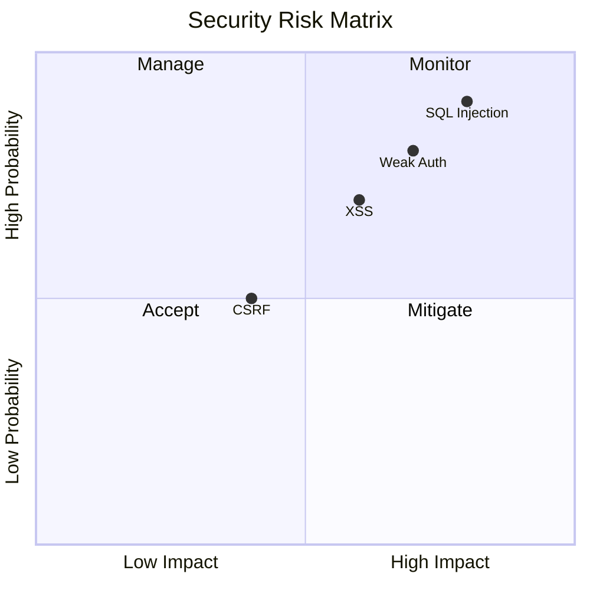
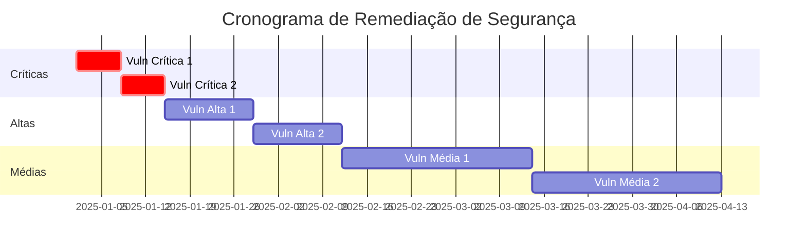
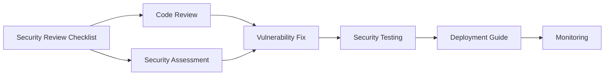

# Checklist de Security Review

<div align="center">


## Checklist Completo para Revisão de Segurança

[](https://datametria.io)
[](https://owasp.org)
[](https://github.com/datametria/DATAMETRIA-standards)
[](https://aws.amazon.com/q/)

[🔐 Autenticação](#autenticacao-e-autorizacao) • [🛡️ Proteção](#protecao-de-dados) • [🌐 Web Security](#web-security) •
[📱 Mobile](#mobile-security) • [☁️ Cloud](#cloud-security) • [🔄 Templates Relacionados](#templates-relacionados)

</div>

---

## 📋 Informações da Revisão

| Campo | Descrição |
|-------|-----------|
| **Aplicação** | [Nome da aplicação] |
| **Versão** | [Versão da aplicação] |
| **Reviewer** | [Nome do security engineer] |
| **Data da Revisão** | [DD/MM/AAAA] |
| **Tipo de Review** | [Code Review/Penetration Test/Audit] |
| **Criticidade** | [Baixa/Média/Alta/Crítica] |
| **Ambiente** | [Development/Staging/Production] |

---

## 🔐 Autenticação e Autorização

### Autenticação

- [ ] **Senhas seguras**: Política de senhas forte implementada
- [ ] **Hash de senhas**: Senhas são hasheadas com algoritmo seguro (bcrypt, Argon2)
- [ ] **Salt único**: Cada senha tem salt único
- [ ] **2FA/MFA**: Autenticação multifator disponível
- [ ] **Bloqueio de conta**: Conta é bloqueada após tentativas falhadas
- [ ] **Session timeout**: Sessões expiram após inatividade
- [ ] **Logout seguro**: Logout invalida sessão completamente

```python
# ✅ Bom - Hash seguro com bcrypt
import bcrypt

password_hash = bcrypt.hashpw(password.encode('utf-8'), bcrypt.gensalt())

# ❌ Ruim - Hash inseguro
import hashlib
password_hash = hashlib.md5(password.encode()).hexdigest()
```

### Autorização

- [ ] **Princípio do menor privilégio**: Usuários têm apenas permissões necessárias
- [ ] **Role-based access**: Controle de acesso baseado em roles
- [ ] **Resource-level permissions**: Permissões específicas por recurso
- [ ] **Vertical privilege escalation**: Proteção contra escalação vertical
- [ ] **Horizontal privilege escalation**: Proteção contra escalação horizontal
- [ ] **API authorization**: APIs verificam autorização em cada endpoint

### JWT e Tokens

- [ ] **JWT assinado**: Tokens JWT são assinados
- [ ] **Algoritmo seguro**: Usa algoritmos seguros (RS256, ES256)
- [ ] **Expiração curta**: Tokens têm tempo de vida curto
- [ ] **Refresh tokens**: Implementa refresh tokens
- [ ] **Token revocation**: Tokens podem ser revogados
- [ ] **Secure storage**: Tokens são armazenados de forma segura

---

## 🛡️ Proteção de Dados

### Dados em Trânsito

- [ ] **HTTPS obrigatório**: Toda comunicação usa HTTPS
- [ ] **TLS versão**: Usa TLS 1.2 ou superior
- [ ] **Certificate pinning**: Implementa certificate pinning (mobile)
- [ ] **HSTS headers**: Headers HSTS configurados
- [ ] **Secure cookies**: Cookies têm flags Secure e HttpOnly

### Dados em Repouso

- [ ] **Criptografia de banco**: Dados sensíveis criptografados no banco
- [ ] **Encryption at rest**: Arquivos sensíveis criptografados
- [ ] **Key management**: Chaves são gerenciadas adequadamente
- [ ] **Backup encryption**: Backups são criptografados
- [ ] **Secure deletion**: Dados são deletados de forma segura

### Dados Sensíveis

- [ ] **PII identification**: Dados pessoais são identificados
- [ ] **Data classification**: Dados são classificados por sensibilidade
- [ ] **Masking/Tokenization**: Dados sensíveis são mascarados
- [ ] **Secure logging**: Dados sensíveis não aparecem em logs
- [ ] **Environment separation**: Dados de produção não em desenvolvimento

```python
# ✅ Bom - Mascaramento de dados sensíveis
def mask_credit_card(card_number: str) -> str:
    return f"****-****-****-{card_number[-4:]}"

# ❌ Ruim - Dados sensíveis em logs
logger.info(f"Processing payment for card: {card_number}")
```

---

## 🌐 Web Security

### OWASP Top 10

- [ ] **A01 - Broken Access Control**: Controle de acesso implementado
- [ ] **A02 - Cryptographic Failures**: Criptografia adequada
- [ ] **A03 - Injection**: Proteção contra injeção
- [ ] **A04 - Insecure Design**: Design seguro implementado
- [ ] **A05 - Security Misconfiguration**: Configuração segura
- [ ] **A06 - Vulnerable Components**: Componentes atualizados
- [ ] **A07 - Authentication Failures**: Autenticação robusta
- [ ] **A08 - Software Integrity**: Integridade do software
- [ ] **A09 - Logging Failures**: Logging de segurança
- [ ] **A10 - SSRF**: Proteção contra SSRF

### Injection Attacks

- [ ] **SQL Injection**: Usa prepared statements/ORM
- [ ] **NoSQL Injection**: Validação adequada para NoSQL
- [ ] **Command Injection**: Não executa comandos do usuário
- [ ] **LDAP Injection**: Sanitização de queries LDAP
- [ ] **XPath Injection**: Proteção contra XPath injection

```python
# ✅ Bom - Prepared statement
cursor.execute("SELECT * FROM users WHERE id = %s", (user_id,))

# ❌ Ruim - SQL injection vulnerável
cursor.execute(f"SELECT * FROM users WHERE id = {user_id}")
```

### Cross-Site Attacks

- [ ] **XSS Prevention**: Output encoding implementado
- [ ] **CSP Headers**: Content Security Policy configurado
- [ ] **CSRF Protection**: Tokens CSRF implementados
- [ ] **Clickjacking**: X-Frame-Options configurado
- [ ] **CORS Configuration**: CORS configurado adequadamente

### Headers de Segurança

- [ ] **X-Content-Type-Options**: nosniff configurado
- [ ] **X-Frame-Options**: DENY ou SAMEORIGIN
- [ ] **X-XSS-Protection**: 1; mode=block
- [ ] **Referrer-Policy**: Política adequada
- [ ] **Permissions-Policy**: Permissões restritivas

```nginx
# Configuração de headers de segurança
add_header X-Content-Type-Options nosniff;
add_header X-Frame-Options DENY;
add_header X-XSS-Protection "1; mode=block";
add_header Strict-Transport-Security "max-age=31536000; includeSubDomains";
```

---

## 📱 Mobile Security

### Armazenamento Seguro

- [ ] **Keychain/Keystore**: Dados sensíveis no keychain/keystore
- [ ] **No plain text**: Dados não em texto plano
- [ ] **Secure preferences**: Preferências criptografadas
- [ ] **Database encryption**: Banco local criptografado
- [ ] **Cache security**: Cache não contém dados sensíveis

### Comunicação

- [ ] **Certificate pinning**: Implementado para APIs críticas
- [ ] **Network security config**: Configuração de rede segura (Android)
- [ ] **ATS compliance**: App Transport Security (iOS)
- [ ] **Proxy detection**: Detecta proxies maliciosos
- [ ] **Man-in-the-middle**: Proteção contra MITM

### Proteção de Runtime

- [ ] **Root/Jailbreak detection**: Detecta dispositivos comprometidos
- [ ] **Debugger detection**: Detecta debugging
- [ ] **Emulator detection**: Detecta emuladores
- [ ] **Tampering detection**: Detecta modificações no app
- [ ] **Screen recording**: Bloqueia gravação de tela

```dart
// Flutter - Verificação de root/jailbreak
bool isDeviceSecure = await SafeDevice.isRealDevice &&
                     !await SafeDevice.isJailBroken;
```

---

## ☁️ Cloud Security

### AWS Security

- [ ] **IAM Policies**: Políticas IAM restritivas
- [ ] **S3 Bucket policies**: Buckets não públicos
- [ ] **VPC Configuration**: VPC configurada adequadamente
- [ ] **Security Groups**: Grupos de segurança restritivos
- [ ] **CloudTrail**: Logging de atividades habilitado
- [ ] **GuardDuty**: Detecção de ameaças ativa

### Container Security

- [ ] **Base image security**: Imagens base seguras
- [ ] **Vulnerability scanning**: Scan de vulnerabilidades
- [ ] **Non-root user**: Container não roda como root
- [ ] **Resource limits**: Limites de recursos definidos
- [ ] **Secrets management**: Secrets não em imagens

```dockerfile
# ✅ Bom - Usuário não-root
FROM node:18-alpine
RUN addgroup -g 1001 -S nodejs
RUN adduser -S nextjs -u 1001
USER nextjs

# ❌ Ruim - Roda como root
FROM node:18-alpine
# Sem definição de usuário
```

### Kubernetes Security

- [ ] **RBAC**: Role-based access control configurado
- [ ] **Network policies**: Políticas de rede implementadas
- [ ] **Pod security**: Pod security standards aplicados
- [ ] **Secrets management**: Secrets gerenciados adequadamente
- [ ] **Image scanning**: Imagens escaneadas

---

## 🔍 Input Validation

### Validação de Entrada

- [ ] **Whitelist validation**: Validação por whitelist
- [ ] **Data type validation**: Tipos de dados validados
- [ ] **Length validation**: Comprimento validado
- [ ] **Format validation**: Formato validado (regex)
- [ ] **Range validation**: Faixas de valores validadas
- [ ] **Business logic validation**: Regras de negócio validadas

### Sanitização

- [ ] **HTML sanitization**: HTML sanitizado
- [ ] **URL validation**: URLs validadas
- [ ] **File upload security**: Uploads seguros
- [ ] **Path traversal**: Proteção contra path traversal
- [ ] **Special characters**: Caracteres especiais tratados

```python
# ✅ Bom - Validação robusta
def validate_email(email: str) -> bool:
    pattern = r'^[a-zA-Z0-9._%+-]+@[a-zA-Z0-9.-]+\.[a-zA-Z]{2,}$'
    return re.match(pattern, email) is not None

# ❌ Ruim - Sem validação
def process_user_input(data):
    # Processa dados sem validação
    return data
```

### File Upload Security

- [ ] **File type validation**: Tipos de arquivo validados
- [ ] **File size limits**: Limites de tamanho definidos
- [ ] **Malware scanning**: Arquivos escaneados por malware
- [ ] **Safe storage**: Arquivos armazenados fora do webroot
- [ ] **Execution prevention**: Arquivos não executáveis

```python
# ✅ Bom - Upload seguro
ALLOWED_EXTENSIONS = {'txt', 'pdf', 'png', 'jpg', 'jpeg', 'gif'}
MAX_FILE_SIZE = 16 * 1024 * 1024  # 16MB

def allowed_file(filename):
    return '.' in filename and \
           filename.rsplit('.', 1)[1].lower() in ALLOWED_EXTENSIONS
```

---

## 📊 Logging e Monitoramento

### Security Logging

- [ ] **Authentication events**: Login/logout logados
- [ ] **Authorization failures**: Falhas de autorização logadas
- [ ] **Input validation failures**: Falhas de validação logadas
- [ ] **Security exceptions**: Exceções de segurança logadas
- [ ] **Admin actions**: Ações administrativas logadas
- [ ] **Data access**: Acesso a dados sensíveis logado

### Log Security

- [ ] **No sensitive data**: Dados sensíveis não em logs
- [ ] **Log integrity**: Logs protegidos contra modificação
- [ ] **Centralized logging**: Logs centralizados
- [ ] **Log retention**: Política de retenção definida
- [ ] **Real-time monitoring**: Monitoramento em tempo real

```python
# ✅ Bom - Logging de segurança
import logging
from flask import request

security_logger = logging.getLogger('security')

@app.before_request
def log_security_events():
    if request.endpoint in ['login', 'admin']:
        security_logger.info({
            'event': 'access_attempt',
            'ip': request.remote_addr,
            'endpoint': request.endpoint,
            'user_agent': request.headers.get('User-Agent')
        })
```

### Monitoring e Alertas

- [ ] **Failed login attempts**: Monitoramento de tentativas falhadas
- [ ] **Unusual access patterns**: Padrões de acesso incomuns
- [ ] **Privilege escalation**: Tentativas de escalação
- [ ] **Data exfiltration**: Tentativas de exfiltração
- [ ] **System anomalies**: Anomalias do sistema
- [ ] **Security alerts**: Alertas de segurança configurados

---

## 🔧 DevSecOps

### Secure Development

- [ ] **Security requirements**: Requisitos de segurança definidos
- [ ] **Threat modeling**: Modelagem de ameaças realizada
- [ ] **Secure coding guidelines**: Diretrizes de código seguro
- [ ] **Security training**: Treinamento de segurança da equipe
- [ ] **Code review**: Revisão de código com foco em segurança

### CI/CD Security

- [ ] **SAST integration**: Análise estática integrada
- [ ] **DAST integration**: Análise dinâmica integrada
- [ ] **Dependency scanning**: Scan de dependências
- [ ] **Container scanning**: Scan de containers
- [ ] **Infrastructure as Code**: IaC com segurança
- [ ] **Secrets management**: Gerenciamento de secrets no CI/CD

```yaml
# GitHub Actions - Security Pipeline
name: Security Scan
on: [push, pull_request]

jobs:
  security:
    runs-on: ubuntu-latest
    steps:
      - uses: actions/checkout@v4

      - name: Run SAST
        uses: github/super-linter@v4

      - name: Dependency Check
        uses: dependency-check/Dependency-Check_Action@main

      - name: Container Scan
        uses: aquasecurity/trivy-action@master
```

### Deployment Security

- [ ] **Environment separation**: Ambientes separados
- [ ] **Production hardening**: Produção endurecida
- [ ] **Security configuration**: Configuração de segurança
- [ ] **Monitoring setup**: Monitoramento configurado
- [ ] **Incident response**: Plano de resposta a incidentes
- [ ] **Backup and recovery**: Backup e recuperação

---

## 📋 Compliance e Regulamentações

### LGPD (Lei Geral de Proteção de Dados)

- [ ] **Consentimento**: Consentimento explícito coletado
- [ ] **Finalidade**: Finalidade do tratamento definida
- [ ] **Minimização**: Apenas dados necessários coletados
- [ ] **Direito de acesso**: Usuário pode acessar seus dados
- [ ] **Direito de correção**: Usuário pode corrigir dados
- [ ] **Direito de exclusão**: Usuário pode excluir dados
- [ ] **Portabilidade**: Dados podem ser exportados
- [ ] **DPO**: Data Protection Officer designado

### GDPR (General Data Protection Regulation)

- [ ] **Privacy by Design**: Privacidade por design implementada
- [ ] **Data Protection Impact Assessment**: DPIA realizada
- [ ] **Breach notification**: Processo de notificação de vazamentos
- [ ] **Consent management**: Gerenciamento de consentimento
- [ ] **Right to be forgotten**: Direito ao esquecimento
- [ ] **Data portability**: Portabilidade de dados

### SOX (Sarbanes-Oxley)

- [ ] **Financial controls**: Controles financeiros implementados
- [ ] **Audit trail**: Trilha de auditoria completa
- [ ] **Segregation of duties**: Segregação de funções
- [ ] **Change management**: Gerenciamento de mudanças
- [ ] **Access controls**: Controles de acesso rigorosos

---

## 📊 Métricas de Segurança

### KPIs de Segurança

| Métrica | Valor Atual | Meta | Status |
|---------|-------------|------|--------|
| **Vulnerabilidades Críticas** | [X] | 0 | 🔴/✅ |
| **Tempo Médio de Correção** | [X] dias | < 7 dias | ⚠️/✅ |
| **Cobertura de Testes** | [X]% | > 80% | ⚠️/✅ |
| **Compliance Score** | [X]% | > 95% | ⚠️/✅ |
| **Security Training** | [X]% | 100% | ⚠️/✅ |

### Checklist de Progresso


### Matriz de Risco



---

## 📝 Relatório de Security Review

### Resumo Executivo

| Campo | Valor |
|-------|-------|
| **Total de Itens** | [X] |
| **Itens Aprovados** | [Y] |
| **Itens Reprovados** | [Z] |
| **Score de Segurança** | [X]% |
| **Classificação** | [Baixo/Médio/Alto/Crítico] |
| **Recomendação** | [Aprovar/Reprovar/Aprovar com Restrições] |

### Vulnerabilidades Identificadas

#### Críticas

- [ ] [Vulnerabilidade 1]: [Descrição]
- [ ] [Vulnerabilidade 2]: [Descrição]

#### Altas

- [ ] [Vulnerabilidade 1]: [Descrição]
- [ ] [Vulnerabilidade 2]: [Descrição]

#### Médias

- [ ] [Vulnerabilidade 1]: [Descrição]
- [ ] [Vulnerabilidade 2]: [Descrição]

### Plano de Ação

| Vulnerabilidade | Severidade | Responsável | Prazo | Status |
|-----------------|------------|-------------|-------|--------|
| [Vuln 1] | Crítica | [Nome] | [Data] | 🔴 |
| [Vuln 2] | Alta | [Nome] | [Data] | ⚠️ |
| [Vuln 3] | Média | [Nome] | [Data] | 🟡 |

### Cronograma de Remediação



---

## 🔄 Templates Relacionados

### Templates DATAMETRIA

| Template | Descrição | Quando Usar |
|----------|-----------|-------------|
| **[Security Assessment](template-security-assessment.md)** | Avaliação completa de segurança | Auditoria detalhada de segurança |
| **[Code Review](template-code-review.md)** | Revisão de código | Revisão focada em qualidade |
| **[Feature Documentation](template-feature-documentation.md)** | Documentação de features | Documentar controles de segurança |
| **[Deployment Guide](template-deployment-guide.md)** | Guia de deploy | Deploy seguro em produção |

### Diretrizes Relacionadas

| Diretriz | Aplicação | Link |
|----------|-----------|------|
| **[Security Development](datametria_std_security.md)** | Desenvolvimento seguro | Práticas de segurança |
| **[Web Development](datametria_std_web_dev.md)** | Aplicações web | Segurança em Flask/Vue.js |
| **[Mobile Flutter](datametria_std_mobile_flutter.md)** | Apps móveis | Segurança mobile |
| **[AWS Development](datametria_std_aws_development.md)** | Cloud security | Segurança na AWS |

### Fluxo de Security Review



---

<div align="center">

**Desenvolvido com ❤️ seguindo os padrões [DATAMETRIA](https://github.com/datametria/DATAMETRIA-standards)**

⭐ **Se este projeto te ajudou, considere dar uma estrela!** ⭐

</div>
