# Diagramas de Arquitetura Técnica - [Nome do Projeto]

## Diagramas Completos de Arquitetura Técnica

[🏗️ Arquitetura](#arquitetura-geral-do-sistema) • [🔄 Fluxos](#fluxo-de-dados-principal) •
[🔒 Segurança](#arquitetura-de-seguranca) • [⚡ Performance](#cache-e-performance) •
[📊 Monitoramento](#monitoramento-e-observabilidade) • [🔄 Templates Relacionados](#templates-relacionados)

---

## 📋 Índice

- [Informações do Projeto](#informacoes-do-projeto)
- [Arquitetura Geral](#arquitetura-geral-do-sistema)
- [Fluxo de Dados](#fluxo-de-dados-principal)
- [Arquitetura de Segurança](#arquitetura-de-seguranca)
- [Cache e Performance](#cache-e-performance)
- [Integração de Serviços](#integracao-de-servicos-externos)
- [Monitoramento](#monitoramento-e-observabilidade)
- [Estrutura de Dados](#estrutura-de-dados)
- [Deployment](#arquitetura-de-deployment)

---

## 📝 Informações do Projeto

### Dados Básicos

| Campo | Valor |
|-------|-------|
| **Nome do Projeto** | [Nome do Projeto] |
| **Versão da Arquitetura** | [X.Y.Z] |
| **Data de Criação** | [DD/MM/AAAA] |
| **Última Atualização** | [DD/MM/AAAA] |
| **Arquiteto Responsável** | [Nome] |
| **Tech Lead** | [Nome] |

### Contexto Arquitetural

#### Descrição do sistema

[Descreva brevemente o sistema e sua finalidade]

#### Principais requisitos

- [Requisito funcional 1]
- [Requisito não-funcional 1]
- [Requisito de integração 1]

#### Tecnologias principais

- **Frontend**: [Tecnologia]
- **Backend**: [Tecnologia]
- **Banco de Dados**: [Tecnologia]
- **Cloud Provider**: [AWS/GCP/Azure]

---

## 🏗️ Arquitetura Geral do Sistema

### Visão de Alto Nível

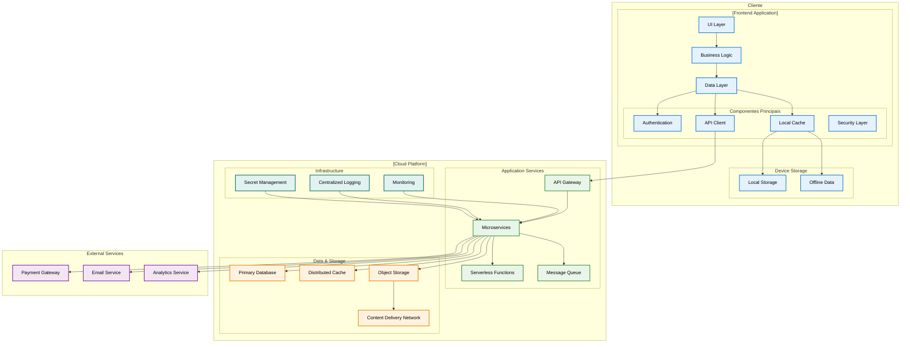

### Componentes Principais

| Componente | Tecnologia | Responsabilidade | Escalabilidade |
|------------|------------|------------------|----------------|
| **[Frontend]** | [Tecnologia] | Interface do usuário | [Estratégia] |
| **[API Gateway]** | [Tecnologia] | Roteamento e autenticação | [Estratégia] |
| **[Microservices]** | [Tecnologia] | Lógica de negócio | [Estratégia] |
| **[Database]** | [Tecnologia] | Persistência de dados | [Estratégia] |
| **[Cache]** | [Tecnologia] | Performance e cache | [Estratégia] |

---

## 🔄 Fluxo de Dados Principal

### Fluxo de Operação Crítica

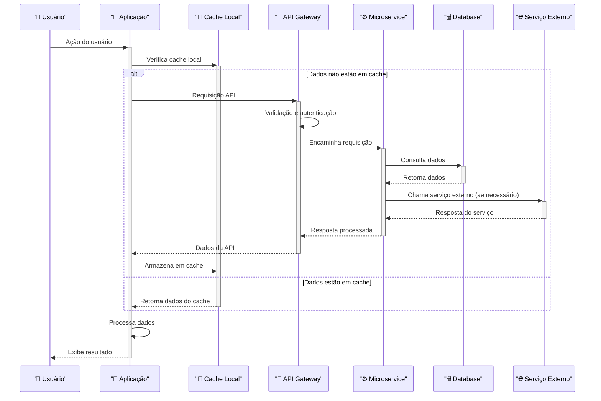

### Fluxo de Dados Assíncronos

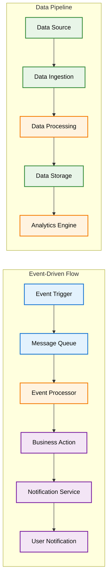

---

## 🔒 Arquitetura de Segurança

### Camadas de Segurança

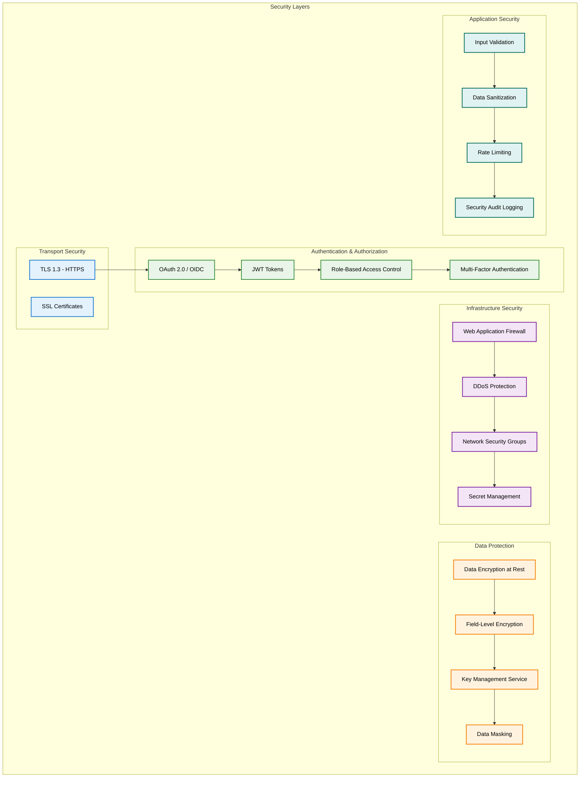

### Fluxo de Autenticação

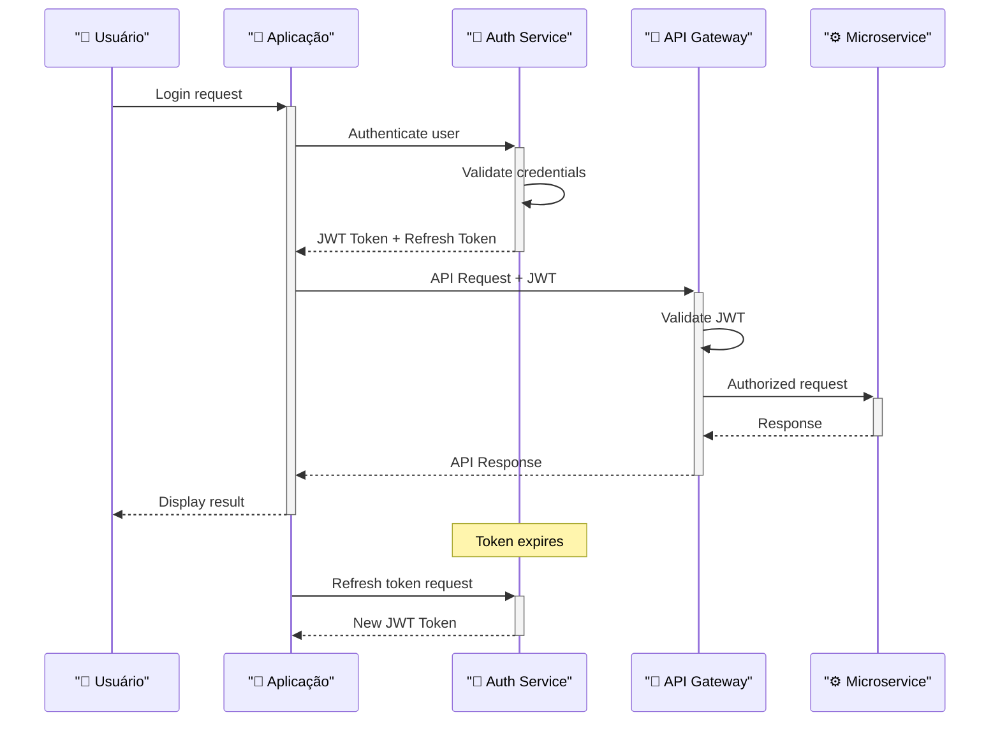

---

## ⚡ Cache e Performance

### Estratégia de Cache

```mermaid
flowchart LR
 subgraph CS["Client-Side Cache"]
        BROWSER["Browser Cache"]
        LOCAL_STORAGE["Local Storage"]
        SESSION["Session Storage"]
        SERVICE_WORKER["Service Worker Cache"]
  end
 subgraph AC["Application Cache"]
        MEMORY["In-Memory Cache"]
        REDIS["Distributed Cache Redis"]
        DATABASE_CACHE["Database Query Cache"]
  end
 subgraph IC["Infrastructure Cache"]
        CDN["Content Delivery Network"]
        REVERSE_PROXY["Reverse Proxy Cache"]
        LOAD_BALANCER["Load Balancer Cache"]
  end
 subgraph CP["Cache Patterns"]
        CACHE_ASIDE["Cache Aside"]
        WRITE_THROUGH["Write Through"]
        WRITE_BEHIND["Write Behind"]
        REFRESH_AHEAD["Refresh Ahead"]
  end
    BROWSER --> LOCAL_STORAGE
    LOCAL_STORAGE --> SESSION
    SESSION --> SERVICE_WORKER
    MEMORY --> REDIS
    REDIS --> DATABASE_CACHE
    CDN --> REVERSE_PROXY
    REVERSE_PROXY --> LOAD_BALANCER
    CACHE_ASIDE --> WRITE_THROUGH
    WRITE_THROUGH --> WRITE_BEHIND
    WRITE_BEHIND --> REFRESH_AHEAD

     BROWSER:::client
     LOCAL_STORAGE:::client
     SESSION:::client
     SERVICE_WORKER:::client
     MEMORY:::application
     REDIS:::application
     DATABASE_CACHE:::application
     CDN:::infrastructure
     REVERSE_PROXY:::infrastructure
     LOAD_BALANCER:::infrastructure
     CACHE_ASIDE:::patterns
     WRITE_THROUGH:::patterns
     WRITE_BEHIND:::patterns
     REFRESH_AHEAD:::patterns
    classDef client fill:#E3F2FD,stroke:#1976D2,stroke-width:2px,color:#000
    classDef application fill:#E8F5E8,stroke:#388E3C,stroke-width:2px,color:#000
    classDef infrastructure fill:#FFF3E0,stroke:#F57C00,stroke-width:2px,color:#000
    classDef patterns fill:#F3E5F5,stroke:#7B1FA2,stroke-width:2px,color:#000
```

### Performance Optimization

```mermaid
graph LR
    subgraph "Performance Optimization"
        subgraph "Frontend Optimization"
            MINIFICATION[Code Minification]
            COMPRESSION[Asset Compression]
            LAZY_LOADING[Lazy Loading]
            CODE_SPLITTING[Code Splitting]
        end

        subgraph "Backend Optimization"
            CONNECTION_POOLING[Connection Pooling]
            QUERY_OPTIMIZATION[Query Optimization]
            ASYNC_PROCESSING[Async Processing]
            CACHING[Intelligent Caching]
        end

        subgraph "Infrastructure Optimization"
            AUTO_SCALING[Auto Scaling]
            LOAD_BALANCING[Load Balancing]
            GEOGRAPHIC_DISTRIBUTION[Geographic Distribution]
            RESOURCE_OPTIMIZATION[Resource Optimization]
        end
    end

    %% Performance Flow
    MINIFICATION --> COMPRESSION
    COMPRESSION --> LAZY_LOADING
    LAZY_LOADING --> CODE_SPLITTING

    CONNECTION_POOLING --> QUERY_OPTIMIZATION
    QUERY_OPTIMIZATION --> ASYNC_PROCESSING
    ASYNC_PROCESSING --> CACHING

    AUTO_SCALING --> LOAD_BALANCING
    LOAD_BALANCING --> GEOGRAPHIC_DISTRIBUTION
    GEOGRAPHIC_DISTRIBUTION --> RESOURCE_OPTIMIZATION

    %% Estilos DATAMETRIA
    classDef frontend fill:#E3F2FD,stroke:#1976D2,stroke-width:2px,color:#000
    classDef backend fill:#E8F5E8,stroke:#388E3C,stroke-width:2px,color:#000
    classDef infrastructure fill:#FFF3E0,stroke:#F57C00,stroke-width:2px,color:#000

    class MINIFICATION,COMPRESSION,LAZY_LOADING,CODE_SPLITTING frontend
    class CONNECTION_POOLING,QUERY_OPTIMIZATION,ASYNC_PROCESSING,CACHING backend
    class AUTO_SCALING,LOAD_BALANCING,GEOGRAPHIC_DISTRIBUTION,RESOURCE_OPTIMIZATION infrastructure
```

---

## 🔌 Integração de Serviços Externos

### Padrões de Integração

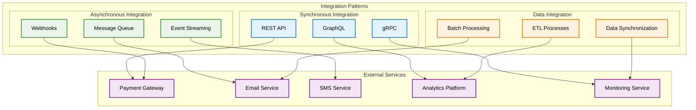

### Circuit Breaker Pattern

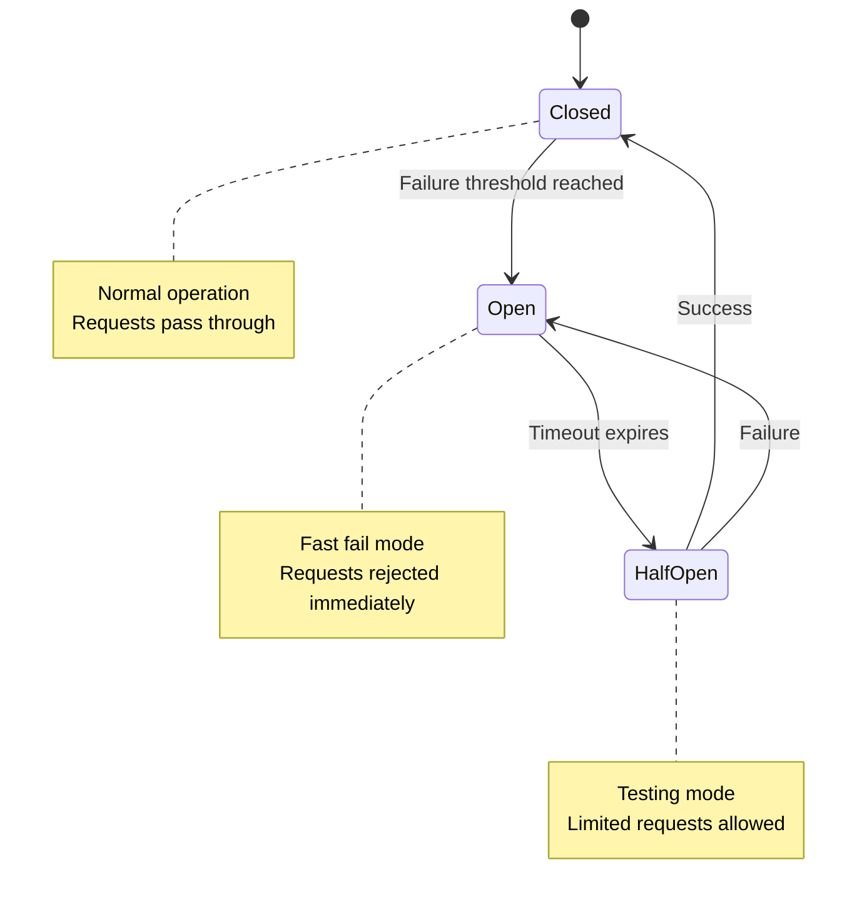

---

## 📊 Monitoramento e Observabilidade

### Stack de Observabilidade

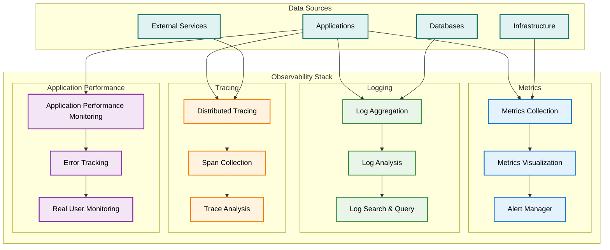

### Métricas Principais

| Categoria | Métrica | Threshold | Ação |
|-----------|---------|-----------|------|
| **Performance** | Response Time | < 200ms | [Ação se exceder] |
| **Availability** | Uptime | > 99.9% | [Ação se abaixo] |
| **Error Rate** | Error Percentage | < 1% | [Ação se exceder] |
| **Throughput** | Requests/sec | [Valor] | [Ação se abaixo] |
| **Resource Usage** | CPU/Memory | < 80% | [Ação se exceder] |

---

## 🗄️ Estrutura de Dados

### Modelo de Dados Principal

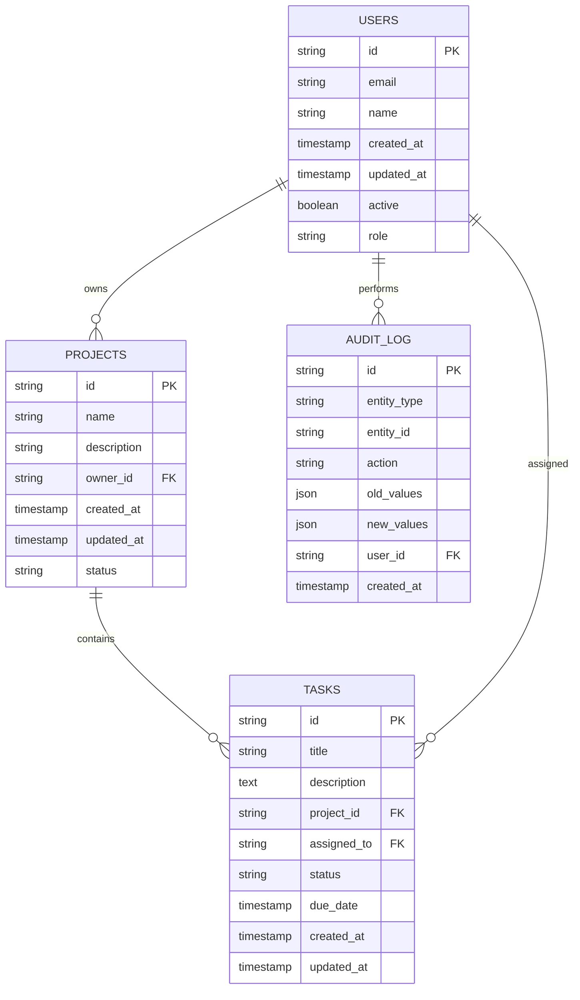

### Estratégia de Dados

| Aspecto | Estratégia | Implementação |
|---------|------------|---------------|
| **Backup** | [Estratégia] | [Como implementar] |
| **Replicação** | [Estratégia] | [Como implementar] |
| **Particionamento** | [Estratégia] | [Como implementar] |
| **Archiving** | [Estratégia] | [Como implementar] |

---

## 🚀 Arquitetura de Deployment

### Ambientes e Pipeline

```mermaid
graph LR
    subgraph "Development"
        DEV_CODE[Source Code]
        DEV_BUILD[Build Process]
        DEV_TEST[Unit Tests]
    end

    subgraph "Staging"
        STAGING_DEPLOY[Staging Deployment]
        INTEGRATION_TEST[Integration Tests]
        UAT[User Acceptance Testing]
    end

    subgraph "Production"
        PROD_DEPLOY[Production Deployment]
        MONITORING[Production Monitoring]
        ROLLBACK[Rollback Strategy]
    end

    DEV_CODE --> DEV_BUILD
    DEV_BUILD --> DEV_TEST
    DEV_TEST --> STAGING_DEPLOY
    STAGING_DEPLOY --> INTEGRATION_TEST
    INTEGRATION_TEST --> UAT
    UAT --> PROD_DEPLOY
    PROD_DEPLOY --> MONITORING
    MONITORING --> ROLLBACK
```

### Infraestrutura como Código

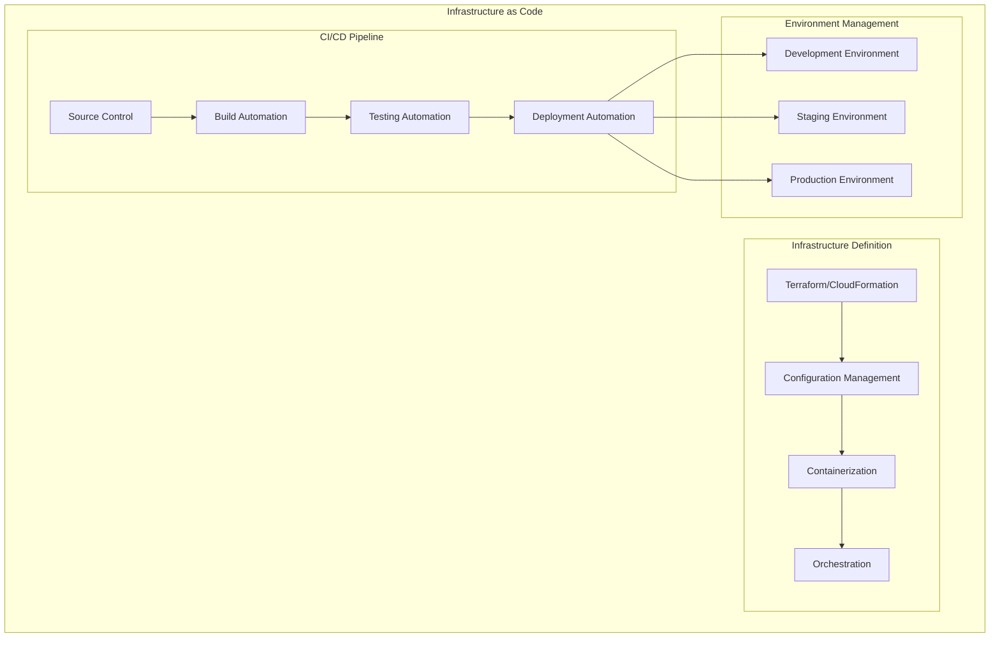

---

## 📚 Anexos

### Documentos de Referência

- [Link para especificações técnicas]
- [Link para documentação de APIs]
- [Link para guias de deployment]
- [Link para runbooks operacionais]

### Ferramentas Utilizadas

- **Diagramação**: Mermaid, Draw.io, Lucidchart
- **Documentação**: Markdown, Confluence
- **Versionamento**: Git, GitLab/GitHub

---

## 🔄 Templates Relacionados

### Templates DATAMETRIA

| Template | Descrição | Quando Usar |
|----------|-----------|-------------|
| **[Technical Specification](template-technical-specification.md)** | Especificação técnica detalhada | Documentação técnica completa |
| **[ADR](template-adr.md)** | Architectural Decision Records | Decisões arquiteturais importantes |
| **[API Documentation](template-api-documentation.md)** | Documentação de APIs | Interfaces e endpoints |
| **[Deployment Guide](template-deployment-guide.md)** | Guia de deployment | Processos de implantação |
| **[Security Assessment](template-security-assessment.md)** | Avaliação de segurança | Arquitetura de segurança |

### Diretrizes Relacionadas

| Diretriz | Aplicação | Link |
|----------|-----------|------|
| **[Web Development](datametria_std_web_dev.md)** | Arquitetura web | Flask + Vue.js + Docker |
| **[AWS Development](datametria_std_aws_development.md)** | Arquitetura cloud | Serverless + CDK |
| **[Mobile Flutter](datametria_std_mobile_flutter.md)** | Arquitetura mobile | Clean Architecture |
| **[Microservices Architecture](datametria_std_microservices_architecture.md)** | Microserviços | Arquitetura distribuída |

### Fluxo de Arquitetura

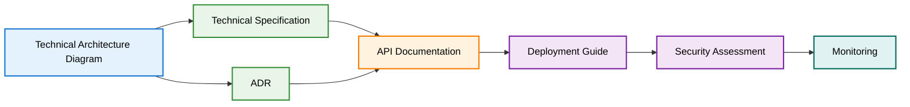

---

**Desenvolvido com ❤️ seguindo os padrões [DATAMETRIA](https://github.com/datametria/DATAMETRIA-standards)**

⭐ **Se este projeto te ajudou, considere dar uma estrela!** ⭐

