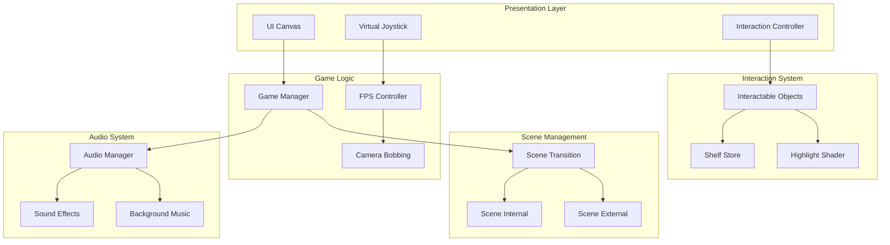
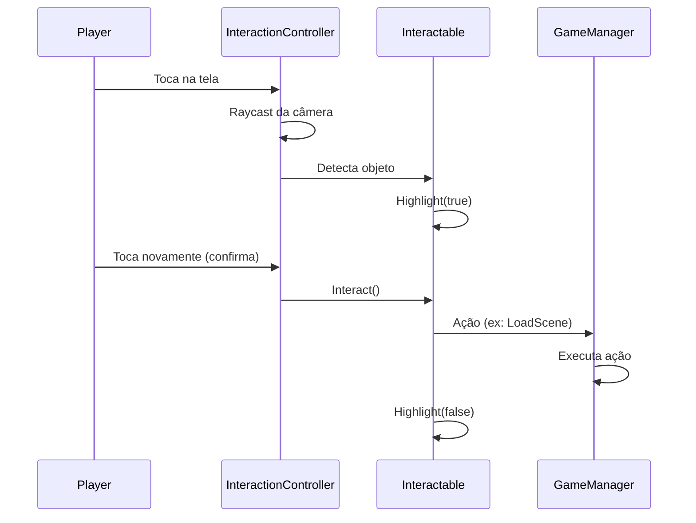
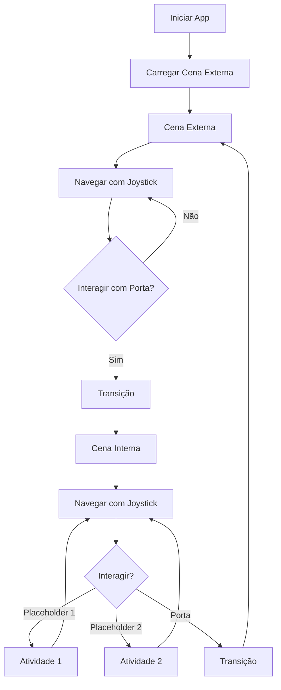

# Especificação Técnica - Jepp Vendinha Protótipo

**Projeto**: Protótipo Gamificação - Livro 1 Projeto Jepp  
**Versão**: 1.0.0  
**Data**: 17/11/2025  
**Autor**: Vander Loto - CTO DATAMETRIA  
**Status**: 🟡 Em Desenvolvimento

---

## 📋 Informações Básicas

| Campo | Valor |
|-------|-------|
| **Funcionalidade** | Protótipo educacional 3D mobile |
| **Cliente** | ELOEDITORIAL |
| **Data Início** | 10/11/2025 |
| **Data Entrega** | 21/11/2025 |
| **Prazo** | 11 dias |
| **Estimativa** | 80 horas |
| **Prioridade** | Alta |

---

## 🎯 Requisitos Funcionais

| ID | Requisito | Prioridade | Critério de Aceitação |
|----|-----------|------------|----------------------|
| **RF-001** | Navegação mobile FPS | Must Have | Joystick virtual + controle câmera touch funcionando |
| **RF-002** | Cena externa vendinha | Must Have | Modelo 3D carregado, navegável, 30+ FPS |
| **RF-003** | Cena interna vendinha | Must Have | Modelo 3D carregado, navegável, 30+ FPS |
| **RF-004** | Transição entre cenas | Must Have | Porta interativa, transição suave |
| **RF-005** | Sistema de interação | Must Have | Raycast detecta objetos, highlight visual |
| **RF-006** | Placeholder atividade 1 | Must Have | Área interativa preparada |
| **RF-007** | Placeholder atividade 2 | Must Have | Área interativa preparada |
| **RF-008** | Áudio ambiente | Should Have | Música de fundo + SFX |
| **RF-009** | Personagem Pamela | Could Have | Modelo 3D posicionado |

---

## 📋 Requisitos Não Funcionais

| ID | Categoria | Requisito | Métrica | Prioridade |
|----|-----------|-----------|---------|------------|
| **RNF-001** | Performance | FPS estável | 30+ FPS em dispositivos médios | Must Have |
| **RNF-002** | Performance | Tempo de carregamento | < 10s para iniciar | Must Have |
| **RNF-003** | Usabilidade | Controles intuitivos | Crianças 6-7 anos conseguem usar | Must Have |
| **RNF-004** | Compatibilidade | Android 7.0+ | API Level 24+ | Must Have |
| **RNF-005** | Tamanho | APK otimizado | < 150MB | Should Have |
| **RNF-006** | Memória | Uso de RAM | < 500MB | Should Have |

---

## 🏗️ Arquitetura da Solução

### Diagrama de Componentes



### Componentes Principais

#### GameManager
- **Responsabilidade**: Gerenciamento global do jogo
- **Tecnologia**: C# MonoBehaviour Singleton
- **Localização**: `Assets/JeppGame/Scripts/GameManager.cs`
- **Dependências**: SceneManager, AudioManager
- **Interfaces**: Controle de estado, transições de cena

#### MobileFPSController
- **Responsabilidade**: Controle de movimento mobile
- **Tecnologia**: New Input System
- **Localização**: `Assets/JeppGame/Scripts/MobileFPSController_InputSystem.cs`
- **Dependências**: VirtualJoystick, CharacterController
- **Interfaces**: Input touch, movimento, rotação câmera

#### InteractionController
- **Responsabilidade**: Sistema de interação com objetos
- **Tecnologia**: Raycast system
- **Localização**: `Assets/JeppGame/Scripts/InteractionController.cs`
- **Dependências**: Interactable, Camera
- **Interfaces**: Detecção, highlight, ação

---

## 🔧 Design Técnico

### Modelo de Dados

#### Estrutura de Cenas

```
Scenes/
├── External.unity          → Cena externa vendinha
├── JeppGame.unity          → Cena interna vendinha (principal)
└── (futuro) MainMenu.unity → Menu inicial
```

#### Hierarquia de GameObjects

```
External Scene:
├── Player
│   ├── Camera (FPS)
│   ├── InteractionController
│   └── AudioListener
├── Environment
│   ├── Vendinha_Externa (modelo 3D)
│   ├── Lighting
│   └── Audio Sources
├── Interactables
│   └── Door (transição para interno)
└── UI Canvas
    └── VirtualJoystick

Internal Scene:
├── Player
│   ├── Camera (FPS)
│   ├── InteractionController
│   └── AudioListener
├── Environment
│   ├── Vendinha_Interna (modelo 3D)
│   ├── Lighting
│   └── Audio Sources
├── Interactables
│   ├── Door (transição para externo)
│   ├── Placeholder_Activity_1
│   ├── Placeholder_Activity_2
│   └── ShelfStore (prateleiras)
├── Characters
│   └── Pamela (a implementar)
└── UI Canvas
    └── VirtualJoystick
```

### Classes Principais

#### GameManager.cs

```csharp
public class GameManager : MonoBehaviour
{
    public static GameManager Instance { get; private set; }
    
    [Header("Scene Management")]
    public string externalSceneName = "External";
    public string internalSceneName = "JeppGame";
    
    [Header("Audio")]
    public AudioClip backgroundMusic;
    public AudioClip doorSound;
    public AudioClip bellSound;
    
    private AudioSource audioSource;
    
    void Awake()
    {
        if (Instance == null)
        {
            Instance = this;
            DontDestroyOnLoad(gameObject);
        }
        else
        {
            Destroy(gameObject);
        }
    }
    
    public void LoadScene(string sceneName)
    {
        SceneManager.LoadScene(sceneName);
    }
    
    public void PlaySound(AudioClip clip)
    {
        audioSource.PlayOneShot(clip);
    }
}
```

#### Interactable.cs

```csharp
public class Interactable : MonoBehaviour
{
    [Header("Interaction Settings")]
    public string interactionPrompt = "Pressione para interagir";
    public float interactionDistance = 3f;
    
    [Header("Visual Feedback")]
    public Material highlightMaterial;
    private Material originalMaterial;
    private Renderer objectRenderer;
    
    void Start()
    {
        objectRenderer = GetComponent<Renderer>();
        originalMaterial = objectRenderer.material;
    }
    
    public void Highlight(bool enable)
    {
        objectRenderer.material = enable ? highlightMaterial : originalMaterial;
    }
    
    public virtual void Interact()
    {
        // Override em classes derivadas
        Debug.Log($"Interagindo com {gameObject.name}");
    }
}
```

#### MobileFPSController_InputSystem.cs

```csharp
public class MobileFPSController_InputSystem : MonoBehaviour
{
    [Header("Movement")]
    public float moveSpeed = 3f;
    public float sprintSpeed = 5f;
    
    [Header("Camera")]
    public float lookSensitivity = 2f;
    public float maxLookAngle = 80f;
    
    private CharacterController controller;
    private Camera playerCamera;
    private Vector2 moveInput;
    private Vector2 lookInput;
    private float verticalRotation = 0f;
    
    void Start()
    {
        controller = GetComponent<CharacterController>();
        playerCamera = GetComponentInChildren<Camera>();
    }
    
    void Update()
    {
        HandleMovement();
        HandleRotation();
    }
    
    void HandleMovement()
    {
        Vector3 move = transform.right * moveInput.x + transform.forward * moveInput.y;
        controller.Move(move * moveSpeed * Time.deltaTime);
    }
    
    void HandleRotation()
    {
        // Rotação horizontal (Y)
        transform.Rotate(Vector3.up * lookInput.x * lookSensitivity);
        
        // Rotação vertical (X) - limitada
        verticalRotation -= lookInput.y * lookSensitivity;
        verticalRotation = Mathf.Clamp(verticalRotation, -maxLookAngle, maxLookAngle);
        playerCamera.transform.localRotation = Quaternion.Euler(verticalRotation, 0f, 0f);
    }
    
    public void SetMoveInput(Vector2 input)
    {
        moveInput = input;
    }
    
    public void SetLookInput(Vector2 input)
    {
        lookInput = input;
    }
}
```

---

## 🔄 Fluxos de Dados

### Fluxo de Interação



### Fluxo de Navegação



---

## 🧪 Testes e Validação

### Estratégia de Testes

#### Testes Manuais (Prioridade para Protótipo)

| ID | Cenário | Passos | Resultado Esperado |
|----|---------|--------|-------------------|
| **T-001** | Navegação básica | 1. Iniciar app<br>2. Mover joystick | Player se move suavemente |
| **T-002** | Rotação câmera | 1. Arrastar dedo na tela | Câmera rotaciona |
| **T-003** | Transição cenas | 1. Ir até porta<br>2. Tocar | Carrega outra cena |
| **T-004** | Interação objetos | 1. Olhar para objeto<br>2. Tocar | Highlight + ação |
| **T-005** | Performance | 1. Navegar 5min | FPS > 30 constante |
| **T-006** | Áudio | 1. Iniciar app | Música toca, SFX funcionam |

### Dispositivos de Teste

| Dispositivo | Android | RAM | GPU | Prioridade |
|-------------|---------|-----|-----|------------|
| Samsung Galaxy A52 | 11 | 6GB | Adreno 618 | Alta |
| Xiaomi Redmi Note 10 | 11 | 4GB | Adreno 610 | Alta |
| Motorola Moto G8 | 10 | 4GB | Adreno 610 | Média |

---

## 🔒 Considerações de Segurança

### Dados do Usuário
- ❌ Não coleta dados pessoais
- ❌ Não requer login
- ❌ Não acessa internet
- ✅ Offline-first

### Permissões Android
```xml
<!-- AndroidManifest.xml -->
<uses-permission android:name="android.permission.VIBRATE" />
<!-- Apenas vibração para feedback tátil -->
```

---

## ⚡ Performance e Escalabilidade

### Métricas de Performance

| Métrica | Objetivo | Método de Medição |
|---------|----------|-------------------|
| **FPS** | 30-60 FPS | Unity Profiler |
| **Tempo de Carregamento** | < 10s | Stopwatch |
| **Uso de RAM** | < 500MB | Android Profiler |
| **Tamanho APK** | < 150MB | Build output |
| **Draw Calls** | < 100 | Unity Stats |

### Otimizações Implementadas

#### URP Mobile Settings
```csharp
// Mobile_RPAsset configurações:
- Render Scale: 0.8
- MSAA: Disabled
- HDR: Disabled
- Shadow Resolution: 512
- Max Lights: 4
- Depth Texture: Disabled
```

#### Texturas
- Compressão: ASTC 6x6
- Max Size: 1024x1024
- Mipmaps: Enabled
- Aniso Level: 2

#### Modelos 3D
- Poly count: < 10k por modelo
- LOD: 3 níveis (100%, 50%, 25%)
- Mesh Compression: Medium

---

## 📊 Monitoramento

### Métricas de Build

```bash
# Build Android
Unity Version: 6000.2.8f1
Target: Android API 24+
Architecture: ARM64
Scripting Backend: IL2CPP
Compression: LZ4
```

### Checklist de Build

- [ ] URP Mobile Renderer ativo
- [ ] Texturas comprimidas (ASTC)
- [ ] IL2CPP configurado
- [ ] Stripping Level: Medium
- [ ] Managed Code Stripping: Enabled
- [ ] Optimize Mesh Data: Enabled
- [ ] Remove Unused Shaders: Enabled

---

## ⚠️ Riscos e Mitigações

| Risco | Probabilidade | Impacto | Mitigação |
|-------|---------------|---------|-----------|
| **Performance baixa em dispositivos antigos** | Média | Alto | URP otimizado, LOD system, testes em dispositivos médios |
| **Tamanho APK > 150MB** | Baixa | Médio | Compressão ASTC, asset optimization |
| **Controles difíceis para crianças** | Média | Alto | Testes com público-alvo, ajuste de sensibilidade |
| **Atraso na entrega (21/11)** | Baixa | Alto | Escopo MVP bem definido, features desejáveis opcionais |

---

## 📎 Anexos

### Estrutura de Pastas Atual

```
Jepp/Assets/
├── JeppGame/
│   ├── Scripts/
│   │   ├── GameManager.cs
│   │   ├── MobileFPSController_InputSystem.cs
│   │   ├── InteractionController.cs
│   │   ├── Interactable.cs
│   │   ├── ShelfStore.cs
│   │   ├── VirtualJoystick.cs
│   │   └── CameraBobbing.cs
│   ├── Scenes/
│   │   ├── External.unity
│   │   └── JeppGame.unity
│   ├── Models/
│   │   ├── Vendinha_Externa.fbx
│   │   └── Vendinha_Interna.fbx
│   ├── Mat/
│   │   ├── Highlight.mat
│   │   └── outline.shadergraph
│   └── Sounds/
│       ├── bell.mp3
│       ├── door.mp3
│       └── nature.mp3
├── Settings/
│   ├── Mobile_RPAsset.asset
│   └── Mobile_Renderer.asset
└── TextMesh Pro/
```

### Configurações de Build

```json
{
  "productName": "Jepp Vendinha",
  "companyName": "ELOEDITORIAL",
  "version": "1.0.0",
  "bundleIdentifier": "com.eloeditorial.jeppvendinha",
  "targetSdkVersion": 33,
  "minSdkVersion": 24,
  "scriptingBackend": "IL2CPP",
  "targetArchitectures": "ARM64"
}
```

---

## 🔗 Referências

### Documentação Relacionada
- [Project Conception](../project/project-conception.md)
- [Setup Guide](../project/setup-guide.md)
- [DATAMETRIA Unity Standards](../../.amazonq/rules/stacks/datametria_std_unity_ar_vr.md)

### Recursos Externos
- [Unity URP Documentation](https://docs.unity3d.com/Packages/com.unity.render-pipelines.universal@latest)
- [New Input System](https://docs.unity3d.com/Packages/com.unity.inputsystem@latest)
- [Android Optimization Guide](https://docs.unity3d.com/Manual/android-optimization.html)

---

**Versão**: 1.0.0  
**Última Atualização**: 17/11/2025  
**Status**: 🟡 Em Desenvolvimento  
**Próxima Revisão**: 20/11/2025 (pré-entrega)

**Autor**: Vander Loto - vander.loto@datametria.io
